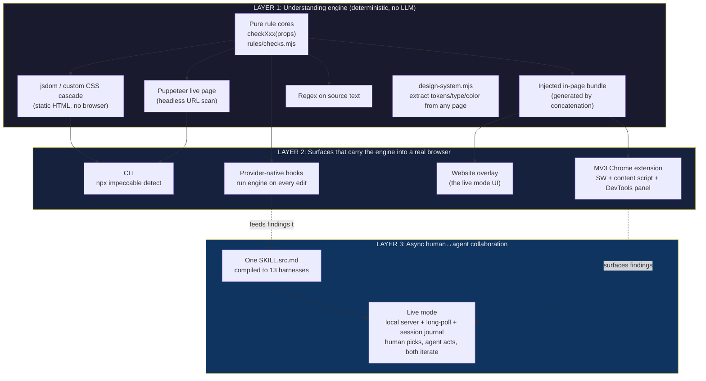
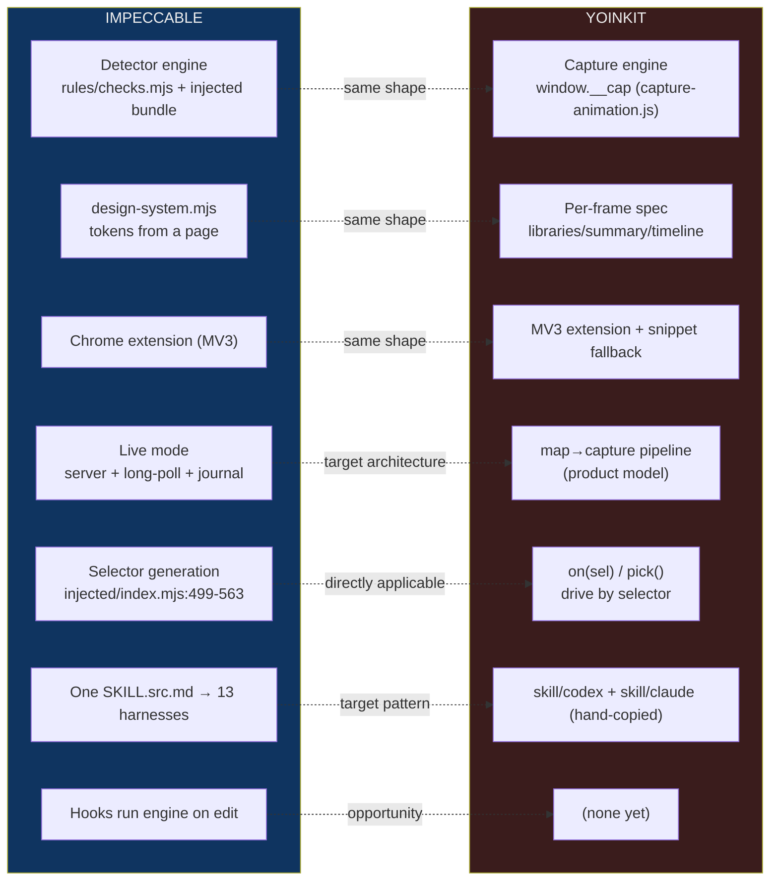

# Impeccable Deep Audit: Executive Summary

> Audit target: [github.com/pbakaus/impeccable](https://github.com/pbakaus/impeccable) (Paul Bakaus). Cloned at `audit/impeccable/source/` (gitignored).
> Audited: 2026-06-18. Six subsystem deep-dives live in [`reports/`](reports/); the YoinkIt payoff is in [`PATTERNS-FOR-YOINKIT.md`](PATTERNS-FOR-YOINKIT.md).

## What Impeccable is

On the surface, Impeccable is a design-quality tool for AI coding agents: one `/impeccable` skill exposing 23 sub-commands (`polish`, `audit`, `critique`, `animate`, ...), plus a standalone CLI and Chrome extension that run 44 deterministic anti-pattern rules with no LLM and no API key. It ships to roughly a dozen agent harnesses (Claude Code, Cursor, Codex, Gemini, OpenCode, Pi, Qoder, Trae, Rovo Dev, Kiro, GitHub Copilot).

That description undersells it. Underneath the design-advice product are **three reusable engines** that solve, almost one-for-one, the same problems YoinkIt solves. The instinct that prompted this audit is correct: this repo is a working reference implementation of "understand an arbitrary website, do it from a browser, and collaborate with an agent about it."

## The three layers (and why each one matters to us)

**Layer 1: the understanding engine.** A deterministic, no-LLM engine inspects arbitrary pages and emits structured *findings*, never code. The same ~40 rule cores run across four runtimes (jsdom + a hand-rolled CSS cascade, Puppeteer, an injected in-page bundle, and regex-on-source). The injected browser bundle is *generated by concatenation* from the same ES modules, so the live detector and the Node detector literally share code and cannot drift. There is also a `design-system.mjs` that extracts tokens, type, and color from any page. This is the direct analog of YoinkIt's capture engine: framework-agnostic, dependency-free, injected into third-party pages, emitting a spec.

**Layer 2: the surfaces.** The same engine is delivered through a CLI, an MV3 Chrome extension (service-worker hub, on-demand injection, CSP-proof two-tier injection ladder, ISOLATED↔MAIN bridge with a ready handshake), a website overlay, and provider-native hooks that run the engine on every file edit. This is YoinkIt's extension-plus-snippet-plus-driver story, already built and shipped to a store.

**Layer 3: the collaboration loop.** "Live mode" is the crown jewel. A zero-dependency local Node server bridges three processes that never share memory: a browser (human picks an element and an action), the server, and an agent (any harness that can run a shell command and read stdout). The transport is server-sent events to the browser and HTTP long-poll to the agent. Every browser intent is journaled to an append-only file before it is acted on, so the loop is crash-recoverable. This is YoinkIt's product model, implemented.

A separate but equally relevant achievement sits beside live mode: the **single-source skill distribution**. One `SKILL.src.md` plus a `reference/` tree compiles to 13 provider directories through about 170 lines of transformer code over two config tables. YoinkIt currently hand-maintains parallel `skill/codex/` and `skill/claude/` copies. This is the pattern that dissolves that duplication.

## How Impeccable maps onto YoinkIt

| YoinkIt concern | Impeccable's answer | Where |
|---|---|---|
| One engine, many drivers, no drift | Pure rule cores + thin adapters; injected bundle generated by concatenation | `rules/checks.mjs`, `scripts/build-extension.js:49-68` |
| Capture a spec from an arbitrary page | `design-system.mjs` token/type/color extraction | `cli/engine/design-system.mjs` |
| Drive by selector, never coordinates | Self-stabilizing selector generation + dual locator re-resolved on reload | `injected/index.mjs:499-563`, `live-browser.js:3474,4898` |
| Ship the engine in a Chrome extension | MV3 SW hub, on-demand injection, CSP two-tier ladder, MAIN-world bridge | `extension/*`, `content-script.js:113-123` |
| Async human↔agent loop in the browser | Local server + SSE + long-poll + append-only session journal | `live-server.mjs`, `live/session-store.mjs` |
| Stop hand-maintaining codex/claude copies | One `SKILL.src.md` compiled to N harnesses | `scripts/lib/transformers/*`, `factory.js` |
| Make the agent loop survive interruption | `resume` rebuilds state from the journal and prints the next safe action | `live-resume.mjs:78`, `session-store.mjs` |

## The one thing to internalize before stealing anything: the inversion

Impeccable and YoinkIt look identical but their physics are opposite. Reading the live-mode code without this framing will lead to copying the wrong half.

- **Impeccable writes code into the user's real source and leans on HMR.** Its agent owns the repo and the dev server. "Accept a variant" reduces to "delete the losing variants from the file." YoinkIt emits a spec and deliberately refuses to write code, so that trick does not transfer. What transfers is the *state machine* around it (instant draft, gated finalize), not the code-writing.
- **The bottlenecks are inverted.** YoinkIt's hard problem is the browser: headless will not fire framework motion handlers, so capture must run in a real visible tab. Impeccable's "capture" is trivial (read `outerHTML` and computed styles from an overlay it already injected). What Impeccable engineers around is *agent round-trip latency*, which it cut from about 40s to 15 to 20s with a wrap helper and batched writes. So when Impeccable optimizes, it is optimizing a problem YoinkIt does not have, and it takes for granted the problem YoinkIt does have.

Read every "pattern to steal" through that lens. The transport, the journal, the selector logic, the engine-build discipline, and the skill distribution all transfer cleanly. The "accept = keep the winner" mechanic and the assumption that rendering is free do not.

## Verdict

The instinct was right. Impeccable is the closest existing reference implementation of YoinkIt's architecture that this audit could hope to find, built by someone who clearly hit the same walls (selector drift across reloads, CSP, MAIN-world injection, arming before the engine is loaded, agent latency, multi-harness duplication) and shipped solutions to all of them. The highest-value takeaways, in order:

1. **Single-source skill distribution** (Layer 3). Smallest effort, immediate payoff: deletes YoinkIt's hand-maintained harness duplication. See [report 05](reports/05-skill-harness-distribution.md).
2. **The collaboration transport and session journal** (Layer 3). The architecture for YoinkIt's product model: long-poll as a harness-agnostic agent transport, SSE to the browser, append-only journal for crash recovery, secrets handed off by prepending them to the served script. See [report 03](reports/03-live-mode/03-live-mode.md).
3. **Selector generation and dual-locator re-resolution** (Layers 1 and 3). Directly drops into YoinkIt's `on(sel)` / `pick()`. See [report 03d](reports/03-live-mode/03d-overlay-picker-and-locators.md) and [report 01](reports/01-detector-engine/01-detector-engine.md).
4. **Engine-build discipline: one source, generated bundle, fail-open completeness** (Layer 1). Keeps the `__cap` engine from drifting across extension and snippet, and the "fail open on unknown formats" rule is a direct warning for a capture tool that must not silently under-capture. See [report 01](reports/01-detector-engine/01-detector-engine.md) and [report 02](reports/02-chrome-extension/02-chrome-extension.md).
5. **Extension injection patterns** (Layer 2). CSP two-tier ladder, on-demand injection, MAIN-world bridge with a ready handshake that solves the arm-before-loaded race. See [report 02](reports/02-chrome-extension/02-chrome-extension.md).

Full, prioritized, file-referenced recommendations are in [`PATTERNS-FOR-YOINKIT.md`](PATTERNS-FOR-YOINKIT.md).
