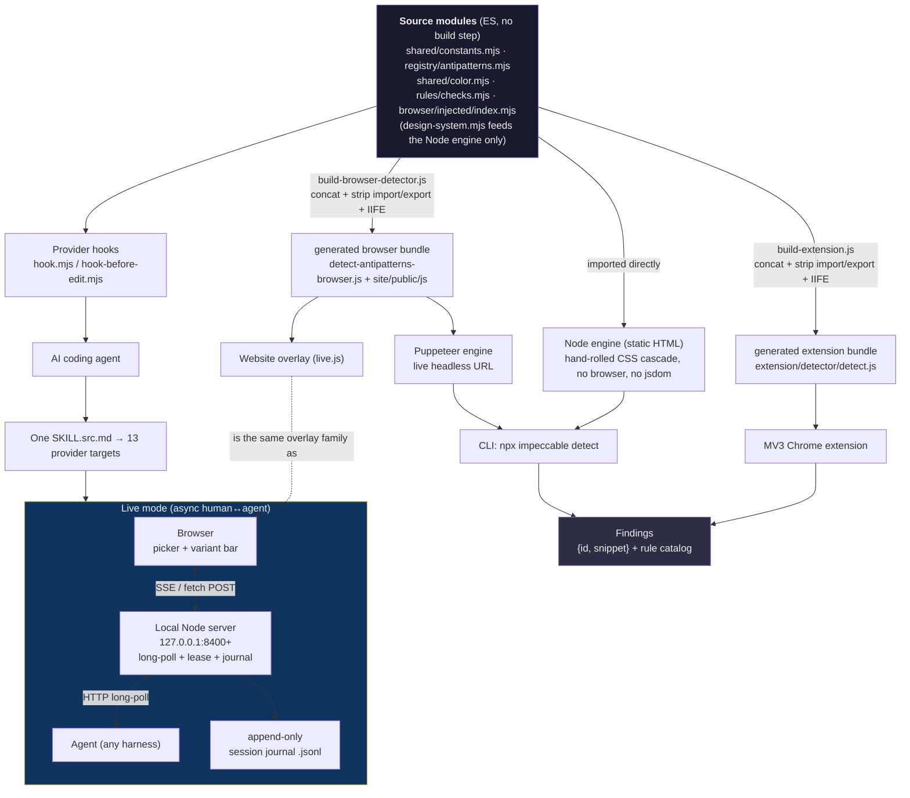
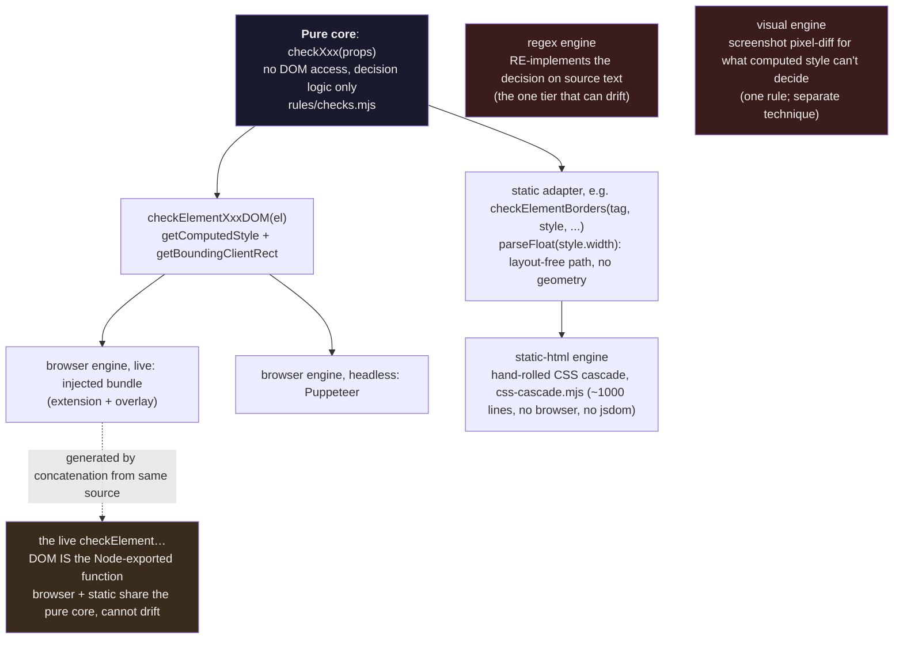

# Impeccable: Visual System Map

Consolidated diagrams for the audit. Dozens more per-subsystem diagrams live inside each report and its sub-dives under [`../reports/`](../reports/). The diagrams here are the cross-cutting ones plus a forward-looking target architecture for YoinkIt.

---

## 1. Full system map

How the three layers connect, end to end.



---

## 2. One pure core, four engines (the no-drift discipline)

The single most relevant Layer-1 pattern: one pure decision core, thin measurement adapters, and a generated in-page bundle so nothing can drift. The browser and static engines share the core; the regex engine re-implements the decision (the one tier that can drift); a screenshot pixel-diff tier backs the rules computed style cannot decide.



---

## 3. Live mode: the three-process loop at a glance

Three processes that never share memory. Browser speaks SSE, agent speaks long-poll, server is the only shared state and the only thing that persists.

```mermaid
sequenceDiagram
    participant H as Human
    participant B as Browser overlay
    participant S as Local server
    participant A as Agent
    participant J as Journal (.jsonl)

    A->>S: handshake (spawn server, inject script)
    A->>S: long-poll (park)
    B->>S: open SSE
    S-->>B: connected + "agent listening" beacon
    H->>B: pick element + action + Go
    B->>S: POST event {generate}
    S->>J: append BEFORE acting (durability precondition)
    S-->>A: release parked poll with event
    A->>A: act (Impeccable: write variants; YoinkIt: capture)
    A->>S: POST reply {done}
    S-->>B: SSE update
    H->>B: cycle / tune / Accept
    B->>S: POST event {accept}
    S->>J: append (before acting)
    S-->>A: release poll with {accept}
    A->>A: inline "ugly" draft write (poll client, no model in loop)
    Note over S,A: plain accept → complete at once;<br/>carbonize/crystallize accept → gated until the agent rewrites clean
    A->>S: finalize (carbonize / crystallize) when gated
    Note over H,J: kill agent or reload browser anytime →<br/>resume folds J back into state and prints the next safe action<br/>(state is a fold over J, not a guarded state machine)
```

---

## 4. Forward-looking: YoinkIt target architecture after adopting the top patterns

What YoinkIt could look like after pulling A1-A3 (single-source skill), B1-B4 (collaboration loop), C1-C3 (selector targeting), D1-D3/D5 (engine discipline), and E1-E4 (extension hardening). Green nodes are new or changed relative to today.

```mermaid
flowchart TB
    ENGSRC["<b>capture-animation.js</b> (single source)<br/>pure sampling core + thin adapters (D2)<br/>fail-open on unknown formats (D3)<br/>scrub own footprint (D5)"]

    ENGSRC -->|build-time concat, IIFE (D1)| BUNDLE["in-page __cap bundle"]
    BUNDLE --> EXT2["MV3 extension<br/>CSP two-tier injection (E1)<br/>MAIN-world + ready handshake (E2)<br/>on-demand inject (E3) + SW-survival (E4)"]
    BUNDLE --> SNIP["DevTools snippet fallback"]

    EXT2 --> PICK["pick() / on(sel)<br/>self-stabilizing selector (C1)<br/>dual locator re-resolved on reload (C2)<br/>own() + pickable() gate (C3)"]

    PICK --> CAP["timed capture<br/>settle→arm→trigger→wait→dump"]
    CAP -->|POST spec to collector<br/>secrets prepended to served engine (B3)| COLLECTOR

    subgraph LOOP["Collaboration loop (new)"]
        COLLECTOR["Local Node collector<br/>SSE to browser (B2)<br/>long-poll to agent (B1)<br/>presence beacon (B7)"]
        COLLECTOR --> SESS["session journal .jsonl (B4)<br/>durability precondition (B5)<br/>restart requeues (B6)"]
        COLLECTOR <-->|long-poll| AG["Agent (any harness)"]
    end

    AG --> SKILLSRC["<b>SKILL.src.md</b> (single source, A3)<br/>compiled to codex + claude + ... (A1)<br/>conditional driver blocks (A2)"]
    SKILLSRC -.drives.-> LOOP

    style ENGSRC fill:#14331f,color:#eee
    style BUNDLE fill:#14331f,color:#eee
    style EXT2 fill:#14331f,color:#eee
    style PICK fill:#14331f,color:#eee
    style LOOP fill:#14331f,color:#eee
    style COLLECTOR fill:#14331f,color:#eee
    style SESS fill:#14331f,color:#eee
    style SKILLSRC fill:#14331f,color:#eee
    style CAP fill:#2d2d44,color:#eee
    style SNIP fill:#2d2d44,color:#eee
    style AG fill:#2d2d44,color:#eee
```

This is a possibility map, not a committed plan. The point is that every green box has a concrete, file-referenced reference implementation in Impeccable. See [`../PATTERNS-FOR-YOINKIT.md`](../PATTERNS-FOR-YOINKIT.md) for the per-box justification and [`../00-EXECUTIVE-SUMMARY.md`](../00-EXECUTIVE-SUMMARY.md) for what NOT to carry over.
