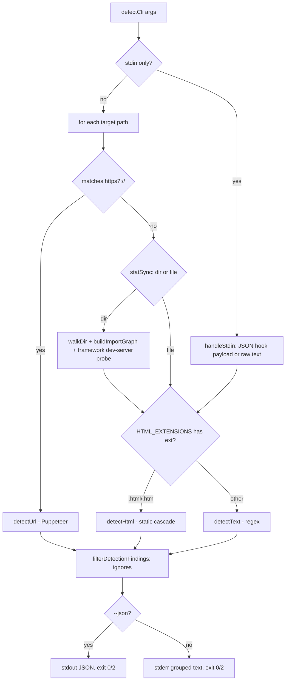
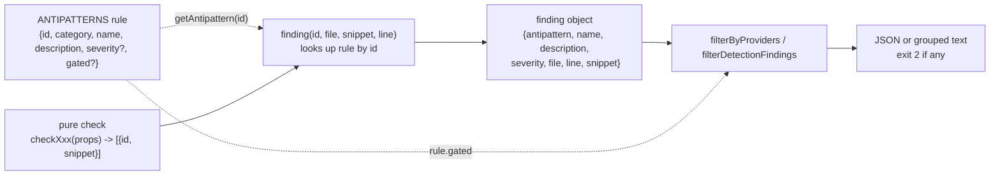
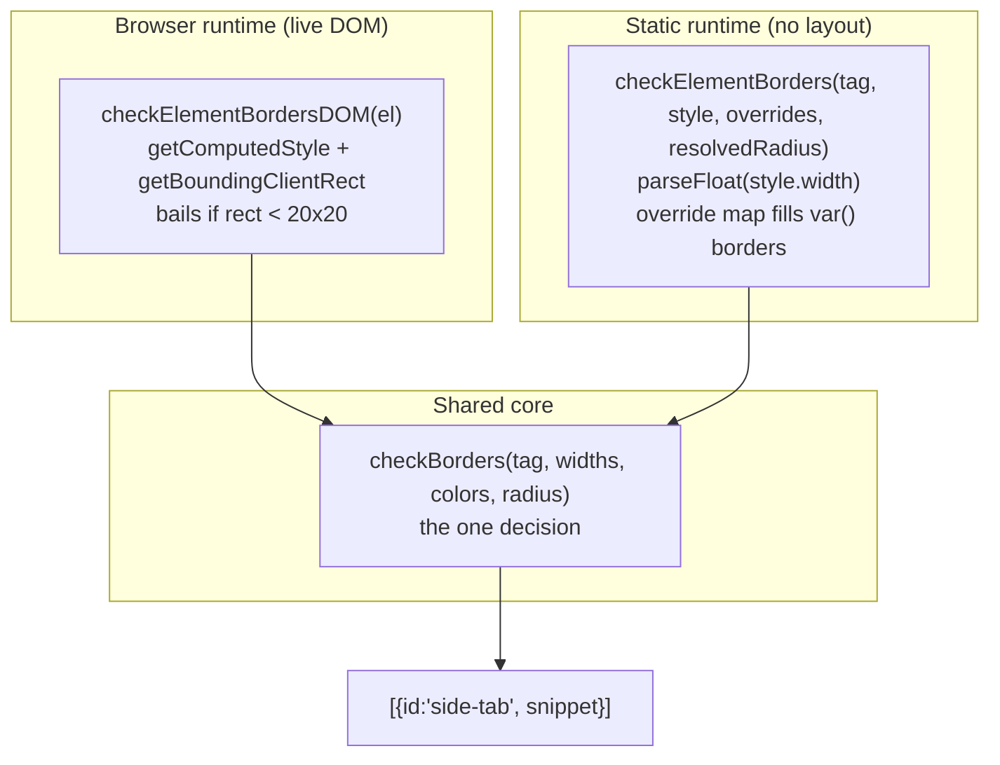
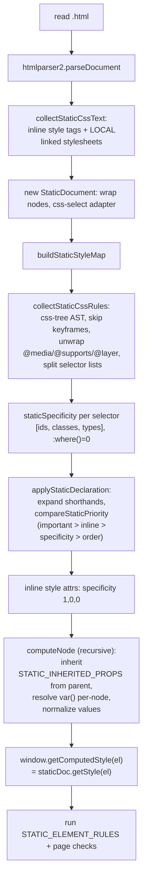

# Impeccable Detector Engine — Deep Technical Audit

**Subsystem:** the deterministic, no-LLM engine that inspects arbitrary
pages / HTML / CSS and emits structured *findings* (design anti-patterns +
a11y issues). **Audience:** the YoinkIt team. Everything is framed toward what
a capture/extraction tool that injects a single framework-agnostic engine into
arbitrary third-party pages can learn or steal.

Impeccable's detector solves a problem structurally identical to YoinkIt's: it
ships **one source-of-truth engine** that must run *both* in Node (no real
browser) *and* injected into a live page, against pages it does not control and
whose CSS uses every modern color/layout feature. The headline lessons are (1)
how it keeps a single rule body honest across three radically different
runtimes, (2) how it replaced jsdom with its own hand-rolled CSS cascade, and
(3) a three-tier visual-contrast measurement that escalates from cheap math to
real screenshot pixel-diffing — the closest analog in this codebase to "measure
what the page actually does, in a real browser."

All paths are under `source/cli/`.

> **Deep dives (added after this first draft).** This report is the overview. Four
> companion documents go to the floor on the parts a fresh agent would reason about
> or copy, and they correct a few first-draft inaccuracies (flagged inline below):
>
> - [`01a-rule-trinity-and-dispatch.md`](01a-rule-trinity-and-dispatch.md): the pure-core + two-adapter trinity traced end to end, the generated-bundle mechanism, and the full **rule×engine matrix** (all 44 rules across 4 engines).
> - [`01b-css-cascade-engine.md`](01b-css-cascade-engine.md): the hand-rolled CSS cascade algorithm by algorithm, its fidelity gaps, and the dead-code finding.
> - [`01c-color-and-contrast-tiers.md`](01c-color-and-contrast-tiers.md): color science and the three-tier contrast escalation in full (in-page canvas sampling plus the screenshot render-twice-and-diff).
> - [`01d-selector-and-footprint.md`](01d-selector-and-footprint.md): selector generation, text-rect measurement, and footprint scrubbing (drops into `pick()` / `on(sel)` / `scan()`).

---

## File map

Click-through index of the subsystem (relative to `source/`):

| File | Lines | Role |
|---|---|---|
| [`cli/bin/cli.js`](../../source/cli/bin/cli.js) | 80 | Top-level CLI dispatch (`detect` / `ignores` / `skills`) |
| [`cli/engine/detect-antipatterns.mjs`](../../source/cli/engine/detect-antipatterns.mjs) | 50 | Public API facade + main-module guard |
| [`cli/engine/cli/main.mjs`](../../source/cli/engine/cli/main.mjs) | 268 | `detectCli()` orchestration, input-type routing, output formatting |
| [`cli/engine/registry/antipatterns.mjs`](../../source/cli/engine/registry/antipatterns.mjs) | 448 | `ANTIPATTERNS` rule catalog + engine-support matrix + provider gating |
| [`cli/engine/findings.mjs`](../../source/cli/engine/findings.mjs) | 12 | `finding()` — turns `{id,snippet}` into a full finding object |
| [`cli/engine/profile/profiler.mjs`](../../source/cli/engine/profile/profiler.mjs) | 166 | Optional per-rule timing instrumentation |
| [`cli/engine/rules/checks.mjs`](../../source/cli/engine/rules/checks.mjs) | 2671 | **The rule logic.** Pure checks + DOM adapters + jsdom adapters |
| [`cli/engine/shared/constants.mjs`](../../source/cli/engine/shared/constants.mjs) | 101 | Tag/font sets, WCAG thresholds, brand-font allowlist |
| [`cli/engine/shared/color.mjs`](../../source/cli/engine/shared/color.mjs) | 124 | Color parse / luminance / contrast / hue / chroma |
| [`cli/engine/shared/page.mjs`](../../source/cli/engine/shared/page.mjs) | 7 | `isFullPage()` heuristic |
| [`cli/engine/node/file-system.mjs`](../../source/cli/engine/node/file-system.mjs) | 198 | Dir walk, import graph, framework dev-server fingerprinting |
| [`cli/engine/design-system.mjs`](../../source/cli/engine/design-system.mjs) | 750 | DESIGN.md / sidecar token extraction + drift checks |
| **Four engines + dispatch** | | |
| [`cli/engine/engines/regex/detect-text.mjs`](../../source/cli/engine/engines/regex/detect-text.mjs) | 564 | Engine 1: regex over source text (CSS/JSX/TSX/Vue/Svelte) |
| [`cli/engine/engines/static-html/detect-html.mjs`](../../source/cli/engine/engines/static-html/detect-html.mjs) | 229 | Engine 2: static HTML driver (rule table + page checks) |
| [`cli/engine/engines/static-html/css-cascade.mjs`](../../source/cli/engine/engines/static-html/css-cascade.mjs) | 1015 | Engine 2's heart: a **hand-rolled CSS cascade** (no jsdom) |
| [`cli/engine/engines/browser/detect-url.mjs`](../../source/cli/engine/engines/browser/detect-url.mjs) | 277 | Engine 3: Puppeteer driver — inject, scan, fallback |
| [`cli/engine/engines/visual/screenshot-contrast.mjs`](../../source/cli/engine/engines/visual/screenshot-contrast.mjs) | 189 | Engine 4: before/after screenshot pixel-diff contrast |
| **Injected into the live page** | | |
| [`cli/engine/browser/injected/index.mjs`](../../source/cli/engine/browser/injected/index.mjs) | 1937 | The in-page engine: overlays, selector-gen, in-page contrast, `window.impeccable*` API |
| `cli/engine/detect-antipatterns-browser.js` | 5138 | **Generated** IIFE bundle of the above (do not edit) |

---

## 1. Architecture & engine dispatch

### Entry points

- Process entry: [`cli/bin/cli.js:51-69`](../../source/cli/bin/cli.js) routes
  `detect` (and bare args) into `detectCli()`.
- Engine facade: [`cli/engine/detect-antipatterns.mjs:48-50`](../../source/cli/engine/detect-antipatterns.mjs)
  — a main-module guard so the same module is both an importable library and an
  executable. This file is pure re-exports; the runtime engines live under
  `engines/`.
- Orchestrator: [`cli/engine/cli/main.mjs:113`](../../source/cli/engine/cli/main.mjs)
  `async function detectCli()`.

### Dispatch is by **input type**, not by flag

`detectCli` resolves CLI args into scan options (providers, design system,
config), then routes each target to one of four engines purely by what the
target *is* ([`cli/engine/cli/main.mjs:147-251`](../../source/cli/engine/cli/main.mjs)):



Key dispatch facts:
- **URLs** → `detectUrl` (Puppeteer). When >1 URL is passed, a single shared
  browser is created via `createBrowserDetector()` and reused
  ([`main.mjs:152-161`](../../source/cli/engine/cli/main.mjs)).
- **`.html`/`.htm` files** → `detectHtml` (the static cascade engine).
- **Everything else** (`.css/.scss/.jsx/.tsx/.vue/.svelte/.js/.ts`) →
  `detectText` (regex).
- **stdin** → `handleStdin` ([`main.mjs:50-63`](../../source/cli/engine/cli/main.mjs))
  understands a Claude-Code hook payload shape (`{tool_input:{file_path}}`) and
  re-routes to the file's matching engine, else treats stdin as raw text. This
  is how the detector plugs into an agent's edit hook.
- **Directories** build an **import graph** first
  ([`main.mjs:214-239`](../../source/cli/engine/cli/main.mjs)) so a finding in
  `tokens.css` can be annotated `(imported by Button.tsx)`.
- **Exit code 2** when any finding exists ([`main.mjs:262`](../../source/cli/engine/cli/main.mjs))
  — a lint-style contract so CI / pre-commit can gate on it.

### The four engines and what each covers

The registry declares which rule *scopes* each engine supports
([`registry/antipatterns.mjs:403-408`](../../source/cli/engine/registry/antipatterns.mjs)):

```js
const RULE_ENGINE_SUPPORT = {
  regex: new Set(['source', 'page-analyzer']),
  'static-html': new Set(['element', 'page']),
  browser: new Set(['element', 'page', 'layout']),
  visual: new Set(['visual-contrast']),
};
```

The browser engine is the only one that can do `layout` (it has real
`getBoundingClientRect`), and `visual` is its own engine because pixel
measurement is fundamentally different from rule evaluation.

### A historical surprise: `--fast` / jsdom were removed

[`main.mjs:122-130`](../../source/cli/engine/cli/main.mjs) documents that `--fast`
(regex-only) is now a deprecated no-op: *"since the jsdom removal, the static
HTML/CSS analysis is fast and covers every rule."* Impeccable used to depend on
jsdom, hit its limits (see §3), and **wrote its own cascade engine** to replace
it (§5). The repo's `CLAUDE.md` still warns "always use `node` not `bun`,
because Bun's jsdom is extremely slow" — a fossil of the jsdom era.

---

## 2. The rule / finding / profile data model

### A rule (catalog entry)

Rules are plain objects in one array,
[`registry/antipatterns.mjs:1-401`](../../source/cli/engine/registry/antipatterns.mjs).
Verbatim shape (the side-tab rule):

```js
{
  id: 'side-tab',
  category: 'slop',                 // 'slop' (AI tell) | 'quality' (real design/a11y)
  name: 'Side-tab accent border',
  description: 'Thick colored border on one side of a card …',
  skillSection: 'Visual Details',   // optional: links rule → human design guidance
  skillGuideline: 'colored accent stripe',
}
```

Optional fields seen across the catalog: `severity` (`'warning'` default, plus
`'advisory'`), and `gated` (`'gpt'` | `'gemini'`) for provider-specific tells
that are off by default. There are exactly **44 rules** (26 `slop`, 18 `quality`; 4 provider-gated, 8 `advisory`); the full rule-by-engine matrix is in [`01a`](01a-rule-trinity-and-dispatch.md). The `id` is the join key that
threads through every layer.

### A finding (emitted result)

Every engine produces internal `{ id, snippet }` pairs, then wraps them with the
catalog metadata through one tiny factory
([`findings.mjs:7-10`](../../source/cli/engine/findings.mjs)):

```js
function finding(id, filePath, snippet, line = 0) {
  const ap = getAP(id);
  return { antipattern: id, name: ap.name, description: ap.description,
           severity: ap.severity || 'warning', file: filePath, line, snippet };
}
```

So a finding is `{ antipattern, name, description, severity, file, line, snippet }`,
optionally decorated downstream with `importedBy` (multi-file context) and
`ignoreValue` (the literal value a user can suppress). The browser path carries
a richer serialized shape adding `selector`, `rect`, `category`, `isPageLevel`,
`isHidden` ([`injected/index.mjs:1212-1233`](../../source/cli/engine/browser/injected/index.mjs)).



The data flow has a clean invariant: **checks never name themselves** beyond an
`id`; all human-readable metadata is resolved once, centrally, from the
registry. Adding a rule means: add a catalog entry, write a pure check + two
adapters, wire it into the engine loops. (The repo's `CLAUDE.md` enshrines this
as a TDD-ordered, "5 places stay in sync" ritual.)

### Provider gating

[`registry/antipatterns.mjs:430-438`](../../source/cli/engine/registry/antipatterns.mjs)
filters findings whose rule has a `gated` tag unless that provider was enabled
(`--gpt`/`--gemini`). Crucially, **gating is an output-time concern**: the
browser path deliberately runs *all* rules (running checks in a live browser is
free) and only the Node return paths filter
([`injected/index.mjs:1461-1464`](../../source/cli/engine/browser/injected/index.mjs)).

### The profiler

[`profiler.mjs`](../../source/cli/engine/profile/profiler.mjs) is an optional,
zero-overhead-when-absent instrument. `profileFindings(profile, meta, cb)`
([`profiler.mjs:41-52`](../../source/cli/engine/profile/profiler.mjs)) wraps a
check, records `{engine, phase, ruleId, target, ms, findings, findingIds}`, and
`summarizeDetectorProfile` ([`profiler.mjs:104-153`](../../source/cli/engine/profile/profiler.mjs))
groups + computes p50/p95 per rule. Every engine threads an optional `profile`
through the same `engine/phase/ruleId/target` vocabulary — a uniform telemetry
contract across four very different runtimes.

---

## 3. The "same rules across runtimes" pattern

This is the most directly transferable idea for YoinkIt. Impeccable runs the
*same rule semantics* in three runtimes that disagree about almost everything:

1. **Node + custom cascade** (`detectHtml` over `.html`) — no layout, computed
   styles synthesized by hand.
2. **Live browser, injected** (`injected/index.mjs`, bundled to
   `detect-antipatterns-browser.js`, run by Puppeteer *and* the extension *and*
   the live overlay) — real `getComputedStyle` + `getBoundingClientRect`.
3. **Regex over raw source** (`detectText`) — no DOM at all, pattern matching.

> **Naming note (post-draft):** the second runtime is labeled "jsdom/static" both
> here and in the code's own comments, but **jsdom was removed** (it is not a
> dependency and is imported nowhere in `cli/engine`). Those adapters now run
> against the hand-rolled `StaticDocument` façade from
> [`01b`](01b-css-cascade-engine.md), not jsdom. Read "jsdom adapter" as "no-layout
> Node adapter." The modern-CSS gotchas listed below are real history; the cascade
> in [`01b`](01b-css-cascade-engine.md) is how most are now fixed at the source
> rather than worked around at the rule.

### The trinity: pure core + two adapters

For most element rules, `rules/checks.mjs` defines **three** functions:

| Layer | Example | Reads from |
|---|---|---|
| Pure check | `checkBorders(tag, widths, colors, radius)` ([`checks.mjs:26`](../../source/cli/engine/rules/checks.mjs)) | plain values only — **no DOM** |
| Browser adapter | `checkElementBordersDOM(el)` ([`checks.mjs:755`](../../source/cli/engine/rules/checks.mjs)) | `getComputedStyle` + `getBoundingClientRect` |
| jsdom/static adapter | `checkElementBorders(tag, style, overrides, resolvedRadius)` ([`checks.mjs:1718`](../../source/cli/engine/rules/checks.mjs)) | `parseFloat(style.width)`, raw inline style, pre-resolved overrides |

The pure check holds the *decision* (thresholds, side-dominance logic, snippet
text). The adapters only do **measurement acquisition** and feed identical
props in. This means the side-tab heuristic exists once; the runtimes differ
only in how they read a border width.



### What is shared vs forked

- **Shared, imported by everything:** `shared/color.mjs`,
  `shared/constants.mjs`, and the pure `checkXxx` bodies + helpers in
  `checks.mjs`. The full export surface is one block at
  [`checks.mjs:2600-2671`](../../source/cli/engine/rules/checks.mjs).
- **The browser bundle is not a fork — it is concatenated source.**
  `detect-antipatterns-browser.js` is *generated* (`bun run build:browser`):
  its header says `GENERATED -- Source: cli/engine/browser/injected/index.mjs`
  and the body literally inlines `shared/constants.mjs`, `shared/color.mjs`,
  `rules/checks.mjs`, then `injected/index.mjs` into one IIFE. So the live
  detector's `checkElementBordersDOM` *is* the node-exported one. Single source
  of truth, enforced by a build step + the CLAUDE.md "5 places sync" table.
- **Runtime branch flag:** `const DETECTOR_IS_BROWSER = typeof window !== 'undefined'`
  ([`checks.mjs:22`](../../source/cli/engine/rules/checks.mjs)). Shared helpers
  branch *internally* on it rather than duplicating, e.g. `resolveBackground`
  ([`checks.mjs:640`](../../source/cli/engine/rules/checks.mjs)):
  ```js
  const style = DETECTOR_IS_BROWSER ? getComputedStyle(current) : win.getComputedStyle(current);
  ```
- **The static-html engine wires the jsdom-style adapters in a table**
  ([`detect-html.mjs:91-104`](../../source/cli/engine/engines/static-html/detect-html.mjs));
  the browser engine wires the `*DOM` adapters in a flat per-element loop
  ([`injected/index.mjs:1478-1492`](../../source/cli/engine/browser/injected/index.mjs)).
  Same rule ids, two call sites — exactly the "wire both into both loops"
  hazard the repo CLAUDE.md flags as "the most common mistake."

### The documented gotchas (the no-layout / shorthand / color tax)

These are scar tissue from running rules without a browser — they read as a
field guide for YoinkIt:

1. **jsdom / static do no layout.** `getBoundingClientRect()` returns 0×0, so
   element rules can't gate on rendered size. The static path reads
   `parseFloat(style.width)` from explicit CSS instead, and the icon-tile check
   *skips its vertical-stacking gate* with `headingTop: 0`
   ([`checks.mjs:1825`](../../source/cli/engine/rules/checks.mjs)). The browser
   adapter, by contrast, *can* bail early on `rect.width < 20`
   ([`checks.mjs:759`](../../source/cli/engine/rules/checks.mjs)). The pure
   `checkIconTile` tolerates both by treating 0 as "unknown, don't gate"
   ([`checks.mjs:212`](../../source/cli/engine/rules/checks.mjs)).
2. **`background:` shorthand isn't decomposed in jsdom.** A page that sets
   `background: var(--paper) radial-gradient(...)` shows up with an empty
   `backgroundColor`. `resolveBackground` therefore peeks at the **raw inline
   `style` attribute** and re-parses it
   ([`checks.mjs:659-667`](../../source/cli/engine/rules/checks.mjs)), and
   `resolveGradientStops` does the same for gradient stops
   ([`checks.mjs:708-716`](../../source/cli/engine/rules/checks.mjs)). (The custom
   cascade in §5 fixes this properly by decomposing the shorthand itself.)
3. **Computed colors aren't normalized off-browser.** jsdom returns the literal
   `oklch(...)` / `var(--x)` string, not `rgb(...)`. Three defenses:
   - `isNeutralColor` ([`color.mjs:3-52`](../../source/cli/engine/shared/color.mjs))
     parses chroma directly from **rgb/oklch/lch/oklab/lab/hsl/hwb**, with a
     load-bearing final default: *unknown format → return `false` (treat as
     tinted/detectable)*. The comment calls the old "skip unknown" default
     "the root cause of the oklch bug."
   - `oklchToRgb` ([`checks.mjs:925-946`](../../source/cli/engine/rules/checks.mjs))
     is a full Björn-Ottosson OKLCH→sRGB conversion, *"because jsdom doesn't
     compute oklch() … without this, the entire Tailwind v4 color palette is
     invisible to the detector."*
   - `parseColorResolved` → `resolveVarRefs` (recurses ≤8 levels through a
     `--custom-prop` map) → `parseAnyColor`
     ([`checks.mjs:909-1002`](../../source/cli/engine/rules/checks.mjs)). The
     OKLCH regex even tolerates Tailwind's minified `"21.5%.02 50"` (missing
     space after `%`) ([`checks.mjs:981`](../../source/cli/engine/rules/checks.mjs)).
4. **Borders with `var()` vanish in jsdom.** A whole pre-pass,
   `buildBorderOverrideMap` ([`css-cascade.mjs:74-185`](../../source/cli/engine/engines/static-html/css-cascade.mjs)),
   resolves `:root` custom props against the (correctly computed) document-element
   style and hands resolved width/color to `checkElementBorders` as `overrides`,
   which fills only the sides jsdom left empty
   ([`checks.mjs:1729-1736`](../../source/cli/engine/rules/checks.mjs)).
   **Correction (see [`01b`](01b-css-cascade-engine.md) §7): this pre-pass is now
   vestigial dead code.** The static driver passes `overrides: null` and the
   css-tree cascade resolves border `var()` itself; `buildBorderOverrideMap` is
   never called anywhere in the source tree.
5. **jsdom UA `:link{color:blue}` false positives.** Real Chrome wraps `:link`
   in zero-specificity `:where()`; jsdom doesn't, so `a{color:inherit}` *loses*
   off-browser. `checkElementColors` detects literal link-blue
   (`rgb(0,0,238)`) on anchors and walks to the nearest non-anchor ancestor for
   the real color ([`checks.mjs:1759-1784`](../../source/cli/engine/rules/checks.mjs)).

The takeaway for YoinkIt: a no-browser path is achievable but pays a
**continuous tax** in modern-CSS edge cases (OKLCH, `var()`, shorthands,
UA-stylesheet divergence). Impeccable's bet — measured in `--fast`'s removal —
is that the real-browser path is worth keeping authoritative.

---

## 4. Design-system / token extraction

[`design-system.mjs`](../../source/cli/engine/design-system.mjs) extracts an
allowlist of fonts / colors / radii from a project's `DESIGN.md` and an optional
`.impeccable/design.json` sidecar, then flags any literal value that drifts
outside it. Pipeline:

1. **Locate.** `resolveDesignMdPath` looks for `DESIGN.md` in cwd, then
   `.agents/context/`, then `docs/`
   ([`design-system.mjs:8-9,29-40`](../../source/cli/engine/design-system.mjs)).
2. **Parse frontmatter.** A *dependency-free* YAML subset parser
   (`parseFrontmatter`/`parseYamlSubset`,
   [`design-system.mjs:53-145`](../../source/cli/engine/design-system.mjs)) — handles
   nested keys, inline comments, quoted keys, scalars. It deliberately avoids a
   YAML library to stay self-contained.
3. **Normalize into lookup structures** (`normalizeDesignSystem`,
   [`design-system.mjs:332-356`](../../source/cli/engine/design-system.mjs)):
   ```js
   { present, allowedFonts: Set<string>,
     allowedColorKeys: Map<key,{color:{r,g,b,a}, label}>,
     allowedRadii: [{px, …}], hasPillRadius,
     hasFonts, hasColors, hasRadii }
   ```
   Colors are stored as parsed RGB (incl. an inline `hslToRgb`,
   [`design-system.mjs:203-223`](../../source/cli/engine/design-system.mjs)) so
   matching is tolerant: `colorsClose` allows ±`COLOR_CHANNEL_TOLERANCE = 6`
   per channel ([`design-system.mjs:10,194-201`](../../source/cli/engine/design-system.mjs));
   radii allow ±0.5px; `hasPillRadius` waives anything ≥99px.
4. **Two detection surfaces:**
   - **Source scan** `checkSourceDesignSystem`
     ([`design-system.mjs:512`](../../source/cli/engine/design-system.mjs)) runs
     over raw text with regexes for color literals, `font-family`,
     `borderRadius`, Google-Fonts URLs, plus JS-object forms (`fontFamily:`,
     `borderRadius:`). It guards against false positives aggressively:
     `isProbablyColorLiteral` ([`:426`](../../source/cli/engine/design-system.mjs))
     requires a CSS/JS color *context* before the match and rejects HTML
     entities (`&#…`) and "PR #155"-style prose; `isInsideCssAttributeSelector`
     ([`:450`](../../source/cli/engine/design-system.mjs)) skips `[class~="…"]`.
   - **Rendered scan** `collectStaticDesignSystemFindings`
     ([`design-system.mjs:584`](../../source/cli/engine/design-system.mjs)) walks
     the resolved DOM, checks the *computed* font/color/border-color/radius of
     each visible element, dedupes by value, and skips hidden subtrees
     (`shouldSkipStaticDesignElement`, [`:658`](../../source/cli/engine/design-system.mjs)).
5. **Merge + dedupe.** `mergeDesignSystemFindings` /
   `canonicalDesignFindingKey` ([`design-system.mjs:681-738`](../../source/cli/engine/design-system.mjs))
   collapses the source-side and render-side hits so a single offending color
   isn't reported twice.

The same design system is mirrored into the **browser** path: `detect-url.mjs`
serializes it to plain `{r,g,b}`/`px` arrays for `page.evaluate`
([`detect-url.mjs:10-27`](../../source/cli/engine/engines/browser/detect-url.mjs)),
and `injected/index.mjs` re-implements the tolerance checks in-page
(`checkElementDesignSystemDOM`, `isBrowserDesignColorAllowed`,
[`injected/index.mjs:1307-1424`](../../source/cli/engine/browser/injected/index.mjs)).

**Why YoinkIt cares:** this is a worked example of *extracting a structured
design token system from an arbitrary page* (fonts, a tolerant color palette,
a radius scale) and serializing it across the Node↔browser boundary — adjacent
to YoinkIt's "emit an agent-ready spec" goal.

---

## 5. CSS cascade resolution from static HTML

`engines/static-html/css-cascade.mjs` is the standout engineering artifact: a
**from-scratch CSS cascade** that produces a `getComputedStyle`-shaped object
for offline `.html` files, using only off-the-shelf parsers
(`htmlparser2`, `css-tree`, `css-select`, `domutils`), no jsdom. The engine is
imported lazily and falls back to regex if those parsers are missing
([`detect-html.mjs:115-140`](../../source/cli/engine/engines/static-html/detect-html.mjs)).

Pipeline inside `detectHtml`
([`detect-html.mjs:106-227`](../../source/cli/engine/engines/static-html/detect-html.mjs)):



The mechanism, concretely:

- **Cascade priority** — `compareStaticPriority(a,b)`
  ([`css-cascade.mjs:633-643`](../../source/cli/engine/engines/static-html/css-cascade.mjs))
  implements the real precedence order: `!important` > inline > specificity
  triple > source order.
- **Specificity** — `staticSpecificity`
  ([`css-cascade.mjs:645-655`](../../source/cli/engine/engines/static-html/css-cascade.mjs))
  counts `[ids, classes, types]` and **strips `:where(...)` to zero specificity**
  first — the same UA-divergence that bit the jsdom path (§3) is handled
  correctly here.
- **Shorthand expansion** — `expandStaticDeclaration`
  ([`css-cascade.mjs:523-631`](../../source/cli/engine/engines/static-html/css-cascade.mjs))
  decomposes `background`, `border`, `border-width/color`, `outline`,
  `padding`, `margin`, `font`, `transition`, `animation` into longhands. This is
  the proper fix for the "jsdom doesn't decompose `background`" gotcha — e.g.
  `background: var(--paper) radial-gradient(...)` is split into
  `backgroundImage` + a sniffed `backgroundColor`
  ([`:528-536`](../../source/cli/engine/engines/static-html/css-cascade.mjs)).
- **Custom-property inheritance** — `computeNode`
  ([`css-cascade.mjs:947-967`](../../source/cli/engine/engines/static-html/css-cascade.mjs))
  threads a per-node `customProps` Map down the tree, resolving `var()` with
  `resolveVarRefs` (the same helper the rules use), and copies only
  `STATIC_INHERITED_PROPS` from parent to child
  ([`:225-229`](../../source/cli/engine/engines/static-html/css-cascade.mjs)).
- **A DOM façade** — `StaticElement` / `StaticDocument`
  ([`css-cascade.mjs:721-844`](../../source/cli/engine/engines/static-html/css-cascade.mjs))
  implement just enough of the DOM (`parentElement`, `previousElementSibling`,
  `children`, `childNodes` with `nodeType` 3 text nodes, `querySelector*`,
  `closest`, `contains`, `className`, `getAttribute`) so the *same* jsdom-style
  rule adapters run unmodified. `buildStaticWindow`
  ([`:855-860`](../../source/cli/engine/engines/static-html/css-cascade.mjs)) hands
  back `{ document, getComputedStyle }` — a drop-in `window`.
- **`@layer` handling** — `collectStaticCssRules` walks into `@layer` blocks
  ([`:709-714`](../../source/cli/engine/engines/static-html/css-cascade.mjs)), and a
  separate `unwrapCssAtLayer` ([`:187-219`](../../source/cli/engine/engines/static-html/css-cascade.mjs))
  brace-balances and flattens `@layer { … }` wrappers — modern (Tailwind v4)
  CSS that jsdom mishandles. **Correction:** only the `collectStaticCssRules` AST
  walk is live; the standalone `unwrapCssAtLayer` string flattener is vestigial
  (never called tree-wide). See [`01b`](01b-css-cascade-engine.md) §7.
- **Local-only stylesheet inlining** — `collectStaticCssText`
  ([`:862-885`](../../source/cli/engine/engines/static-html/css-cascade.mjs)) reads
  `<link rel=stylesheet>` hrefs **from disk**, explicitly skipping
  `http(s)://` and protocol-relative URLs. (This is why the CLI advises scanning
  the running URL for "more accurate results.")

This is a ~1000-line standing investment to avoid jsdom — a strong signal about
how costly the no-real-browser path is, and how far a team will go to keep the
*rule code* runtime-agnostic.

---

## 6. Dependency-free / framework-agnostic discipline

The engine injects into arbitrary third-party pages and must assume nothing.
Concrete techniques worth copying:

- **The injected file is one IIFE with zero imports.** It's authored as
  `injected/index.mjs` but *bundled by concatenation* into
  `detect-antipatterns-browser.js` (an IIFE guarded by
  `if (typeof window === 'undefined') return;`). No module loader, no runtime
  deps. The same file serves three consumers (Puppeteer, MV3 extension, live
  overlay) selected by `EXTENSION_MODE`
  ([`injected/index.mjs:8-22`](../../source/cli/engine/browser/injected/index.mjs))
  and a `window.__IMPECCABLE_CONFIG__` global
  ([`detect-url.mjs:191-197`](../../source/cli/engine/engines/browser/detect-url.mjs)).
- **A namespaced public API on `window`** — `window.impeccableDetect`,
  `impeccableScan`, `impeccableScanAsync`, `impeccableCollectVisualContrastCandidates`,
  `impeccableAnalyzeVisualContrast`
  ([`injected/index.mjs:1930-1936`](../../source/cli/engine/browser/injected/index.mjs)).
  Structurally the same pattern as YoinkIt's `window.__cap`.
- **It scrubs its own footprint from results.** Every scan loop skips
  `.impeccable-*` overlay nodes, `[id^="impeccable-live-"]` inspector chrome,
  and other extensions' nodes (`claude-`, `cic-`)
  ([`injected/index.mjs:1466-1476`](../../source/cli/engine/browser/injected/index.mjs)),
  and it *clones the document and strips its own nodes* before the
  regex-on-HTML pass so its injected inline styles don't self-trigger
  ([`injected/index.mjs:1551-1558`](../../source/cli/engine/browser/injected/index.mjs)).
  Anyone injecting into a live page must not measure their own injection.
- **Feature-detect, degrade gracefully.** Uses `el.checkVisibility?.()` with an
  offsetWidth fallback ([`:1205-1210`](../../source/cli/engine/browser/injected/index.mjs)),
  `range.detach?.()`, `CSS.escape`, all `try/catch` around `querySelector` with
  caller-supplied selectors.
- **Hand-rolled parsers instead of libraries** in the dependency-free zone: the
  YAML subset parser (§4), the color parsers (§3), brace-balancing
  `unwrapCssAtLayer`, quote/paren-aware `splitCssList`/`splitCssTokens`
  ([`css-cascade.mjs:354-397`](../../source/cli/engine/engines/static-html/css-cascade.mjs)).
  Heavy parsers (`css-tree` et al.) are confined to the Node-only static engine
  and *lazily `import()`ed* so the package works even if they're absent.
- **Sandbox-aware Puppeteer launch.** `--no-sandbox` is added *only* under
  `process.env.CI` ([`detect-url.mjs:148`](../../source/cli/engine/engines/browser/detect-url.mjs)),
  keeping local runs hardened.

---

## 7. Patterns worth stealing for YoinkIt

Ranked by leverage for a capture/extraction tool:

1. **Three-tier visual measurement that escalates to real screenshot
   pixel-diffing.** This is the crown jewel and the closest analog to YoinkIt's
   "measure what the page actually does." Contrast is resolved by the cheapest
   method that works:
   - *Tier 1 — math:* parse computed `color`/bg, compute WCAG ratio in
     `checkColors` ([`checks.mjs:94-117`](../../source/cli/engine/rules/checks.mjs)).
   - *Tier 2 — in-page canvas sampling:* `analyzeVisualContrastCandidate`
     ([`injected/index.mjs:1087-1165`](../../source/cli/engine/browser/injected/index.mjs))
     samples actual painted background pixels at multiple text points, blends
     rgba over them (`blendRgba`), and reports a p10 ratio. When it hits a case
     it *cannot* trust off-pixels (`background-clip:text`, filters, blend modes,
     opacity stacks), it returns `status:'unresolved', reason:'… needs
     screenshot pixels'` ([`:1097-1107`](../../source/cli/engine/browser/injected/index.mjs)).
   - *Tier 3 — screenshot pixel-diff:* `captureVisualContrastCandidate`
     ([`screenshot-contrast.mjs:108-183`](../../source/cli/engine/engines/visual/screenshot-contrast.mjs))
     screenshots the clip, injects a style that makes *only the text*
     transparent, screenshots again, and **diffs the two images to isolate the
     exact glyph pixels** (`delta < 10 ⇒ not a glyph`,
     [`:65-84`](../../source/cli/engine/engines/visual/screenshot-contrast.mjs)),
     then measures fg-vs-revealed-bg contrast.
   The "render twice and diff to isolate what changed" move is a technique
   YoinkIt could lift wholesale — e.g. to isolate exactly which pixels an
   animation touched between two frames.

2. **Robust, self-stabilizing selector generation.** `generateSelector` /
   `buildSelectorSegment` ([`injected/index.mjs:499-563`](../../source/cli/engine/browser/injected/index.mjs))
   build a `:scope`-anchored selector that **drops framework-hashed classes**
   (`isLikelyHashedClass`, [`:491-497`](../../source/cli/engine/browser/injected/index.mjs)
   — catches `css-*`, `sc-*`, `_x8f3k`, alnum+digit hashes), anchors on the
   first ancestor `id`, **stops as soon as the partial selector is unique**, and
   disambiguates siblings with `:nth-of-type`. This is a near-perfect fit for
   YoinkIt's documented rule *"drive by selector, never coordinates."* It even
   round-trips: candidates carry a selector, and the screenshot/analyze passes
   re-resolve it live and mark `status:'unresolved', reason:'stale selector'` if
   the DOM moved.

3. **One source-of-truth engine, two wirings, enforced by a build step.** The
   `checkXxx` (pure) + `checkElementXxxDOM` (browser) + `checkElementXxx(…,
   window)` (offline) trinity, with the live bundle *generated by
   concatenation* from the same modules
   (`detect-antipatterns-browser.js` header; loops at
   [`detect-html.mjs:91-104`](../../source/cli/engine/engines/static-html/detect-html.mjs)
   and [`injected/index.mjs:1478-1492`](../../source/cli/engine/browser/injected/index.mjs)).
   YoinkIt already lives this (one engine, extension + snippet) — the steal is
   the *discipline*: a pure decision core that takes plain props, thin adapters
   that only acquire measurements, and a generated bundle so the two can't drift.

4. **An optional, uniform profiler keyed by `engine/phase/ruleId/target`.**
   [`profiler.mjs`](../../source/cli/engine/profile/profiler.mjs) wraps every check
   with `profileFindings(profile, meta, cb)` and yields p50/p95 per rule across
   all runtimes — and it's a no-op when `profile` is absent
   ([`:41-43`](../../source/cli/engine/profile/profiler.mjs)). For YoinkIt this is
   a ready template for "where did capture spend its time / which layers
   produced spec entries," at zero cost when off.

5. **Framework dev-server fingerprinting before deciding how to capture.**
   `detectFrameworkConfig` + `isPortListening`
   ([`file-system.mjs:95-186`](../../source/cli/engine/node/file-system.mjs)) read
   `next.config.*` / `vite.config.*` / etc. for a port, then probe it and
   **verify the running server is actually that framework** via response header
   / body fingerprints (`x-powered-by`, `@vite/client`, `ng-version`). The CLI
   then nudges the user from static files to the live URL
   ([`main.mjs:174-195`](../../source/cli/engine/cli/main.mjs)). YoinkIt's contract
   is "map can be headless, capture needs the real running site" — this is a
   clean way to *detect the running site and steer the user/agent to it*.

Two more honorable mentions:
- **`isNeutralColor`'s fail-open default** — *unknown color format ⇒ treat as
  detectable, not skip* ([`color.mjs:48-51`](../../source/cli/engine/shared/color.mjs)).
  A capture tool that silently skips formats it doesn't recognize will quietly
  under-capture; Impeccable learned this the hard way ("the oklch bug").
- **Lazy, fall-through engine loading** — heavy deps (`puppeteer`, `css-tree`)
  are `import()`ed only when needed and degrade to the next-best engine on
  failure ([`detect-html.mjs:138-140`](../../source/cli/engine/engines/static-html/detect-html.mjs),
  [`detect-url.mjs:112-123`](../../source/cli/engine/engines/browser/detect-url.mjs)).

---

## Appendix: cross-cutting observations & surprises

- **They deleted jsdom and rebuilt the cascade.** The single most surprising
  finding: rather than live with jsdom's `var()`/shorthand/`:where()`/OKLCH
  gaps, Impeccable wrote `css-cascade.mjs` (~1000 lines). The `--fast` flag is a
  deprecated no-op tombstone of that migration
  ([`main.mjs:122-130`](../../source/cli/engine/cli/main.mjs)).
- **The browser path runs *more* rules than the CLI surfaces.** Provider gating
  is output-only; in-browser, every rule always runs because it's free
  ([`injected/index.mjs:1461-1464`](../../source/cli/engine/browser/injected/index.mjs)).
  A useful mental model: capture broadly, filter at emit time.
- **Two independent contrast pixel paths coexist** — in-page canvas sampling
  (Tier 2) *and* Puppeteer screenshot-diff (Tier 3) — with a documented handoff
  for the cases canvas can't read. They are not redundant; they cover disjoint
  failure modes (canvas can't see `background-clip:text`; screenshots can).
- **Heuristics are conservative by construction.** Nearly every rule has
  explicit false-positive escape hatches: brand-font allowlists per domain
  ([`constants.mjs:41-57`](../../source/cli/engine/shared/constants.mjs)), the
  styled-button exception to `SAFE_TAGS`
  ([`checks.mjs:74-77`](../../source/cli/engine/rules/checks.mjs)), the
  alpha-fallback contrast skip ([`checks.mjs:112`](../../source/cli/engine/rules/checks.mjs)),
  emoji-only-text skips ([`checks.mjs:59-63`](../../source/cli/engine/rules/checks.mjs)).
  The cost of a deterministic engine on arbitrary pages is a long tail of
  "don't flag this legitimate case" — budget for it.
