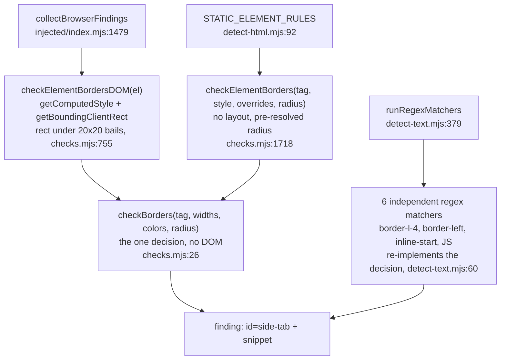

# Detector deep dive 01a — the rule trinity, engine dispatch, and the rule×engine matrix

Companion to [`01-detector-engine.md`](01-detector-engine.md). That report is the
overview. This one goes to the floor on the single most transferable idea in the
subsystem: **how one rule body stays honest across four runtimes that disagree
about almost everything**, and exactly **which rule runs in which engine and
why**. Read this if a fresh agent is going to copy the dispatch shape or reason
about why a finding shows up from a URL scan but not a file scan.

All `file:line` references are into `../source/cli/engine/` unless noted.

---

## 1. The four runtimes, restated precisely

| Engine | Driver file | Reads from | Has layout? | Resolves modern CSS? |
|---|---|---|---|---|
| `regex` | [`engines/regex/detect-text.mjs`](../../source/cli/engine/engines/regex/detect-text.mjs) | raw source text, line by line | no | no — pattern match only |
| `static-html` | [`engines/static-html/detect-html.mjs`](../../source/cli/engine/engines/static-html/detect-html.mjs) + [`css-cascade.mjs`](../../source/cli/engine/engines/static-html/css-cascade.mjs) | a hand-rolled computed-style object | no (rects are 0) | yes — own cascade resolves `var()`, OKLCH, shorthands, `@layer` |
| `browser` | [`engines/browser/detect-url.mjs`](../../source/cli/engine/engines/browser/detect-url.mjs) → injected bundle | real `getComputedStyle` + `getBoundingClientRect` | yes | yes — it is Chrome |
| `visual` | [`engines/visual/screenshot-contrast.mjs`](../../source/cli/engine/engines/visual/screenshot-contrast.mjs) | screenshot pixels | yes | yes (pixels) |

The headline correction to the overview: **jsdom is gone**. It is not in
`package.json` and is imported nowhere in `cli/engine`. The functions named
`checkElementXxx(el, style, tag, window)` and the comments that say "jsdom" are a
fossil of the era before [`css-cascade.mjs`](../../source/cli/engine/engines/static-html/css-cascade.mjs)
existed. Today those "jsdom adapters" run against the `StaticDocument` façade the
cascade builds (see [`01b-css-cascade-engine.md`](01b-css-cascade-engine.md)). When
this document says "the static adapter," read it as "the no-layout Node adapter,"
not "jsdom."

---

## 2. The trinity, traced end to end through one rule

`side-tab` (the thick colored border on one side of a card, Impeccable's flagship
"AI tell") is the cleanest worked example because it exists in **all four**
engines, and three of them share one decision.

### The shared decision: `checkBorders` (pure, no DOM)

[`rules/checks.mjs:26-51`](../../source/cli/engine/rules/checks.mjs). Takes plain
values, returns `[{id, snippet}]`:

```js
function checkBorders(tag, widths, colors, radius) {
  if (BORDER_SAFE_TAGS.has(tag)) return [];
  const sides = ['Top', 'Right', 'Bottom', 'Left'];
  for (const side of sides) {
    const w = widths[side];
    if (w < 1 || isNeutralColor(colors[side])) continue;            // gate 1: width + chroma
    const maxOther = Math.max(...sides.filter(s=>s!==side).map(s=>widths[s]));
    if (!(w >= 2 && (maxOther <= 1 || w >= maxOther * 2))) continue;  // gate 2: side-dominance
    const isSide = side === 'Left' || side === 'Right';
    if (isSide) {
      if (radius > 0) push 'side-tab' (`border + radius`);          // gate 3a
      else if (w >= 3) push 'side-tab';                              // gate 3b
    } else if (radius > 0 && w >= 2) {
      push 'border-accent-on-rounded';                              // top/bottom variant
    }
  }
}
```

Everything that *is* the rule lives here: the side-dominance heuristic (one side
at least 2x the others, or others at most 1px), the neutral-color escape via
`isNeutralColor`, the radius interaction, the snippet wording. This function never
touches a DOM, a stylesheet, or a browser. It is unit-testable with literals.

### Adapter A — browser: `checkElementBordersDOM(el)`

[`checks.mjs:755-768`](../../source/cli/engine/rules/checks.mjs). Acquires
measurements from the live DOM and hands them to the pure core:

```js
const rect = el.getBoundingClientRect();
if (rect.width < 20 || rect.height < 20) return [];   // layout gate — browser ONLY
const style = getComputedStyle(el);
widths[s] = parseFloat(style[`border${s}Width`]) || 0;
colors[s] = style[`border${s}Color`] || '';
return checkBorders(tag, widths, colors, parseFloat(style.borderRadius) || 0);
```

It can do the `rect < 20x20` bail because it has real layout. Computed colors are
already `rgb(...)`, so `parseFloat` and the raw string just work.

### Adapter B — static: `checkElementBorders(tag, style, overrides, resolvedRadius)`

[`checks.mjs:1718-1746`](../../source/cli/engine/rules/checks.mjs). Same destination,
different acquisition:

```js
widths[s] = parseFloat(style[`border${s}Width`]) || 0;
colors[s] = style[`border${s}Color`] || '';
// overrides path: vestigial jsdom-era var() fallback (see note)
const radius = resolvedRadius != null ? resolvedRadius : (parseFloat(style.borderRadius) || 0);
return checkBorders(tag, widths, colors, radius);
```

No `rect` gate (there is no layout). The radius is **pre-resolved** by the caller
via `resolveBorderRadiusPx` ([`checks.mjs:745`](../../source/cli/engine/rules/checks.mjs))
because the cascade's computed `borderRadius` can be a percentage or shorthand the
pure core would mis-`parseFloat`. The `overrides` parameter is the old jsdom
border-`var()`-recovery hook; the static driver passes `null`
([`detect-html.mjs:92`](../../source/cli/engine/engines/static-html/detect-html.mjs))
because the cascade resolves `var()` itself now. That dead path is documented in
[`01b`](01b-css-cascade-engine.md).

### The fourth implementation — regex (independent, by necessity)

The regex engine has no computed style at all, so it cannot reuse `checkBorders`.
It ships its **own** family of `side-tab` matchers
([`detect-text.mjs:60-78`](../../source/cli/engine/engines/regex/detect-text.mjs)),
one per syntactic surface: Tailwind `border-l-4`, CSS `border-left: 4px solid`,
`border-left-width`, logical `border-inline-start`, and JS `borderLeft="4px solid"`.
Each carries its own thresholds (`>=4` plain, `>=2` if rounded), its own
neutral-color guard (`isNeutralBorderColor`), and its own safe-element guard
(`isSafeElement`). This is the deliberate cost of the regex tier: the decision is
**re-implemented**, not shared, so it can drift from `checkBorders`. The other
three never can.



The general shape across the catalog: **most element rules are a pure
`checkXxx` plus `checkElementXxxDOM` plus `checkElementXxx`**, wired into two
loops; **a subset also has a regex matcher** that re-implements the gist for the
text tier. The pure core is the contract; adapters only acquire measurements.

---

## 3. Why the live function *is* the Node function (the bundle)

The browser adapter is not a hand-kept copy. The in-page detector
`detect-antipatterns-browser.js` is **generated by concatenation**. Verified
header:

```
GENERATED -- do not edit. Source: cli/engine/browser/injected/index.mjs
Rebuild: node scripts/build-browser-detector.js
(function () {
if (typeof window === 'undefined') return;
// --- cli/engine/shared/constants.mjs ---
... constants inlined ...
// --- cli/engine/shared/color.mjs ---
... color inlined ...
// --- cli/engine/rules/checks.mjs ---
... checks inlined ...
// --- cli/engine/browser/injected/index.mjs ---
... in-page engine inlined ...
})();
```

The build inlines `shared/constants.mjs`, `shared/color.mjs`, `rules/checks.mjs`,
then `browser/injected/index.mjs`, strips `import`/`export`, and wraps the result
in one IIFE guarded by `if (typeof window === 'undefined') return;`. So the
`checkElementBordersDOM` that runs inside Chrome **is the exact source function**
the Node tests import. The two cannot diverge because there is only one source;
the bundle is a build artifact. The CLI's `detectUrl` reads this file off disk and
`page.evaluate`s it ([`detect-url.mjs:127-203`](../../source/cli/engine/engines/browser/detect-url.mjs)).

The single runtime fork is one line:
`const DETECTOR_IS_BROWSER = typeof window !== 'undefined'`
([`checks.mjs:22`](../../source/cli/engine/rules/checks.mjs)). Shared helpers branch
on it internally rather than forking. Example, `resolveBackground`
([`checks.mjs:640`](../../source/cli/engine/rules/checks.mjs)):

```js
const style = DETECTOR_IS_BROWSER ? getComputedStyle(current) : win.getComputedStyle(current);
```

In the browser there is no `win` parameter to thread; in Node there is no global
`getComputedStyle`. One ternary reconciles both without a second function.

**For YoinkIt:** this is exactly the discipline to adopt if `capture-animation.js`
ever splits into modules. Keep the sampling/decision math pure, fork only
measurement acquisition, and generate the in-page bundle by concatenation so the
extension and the snippet cannot drift. YoinkIt already has the single-file
version of this; the build-time concat is the next step, not a rewrite.

---

## 4. The rule×engine matrix (all 44 rules)

This is the part the overview did not have. It is derived directly from the four
loops:
- regex: `REGEX_MATCHERS` + `REGEX_ANALYZERS` ([`detect-text.mjs:59,161`](../../source/cli/engine/engines/regex/detect-text.mjs))
- static: `STATIC_ELEMENT_RULES` + the page block in `detectHtml` ([`detect-html.mjs:91,192`](../../source/cli/engine/engines/static-html/detect-html.mjs))
- browser: `collectBrowserFindings` ([`injected/index.mjs:1455`](../../source/cli/engine/browser/injected/index.mjs))
- visual: `captureVisualContrastCandidate` ([`screenshot-contrast.mjs:108`](../../source/cli/engine/engines/visual/screenshot-contrast.mjs))

Legend: `✓` runs · `–` not wired · `△` code path exists but is effectively inert
in that runtime (the gate it needs is unavailable).

| Rule | cat | regex | static | browser | visual |
|---|---|:--:|:--:|:--:|:--:|
| side-tab | slop | ✓ | ✓ | ✓ | – |
| border-accent-on-rounded | slop | ✓ | ✓ | ✓ | – |
| overused-font | slop | ✓¹ | ✓ | ✓² | – |
| single-font | slop | ✓ | ✓ | ✓ | – |
| flat-type-hierarchy | slop | ✓ | ✓ | ✓ | – |
| gradient-text | slop | ✓ | ✓ | ✓ | – |
| ai-color-palette | slop | ✓ | ✓³ | ✓⁴ | – |
| cream-palette | slop | – | ✓ | ✓ | – |
| nested-cards | slop | – | ✓ | ✓ | – |
| monotonous-spacing | slop | ✓ | ✓ | ✓ | – |
| bounce-easing | slop | ✓ | ✓ | ✓ | – |
| dark-glow | slop | ✓ | ✓ | ✓ | – |
| icon-tile-stack | slop | – | ✓⁵ | ✓ | – |
| italic-serif-display | slop | – | ✓ | ✓ | – |
| hero-eyebrow-chip | slop | – | ✓ | ✓ | – |
| repeated-section-kickers | slop | – | ✓ | ✓ | – |
| numbered-section-markers | slop | ✓ | ✓ | ✓ | – |
| em-dash-overuse | slop | ✓ | ✓ | ✓ | – |
| marketing-buzzword | slop | ✓ | ✓ | ✓ | – |
| aphoristic-cadence | slop | ✓ | ✓ | ✓ | – |
| oversized-h1 | slop | – | ✓⁶ | ✓ | – |
| extreme-negative-tracking | slop | – | ✓ | ✓ | – |
| broken-image | quality | ✓ | ✓ | ✓ | – |
| gray-on-color | quality | ✓ | ✓ | ✓ | – |
| low-contrast | quality | – | ✓⁷ | ✓⁷ | ✓ |
| layout-transition | quality | ✓ | ✓ | ✓ | – |
| line-length | quality | – | △⁸ | ✓ | – |
| cramped-padding | quality | – | △⁸ | ✓ | – |
| body-text-viewport-edge | quality | – | △⁸ | ✓ | – |
| tight-leading | quality | – | ✓ | ✓ | – |
| skipped-heading | quality | – | ✓ | ✓ | – |
| justified-text | quality | – | ✓ | ✓ | – |
| tiny-text | quality | – | ✓ | ✓ | – |
| all-caps-body | quality | – | ✓ | ✓ | – |
| wide-tracking | quality | – | ✓ | ✓ | – |
| text-overflow | quality | – | –⁹ | ✓ | – |
| clipped-overflow-container | quality | – | △⁸ | ✓ | – |
| design-system-font | quality | ✓ | ✓ | ✓ | – |
| design-system-color | quality | ✓ | ✓ | ✓ | – |
| design-system-radius | quality | ✓ | ✓ | ✓ | – |
| gpt-thin-border-wide-shadow | slop·gated | – | ✓ | ✓ | – |
| repeating-stripes-gradient | slop·gated | – | ✓¹⁰ | ✓ | – |
| theater-slop-phrase | slop·gated | – | ✓¹⁰ | ✓ | – |
| image-hover-transform | slop·gated | – | ✓¹⁰ | ✓ | – |

Footnotes (the asymmetries are the interesting part):

1. regex `overused-font` matches `font-family:` declarations and Google Fonts URLs; it has no usage-share notion.
2. browser `overused-font` is **share-weighted**: a font must be the computed primary on ≥15% of text elements, and the brand-font allowlist (`isBrandFontOnOwnDomain`) suppresses it on the brand's own domain ([`checks.mjs:1934-1943`](../../source/cli/engine/rules/checks.mjs)). The static and regex tiers cannot do share weighting and just flag presence.
3. static `ai-color-palette` comes from `checkColors` (text hue 260–310 on a heading) plus `checkHtmlPatterns` (purple hex literals).
4. browser additionally runs `checkElementAIPaletteDOM` ([`checks.mjs:1164`](../../source/cli/engine/rules/checks.mjs)): purple/violet **and cyan** gradient *backgrounds*, plus neon text on a dark bg. Those need a resolved gradient and a luminance read, so they are browser-only.
5. static `icon-tile-stack` passes `headingTop: 0` and `siblingBottom: 0` ([`checks.mjs:1825`](../../source/cli/engine/rules/checks.mjs)) so the pure core *skips the vertical-stacking gate* (it treats 0 as "unknown, do not gate"). The browser path supplies real tops/bottoms.
6. static `oversized-h1` cannot measure viewport share, so it fires on font-size + character count alone; the browser path adds the "dominates ≥28vh or ≥25% of viewport area" gate ([`checks.mjs:2235-2247`](../../source/cli/engine/rules/checks.mjs)).
7. `low-contrast` is **math** in static and browser (`checkColors` WCAG ratio), then the browser escalates unresolved cases to canvas (Tier 2) and the URL driver escalates further to screenshot pixel-diff (Tier 3, the `visual` column). See [`01c`](01c-color-and-contrast-tiers.md).
8. these need element rects. The static driver calls `checkElementQuality`/`checkElementClippedOverflow` with `rect: null` ([`checks.mjs:1715`](../../source/cli/engine/rules/checks.mjs)), so the rect-gated branches inside never fire. The code runs; the findings cannot.
9. `text-overflow` needs `scrollWidth`/`clientWidth`, which only a real layout engine has; it is wired only in the browser loop ([`injected/index.mjs:1490`](../../source/cli/engine/browser/injected/index.mjs)).
10. these three live inside `checkHtmlPatterns` (regex on the HTML string), which the static driver calls ([`detect-html.mjs:211`](../../source/cli/engine/engines/static-html/detect-html.mjs)) and the browser calls on a cloned, footprint-stripped document ([`injected/index.mjs:1554-1558`](../../source/cli/engine/browser/injected/index.mjs)). They are *not* in the regex `detectText` path because `detectText` does not call `checkHtmlPatterns`.

The shape of the matrix is the lesson: **the browser column is a superset**. Every
rule that can run, runs there, because running a check in a live page is free.
Static is browser-minus-layout. Regex is the cheap text-only floor. Visual is a
single rule that only a screenshot can settle.

---

## 5. Dispatch, gating, exit code

Dispatch is by **input type, not flag** ([`cli/main.mjs:147-251`](../../source/cli/engine/cli/main.mjs)):
URL → browser, `.html`/`.htm` → static, anything else → regex, stdin → a
Claude-Code hook payload or raw text. The parent report's flowchart covers this;
two facts worth pinning here:

- **Provider gating is output-time only.** Rules tagged `gated: 'gpt'|'gemini'`
  are filtered out of the returned findings unless `--gpt`/`--gemini` is passed
  (`filterByProviders`, [`registry/antipatterns.mjs:430-438`](../../source/cli/engine/registry/antipatterns.mjs)).
  The browser loop deliberately does **not** gate: it runs every rule and lets the
  Node return path filter, with an explicit comment that running checks in a live
  page is free ([`injected/index.mjs:1461-1464`](../../source/cli/engine/browser/injected/index.mjs)).
  Mental model: capture broadly, filter at emit.
- **Exit code 2 when any finding exists** ([`cli/main.mjs:262`](../../source/cli/engine/cli/main.mjs)),
  a lint contract so CI and pre-commit can gate on it. Zero findings exits 0.

Every engine threads an optional `profile` object through the same
`{engine, phase, ruleId, target}` vocabulary
([`profile/profiler.mjs`](../../source/cli/engine/profile/profiler.mjs)). It is a
no-op when `profile` is absent ([`profiler.mjs:41-43`](../../source/cli/engine/profile/profiler.mjs)),
so the instrumentation costs nothing in the normal path and yields p50/p95 per
rule per runtime when turned on. That is a ready template for a YoinkIt "where did
capture spend time / which layers produced spec entries" probe.

---

## 6. The "5 places stay in sync" ritual

Adding a rule is a fixed, ordered checklist, enshrined in the upstream
`CLAUDE.md`. It is the operational cost of the trinity, and it is worth copying
verbatim as a model for any "one rule, many surfaces" system:

| Where | Kept in sync by |
|---|---|
| `ANTIPATTERNS` array + `checkXxx` logic (this engine) | hand-edited |
| `detect-antipatterns-browser.js` (the in-page bundle) | `build:browser` (concat) |
| `extension/detector/detect.js` + `antipatterns.json` | `build:extension` |
| `site/.../counts.js` (`DETECTION_COUNT`) | `build` |
| `SKILL.src.md` + `reference/*.md` (design guidance) | hand-edited if the rule adds guidance |

And the TDD order is **non-negotiable** per that file: (1) fixture HTML with
≥4 flag cases and ≥5 false-positive shapes, using **explicit pixel dimensions**
because the static path has no layout; (2) failing test first; (3) catalog entry;
(4) pure `checkXxx`; (5) **both** adapters wired into **both** loops. The upstream
note calls step 5 "the most common mistake" with the symptom "test passes, live
page silent" (you wired the static adapter but not the browser one, or vice
versa). The matrix in §4 is the artifact that makes that mistake visible.

---

## 7. What this means for YoinkIt

- **STEAL the trinity discipline.** Pure decision core taking plain props, thin
  adapters that only acquire measurements, a generated in-page bundle. YoinkIt's
  capture math (per-frame deltas, easing inference) should live in a pure core so
  a future "replay" or "analysis" runtime cannot diverge from the live-tab one.
- **STEAL the runtime superset mindset.** Impeccable's browser column is the
  superset because the browser is authoritative. YoinkIt already concluded the
  same thing for capture (the real visible browser is the source of truth); the
  matrix is the concrete expression of "the cheaper runtimes are strict subsets,
  and you say out loud which gate each one is missing."
- **ADAPT the gated-at-emit model.** YoinkIt could capture every moved layer and
  tag low-confidence ones, then filter or down-rank at spec-emit, rather than
  deciding what to sample up front.
- **STEAL the profiler contract** as-is: one `{engine, phase, ruleId, target}`
  vocabulary, zero cost when off, p50/p95 out.

The deeper sub-slices are: the cascade ([`01b`](01b-css-cascade-engine.md)), the
color and contrast tiers ([`01c`](01c-color-and-contrast-tiers.md)), and selector
generation plus footprint scrubbing ([`01d`](01d-selector-and-footprint.md)).
