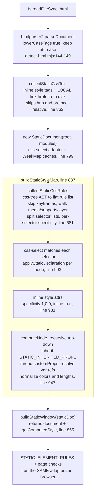

# Detector deep dive 01b — the hand-rolled CSS cascade

Companion to [`01-detector-engine.md`](01-detector-engine.md) and
[`01a`](01a-rule-trinity-and-dispatch.md). This is the engine's standout
engineering artifact: a from-scratch CSS cascade that produces a
`getComputedStyle`-shaped object for offline `.html` files using only off-the-shelf
parsers, **no jsdom, no browser**. About 1000 lines in one file. If a fresh agent
ever needs to compute styles for a page without rendering it, this is the
reference implementation to read first and the pitfalls to inherit.

File: [`engines/static-html/css-cascade.mjs`](../source/cli/engine/engines/static-html/css-cascade.mjs).
All line refs are into that file unless noted.

---

## 1. Why it exists

The static-HTML engine has to run the exact same element rules as the live browser
(see [`01a`](01a-rule-trinity-and-dispatch.md)) but with no rendering engine
underneath. The team's first answer was jsdom. jsdom's CSSOM has gaps that hide
the most common AI-generated patterns:

- it silently drops any border shorthand containing `var()`,
- it does not decompose `background:` shorthand into `backgroundColor`,
- it does not compute `oklch()` (the entire Tailwind v4 palette),
- it does not strip `:where()` to zero specificity the way real Chrome does,
- it does not implement `@layer` (every Tailwind v4 utility lives in a layer).

Rather than carry a pile of jsdom workarounds forever, they deleted jsdom (it is
not in `package.json`) and wrote a cascade that handles those cases correctly at
the source. The `--fast` regex-only flag became a deprecated no-op because, with a
real cascade, the static path is fast and covers every rule
([`cli/main.mjs:122-130`](../source/cli/engine/cli/main.mjs)).

The parsers it *does* use are lazy-imported and the engine falls back to the regex
tier if they are missing ([`detect-html.mjs:115-140`](../source/cli/engine/engines/static-html/detect-html.mjs)):
`htmlparser2` (parse HTML to a node tree), `css-tree` (parse CSS to an AST),
`css-select` (selector matching against htmlparser2 nodes), `domutils`
(text extraction).

---

## 2. The pipeline



The output of `buildStaticWindow` is a drop-in `window`:
`{ document, getComputedStyle }`. `getComputedStyle(el)` returns the per-node style
object the cascade computed. That is what lets the no-layout adapters from
[`01a`](01a-rule-trinity-and-dispatch.md) run unmodified.

---

## 3. The cascade core, algorithm by algorithm

### 3.1 Rule collection — `collectStaticCssRules` (line 681)

Parses the concatenated CSS with css-tree (`parseCustomProperty: false` so `var()`
is left as a literal string for later resolution), then walks the AST:

- **`@keyframes` is skipped** entirely (`atRuleStack.some(name => /keyframes$/i)`,
  line 693). Keyframe blocks are not cascade rules.
- **`@media`, `@supports`, `@layer` are walked into** (line 711) and their inner
  rules are emitted as **flat rules**. This is the deliberate simplification: the
  cascade does not evaluate the media condition or model layer precedence. Every
  breakpoint's rules apply; last-by-source-order wins. See §6 for why that is an
  accepted fidelity gap.
- **Selector lists are split** (`a, b, c` → three rules) via `splitCssList`
  (line 704), each getting its own specificity and source order.
- Each emitted rule is `{selector, declarations, specificity, order}`.

### 3.2 Specificity — `staticSpecificity` (line 645)

Computes the `[ids, classes, types]` triple, and crucially **strips `:where(...)`
to zero first**, matching real Chrome (the same UA divergence that bit jsdom):

```js
const noWhere = selector.replace(/:where\([^)]*\)/g, '');
const ids     = (noWhere.match(/#[\w-]+/g) || []).length;
const classes = (noWhere.match(/\.[\w-]+|\[[^\]]+\]|:(?!:)[\w-]+(?:\([^)]*\))?/g) || []).length;
// strip ids+classes+pseudos, then count bare type selectors
const types   = (stripped.match(/\b[a-zA-Z][\w-]*\b/g) || []).length;
return [ids, classes, types];
```

It is a regex approximation, not a full selector parser, but it gets the common
cases right: classes, attribute selectors, and pseudo-classes all count as
"classes"; `:where()` counts as nothing.

### 3.3 Cascade priority — `compareStaticPriority` (line 633)

The real precedence order, returning true when `b` should win over `a`:

```js
if (!a) return true;                               // first writer wins by default
if (!!b.important !== !!a.important) return b.important;  // !important beats everything
if (!!b.inline !== !!a.inline) return b.inline;          // inline beats selector rules
for (let i = 0; i < 3; i++)                              // specificity triple, high→low
  if (b.specificity[i] !== a.specificity[i]) return b.specificity[i] > a.specificity[i];
return b.order >= a.order;                                // later source order wins ties
```

Order is `!important` > inline > specificity[ids] > [classes] > [types] > source
order. Inline declarations are stamped `specificity: [1,0,0], inline: true`
(line 936-941) so the `inline` flag decides before the triple is even compared.

### 3.4 Shorthand expansion — `expandStaticDeclaration` (line 523)

This is the proper fix for jsdom's "does not decompose shorthand" gap. Each
shorthand is decomposed into longhands the rules can read:

| Input shorthand | Expanded longhands | Note |
|---|---|---|
| `background` | `backgroundImage` (if gradient/url) + `backgroundColor` | color sniffed from the part *before* the gradient/url so `background: var(--paper) radial-gradient(...)` keeps both (line 528-536) |
| `border` | `border{Top,Right,Bottom,Left}{Width,Color}` | width+color via `parseStaticBorder` |
| `border-top/right/bottom/left` | that side's `Width`+`Color` | |
| `border-width` / `border-color` | 1–4 value box expansion to all sides | `expandStaticBoxValues` (line 454) |
| `outline` | `outlineWidth`+`outlineColor`+`outlineStyle` | handles `outline: 0` zeroing (line 561) |
| `padding` / `margin` | 4-side box expansion | |
| `font` | `fontStyle`+`fontWeight`+`fontSize`+`lineHeight`+`fontFamily` | `parseStaticFont` reads the `size/line-height` slash form (line 472) |
| `transition` | `transitionProperty`+`transitionTimingFunction` | per-layer, quote/paren-aware split |
| `animation` | `animationName`+`animationTimingFunction` | filters keyword tokens (infinite/alternate/...) |
| `--custom-prop` | passed through verbatim | resolved later in `computeNode` |
| anything else | mapped to camelCase if it is a known prop | otherwise dropped |

The split helpers `splitCssList` (commas at depth 0, line 354) and `splitCssTokens`
(whitespace at depth 0, line 376) are hand-rolled, quote-aware and paren-aware, so
`rgba(0, 0, 0, .5)` and `"Font, Name"` are not split mid-value. This is the same
"hand-roll a small tokenizer rather than pull a parser" discipline seen in the
color code.

### 3.5 The specified-values map — `applyStaticDeclaration` (line 657)

For each `(node, prop, value)`, expand the shorthand, then for each longhand keep
the winner per `compareStaticPriority`:

```js
for (const [expandedProp, expandedValue] of expandStaticDeclaration(prop, value)) {
  const existing = map.get(expandedProp);
  const next = { ...meta, prop: expandedProp, value: expandedValue };
  if (compareStaticPriority(existing, next)) map.set(expandedProp, next);
}
```

After all selector rules are applied, inline `style="..."` attributes are layered
on at `specificity: [1,0,0], inline: true` and ascending order (line 931-944). The
result is a `Map<node, Map<prop, winningDecl>>` of **specified** values.

### 3.6 Computed values + inheritance + var() — `computeNode` (line 947)

A recursive top-down walk that turns specified values into computed values:

```js
const computeNode = (node, parentStyle = null, parentCustom = new Map()) => {
  const specifiedMap = specified.get(node) || new Map();
  const customProps = new Map(parentCustom);                       // inherit custom props
  for (const [prop, decl] of specifiedMap)
    if (prop.startsWith('--')) customProps.set(prop, resolveVarRefs(decl.value, customProps));
  const values = {};
  for (const prop of Object.keys(STATIC_DEFAULT_STYLE))
    values[prop] = (STATIC_INHERITED_PROPS.has(prop) && parentStyle?.[prop] != null)
      ? parentStyle[prop]                                          // inherit
      : STATIC_DEFAULT_STYLE[prop];                                // UA default
  for (const [prop, decl] of specifiedMap) {
    if (prop.startsWith('--')) continue;
    values[prop] = normalizeStaticCssValue(prop, decl.value, customProps, parentStyle, values);
  }
  staticDoc.setStyle(node, makeStaticStyle(values));
  for (const child of node.children || [])
    if (child.type === 'tag') computeNode(child, makeStaticStyle(values), customProps);
};
```

Three things happen here, in order:

1. **Custom-property inheritance.** Each node copies its parent's `customProps`
   Map, then adds its own `--x` declarations, resolving each through
   `resolveVarRefs` against the map built so far. Custom props inherit, exactly as
   in real CSS. This is what makes Tailwind v4 work: `--text-xs`, `--font-weight-bold`,
   `--tracking-widest` declared on `:root` reach every descendant.
2. **Property inheritance.** Only the small `STATIC_INHERITED_PROPS` set
   (`color, fontFamily, fontSize, fontStyle, fontWeight, lineHeight, letterSpacing,
   textTransform, textAlign, hyphens`, line 225) is copied from the parent's
   *computed* style. Everything else resets to the UA default in
   `STATIC_DEFAULT_STYLE` (line 231). That set is small because those are the only
   inherited properties the rules actually read.
3. **Value normalization** via `normalizeStaticCssValue` (line 428): resolve
   `var()`, turn `inherit` into the parent's computed value, normalize colors to
   `rgb()` (with one deliberate exception, below), and resolve `fontSize`,
   `letterSpacing`, `lineHeight` to pixels against the inherited font-size context.

The color-normalization exception is worth its own line: **modern border colors
are left in their original `oklch()`/`lab()`/`hsl()` form**, not converted to rgb
(line 431). That is intentional: `isNeutralColor` reads chroma directly from those
formats (see [`01c`](01c-color-and-contrast-tiers.md)), and converting first would
lose precision the chroma test wants.

---

## 4. The DOM façade

The rules call `el.parentElement`, `el.previousElementSibling`, `el.children`,
`el.querySelector`, `el.closest`, `el.getAttribute`, `el.childNodes` with text
nodes, etc. The cascade supplies just enough of that surface so the **same adapter
functions** run against it:

- **`StaticElement`** (line 721) wraps one htmlparser2 node and implements
  `parentElement`, `previousElementSibling`, `children` (tag-only),
  `childNodes` (with `nodeType: 3` text nodes carrying `textContent`), `textContent`
  (via domutils), `className`, `id`, `getAttribute`, `querySelector(All)`,
  `closest`, `contains`. Selector methods delegate to css-select and swallow
  unsupported-selector errors by returning empty.
- **`StaticDocument`** (line 799) holds the css-select adapters and two caches: a
  `WeakMap` of node→wrapper (so identity is stable, `el === el` holds across
  calls) and a `WeakMap` of node→computed-style. It exposes `querySelector(All)`,
  `documentElement`, `body`, `getStyle`.
- **`makeStaticStyle`** (line 846) builds the style object from
  `STATIC_DEFAULT_STYLE` plus computed values, and adds a `getPropertyValue(prop)`
  that camelCases the lookup so both `style.borderTopWidth` and
  `style.getPropertyValue('border-top-width')` work.
- **`buildStaticWindow`** (line 855) returns `{ document, getComputedStyle }`.

The payoff: `detectHtml` does `window.getComputedStyle(el)` and the adapters never
know they are not in a browser.

---

## 5. Local-only stylesheet inlining — `collectStaticCssText` (line 862)

It reads inline `<style>` text plus `<link rel="stylesheet">` hrefs **from disk**,
explicitly skipping `http(s)://` and protocol-relative URLs (line 871):

```js
if (!/\bstylesheet\b/i.test(rel) || !href || /^(https?:)?\/\//i.test(href)) continue;
const cssPath = path.resolve(fileDir, href);
```

This is why the CLI nudges users toward scanning the running URL for "more
accurate results" ([`cli/main.mjs:174-195`](../source/cli/engine/cli/main.mjs)): a
static file scan can only see CSS that lives next to it on disk. Remote
stylesheets, CDN Tailwind, and anything the dev server generates are invisible to
the static path and only show up under the browser engine.

---

## 6. Fidelity gaps (state them out loud)

A fresh agent copying this cascade must inherit these caveats, not discover them:

- **No layout.** Every rect is `0x0`. Rules that need rendered size are skipped in
  this path (`rect: null`); see the `△` rows in the [`01a`](01a-rule-trinity-and-dispatch.md)
  matrix.
- **`@media` is flattened, not evaluated.** Rules inside every media block apply
  unconditionally, last-by-source-order winning. A `@media (max-width: 600px)`
  override will bleed into the computed style at all sizes. Acceptable because the
  rules look for "is this property ever set to a bad value," not "what is the value
  at 1280px."
- **`@layer` precedence is not modeled.** Layer rules are walked into and treated
  at their plain specificity and source order. Real `@layer` makes layered styles
  lose to unlayered ones regardless of specificity; this cascade does not. In
  practice Tailwind utilities still resolve because the values are present; the
  ordering is just approximate.
- **No states.** No `:hover`, `:focus`, `:checked`. Selectors with those
  pseudo-classes still match (the pseudo is counted as a class, the base selector
  matches the element), so a `:hover` rule's declarations can apply to the resting
  element. Another reason the rules gate on "ever set," not "set right now."
- **Equal-specificity ties resolve later-wins**, which is correct, but the
  flattening above means "later" can mean "from a different media block," which is
  not how a browser would order them.

These are the price of no-browser analysis. The team's bet, visible in the
`--fast` removal, is that the static path is good enough to gate edits and the
browser path is the authority when accuracy matters.

---

## 7. Dead code: `buildBorderOverrideMap` and `unwrapCssAtLayer`

Two substantial functions in this file are **vestigial and never called**. This
is a correction to the first-draft overview, which described `buildBorderOverrideMap`
as an active pre-pass.

- **`buildBorderOverrideMap`** (line 74-177) is the jsdom-era recovery for border
  `var()`: it read CSSOM `rule.style.borderLeft` accessors, resolved `:root` custom
  props against the document-element computed style, and handed resolved
  width/color to `checkElementBorders` as the `overrides` argument. The custom
  cascade made it redundant: `expandStaticDeclaration` decomposes `border` and
  `normalizeStaticCssValue` resolves `var()` against the per-node `customProps`
  map, so the computed style already carries the real width and color. The static
  driver passes `null` for `overrides`
  ([`detect-html.mjs:92`](../source/cli/engine/engines/static-html/detect-html.mjs)).
- **`unwrapCssAtLayer`** (line 187-219) is a brace-balancing string flattener that
  stripped `@layer { ... }` wrappers before parsing. The cascade made it redundant
  too: `collectStaticCssRules` walks into `@layer` blocks in the css-tree AST
  directly (line 711).

Verified across the **entire** source tree (the `cli/engine` copy plus all 16
generated harness copies under `.claude/`, `.cursor/`, `.agents/`, …): both
functions appear only at their definition and in the module export list. There is
no call site anywhere, including tests. A fresh agent lifting this file should
delete both (and the `normalizeColorForCheck` and `NAMED_COLORS` helpers that only
`buildBorderOverrideMap` uses) or at minimum know they do nothing. They are the
archaeological layer that proves the jsdom-to-cascade migration happened and was
not fully cleaned up.

---

## 8. What this means for YoinkIt

- **STEAL the structure if you ever need offline computed style.** YoinkIt's Map
  pass is "cheap, headless, works on structure." If Map ever needs computed style
  without launching a browser (responsive presence, layout dimensions, color/type
  facts), this is the build: htmlparser2 + css-tree + css-select + a small façade,
  with a real cascade in the middle. It is a ~1000-line investment, so do it only
  when the value is proven, but it exists and works.
- **STEAL the "hand-roll the tokenizer, lazy-import the parser" split.** The
  quote/paren-aware `splitCssList`/`splitCssTokens` are tiny and dependency-free;
  the heavy parsers are lazy-imported and degrade to the next engine if absent
  ([`detect-html.mjs:138-140`](../source/cli/engine/engines/static-html/detect-html.mjs)).
  This keeps the dependency-free core dependency-free and the optional analysis
  optional, which is exactly YoinkIt's posture for `capture-animation.js`.
- **AVOID assuming the static path is faithful.** §6 is the warning. For YoinkIt
  this reinforces the existing rule: structure can be headless, but the moment you
  care about what the page actually does (motion, contrast, rendered geometry), you
  need the real browser. The cascade is impressive precisely because it shows how
  far you can push the no-browser path, and where it still stops.
- **STEAL the OKLCH-stays-OKLCH instinct.** Normalizing every color to rgb up front
  would have thrown away the chroma signal the neutral-color test needs. Keep
  measured values in the form the downstream check reads best, convert lazily. The
  same applies to YoinkIt keeping captured transforms/easings in their measured
  form rather than pre-normalizing.

The contrast escalation that sits on top of this color handling is the subject of
[`01c`](01c-color-and-contrast-tiers.md).
