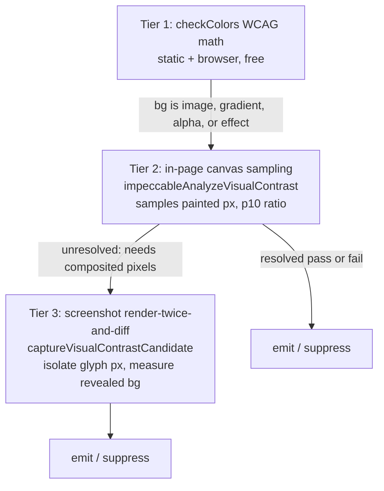

# Detector deep dive 01c — color science and the three-tier contrast escalation

Companion to [`01-detector-engine.md`](01-detector-engine.md). This is the closest
thing in the codebase to YoinkIt's own goal of "measure what the page actually
does in a real browser," so it gets the most thorough treatment. The shape worth
internalizing: **contrast is resolved by the cheapest method that can be trusted,
and escalates only when the cheap method admits it cannot see**. Three tiers, with
an explicit handoff between them.

Files: [`shared/color.mjs`](../source/cli/engine/shared/color.mjs),
[`rules/checks.mjs`](../source/cli/engine/rules/checks.mjs),
[`browser/injected/index.mjs`](../source/cli/engine/browser/injected/index.mjs),
[`engines/visual/screenshot-contrast.mjs`](../source/cli/engine/engines/visual/screenshot-contrast.mjs),
[`engines/browser/detect-url.mjs`](../source/cli/engine/engines/browser/detect-url.mjs).

---

## 1. Color primitives

### 1.1 `isNeutralColor` — multi-format chroma, fail-open (color.mjs:3-52)

The most-cited function in the engine and the source of its single most
transferable correctness lesson. It answers "is this color a neutral gray
(skippable) or tinted (worth flagging)?" across every modern CSS color form,
reading chroma directly from each:

| Format | Chroma signal | "neutral" threshold |
|---|---|---|
| `rgb/rgba` | `max(r,g,b) - min(r,g,b)` | `< 30` (≈11.7% of 0–255) |
| `oklch/lch` | second component (chroma) | `< 0.02` / `< 3` |
| `oklab/lab` | `hypot(a, b)` | `< 0.02` / `< 3` |
| `hsl/hsla` | saturation % | `< 10` |
| `hwb` | `1 - (w+b)/100` | `< 0.1` |
| **unknown** | — | **`return false`** |

The last row is the lesson. An unrecognized format returns `false` (NOT neutral,
i.e. **treat as detectable**). The comment names the opposite default as "the root
cause of the oklch bug": when the function used to skip formats it did not
recognize, the entire OKLCH-based Tailwind v4 palette read as "neutral, skip" and
the detector went silent on real problems. **Fail open: an unknown input is worth
inspecting, not silently dropped.** For a capture tool this is the difference
between under-capturing without telling anyone and over-capturing visibly.

### 1.2 WCAG math (color.mjs:61-72)

`relativeLuminance` is the standard sRGB-linearize-then-weight
(`0.2126 R + 0.7152 G + 0.0722 B`), and `contrastRatio` is
`(max + 0.05) / (min + 0.05)`. Plain, correct, shared by every tier (Tier 3
re-implements the identical math inside the page so it can run in `page.evaluate`,
[`screenshot-contrast.mjs:42-53`](../source/cli/engine/engines/visual/screenshot-contrast.mjs)).

### 1.3 `oklchToRgb` — the conversion jsdom never had (checks.mjs:925-946)

A full Björn Ottosson OKLCH→sRGB conversion (OKLab intermediary matrices, gamma
encode, clamp, scale to 0–255):

```js
function oklchToRgb(L, C, H) {
  const hRad = (H * Math.PI) / 180;
  const a = C * Math.cos(hRad), b = C * Math.sin(hRad);
  const l_ = L + 0.3963377774*a + 0.2158037573*b;
  const m_ = L - 0.1055613458*a - 0.0638541728*b;
  const s_ = L - 0.0894841775*a - 1.2914855480*b;
  const lc=l_**3, mc=m_**3, sc=s_**3;
  const rLin =  4.0767416621*lc - 3.3077115913*mc + 0.2309699292*sc;
  const gLin = -1.2684380046*lc + 2.6097574011*mc - 0.3413193965*sc;
  const bLin = -0.0041960863*lc - 0.7034186147*mc + 1.7076147010*sc;
  const enc = x => { const c=Math.max(0,Math.min(1,x));
    return c<=0.0031308 ? 12.92*c : 1.055*Math.pow(c,1/2.4)-0.055; };
  return { r:Math.round(enc(rLin)*255), g:Math.round(enc(gLin)*255), b:Math.round(enc(bLin)*255), a:1 };
}
```

The comment is blunt about the stakes: "without this, the entire Tailwind v4 color
palette is invisible to the detector." Real Chrome computes OKLCH to rgb for you;
the Node static path has to do it by hand. This matters to YoinkIt because Tailwind
v4 and modern design systems are increasingly OKLCH-native, and any sampler that
cannot read OKLCH will silently mismeasure modern sites.

### 1.4 The var()/OKLCH resolution chain (checks.mjs:874-1002)

For the static path, computed colors come back as literal `var(--x)` or `oklch(...)`
strings. Three functions turn those into `{r,g,b,a}`:

- **`buildCustomPropMap(document)`** walks stylesheets for `:root`/`html`/`:host`
  custom-prop declarations into a `Map` (also descending into `@media`/`@supports`).
- **`resolveVarRefs(raw, map, depth)`** recursively substitutes `var(--x[, fallback])`,
  up to 8 levels deep for chained refs, returning the original string when a ref
  does not resolve.
- **`parseAnyColor(s)`** parses rgb/rgba/hex(3,4,6,8)/oklch. Its OKLCH regex tolerates
  Tailwind's minifier squishing the space after `%` (`"21.5%.02 50"`,
  [checks.mjs:981](../source/cli/engine/rules/checks.mjs)).
- **`parseColorResolved(str, map)`** chains the two: resolve refs, then parse.

The design-system extractor adds `hslToRgb` for `hsl()` palette tokens
([`design-system.mjs:203`](../source/cli/engine/design-system.mjs)). Together these
mean the detector can read a color literal in essentially any form a 2026 stylesheet
emits.

---

## 2. Tier 1 — math (free, runs everywhere)

`checkColors` ([checks.mjs:65-158](../source/cli/engine/rules/checks.mjs)) is the
pure decision. Given a text color and an effective background (or gradient stops),
it computes the WCAG ratio and compares to a threshold:

```js
const isLargeText = fontSize >= WCAG_LARGE_TEXT_PX            // 24px
  || (fontSize >= WCAG_LARGE_BOLD_TEXT_PX && fontWeight >= 700);  // ~18.67px bold
const threshold = isLargeText ? 3.0 : 4.5;
```

The non-obvious parts are all false-positive defenses:

- **Gradient backgrounds use the worst stop.** If the effective background is a
  gradient, the ratio is computed against every stop and the lowest wins
  ([checks.mjs:94-98](../source/cli/engine/rules/checks.mjs)). `gray-on-color` only
  fires if *every* stop is chromatic.
- **Styled-button exception.** `SAFE_TAGS` normally suppresses contrast noise on
  inline `<a>`/`<button>`, but if such an element has its **own opaque background**
  (`bgColor.a > 0.5`) and direct text, it is a real button and contrast on its own
  surface is checked ([checks.mjs:74-77](../source/cli/engine/rules/checks.mjs)).
- **Alpha-fallback false-positive skip.** In the static path, if the text color has
  `alpha < 1` and no opaque ancestor background could be resolved, the finding is
  suppressed ([checks.mjs:112](../source/cli/engine/rules/checks.mjs)). This is the
  `text-paper/60 on bg-ink` Tailwind pattern that the no-`var()` path mismeasures.
  The browser path does not need the skip (it resolves the real ancestor).
- **Emoji-only text is skipped** (`isEmojiOnlyText`, [checks.mjs:59](../source/cli/engine/rules/checks.mjs))
  because emoji render as multicolor glyphs regardless of `color`.

Tier 1 is the only contrast tier the static path has, and it is what the browser
path starts with. It is exact when the background is a single resolvable color and
the text is opaque. It cannot handle anything that needs pixels.

---

## 3. Tier 2 — in-page canvas sampling (browser, free)

When Tier 1 cannot trust the math (the background is an image, the text sits over a
gradient, alpha stacks), the in-page engine samples **actual painted pixels** with
a `<canvas>`, still inside the page, no screenshot needed. This is the part the
overview under-described; it is a substantial pixel-sampling engine.

### 3.1 Candidate selection — what even needs Tier 2

`collectVisualContrastReasons` ([injected/index.mjs:600-653](../source/cli/engine/browser/injected/index.mjs))
walks an element and its ancestors and tags *why* its background is hard to read:
`background-clip text`, `text shadow`, `image background`, `gradient background`,
`opacity stack`, `blend mode`, `filter`, `backdrop filter`, plus an
`img/picture/video/canvas/svg underlay` detected via `elementsFromPoint` under the
text. `collectVisualContrastCandidates` ([:655](../source/cli/engine/browser/injected/index.mjs))
keeps the elements that have direct text, are rendered, pass the styled-button
gate, and have at least one reason. Each candidate carries its generated selector,
text-color, threshold, clip rect, and the reasons.

### 3.2 The sampling machine

The pixel sampling, bottom up:

- **`blendRgba(fg, bg)`** ([:723](../source/cli/engine/browser/injected/index.mjs))
  alpha-composites a translucent color over a backdrop.
- **`sampleDrawablePixel(drawable, sourcePoint)`** ([:900](../source/cli/engine/browser/injected/index.mjs))
  draws an image/canvas/video into an offscreen canvas (capped at 640px on the long
  side), reads one pixel, and **caches the raster in a `WeakMap`** so repeated
  samples of the same image are cheap. It detects cross-origin taint and returns
  `{status:'unresolved', reason:'tainted image'}` rather than throwing.
- **`resolvePaintedImageRect` / `resolveObjectImageRect`** ([:784,:825](../source/cli/engine/browser/injected/index.mjs))
  do real CSS geometry: they resolve `background-size` (`cover`/`contain`/explicit)
  and `background-position`, and `object-fit`/`object-position`, to map a viewport
  point to the correct source pixel of the image. This is genuinely careful: it
  handles the same painted-rect math a browser does so the sampled pixel is the one
  actually under the glyph.
- **`sampleCssBackground`** ([:956](../source/cli/engine/browser/injected/index.mjs))
  resolves a node's own background: gradient → analytic worst-contrast stop
  (`pickWorstContrastColor`), url → canvas-sample the image at the mapped point,
  solid → the rgb.
- **`sampleVisualBackgroundAtPoint(el, point, textColor, depth)`** ([:1026](../source/cli/engine/browser/injected/index.mjs))
  is the orchestrator: it walks the `elementsFromPoint` stack from the text element
  down, samples each layer, and **recursively blends translucent layers over what
  is beneath them** (depth-capped at 8). It returns the composited background color
  actually under the glyph.

### 3.3 The verdict — `analyzeVisualContrastCandidate` (injected/index.mjs:1087)

It samples multiple points across the text rect (`textSamplePoints`, an inset grid,
[:1008](../source/cli/engine/browser/injected/index.mjs)), computes the contrast at
each, sorts, and reports the **p10 ratio** (the 10th-percentile worst case, robust
to a few odd pixels) plus the median. Two gates make it honest:

- It requires at least `min(3, points)` readable samples or it returns
  `unresolved`.
- **It refuses the cases it cannot trust.** If any reason is `background-clip text`,
  `blend mode`, `filter`, `backdrop filter`, `opacity stack`, or `text shadow`, it
  returns `{status:'unresolved', reason:'<reason> needs screenshot pixels'}`
  ([:1097-1107](../source/cli/engine/browser/injected/index.mjs)). Canvas sampling
  reads the *input* pixels, not the *composited* output, so for those effects the
  sampled background is a lie. Tier 2 says so explicitly and hands off to Tier 3.

Resolved results carry `confidence: 'high'` when a `canvas-*` method was used,
`'medium'` otherwise.

### 3.4 Lazy / offscreen resolution (a detail the overview missed)

Candidates whose text is currently outside the viewport return
`reason: 'text outside viewport'`. `scheduleLazyVisualContrast`
([injected/index.mjs:1683](../source/cli/engine/browser/injected/index.mjs)) parks
those on an `IntersectionObserver`; when the user scrolls one into view it resolves
it, decorates the overlay, and posts the updated findings. A `scanGeneration`
counter invalidates in-flight lazy work when a re-scan happens. So Tier 2 keeps
resolving as the page is explored, not only at scan time. For the offscreen-from-
the-start case under Puppeteer, the driver can opt into `scrollOffscreen`, which
scrolls each candidate into view, samples, and restores scroll
([:1173-1203](../source/cli/engine/browser/injected/index.mjs)).

---

## 4. Tier 3 — screenshot render-twice-and-diff (browser, expensive)

For the cases Tier 2 refused, the URL driver escalates to the one technique that
sees the truly composited result: **screenshot, make the text transparent,
screenshot again, diff the two images to isolate the exact glyph pixels.**
[`screenshot-contrast.mjs:108-183`](../source/cli/engine/engines/visual/screenshot-contrast.mjs):

1. `sanitizeScreenshotClip` clamps the clip to the candidate's rect, **capping
   height at 320px** so the diff stays cheap ([:9-12](../source/cli/engine/engines/visual/screenshot-contrast.mjs)).
2. Screenshot the clip (`captureBeyondViewport: true`).
3. Inject a style that makes **only the target text** transparent:
   `color: transparent; -webkit-text-fill-color: transparent; text-shadow: none`,
   and if the reason was `background-clip text`, also `background-image: none`
   ([:130-139](../source/cli/engine/engines/visual/screenshot-contrast.mjs)). The
   target is marked with a one-shot `data-impeccable-visual-contrast-target`
   attribute, then cleaned up in a `finally`.
4. Screenshot again.
5. Diff in a canvas inside `page.evaluate` ([:65-84](../source/cli/engine/engines/visual/screenshot-contrast.mjs)):

```js
for (let i = 0; i < beforePixels.length; i += 4) {
  const delta = |Δr| + |Δg| + |Δb| + |Δa|;
  if (delta < 10) continue;            // unchanged pixel → not a glyph
  glyphPixels++;
  const fg = cssTextColor || beforePixel;   // the glyph color (before hiding)
  const bg = afterPixel;                     // what was revealed behind it
  ratios.push(contrastRatio(fg, bg));
}
```

The pixels that changed between the two shots are exactly the glyph pixels. Their
"before" color is the foreground; the "after" color (now showing through) is the
true composited background. The verdict is the **p10 ratio** again, gated on
`glyphPixels >= 8` and `ratios.length >= 8` so a couple of antialiased edge pixels
cannot trigger it ([:86-94,:174](../source/cli/engine/engines/visual/screenshot-contrast.mjs)).
If `p10 >= threshold` it returns null (passes). `preferRenderedForeground` decides
whether to trust the declared text color or read it from the before-pixels (used
when opacity/blend made the declared color unreliable).

---

## 5. The escalation, wired

The orchestration lives in `runVisualContrastFallback`
([`detect-url.mjs:29-100`](../source/cli/engine/engines/browser/detect-url.mjs)) and
is a clean handoff:



The driver runs Tier 2 first (`impeccableAnalyzeVisualContrast`), records which
selectors Tier 2 resolved (`pass` or `fail`), and then runs Tier 3
(`captureVisualContrastCandidate`) **only** for candidates Tier 2 left unresolved
and that are not already flagged low-contrast
([detect-url.mjs:62-98](../source/cli/engine/engines/browser/detect-url.mjs)). The
two pixel paths are disjoint by design: canvas (Tier 2) reads input pixels and
cannot see `background-clip:text`/filters/blend; screenshots (Tier 3) see the
composited output but cost a render. Each covers what the other cannot.

| Failure mode | Tier 1 math | Tier 2 canvas | Tier 3 screenshot |
|---|:--:|:--:|:--:|
| solid resolvable bg, opaque text | ✓ exact | — | — |
| gradient background | worst-stop estimate | ✓ sampled | ✓ |
| background image / `` underlay | ✗ | ✓ painted-rect sample | ✓ |
| translucent stacked layers | ✗ | ✓ recursive blend | ✓ |
| `background-clip: text` gradient text | ✗ | ✗ (bails) | ✓ only here |
| `filter` / `mix-blend-mode` / `backdrop-filter` | ✗ | ✗ (bails) | ✓ only here |
| cross-origin tainted image | ✗ | ✗ (taint) | ✓ |

---

## 6. What this means for YoinkIt

- **STEAL "render twice and diff to isolate what changed" wholesale.** This is the
  single most directly liftable technique in the engine. Impeccable diffs
  text-visible vs text-hidden to isolate glyph pixels. YoinkIt can diff frame N vs
  frame N+1 to isolate **exactly which pixels an animation touched**, as a
  verification or visual-evidence layer over per-frame computed-style sampling. It
  is especially valuable for effects computed style does not fully describe (canvas,
  filters, compositor-only transforms) — the same blind spots Tier 2 hands to Tier 3
  are the ones per-frame style sampling shares.
- **STEAL the escalation contract.** Cheapest method first; each tier that cannot
  be trusted says so with a named reason and hands off, rather than guessing. A
  YoinkIt capture could do the same: computed-style sampling first, and when it hits
  something it cannot describe (a canvas animation, a WebGL layer, a filter), emit
  `confidence: verify` with the reason and fall back to clip/pixel evidence, instead
  of reporting a measured value it did not really measure. This is the engine
  expression of YoinkIt's existing `measured` vs `verify` Confidence marker.
- **STEAL fail-open (`isNeutralColor`).** Restated because it is the highest-value
  one-liner: a capture tool that skips formats it does not recognize under-captures
  silently. Default to capturing the unknown.
- **STEAL the OKLCH conversion** if YoinkIt ever reads color off-browser. Modern
  sites are OKLCH-native; without the conversion the palette is invisible.
- **ADAPT the painted-rect math.** `resolvePaintedImageRect`/`resolveObjectImageRect`
  are a worked reference for mapping a viewport point to a source-image pixel under
  `background-size`/`object-fit`. If YoinkIt ever samples "what is actually under
  this element," this is the geometry to copy rather than re-derive.

The selector generation these candidates rely on, and the footprint scrubbing that
keeps the engine from measuring itself, are covered in
[`01d`](01d-selector-and-footprint.md).
