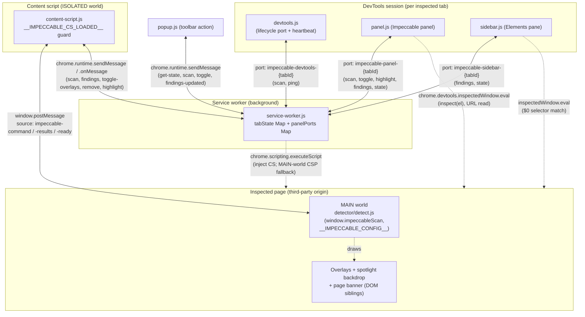

# Impeccable — Chrome Extension Subsystem (Deep Audit)

> Audit lens: **YoinkIt**. Impeccable ships an MV3 Chrome extension that injects a
> single-file, framework-agnostic *page-analysis engine* (`window.impeccableScan`,
> the `__IMPECCABLE_*` namespace) into arbitrary third-party pages and surfaces
> results in a DevTools panel. That is structurally the same problem YoinkIt's
> `window.__cap` engine + MV3 wrapper solves. Every section ends by asking: *what
> can YoinkIt's extension steal from this?*

## Orientation

Impeccable's extension is a thin **messaging-and-UI shell** wrapped around a fat,
**generated, dependency-free page-context engine**. The extension itself (manifest +
service worker + content script + four HTML surfaces) is ~1,000 lines of plumbing
whose only job is to (a) lazily inject a content-script bridge on user engagement,
(b) have that bridge inject a `web_accessible_resource` script into the page's MAIN
world, (c) shuttle a JSON `scan` command in and a JSON `findings` array out over a
two-hop bridge (`chrome.runtime` messaging ↔ `window.postMessage`), and (d) render
those findings in a DevTools panel/sidebar/popup with click-to-inspect. The engine
that actually does the work — overlay drawing, selector generation, visual-contrast
sampling, anti-pattern detection — is `cli/engine/browser/injected/index.mjs`,
authored once as an ES module that *also* powers the CLI and the public website, then
concatenated and IIFE-wrapped at build time into `extension/detector/detect.js`. The
extension is deliberately permission-frugal (on-demand injection, no static content
scripts) and runs **100% locally** — no network egress at all.

### File map

| File | Lines | Role |
|---|---|---|
| [`extension/manifest.json`](../source/extension/manifest.json) | 33 | MV3 manifest: 4 narrow permissions + `<all_urls>`, devtools page, popup, one `web_accessible_resource` |
| [`extension/background/service-worker.js`](../source/extension/background/service-worker.js) | 272 | Message router, per-tab state `Map`, badge, on-demand content-script injection, CSP fallback injector, port lifecycle |
| [`extension/content/content-script.js`](../source/extension/content/content-script.js) | 125 | ISOLATED-world bridge: injects the MAIN-world engine via a `<script src>`, translates `chrome.runtime` ↔ `window.postMessage` |
| [`extension/devtools/devtools.{html,js}`](../source/extension/devtools/devtools.js) | 51 | Creates the panel + Elements sidebar pane; owns the canonical "DevTools open/closed" lifecycle port + heartbeat |
| [`extension/devtools/panel.{html,js,css}`](../source/extension/devtools/panel.js) | 519 | Main UI: grouped findings, settings (per-rule toggles), click-to-inspect, copy-as-markdown, hover→page-spotlight |
| [`extension/devtools/sidebar.{html,js,css}`](../source/extension/devtools/sidebar.js) | 104 | Elements-panel sidebar: findings for the currently selected `$0` |
| [`extension/popup/popup.{html,js,css}`](../source/extension/popup/popup.js) | 67 | Toolbar popup: count, Scan, toggle-overlays |
| [`extension/STORE_LISTING.md`](../source/extension/STORE_LISTING.md) | 70 | Chrome Web Store copy (single-purpose, privacy, 41 rules) |
| [`extension/detector/detect.js`](../source/scripts/build-extension.js) | *generated* | The engine, IIFE-wrapped. **Not committed** (gitignored build artifact) |
| [`extension/detector/antipatterns.json`](../source/scripts/build-extension.js) | *generated* | Rule metadata (`id`/`name`/`category`/`description`) the panel reads for settings + tooltips |
| [`scripts/build-extension.js`](../source/scripts/build-extension.js) | 160 | Generates `detect.js` + `antipatterns.json`, derives the Firefox manifest, zips both stores |
| [`scripts/build-browser-detector.js`](../source/scripts/build-browser-detector.js) | 63 | Sibling generator: same engine modules → `cli/engine/detect-antipatterns-browser.js` + site copy |
| [`cli/engine/browser/injected/index.mjs`](../source/cli/engine/browser/injected/index.mjs) | 1,938 | **The engine source.** Runs only `if (typeof window !== 'undefined')`; the dual-mode (`EXTENSION_MODE`) page-side runtime |
| [`cli/engine/registry/antipatterns.mjs`](../source/cli/engine/registry/antipatterns.mjs) | ~700 | `ANTIPATTERNS` array (the rule registry) shared across CLI/site/extension |
| [`cli/engine/rules/checks.mjs`](../source/cli/engine/rules/checks.mjs) | — | Pure check functions (DOM-free) reused by all engines |

> **Note for future readers:** the project's `CLAUDE.md` still describes
> `cli/engine/detect-antipatterns.mjs` as the engine source. That file is now a
> **facade** (re-exports only; see [`detect-antipatterns.mjs:11-50`](../source/cli/engine/detect-antipatterns.mjs)).
> The real modular engine lives under `cli/engine/{shared,registry,rules,browser/injected}`,
> and the build scripts concatenate those modules directly. The audit reflects the
> current code, not the doc.

---

## Component topology



The shape: **one service worker is the hub**; every UI surface (panel, sidebar,
popup, devtools page) talks *only* to the SW, never to each other and never directly
to the page (except the two DevTools surfaces, which additionally have
`chrome.devtools.inspectedWindow.eval` for inspect/URL/`$0` operations). The content
script is the *only* component with a foot in both the extension messaging world and
the page's `window`. The engine in the MAIN world never touches `chrome.*` — it only
knows `window.postMessage`.

### Representative flow: user opens DevTools → panel scan → findings rendered

```mermaid
sequenceDiagram
    actor U as User
    participant DT as devtools.js
    participant PN as panel.js
    participant SW as service-worker.js
    participant CS as content-script.js
    participant EN as detect.js (MAIN world)

    U->>DT: Opens DevTools
    DT->>SW: connect port "impeccable-devtools-{tabId}"
    Note over SW: devtoolsTabs.add(tabId)
    DT->>DT: read autoScan setting (default 'panel' → wait)
    U->>PN: Clicks "Impeccable" panel tab
    PN->>SW: connect port "impeccable-panel-{tabId}"
    SW->>PN: postMessage {action:'state', findings:[]}
    Note over SW: findings empty → trigger scan
    SW->>SW: ensureContentScriptInjected(tabId)
    SW->>CS: chrome.scripting.executeScript(content-script.js)
    SW->>CS: tabs.sendMessage {action:'scan', config}
    CS->>CS: injectAndScan(): set dataset.impeccableExtension
    CS->>EN: append <script src=chrome-extension://…/detect.js>
    EN->>CS: window.postMessage {source:'impeccable-ready'}
    CS->>EN: window.postMessage {source:'impeccable-command', action:'scan', config}
    EN->>EN: scan(): collectBrowserFindings(), highlight(), banner
    EN->>CS: window.postMessage {source:'impeccable-results', findings, count}
    CS->>SW: chrome.runtime.sendMessage {action:'findings', findings}
    SW->>SW: tabState[tabId].findings = findings; updateBadge()
    SW->>PN: port.postMessage {action:'findings', findings}
    PN->>U: renderFindings() — grouped panel list + page overlays visible
    U->>PN: hover a finding row
    PN->>SW: port {action:'highlight', selector}
    SW->>CS: tabs.sendMessage {action:'highlight', selector}
    CS->>EN: postMessage {source:'impeccable-command', action:'highlight', selector}
    EN->>EN: spotlight target + dim siblings + scrollIntoView
    U->>PN: click a finding row
    PN->>EN: inspectedWindow.eval("inspect(querySelector(sel))")
```

The "two-hop bridge" is the load-bearing pattern: `chrome.runtime` messaging cannot
reach the MAIN world, and the MAIN-world engine cannot call `chrome.*`, so the
content script transcodes between them in both directions.

---

## 1. Manifest & permissions model

[`extension/manifest.json`](../source/extension/manifest.json) in full is 33 lines.
The permission posture is the headline: deliberately minimal for an extension that
can run on every site.

```json
"permissions": ["activeTab", "scripting", "storage", "webNavigation"],
"host_permissions": ["<all_urls>"],
```

| Permission | Why it's here | Audit note |
|---|---|---|
| `activeTab` | Lets the toolbar popup act on the current tab without a broad grant prompt | Paired with `scripting` for the popup→scan path |
| `scripting` | `chrome.scripting.executeScript` is how the content script gets injected **on demand** (`service-worker.js:63`) and how the **CSP fallback** injects the engine into the MAIN world (`service-worker.js:127`) | The single most important permission; the whole on-demand model depends on it |
| `storage` | `chrome.storage.sync` holds settings: `disabledRules`, `lineLengthMode`, `spotlightBlur`, `autoScan` (`service-worker.js:38-45`) | `sync` (not `local`) → settings roam across the user's Chrome profiles |
| `webNavigation` | `chrome.webNavigation.onCompleted` resets per-tab state on full navigations (`service-worker.js:244`) | Only top-frame (`details.frameId !== 0` early-returns) |

`host_permissions: ["<all_urls>"]` is the one broad grant. It is what allows
`executeScript` against arbitrary origins. The mitigation is structural: there is
**no `content_scripts` block** in the manifest at all. The script is injected only
when the user explicitly engages (panel/sidebar opened, popup scan), explained in the
SW comment at `service-worker.js:56-58`:

> *"We removed the static content_scripts entry to minimize the always-on footprint;
> the script is only loaded when the user explicitly engages with the extension."*

`web_accessible_resources` exposes exactly one file to page origins:

```json
"web_accessible_resources": [
  { "resources": ["detector/detect.js"], "matches": ["<all_urls>"] }
]
```

This is required because the content script injects the engine by setting
`script.src = chrome.runtime.getURL('detector/detect.js')` (`content-script.js:114`);
a `chrome-extension://` URL is only loadable from a page if the resource is
web-accessible. Object-form WAR (MV3) means the `extension_id`-revealing fingerprint
is exposed to `<all_urls>`, an accepted trade-off for a tool that runs everywhere.

Other manifest entries: `devtools_page: "devtools/devtools.html"` (registers the
panel), `action.default_popup` (the toolbar popup), and standard icon sets. No
`commands`, no `omnibox`, no `declarativeNetRequest` — nothing that would imply
network interception. The store listing reinforces this: *"Runs 100% locally, no data
sent anywhere"* ([`STORE_LISTING.md:55`](../source/extension/STORE_LISTING.md)).

**Firefox manifest is derived, not hand-maintained.** `build-extension.js:120-141`
takes the Chrome manifest and rewrites `background.service_worker` → `background.scripts`
(Gecko's universally-supported MV3 event-page form) and injects
`browser_specific_settings.gecko` with `data_collection_permissions: { required: ['none'] }`.
The SW is written to survive this transform unchanged — only top-level listeners + an
in-memory `Map`, no SW-only APIs.

---

## 2. Component topology & messaging graph (redraw-grade detail)

There are **two distinct transports**, used deliberately for different traffic:

### a) `chrome.runtime.sendMessage` (one-shot, fire-and-forget)

Used by the content script and the popup. The SW's single `onMessage` listener
(`service-worker.js:84-148`) is a flat `if/else` switch keyed on `msg.action`, with
`tabId` resolved as `msg.tabId || sender.tab?.id` (`:85`) — so the popup passes an
explicit `tabId` (it has no `sender.tab`), while the content script relies on `sender`.

| `action` | Sender → SW | SW effect |
|---|---|---|
| `findings` | content script | store in `tabState`, `updateBadge`, `notifyPanels`, broadcast `findings-updated` for popup (`:87-96`) |
| `scan` | popup | `sendScanToTab(tabId)` (`:98`) |
| `toggle-overlays` | popup | forward to tab as `tabs.sendMessage` (`:103`) |
| `page-pointer-active` | content script | `notifyPanels` → panel clears its hover (`:108`) |
| `overlays-toggled` | content script | persist `state.overlaysVisible`, notify panels + popup (`:113`) |
| `get-state` | popup | `sendResponse(getState(tabId))` (`:121`) |
| `inject-fallback` | content script | **MAIN-world `executeScript` of `detect.js`** (CSP fallback) (`:125`) |
| `disabled-rules-changed` | panel | re-scan every injected tab (`:139`) |

### b) `chrome.runtime.connect` long-lived ports (named, per-tab)

Three port-name prefixes, all parsed for their `tabId` suffix (`service-worker.js:171-239`):

- **`impeccable-devtools-{tabId}`** — opened by `devtools.js`. Its `onDisconnect` is
  *the* canonical "DevTools closed" signal → `tearDownTab` sends `remove` to the
  content script and clears state (`:182-186`, `:153-168`). Accepts `scan` and `ping`.
- **`impeccable-panel-{tabId}`** — opened by `panel.js`. On connect, SW pushes current
  `state`, and **if no findings yet, triggers a scan** (`:199-202`) — this is the
  recovery path if the devtools.js auto-scan was lost to SW termination. Accepts
  `scan`, `toggle-overlays`, `highlight`, `unhighlight`.
- **`impeccable-sidebar-{tabId}`** — opened by `sidebar.js`. Same "connect ⇒ scan if
  empty" behavior; receive-only otherwise.

The SW keeps two `Map`s as its entire state:
```js
const tabState  = new Map(); // tabId → { findings, overlaysVisible, injected, csInjected }
const panelPorts = new Map(); // tabId → Set<port>  (panel + sidebar ports share this)
```
`notifyPanels(tabId, msg)` (`:29-36`) fan-outs to every port in the set, swallowing
errors from dead ports. Cleanup is thorough: `tabs.onRemoved` deletes both maps
(`:269-272`).

### MV3 lifecycle survival (the recurring theme)

The SW can be killed after ~30s idle. Three mechanisms keep the system correct:
1. **Heartbeat pings** every 20s from `devtools.js` (`:48-50`) and `panel.js`
   (`:193`) keep the SW warm while UI is open.
2. **Auto-reconnecting ports** — `devtools.js:39-43` reconnects on disconnect;
   `panel.js`/`sidebar.js` recreate the port lazily via `getPort()` and even
   `postToPort()` retries once with a fresh port (`panel.js:26-34`).
3. **No `setTimeout`-deferred teardown across SW death** — `tearDownTab` `await`s the
   `tabs.sendMessage` to stay alive long enough to deliver (`:155-159`); the comment
   explicitly warns that `setTimeout` doesn't survive SW termination (`:183`).

---

## 3. How the engine is embedded (build pipeline + live invocation)

### Generate-then-embed

The engine is authored **once** as ES modules and mechanically lowered into a
browser-global IIFE. [`scripts/build-extension.js`](../source/scripts/build-extension.js)
concatenates five modules (`:27-33`):

```js
const BROWSER_MODULES = [
  'cli/engine/shared/constants.mjs',
  'cli/engine/registry/antipatterns.mjs',
  'cli/engine/shared/color.mjs',
  'cli/engine/rules/checks.mjs',
  'cli/engine/browser/injected/index.mjs',
];
```

`browserSafeModule()` (`:37-47`) does two transforms per file: (1) for the registry,
regex-extracts just the `const ANTIPATTERNS = [...]` literal; (2) for all files,
**strips `import` and `export` statements** so the concatenation lives in one shared
scope. The result is wrapped:

```js
(function () {
if (typeof window === 'undefined') return;
${code}
})();
```

…and written to `extension/detector/detect.js` (`:53-68`). A second artifact,
`antipatterns.json`, is the rule registry projected to `{id, name, category, description}`
(`:75-81`) — the panel fetches this for its settings list and tooltips.
[`scripts/build-browser-detector.js`](../source/scripts/build-browser-detector.js) is
the near-identical sibling that produces the CLI/site copy from the *same* modules —
one engine, three delivery channels (extension / CLI-in-headless-browser / website
overlay).

The genius is in `index.mjs` itself: the whole file is guarded by
`if (IS_BROWSER)` (`:1-5`) and ends by assigning the public surface to `window`
(`:1930-1936`: `window.impeccableScan`, `impeccableDetect`, `impeccableScanAsync`,
…). The module that the Node CLI imports for its `export`s is the same text; in Node,
`typeof window === 'undefined'` so the entire browser block is dead. **One file, two
runtimes, zero forking** — exactly YoinkIt's "single source of truth engine" rule.

### How it's invoked on the live page

`EXTENSION_MODE` is detected from the injecting script tag or a document dataset
(`index.mjs:8-10`):

```js
const _myScript = document.currentScript;
const EXTENSION_MODE = (_myScript && _myScript.dataset.impeccableExtension === 'true')
  || document.documentElement.dataset.impeccableExtension === 'true';
```

The content script sets *both* signals before injecting (`content-script.js:110,115`).
In extension mode the engine does **not** auto-scan; instead it registers a
`window.message` listener and announces readiness (`index.mjs:1855-1912`):

```js
if (EXTENSION_MODE) {
  window.addEventListener('message', (e) => {
    if (e.source !== window || !e.data || e.data.source !== 'impeccable-command') return;
    if (e.data.action === 'scan') {
      if (e.data.config) window.__IMPECCABLE_CONFIG__ = e.data.config;
      try { scan(e.data.config || {}); } catch (err) { postExtensionError(err); }
    }
    // toggle-overlays / remove / highlight / unhighlight …
  });
  window.postMessage({ source: 'impeccable-ready' }, '*');
}
```

Config flows page-ward as a plain object stashed on `window.__IMPECCABLE_CONFIG__`
(disabled rules, line-length max, spotlight-blur, design-system tokens). Findings flow
back as serialized JSON (`serializeFindings`, `index.mjs:1212-1233`) over
`postMessage({ source: 'impeccable-results', findings, count })`. The serialized shape
is the contract between engine and panel:

```js
{ selector, tagName, rect, isPageLevel, isHidden,
  findings: [{ type, category, severity, detail, ignoreValue, name, description }] }
```

`category`/`name`/`description` are joined in from the `ANTIPATTERNS` registry at
serialize time (`:1221-1230`) so the panel needs no second lookup.

---

## 4. DevTools integration

[`devtools.js`](../source/extension/devtools/devtools.js) registers two surfaces:

```js
chrome.devtools.panels.create('Impeccable', '/icons/icon-32.png', '/devtools/panel.html');
chrome.devtools.panels.elements.createSidebarPane('Impeccable', (sidebar) => {
  sidebar.setPage('/devtools/sidebar.html');
  sidebar.setHeight('200px');
});
```

It also owns the **lifecycle port** (because the devtools page lives for the whole
session, unlike the panel which may never be opened): a settings-gated initial scan
(`autoScan === 'devtools'` scans immediately; default `'panel'` waits) at `:31-38`,
auto-reconnect at `:39-44`, and a 20s heartbeat at `:48-50`.

### `chrome.devtools.inspectedWindow.eval` — used three ways

This API runs a string in the inspected page and is the only way the DevTools UI
reaches into page state (it cannot use the content-script bridge for *synchronous*
DOM queries against `$0`).

1. **Click-to-inspect** ([`panel.js:503-511`](../source/extension/devtools/panel.js)):
   ```js
   chrome.devtools.inspectedWindow.eval(
     `(function() {
        var el = document.querySelector(${json});
        if (el) { el.scrollIntoView({ behavior:'smooth', block:'center' }); inspect(el); }
      })()`);
   ```
   `inspect()` is the DevTools magic global that selects the node in the Elements
   panel. `${json}` is `JSON.stringify(selector)` — string-literal injection of the
   selector (safe because it's the engine's own generated selector, not user text).

2. **URL read for copy-as-markdown** (`panel.js:277-285`): evals a function returning
   `location.href` minus the hash, used to stamp findings with their source page.

3. **`$0` matching in the sidebar** ([`sidebar.js:50-66`](../source/extension/devtools/sidebar.js)):
   the sidebar can't know which finding corresponds to the selected element, so it
   ships *all* candidate selectors into the page and asks which one `=== $0`:
   ```js
   var sels = ${JSON.stringify(selectors)};
   var matched = [];
   for (var i = 0; i < sels.length; i++) {
     try { if (document.querySelector(sels[i]) === $0) matched.push(sels[i]); } catch (e) {}
   }
   return matched;
   ```
   Wired to `chrome.devtools.panels.elements.onSelectionChanged` (`sidebar.js:31`).

### Panel UX worth noting

- **Theme matching**: `panel.js:9-11` reads `chrome.devtools.panels.themeName` and
  toggles a `.theme-dark` class; CSS swaps a token block (`panel.css:7-30`). Cheap,
  correct DevTools-native theming.
- **Findings grouped by category → type**, with per-rule enable/disable checkboxes
  driven by `antipatterns.json` (`panel.js:112-163`), persisted to `storage.sync`,
  broadcast as `disabled-rules-changed` → SW re-scans all tabs.
- **Copy-as-markdown** (`panel.js:287-344`): formats findings into a clean markdown
  block *including suggested fix-skills per anti-pattern* (`FIX_SKILLS` map at
  `:226-254`) and a roll-up of unique skills. This is the agent-facing output —
  effectively "here's what's wrong, here are the `/impeccable` commands to fix it."
- **Hover → live page spotlight**: pointermove on the findings list posts
  `highlight`/`unhighlight` (`panel.js:381-389`); the engine dims every other overlay
  and `scrollIntoView`s the target (`index.mjs:1878-1910`). The reverse signal —
  page `pointermove` → `page-pointer-active` → panel clears its hover
  (`content-script.js:76-81`, `panel.js:167-171`) — exists because the panel's own
  `pointerleave` is unreliable on fast cursor exits.

---

## 5. Injection into arbitrary third-party pages

This is the section most relevant to YoinkIt. Four hard problems, each with a concrete
mechanism:

### a) Reaching the MAIN world (where the engine *must* run)

The engine needs `getComputedStyle`, `document.styleSheets.cssRules`,
`elementsFromPoint`, canvas pixel sampling — all of which see only the page's real
world, not an isolated content-script world. The header comment states it plainly
([`content-script.js:5-7`](../source/extension/content/content-script.js)):

> *"The detector must run in page context (not isolated world) because it needs access
> to getComputedStyle, document.styleSheets.cssRules, etc."*

The **primary path** is a classic web-accessible-resource `<script src>` injection
from the ISOLATED content script (`content-script.js:103-124`):

```js
document.documentElement.dataset.impeccableExtension = 'true';     // CSP-safe flag
const script = document.createElement('script');
script.src = chrome.runtime.getURL('detector/detect.js');
script.dataset.impeccableExtension = 'true';
pendingScan = true;
script.onload = () => script.remove();
script.onerror = () => { script.remove(); chrome.runtime.sendMessage({ action: 'inject-fallback' }); };
(document.head || document.documentElement).appendChild(script);
```

### b) CSP handling (the two-tier strategy)

A strict page CSP (`script-src 'self'`) will *block* the `chrome-extension://` script
tag, firing `script.onerror`. The fallback is the elegant part: the content script
asks the SW to inject via `chrome.scripting.executeScript({ world: 'MAIN' })`
([`service-worker.js:125-137`](../source/extension/background/service-worker.js)):

```js
else if (msg.action === 'inject-fallback' && tabId) {
  chrome.scripting.executeScript({
    target: { tabId }, world: 'MAIN', files: ['detector/detect.js'],
  }).then(() => { /* Detector posts impeccable-ready */ })
    .catch((err) => console.warn('[impeccable] Fallback injection failed:', err));
}
```

`chrome.scripting.executeScript` is **not subject to page CSP** — the browser injects
it as extension-privileged script. So Impeccable gets the best of both: the cheap
`<script src>` path normally (works even when the SW is asleep, since the content
script does it directly), and the CSP-proof `executeScript` path only when needed. The
`world: 'MAIN'` option is the MV3 feature that makes the fallback land in page context.
The `dataset.impeccableExtension` flag (set on `documentElement`, not the script tag)
is what lets the *fallback*-injected engine still detect `EXTENSION_MODE` — because in
that path there's no script tag with the dataset, so the `documentElement` fallback in
`index.mjs:9-10` is load-bearing.

### c) Idempotency / avoiding double-injection

Both the bridge and the engine are re-injection-safe:

- **Content script** is an IIFE guarded by a window flag
  (`content-script.js:13-15`): `if (window.__IMPECCABLE_CS_LOADED__) return;`. The SW
  *also* tracks `csInjected` per tab (`service-worker.js:60-61`) to avoid even calling
  `executeScript` twice. The comment (`content-script.js:8-12`) explains the failure
  this prevents: `SyntaxError: Identifier 'foo' has already been declared` and
  duplicate accumulating listeners.
- **Engine**: the content script tracks `injected` and, on a repeat `scan` while
  already injected, just re-posts the scan command instead of re-adding the script
  (`content-script.js:103-107`).

### d) Avoiding global clobbering of the host page

The engine writes a small, namespaced set of globals onto the page's `window`
(`index.mjs:1930-1936`): `impeccableScan`, `impeccableDetect`, `impeccableScanAsync`,
`impeccableDetectAsync`, `impeccableCollectVisualContrastCandidates`,
`impeccableAnalyzeVisualContrast`, `impeccableGetLastVisualContrastAnalyses`, plus
`__IMPECCABLE_CONFIG__`. All prefixed; none generic. The IIFE wrapper keeps everything
else (hundreds of helper functions) module-private. DOM artifacts are class-namespaced
(`.impeccable-overlay`, `.impeccable-label`, `.impeccable-banner`,
`.impeccable-spotlight-backdrop`) and **self-excluding**: every `querySelectorAll('*')`
loop skips `el.closest('.impeccable-overlay, .impeccable-label, .impeccable-banner, .impeccable-tooltip')`
(`index.mjs:1468`) so the scanner never flags its own UI. It even skips *other*
extensions' nodes — `id` prefixes `claude-` and `cic-` (`index.mjs:1471`) — a direct
nod to coexisting with the Claude-in-Chrome extension.

### e) PostMessage hygiene

Every inbound `message` handler checks `e.source !== window` before trusting the
payload (`content-script.js:46`, `index.mjs:1858`) — a baseline guard against
cross-frame/cross-window spoofing. Messages are tagged with a `source` discriminator
(`impeccable-command` page-bound, `impeccable-results`/`-ready`/`-overlays-toggled`/`-error`
extension-bound) so the two directions never cross-talk. (Targeting is `'*'`, not the
specific origin — a minor hardening gap, noted below.)

---

## 6. Patterns worth stealing for YoinkIt

YoinkIt's extension wraps `window.__cap` (libs/on/scan/dump/pick) and faces the
*identical* MAIN-world / arbitrary-page problem. Concrete lifts:

1. **Single-source engine, IIFE-lowered at build time.** Impeccable authors the engine
   as ES modules and concatenates+wraps to a browser global, guarded by
   `if (typeof window === 'undefined') return;`, with the public API assigned to
   `window` at the end ([`build-extension.js:49-68`](../source/scripts/build-extension.js),
   [`index.mjs:1-5,1930-1936`](../source/cli/engine/browser/injected/index.mjs)). YoinkIt
   already keeps `capture-animation.js` as one file for *exactly* the same reason; the
   steal is the **`import`/`export`-stripping concatenator** that lets you author in
   modules but ship one self-contained IIFE to the extension *and* the
   DevTools-snippet fallback from the same source. That removes the "edit one big
   file" tax without violating "single source of truth."

2. **The CSP two-tier injection ladder.** Try cheap `<script src=getURL(...)>` from the
   content script first; on `script.onerror`, fall back to
   `chrome.scripting.executeScript({ world: 'MAIN', files: [...] })` via the SW
   ([`content-script.js:113-123`](../source/extension/content/content-script.js),
   [`service-worker.js:125-137`](../source/extension/background/service-worker.js)).
   YoinkIt injects into *arbitrary third-party pages* where strict CSP is common; this
   is the production-grade pattern for getting `__cap` into the MAIN world even when
   `script-src 'self'` blocks the tag. Today YoinkIt leans on `--init-script`; for an
   end-user extension this ladder is the robust path.

3. **The ISOLATED↔MAIN postMessage bridge with `source`-tagged discriminators and an
   `e.source !== window` guard.** `chrome.runtime` can't reach MAIN and MAIN can't call
   `chrome.*`, so the content script transcodes (`impeccable-command` in,
   `impeccable-results`/`-ready` out). YoinkIt needs the same to drive `__cap.on`/`scan`/`dump`
   from a panel while the engine runs in page context. Copy the discriminator naming
   and the `impeccable-ready` handshake (`index.mjs:1912` → `content-script.js:63-69`),
   which solves the "arm before the script has finished loading" race — directly
   analogous to YoinkIt's *"arming mid-transition captures nothing"* rule.

4. **On-demand injection instead of static `content_scripts` + per-tab state in two
   `Map`s.** No `content_scripts` block at all; the bridge is injected only on real
   user engagement, tracked by `csInjected`/`injected` flags
   ([`service-worker.js:56-74`](../source/extension/background/service-worker.js)). For
   YoinkIt — whose engine is heavy and only needed during an active capture — this
   minimizes the always-on footprint and is the cleaner Web-Store-review story. The
   `tabState`/`panelPorts` `Map` pair (`:9-12`) is a complete, copyable model for
   "per-tab findings + which UI surfaces are listening," including the
   `webNavigation.onCompleted` reset (`:244-266`) that YoinkIt needs for SPA re-arming.

5. **MV3 SW-death survival kit.** Auto-reconnecting named ports + 20s heartbeats +
   `await`ing teardown messages instead of `setTimeout`
   ([`devtools.js:39-50`](../source/extension/devtools/devtools.js),
   [`panel.js:18-34,193`](../source/extension/devtools/panel.js),
   [`service-worker.js:153-168,182-186`](../source/extension/background/service-worker.js)).
   YoinkIt's timed-capture recipe (settle → arm → trigger → wait the duration → dump)
   spans many seconds and *will* outlive a cold SW; these three mechanisms keep the
   port and state alive across that window. The `postToPort()` "retry once with a fresh
   port" helper (`panel.js:26-34`) is a tidy two-line idiom worth copying verbatim.

Secondary but valuable:

6. **DevTools-native delivery beats a floating overlay.** Panel + Elements **sidebar
   pane** + click-to-inspect via `inspectedWindow.eval("inspect(el)")`
   (`panel.js:503-511`) + `$0` matching (`sidebar.js:50-66`) + `themeName` theming
   (`panel.js:9-11`). For a capture tool, a "Capture" DevTools panel that lists tracked
   layers and lets you click one to `inspect()` it is a strong UX, and the sidebar's
   "ship all selectors, ask the page which `=== $0`" trick is a clean way to bind a
   selected element to engine data.

7. **Self-excluding, prefix-namespaced DOM + globals, including skipping *other*
   extensions.** All injected nodes are `.impeccable-*` classed and excluded from the
   scanner's own `querySelectorAll('*')` walk, and nodes from `claude-`/`cic-` prefixed
   extensions are skipped too (`index.mjs:1468-1474`). YoinkIt's `scan(root)` must avoid
   measuring its own picker/overlay chrome as "things that moved"; this exclusion
   pattern (and the `id^="impeccable-live-"` clone-and-strip before regex scans at
   `:1554-1557`) is the template.

8. **`storage.sync` settings + broadcast-to-rescan.** Settings live in `storage.sync`
   (roams across profiles); changing one fires `disabled-rules-changed`, and the SW
   re-scans every injected tab (`service-worker.js:139-145`). YoinkIt could store
   capture defaults (viewport, settle time, copy-mode) the same way.

9. **Agent-ready copy output baked into the panel.** `formatFindingsForCopy`
   (`panel.js:287-330`) emits markdown with a URL stamp and suggested fix-commands.
   YoinkIt's whole thesis is "emit an agent-ready spec, not code" — a one-click
   "copy spec as markdown for your coding agent" button in the panel, formatted like
   this, is directly on-brand.

### Things *not* to copy / hardening gaps

- **`postMessage(..., '*')` everywhere** (`content-script.js:28` etc.,
  `index.mjs:1653,1795,1870`). Targeting `'*'` means any same-window listener can read
  findings. Same-window only, low-stakes data, and `e.source` is checked inbound — but
  YoinkIt could tighten by targeting `location.origin` and adding a per-injection nonce
  to the `source` tag.
- **String-built `inspectedWindow.eval`** is fine here only because the interpolated
  values are engine-generated selectors run through `JSON.stringify`. If YoinkIt ever
  evals anything derived from page text, this becomes an injection vector — keep eval
  payloads to `JSON.stringify`'d, engine-owned data only.
- **`web_accessible_resources` exposes the engine + extension ID to `<all_urls>`.** A
  page can fingerprint the extension's presence. Unavoidable for an everywhere-tool, but
  worth a conscious decision for YoinkIt rather than a default.
- **The `<all_urls>` host permission** triggers the scariest install prompt. Impeccable
  accepts it; YoinkIt could consider `activeTab`-only + `optional_host_permissions` if
  capture is always user-initiated, trading a little friction for a gentler prompt.
