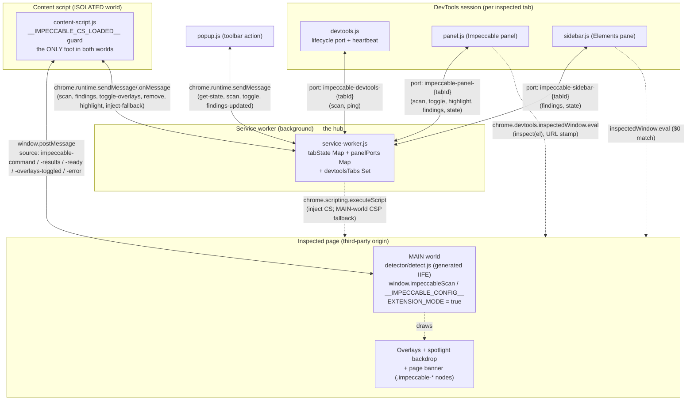

# Impeccable Chrome Extension — Deep Technical Audit

**Subsystem:** the MV3 Chrome (and derived Firefox) extension that injects
Impeccable's single-file, framework-agnostic *page-analysis engine* into
arbitrary third-party pages and surfaces its findings in a DevTools panel,
an Elements sidebar pane, and a toolbar popup. **Audience:** the YoinkIt team.
Everything is framed toward what a capture tool that injects `window.__cap`
into arbitrary pages through an MV3 wrapper can lift, adapt, or must avoid.

Impeccable's extension solves a problem structurally identical to YoinkIt's
extension: get **one source-of-truth engine** into the page's MAIN world on any
origin (including strict-CSP pages), drive it from extension UI that lives in a
different JavaScript world, survive the MV3 service worker dying mid-session, and
never measure its own injected chrome. The headline lessons are (1) a **CSP-proof
two-tier injection ladder** that gets the engine into MAIN world whether or not
the page's CSP blocks a script tag, (2) a **two-hop ISOLATED↔MAIN postMessage
bridge with a `ready` handshake** that makes "use the engine" deterministic
instead of timing-based, and (3) an **MV3 service-worker-death survival kit**
(auto-reconnecting named ports, heartbeats, await-don't-`setTimeout` teardown)
that keeps a multi-second session correct across a cold worker.

All source paths are under `../../source/` (i.e. `audit/impeccable/source/`).

> **Deep dives.** This report is the overview. Four companions go to the floor on
> the parts a fresh agent would reason about or rebuild, and they correct several
> first-draft and upstream-doc inaccuracies (flagged inline below):
>
> - [`02a-manifest-permissions-build.md`](02a-manifest-permissions-build.md): the manifest + permission posture, `web_accessible_resources`, and the **generate-then-embed build pipeline** (five ES modules → three IIFE bundles, the Firefox-manifest derivation, the zip packaging, and the store-listing rule-count drift).
> - [`02b-messaging-and-survival.md`](02b-messaging-and-survival.md): the two transports, the SW-as-hub message graph, the named-port lifecycle, the **two-hop bridge vocabulary** traced end to end, and the **MV3 SW-death survival kit** + navigation/SPA reset.
> - [`02c-injection-and-main-world.md`](02c-injection-and-main-world.md): why MAIN world, the **CSP two-tier injection ladder**, `EXTENSION_MODE` detection, the **`ready`-handshake race**, idempotency/double-injection guards, namespacing, and footprint scrubbing.
> - [`02d-devtools-surfaces.md`](02d-devtools-surfaces.md): the panel/sidebar/popup surfaces, the three `inspectedWindow.eval` uses (**click-to-inspect, URL stamp, `$0` matching**), theme matching, per-rule settings, and the agent-ready **copy-as-markdown** output.
>
> **Corrections to the first draft and the upstream docs, up front:**
> - The upstream `CLAUDE.md` still calls `cli/engine/detect-antipatterns.mjs`
>   "the source of truth for the rule engine" with `checkXxx` logic at in-file
>   lines ~1837 / ~2058. That file is now a **50-line re-export facade**
>   ([`detect-antipatterns.mjs:11-50`](../../source/cli/engine/detect-antipatterns.mjs));
>   the engine is modular under `engines/`, `registry/`, `rules/`,
>   `browser/injected/`, and the live browser loop is `collectBrowserFindings`
>   at [`injected/index.mjs:1455`](../../source/cli/engine/browser/injected/index.mjs).
> - [`STORE_LISTING.md:11`](../../source/extension/STORE_LISTING.md) advertises
>   "**41** common UI anti-patterns." The registry actually has **44** (26 `slop`
>   + 18 `quality`, 4 provider-gated; verified, and matching [01a](../01-detector-engine/01a-rule-trinity-and-dispatch.md)).
>   The generated `antipatterns.json` and the panel show 44. The "41" is stale
>   marketing copy.
> - The first draft's file-map counts were +1 on `manifest.json` (32, not 33) and
>   `index.mjs` (1,937, not 1,938). Corrected below.
> - The first draft conflated SPA re-arm with the full-navigation reset. They are
>   **two different paths** (see [02b §6](02b-messaging-and-survival.md)).
> - The toolbar **badge** and the **panel/popup** count *different numbers*
>   (elements vs findings); see [02d](02d-devtools-surfaces.md).

---

## File map

Click-through index of the subsystem. Line counts are content lines (a few files
ship without a trailing newline, so `wc -l` reads one lower). Paths are relative
to `../../source/`.

| File | Lines | Role |
|---|---|---|
| [`extension/manifest.json`](../../source/extension/manifest.json) | 32 | MV3 manifest: 4 narrow permissions + `<all_urls>`, devtools page, popup, one `web_accessible_resource`, **no `content_scripts` block** |
| [`extension/background/service-worker.js`](../../source/extension/background/service-worker.js) | 272 | The hub: message router, per-tab state in two `Map`s, badge, on-demand content-script injection, CSP-fallback MAIN-world injector, named-port lifecycle, navigation reset |
| [`extension/content/content-script.js`](../../source/extension/content/content-script.js) | 125 | ISOLATED-world bridge: injects the MAIN-world engine via `<script src>`, transcodes `chrome.runtime` ↔ `window.postMessage`, idempotency guard, SPA-nav detection |
| [`extension/devtools/devtools.html`](../../source/extension/devtools/devtools.html) | 5 | Shell that loads `devtools.js` |
| [`extension/devtools/devtools.js`](../../source/extension/devtools/devtools.js) | 51 | Registers the panel + Elements sidebar pane; owns the canonical "DevTools open/closed" lifecycle port + 20s heartbeat |
| [`extension/devtools/panel.{html,js,css}`](../../source/extension/devtools/panel.js) | 519 (js) | Main UI: grouped findings, per-rule settings, click-to-inspect, copy-as-markdown, hover→page-spotlight, theme matching |
| [`extension/devtools/sidebar.{html,js,css}`](../../source/extension/devtools/sidebar.js) | 104 (js) | Elements-panel sidebar: findings for the currently selected `$0` via a "ship all selectors, ask the page" eval |
| [`extension/popup/popup.{html,js,css}`](../../source/extension/popup/popup.js) | 67 (js) | Toolbar popup: finding count, Scan, toggle-overlays |
| [`extension/STORE_LISTING.md`](../../source/extension/STORE_LISTING.md) | 70 | Chrome Web Store copy (single-purpose, "100% local", **stale "41" rule count**) |
| [`scripts/build-extension.js`](../../source/scripts/build-extension.js) | 160 | Generates `detect.js` + `antipatterns.json`, derives the Firefox manifest, zips both stores |
| [`scripts/build-browser-detector.js`](../../source/scripts/build-browser-detector.js) | 63 | Sibling generator: same 5 modules → the CLI/Puppeteer bundle + the website-overlay copy |
| [`cli/engine/browser/injected/index.mjs`](../../source/cli/engine/browser/injected/index.mjs) | 1,937 | **The engine source.** The whole file is guarded `if (IS_BROWSER)`; the dual-mode (`EXTENSION_MODE`) page-side runtime, `window.impeccable*` API |
| [`cli/engine/registry/antipatterns.mjs`](../../source/cli/engine/registry/antipatterns.mjs) | 448 | `ANTIPATTERNS` array (44 rules) shared across CLI/site/extension |
| [`cli/engine/detect-antipatterns.mjs`](../../source/cli/engine/detect-antipatterns.mjs) | 50 | **Facade** (re-exports + main-module guard). Not the engine; see the correction above |
| `extension/detector/detect.js` | *generated* | The engine, IIFE-wrapped. **gitignored** ([`.gitignore:75`](../../source/.gitignore)), absent from the clone |
| `extension/detector/antipatterns.json` | *generated* | Rule metadata `{id,name,category,description}` the panel fetches for settings + tooltips. **gitignored**, absent from the clone |

---

## The shape in one paragraph

Impeccable's extension is a thin **messaging-and-UI shell** wrapped around a fat,
**generated, dependency-free page-context engine**. The shell (manifest + service
worker + content script + four HTML surfaces) is ~1,100 lines of plumbing whose
only jobs are: (a) lazily inject a content-script *bridge* into the inspected tab
on real user engagement; (b) have that bridge inject a `web_accessible_resource`
script into the page's **MAIN world**, with a service-worker `executeScript`
fallback for strict-CSP pages; (c) shuttle a JSON `scan` command in and a JSON
`findings` array out over a **two-hop bridge** (`chrome.runtime` messaging ↔
`window.postMessage`); and (d) render those findings in a DevTools panel /
sidebar / popup with click-to-inspect. The engine that does the actual work
(overlay drawing, selector generation, contrast sampling, anti-pattern detection)
is [`cli/engine/browser/injected/index.mjs`](../../source/cli/engine/browser/injected/index.mjs),
authored once as an ES module that *also* powers the CLI's Puppeteer scan and the
public website, then **concatenated and IIFE-wrapped at build time** into
`extension/detector/detect.js`. The extension is deliberately permission-frugal
(on-demand injection, no static content scripts) and runs **100% locally** — zero
network egress.

This mirrors YoinkIt almost one-for-one: `capture-animation.js` is the single
engine the extension and the snippet both load; the MV3 wrapper has the same
MAIN-world / arbitrary-page / arm-before-loaded problems. Read every section
through the **inversion** ([`00-EXECUTIVE-SUMMARY.md`](../../00-EXECUTIVE-SUMMARY.md)):
Impeccable's "capture" is trivial (read `outerHTML` + computed styles from an
overlay it already injected), so what it engineers here is *delivery and
lifecycle*, which transfers cleanly; it takes for granted the real-browser
rendering fidelity that is YoinkIt's hard problem.

---

## Component topology



The shape: **one service worker is the hub.** Every UI surface (panel, sidebar,
popup, devtools page) talks *only* to the SW, never to each other, and never
directly to the page — except the two DevTools surfaces, which *additionally*
hold `chrome.devtools.inspectedWindow.eval` for synchronous `inspect`/URL/`$0`
operations the message bridge cannot do. The **content script is the only
component with a foot in both worlds** (extension messaging *and* the page's
`window`). The engine in MAIN world never touches `chrome.*`; it only knows
`window.postMessage`. That asymmetry is *why* the two-hop bridge exists.

### Representative flow: open the panel → scan → render → hover → inspect

```mermaid
sequenceDiagram
    actor U as User
    participant DT as devtools.js
    participant PN as panel.js
    participant SW as service-worker.js
    participant CS as content-script.js (ISOLATED)
    participant EN as detect.js (MAIN world)

    U->>DT: Opens DevTools
    DT->>SW: connect port "impeccable-devtools-{tabId}"
    Note over SW: devtoolsTabs.add(tabId)
    DT->>DT: read autoScan (default 'panel' → wait)
    U->>PN: Clicks "Impeccable" panel tab
    PN->>SW: connect port "impeccable-panel-{tabId}"
    SW->>PN: port.postMessage {action:'state', findings:[]}
    Note over SW: findings empty → trigger scan (recovery)
    SW->>SW: ensureContentScriptInjected(tabId)
    SW->>CS: executeScript(content-script.js)
    SW->>CS: tabs.sendMessage {action:'scan', config}
    CS->>CS: injectAndScan(): set documentElement.dataset + pendingScan=true
    CS->>EN: append <script src=chrome-extension://…/detector/detect.js>
    Note over EN: onerror (strict CSP) → SW executeScript world:MAIN
    EN-->>CS: window.postMessage {source:'impeccable-ready'}
    CS->>EN: window.postMessage {source:'impeccable-command', action:'scan', config}
    EN->>EN: scan(): collectBrowserFindings(), draw overlays + banner
    EN-->>CS: window.postMessage {source:'impeccable-results', findings, count}
    CS->>SW: chrome.runtime.sendMessage {action:'findings', findings}
    SW->>SW: tabState[tabId].findings = findings; updateBadge()
    SW->>PN: port.postMessage {action:'findings', findings}
    PN->>U: renderFindings() — grouped list + page overlays
    U->>PN: hover a finding row
    PN->>SW: port {action:'highlight', selector}
    SW->>CS: tabs.sendMessage {action:'highlight', selector}
    CS->>EN: postMessage {source:'impeccable-command', action:'highlight', selector}
    EN->>EN: scrollIntoView + spotlight target, dim siblings
    U->>PN: click a finding row
    PN->>EN: inspectedWindow.eval("inspect(querySelector(sel))")
```

The **two-hop bridge** is the load-bearing pattern, and the reason it has two
hops: `chrome.runtime` messaging cannot reach the MAIN world, and the MAIN-world
engine cannot call `chrome.*`, so the content script transcodes between them in
both directions. The `impeccable-ready` step is not cosmetic — it is what makes
"send the scan command" wait until the engine has actually loaded and registered
its listener. That race, and the CSP fallback drawn as a `Note` above, are the
two things worth rebuilding carefully; both are dissected in
[02c](02c-injection-and-main-world.md).

---

## 1. The four problems this subsystem solves

A capture/extraction tool that injects one engine into arbitrary pages through an
MV3 extension has to solve the same four problems Impeccable solved here. The
sub-dives map onto them:

1. **What ships, and what it's allowed to do.** A frugal manifest, on-demand
   injection instead of a static `content_scripts` block, one web-accessible
   resource, zero egress — and a build that bakes the modular engine into a
   single self-contained IIFE so the extension and the CLI/site cannot drift.
   → [02a](02a-manifest-permissions-build.md).
2. **How the pieces talk, and stay alive.** Two transports (one-shot messages +
   named long-lived ports), a single-hub topology, per-tab state in two `Map`s,
   the two-hop bridge vocabulary, and the MV3 survival machinery for when the
   service worker dies mid-session. → [02b](02b-messaging-and-survival.md).
3. **How the engine gets into the page, and behaves once there.** The MAIN-world
   requirement, the CSP two-tier injection ladder, `EXTENSION_MODE` detection,
   the `ready` handshake that solves arm-before-loaded, double-injection
   idempotency, namespacing, and footprint scrubbing. → [02c](02c-injection-and-main-world.md).
4. **How a human reads the results.** The DevTools panel + Elements sidebar +
   popup, the three `inspectedWindow.eval` uses, theme matching, per-rule
   settings persisted to `storage.sync`, and the agent-ready copy-as-markdown
   output. → [02d](02d-devtools-surfaces.md).

---

## 2. The two-hop bridge, stated precisely

Three JavaScript execution contexts that never share memory:

- **MAIN world** (the page's real `window`): the engine. Has
  `getComputedStyle`, `document.styleSheets.cssRules`, `elementsFromPoint`,
  canvas pixels. Has **no** `chrome.*`.
- **ISOLATED world** (the content script): shares the DOM with MAIN but has its
  own JS globals, and **has** `chrome.runtime`. This is the only context that can
  see both `chrome.*` and the page's `window`.
- **Extension contexts** (service worker, panel, sidebar, popup): have the full
  `chrome.*` API but cannot touch the page DOM at all.

So a command from the panel reaches the engine by **two hops**:
`panel → (port) → SW → (tabs.sendMessage) → content script → (window.postMessage) → engine`,
and a result returns the same way in reverse. The content script is the pivot.
Every message in the page-bound direction carries `source: 'impeccable-command'`;
results carry `source: 'impeccable-results'` (plus `-ready`, `-overlays-toggled`,
`-error`). Every inbound `window.message` handler guards with
`e.source !== window` before trusting the payload
([content-script.js:46](../../source/extension/content/content-script.js),
[index.mjs:1858](../../source/cli/engine/browser/injected/index.mjs)). The full
vocabulary and a redraw-grade trace are in [02b](02b-messaging-and-survival.md);
the injection half and the handshake are in [02c](02c-injection-and-main-world.md).

For YoinkIt this is the exact bridge needed to drive `__cap.on`/`scan`/`dump`
from a "Capture" panel while the engine runs in page context — the same
two-world split, the same need for a `ready` handshake before arming.

---

## 3. Patterns worth stealing for YoinkIt (ranked)

Ranked by leverage for YoinkIt's extension. Each is detailed, with `file:line`,
in the sub-dive named.

1. **CSP-proof two-tier injection ladder.** Cheap `<script src=getURL(...)>` from
   the content script first; on `script.onerror` (strict CSP blocks the tag), the
   SW falls back to `chrome.scripting.executeScript({ world:'MAIN', files:[...] })`,
   which is **not** subject to page CSP. Capture runs on arbitrary pages where
   `script-src 'self'` is common; this is the robust way to get `__cap` into MAIN
   world regardless. → [02c §2](02c-injection-and-main-world.md).
   ([content-script.js:113-123](../../source/extension/content/content-script.js),
   [service-worker.js:125-137](../../source/extension/background/service-worker.js))
2. **MAIN-world bridge with a `ready` handshake.** The engine announces
   `impeccable-ready` and *waits* for a command instead of auto-scanning; the
   content script holds a `pendingScan` flag and fires the scan only on ready.
   This is the direct fix for YoinkIt's *"arming mid-transition captures
   nothing"* — make arming deterministic, not timing-based. → [02c §3](02c-injection-and-main-world.md).
   ([index.mjs:1855-1912](../../source/cli/engine/browser/injected/index.mjs),
   [content-script.js:63-69](../../source/extension/content/content-script.js))
3. **On-demand injection, no `content_scripts`, per-tab state.** Nothing is
   always-on; the bridge is injected only on real engagement, tracked by
   `csInjected`/`injected` flags, with `webNavigation.onCompleted` resetting
   per-tab state. Frugal permissions + zero egress is also the right privacy
   posture for a tool that reads arbitrary pages. → [02a §1-2](02a-manifest-permissions-build.md), [02b §5-6](02b-messaging-and-survival.md).
   ([service-worker.js:9-12,56-74,244-266](../../source/extension/background/service-worker.js))
4. **MV3 SW-death survival kit.** Auto-reconnecting named ports + 20s heartbeats
   + `await`-the-teardown-message (not `setTimeout`) + a `postToPort()`
   "retry-once-with-a-fresh-port" idiom. YoinkIt's timed-capture recipe spans
   many seconds and *will* outlive a cold SW. → [02b §4](02b-messaging-and-survival.md).
   ([devtools.js:39-50](../../source/extension/devtools/devtools.js),
   [panel.js:26-34,193](../../source/extension/devtools/panel.js),
   [service-worker.js:153-168,182-186](../../source/extension/background/service-worker.js))
5. **Single-source engine, IIFE-lowered at build time.** Author in modules,
   concatenate + strip `import`/`export` + wrap in
   `if (typeof window === 'undefined') return;`, assign the public API to
   `window` at the end. Lets YoinkIt keep one source of truth while shipping a
   self-contained file to *both* the extension and the snippet. → [02a §3](02a-manifest-permissions-build.md).
   ([build-extension.js:49-68](../../source/scripts/build-extension.js),
   [index.mjs:1930-1936](../../source/cli/engine/browser/injected/index.mjs))

Secondary but valuable:

6. **DevTools-native delivery beats a floating overlay.** A "Capture" panel +
   Elements sidebar + click-to-`inspect()` + `$0` binding + `themeName` theming.
   → [02d](02d-devtools-surfaces.md).
7. **Footprint scrubbing in every scan loop** (skip `.impeccable-*`, skip
   `claude-`/`cic-` other-extension nodes, clone-and-strip before regex). `scan()`
   and `dump()` must not measure YoinkIt's own toolbar. → [02c §5](02c-injection-and-main-world.md).
8. **Agent-ready copy-as-markdown.** A one-click "copy spec for your coding agent"
   with a URL stamp is exactly on-brand for "emit an agent-ready spec, not code."
   → [02d §4](02d-devtools-surfaces.md).

### What *not* to copy (hardening gaps)

- **`postMessage(..., '*')` everywhere** ([content-script.js:28](../../source/extension/content/content-script.js),
  [index.mjs:1654,1796,1870,1912](../../source/cli/engine/browser/injected/index.mjs)).
  Same-window only and `e.source` is checked inbound, but any same-window listener
  can read findings. YoinkIt should target `location.origin` and add a
  per-injection nonce to the `source` tag. → [02c §6](02c-injection-and-main-world.md).
- **Broad `web_accessible_resources` over `<all_urls>`** exposes the engine and a
  fingerprintable extension id to every page. Unavoidable for an everywhere-tool,
  but a conscious decision for YoinkIt, not a default. → [02a §2](02a-manifest-permissions-build.md).
- **`<all_urls>` host permission** triggers the scariest install prompt; consider
  `activeTab` + `optional_host_permissions` if capture is always user-initiated.
  → [02a §1](02a-manifest-permissions-build.md).
- **String-built `inspectedWindow.eval`** is safe here *only* because every
  interpolated value is `JSON.stringify`'d engine-generated data. Never eval
  anything derived from page text. → [02d §3](02d-devtools-surfaces.md).

---

## Appendix: cross-cutting observations & surprises

- **The engine is the same text in three runtimes, selected by globals.** One
  file ([`index.mjs`](../../source/cli/engine/browser/injected/index.mjs)) serves
  Puppeteer (CLI), the MV3 extension, and the website overlay; `EXTENSION_MODE`
  ([:8-10](../../source/cli/engine/browser/injected/index.mjs)) and
  `window.__IMPECCABLE_CONFIG__` switch its behavior. Three *generated* bundle
  files come from the *same five modules* via two near-identical build scripts.
  See [02a §3](02a-manifest-permissions-build.md).
- **The browser path runs *every* rule; gating is output-only.** In a live page
  running a check is free, so the engine never filters provider-gated rules; only
  the Node CLI return path does ([index.mjs:1461-1464](../../source/cli/engine/browser/injected/index.mjs)).
  A useful mental model for capture: *collect broadly, filter at emit.*
- **The generated bundle is gitignored.** `extension/detector/detect.js` and
  `antipatterns.json` are build artifacts ([`.gitignore:75`](../../source/.gitignore)),
  absent from a fresh clone; they exist only after `bun run build:extension`. The
  release script refuses to tag if they are stale. See [02a §3-4](02a-manifest-permissions-build.md).
- **Two navigation paths, not one.** Full navigations reset state in the SW via
  `webNavigation.onCompleted` (and conditionally rescan); SPA route changes are
  handled separately in the content script via `popstate`/`hashchange` — and
  `pushState`/`replaceState` are explicitly **not** covered. See [02b §6](02b-messaging-and-survival.md).
- **The count shown to the user is inconsistent across surfaces.** The toolbar
  badge shows the number of *flagged elements* ([service-worker.js:23](../../source/extension/background/service-worker.js));
  the popup and the panel badge show the number of *individual findings*
  ([popup.js:21](../../source/extension/popup/popup.js),
  [panel.js:406](../../source/extension/devtools/panel.js)). Minor, but a real
  inconsistency the first draft missed. See [02d §1](02d-devtools-surfaces.md).
- **Relative-link drift in the sibling 01 folder (meta-finding).** The recent
  "move detector-engine reports into their own folder" commit left all 190
  `../source/` links inside `reports/01-detector-engine/` pointing one level too
  shallow (correct is `../../source/`), and the README still links report 01 and
  its sub-dives at their old flat paths. This 02 folder uses the correct
  `../../source/` depth; the README links are fixed for both 01 and 02 in this
  pass. The 01 *report files* were left untouched per scope.
