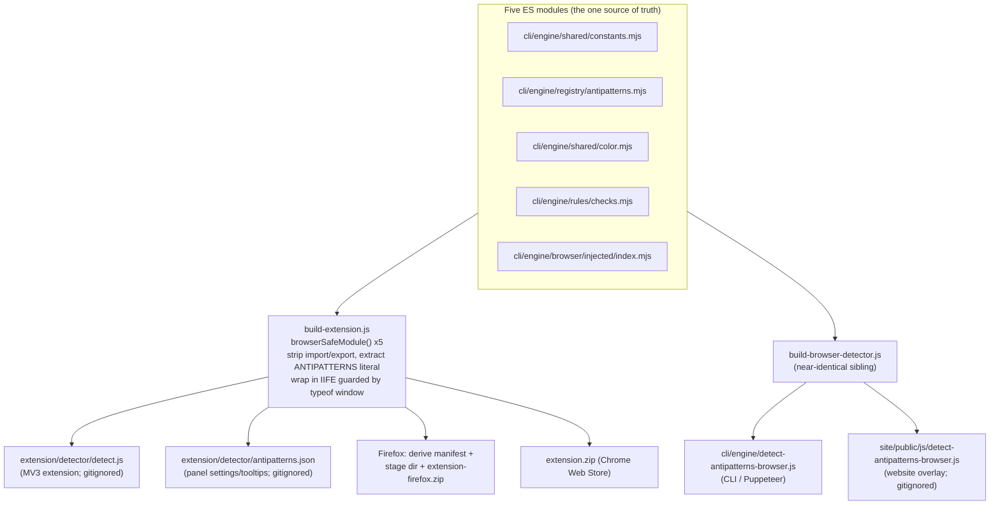

# Extension deep dive 02a — manifest, permissions, and the generate-then-embed build

Companion to [`02-chrome-extension.md`](02-chrome-extension.md). This one covers
**what ships and what it is allowed to do**: the MV3 manifest, the frugal
permission posture, the single web-accessible resource, and the build pipeline
that lowers the modular ES engine into the self-contained IIFE the extension
loads. If a fresh agent is going to author YoinkIt's `manifest.json` or wire a
build step that bakes `capture-animation.js` into the extension *and* the snippet
from one source, this is the reference.

All `file:line` references are into `../../source/`.

---

## 1. The manifest, field by field

[`extension/manifest.json`](../../source/extension/manifest.json) is 32 lines.
The whole thing:

```json
{
  "manifest_version": 3,
  "name": "Impeccable",
  "description": "Detect common UI anti-patterns in any web page",
  "version": "1.2.0",
  "permissions": ["activeTab", "scripting", "storage", "webNavigation"],
  "host_permissions": ["<all_urls>"],
  "background": { "service_worker": "background/service-worker.js" },
  "devtools_page": "devtools/devtools.html",
  "action": { "default_popup": "popup/popup.html", "default_icon": { … } },
  "icons": { … },
  "web_accessible_resources": [
    { "resources": ["detector/detect.js"], "matches": ["<all_urls>"] }
  ]
}
```

The permission posture is the headline: four narrow API permissions for an
extension that can run on every site.

| Permission | Why it's here | Audit note |
|---|---|---|
| `activeTab` | Lets the toolbar popup act on the current tab without a broad grant prompt | Paired with `scripting` for the popup→scan path ([popup.js:51-57](../../source/extension/popup/popup.js)) |
| `scripting` | `chrome.scripting.executeScript` is **both** how the content script is injected on demand ([service-worker.js:63](../../source/extension/background/service-worker.js)) **and** how the CSP fallback injects the engine into MAIN world ([service-worker.js:127](../../source/extension/background/service-worker.js)) | The single most important permission; the whole on-demand model and the CSP ladder depend on it |
| `storage` | `chrome.storage.sync` holds settings: `disabledRules`, `lineLengthMode`, `spotlightBlur`, `autoScan` ([service-worker.js:38-45](../../source/extension/background/service-worker.js)) | `sync`, not `local` → settings roam across the user's Chrome profiles |
| `webNavigation` | `chrome.webNavigation.onCompleted` resets per-tab state on full navigations ([service-worker.js:244](../../source/extension/background/service-worker.js)) | Top-frame only (`details.frameId !== 0` early-returns at [:245](../../source/extension/background/service-worker.js)) |

`host_permissions: ["<all_urls>"]` is the one broad grant, and the only thing
that lets `executeScript` run against arbitrary origins. It also triggers the
scariest install prompt Chrome shows. The mitigation is **structural, not a
permission**: there is **no `content_scripts` block in the manifest at all**. See
§2.

Other entries are unremarkable but worth noting for what they *don't* include:
`devtools_page` registers the DevTools surfaces, `action.default_popup` is the
toolbar popup, plus standard icons. There is **no `commands`, no `omnibox`, no
`declarativeNetRequest`, no `host`-level content scripts** — nothing that implies
keyboard shortcuts, URL bar interception, or network interception. The store
listing makes the egress claim explicit: *"Runs 100% locally, no data sent
anywhere"* ([STORE_LISTING.md:55](../../source/extension/STORE_LISTING.md)).

**For YoinkIt:** copy this posture. Capture is always user-initiated, so the same
four permissions cover it. If the `<all_urls>` install prompt is a concern, the
hardening option is `activeTab` + `optional_host_permissions: ["<all_urls>"]` and
request the broad grant only when the user starts a capture — trading a little
friction for a much gentler default prompt.

---

## 2. `web_accessible_resources` and the "no content_scripts" mitigation

Two design decisions work together to keep the always-on footprint near zero.

### 2.1 No static content scripts — inject on engagement

There is no `content_scripts` entry. The bridge script is injected only when the
user explicitly engages (opens the panel/sidebar, or clicks Scan in the popup),
gated entirely in the service worker. The SW comment states the intent
([service-worker.js:56-58](../../source/extension/background/service-worker.js)):

> *"We removed the static content_scripts entry to minimize the always-on
> footprint; the script is only loaded when the user explicitly engages with the
> extension (DevTools panel/sidebar opened, popup scan, etc)."*

The mechanism is `ensureContentScriptInjected(tabId)`
([service-worker.js:59-74](../../source/extension/background/service-worker.js)):
it checks a per-tab `csInjected` flag, calls
`chrome.scripting.executeScript({ target:{tabId}, files:['content/content-script.js'], injectImmediately:true })`,
and on success sets the flag. Failure (chrome:// pages, the web store, other
restricted URLs) is swallowed and returns `false`. The injection-gating side of
this lives in [02b §5](02b-messaging-and-survival.md); the page-side injection
of the *engine* (a separate, second injection) is in [02c](02c-injection-and-main-world.md).

### 2.2 One web-accessible resource

```json
"web_accessible_resources": [
  { "resources": ["detector/detect.js"], "matches": ["<all_urls>"] }
]
```

This is required because the content script injects the engine by setting
`script.src = chrome.runtime.getURL('detector/detect.js')`
([content-script.js:114](../../source/extension/content/content-script.js)); a
`chrome-extension://` URL is only loadable from a page if the resource is
web-accessible. The **object form** (MV3) with `matches: ["<all_urls>"]` means
the `extension_id`-revealing URL is exposed to every origin — a page can
`fetch()` it and fingerprint the extension's presence. This is an accepted
trade-off for a tool meant to run everywhere, flagged as a hardening gap in the
overview. YoinkIt should scope `matches` as tightly as the injection ladder
allows and treat the fingerprint as a conscious decision.

---

## 3. The generate-then-embed build pipeline

The engine is authored **once** as ES modules and mechanically lowered into a
browser-global IIFE. There are **two** build scripts that do this from the
**same five modules**, producing **three** generated bundle files:



### 3.1 The five modules and the concatenation

[`build-extension.js:27-33`](../../source/scripts/build-extension.js) lists the
modules in dependency order:

```js
const BROWSER_MODULES = [
  'cli/engine/shared/constants.mjs',
  'cli/engine/registry/antipatterns.mjs',
  'cli/engine/shared/color.mjs',
  'cli/engine/rules/checks.mjs',
  'cli/engine/browser/injected/index.mjs',
];
```

[`build-browser-detector.js:17-23`](../../source/scripts/build-browser-detector.js)
declares the **identical** list under the name `MODULES`. The two scripts are
near-duplicates; `browserSafeModule()` is copy-pasted verbatim between them
([build-extension.js:37-47](../../source/scripts/build-extension.js),
[build-browser-detector.js:27-37](../../source/scripts/build-browser-detector.js)).
A YoinkIt port should factor this into one shared helper rather than copy it.

### 3.2 `browserSafeModule()` — two transforms

```js
function browserSafeModule(relPath) {
  let code = fs.readFileSync(path.join(ROOT, relPath), 'utf-8');
  if (relPath === 'cli/engine/registry/antipatterns.mjs') {
    const match = code.match(/const ANTIPATTERNS = \[[\s\S]*?\n\];/);
    if (!match) throw new Error('Could not extract browser antipattern registry');
    code = match[0];
  }
  code = code.replace(/^import[\s\S]*?;\n/gm, '');     // strip imports
  code = code.replace(/^export\s+\{[\s\S]*?^};\n?/gm, ''); // strip export blocks
  return `// --- ${relPath} ---\n${code.trim()}\n`;
}
```

([build-extension.js:37-47](../../source/scripts/build-extension.js))

Two transforms per file:

1. **For the registry only**, a regex extracts just the
   `const ANTIPATTERNS = [ … ];` literal and discards the rest of the module (its
   helper exports like `getAntipattern`, `RULE_ENGINE_SUPPORT`). The browser
   engine needs only the data array.
2. **For every file**, strip top-of-line `import …;` statements and
   `export { … };` blocks, so the concatenation lives in one shared lexical
   scope (the next module's code can reference the previous module's
   now-top-level `const`s).

A subtlety worth knowing: `build-extension.js` *also* statically
`import { ANTIPATTERNS }`s the registry at the top
([:21](../../source/scripts/build-extension.js)) to build `antipatterns.json`
(§3.4). So the registry is consumed **twice** in two forms — as a stripped source
literal for the detector bundle, and as a live import for the JSON projection.

### 3.3 The IIFE wrap

```js
const code = BROWSER_MODULES.map(browserSafeModule).join('\n');
const output = `/**
 * … GENERATED -- do not edit. Source: cli/engine/browser/injected/index.mjs
 * Rebuild: node scripts/build-extension.js
 */
(function () {
if (typeof window === 'undefined') return;
${code}
})();
`;
fs.writeFileSync(DETECTOR_OUTPUT, output);
```

([build-extension.js:49-68](../../source/scripts/build-extension.js))

The guard `if (typeof window === 'undefined') return;` is what lets the **same
module text** be both a Node import (where the browser block is dead, because
`window` is undefined) and a page-injected IIFE (where it runs). It pairs with
the engine's own top-line `const IS_BROWSER = typeof window !== 'undefined'`
([index.mjs:1](../../source/cli/engine/browser/injected/index.mjs)) and its
closing `window.impeccable* = …` assignments
([index.mjs:1930-1936](../../source/cli/engine/browser/injected/index.mjs)). The
header literally announces it is generated, so nobody hand-edits the artifact.
**One file, two runtimes, zero forking** — exactly YoinkIt's "single source of
truth engine" rule, plus the build step that lets you author in modules without
giving up the single-file ship.

### 3.4 `antipatterns.json` — the panel's metadata sidecar

```js
const apJson = ANTIPATTERNS.map(({ id, name, category, description }) => ({
  id, name, category: category || 'quality', description: description || '',
}));
fs.writeFileSync(AP_OUTPUT, JSON.stringify(apJson, null, 2) + '\n');
```

([build-extension.js:75-81](../../source/scripts/build-extension.js))

This projects the registry down to `{id, name, category, description}` and writes
it next to `detect.js`. The panel `fetch`es it
([panel.js:54](../../source/extension/devtools/panel.js)) to build its per-rule
enable/disable settings and tooltips — so the panel's rule list cannot drift from
the engine's. The build log prints `${ANTIPATTERNS.length} rules` ([:82](../../source/scripts/build-extension.js)),
which is **44** today (see §4).

### 3.5 The third and fourth bundles

[`build-browser-detector.js`](../../source/scripts/build-browser-detector.js) is
the sibling. It writes the same IIFE to **two** paths
([:24-25,58-60](../../source/scripts/build-browser-detector.js)):
`cli/engine/detect-antipatterns-browser.js` (read off disk and
`page.evaluate`'d by the Puppeteer CLI driver) and
`site/public/js/detect-antipatterns-browser.js` (the public website overlay).
So the count is: **2 build scripts → 3 generated bundle files** (`detect.js`,
the CLI copy, the site copy), all from the **same 5 modules**. The CLI browser
bundle is generated but tracked and CI-guarded; the extension and site copies are
ignored and rebuilt or copied as needed. The shared module list keeps the engine
source aligned, but the artifact identities differ.

---

## 4. The Firefox manifest is derived, the zips are built, the count is stale

### 4.1 Firefox manifest derivation

The Firefox manifest is **generated from the Chrome one at build time**, not
hand-maintained ([build-extension.js:120-141](../../source/scripts/build-extension.js)):

```js
const firefoxManifest = {
  ...chromeManifest,
  background: { scripts: [serviceWorker] },   // event-page form, not service_worker
  browser_specific_settings: {
    gecko: {
      id: 'impeccable@bakaus.com',
      strict_min_version: '140.0',
      data_collection_permissions: { required: ['none'] },
    },
  },
};
```

Three transforms: (1) `background.service_worker` → `background.scripts` (Gecko's
universally-supported MV3 event-page path); (2) a `gecko` id; (3)
`data_collection_permissions: { required: ['none'] }` (required by AMO for new
submissions on Firefox 140+, which is why `strict_min_version` is pinned to
`140.0`). The comment notes the SW "uses only top-level listeners + an in-memory
`Map`, so it runs unchanged as an event page"
([:122-125](../../source/scripts/build-extension.js)) — i.e. the service worker
was *written* to survive this transform. The Firefox build is staged to a dir
(filtering `STORE_LISTING.md`/`.DS_Store`) and zipped
([:143-159](../../source/scripts/build-extension.js)).

### 4.2 Zip packaging

`packZip()` ([:93-102](../../source/scripts/build-extension.js)) shells out to
`zip -r` with `-x` excludes. The Chrome zip excludes `STORE_LISTING.md` and
`*.DS_Store` ([:106](../../source/scripts/build-extension.js)); the generated
`detector/detect.js` + `antipatterns.json` **are** included (they were written
into `EXT_DIR` moments earlier). So the shipped zip carries the engine even
though it is gitignored in the repo.

### 4.3 The artifacts are gitignored; the release build packages fresh zips

`extension/detector/` is gitignored ([.gitignore:75](../../source/.gitignore)),
as is the site copy ([.gitignore:105](../../source/.gitignore)). A fresh clone
has **no** `extension/detector/` directory — the engine bundle exists only after
`bun run build:extension`. The release path rebuilds `detect.js`,
`antipatterns.json`, and the Chrome/Firefox zips before tagging, so the shipped
archives are fresh. Do not read this as a commit-status gate on
`extension/detector/`: those files are ignored, so `git status --porcelain` and a
path-limited diff will not prove they were committed. Freshness is enforced by the
packaging step and zip existence checks, not by tracked detector artifacts.

### 4.4 The rule count drift (a correction)

[`STORE_LISTING.md:11`](../../source/extension/STORE_LISTING.md) says Impeccable
"detects **41** common UI anti-patterns." The registry actually has **44**
(verified: 26 `category: 'slop'` + 18 `category: 'quality'`; 4 carry a `gated`
tag), which matches the count in [01a](../01-detector-engine/01a-rule-trinity-and-dispatch.md).
The generated `antipatterns.json` and the panel's settings list both reflect 44.
The "41" is stale marketing copy that the build does not validate. The current
count-consistency checks cover `site/pages/index.astro`, `README.md`,
`AGENTS.md`, `.claude-plugin/plugin.json`, and `.claude-plugin/marketplace.json`;
they do not cover `extension/STORE_LISTING.md` or `README.npm.md`. Historical
changelog entries that mention 41 are intentionally stripped out of the current
count check. A second, softer overstatement sits at
[STORE_LISTING.md:48](../../source/extension/STORE_LISTING.md) — *"Auto-scans
when DevTools opens, no manual step needed"* — but the **default** `autoScan` is
`'panel'`, which waits until the user opens the Impeccable panel or sidebar;
opening DevTools alone does nothing unless the user switched the setting to
`'devtools'` ([devtools.js:31-38](../../source/extension/devtools/devtools.js),
[02d §2](02d-devtools-surfaces.md)).

---

## 5. What this means for YoinkIt

- **STEAL the permission posture verbatim.** `activeTab` + `scripting` +
  `storage` + `webNavigation`, `<all_urls>` host permission, **no
  `content_scripts`**, one web-accessible resource, zero egress. It is the right
  privacy story for a tool that reads arbitrary pages and the cleanest Web-Store
  review story. Consider `optional_host_permissions` to soften the `<all_urls>`
  install prompt since capture is always user-initiated.
- **STEAL the generate-then-embed build.** YoinkIt keeps `capture-animation.js`
  as one file *by hand* today. The moment it benefits from splitting into modules
  (sampling core, easing inference, selector gen, overlay), adopt this exact
  build: list the modules, strip `import`/`export`, wrap in
  `if (typeof window === 'undefined') return;`, assign the API to `window`. Ship
  the one IIFE to **both** the extension and the DevTools-snippet fallback from
  the same source so they cannot drift — which is the whole point of YoinkIt's
  "single source of truth engine" rule.
- **STEAL the metadata-sidecar pattern.** If YoinkIt's panel ever needs a
  rule/trigger/viewport list, project it from the engine source into a generated
  JSON the panel `fetch`es, so the UI cannot disagree with the engine.
- **STEAL the derive-don't-fork manifest** if YoinkIt ever targets Firefox:
  generate the Gecko manifest from the Chrome one, and write the service worker so
  it survives the event-page transform (top-level listeners + in-memory state
  only).
- **AVOID** shipping a hand-maintained rule/feature count in store copy; if you
  must, wire it into the build's count-consistency check so it cannot go stale
  like the "41" here.
- **ADAPT** the gitignore + release-package discipline: if the generated bundle
  stays out of git, make the release rebuild the artifact and validate the shipped
  zip, rather than relying on `git status` for ignored paths. For YoinkIt that
  maps to "never tag a release whose shipped engine differs from
  `capture-animation.js`."

The messaging graph that drives this engine, and the machinery that keeps it
alive across an MV3 service-worker death, are in
[02b](02b-messaging-and-survival.md). How the engine actually gets into the page
is [02c](02c-injection-and-main-world.md).
