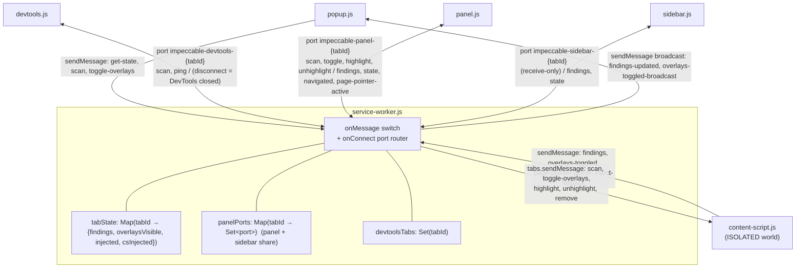

# Extension deep dive 02b — messaging topology and MV3 service-worker survival

Companion to [`02-chrome-extension.md`](02-chrome-extension.md). This one goes to
the floor on **how the pieces talk and stay alive**: the two transports, the
service-worker-as-hub graph, the per-tab state, the named-port lifecycle, the
two-hop bridge message vocabulary traced end to end, and the machinery that keeps
a multi-second session correct when the MV3 service worker dies underneath it. If
a fresh agent is going to rebuild the message graph or the survival kit for
YoinkIt's extension, this is the reference.

All `file:line` references are into `../../source/`. The page-side injection half
of the bridge (CSP ladder, `ready` handshake) is [02c](02c-injection-and-main-world.md).

---

## 1. Two transports, used deliberately

The extension uses **two** Chrome messaging primitives, for two kinds of traffic:

| Transport | Used by | Shape | Why |
|---|---|---|---|
| `chrome.runtime.sendMessage` + one `onMessage` listener | content script, popup | one-shot, fire-and-forget (optionally `sendResponse`) | Cheap, stateless events. Works even while the SW is asleep (the message wakes it). |
| `chrome.runtime.connect` named ports | devtools page, panel, sidebar | long-lived, per-tab, named `impeccable-{devtools,panel,sidebar}-{tabId}` | Need a persistent channel *and* a disconnect signal (DevTools-closed detection), and a way to push findings to specific surfaces. |

The choice is not arbitrary: the popup is transient (opens, acts, closes) so it
uses one-shot messages; the DevTools surfaces live for the session and need the
*disconnect event*, so they use ports. The content script uses one-shot messages
inbound from the SW and outbound to it.

---

## 2. The service worker is the hub



Every UI surface talks **only** to the SW. The SW fans findings out to the right
surfaces and never lets two surfaces talk directly. Its entire state is three
in-memory containers ([service-worker.js:9-12,151](../../source/extension/background/service-worker.js)):

```js
const tabState   = new Map(); // tabId → { findings, overlaysVisible, injected, csInjected }
const panelPorts = new Map(); // tabId → Set<port>   (panel AND sidebar ports share this set)
const devtoolsTabs = new Set(); // tabId → DevTools currently open
```

`getState(tabId)` lazily seeds the default
`{ findings: [], overlaysVisible: true, injected: false, csInjected: false }`
([:14-19](../../source/extension/background/service-worker.js)).
`notifyPanels(tabId, msg)` fans a message out to every port in that tab's set,
swallowing errors from dead ports ([:29-36](../../source/extension/background/service-worker.js)).
Because this is all in memory, **a service-worker death wipes it** — which is what
§4 is about.

### 2.1 The one-shot `onMessage` switch

A single listener ([:84-148](../../source/extension/background/service-worker.js))
is a flat `if/else` keyed on `msg.action`, with `tabId` resolved as
`msg.tabId || sender.tab?.id` ([:85](../../source/extension/background/service-worker.js)) —
the popup passes an explicit `tabId` (it has no `sender.tab`), the content script
relies on `sender.tab.id`.

| `action` | Sender → SW | SW effect | Lines |
|---|---|---|---|
| `findings` | content script | store in `tabState`, set `injected=true`, `updateBadge`, `notifyPanels`, broadcast `findings-updated` for the popup | [:87-96](../../source/extension/background/service-worker.js) |
| `scan` | popup | `sendScanToTab(tabId)` | [:98-101](../../source/extension/background/service-worker.js) |
| `toggle-overlays` | popup | forward to tab via `tabs.sendMessage` | [:103-106](../../source/extension/background/service-worker.js) |
| `page-pointer-active` | content script | `notifyPanels` → panel clears its hover | [:108-111](../../source/extension/background/service-worker.js) |
| `overlays-toggled` | content script | persist `state.overlaysVisible`, notify panels + broadcast for popup | [:113-119](../../source/extension/background/service-worker.js) |
| `get-state` | popup | `sendResponse(getState(tabId))` | [:121-123](../../source/extension/background/service-worker.js) |
| `inject-fallback` | content script | **MAIN-world `executeScript` of `detect.js`** (the CSP fallback; see [02c §2](02c-injection-and-main-world.md)) | [:125-137](../../source/extension/background/service-worker.js) |
| `disabled-rules-changed` | panel | broader settings invalidation: rule toggles, line-length mode, and spotlight blur re-scan every injected tab | [:139-145](../../source/extension/background/service-worker.js) |

The `findings` and `overlays-toggled` handlers each emit a *second*, broadcast
`chrome.runtime.sendMessage` ([:94,117](../../source/extension/background/service-worker.js))
specifically so the **popup** (which has no port) can update live; the popup
listens for `findings-updated` / `overlays-toggled-broadcast`
([popup.js:36-49](../../source/extension/popup/popup.js)). The SW's own listener
also receives these broadcasts and ignores them (no matching branch).

### 2.2 The named-port lifecycle

`onConnect` ([:171-239](../../source/extension/background/service-worker.js))
parses the `tabId` out of the port name and branches on the prefix:

- **`impeccable-devtools-{tabId}`** ([:173-187](../../source/extension/background/service-worker.js)) —
  opened by `devtools.js`. `devtoolsTabs.add(tabId)`. Accepts `scan` and `ping`.
  Its `onDisconnect` is **the canonical "DevTools closed" signal** →
  `tearDownTab(tabId)` ([:182-186](../../source/extension/background/service-worker.js)).
- **`impeccable-panel-{tabId}`** ([:190-220](../../source/extension/background/service-worker.js)) —
  opened by `panel.js`. Added to `panelPorts`. On connect, the SW pushes current
  `state`, and **if no findings yet, triggers a scan** ([:199-202](../../source/extension/background/service-worker.js)) —
  this is the recovery path when the devtools.js auto-scan was lost to a SW
  termination. Accepts `scan`, `toggle-overlays`, `highlight`, `unhighlight`.
- **`impeccable-sidebar-{tabId}`** ([:225-238](../../source/extension/background/service-worker.js)) —
  opened by `sidebar.js`. Added to `panelPorts` (shares the set with the panel).
  Same "connect ⇒ scan if empty" recovery ([:232](../../source/extension/background/service-worker.js)).
  **Receive-only**: it registers `onDisconnect` cleanup but **no `onMessage`** —
  the sidebar never sends commands, only renders pushed findings.

`tearDownTab` ([:153-168](../../source/extension/background/service-worker.js))
sends `remove` to the content script (so the engine clears its overlays) and
resets `findings/injected/csInjected`. `tabs.onRemoved` deletes both maps
([:269-272](../../source/extension/background/service-worker.js)).

---

## 3. The two-hop bridge vocabulary, traced

The content script is the only pivot between `chrome.*` and the page `window`. The
full message catalog, both directions:

**Extension → page** (content script transcodes `tabs.sendMessage` → `window.postMessage`,
tagging `source: 'impeccable-command'`, [content-script.js:22-42](../../source/extension/content/content-script.js)):

| SW sends (`tabs.sendMessage`) | CS posts to page (`window.postMessage`) | Engine handler |
|---|---|---|
| `{action:'scan', config}` | injects engine if needed, else `{source:'impeccable-command', action:'scan', config}` | [index.mjs:1859-1866](../../source/cli/engine/browser/injected/index.mjs) |
| `{action:'toggle-overlays'}` | `{source:'impeccable-command', action:'toggle-overlays'}` | [index.mjs:1867-1871](../../source/cli/engine/browser/injected/index.mjs) |
| `{action:'highlight', selector}` | `{…, action:'highlight', selector}` | [index.mjs:1878-1903](../../source/cli/engine/browser/injected/index.mjs) |
| `{action:'unhighlight'}` | `{…, action:'unhighlight'}` | [index.mjs:1904-1910](../../source/cli/engine/browser/injected/index.mjs) |
| `{action:'remove'}` | `{…, action:'remove'}` + sets `injected=false` | [index.mjs:1872-1877](../../source/cli/engine/browser/injected/index.mjs) |

**Page → extension** (engine posts `window.postMessage`, content script forwards
via `chrome.runtime.sendMessage`, [content-script.js:45-70](../../source/extension/content/content-script.js)):

| Engine posts | CS forwards to SW | Notes |
|---|---|---|
| `{source:'impeccable-results', findings, count, scanId?}` | `{action:'findings', findings, count}` | the main result path; the engine can include optional `scanId`, but the content script currently drops it before the SW ([index.mjs:1794-1801,1650-1659](../../source/cli/engine/browser/injected/index.mjs)) |
| `{source:'impeccable-overlays-toggled', visible}` | `{action:'overlays-toggled', visible}` | engine toggled its own `impeccable-hidden` body class ([index.mjs:1870](../../source/cli/engine/browser/injected/index.mjs)) |
| `{source:'impeccable-ready'}` | *(not forwarded)* — flips CS `injected=true`, fires the pending scan | the handshake ([index.mjs:1912](../../source/cli/engine/browser/injected/index.mjs) → [content-script.js:63-69](../../source/extension/content/content-script.js)); see [02c §3](02c-injection-and-main-world.md) |
| `{source:'impeccable-error', message}` | *(not forwarded)* | posted by `postExtensionError` ([index.mjs:1661-1667](../../source/cli/engine/browser/injected/index.mjs)) |

Every inbound `window.message` handler guards `if (e.source !== window …)` before
trusting the payload ([content-script.js:46](../../source/extension/content/content-script.js),
[index.mjs:1858](../../source/cli/engine/browser/injected/index.mjs)). All
`window.postMessage` targets are `'*'` — a hardening gap discussed in
[02c §6](02c-injection-and-main-world.md).

---

## 4. The MV3 service-worker-death survival kit

MV3 service workers are terminated after ~30s idle (faster when the browser is
unfocused). Because the SW holds *all* state in memory, an unguarded design would
drop messages and lose findings mid-session. Four mechanisms keep it correct.

```mermaid
sequenceDiagram
    participant PN as panel.js
    participant SW as service worker
    Note over PN,SW: panel open, port connected
    loop every 20s
        PN->>SW: postToPort {action:'ping'} (heartbeat keeps SW warm)
    end
    Note over SW: …SW terminated anyway (unfocused > 30s)…
    PN->>SW: postToPort {action:'scan'}  (port is dead)
    Note over PN: getPort().postMessage throws
    PN->>PN: port=null; retry once with a fresh port
    PN->>SW: connect new port → SW wakes, re-creates state
    SW->>PN: {action:'state'} ; findings empty → SW triggers scan
```

### 4.1 Heartbeats keep the SW warm while UI is open

A 20s `ping` from the devtools page ([devtools.js:48-50](../../source/extension/devtools/devtools.js))
and from the panel ([panel.js:193](../../source/extension/devtools/panel.js)).
The SW treats `ping` as a no-op keepalive ([service-worker.js:179](../../source/extension/background/service-worker.js)).
This *reduces* but does not eliminate terminations.

### 4.2 Auto-reconnecting ports

- The devtools lifecycle port reconnects on disconnect with a 100ms tick
  ([devtools.js:39-43](../../source/extension/devtools/devtools.js)) — note the
  reconnect deliberately re-runs `connectLifecycle`, but `firstConnect` is already
  false so it does **not** re-fire the auto-scan, only restores the lifecycle
  channel.
- The panel and sidebar recreate their port **lazily** via `getPort()`
  ([panel.js:19-25](../../source/extension/devtools/panel.js),
  [sidebar.js:17-28](../../source/extension/devtools/sidebar.js)): `if (port) return port;`
  else connect fresh and re-register the message listener.

### 4.3 `postToPort()` — retry once with a fresh port

The tidiest two-line idiom in the extension
([panel.js:26-34](../../source/extension/devtools/panel.js)):

```js
function postToPort(msg) {
  try {
    getPort().postMessage(msg);
  } catch {
    port = null;                 // port died mid-call — drop it
    try { getPort().postMessage(msg); } catch { /* give up silently */ }
  }
}
```

If the SW died between heartbeats, the first `postMessage` throws on the stale
port; dropping `port` and re-`getPort()`ing reconnects and re-sends. Worth copying
as a shape. For capture-critical YoinkIt commands, the final failure should not be
silent: return an ack/error to the UI or mark the capture stale when the retry
cannot be delivered.

### 4.4 Teardown is `await`ed, never `setTimeout`

`tearDownTab` `await`s the `tabs.sendMessage({action:'remove'})`
([service-worker.js:155-159](../../source/extension/background/service-worker.js)),
and the devtools-port `onDisconnect` calls it directly. The comment is explicit
([:183-184](../../source/extension/background/service-worker.js)): *"defer with
setTimeout doesn't work reliably in MV3 because the SW can be terminated before
the timer fires."* Any cleanup that must run after an event has to keep the SW
alive by awaiting real work, not by scheduling a timer.

### 4.5 Recovery: connect ⇒ scan-if-empty

If the auto-scan was lost to a termination, the **next** port connection heals it:
both the panel and sidebar `onConnect` branches re-trigger a scan when
`!state.findings.length` ([:200-202,232](../../source/extension/background/service-worker.js)).
So even a worst-case "SW died right after DevTools opened" recovers the moment the
user clicks the panel.

---

## 5. On-demand injection gating (the SW side)

The content-script *bridge* is injected only on real engagement, gated by
`csInjected` ([service-worker.js:59-74](../../source/extension/background/service-worker.js)),
and `sendScanToTab` ([:76-81](../../source/extension/background/service-worker.js))
is the single funnel: ensure the bridge is present, build the scan config from
settings, then `tabs.sendMessage({action:'scan', config})`. The config is
assembled in `buildScanConfig` ([:47-54](../../source/extension/background/service-worker.js))
from `storage.sync` (`disabledRules`, `lineLengthMax` from `lineLengthMode`,
`spotlightBlur`). The *engine* injection (a second, page-world injection) is what
[02c](02c-injection-and-main-world.md) covers; this section is only the bridge.

---

## 6. Two navigation paths (a correction to the first draft)

The first draft said "`webNavigation.onCompleted` resets state so SPAs re-arm."
That conflates two distinct paths:

**Full navigation (reload, link, address bar)** → `webNavigation.onCompleted` in
the SW ([:244-266](../../source/extension/background/service-worker.js)):

```js
chrome.webNavigation?.onCompleted?.addListener((details) => {
  if (details.frameId !== 0) return;                 // top frame only
  const state = tabState.get(details.tabId);
  if (!state) return;
  const wasActive = state.injected || state.findings.length > 0;
  state.findings = []; state.injected = false; state.csInjected = false;  // always clear
  updateBadge(details.tabId);
  notifyPanels(details.tabId, { action: 'navigated' });   // panel shows "Scanning…"
  if (devtoolsTabs.has(details.tabId) && wasActive) {     // rescan only if DevTools is driving
    setTimeout(() => sendScanToTab(details.tabId), 300);
  }
});
```

It **always** clears state (the content script is destroyed by a real navigation),
but **only auto-rescans** when DevTools is open *and* the tab was previously
active — the popup is user-triggered and must not fire scans the user didn't ask
for. The `csInjected` reset is load-bearing: a comment ([:251-253](../../source/extension/background/service-worker.js))
records a real bug where skipping it left a stale `csInjected: true` so the
popup-only flow silently no-op'd against a tab with no listener.

**SPA route change** → handled in the **content script** (which survives an
in-page navigation), [content-script.js:85-95](../../source/extension/content/content-script.js):

```js
let lastUrl = location.href;
function onPossibleNavigation() {
  if (location.href === lastUrl) return;
  lastUrl = location.href;
  if (injected) setTimeout(sendScanCommand, 500);   // re-scan after DOM settles
}
window.addEventListener('popstate', onPossibleNavigation);
window.addEventListener('hashchange', onPossibleNavigation);
```

The comment is honest about the limit ([:83-84](../../source/extension/content/content-script.js)):
`pushState`/`replaceState` **don't fire events**, so only back/forward
(`popstate`) and hash navigation (`hashchange`) re-arm. A SPA that routes purely
via `pushState` will **not** auto-rescan until the user hits Re-scan. This partial
coverage is exactly the kind of thing YoinkIt must get right for its own
"re-arm on SPA navigation" needs.

---

## 7. What this means for YoinkIt

- **STEAL the single-hub topology.** One coordinator (SW) holds per-tab state and
  fans messages out; UI surfaces never talk to each other or to the page. For
  YoinkIt the "tab state" is the in-progress capture (armed selectors, last
  spec); the `tabState`/`panelPorts` pair is a complete, copyable model for
  "per-tab capture state + which UI surfaces are listening."
- **STEAL the mechanics, adapt state ownership.** YoinkIt's timed-capture recipe
  (settle → arm → trigger → wait the duration → dump) spans many seconds and
  **will** outlive a cold SW. Auto-reconnecting named ports + 20s heartbeats +
  `postToPort`'s retry-once + `await`-the-teardown are the mechanics to copy.
  But Impeccable can heal by rescanning because detection is idempotent; a timed
  capture cannot always replay a missed arm/trigger window. Keep critical capture
  state in the page engine and/or a session/journal store so a lost operation can
  be correlated or explicitly failed, not silently replayed.
- **STEAL the two-transport split.** One-shot messages for transient surfaces
  (a capture-trigger popup), named ports for the long-lived "Capture" panel that
  needs a disconnect signal.
- **ADAPT the navigation handling, and fix the gap.** Use the SW `onCompleted`
  reset for full navigations *and* a content-script `popstate`/`hashchange` path
  for SPAs — but if YoinkIt needs to re-arm on `pushState` SPAs (most modern
  sites), patch `history.pushState`/`replaceState` or use a `MutationObserver`/
  `navigation` API, because the `popstate`/`hashchange` pair alone misses them.
- **STEAL the "broadcast for the surface that has no port" trick** if YoinkIt's
  popup needs live counts without holding a port.

The page-side half of the bridge — getting the engine into MAIN world and the
`ready` handshake that makes the first scan deterministic — is
[02c](02c-injection-and-main-world.md). The surfaces that render all this are
[02d](02d-devtools-surfaces.md).
