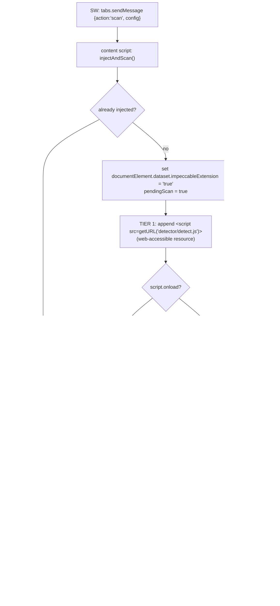

# Extension deep dive 02c — MAIN-world injection, the CSP ladder, and the ready handshake

Companion to [`02-chrome-extension.md`](02-chrome-extension.md). This is the
sub-dive most directly relevant to YoinkIt: **how one engine gets into the page's
MAIN world on an arbitrary, possibly strict-CSP origin, and behaves correctly once
there.** Five hard problems, each with a concrete mechanism: reaching MAIN world,
surviving page CSP, arming after (not before) the engine loads, not
double-injecting, and not measuring its own footprint. If a fresh agent is going
to get `__cap` into arbitrary pages through the MV3 wrapper, this is the file to
rebuild from.

All `file:line` references are into `../../source/`. The `chrome.*`-side transport
that delivers these commands is [02b](02b-messaging-and-survival.md).

---

## 1. Why the engine must run in MAIN world

The engine needs `getComputedStyle`, `document.styleSheets.cssRules`,
`elementsFromPoint`, and canvas pixel sampling — all of which see only the page's
**real** world, not the content script's ISOLATED world (which shares the DOM but
has its own `window`, its own `CSSOM` view, and cannot read the page's JS-defined
state). The content-script header states it plainly
([content-script.js:5-7](../../source/extension/content/content-script.js)):

> *"The detector must run in page context (not isolated world) because it needs
> access to getComputedStyle, document.styleSheets.cssRules, etc."*

This is exactly YoinkIt's situation: `__cap` samples computed style per frame and
must run where the page's real styles and framework state live. So the central
problem is *delivery into MAIN world*, on any origin, including pages whose CSP
forbids injected scripts.

---

## 2. The CSP-proof two-tier injection ladder



### Tier 1 — the cheap path: a web-accessible `<script src>`

The content script (ISOLATED world) creates a `<script>` whose `src` is the
extension's web-accessible `detector/detect.js`
([content-script.js:103-124](../../source/extension/content/content-script.js)):

```js
function injectAndScan() {
  if (injected) { sendScanCommand(); return; }                         // idempotency (§4)
  document.documentElement.dataset.impeccableExtension = 'true';        // CSP-safe flag (§3)
  const script = document.createElement('script');
  script.src = chrome.runtime.getURL('detector/detect.js');
  script.dataset.impeccableExtension = 'true';
  pendingScan = true;
  script.onload = () => script.remove();
  script.onerror = () => {                                              // TIER 2 trigger
    script.remove();
    chrome.runtime.sendMessage({ action: 'inject-fallback' });
  };
  (document.head || document.documentElement).appendChild(script);
}
```

This works even while the **service worker is asleep**, because the content script
does it directly — no round-trip to the SW. Removing the tag on `onload` is safe:
the engine IIFE has already executed synchronously and registered its listeners;
the tag is just DOM litter at that point.

### Tier 2 — the CSP-proof path: `executeScript({ world: 'MAIN' })`

A strict page CSP (`script-src 'self'`) **blocks** the `chrome-extension://`
script tag, firing `script.onerror`. The content script then asks the SW to inject
via the scripting API ([service-worker.js:125-137](../../source/extension/background/service-worker.js)):

```js
else if (msg.action === 'inject-fallback' && tabId) {
  chrome.scripting.executeScript({
    target: { tabId }, world: 'MAIN', files: ['detector/detect.js'],
  }).then(() => { /* engine posts impeccable-ready; CS handles the rest */ })
    .catch((err) => console.warn('[impeccable] Fallback injection failed:', err));
}
```

`chrome.scripting.executeScript` is injected as **extension-privileged script and
is not subject to page CSP**; `world: 'MAIN'` (the MV3 feature that makes this
possible) lands it in page context. So Impeccable gets the best of both: the cheap
tag path normally (works even with a cold SW), and the CSP-proof path *only* when
the page refuses the tag.

**For YoinkIt:** this is the production-grade pattern for getting `__cap` into MAIN
world on arbitrary third-party pages — many of which have strict CSP. YoinkIt
today leans on agent-browser's `--init-script`; for an end-user extension, this
ladder is the robust path, and it degrades gracefully (the `.catch` logs rather
than throwing).

---

## 3. `EXTENSION_MODE` detection and the `ready` handshake

### 3.1 Dual-signal detection (and why the fallback needs the documentElement flag)

The engine decides it is in extension mode from **two** signals
([index.mjs:8-10](../../source/cli/engine/browser/injected/index.mjs)):

```js
const _myScript = document.currentScript;
const EXTENSION_MODE = (_myScript && _myScript.dataset.impeccableExtension === 'true')
  || document.documentElement.dataset.impeccableExtension === 'true';
```

The content script sets **both** flags before injecting: the
`documentElement.dataset` at [content-script.js:110](../../source/extension/content/content-script.js)
and the `<script>.dataset` at [:115](../../source/extension/content/content-script.js).
Why two? Because of the CSP fallback. In Tier 1, `document.currentScript` is the
injected tag (reliable for a synchronously-executing IIFE, per the comment at
[index.mjs:7](../../source/cli/engine/browser/injected/index.mjs)), so its dataset
carries the flag. But in **Tier 2**, the engine is injected by `executeScript` —
there is **no script tag with the dataset**, so `document.currentScript` cannot
carry the signal. The `documentElement.dataset` fallback is therefore
**load-bearing** for the CSP path: it is the *only* signal that survives the
fallback injection. Set the documentElement flag first, before either tier, and
both paths detect extension mode.

### 3.2 The handshake solves arm-before-loaded

In extension mode the engine does **not** auto-scan. It registers a message
listener and announces readiness
([index.mjs:1855-1912](../../source/cli/engine/browser/injected/index.mjs)):

```js
if (EXTENSION_MODE) {
  window.addEventListener('message', (e) => {
    if (e.source !== window || !e.data || e.data.source !== 'impeccable-command') return;
    if (e.data.action === 'scan') {
      if (e.data.config) window.__IMPECCABLE_CONFIG__ = e.data.config;  // config arrives here
      try { scan(e.data.config || {}); } catch (err) { postExtensionError(err); }
    }
    // toggle-overlays / remove / highlight / unhighlight …
  });
  window.postMessage({ source: 'impeccable-ready' }, '*');             // announce, don't scan
}
```

The content script holds a `pendingScan` flag set at injection time and fires the
scan **only when ready arrives** ([content-script.js:63-69](../../source/extension/content/content-script.js)):

```js
if (e.data.source === 'impeccable-ready') {
  injected = true;
  if (pendingScan) { pendingScan = false; sendScanCommand(); }
}
```

```mermaid
sequenceDiagram
    participant CS as content script
    participant EN as engine (MAIN world)
    CS->>CS: injectAndScan(): pendingScan = true
    CS->>EN: inject (Tier 1 tag, or Tier 2 executeScript)
    Note over EN: engine IIFE runs, registers message listener
    EN-->>CS: window.postMessage {source:'impeccable-ready'}
    CS->>CS: injected = true; pendingScan was true →
    CS->>EN: window.postMessage {source:'impeccable-command', action:'scan', config}
    EN->>EN: scan(config)
```

This is the fix for the race where you try to use the engine before it has
finished loading. It is **directly analogous to YoinkIt's own rule** that
*"arming mid-transition captures nothing"* and that the timed-capture recipe
breaks if you arm before `__cap` exists. The handshake makes arming
**deterministic** (wait for an explicit ready signal) instead of **timing-based**
(sleep and hope the script loaded). Note the symmetry: the *non*-extension build
of the same engine takes the opposite default — it auto-scans after
`DOMContentLoaded` + 100ms ([index.mjs:1913-1927](../../source/cli/engine/browser/injected/index.mjs)) —
because there is no controller to wait for. Same engine, two arming strategies,
selected by `EXTENSION_MODE`.

---

## 4. Idempotency — three guards against double-injection

Re-injection is a real hazard (the SW may try twice; the user may re-engage). The
bridge and the engine are both re-injection-safe at three levels:

1. **Content script — a window flag.** The bridge IIFE bails if already loaded
   ([content-script.js:13-15](../../source/extension/content/content-script.js)):
   `if (window.__IMPECCABLE_CS_LOADED__) return;`. The header comment
   ([:8-12](../../source/extension/content/content-script.js)) names the exact
   failures this prevents: `SyntaxError: Identifier 'foo' has already been
   declared` (re-declaring top-level consts) and *"duplicate event listeners
   accumulating over time."*
2. **Service worker — a per-tab flag.** `ensureContentScriptInjected` checks
   `state.csInjected` and skips the `executeScript` entirely if already set
   ([service-worker.js:60-61,68](../../source/extension/background/service-worker.js)),
   so it does not even *attempt* a second injection.
3. **Engine — re-post instead of re-inject.** On a repeat scan while the engine is
   already loaded, `injectAndScan` short-circuits to just re-posting the scan
   command ([content-script.js:103-107](../../source/extension/content/content-script.js))
   rather than appending a second `<script>`.

The flags are reset on navigation/teardown (see [02b §2,§6](02b-messaging-and-survival.md))
so a real reload re-arms cleanly — the `csInjected` reset in particular fixed a
documented popup-only no-op bug.

---

## 5. Namespacing and footprint scrubbing — never clobber, never measure yourself

### 5.1 A small, prefixed public surface

The engine writes a namespaced set of globals and keeps everything else
module-private inside the IIFE
([index.mjs:1930-1936](../../source/cli/engine/browser/injected/index.mjs)):

```js
window.impeccableDetect = detect;
window.impeccableDetectAsync = detectAsync;
window.impeccableScan = scan;
window.impeccableScanAsync = scanAsync;
window.impeccableCollectVisualContrastCandidates = collectVisualContrastCandidates;
window.impeccableAnalyzeVisualContrast = analyzeVisualContrast;
window.impeccableGetLastVisualContrastAnalyses = () => lastVisualContrastAnalyses.slice();
```

Plus `window.__IMPECCABLE_CONFIG__`, which is **not** assigned here — it arrives
via the scan message ([:1860](../../source/cli/engine/browser/injected/index.mjs))
and is read wherever config matters (`spotlightBlur` [:117](../../source/cli/engine/browser/injected/index.mjs),
`designSystem` [:1286](../../source/cli/engine/browser/injected/index.mjs),
`disabledRules` [:1457](../../source/cli/engine/browser/injected/index.mjs),
`visualContrast` [:1573,1577](../../source/cli/engine/browser/injected/index.mjs),
`autoScan` [:1914](../../source/cli/engine/browser/injected/index.mjs)). Every
name is prefixed; the hundreds of helper functions stay private behind the IIFE.
This is structurally identical to YoinkIt's `window.__cap`.

### 5.2 Self-excluding scan loops (in *every* loop, plus other extensions)

An engine injected into a page draws overlays, labels, a banner, and a spotlight
backdrop — all `.impeccable-*` classed. If the scanner measured those, it would
flag the *tool* instead of the *page*. So the footprint skip appears in **every**
walk over the DOM, not just the main one:

- **Main element loop** — `collectBrowserFindings`
  ([index.mjs:1466-1476](../../source/cli/engine/browser/injected/index.mjs)):
  ```js
  for (const el of document.querySelectorAll('*')) {
    if (el.closest('.impeccable-overlay, .impeccable-label, .impeccable-banner, .impeccable-tooltip')) continue;
    const elId = el.id || '';
    if (elId.startsWith('claude-') || elId.startsWith('cic-')) continue;   // Claude-in-Chrome
    if (el.closest('[id^="impeccable-live-"]')) continue;                  // live-mode overlay
    if (el === document.body || el === document.documentElement) continue;
    …
  }
  ```
- **Visual-contrast candidate loop** ([index.mjs:660-661](../../source/cli/engine/browser/injected/index.mjs))
  and the **pixel-sample stack walk** ([index.mjs:1039](../../source/cli/engine/browser/injected/index.mjs))
  each repeat the `.impeccable-*` / `impeccable-live-` skip.
- **Clone-and-strip before the regex pass** ([index.mjs:1554-1558](../../source/cli/engine/browser/injected/index.mjs)):
  the `checkHtmlPatterns` regex runs on `outerHTML`, which would include the
  inspector's own injected inline styles (transitions on top/left/width/height)
  and self-trigger `layout-transition`. So it clones the document element, removes
  its own `[id^="impeccable-live-"]` nodes, and scans the clone:
  ```js
  const docClone = document.documentElement.cloneNode(true);
  for (const node of docClone.querySelectorAll('[id^="impeccable-live-"]')) node.remove();
  const htmlPatternFindings = checkHtmlPatterns(docClone.outerHTML);
  ```

The **`claude-`/`cic-` skip** is notable: it explicitly excludes Claude-in-Chrome
nodes by id prefix, a deliberate coexistence courtesy. That is exactly YoinkIt's
situation, running alongside agent-browser and Claude-in-Chrome.

### 5.3 Overlays are namespaced and lazily created

The overlay style block is one injected `<style>` with `.impeccable-*` rules
([index.mjs:30-82](../../source/cli/engine/browser/injected/index.mjs)); the
spotlight backdrop is created lazily on first hover
([index.mjs:88-95](../../source/cli/engine/browser/injected/index.mjs)); the
`remove` command tears all of it down — `clearOverlays()`, removes the style
element, removes the backdrop, drops the `impeccable-hidden` body class
([index.mjs:1872-1877](../../source/cli/engine/browser/injected/index.mjs)). So
the engine can be fully unloaded from a page, leaving no trace.

---

## 6. PostMessage hygiene (and the gap)

Every page-bound message carries a `source` discriminator
(`impeccable-command`) and every extension-bound message its own
(`impeccable-results` / `-ready` / `-overlays-toggled` / `-error`), so the two
directions never cross-talk, and every inbound handler guards
`e.source !== window` before trusting the payload
([content-script.js:46](../../source/extension/content/content-script.js),
[index.mjs:1858](../../source/cli/engine/browser/injected/index.mjs)) — a baseline
defense against cross-frame/cross-window spoofing.

**The gap:** every `window.postMessage` targets `'*'`, not a specific origin
([content-script.js:28,31,35,38](../../source/extension/content/content-script.js),
[index.mjs:1654,1664,1796,1870,1912](../../source/cli/engine/browser/injected/index.mjs)).
The data is low-stakes and same-window, and `e.source` is checked inbound, so it
is not a live vulnerability — but any same-window listener (including the page
itself, or another extension in MAIN world) can read the findings stream. For
YoinkIt, where a capture spec might carry more sensitive structure, tighten this:
target `location.origin` on outbound posts and add a per-injection nonce to the
`source` tag so only the matching content script accepts results.

---

## 7. What this means for YoinkIt

- **STEAL the CSP two-tier ladder verbatim.** Cheap `<script src=getURL(...)>`
  first, `executeScript({world:'MAIN'})` on `onerror`. It is the robust way to get
  `__cap` into MAIN world on strict-CSP pages, and it works with a cold SW on the
  cheap path. ([content-script.js:113-123](../../source/extension/content/content-script.js),
  [service-worker.js:125-137](../../source/extension/background/service-worker.js))
- **STEAL the dual-signal `EXTENSION_MODE` flag**, and remember the documentElement
  flag is load-bearing for the fallback path — set it on `documentElement` *before*
  injecting, not only on the script tag.
- **STEAL the `ready` handshake.** This is the single most important page-side
  pattern for YoinkIt: it is the deterministic fix for *"arming mid-transition
  captures nothing."* Have `__cap` announce `cap-ready` and have the controller
  arm only on that signal, never on a sleep. ([index.mjs:1855-1912](../../source/cli/engine/browser/injected/index.mjs)
  → [content-script.js:63-69](../../source/extension/content/content-script.js))
- **STEAL the three idempotency guards.** A window flag on the bridge, a per-tab
  flag in the SW, and re-post-don't-re-inject in the engine. Capture sessions
  re-engage constantly; without these you get duplicate listeners and
  already-declared errors.
- **STEAL footprint scrubbing into `scan(root)` and `dump()`.** Skip YoinkIt's own
  `.yoink-*` overlay/picker chrome in *every* walk, clone-and-strip before any
  `outerHTML` pass, and (cheaply) skip `claude-`/`cic-`/agent-browser nodes by id
  prefix so a capture never measures the tool. ([index.mjs:1466-1476,1554-1558](../../source/cli/engine/browser/injected/index.mjs))
- **AVOID the loose `postMessage('*')`.** Target `location.origin` and nonce the
  `source` tag for YoinkIt.

The DevTools surfaces that issue these commands and render the results are
[02d](02d-devtools-surfaces.md).
