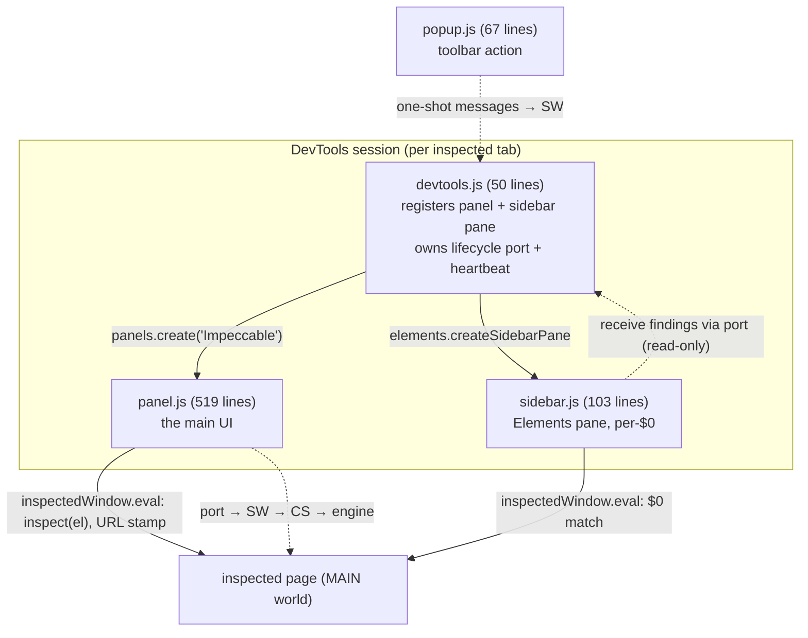

# Extension deep dive 02d — the DevTools surfaces (panel, sidebar, popup)

Companion to [`02-chrome-extension.md`](02-chrome-extension.md). This one covers
**how a human reads the results**: the DevTools panel, the Elements sidebar pane,
the toolbar popup, the three `chrome.devtools.inspectedWindow.eval` uses
(click-to-inspect, URL stamp, `$0` matching), DevTools-native theming, per-rule
settings, and the agent-ready copy-as-markdown output that is the closest thing
in the extension to YoinkIt's "emit an agent-ready spec." If a fresh agent is
going to build a "Capture" DevTools panel for YoinkIt, this is the reference.

All `file:line` references are into `../../source/`. The transport that feeds
these surfaces is [02b](02b-messaging-and-survival.md).

---

## 1. The surface map



The split of responsibility:

- **`devtools.js`** is the session anchor. It exists for the whole DevTools
  session (the panel might never be opened), so it owns the **lifecycle port**
  whose disconnect is the canonical "DevTools closed" signal, plus the autoScan
  decision and a heartbeat.
- **`panel.js`** is the rich UI: grouped findings, settings, hover-to-spotlight,
  click-to-inspect, copy-as-markdown.
- **`sidebar.js`** is the per-element view in the Elements panel, bound to `$0`.
- **`popup.js`** is the lightweight toolbar control (count, Scan, toggle).

---

## 2. `devtools.js` — registration, lifecycle, autoScan

```js
chrome.devtools.panels.create('Impeccable', '/icons/icon-32.png', '/devtools/panel.html');
chrome.devtools.panels.elements.createSidebarPane('Impeccable', (sidebar) => {
  sidebar.setPage('/devtools/sidebar.html');
  sidebar.setHeight('200px');
});
```

([devtools.js:9-19](../../source/extension/devtools/devtools.js))

It then opens the lifecycle port and, **on the first connection only**, reads the
`autoScan` setting to decide whether to scan immediately
([devtools.js:26-44](../../source/extension/devtools/devtools.js)):

```js
function connectLifecycle() {
  lifecyclePort = chrome.runtime.connect({ name: portName });
  if (firstConnect) {
    firstConnect = false;
    chrome.storage.sync.get({ autoScan: 'panel' }, (settings) => {
      if (settings.autoScan === 'devtools') {
        try { lifecyclePort?.postMessage({ action: 'scan' }); } catch {}
      }
    });
  }
  lifecyclePort.onDisconnect.addListener(() => {
    lifecyclePort = null;
    setTimeout(connectLifecycle, 100);     // reconnect (firstConnect already false → no rescan)
  });
}
```

**The default is `'panel'`**, not `'devtools'`: by default, opening DevTools does
nothing until the user opens the Impeccable panel or the sidebar pane (which
triggers the SW's connect⇒scan-if-empty path, [02b §2](02b-messaging-and-survival.md)).
Only when the user has switched the setting to `'devtools'` does opening DevTools
auto-scan. This is the nuance the store listing overstates as "Auto-scans when
DevTools opens" ([02a §4.4](02a-manifest-permissions-build.md)). The 20s heartbeat
([:48-50](../../source/extension/devtools/devtools.js)) and the reconnect are part
of the survival kit ([02b §4](02b-messaging-and-survival.md)).

---

## 3. The three `inspectedWindow.eval` uses

`chrome.devtools.inspectedWindow.eval(stringOfCode, cb)` runs a string in the
inspected page and is the **only** way a DevTools surface reaches page state
*synchronously against `$0`* — it cannot use the content-script bridge for that.
It is used three ways. All three are safe *only* because every interpolated value
is `JSON.stringify`'d engine-owned data, never page text.

### 3.1 Click-to-inspect (panel)

([panel.js:503-511](../../source/extension/devtools/panel.js))

```js
function inspectElement(selector) {
  const json = JSON.stringify(selector);
  chrome.devtools.inspectedWindow.eval(
    `(function() {
      var el = document.querySelector(${json});
      if (el) { el.scrollIntoView({ behavior:'smooth', block:'center' }); inspect(el); }
    })()`);
}
```

`inspect()` is the DevTools magic global that selects a node in the Elements
panel. `${json}` is the engine's own generated selector run through
`JSON.stringify` — string-literal injection that is safe because the selector is
engine-owned, not user-typed. Wired on each non-page, non-hidden finding row
([panel.js:487-490](../../source/extension/devtools/panel.js)).

### 3.2 URL stamp for copy-as-markdown (panel)

([panel.js:277-285](../../source/extension/devtools/panel.js)) evals a function
that returns `location.href` with the hash stripped, used to stamp the copied
findings with their source page. (Anchors are "noise for what page is this from.")

### 3.3 `$0` matching (sidebar) — "ship all selectors, ask the page which is `$0`"

The sidebar cannot know which finding corresponds to the element the user selected
in Elements. So it ships **all** candidate selectors into the page and asks which
one `=== $0` ([sidebar.js:50-66](../../source/extension/devtools/sidebar.js)):

```js
const code = `(function() {
  var sels = ${JSON.stringify(selectors)};
  var matched = [];
  for (var i = 0; i < sels.length; i++) {
    try { if (document.querySelector(sels[i]) === $0) matched.push(sels[i]); } catch (e) {}
  }
  return matched;
})()`;
chrome.devtools.inspectedWindow.eval(code, (matched) => { … render matched findings … });
```

Wired to `chrome.devtools.panels.elements.onSelectionChanged`
([sidebar.js:31](../../source/extension/devtools/sidebar.js)). It filters out
page-level and hidden findings before building the selector list
([sidebar.js:41-44](../../source/extension/devtools/sidebar.js)). This is a clean
way to bind a user-selected element to engine data without maintaining a live map.

---

## 4. The panel — grouping, settings, theming, copy

### 4.1 Findings render and the badge

`renderFindings` ([panel.js:392-501](../../source/extension/devtools/panel.js))
groups findings **by category (`slop`/`quality`) → by anti-pattern `type`**, each
group collapsible, each row showing the selector, detail, and description, with a
`page`/`hidden` tag and a per-row copy button. The panel badge counts **total
findings**:

```js
const totalCount = findings.reduce((sum, f) => sum + f.findings.length, 0);
```

([panel.js:406](../../source/extension/devtools/panel.js)) — and so does the popup
([popup.js:21](../../source/extension/popup/popup.js)). **But the toolbar action
badge counts something different**: the number of *flagged elements*
(`state.findings.length`, [service-worker.js:23](../../source/extension/background/service-worker.js)),
because each serialized entry is one element that may carry several findings. So a
page with 3 elements carrying 7 findings shows **3** on the toolbar badge and
**7** in the panel/popup. A real inconsistency the first draft missed; for YoinkIt,
pick one count semantics and use it on every surface.

### 4.2 Per-rule settings, persisted and selectively broadcast

Settings live in `storage.sync` (roams across profiles). The panel fetches the
generated `antipatterns.json` ([panel.js:54](../../source/extension/devtools/panel.js))
to render per-rule enable/disable checkboxes grouped by category
([renderSettings, :112-153](../../source/extension/devtools/panel.js)), plus three
controls defined in `panel.html`: `autoScan` (panel/devtools, [panel.html:34](../../source/extension/devtools/panel.html)),
`lineLength` (strict 80 / lax 120, [panel.html:41](../../source/extension/devtools/panel.html)),
and `spotlightBlur` ([panel.html:49](../../source/extension/devtools/panel.html)).
Toggling a rule writes `storage.sync` and fires
`chrome.runtime.sendMessage({action:'disabled-rules-changed'})`
([toggleRule, :155-163](../../source/extension/devtools/panel.js)); line-length
mode and spotlight blur use the same invalidation path. The SW then **re-scans
every injected tab** ([service-worker.js:139-145](../../source/extension/background/service-worker.js)).
`autoScan` is different: it is persisted and affects future DevTools/panel-open
behavior, but changing it does not rescan the current page.

### 4.3 Theme matching (cheap, correct)

The panel reads `chrome.devtools.panels.themeName` and toggles a `.theme-dark`
class ([panel.js:9-11](../../source/extension/devtools/panel.js),
[sidebar.js:7-9](../../source/extension/devtools/sidebar.js)); the CSS swaps a
token block — light `:root` ([panel.css:7-18](../../source/extension/devtools/panel.css))
vs `.theme-dark` ([panel.css:21-30](../../source/extension/devtools/panel.css)).
Cheap, correct, DevTools-native theming, in two lines of JS plus a token swap.

### 4.4 Hover → live page spotlight (with a reverse signal)

Pointer movement over the findings list posts `highlight`/`unhighlight` through the
bridge ([panel.js:381-389](../../source/extension/devtools/panel.js) →
[02b §3](02b-messaging-and-survival.md)); the engine spotlights the target overlay,
dims the rest, and `scrollIntoView`s it ([index.mjs:1878-1903](../../source/cli/engine/browser/injected/index.mjs)).
The interesting bit is the **reverse signal**: the panel's own `pointerleave` is
unreliable on a fast cursor exit, so the *page* reports `pointermove` →
`page-pointer-active` (throttled 150ms, [content-script.js:76-81](../../source/extension/content/content-script.js))
→ the SW notifies the panel → the panel clears its hover
([handlePortMessage, panel.js:167-171](../../source/extension/devtools/panel.js)).
A neat trick: when the unreliable event is on your side, listen for the *other*
side's reliable one.

### 4.5 Copy-as-markdown — the agent-facing output

`formatFindingsForCopy` ([panel.js:287-330](../../source/extension/devtools/panel.js))
emits a clean markdown block: a `# Impeccable findings` heading, a `URL:` stamp
(from §3.2), findings grouped into `## AI tells` / `## Quality issues` with
`**name** at \`selector\`: detail`, and a roll-up of **suggested fix-skills**. The
skills come from a `FIX_SKILLS` map (anti-pattern → `/impeccable` commands,
[panel.js:226-254](../../source/extension/devtools/panel.js)), de-duplicated and
frequency-sorted by `uniqueSkillsForFindings` ([:264-275](../../source/extension/devtools/panel.js)).
There is also a per-finding copy (`formatSingleFindingForCopy`, [:332-344](../../source/extension/devtools/panel.js)).

The clipboard write uses `navigator.clipboard.writeText`
([copyToClipboard, :346-362](../../source/extension/devtools/panel.js)) — which
works **without a permission prompt** here because the panel is an extension page
acting on a user gesture (the click), not arbitrary page script. This is worth
noting against YoinkIt's current `dump({copy:false})` + `window.__capLast` dance,
which exists to dodge clipboard prompts in the *page* context: from a DevTools
panel, the clipboard is freely available.

This is the agent loop in miniature: *here is what is wrong, here are the commands
to fix it,* one click to the clipboard. It is the most on-brand pattern for
YoinkIt of anything in the extension.

---

## 5. The popup and sidebar (briefly)

- **`popup.js`** (67 lines): on open, `get-state` for the active tab and render the
  count ([popup.js:29-33](../../source/extension/popup/popup.js)); live updates via
  `findings-updated`/`overlays-toggled-broadcast`
  ([:36-49](../../source/extension/popup/popup.js)); Scan and toggle buttons send
  one-shot messages with an explicit `tabId`
  ([:51-65](../../source/extension/popup/popup.js)). No port — it is transient.
- **`sidebar.js`** (103 lines): a named receive-only port for receiving findings.
  It has a reconnect-capable `getPort()` helper ([:17-28](../../source/extension/devtools/sidebar.js)),
  but current code only calls it at startup, with no heartbeat or send path to
  trigger self-reconnect after SW death. It also owns the `$0` match from §3.3 and
  a small renderer ([:77-97](../../source/extension/devtools/sidebar.js)).
  Both surfaces `escapeHtml` all interpolated text
  ([sidebar.js:99-103](../../source/extension/devtools/sidebar.js),
  [panel.js:513-517](../../source/extension/devtools/panel.js)) — findings come
  from an untrusted page, so their text is escaped before going into `innerHTML`.

---

## 6. What this means for YoinkIt

- **STEAL the DevTools-panel delivery model.** A "Capture" panel that lists tracked
  layers/regions, lets you click one to `inspect()` it, and shows per-layer timing
  is a strong UX — far better than a floating in-page overlay that fights the page.
  The Elements **sidebar pane** bound to `$0` is a clean way to show "what did
  YoinkIt capture about *this* element."
- **STEAL the `$0` "ship all selectors, ask the page" trick** to bind a
  user-selected element to capture data without maintaining a live element↔data
  map. ([sidebar.js:50-66](../../source/extension/devtools/sidebar.js))
- **STEAL click-to-`inspect()`** via `inspectedWindow.eval` with a
  `JSON.stringify`'d engine selector — and keep eval payloads to engine-owned data
  only, never page text.
- **STEAL copy-as-markdown as the headline output.** YoinkIt's whole thesis is
  "emit an agent-ready spec, not code." A one-click "copy spec as markdown for your
  coding agent," URL-stamped and formatted like
  [panel.js:287-330](../../source/extension/devtools/panel.js), is directly
  on-brand — and from a DevTools panel the clipboard is available without the
  prompt that forces the current `__capLast` workaround.
- **STEAL the reverse-signal trick** (listen for the page's reliable `pointermove`
  when your own `pointerleave` is unreliable) and **theme matching** via
  `themeName` + a token swap.
- **STEAL settings-in-`storage.sync` + broadcast-to-rescan** for capture defaults
  (viewport, settle time, copy-mode), so a setting change re-applies everywhere
  live.
- **FIX the count inconsistency** when you build it: choose one count meaning
  (elements vs findings vs captured layers) and use it on the badge, the popup, and
  the panel alike.

Back to the overview: [`02-chrome-extension.md`](02-chrome-extension.md). The
build that produces the engine this UI drives is [02a](02a-manifest-permissions-build.md);
the transport is [02b](02b-messaging-and-survival.md); the page-side injection is
[02c](02c-injection-and-main-world.md).
