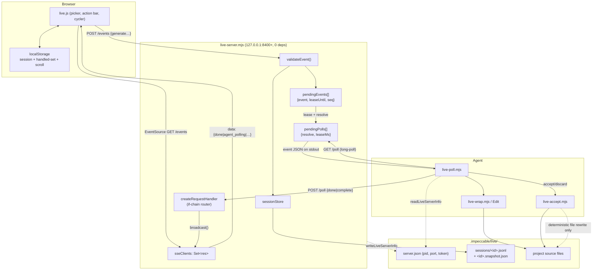
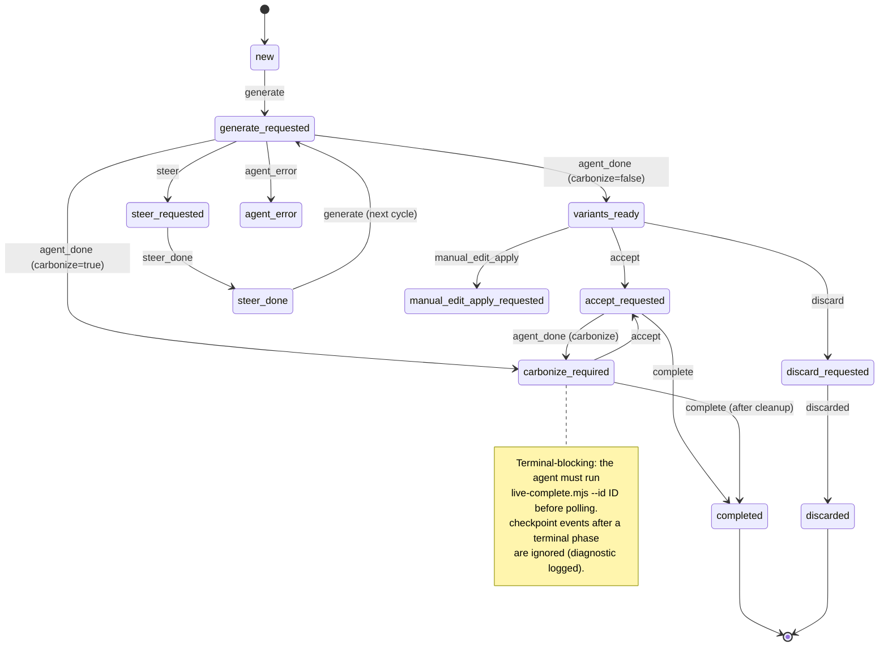

# Impeccable Live Mode — Orchestration, Protocol & Lifecycle

> Deep technical audit, written for the YoinkIt team. Impeccable is a design-quality
> skill for AI coding agents. Its **live variant mode** is the crown jewel of this
> audit: it implements an async human↔agent-in-the-browser loop that is structurally
> the same thing YoinkIt's product model wants — a human points at elements on a real
> page, an agent works, and they iterate. This report reconstructs the orchestration
> layer (local server + polling + session machinery), not the in-browser overlay
> (`live-browser.js`) or the manual-edit sync, which a separate report covers.

## Orientation

Live mode bridges **three parties** that never share a process: a **browser** (where
a human picks an element, picks a design action, and cycles AI-generated variants),
a **local HTTP server** (`live-server.mjs`, a zero-dependency Node process on
`127.0.0.1:8400+`), and an **agent** (any AI harness — Claude Code, Cursor, Codex —
that can run a shell command and read stdout). The browser talks to the server over
**SSE (server→browser push) + fetch POST (browser→server)**; the agent talks to the
server over **HTTP long-poll (`GET /poll` blocks until an event) + POST reply**. The
key inversion versus YoinkIt: variants are **written into the user's actual source
file**, not patched into the DOM, so the framework's own HMR renders them and
"accept" is just "delete the losers." Every browser intent is mirrored into an
**append-only per-session journal** under `.impeccable/live/sessions/<id>.jsonl`, which
makes the whole loop crash-recoverable: kill the agent or reload the browser mid-cycle
and a `live-resume.mjs` call replays the exact next safe action.

## File map

Local-server / protocol / lifecycle (the subsystem under audit):

- [`docs/adr-live-variant-mode.md`](../source/docs/adr-live-variant-mode.md) — the design rationale (source-modification, SSE+fetch, long-poll, `display:contents` wrapper).
- [`skill/reference/live.md`](../source/skill/reference/live.md) — the agent-facing contract: the exact lifecycle, the poll loop, per-event handlers, recovery, cleanup.
- [`skill/scripts/live.mjs`](../source/skill/scripts/live.mjs) (246 lines) — boot orchestrator: config check → start server → inject script tag → emit context.
- [`skill/scripts/live-server.mjs`](../source/skill/scripts/live-server.mjs) (1134 lines) — the HTTP server: all routes, SSE fan-out, the poll/event queues, leasing, exit debounce, shutdown.
- [`skill/scripts/live-poll.mjs`](../source/skill/scripts/live-poll.mjs) (379 lines) — the agent's CLI poll/reply client (one-shot + `--stream`); runs `live-accept.mjs` inline on accept/discard.
- [`skill/scripts/live-inject.mjs`](../source/skill/scripts/live-inject.mjs) (583 lines) — inserts/removes the `<script src=".../live.js">` tag in the HTML entry; config + glob resolution; CSP meta handling.
- [`skill/scripts/live-accept.mjs`](../source/skill/scripts/live-accept.mjs) (812 lines) — the deterministic file mutator for accept/discard; "carbonize" stitch-in; generated-file refusal.
- [`skill/scripts/live-complete.mjs`](../source/skill/scripts/live-complete.mjs) — the canonical final durable acknowledgement (after carbonize cleanup).
- [`skill/scripts/live-resume.mjs`](../source/skill/scripts/live-resume.mjs) / [`live-status.mjs`](../source/skill/scripts/live-status.mjs) — recovery: print the active snapshot + next safe action / connected-server state.
- [`skill/scripts/live/session-store.mjs`](../source/skill/scripts/live/session-store.mjs) (289 lines) — the append-only journal + snapshot rebuild (the durable state machine).
- [`skill/scripts/live/completion.mjs`](../source/skill/scripts/live/completion.mjs) — maps an accept-result into a completion type + ack (decides if `live-complete` is required).
- [`skill/scripts/live/event-validation.mjs`](../source/skill/scripts/live/event-validation.mjs) (137 lines) — server-side validation of every inbound browser event.
- [`skill/scripts/live/vocabulary.mjs`](../source/skill/scripts/live/vocabulary.mjs) — the canonical 12-verb action vocabulary (one source, three consumers).
- [`skill/scripts/live/browser-script-parts.mjs`](../source/skill/scripts/live/browser-script-parts.mjs) — assembles `/live.js` from 3 parts + injects token/port/vocab prelude.
- [`skill/scripts/live/ui-core.mjs`](../source/skill/scripts/live/ui-core.mjs) — the testable contract/inventory of the browser chrome surfaces.
- [`skill/scripts/live-browser-session.js`](../source/skill/scripts/live-browser-session.js) — browser-side localStorage session helpers (checkpoint revision, handled-set, scroll).
- [`skill/scripts/lib/impeccable-paths.mjs`](../source/skill/scripts/lib/impeccable-paths.mjs) — where everything is stored (`server.json`, `sessions/`, `annotations/`) + legacy fallbacks.

---

## 1. The big picture & the ADR's rationale

The problem the ADR ([`docs/adr-live-variant-mode.md:7-14`](../source/docs/adr-live-variant-mode.md)) names is the same loop YoinkIt is built around, stated for design: a user wants to point at an element on a *live page*, ask for a change, and **see it**, not read a diff and reload. The slow path was "ask → read code → reload → decide → repeat."

Six architectural decisions shape everything, and they are worth reading as a list of bets:

1. **Source modification, not DOM patching** (`:21-26`). Variants are written into the real source file. Consequences: framework state survives because HMR does the swap; "accept" is trivially "keep the winner, delete the rest"; variants are real code the user can diff and commit. *This is the single biggest divergence from YoinkIt's "emit a spec, never code" model — and it's deliberate, because Impeccable's agent owns the repo.*
2. **SSE + fetch, not WebSocket** (`:27-28`). Eliminates the `ws` dependency. The server is "zero-dependency pure Node.js (http, crypto, fs, net, os)." This matters because the scripts ship *inside the skill directory* and run in the user's project with no `npm install`.
3. **Self-contained skill scripts** (`:30-37`). `npx skills add` is the whole install.
4. **HTTP long-poll for the agent, not WebSocket or stdin** (`:39-40`): *"This works across all AI harnesses because every harness can run a shell command and read its stdout. No harness-specific integration needed."* This is the load-bearing portability decision.
5. **`display: contents` variant wrapper** (`:42-43`): the wrapper is invisible to CSS layout, so a wrapped element keeps its flex/grid relationship with its parent.
6. **No-HMR fallback** (`:45-46`): for dev servers without HMR (Bun static import), the browser fetches the raw file from the server's `/source` endpoint and injects into the DOM, losing framework state only on that injection.

Resilience decisions (`:237-240`) prefigure the recovery machinery: **debounced exit** (8s after the last SSE client drops, to ride out HMR reloads), **stale PID detection** on startup, and a browser-side "server lost" toast after 5 failed reconnects.

### Lifecycle sequence (agent ↔ server ↔ browser ↔ human)

```mermaid
sequenceDiagram
    actor H as Human
    participant B as Browser (live.js)
    participant S as Live Server (:8400)
    participant A as Agent (poll loop)
    participant FS as Source files + journal

    Note over A,FS: HANDSHAKE
    A->>S: node live.mjs (config check → start server → inject <script>)
    S-->>A: { serverPort, serverToken, pageFiles, product, design }
    A->>B: open the app URL (NOT serverPort)
    B->>S: GET /live.js?  (token+port+vocab prelude prepended)
    B->>S: EventSource GET /events  (SSE opens; token-checked)
    S-->>B: data:{type:"connected", agentPolling, activeSessions}
    A->>S: GET /poll  (long-poll, blocks up to 270s/slice)
    S-->>B: broadcast {type:"agent_polling", connected:true}

    Note over H,FS: PICK + GO (human-driven)
    H->>B: hover/click an element; pick action "bolder"; ×3; Go
    B->>S: POST /events {type:"generate", id, action, count, element, pageUrl}
    S->>FS: sessionStore.appendEvent → phase=generate_requested
    S->>A: resolve /poll with the generate event (leased 600s)

    Note over A,FS: CYCLE (agent-driven)
    A->>FS: live-wrap.mjs (find element, write display:contents wrapper)
    A->>FS: Edit: write all N variants in ONE edit
    A->>S: POST /poll {id, type:"done", file:"public/index.html"}
    S->>FS: appendEvent(agent_done) → phase=variants_ready
    S-->>B: SSE {type:"done", file}
    B->>B: MutationObserver sees variants (HMR) OR fetch /source → inject
    H->>B: cycle ← →, tune param knobs

    Note over H,FS: ACCEPT (human → agent file work)
    H->>B: click Accept on variant 2 (+ current param values)
    B->>S: POST /events {type:"accept", id, variantId:"2", paramValues}
    S->>A: resolve /poll with accept event
    A->>FS: live-accept.mjs --variant 2  (deterministic file rewrite)
    A->>S: POST /poll {type:"complete"|"agent_done", carbonize?}
    S-->>B: SSE {type} → green "Variant applied"
    alt carbonize == true
        A->>FS: rewrite inline CSS into real stylesheet; bake params; strip markers
        A->>S: node live-complete.mjs --id ID  (final durable ack)
        S->>FS: appendEvent(complete) → phase=completed
    end
    A->>S: GET /poll  (back to waiting)

    Note over H,FS: EXIT + CARBONIZE CLEANUP
    H->>B: Exit button / close tab
    B->>S: POST /events {type:"exit"}  (or SSE drop → 8s debounce → exit)
    S->>A: resolve /poll {type:"exit"}
    A->>S: node live-server.mjs stop  (→ live-inject --remove, strip <script>)
```

---

## 2. The local server — endpoints / API surface

`live-server.mjs` is a single `http.createServer` whose handler is built by
`createRequestHandler` ([`live-server.mjs:387`](../source/skill/scripts/live-server.mjs)).
Every route is an `if (p === '...')` branch on the parsed pathname; there is no router
framework. The full surface (with the line where each branch begins):

| Route | Method | Auth | Purpose | Line |
|---|---|---|---|---|
| `/live.js` | GET | none | Serve the browser bundle with token/port/vocab prepended | `:398` |
| `/detect.js`, `/` | GET | none | Anti-pattern overlay script (backwards-compat) | `:425` |
| `/modern-screenshot.js` | GET | none | Vendored UMD lib, lazy-loaded for annotation screenshots | `:435` |
| `/annotation` | POST | token | Stage a raw PNG so the screenshot path rides in the event, not the SSE | `:453` |
| `/status` | GET | token | Durable recovery status (clients, polling, pendingEvents, activeSessions) | `:510` |
| `/health` | GET | none | Liveness (status, port, connectedClients) | `:527` |
| `/design-system.json`, `/design-system/raw` | GET | token | DESIGN.md sidecar for the in-browser design panel | `:548` |
| `/source` | GET | token | Raw source file reader for the **no-HMR fallback** | `:599` |
| `/events` | GET | token | **SSE stream, server→browser push** | `:615` |
| `/events` | POST | token | **Browser→server events** (generate, accept, discard, steer, exit, …) | `:656` |
| `/manual-edit-*` | — | token | Manual copy-edit stash/commit/discard (separate audit) | `:653` |
| `/stop` | GET | token | Graceful shutdown | `:711` |
| `/poll` | GET | token | **Agent long-poll** (blocks until event) | `:721` |
| `/poll` | POST | token | **Agent reply** (acks event, forwards to browser SSE) | `:725` |

**The SSE endpoint is the server→browser channel.** On connect it cancels any pending
exit timer, sends a `connected` envelope with current state, registers the response in
`state.sseClients`, and starts a 30s keepalive. The exit debounce lives in its `close`
handler:

```js
// live-server.mjs:640
req.on('close', () => {
  clearInterval(heartbeat);
  state.sseClients.delete(res);
  if (state.sseClients.size === 0) {
    clearTimeout(state.exitTimer);
    state.exitTimer = setTimeout(() => {
      if (state.sseClients.size === 0) enqueueEvent({ type: 'exit' });
    }, 8000);
  }
});
```

**The browser→server POST is where intent is validated and journaled.** It rejects
direct `manual_edits`/`manual_edit_apply` (those must use the staged endpoints),
runs `validateEvent(msg)`, then **appends to the session store before enqueuing**:

```js
// live-server.mjs:683
const error = validateEvent(msg);
if (error) { res.writeHead(400, ...); res.end(JSON.stringify({ error })); return; }
if (state.sessionStore && msg.id) {
  try { state.sessionStore.appendEvent(msg); }      // durable FIRST
  catch (err) { res.writeHead(500, ...); return; }   // refuse if journal write fails
}
if (msg.type === 'exit') cleanupSvelteComponentSessionsBeforeExit();
if (msg.type !== 'checkpoint') enqueueEvent(msg);     // checkpoints are journal-only
```

Note the design choice: a failed journal write **fails the whole event** (500). State
durability is a precondition, not best-effort. `checkpoint` events are journaled but
never enqueued — they only advance the browser's progress marker.

**The browser handshake** is assembled, not stored as a file. `/live.js` is built per
request by `assembleLiveBrowserScript`
([`browser-script-parts.mjs:35`](../source/skill/scripts/live/browser-script-parts.mjs)),
concatenating three parts (`live-browser-session.js`, `live-browser-dom.js`,
`live-browser.js`) behind a prelude that injects the secrets and the vocabulary:

```js
// browser-script-parts.mjs:36
const prelude =
  `window.__IMPECCABLE_TOKEN__ = '${token}';\n` +
  `window.__IMPECCABLE_PORT__ = ${port};\n` +
  `window.__IMPECCABLE_VOCAB__ = ${JSON.stringify(vocabulary)};\n`;
```

This is the entire handshake: the browser never negotiates a token; the server hands
it one at serve time, and every subsequent request carries it.

### Architecture / data-flow



---

## 3. The polling protocol

The agent never blocks the conversation. It runs `GET /poll`, which **parks the HTTP
response on the server** until an event is available or the timeout fires, then returns
one JSON object on stdout. The loop, from [`live.md:51-63`](../source/skill/reference/live.md):

```
LOOP:
  node live-poll.mjs           # default long timeout; no --timeout=
  "generate"  → handle; reply done; LOOP
  "steer"     → handle; reply steer_done; LOOP
  "accept"    → handle; complete carbonize if required; LOOP
  "discard"   → handle; LOOP
  "prefetch"  → handle (speculative read, no reply); LOOP
  "manual_edit_apply" → handle; reply done|partial|error; LOOP
  "timeout"   → LOOP
  "exit"      → break → Cleanup
```

**The server side of `/poll` GET** ([`live-server.mjs:738`](../source/skill/scripts/live-server.mjs)):
if an event is already available it leases and returns immediately; otherwise it pushes
a `{ resolve, leaseMs }` onto `pendingPolls`, arms a timeout that resolves
`{ type: 'timeout' }`, and registers `req.on('close')` cleanup. The `resolve` closure
is what a later browser event calls to "wake" the parked poll.

**Leasing is the concurrency guard.** Events are not removed from `pendingEvents` when
delivered — they are *leased*:

```js
// live-server.mjs:162
function leaseEvent(entry, leaseMs) {
  if (!entry.event?.id) { /* anonymous (e.g. exit): pop and return */ }
  entry.leaseUntil = Date.now() + leaseMs;   // default 600s
  scheduleLeaseFlush();
  broadcastAgentPollingIfChanged();
  return entry.event;
}
```

`findAvailablePendingEvent` ([`:154`](../source/skill/scripts/live-server.mjs)) skips any
entry whose lease is still live. So a second poll while one is in flight gets *nothing*,
not a duplicate. The event is only truly removed by `acknowledgePendingEvent(id)`
([`:174`](../source/skill/scripts/live-server.mjs)) when the agent POSTs its reply. If the
agent dies after leasing but before replying, the lease expires (`scheduleLeaseFlush`
re-flushes at `leaseUntil + 2ms`) and the event becomes pollable again — *the protocol
self-heals from a dropped agent.*

**The client's long-poll is synthesized in slices** because Node's `fetch` has an
un-loweralble 300s headers timeout:

```js
// live-poll.mjs:22
export const PER_REQUEST_TIMEOUT_MS = 270_000;  // under the 300s undici ceiling
```

`fetchNextEvent` ([`live-poll.mjs:150`](../source/skill/scripts/live-poll.mjs)) loops
270s requests until a real event arrives or `totalDeadline` (default 600s) passes,
treating `{type:"timeout"}` as "keep going."

**`agent_polling` is a presence heartbeat.** Whenever the parked-poll/leased-event set
changes, the server broadcasts `{type:"agent_polling", connected}` to the browser
([`:287`](../source/skill/scripts/live-server.mjs)). This drives the global-bar Impeccable
mark: solid when an agent is attached, dimmed with a pulsing amber dot when not — a
direct, ambient "is my collaborator here?" signal ([`live.md:19`](../source/skill/reference/live.md)).

**Event vocabulary & validation.** Inbound types are validated by `validateEvent`
([`event-validation.mjs:95`](../source/skill/scripts/live/event-validation.mjs)). The
shapes:

- `generate` — id `^[0-9a-f]{8}$`, `count` 1–8, then either replace mode (`action` must
  be in `VISUAL_ACTIONS`, `element.outerHTML` required) or insert mode
  (`insert.position` ∈ {before,after}, anchor, placeholder dims, requires freeform or
  annotations). The 12-verb `VISUAL_ACTIONS` set comes from
  [`vocabulary.mjs:20`](../source/skill/scripts/live/vocabulary.mjs): *impeccable, bolder,
  quieter, distill, polish, typeset, colorize, layout, adapt, animate, delight, overdrive.*
- `accept` — id + `variantId` `^[0-9]{1,3}$`, optional `paramValues` object.
- `discard`, `steer`, `prefetch`, `exit`, `checkpoint`, `manual_edit_apply` (the last
  with op-level validation that forbids `< { } ` `` ` `` in plain-text edits).

The agent's *reply* types are a parallel vocabulary, parsed by `parseReplyArgs`
([`live-poll.mjs:56`](../source/skill/scripts/live-poll.mjs)): `done`, `steer_done`,
`error`, `complete`, `discarded`, plus `--file` and `--data`. `validateReplyArgs`
([`:84`](../source/skill/scripts/live-poll.mjs)) guards the single most common agent
mistake — passing the *status* where the *event id* belongs:

```js
// live-poll.mjs:91
if (['done', 'error', 'complete', 'discard', 'discarded'].includes(id)) {
  throw new Error(`...The value after --reply must be the event id, not the status...`);
}
```

Only `generate`, `steer`, `manual_edit_apply` require an agent reply
(`EVENT_TYPES_NEEDING_AGENT_REPLY`, [`:25`](../source/skill/scripts/live-poll.mjs)); the
server also refuses a `steer_done` that carries neither a `--file` nor a message
([`live-server.mjs:870`](../source/skill/scripts/live-server.mjs)).

---

## 4. Session model & persistence (`session-store.mjs`)

The session store is an **event-sourced state machine on disk**. Each session is one
append-only JSONL journal (`<id>.jsonl`) plus a derived `<id>.snapshot.json`, both under
`.impeccable/live/sessions/`
([`impeccable-paths.mjs:104`](../source/skill/scripts/lib/impeccable-paths.mjs)). The
journal is canonical; the snapshot is a cache.

**Append** ([`session-store.mjs:33`](../source/skill/scripts/live/session-store.mjs)):
each event becomes an entry `{ seq, id, type, ts, event }`, is appended to the JSONL, and
`applyEvent` folds it into the snapshot, which is rewritten. **Rebuild**
([`:128`](../source/skill/scripts/live/session-store.mjs)) replays the journal from
`baseSnapshot` line by line; malformed lines become diagnostics rather than crashes.

The snapshot fields ([`baseSnapshot`, `:103`](../source/skill/scripts/live/session-store.mjs))
are the resumable state: `phase`, `pageUrl`, `sourceFile`/`previewFile`/`previewMode`,
`expectedVariants`/`arrivedVariants`/`visibleVariant`, `paramValues`, `pendingEvent`(+seq),
`checkpointRevision`, `sourceMarkers`, `fallbackMode`, `annotationArtifacts`,
`diagnostics`, `updatedAt`. The `phase` transitions are the heart of the machine
(`applyEvent`, [`:155-271`](../source/skill/scripts/live/session-store.mjs)):



Two robustness details stand out. **Checkpoints are monotonic and terminal-safe**
([`:196`](../source/skill/scripts/live/session-store.mjs)): a checkpoint older than the
current `checkpointRevision` is ignored as `stale_checkpoint_ignored`, and any checkpoint
after a `completed`/`discarded` phase is ignored as `checkpoint_after_terminal_ignored`.
This is exactly the guard you need when a browser reload replays its localStorage
checkpoints against a session the agent already finished. **`getSnapshot` hides completed
sessions by default** (`COMPLETED_PHASES`, [`:5,63`](../source/skill/scripts/live/session-store.mjs))
so `listActiveSessions` naturally returns only live work.

**Server-side wiring of durability:**

- On startup the server creates the store and **requeues unacknowledged pending
  events** so a restart doesn't lose in-flight work:
  ```js
  // live-server.mjs:1104, 147
  state.sessionStore = createLiveSessionStore({ cwd: process.cwd() });
  restorePendingEventsFromStore();  // every snapshot.pendingEvent → enqueueEvent
  ```
- The agent's reply is *also* journaled, mapping reply types to journal event types
  ([`live-server.mjs:902-924`](../source/skill/scripts/live-server.mjs)): `steer_done`→
  `steer_done`, `discard`→`discarded`, `complete`→`complete`, `error`→`agent_error`,
  everything else→`agent_done`.
- The **browser keeps its own parallel session** in localStorage
  ([`live-browser-session.js:11`](../source/skill/scripts/live-browser-session.js)): a
  `prefix-session` blob, a `prefix-session-handled` last-handled id, and a scroll
  position, each with a monotonic `checkpointRevision`. The ADR (`:220-225`) calls these
  "advisory but durable"; the server journal is canonical. This is the two-sided memory
  that lets a full reload (or browser close/reopen) resume the correct cycling position.

**The PID/lock file** is `server.json` (`{pid, port, token}`,
[`impeccable-paths.mjs:56,91`](../source/skill/scripts/lib/impeccable-paths.mjs)) in
`.impeccable/live/`. On startup the server reads any existing record and, if its PID is
*alive*, refuses to start (single-instance); if dead, it unlinks the stale file
([`live-server.mjs:1090-1101`](../source/skill/scripts/live-server.mjs)). Both the
server.json and the sessions dir have legacy-path fallbacks for older projects.

---

## 5. The full lifecycle, phase by phase

| Phase | Who drives | What happens | Where |
|---|---|---|---|
| **Handshake** | Agent | `node live.mjs` runs `live-inject --check` (config gate), `ensureServerRunning` (spawns `live-server --background`, waits for `server.json`), `live-inject --port` (writes the `<script>` tag), loads PRODUCT/DESIGN, prints `{serverPort, serverToken, pageFiles, configDrift, product, design}`. Agent opens the **app URL** (never `serverPort`) and starts the poll loop. Browser opens SSE → server sends `connected`. | [`live.mjs:30-105`](../source/skill/scripts/live.mjs); [`live.md:15-44`](../source/skill/reference/live.md) |
| **Pick** | Human (+browser) | Human hovers/clicks an element, picks an action, sets count, clicks Go. On first element-select per route the browser may fire a speculative `prefetch` so the agent reads the page file early. | [`live.md:515-526`](../source/skill/reference/live.md) |
| **Go → Generate** | Browser → Agent | Browser `POST /events {generate}`. Server validates, journals (`generate_requested`), leases to the parked poll. Agent reads optional annotation screenshot, runs `live-wrap.mjs` to insert a `display:contents` wrapper at the element's source location, then writes **all N variants in one Edit**, then `POST /poll {done, --file}`. Server journals `agent_done`→`variants_ready`, SSE `done` to browser. Browser detects variants via MutationObserver (HMR) or fetches `/source` and injects (no-HMR). | [`live.md:93-410`](../source/skill/reference/live.md); [`live-server.mjs:809-940`](../source/skill/scripts/live-server.mjs) |
| **Cycle** | Human | Human cycles ←/→ between variants and tunes 0–4 per-variant parameter knobs (`range`/`steps`/`toggle`), which toggle CSS vars / data-attrs with zero regeneration cost. | [`live.md:347-401`](../source/skill/reference/live.md) |
| **Accept** | Human → Agent | Browser `POST /events {accept, variantId, paramValues}`. **The poll script runs `live-accept.mjs` inline** before printing the event, then POSTs the completion reply, so by the time the agent sees the event the file op is already done and the browser DOM is already updated. | [`live-poll.mjs:182-217`](../source/skill/scripts/live-poll.mjs); [`live.md:462-487`](../source/skill/reference/live.md) |
| **Carbonize cleanup** | Agent | If accept returned `carbonize:true`, the agent must rewrite the inline stitch-in into permanent form (move CSS to the real stylesheet, bake param values, strip wrappers + markers) **before the next poll**, then `live-complete.mjs --id ID`. | [`live.md:474-487`](../source/skill/reference/live.md); §6 below |
| **Discard** | Human → Agent | Browser restores the original in DOM immediately and `POST /events {discard}`; the poll script runs `live-accept --discard` (removes the wrapper, restores original). Terminal at once. | [`live.md:489-491`](../source/skill/reference/live.md) |
| **Steer** | Human → Agent | Page-level direction with no element pick / no variant cycle (typed or via Web Speech API). Agent does the work, replies `steer_done`; the Steer bar stays locked until that arrives over SSE. | [`live.md:493-513`](../source/skill/reference/live.md) |
| **Exit → Cleanup** | Human → Agent | Exit button / "stop live mode" / closed tab (SSE drop → 8s debounce → `exit`). Agent runs `node live-server.mjs stop`, which hits `/stop` and runs `live-inject --remove` to strip the `<script>`, then removes any leftover variant/carbonize markers. | [`live.md:540-559`](../source/skill/scripts/live-server.mjs); [`live-server.mjs:1022-1058`](../source/skill/scripts/live-server.mjs) |

**The exact accept handshake** is the subtlest part, and worth quoting in full because
it inverts the naive ordering — *the file work happens inside the poll, not after the
agent reads the event*:

```js
// live-poll.mjs:182  (augmentEventWithAcceptHandling)
if (event.type !== 'accept' && event.type !== 'discard') return event;
const out = execFileSync('node', [acceptScript, ...buildAcceptScriptArgs(event)], {...});
event._acceptResult = JSON.parse(out.trim());
const completionType = completionTypeForAcceptResult(event.type, event._acceptResult);
await postReply(base, token, {
  id: event.id, type: completionType,
  file: event._acceptResult?.file,
  data: event._acceptResult?.carbonize === true ? { carbonize: true } : undefined,
});
event._completionAck = completionAckForAcceptResult(event.id, completionType, event._acceptResult);
```

`completion.mjs` decides whether the agent is *done* or *owes a final ack*:

```js
// completion.mjs:1
if (acceptResult?.handled === true && acceptResult?.carbonize === true) return 'agent_done';
if (acceptResult?.handled === true) return 'complete';
// ...
// completionAckForAcceptResult: when carbonize, ack.final=false, ack.requiresComplete=true,
//   ack.nextCommand = `live-complete.mjs --id ${eventId}`
```

So a **plain accept is terminal the instant `live-accept` returns** (`complete`), but a
**carbonize accept stays "recoverable" until the agent verifies cleanup and runs
`live-complete`** (`agent_done` + `requiresComplete:true`). The reference contract
([`live.md:469`](../source/skill/reference/live.md)) makes the agent honor this:
`_acceptResult.todo`, `_completionAck.requiresComplete`, and a stderr banner
([`live-poll.mjs:235`](../source/skill/scripts/live-poll.mjs)) all point at the same
required follow-up.

**Recovery** ties the whole thing off. After any interruption the agent runs
`live-status.mjs` (connected-server state + active sessions, works even with the server
down by reading the journal directly) or `live-resume.mjs`, which reads the snapshot and
prints the *next safe action* verbatim:

```js
// live-resume.mjs:78
const nextAction = pending
  ? `Run live-poll.mjs, handle ${pending.type} ${pending.id}, then acknowledge with live-poll.mjs --reply ${pending.id} done.`
  : snapshot.phase === 'carbonize_required'
    ? `Finish carbonize cleanup${...}, then run live-complete.mjs --id ${snapshot.id}.`
    : snapshot.phase === 'accept_requested'
      ? `Run live-complete.mjs --id ${snapshot.id} after verifying the accepted variant is written.`
      : `Inspect ${snapshot.id}; no pending agent event is currently queued.`;
```

---

## 6. "Carbonize" cleanup — what it is and why

When the agent generates variants it colocates the variant CSS as an inline
`<style data-impeccable-css="ID">` *inside* the `display:contents` wrapper, and each
variant lives in `<div data-impeccable-variant="N">`. That arrangement is great for
*cycling* (one MutationObserver pass picks it all up, knobs toggle scoped CSS vars) but
it is **not** something you want to leave in the user's source. On accept, `live-accept`
needs the chosen variant rendered immediately with no visual gap, so it **stitches the
accepted variant back into source with the helper markers and inline CSS still present**
— this temporary stitched-in form is the "carbonize block":

```
<!-- impeccable-carbonize-start SESSION_ID -->
<style data-impeccable-css="SESSION_ID"> /* the variant's scoped CSS */ </style>
<!-- impeccable-param-values SESSION_ID: {"density":"packed", ...} -->
<!-- impeccable-carbonize-end SESSION_ID -->
<div data-impeccable-variant="2" style="display: contents"> …accepted HTML… </div>
```

(`buildCarbonizeReplacement`, `live-accept.mjs:274-323`, per the Explore pass.)

`carbonize` is returned **true** only when there is real cleanup to do —
`needsCarbonize = !!(cssContent || hasHelperAttrs)` (`live-accept.mjs:354-359`): the
variant carried a `<style>` block *or* `data-impeccable-variant` markup. A pure
inline-styled variant with no `<style>` returns `carbonize:false` and is terminal at
once. Discard is always `carbonize:false`.

**Carbonize = "turn the temporary, live-mode-shaped stitch-in into permanent,
hand-written source."** The five required steps the agent then performs
([`live.md:477-485`](../source/skill/reference/live.md)): (1) locate the carbonize block;
(2) move the CSS into the project's real stylesheet; (3) **bake parameter values** while
retargeting selectors — for `:scope[data-p-density="VALUE"]` keep only the chosen branch,
for `var(--p-id, default)` substitute the literal; (4) unwrap the accepted content
(delete the `data-impeccable-variant` wrapper and any JSX carbonize wrapper, drop
`data-impeccable-params`/`data-p-*`); (5) delete the inline `<style>`, the param-values
comment, the markers, and any dead `@scope` rules for unaccepted variants. *Why it
matters:* skipping it "leaves dead `@scope` rules for unaccepted variants, a pointless
`data-impeccable-variant` wrapper, and `impeccable-carbonize-start/end` comment noise…
all of which accumulate across sessions" ([`live.md:475`](../source/skill/reference/live.md)).

The genuinely interesting move is the **two-phase commit**: accept does a *fast,
visually-correct, ugly* write so the human sees their pick instantly, and the agent does
the *slow, clean, permanent* rewrite afterward — guarded by a state machine
(`carbonize_required`) that refuses to let the session complete until the cleanup is
acknowledged. The instant-feedback path and the correctness path are decoupled in time
but coupled by durable state.

---

## 7. Patterns worth stealing for YoinkIt

These are concrete and ranked by what they'd buy YoinkIt's async human↔agent-in-browser model.

1. **Long-poll + lease as the universal agent transport.** A `GET /poll` that parks
   until a browser event, with an *event lease* so a re-poll never double-delivers and a
   dropped agent self-heals on lease expiry, is the cleanest "agent waits for a human in
   a real browser without blocking the chat" primitive there is. It needs no
   harness-specific integration — "every harness can run a shell command and read
   stdout." YoinkIt's pipeline already wants the human to point and the agent to react;
   this is the missing wire. See [`live-server.mjs:738`](../source/skill/scripts/live-server.mjs)
   (`handlePollGet`), [`:162`](../source/skill/scripts/live-server.mjs) (`leaseEvent`),
   [`:154`](../source/skill/scripts/live-server.mjs) (`findAvailablePendingEvent`).

2. **SSE + fetch instead of WebSocket, zero-dependency Node.** This is the decision that
   lets the whole thing ship inside a skill directory with no `npm install`, which is
   exactly YoinkIt's constraint (the engine is "framework-agnostic and dependency-free,"
   injected into arbitrary pages). The capture pipeline could expose its own
   localhost relay the same way. See ADR `:27-28` and the pure-Node imports at
   [`live-server.mjs`](../source/skill/scripts/live-server.mjs) top.

3. **The browser handshake = secrets prepended to the served script.** No token
   negotiation, no config the human edits: the server generates `crypto.randomUUID()`,
   binds `127.0.0.1` only, and prepends `window.__IMPECCABLE_TOKEN__/PORT/VOCAB` to
   `/live.js` at serve time ([`browser-script-parts.mjs:36`](../source/skill/scripts/live/browser-script-parts.mjs);
   token gen [`live-server.mjs:1103`](../source/skill/scripts/live-server.mjs)). YoinkIt's
   capture engine is *already* an injected script (`--init-script extension/capture-animation.js`);
   handing it a per-session token + relay port via the same prelude trick would let
   `__cap` POST captures back to a local collector instead of round-tripping the
   clipboard / `window.__capLast`.

4. **Append-only per-session journal with snapshot rebuild = free crash recovery.**
   Every intent is `appendEvent`'d to `<id>.jsonl` *before* it's acted on, the snapshot
   is a fold over the journal, and a restart `restorePendingEventsFromStore()`s the
   in-flight work. A `resume` command then prints the *exact next action* from the
   snapshot. This is the difference between "the agent crashed, click Go again" and "the
   agent crashed, it picked up where it left off." YoinkIt's map→capture→recreate loop is
   long and interruptible; a journal under `.yoinkit/sessions/` keyed by the site/element
   being worked would make a half-finished capture resumable. See
   [`session-store.mjs:33,128`](../source/skill/scripts/live/session-store.mjs),
   [`live-resume.mjs:78`](../source/skill/scripts/live-resume.mjs),
   [`live-server.mjs:147,1104`](../source/skill/scripts/live-server.mjs).

5. **Two-phase accept: instant ugly write, then deferred clean rewrite, gated by a
   blocking state.** "Carbonize" is the pattern: give the human immediate, correct
   feedback with a temporary artifact, and use a `carbonize_required` phase that *refuses
   to let the session complete* until the agent rewrites it permanently
   ([`completion.mjs:3,12`](../source/skill/scripts/live/completion.mjs);
   [`live-accept.mjs` carbonize block ~274-359]). YoinkIt's analogue: a capture could be
   accepted into a *draft spec* instantly, with a gated "finalize" step that crystallizes
   it into the agent-ready spec — the human isn't blocked on the slow part, but the slow
   part can't be silently skipped.

6. **`agent_polling` presence beacon.** The server broadcasts whether an agent is
   actually parked on `/poll`, and the browser shows it ambiently (solid vs dimmed amber
   mark). In an async loop the worst failure is "I'm pointing at things and nobody's
   listening." A cheap presence signal fixes it. See
   [`live-server.mjs:281-292`](../source/skill/scripts/live-server.mjs) and
   [`live.md:19`](../source/skill/reference/live.md).

Two more honorable mentions, both very YoinkIt-shaped:

7. **Drive by selector + element context, resolve live; never trust captured
   coordinates.** The generate event ships `element.outerHTML`, classes, tag, an `~80ch`
   text snippet, and `boundingRect`, and `live-wrap` searches source by *id → classes →
   tag+class*, using the text snippet to disambiguate sibling components
   ([`live.md:139-154`](../source/skill/reference/live.md)). This is the exact lesson in
   YoinkIt's CLAUDE.md ("Drive by selector, never coordinates — captured page
   coordinates drift"). Impeccable carries enough element identity in the event to
   re-resolve on the agent side; YoinkIt's map output could carry the same disambiguation
   payload so the recreate step never lands on the wrong sibling.

8. **The single-source vocabulary serialized into the page.** The 12 design verbs live
   once in [`vocabulary.mjs`](../source/skill/scripts/live/vocabulary.mjs) and are consumed
   by the validator, the browser picker (serialized into `window.__IMPECCABLE_VOCAB__`),
   and the marketing site. "Add, rename, or reorder a verb here and all three follow."
   YoinkIt's action/spec vocabulary (what `__cap` reports, what the skill instructs)
   could be a single serialized module the same way, so the picker, the engine, and the
   docs can't drift.

### Surprises / where this contradicts the map→capture mental model

- **Impeccable writes code into the user's repo and relies on HMR; YoinkIt emits a spec
  and refuses to write code.** This is the philosophical inversion at the center of the
  comparison. Impeccable can do it because its agent *owns the repo and the dev server*;
  the "accept = keep the winner" trick only works when variants are real source.
  YoinkIt's "spec, not code" stance is the right call for *its* setting (capturing
  third-party sites you don't own), but the carbonize idea (instant draft → gated
  finalize) survives the inversion: it's a state-machine pattern, not a code-writing one.
- **The expensive, fragile half (capture/render) is here the *cheap* half.** YoinkIt's
  core thesis is that motion capture *needs a real visible browser* because headless
  doesn't fire framework events. Impeccable's "capture" is just `element.outerHTML` +
  computed styles harvested by an already-injected overlay; the hard part it engineers
  around is the *agent's* round-trip latency (40s→15-20s via the `wrap` helper and batch
  writes, ADR `:242-250`), not the rendering. The two tools optimize opposite
  bottlenecks: YoinkIt fights the browser, Impeccable fights the agent loop.
- **"No cancel during generation" + "single generation at a time"** (ADR `:260-261`):
  the source file can hold only one variant wrapper, so the loop is strictly serial and
  uninterruptible mid-generate. YoinkIt's capture is likewise a one-shot timed recipe
  (settle → arm → trigger → wait → dump) that you don't interrupt — the same "arming
  mid-transition captures nothing" constraint, arrived at from the opposite direction.
- **Exit is inferred, not just commanded.** Closing the tab isn't an explicit "stop"; the
  server *debounces* the SSE drop for 8s to survive HMR reloads, then synthesizes an
  `exit` event ([`live-server.mjs:640-649`](../source/skill/scripts/live-server.mjs)). Any
  async-collaboration loop where the human can just walk away needs this kind of
  "presence with hysteresis" rather than a hard disconnect.
