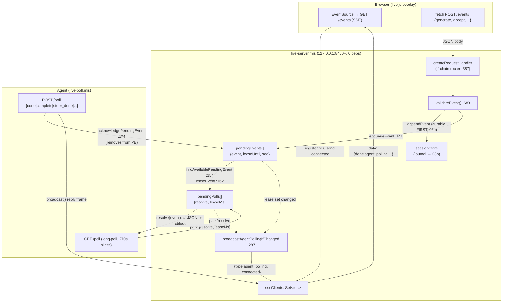
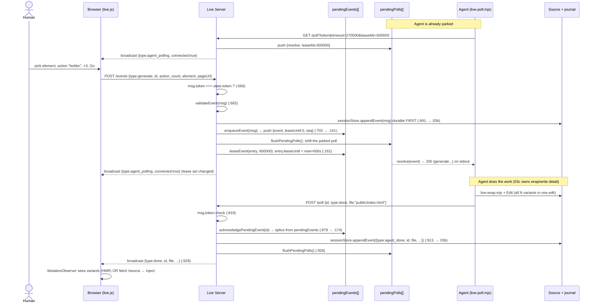
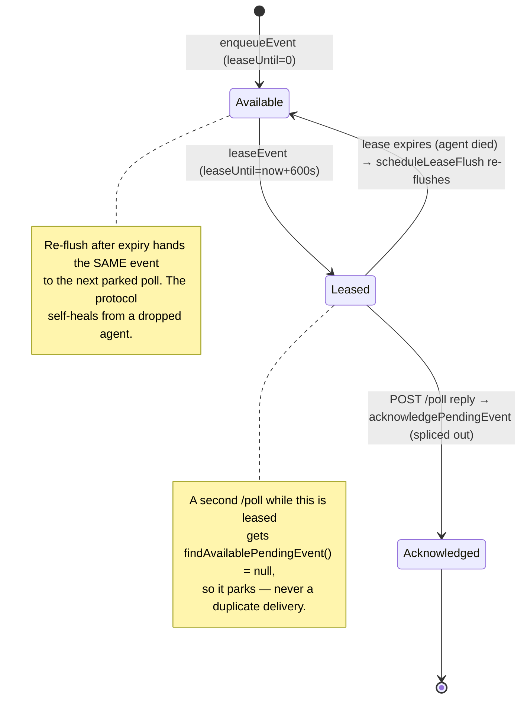

# Live mode deep dive 03a — the server, the transport, and the wire protocol

Companion to [`03-live-mode.md`](03-live-mode.md) (the overview, which owns the orientation). This sub-dive goes to the floor on **how a zero-dependency localhost Node process relays a browser's intent to an agent that never blocks the chat, and back — every route, the SSE fan-out, the long-poll lease, and the secrets-prepended handshake.**
All `file:line` references are into `../../source/` unless noted.

---

## 0. Why this is the load-bearing layer

Live mode bridges three parties that share **no memory**: a browser (overlay), the agent (any harness that can run a shell command and read stdout), and `live-server.mjs` sitting between them on `127.0.0.1:8400+`. The browser↔server edge is **SSE push + fetch POST**; the agent↔server edge is **HTTP long-poll + POST reply**. Neither party ever talks to the other directly. Everything the human does in the page becomes a JSON object that the server parks until an agent polls for it; everything the agent finishes becomes an SSE frame back to the page. This document owns that wire — the in-page overlay that produces the events is [`03d`](03d-overlay-picker-and-locators.md), the journal that makes it crash-safe is [`03b`](03b-session-journal-and-recovery.md), what "accept/complete/carbonize" *mean* is [`03c`](03c-variant-lifecycle-and-carbonize.md), and the manual-edit route internals are [`03e`](03e-manual-edit-round-trip.md). Here we cover only the transport those all ride on.

The single most transferable idea: **a `GET /poll` that parks the HTTP response on the server until a browser event is available, with a per-event lease so a re-poll never double-delivers and a dead agent self-heals.** It is harness-agnostic by construction — the ADR's load-bearing bet (decision 4, [`docs/adr-live-variant-mode.md:39-40`](../../source/docs/adr-live-variant-mode.md)): *"This works across all AI harnesses because every harness can run a shell command and read its stdout. No harness-specific integration needed."*

---

## 1. File map for this sub-dive

| File | Lines | Role |
|---|---|---|
| [`skill/scripts/live-server.mjs`](../../source/skill/scripts/live-server.mjs) | 1134 | The HTTP server: every route, the SSE fan-out channel, the `/poll` long-poll + event leasing + acknowledge, the `agent_polling` presence beacon, exit debounce, single-instance PID, the served-script handshake. |
| [`skill/scripts/live-poll.mjs`](../../source/skill/scripts/live-poll.mjs) | 379 | The agent's CLI poll/reply client: the 270s slice loop under undici's 300s ceiling, the reply vocabulary + `validateReplyArgs` guard, one-shot vs `--stream`. |
| [`skill/scripts/live/event-validation.mjs`](../../source/skill/scripts/live/event-validation.mjs) | 137 | Server-side `validateEvent` for every inbound browser event. |
| [`skill/scripts/live/vocabulary.mjs`](../../source/skill/scripts/live/vocabulary.mjs) | 36 | The single-source 12-verb action vocabulary; three consumers. |
| [`skill/scripts/live/browser-script-parts.mjs`](../../source/skill/scripts/live/browser-script-parts.mjs) | 49 | Assembles `/live.js` from 3 parts behind the token/port/vocab prelude — the seam that builds the overlay. |
| [`skill/scripts/live.mjs`](../../source/skill/scripts/live.mjs) | 246 | The boot orchestrator: config gate → ensureServerRunning → inject → emit context JSON. |
| [`skill/scripts/lib/impeccable-paths.mjs`](../../source/skill/scripts/lib/impeccable-paths.mjs) | 126 | Where state lives on disk: `server.json` (PID lock), `sessions/`, `annotations/`, legacy fallbacks. |

Context read for rationale (cited sparingly): [`docs/adr-live-variant-mode.md`](../../source/docs/adr-live-variant-mode.md) (261, dated 2026-04-12) and [`skill/reference/live.md`](../../source/skill/reference/live.md) (722, the agent-facing contract).

---

## 2. Server topology: two queues, one SSE set, leased delivery

The server is one `http.createServer` whose handler is built by `createRequestHandler` ([`live-server.mjs:387`](../../source/skill/scripts/live-server.mjs)). There is no router framework; every route is an `if (p === '...')` branch on the parsed pathname, evaluated top to bottom. The entire mutable runtime is one `state` object ([`:81`](../../source/skill/scripts/live-server.mjs)) holding three collections that *are* the protocol:

```js
// live-server.mjs:81
const state = {
  token: null,
  port: null,
  sseClients: new Set(),   // SSE response objects (server→browser push)
  pendingEvents: [],        // browser events waiting for agent ack ({ event, leaseUntil, seq })
  pendingPolls: [],         // agent poll callbacks waiting for browser events
  nextEventSeq: 1,
  lastAgentPollingBroadcast: null,
  exitTimer: null,
  // ... session store, lease timer, manual-edit deferreds (03e) ...
};
```

- `sseClients` — the set of live `ServerResponse` objects for browser tabs holding an `EventSource` open. `broadcast()` writes one `data: …\n\n` frame to every one of them.
- `pendingEvents` — browser intents that have arrived but not yet been acknowledged by an agent. Each entry is `{ event, leaseUntil, seq }`. **Events are not removed on delivery — they are leased.**
- `pendingPolls` — parked agent `/poll` requests, each `{ resolve, leaseMs }`, where `resolve` is the closure that ends the parked HTTP response.

The data-flow between them:



The two queues are coupled by exactly one operation, `flushPendingPolls` ([`:264`](../../source/skill/scripts/live-server.mjs)): drain parked polls against available (unleased) events until one side runs out.

```js
// live-server.mjs:264
function flushPendingPolls() {
  let changed = false;
  while (state.pendingPolls.length > 0) {
    const entry = findAvailablePendingEvent();
    if (!entry) { scheduleLeaseFlush(); broadcastAgentPollingIfChanged(); return; }
    const poll = state.pendingPolls.shift();
    poll.resolve(leaseEvent(entry, poll.leaseMs));   // hand the event to a parked agent
    changed = true;
  }
  scheduleLeaseFlush();
  if (changed) broadcastAgentPollingIfChanged();
}
```

`flushPendingPolls` is called from three places: when a new event is enqueued ([`enqueueEvent` :144](../../source/skill/scripts/live-server.mjs)), when an agent reply acknowledges an event ([`handlePollPost` :853, :926](../../source/skill/scripts/live-server.mjs)), and when a lease expires ([`scheduleLeaseFlush`'s timer :259](../../source/skill/scripts/live-server.mjs)). That last call is the self-heal — covered in §6.

---

## 3. The full route surface

Every branch with the line it begins on. Re-verified against source.

| Route | Method | Auth | Purpose | Line |
|---|---|---|---|---|
| `/live.js` | GET | none | Serve the assembled browser bundle, token/port/vocab prepended, `no-store` | [`:398`](../../source/skill/scripts/live-server.mjs) |
| `/detect.js`, `/` | GET | none | Anti-pattern overlay script (backwards-compat); no explicit `Cache-Control` header | [`:425`](../../source/skill/scripts/live-server.mjs) |
| `/modern-screenshot.js` | GET | none | Vendored UMD lib, lazy-loaded for annotation screenshots; `immutable` cache | [`:435`](../../source/skill/scripts/live-server.mjs) |
| `/annotation` | POST | token (query) | Stage a PNG-only payload to `sessionDir/<eventId>.png`; event id pattern-checked and body capped at 10 MB | [`:453`](../../source/skill/scripts/live-server.mjs) |
| `/status` | GET | token (query) | Durable recovery status: clients, polling, pendingEvents (summarized), activeSessions, manualEdits | [`:510`](../../source/skill/scripts/live-server.mjs) |
| `/health` | GET | none | Liveness: status, port, mode, hasProjectContext, connectedClients | [`:527`](../../source/skill/scripts/live-server.mjs) |
| `/design-system.json`, `/design-system/raw` | GET | token (query) | DESIGN.md sidecar for the in-browser design panel | [`:548`](../../source/skill/scripts/live-server.mjs) |
| `/source` | GET | token (query) | Raw source-file reader for the **no-HMR fallback**; path-traversal guarded | [`:599`](../../source/skill/scripts/live-server.mjs) |
| `/events` | GET | token (query) | **SSE stream, server→browser push** | [`:615`](../../source/skill/scripts/live-server.mjs) |
| `/manual-edit-*` | mixed | mixed token | Manual edit routes dispatched **before** `/events` POST: `POST`/`GET /manual-edit-stash`, `POST /manual-edit-commit`, `POST /manual-edit-repair-decision`, `POST /manual-edit-discard`, plus legacy removed `POST /manual-edit` (see [`03e`](03e-manual-edit-round-trip.md)) | [`:653`](../../source/skill/scripts/live-server.mjs) |
| `/events` | POST | token (body) | **Browser→server events** (generate, accept, discard, steer, exit, checkpoint, prefetch) | [`:656`](../../source/skill/scripts/live-server.mjs) |
| `/stop` | GET | token (query) | Graceful shutdown | [`:711`](../../source/skill/scripts/live-server.mjs) |
| `/poll` | GET | token (query) | **Agent long-poll** (blocks until event or timeout) | [`:721`](../../source/skill/scripts/live-server.mjs) |
| `/poll` | POST | token (body) | **Agent reply**; normal replies ack, journal, and forward to browser SSE; `manual_edit_apply` deferred replies return through a separate branch | [`:725`](../../source/skill/scripts/live-server.mjs) |

> **Correction:** The first draft's route table (overview §2) is accurate on lines, but lists `/manual-edit-*` after `/events` POST. The dispatch order in source is the reverse: `manualEditRoutes(req, res, url)` is called at [`:653`](../../source/skill/scripts/live-server.mjs) — **between** the `/events` GET branch ([`:615`](../../source/skill/scripts/live-server.mjs)) and the `/events` POST branch ([`:656`](../../source/skill/scripts/live-server.mjs)). That ordering matters: a manual-edit POST is claimed by `manualEditRoutes` and never reaches the `/events` POST handler. The `/events` POST handler then *also* explicitly rejects `manual_edits` ([`:673`](../../source/skill/scripts/live-server.mjs)) and `manual_edit_apply` ([`:678`](../../source/skill/scripts/live-server.mjs)) as defense in depth.

Two auth shapes coexist. **Query-string token** (`?token=…`) for GET routes and `/annotation` — the browser can put a token in a URL but `EventSource` cannot set headers. **Body token** (`msg.token`) for the two POST routes that carry a JSON body (`/events`, `/poll`). Both are compared against `state.token` with a plain `!==`. There is no header-based auth anywhere; the design leans entirely on the `127.0.0.1` bind + a per-session UUID nobody else can read (ADR Security, [`:227-234`](../../source/docs/adr-live-variant-mode.md)).

CORS is wide-open (`Access-Control-Allow-Origin: *`, [`:390`](../../source/skill/scripts/live-server.mjs)) with an `OPTIONS` short-circuit at [`:393`](../../source/skill/scripts/live-server.mjs). The token, not the origin, is the gate — the page that opens the SSE is the user's own dev server on a *different* origin than `:8400`, so origin checks would be self-defeating.

---

## 4. The handshake: secrets prepended to the served script

There is no token negotiation. The browser never asks for a token; the server hands it one at the moment it serves `/live.js`, and every subsequent browser request carries it back. The bundle itself is assembled per request, not stored as a file. `/live.js` re-reads its three parts from disk every time (so editing browser code lands on the next tab reload, not a server restart — note the deliberate `no-store` headers) and runs them through `assembleLiveBrowserScript`:

```js
// live-server.mjs:411  (inside the /live.js branch)
const body = assembleLiveBrowserScript({
  token: state.token,
  port: state.port,
  vocabulary: LIVE_COMMANDS,
  parts,
});
```

`assembleLiveBrowserScript` ([`browser-script-parts.mjs:35`](../../source/skill/scripts/live/browser-script-parts.mjs)) prepends a three-line prelude, then concatenates the parts:

```js
// browser-script-parts.mjs:36
const prelude =
  `window.__IMPECCABLE_TOKEN__ = '${token}';\n` +
  `window.__IMPECCABLE_PORT__ = ${port};\n` +
  // Canonical command vocabulary (values + labels + icons). live-browser.js
  // builds its action picker from this instead of an inline copy.
  `window.__IMPECCABLE_VOCAB__ = ${JSON.stringify(vocabulary)};\n`;
```

That is the *entire* handshake. The prelude injects three globals into the page:

1. **`__IMPECCABLE_TOKEN__`** — the per-session UUID the overlay echoes on every POST and appends to `?token=` on every GET (SSE, `/poll` is the agent's, but `/events`, `/annotation`, `/status` are the browser's).
2. **`__IMPECCABLE_PORT__`** — so the overlay knows which localhost port to reach the helper on (it is *not* the dev-server port the page is served from; the two are different origins, which is why the token-on-the-script trick exists at all).
3. **`__IMPECCABLE_VOCAB__`** — the serialized 12-verb vocabulary (§7), so the in-page action picker is built from the same source of truth the server validates against.

The three parts are fixed and ordered ([`browser-script-parts.mjs:4-8`](../../source/skill/scripts/live/browser-script-parts.mjs)): `live-browser-session.js` (session-state), `live-browser-dom.js` (dom-helpers), `live-browser.js` (browser-ui). They are served raw and injected as one IIFE bundle, so they *cannot* `import` the vocabulary at runtime — serializing it into the prelude is how the single source crosses the Node→browser boundary ([`vocabulary.mjs:7-11`](../../source/skill/scripts/live/vocabulary.mjs) names this exact constraint).

The token itself is minted once at boot:

```js
// live-server.mjs:1103
state.token = randomUUID();   // import { randomUUID } from 'node:crypto'  (:17)
```

and written into the PID lock file (§8) so the agent's poll client can read `{ pid, port, token }` back out without ever seeing the browser's globals.

> **Note on the overview's handshake row (§5):** correct as far as it goes, but it elides that the prelude is re-emitted on *every* `/live.js` request (the script is `no-store`), so the token is stable for a server lifetime but the bundle body is re-read each time — an HMR-friendly choice, not a security one.

---

## 5. End-to-end trace: a `generate` round-trip, browser → agent → browser

This is the spine. Follow one event from the human clicking Go to the variants appearing back in the page. (Journal writes are flagged but their internals are [`03b`](03b-session-journal-and-recovery.md); the carbonize semantics of the *accept* variant are [`03c`](03c-variant-lifecycle-and-carbonize.md).)



Walking the three server-side hops verbatim:

### Hop 1 — `/events` POST: authenticate, validate, journal, enqueue

```js
// live-server.mjs:656  (the browser→server event handler, body assembled from req 'data')
if (msg.token !== state.token) { res.writeHead(401, ...); res.end(...'Unauthorized'); return; }   // :666
// Defense in depth: manual copy edits must use the staged endpoints.
if (msg.type === 'manual_edits')       { res.writeHead(400, ...); ... return; }                     // :673
if (msg.type === 'manual_edit_apply')  { res.writeHead(400, ...); ... return; }                     // :678
const error = validateEvent(msg);                                                                   // :683
if (error) { res.writeHead(400, ...); res.end(JSON.stringify({ error })); return; }
if (state.sessionStore && msg.id) {
  try { state.sessionStore.appendEvent(msg); }                  // durable FIRST (:691, → 03b)
  catch (err) { res.writeHead(500, ...); ... return; }          // refuse the event if the journal write fails
}
if (msg.type === 'exit') cleanupSvelteComponentSessionsBeforeExit();                                // :698
if (msg.type !== 'checkpoint') enqueueEvent(msg);              // checkpoints are journal-only (:701)
res.writeHead(200, ...); res.end(JSON.stringify({ ok: true }));
```

Two design facts to carry: **a failed journal write fails the whole event with a 500** — durability is a precondition, not best-effort. And **`checkpoint` events are journaled but never enqueued** ([`:701`](../../source/skill/scripts/live-server.mjs)); they advance the browser's progress marker without waking the agent.

`enqueueEvent` itself is idempotent on `(id, type)`:

```js
// live-server.mjs:141
function enqueueEvent(event) {
  if (!event || (event.id && state.pendingEvents.some(
    (entry) => entry.event?.id === event.id && entry.event?.type === event.type))) return;
  state.pendingEvents.push({ event, leaseUntil: 0, seq: state.nextEventSeq++ });
  flushPendingPolls();
}
```

A duplicate POST of the same `(id, type)` is silently dropped, so a browser retry after a flaky connection can't double-queue. `leaseUntil: 0` means "immediately available."

### Hop 2 — `/poll` GET: lease-or-park

```js
// live-server.mjs:738
function handlePollGet(req, res, url) {
  const token = url.searchParams.get('token');
  if (token !== state.token) { res.writeHead(401, ...); ... return; }
  state.lastPollAt = Date.now();                                                  // presence freshness (03e)
  const timeout = parseInt(url.searchParams.get('timeout') || DEFAULT_POLL_TIMEOUT, 10);   // 600_000 default
  const leaseMs = parseInt(url.searchParams.get('leaseMs') || '30000', 10);
  const available = findAvailablePendingEvent();
  if (available) {                                                                // fast path: event already waiting
    res.writeHead(200, ...); res.end(JSON.stringify(leaseEvent(available, leaseMs)));
    return;
  }
  const poll = { resolve, leaseMs };
  const timer = setTimeout(() => {                                                // synthesize {type:timeout}
    const idx = state.pendingPolls.indexOf(poll);
    if (idx !== -1) state.pendingPolls.splice(idx, 1);
    broadcastAgentPollingIfChanged();
    res.writeHead(200, ...); res.end(JSON.stringify({ type: 'timeout' }));
  }, timeout);
  function resolve(event) {                                                        // the closure a later event calls
    clearTimeout(timer);
    state.lastPollAt = Date.now();
    res.writeHead(200, ...); res.end(JSON.stringify(event));
  }
  state.pendingPolls.push(poll);
  broadcastAgentPollingIfChanged();
  scheduleLeaseFlush();
  req.on('close', () => {                                                          // client hung up: deregister
    clearTimeout(timer);
    const idx = state.pendingPolls.indexOf(poll);
    if (idx !== -1) state.pendingPolls.splice(idx, 1);
    broadcastAgentPollingIfChanged();
  });
}
```

The parked `resolve` closure is the entire mechanism: it captures `res`, and a *later* browser event — via `flushPendingPolls` → `poll.resolve(leaseEvent(...))` — calls it to end the held HTTP response with one JSON object. Note the client passes `leaseMs=600000` (10 min, §6) but the server defaults to `30000` if the param is absent; the agent always sends the long one ([`live-poll.mjs:160`](../../source/skill/scripts/live-poll.mjs)).

> **Correction (first-draft poll-loop pseudocode citation):** the overview §3 cites the agent poll-loop pseudocode at [`live.md:51-63`](../../source/skill/reference/live.md). The pseudocode block is at `:51-63`, but it lives **under the `## Poll loop` heading at [`live.md:46`](../../source/skill/reference/live.md)** — cite the heading, not the body lines, since the body is provider-templated (`{{scripts_path}}`).

### Hop 3 — `/poll` POST: acknowledge, journal the normal reply, broadcast

```js
// live-server.mjs:809  handlePollPost (manual-apply + steer-guard branches elided; shown below + in 03e)
if (msg.token !== state.token) { res.writeHead(401, ...); ... return; }                  // :819
// ... manual-apply deferred handling (03e) ...
const acknowledgedEvent = acknowledgePendingEvent(msg.id);                               // :879 → :174
// ... unknown-id / already-completed handling (below) ...
if (state.sessionStore && msg.id && !skipJournalReply) {
  const eventType = msg.type === 'steer_done' ? 'steer_done'
    : (msg.type === 'discard' || msg.type === 'discarded') ? 'discarded'
    : msg.type === 'complete' ? 'complete'
    : msg.type === 'error' ? 'agent_error'
    : 'agent_done';                                                                       // :904-912 (reply→journal map)
  state.sessionStore.appendEvent({ type: eventType, id: msg.id, file: replyFileMeta.file, ... });   // :913
}
flushPendingPolls();                                                                     // :926
broadcast({ type: msg.type || 'done', id: msg.id, message: msg.message, file: msg.file,
            sourceFile: ..., previewFile: ..., previewMode: ..., data: msg.data });       // :928 → SSE to browser
res.writeHead(200, ...); res.end(JSON.stringify({ ok: true }));
```

`acknowledgePendingEvent(id)` ([`:174`](../../source/skill/scripts/live-server.mjs)) is the *only* operation that truly removes an event from `pendingEvents` (lease expiry just makes it pollable again — it does not remove it). After the splice, `flushPendingPolls()` lets the now-cleared queue admit the next event, and `broadcast()` mirrors the reply to every SSE client so the overlay can react ("variants ready", "variant applied", etc.).

`manual_edit_apply` replies are the important exception. They take an early
manual-apply branch that validates structured result data, resolves the deferred
manual-apply promise, acknowledges the pending event, flushes parked polls, and
returns without the normal session-journal append or generic reply SSE broadcast.
That belongs to the manual-edit machine in [`03e`](03e-manual-edit-round-trip.md),
not to the ordinary variant-loop reply path.

Two guards in `handlePollPost` worth their own line:

- **The steer no-op guard** ([`:869-878`](../../source/skill/scripts/live-server.mjs)): a `steer_done` reply that carries neither a `--file` nor a non-empty message is rejected `400 steer_done_requires_file_or_message`. Steering must produce *something* — a source write or an explicit explanation — never a silent no-op.
- **The unknown / already-completed reply guard** ([`:882-900`](../../source/skill/scripts/live-server.mjs)): if no pending event matched the id, the server consults the journal (`getSnapshot(msg.id, { includeCompleted: true })`). If the session is already `completed`/`discarded`, it sets `skipJournalReply` (don't double-journal) but still forwards the SSE; if there's no session and no id at all, it returns `404 unknown_poll_reply_id` / `400 missing_poll_reply_id`. This is what lets a late reply after a recovery restart be tolerated rather than crash.

---

## 6. Leasing and the self-heal on agent death

Leasing is the concurrency guard that makes the long-poll safe under retries and agent crashes. The rule: **an event leased to one poll is invisible to every other poll until the lease expires or the event is acknowledged.**

```js
// live-server.mjs:154
function findAvailablePendingEvent(now = Date.now()) {
  for (const entry of state.pendingEvents) {
    if (entry.leaseUntil && entry.leaseUntil > now) continue;   // still leased → skip
    return entry;                                                // first unleased event wins (FIFO)
  }
  return null;
}

// live-server.mjs:162
function leaseEvent(entry, leaseMs) {
  if (!entry.event?.id) {                          // anonymous events (e.g. {type:'exit'}) are pop-and-go
    const idx = state.pendingEvents.indexOf(entry);
    if (idx !== -1) state.pendingEvents.splice(idx, 1);
    return entry.event;
  }
  entry.leaseUntil = Date.now() + leaseMs;         // default 600_000 (DEFAULT_EVENT_LEASE_MS)
  scheduleLeaseFlush();
  broadcastAgentPollingIfChanged();
  return entry.event;
}
```

Anonymous events (no `id` — the synthesized `exit`) are not leased; they are spliced out and delivered once, because there is no reply to wait for. Every `id`-bearing event is leased for `leaseMs` (the agent always requests 600s, [`DEFAULT_EVENT_LEASE_MS = 600_000` live-poll.mjs:23](../../source/skill/scripts/live-poll.mjs)).

The self-heal is `scheduleLeaseFlush` ([`:246`](../../source/skill/scripts/live-server.mjs)): it arms a single timer for the *soonest* live lease, and when that fires it re-runs `flushPendingPolls`, re-admitting any event whose lease has now lapsed.

```js
// live-server.mjs:246
function scheduleLeaseFlush() {
  if (state.leaseTimer) { clearTimeout(state.leaseTimer); state.leaseTimer = null; }
  const now = Date.now();
  const nextLeaseUntil = state.pendingEvents
    .map((entry) => entry.leaseUntil || 0)
    .filter((leaseUntil) => leaseUntil > now)
    .sort((a, b) => a - b)[0];
  if (!nextLeaseUntil) return;
  state.leaseTimer = setTimeout(() => {
    state.leaseTimer = null;
    flushPendingPolls();
    broadcastAgentPollingIfChanged();
  }, Math.max(0, nextLeaseUntil - now + POLL_LEASE_EXPIRY_TIMER_GRACE_MS));   // grace = 2ms (:107)
}
```

The full lease lifecycle, including the death case:



So: if the agent leases an event and then dies before replying, the event is *not* lost. Its lease lapses after 10 min, `scheduleLeaseFlush`'s timer fires, `flushPendingPolls` re-admits it, and the next agent to poll picks it up. Combined with the journal's `restorePendingEventsFromStore` on a fresh server (§8), this is a two-layer recovery: the lease covers an agent that dies while the *server* lives; the journal restore covers a *server* that dies and restarts.

### The presence beacon

`agent_polling` is a derived boolean broadcast whenever the parked-poll-or-leased-event set changes:

```js
// live-server.mjs:281
function agentPollingConnected() {
  const now = Date.now();
  return state.pendingPolls.length > 0
    || state.pendingEvents.some((entry) => entry.leaseUntil && entry.leaseUntil > now);
}
// live-server.mjs:287
function broadcastAgentPollingIfChanged() {
  const connected = agentPollingConnected();
  if (state.lastAgentPollingBroadcast === connected) return;   // edge-triggered, not level
  state.lastAgentPollingBroadcast = connected;
  broadcast({ type: 'agent_polling', connected });
}
```

"An agent is connected" is true when *either* a poll is parked *or* an event is currently leased (i.e. an agent is mid-work). The broadcast is edge-triggered (only fires on a transition), so it's cheap. The overlay renders this as the global-bar Impeccable mark: solid when an agent is attached, dimmed with a pulsing amber dot when not — the ambient "is my collaborator listening?" signal the contract calls out at [`live.md:19`](../../source/skill/reference/live.md). In an async loop, the worst silent failure is "I'm pointing at elements and nobody's home"; this beacon is the fix.

Manual-edit chat routing has a second, narrower presence heuristic: it treats a
parked poll or a poll seen within the last 60 seconds as evidence that the chat
agent is likely active. That heuristic chooses the manual Apply backend; it is not
the same thing as the browser-facing `agent_polling` beacon.

---

## 7. The poll client: 270s slices under the 300s ceiling

The agent never holds the conversation open. `live-poll.mjs` runs `GET /poll`, prints one JSON object on stdout, and exits (one-shot) — or stays alive emitting one line per event (`--stream`, experimental, explicitly not for Cursor: [`live-poll.mjs:326-327`](../../source/skill/scripts/live-poll.mjs), [`live.md:65-73`](../../source/skill/reference/live.md)).

The wrinkle: Node's built-in `fetch` (undici) enforces a **300s headers timeout that cannot be lowered per-request.** A naïve 600s long-poll would have the *client's* fetch abort at 300s mid-flight. So the client synthesizes a long poll out of sub-300s slices:

```js
// live-poll.mjs:22
export const PER_REQUEST_TIMEOUT_MS = 270_000;     // under the 300s undici ceiling
export const DEFAULT_EVENT_LEASE_MS = 600_000;
```

```js
// live-poll.mjs:150
export async function fetchNextEvent(base, token, { totalDeadline } = {}) {
  while (true) {
    if (totalDeadline && Date.now() >= totalDeadline) return { type: 'timeout' };
    const remaining = totalDeadline ? totalDeadline - Date.now() : PER_REQUEST_TIMEOUT_MS;
    const slice = Math.min(Math.max(remaining, 1000), PER_REQUEST_TIMEOUT_MS);   // clamp to [1s, 270s]
    const res = await fetch(`${base}/poll?token=${token}&timeout=${slice}&leaseMs=${DEFAULT_EVENT_LEASE_MS}`);
    if (res.status === 401) { /* AUTH_FAILED — token rotated, tell the user to restart */ }
    if (!res.ok) throw new Error(`Poll failed: ${res.status} ${res.statusText}`);
    const next = await res.json();
    if (next?.type === 'timeout') {
      if (totalDeadline && Date.now() < totalDeadline) continue;   // server slice timed out → re-poll
      if (!totalDeadline) continue;
      return next;
    }
    return next;                                                    // a real event
  }
}
```

So each fetch caps at 270s (server-side `timeout` param), which the server fulfils with `{type:'timeout'}` if no event arrives; the client treats that as "keep going" and re-polls until the *agent-side* `totalDeadline` (default 600s, [`runPollOnce` :243](../../source/skill/scripts/live-poll.mjs)) passes. The 270s/300s relationship is the whole reason the slice loop exists — a single fact a fresh agent must not "simplify" away.

> **Confirmation of the seeded checks:** `PER_REQUEST_TIMEOUT_MS = 270_000` ([`:22`](../../source/skill/scripts/live-poll.mjs)) and `DEFAULT_EVENT_LEASE_MS = 600_000` ([`:23`](../../source/skill/scripts/live-poll.mjs)) are exact. One-shot (`runPollOnce`, [`:243`](../../source/skill/scripts/live-poll.mjs)) and `--stream` (`runPollStream`, [`:252`](../../source/skill/scripts/live-poll.mjs)) are both real and distinct; the harness contract defaults everyone to one-shot ([`live.md:26-30`](../../source/skill/reference/live.md)). The exit-debounce is **8000ms** — confirmed below in §8.

### The reply vocabulary and its one guard

Agent replies are parsed by `parseReplyArgs` ([`:56`](../../source/skill/scripts/live-poll.mjs)) from `--reply <id> <status> [--file path] [--data '<json>'] [message]`. Only three inbound event types require a reply at all:

```js
// live-poll.mjs:25
const EVENT_TYPES_NEEDING_AGENT_REPLY = new Set(['generate', 'steer', 'manual_edit_apply']);
```

`accept`/`discard` do *not* need an explicit agent `--reply` because the poll client replies *inline* on the agent's behalf via `augmentEventWithAcceptHandling` (the transport of that is: run `live-accept.mjs`, then `postReply` the completion type — the *meaning* of completion type and carbonize is owned by [`03c`](03c-variant-lifecycle-and-carbonize.md)).

The single guard that catches the most common agent mistake — passing the *status* where the *event id* belongs:

```js
// live-poll.mjs:84
function validateReplyArgs({ id, status }) {
  const usage = "Usage: npx impeccable poll --reply <id> <status> [--file path] [--data '<json>'] [message]";
  if (!id || id.startsWith('--')) { /* INVALID_REPLY_ARGS: missing event id */ }
  if (['done', 'error', 'complete', 'discard', 'discarded'].includes(id)) {   // :91 — id slot holds a status word
    const err = new Error(`${usage}\nThe value after --reply must be the event id, not the status ${JSON.stringify(id)}. Use --reply EVENT_ID ${id}.`);
    err.code = 'INVALID_REPLY_ARGS';
    throw err;
  }
  if (!status || status.startsWith('--')) { /* INVALID_REPLY_ARGS: missing status */ }
}
```

If the agent types `--reply done` (forgetting the id), the value `done` lands in the `id` slot, matches the status-words list, and gets a corrective error telling it exactly what to type instead. This is a small but high-value affordance: the protocol's error messages teach the caller the protocol.

---

## 8. Inbound validation, the single-source vocabulary, boot, and the PID lock

### `validateEvent` — the inbound gate

Every browser event passes `validateEvent` ([`event-validation.mjs:95`](../../source/skill/scripts/live/event-validation.mjs)) before it is journaled or enqueued. The id pattern is strict 8-hex (`^[0-9a-f]{8}$`, [`:14`](../../source/skill/scripts/live/event-validation.mjs)); variant ids are 1-3 digits (`^[0-9]{1,3}$`, [`:15`](../../source/skill/scripts/live/event-validation.mjs)). The shapes:

- **`generate`** ([`:98`](../../source/skill/scripts/live/event-validation.mjs)) — valid id; `count` integer 1-8; then branches on `msg.mode`:
  - **insert** (`validateInsertGenerate`, [`:41`](../../source/skill/scripts/live/event-validation.mjs)): `insert.position` ∈ {before, after}, an `anchor` carrying tagName/classes/outerHTML, `placeholder` width+height as finite numbers, and `canCreateInsert` (requires a freeform prompt or annotations).
  - **replace** (`validateReplaceGenerate`, [`:63`](../../source/skill/scripts/live/event-validation.mjs)): `action` must be in `VISUAL_ACTIONS`; `element.outerHTML` required.
- **`accept`** ([`:103`](../../source/skill/scripts/live/event-validation.mjs)) — valid id + valid variantId; optional `paramValues` object.
- **`discard`** ([`:112`](../../source/skill/scripts/live/event-validation.mjs)), **`exit`** ([`:121`](../../source/skill/scripts/live/event-validation.mjs)), **`prefetch`** (needs `pageUrl`, [`:123`](../../source/skill/scripts/live/event-validation.mjs)), **`steer`** (id + non-empty message ≤4000 chars, [`:128`](../../source/skill/scripts/live/event-validation.mjs)), **`checkpoint`** (id + non-negative integer `revision`, [`:114`](../../source/skill/scripts/live/event-validation.mjs)).
- **`manual_edits`** ([`:126`](../../source/skill/scripts/live/event-validation.mjs)) — validated here but **rejected** at the `/events` POST handler (must use the staged route); op-level it bans `< { } \`` in plain-text edits ([`FORBIDDEN_MANUAL_EDIT_TEXT_CHARS` :17](../../source/skill/scripts/live/event-validation.mjs); enforced [`:86`](../../source/skill/scripts/live/event-validation.mjs)). See [`03e`](03e-manual-edit-round-trip.md).

### The single-source vocabulary

The 12 design verbs live exactly once:

```js
// vocabulary.mjs:20
export const LIVE_COMMANDS = [
  { value: 'impeccable', label: 'Freeform',  icon: ... },   // Freeform == action value 'impeccable'
  { value: 'bolder', ... }, { value: 'quieter', ... }, { value: 'distill', ... },
  { value: 'polish', ... }, { value: 'typeset', ... }, { value: 'colorize', ... },
  { value: 'layout', ... }, { value: 'adapt', ... }, { value: 'animate', ... },
  { value: 'delight', ... }, { value: 'overdrive', ... },
];
// vocabulary.mjs:36
export const VISUAL_ACTIONS = LIVE_COMMANDS.map((c) => c.value);
```

> **Correction (seeded):** the first-draft overview §3 cites `VISUAL_ACTIONS` at [`vocabulary.mjs:20`](../../source/skill/scripts/live/vocabulary.mjs). That is wrong — `:20` is `LIVE_COMMANDS`. **`VISUAL_ACTIONS` is derived at [`vocabulary.mjs:36`](../../source/skill/scripts/live/vocabulary.mjs)** (`LIVE_COMMANDS.map((c) => c.value)`). The 12 verbs are: impeccable (labelled "Freeform"), bolder, quieter, distill, polish, typeset, colorize, layout, adapt, animate, delight, overdrive.

The header comment ([`vocabulary.mjs:6-15`](../../source/skill/scripts/live/vocabulary.mjs)) names the three consumers: `event-validation.mjs` (re-exports `VISUAL_ACTIONS`, the server-side validator), `live-browser.js` (the in-page picker, fed via `window.__IMPECCABLE_VOCAB__`), and `site/components/LiveDemoPalette.astro` (the marketing demo, imported at build time). "Add, rename, or reorder a verb here and all three follow."

### Boot orchestrator: `live.mjs`

`live.mjs` ([`:30`](../../source/skill/scripts/live.mjs)) is one command that does five things in order and prints one JSON blob:

1. **Config gate** ([`:56`](../../source/skill/scripts/live.mjs)) — `live-inject.mjs --check`; on `config_missing` it prints and exits early (fail fast before starting anything).
2. **`ensureServerRunning`** ([`:222`](../../source/skill/scripts/live.mjs)) — reuse a server whose PID is alive (`process.kill(pid, 0)`), else spawn `live-server.mjs --background` and parse its stdout JSON.
3. **Inject** ([`:71`](../../source/skill/scripts/live.mjs)) — `live-inject.mjs --port <port>` writes the `<script src=".../live.js">` tag into the project's HTML entry (details: [`03d`](03d-overlay-picker-and-locators.md)).
4. **Load context** ([`:84`](../../source/skill/scripts/live.mjs)) — `loadContext` reads PRODUCT.md / DESIGN.md.
5. **Emit** ([`:93`](../../source/skill/scripts/live.mjs)) — `{ ok, serverPort, serverToken, pageFiles, configDrift, hasProduct, product, productPath, hasDesign, design, designPath }`.

The contract then has the agent open the **app URL** (never `serverPort` — that's the helper, not the app: [`live.mjs:50`](../../source/skill/scripts/live.mjs), [`live.md:16`](../../source/skill/reference/live.md)) and enter the poll loop. The `--background` spawn ([`live-server.mjs:1063`](../../source/skill/scripts/live-server.mjs)) detaches a child, polls for the PID file, prints `{pid, port, token}`, and exits — so the boot command stays a single non-blocking shell call.

### Single-instance PID lock + exit debounce

State lives under `.impeccable/live/` ([`impeccable-paths.mjs`](../../source/skill/scripts/lib/impeccable-paths.mjs)): `server.json` is the PID lock (`getLiveServerPath` → `.impeccable/live/server.json`, [`:56-57`](../../source/skill/scripts/lib/impeccable-paths.mjs)), `sessions/` holds the journal ([`:104`](../../source/skill/scripts/lib/impeccable-paths.mjs)), `annotations/` the staged PNGs ([`:112`](../../source/skill/scripts/lib/impeccable-paths.mjs)). Each has a legacy fallback (`.impeccable-live/…`, [`:60, :108, :120`](../../source/skill/scripts/lib/impeccable-paths.mjs)) for older projects, and `readLiveServerInfo` self-heals stale PID files by unlinking any record whose pid is unreachable ([`:64-78`](../../source/skill/scripts/lib/impeccable-paths.mjs)).

On startup the server enforces single-instance: read any existing `server.json`, and if its pid is *alive*, refuse to start; if dead, unlink the stale file.

```js
// live-server.mjs:1090
const existingRecord = readLiveServerInfo(process.cwd());
if (existingRecord?.info) {
  const existing = existingRecord.info;
  try {
    process.kill(existing.pid, 0);                                          // throws if dead
    console.error(`Live server already running on port ${existing.port} (pid ${existing.pid}).`);
    process.exit(1);
  } catch {
    try { fs.unlinkSync(existingRecord.path); } catch {}                     // stale → reclaim
  }
}
state.token = randomUUID();                                                  // :1103
state.sessionStore = createLiveSessionStore({ cwd: process.cwd() });         // :1104
// ... rollback abandoned manual-edit txn, apply legacy deferred accepts ...
restorePendingEventsFromStore();                                            // :1109 — requeue in-flight work (03b)
```

`restorePendingEventsFromStore` ([`:147`](../../source/skill/scripts/live-server.mjs)) walks `listActiveSessions()` and re-`enqueueEvent`s each snapshot's `pendingEvent`, so a server restart doesn't lose work that was in flight when it died:

```js
// live-server.mjs:147
function restorePendingEventsFromStore() {
  if (!state.sessionStore) return;
  for (const snapshot of state.sessionStore.listActiveSessions()) {
    if (snapshot.pendingEvent) enqueueEvent(snapshot.pendingEvent);
  }
}
```

**Exit is inferred, not commanded.** Closing the tab drops the SSE connection; the server does not exit immediately. The `/events` GET `close` handler debounces for **8000ms** to ride out HMR reloads and brief blips, then synthesizes an anonymous `exit` event:

```js
// live-server.mjs:640  (the SSE close handler; the exit debounce)
req.on('close', () => {
  clearInterval(heartbeat);
  state.sseClients.delete(res);
  if (state.sseClients.size === 0) {
    clearTimeout(state.exitTimer);
    state.exitTimer = setTimeout(() => {
      if (state.sseClients.size === 0) enqueueEvent({ type: 'exit' });   // re-check: still nobody → exit
    }, 8000);                                                            // confirmed 8000ms (ADR Resilience :238)
  }
});
```

The symmetric cancel is in the `/events` GET *open* path: a reconnecting SSE client clears the pending exit timer **and** `cancelQueuedAnonymousExitEvents()` ([`:620`](../../source/skill/scripts/live-server.mjs), defined [`:231`](../../source/skill/scripts/live-server.mjs)), so an exit that was already queued but not yet delivered is yanked back if the human reconnects within the window. This is "presence with hysteresis" — the right model for any loop where the human can simply walk away from the tab. (Confirmed: ADR Resilience [`:238`](../../source/docs/adr-live-variant-mode.md) states the 8-second debounce.)

---

## 9. Where the ADR is stale

> **Correction (ADR vs current protocol):** the ADR is dated **2026-04-12** and predates carbonize. Its "Message flow → Accept variant" section ([`adr-live-variant-mode.md:142-156`](../../source/docs/adr-live-variant-mode.md)) shows the agent replying a flat `{id, type:"done"}` and the browser showing "Variant applied" — *"Agent reads variant 2 HTML, presents to user, removes wrapper, replies done."* The **transport** described there is correct and still in place (POST /poll → SSE broadcast), but the **reply vocabulary is richer now**: the inline accept path replies a *completion type* (`complete` vs `agent_done`) and may carry `data:{carbonize:true}`, and a carbonize accept owes a later `live-complete.mjs` ack. The `handlePollPost` reply→journal map ([`live-server.mjs:904-912`](../../source/skill/scripts/live-server.mjs)) handles `steer_done`/`discarded`/`complete`/`agent_error`/`agent_done`, none of which the ADR mentions. The completion-type semantics are owned by [`03c`](03c-variant-lifecycle-and-carbonize.md); here, note only that the *wire* carries more than the ADR's flat `done`.

The ADR's other still-true claims: zero-dependency pure Node (decision 2, [`:27-28`](../../source/docs/adr-live-variant-mode.md) — verified, the imports are `http`, `crypto`, `child_process`, `fs`, `path`, `net`, `url` only, [`live-server.mjs:16-22`](../../source/skill/scripts/live-server.mjs)); long-poll portability (decision 4); token + `127.0.0.1` bind + token-in-`/live.js` (Security, [`:227-234`](../../source/docs/adr-live-variant-mode.md)); 8s debounced exit and stale-PID detection (Resilience, [`:236-240`](../../source/docs/adr-live-variant-mode.md)).

---

## 10. Patterns worth stealing for YoinkIt

YoinkIt's product model wants the same async shape Impeccable's live mode has: a human points at an element in a real, visible browser; an agent works; they iterate — and the agent must not block the chat while the human is still pointing. The transport here is *exactly* the missing wire for that. Tags follow the audit convention: **STEAL** (transfers directly), **ADAPT** (idea transfers, mechanism must change), **AVOID** (rests on an assumption YoinkIt doesn't share).

### STEAL — long-poll + event lease as the harness-agnostic agent transport

The `GET /poll` that parks until a browser event, with a per-event lease so a re-poll never double-delivers and a dead agent self-heals on lease expiry, is the cleanest "agent waits for a human in a real browser without blocking the chat" primitive there is. It needs no harness-specific integration: every harness can run a shell command and read stdout. **YoinkIt application:** the capture pipeline already wants "human picks an element on a live page → agent reacts." Today YoinkIt's capture is driven imperatively from the harness; a `live-server.mjs`-shaped relay would let the human pick in the page and the agent `poll` for the pick (target selector + viewport + the action to capture) without holding the conversation. The lease covers the exact failure YoinkIt's real-browser constraint makes likely — a capture run that stalls mid-recipe leaves the pick re-pollable rather than lost. Source: `handlePollGet` ([`live-server.mjs:738`](../../source/skill/scripts/live-server.mjs)), `leaseEvent`/`findAvailablePendingEvent` ([`:162`, `:154`](../../source/skill/scripts/live-server.mjs)), the slice loop ([`live-poll.mjs:150`](../../source/skill/scripts/live-poll.mjs)).

### STEAL — the 270s-slice loop under undici's 300s ceiling

Any Node CLI that long-polls a localhost server will hit undici's un-lowerable 300s headers timeout. The fix — cap each fetch at 270s server-side, treat `{type:'timeout'}` as "keep going," loop until the agent-side deadline — is a copy-paste primitive. **YoinkIt application:** if YoinkIt grows a localhost collector that the engine or a poll client talks to, this is the loop to use verbatim; it's the difference between "the poll mysteriously dies at five minutes" and a clean indefinite wait. Source: [`live-poll.mjs:22, 150`](../../source/skill/scripts/live-poll.mjs).

### ADAPT — SSE + fetch, zero-dependency Node relay, for `__cap` captures

The decision to use SSE (server→browser) + fetch POST (browser→server) instead of a `ws` dependency is what lets the whole thing ship inside a skill directory with no `npm install` — *exactly* YoinkIt's constraint ("framework-agnostic and dependency-free," injected into arbitrary pages). **YoinkIt application:** stand up a tiny zero-dep localhost collector the same way, and have `__cap.dump()` POST the captured spec to it instead of the clipboard / `window.__capLast` dance the repo currently relies on. The *idea* transfers directly; the *mechanism inverts* — Impeccable's SSE pushes work *to* the browser, whereas YoinkIt mainly needs the reverse channel (browser POSTs captures *to* the collector), so you keep the fetch-POST leg and may not need the SSE leg at all unless the collector wants to push "capture received / re-arm" back to the page. Source: ADR decision 2 ([`:27-28`](../../source/docs/adr-live-variant-mode.md)); pure-Node imports ([`live-server.mjs:16-22`](../../source/skill/scripts/live-server.mjs)); `broadcast` ([`:295`](../../source/skill/scripts/live-server.mjs)).

### STEAL — the secrets-prepended handshake, applied to serving `capture-animation.js`

No token negotiation, no config the human edits: the server mints `randomUUID()`, binds `127.0.0.1` only, and prepends `window.__IMPECCABLE_TOKEN__/PORT/VOCAB` to the served script at request time. **YoinkIt application:** YoinkIt's engine is *already* an injected script (`--init-script extension/capture-animation.js`). A YoinkIt collector could serve `capture-animation.js` through the identical trick — prepend `window.__YOINK_COLLECTOR_URL__` + `window.__YOINK_TOKEN__` — so `__cap` knows where to POST and authenticates itself, with zero per-session human setup. The MV3 extension path can read the same two globals. This is the single cleanest way to replace the clipboard round-trip with an authenticated localhost POST. Source: `assembleLiveBrowserScript` ([`browser-script-parts.mjs:35`](../../source/skill/scripts/live/browser-script-parts.mjs)); token gen ([`live-server.mjs:1103`](../../source/skill/scripts/live-server.mjs)).

### STEAL — the presence beacon ("an agent is listening")

The server broadcasts whether an agent is actually parked-or-working, and the overlay shows it ambiently (solid vs dimmed amber mark). In an async, human-initiated loop the worst failure is silent: the human keeps interacting and nobody's home. **YoinkIt application:** when a human is picking elements to capture on a live page, the overlay should show whether a YoinkIt agent is actually polling for those picks. Edge-triggered broadcast of a single derived boolean is cheap and removes a whole class of "why isn't anything happening" confusion. Source: `agentPollingConnected` / `broadcastAgentPollingIfChanged` ([`live-server.mjs:281-292`](../../source/skill/scripts/live-server.mjs)); rendered per [`live.md:19`](../../source/skill/reference/live.md).

### STEAL — single-source vocabulary serialized into the page

The 12 design verbs live once in `vocabulary.mjs` and reach the server validator (import), the in-page picker (serialized into `window.__IMPECCABLE_VOCAB__`), and the marketing site (build-time import) from that one source. **YoinkIt application:** YoinkIt's own action/spec vocabulary (what `__cap` can capture, what the picker offers, what the skill instructs an agent to ask for) should be one serialized module the same way — so the picker, the engine, and the docs cannot drift. The serialize-into-the-prelude technique is the exact bridge for getting a Node-side constant into the injected engine that can't `import` at runtime. Source: [`vocabulary.mjs:20, 36`](../../source/skill/scripts/live/vocabulary.mjs); prelude serialization [`browser-script-parts.mjs:41`](../../source/skill/scripts/live/browser-script-parts.mjs).

### STEAL — durable-first ordering and a single-instance PID lock

The server journals an event *before* it enqueues it, fails the event with a 500 if the journal write fails, and refuses to start a second instance if a live PID owns `server.json`. **YoinkIt application:** a YoinkIt collector keyed by the site/element under capture should write the pick to disk before acting on it (so an interrupted capture is resumable, [`03b`](03b-session-journal-and-recovery.md) detail), and should single-instance on a PID lock so two concurrent agents don't fight over the same collector port — the repo's CLAUDE.md already mandates "check what's already bound first." Source: durable-first [`live-server.mjs:689-697`](../../source/skill/scripts/live-server.mjs); PID lock [`:1090-1101`](../../source/skill/scripts/live-server.mjs); paths [`impeccable-paths.mjs:56, 64-78`](../../source/skill/scripts/lib/impeccable-paths.mjs).

### ADAPT — "presence with hysteresis" for an inferred exit

Impeccable never gets an explicit "stop"; it debounces the SSE drop for 8s (riding out HMR reloads) and synthesizes `exit`, cancelling that exit if the client reconnects in the window. **YoinkIt application:** if YoinkIt's overlay is a long-lived picker on a page the human can navigate away from or reload, "the human closed the tab" should be inferred with the same hysteresis rather than treated as a hard disconnect — but the *constant* must change. Impeccable's 8s is tuned to HMR reload time; YoinkIt has no HMR, so the right window is whatever covers a normal page navigation/reload on the captured site (likely shorter). The mechanism transfers; the magic number does not. Source: exit debounce [`live-server.mjs:640-649`](../../source/skill/scripts/live-server.mjs); reconnect cancel [`:620, :231`](../../source/skill/scripts/live-server.mjs).

### AVOID — the parts of the wire that assume the agent owns the repo

Two reply-path behaviors rest on Impeccable's "agent writes into the user's own source + HMR renders it" assumption, which YoinkIt explicitly rejects (it emits a spec, never code). **(1)** The reply→journal map's `complete`/`agent_done`/carbonize distinction ([`live-server.mjs:904-922`](../../source/skill/scripts/live-server.mjs)) encodes "did the agent finish writing source, or does it still owe a clean rewrite" — meaningless when there is no source write. **(2)** The `/source` no-HMR fallback ([`:599`](../../source/skill/scripts/live-server.mjs)) serves the user's own files back to the page for DOM injection; YoinkIt captures third-party pages it does not own, so there is no `/source` to serve. Lift the *transport skeleton* (lease, slices, handshake, beacon, durable-first); do **not** lift the completion vocabulary or the source-serving route, because their meaning depends on owning the repo. The carbonize state-machine *pattern* (instant draft → gated finalize) does survive the inversion as a pure state-machine idea — but that argument belongs to [`03c`](03c-variant-lifecycle-and-carbonize.md), not to the wire.
