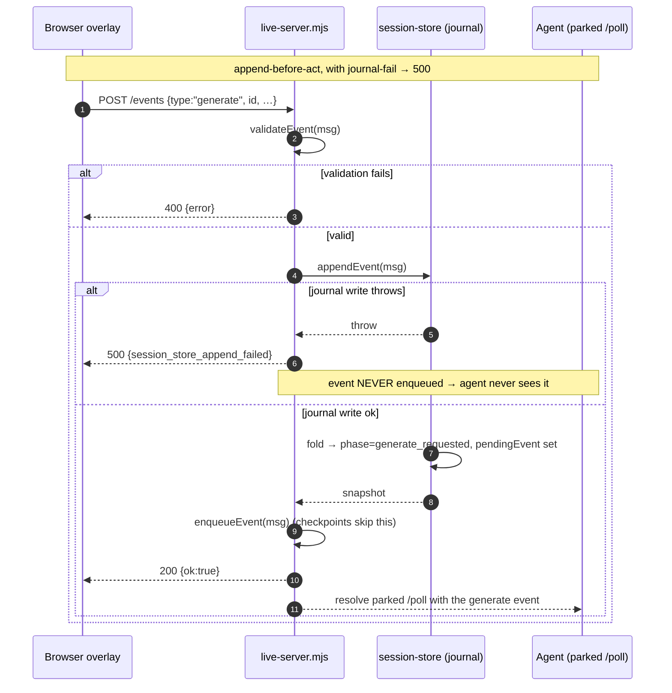
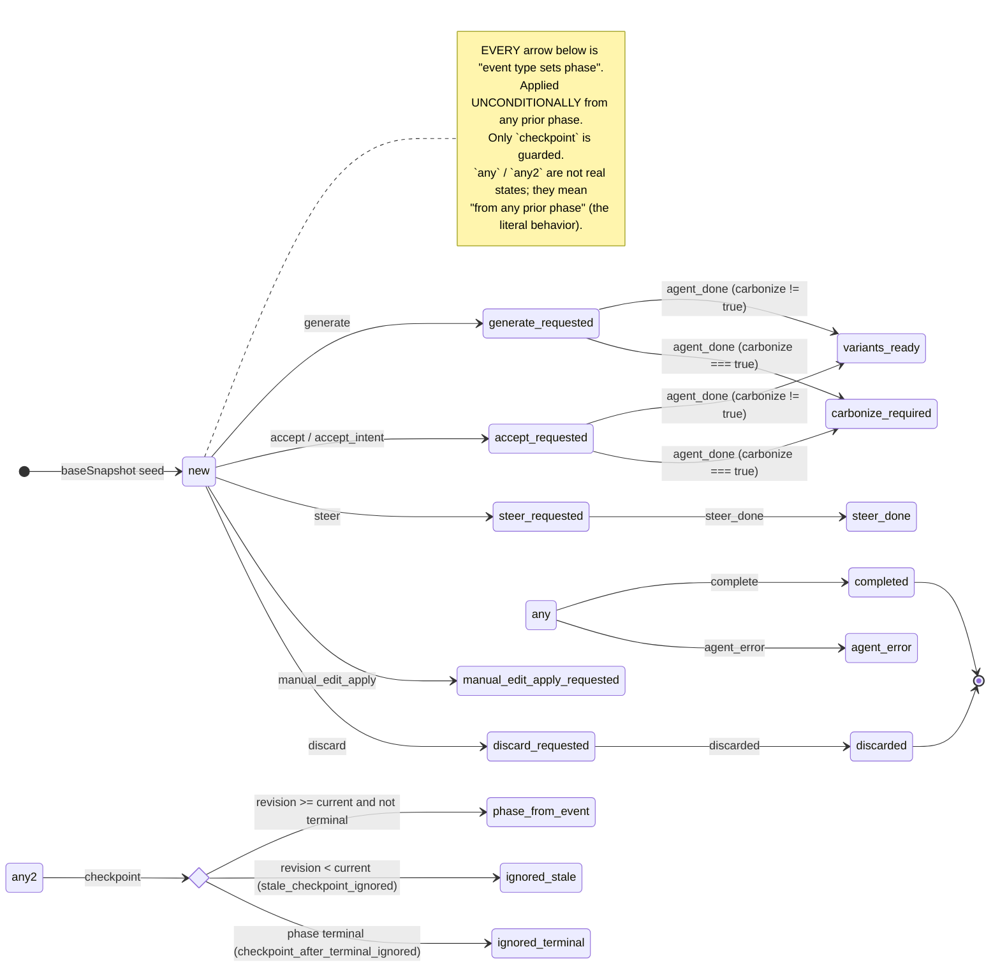
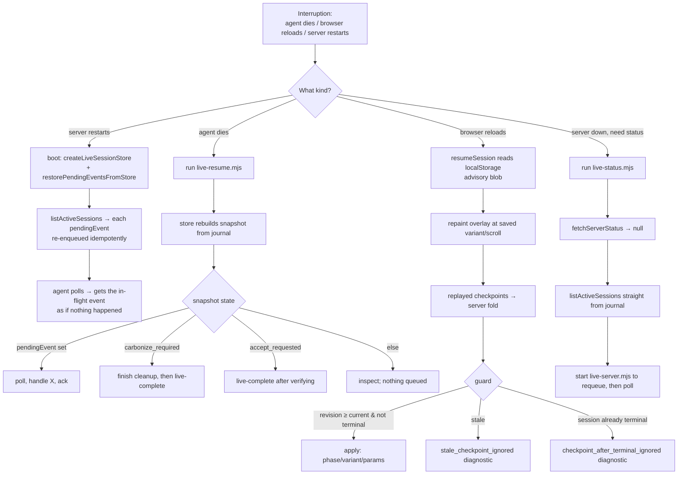

# Live mode deep dive 03b — the session journal, the snapshot fold, and crash recovery

Companion to [`03-live-mode.md`](03-live-mode.md): the durable spine of live mode — the append-only per-session journal, the snapshot fold that derives state from it, the phase machine, and the recovery printers that make "kill the agent / reload the browser mid-cycle" a no-op.

All `file:line` references are into `../../source/` unless noted. Sibling sub-dives are linked bare (e.g. [`03a`](03a-server-transport-and-protocol.md)); the overview is [`03-live-mode.md`](03-live-mode.md).

---

## 0. What this sub-dive owns (and what it defers)

Live mode is three parties that never share a process: a **browser** overlay, a **zero-dependency local Node server** (`live-server.mjs`), and an **agent** that long-polls over HTTP. The overview owns that orientation. This file owns the **durability layer** that sits under all of it:

- **`session-store.mjs`** — the entire event-sourced store: an append-only JSONL journal per session, a `baseSnapshot` seed, an `applyEvent` fold, `rebuildSnapshotFromJournal`, `getSnapshot` (rebuilds every call), `listActiveSessions`, and the legacy-path copy-forward.
- The **durability-as-precondition wiring** in `live-server.mjs`: append BEFORE enqueue; a journal-write failure fails the whole inbound event with a 500; `restorePendingEventsFromStore` re-enqueues in-flight work on boot.
- The **recovery printers**: `live-resume.mjs` (prints the *exact next safe action*), `live-status.mjs` (works with the server down, by reading the journal), and `live-complete.mjs` (the final durable ack).
- The **browser-side parallel session** in `live-browser-session.js` (localStorage blob + handled-set + scroll, each carrying a monotonic `checkpointRevision` — "advisory but durable").
- The **`server.json` PID lock** (single-instance, stale-PID unlink) and the sessions directory, both in `lib/impeccable-paths.mjs`.

Deferred to siblings (cross-linked where they touch this file):

- The HTTP routes, SSE fan-out, poll/event queues, and **leasing** → [`03a`](03a-server-transport-and-protocol.md). This file references `enqueueEvent`/`leaseEvent` only as the consumers of journaled events.
- What `complete` vs `agent_done`+`carbonize` *mean* in the lifecycle (the two-phase commit) → [`03c`](03c-variant-lifecycle-and-carbonize.md). **This file owns how the journal *records* those events; 03c owns their semantics.**

### File map

| File | Lines | Role |
|---|---|---|
| [`skill/scripts/live/session-store.mjs`](../../source/skill/scripts/live/session-store.mjs) | 289 | The event-sourced store: journal append, snapshot fold, rebuild, active-session listing. **The whole subsystem.** |
| [`skill/scripts/live-server.mjs`](../../source/skill/scripts/live-server.mjs) | 1134 | Durability wiring: append-before-enqueue (`:689`), 500-on-journal-fail (`:693`), `restorePendingEventsFromStore` (`:147`), reply journaling (`:902`), store creation + PID lock at boot (`:1090`–`:1109`). |
| [`skill/scripts/live-resume.mjs`](../../source/skill/scripts/live-resume.mjs) | 94 | Recovery printer: reads the snapshot, emits the *exact next safe agent action* string (`:78`). |
| [`skill/scripts/live-status.mjs`](../../source/skill/scripts/live-status.mjs) | 61 | Recovery printer: merges live server `/status` with journal-derived active sessions; works with the server **down**. |
| [`skill/scripts/live-complete.mjs`](../../source/skill/scripts/live-complete.mjs) | 75 | The canonical final durable ack (`complete`/`discarded`/`agent_error`); prefers the server, falls back to direct journal append. |
| [`skill/scripts/live-browser-session.js`](../../source/skill/scripts/live-browser-session.js) | 123 | Browser-side parallel session: localStorage session blob + handled-set + scroll, each with a monotonic `checkpointRevision`. Advisory; the journal is canonical. |
| [`skill/scripts/lib/impeccable-paths.mjs`](../../source/skill/scripts/lib/impeccable-paths.mjs) | 126 | Where state lives: `server.json` PID lock (read/write/stale-unlink), sessions dir, legacy fallbacks. |

---

## 1. The shape of the durable state: one JSONL journal + one snapshot cache per session

Each session is two files under `.impeccable/live/sessions/`
([`impeccable-paths.mjs:104`](../../source/skill/scripts/lib/impeccable-paths.mjs)):

- `<id>.jsonl` — the **canonical** append-only journal. One JSON object per line. Never rewritten, only appended.
- `<id>.snapshot.json` — a **derived cache**. Pretty-printed JSON, fully rewritten on every append and every read. Disposable: delete it and the next `getSnapshot` reconstructs it identically from the journal.

The journal is the source of truth; the snapshot is an optimization and a human-readable mirror. This split is the whole reason recovery is cheap: there is exactly one place that *records intent*, and everything else is a *fold over that record*.

Each journal line is a wrapper around the raw browser/agent event
([`session-store.mjs:43`](../../source/skill/scripts/live/session-store.mjs)):

```js
// session-store.mjs:43
const entry = {
  seq,
  id: normalized.id,
  type: normalized.type,
  ts: new Date().toISOString(),
  event: normalized,
};
fs.appendFileSync(journalPath, JSON.stringify(entry) + '\n');
```

So a concrete journal line for a `generate` looks like (formatted for reading; on disk it's one line):

```json
{"seq":1,"id":"a1b2c3d4","type":"generate","ts":"2026-06-18T12:00:00.000Z",
 "event":{"id":"a1b2c3d4","type":"generate","action":"bolder","count":3,
          "pageUrl":"/","element":{"outerHTML":"<button …>"}}}
```

`seq` is a per-session monotonic counter (`1`-based) used both as the journal ordinal and as the `pendingEventSeq` recorded into the snapshot. `id` is the session id. `type` is hoisted out of the event for cheap scanning. `ts` is the wall-clock append time. `event` is the full normalized payload — minus the auth `token`, which is stripped when the event is copied into the snapshot's `pendingEvent` (see [§4](#4-the-snapshot-fields-the-resumable-state)).

---

## 2. `appendEvent` — append-before-act, then fold

`appendEvent` ([`session-store.mjs:33`](../../source/skill/scripts/live/session-store.mjs)) is the single write path. Its ordering is the load-bearing discipline of the whole system: **the journal line hits disk before the snapshot is folded, and the snapshot is folded before the function returns.**

```js
// session-store.mjs:33
appendEvent(event) {
  const normalized = normalizeEvent(event, sessionId);
  const journalPath = getJournalPath(rootDir, normalized.id);
  const snapshotPath = getSnapshotPath(rootDir, normalized.id);
  const legacyJournalPath = getJournalPath(legacyRootDir, normalized.id);
  if (!fs.existsSync(journalPath) && fs.existsSync(legacyJournalPath)) {
    fs.copyFileSync(legacyJournalPath, journalPath);          // legacy copy-forward
  }
  const prior = loadCachedOrRebuild(normalized.id);           // current folded state
  const seq = prior.nextSeq;                                  // next ordinal
  const entry = { seq, id: normalized.id, type: normalized.type,
                  ts: new Date().toISOString(), event: normalized };
  fs.appendFileSync(journalPath, JSON.stringify(entry) + '\n');   // (1) DURABLE FIRST
  const next = applyEvent(prior.snapshot, entry, prior.diagnostics); // (2) fold
  snapshotCache.set(normalized.id,
    { snapshot: next, diagnostics: next.diagnostics || [], nextSeq: seq + 1 });
  writeSnapshot(snapshotPath, next);                          // (3) cache mirror
  return next;
}
```

Five things to notice:

1. **`normalizeEvent` ([:82](../../source/skill/scripts/live/session-store.mjs)) is the only event-shape validation here.** It requires `event` to be an object, requires a string `id` (falling back to the store's bound `sessionId`), and requires a string `type`. `appendEvent` then routes through `getJournalPath`, whose `safeSessionId` enforces a path-safe session id before any journal/snapshot file is touched. Anything else throws — and because the caller in `live-server.mjs` treats a throw as a 500 (see [§5](#5-durability-as-precondition-the-server-wiring)), a malformed event never gets journaled *or* enqueued. Note the store does **not** validate domain shape (that the `count` is 1–8, that `action` is a real verb, etc.); that is the server's `validateEvent` upstream, which runs **before** `appendEvent`. The store's job is durability, not domain validation.

2. **`seq` comes from the *prior* folded state's `nextSeq`** (`:42`), not from a free-running counter on the store object. This means the sequence is a pure function of the journal: rebuild from scratch and you get the same `seq` values. There is no in-memory counter to lose on restart.

3. **`loadCachedOrRebuild` ([:13](../../source/skill/scripts/live/session-store.mjs)) is a memoized rebuild.** First touch of a session id rebuilds from the journal and caches `{snapshot, diagnostics, nextSeq}`; subsequent appends fold incrementally onto the cache. The cache is the only thing that makes appends O(1) instead of O(journal). It is purely a perf cache — it is never consulted by `getSnapshot`, which always rebuilds (see [§3](#3-getsnapshot--rebuild-every-call-trust-the-journal-not-the-cache)).

4. **The append is `appendFileSync` — synchronous.** There is no async window between "I told the browser ok" and "the line is on disk," because the line is on disk *before* the fold and before the HTTP 200. (It is not `fsync`'d, so a hard power loss in the OS write-back window could still lose the tail line; the durability guarantee is process-crash-level, not kernel-panic-level. For the actual threat model — agent process death, browser reload, server restart — synchronous `appendFileSync` is sufficient.)

5. **Legacy copy-forward ([:38](../../source/skill/scripts/live/session-store.mjs)):** if the canonical journal doesn't exist but a legacy-path one does, copy it forward before appending. This migrates an in-flight session from the old `.impeccable-live/sessions/` location to the new `.impeccable/live/sessions/` on first write, without losing history.

---

## 3. `getSnapshot` — rebuild every call, trust the journal not the cache

`getSnapshot` ([`session-store.mjs:56`](../../source/skill/scripts/live/session-store.mjs)) is the read path, and it is deliberately **not** a cache hit:

```js
// session-store.mjs:56
getSnapshot(id = sessionId, opts = {}) {
  if (!id) throw new Error('session id required');
  const journalPath = getReadableJournalPath(id);
  const snapshotPath = getSnapshotPath(rootDir, id);
  const rebuilt = rebuildSnapshotFromJournal(journalPath, id);   // ALWAYS rebuild
  snapshotCache.set(id, rebuilt);                                // refresh the cache
  writeSnapshot(snapshotPath, rebuilt.snapshot);                // refresh the mirror
  if (!opts.includeCompleted && COMPLETED_PHASES.has(rebuilt.snapshot.phase)) return null;
  return rebuilt.snapshot;
}
```

Two design choices encoded here:

- **Rebuild-every-call.** Every `getSnapshot` replays the entire journal from `baseSnapshot`. This is what lets a *second* process (a `live-resume.mjs` invocation, a `live-status.mjs` invocation) read correct state even though it shares no memory with the server. The journal on disk is the only shared medium, so the only safe read is a fresh fold. The in-memory `snapshotCache` is opportunistically refreshed here but is irrelevant to correctness for cross-process reads — it exists for the append fast-path, not the read path.

- **Completed/discarded sessions are hidden by default** ([`:63`](../../source/skill/scripts/live/session-store.mjs)). `COMPLETED_PHASES = new Set(['completed', 'discarded'])` ([:5](../../source/skill/scripts/live/session-store.mjs)). A finished or discarded session returns `null` unless the caller passes `{ includeCompleted: true }`. `agent_error` is not in that hidden set: it clears pending work but remains visible as an error phase in `listActiveSessions`. This is what makes `listActiveSessions` ([:66](../../source/skill/scripts/live/session-store.mjs)) return non-hidden sessions: it maps every journal id through `getSnapshot()` and `.filter(Boolean)` drops only completed/discarded ones.

```js
// session-store.mjs:66
listActiveSessions() {
  const ids = new Set();
  for (const dir of [legacyRootDir, rootDir]) {        // both legacy + canonical
    if (!fs.existsSync(dir)) continue;
    for (const name of fs.readdirSync(dir)) {
      if (name.endsWith('.jsonl')) ids.add(name.slice(0, -'.jsonl'.length));
    }
  }
  return [...ids].sort().map((id) => this.getSnapshot(id)).filter(Boolean);
}
```

`getReadableJournalPath` ([:22](../../source/skill/scripts/live/session-store.mjs)) is the read-side legacy fallback: prefer the canonical path, fall back to legacy if only that exists, default to canonical. So both writers and readers transparently span the two storage generations.

---

## 4. The snapshot fields: the resumable state

`baseSnapshot` ([`session-store.mjs:103`](../../source/skill/scripts/live/session-store.mjs)) is the seed every rebuild starts from. The full field set is the entire resumable surface:

```js
// session-store.mjs:103
function baseSnapshot(id) {
  return {
    id,
    phase: 'new',
    pageUrl: null,
    sourceFile: null,
    previewFile: null,
    previewMode: null,
    expectedVariants: 0,
    arrivedVariants: 0,
    visibleVariant: null,
    paramValues: {},
    pendingEventSeq: null,
    pendingEvent: null,
    deliveryLease: null,
    checkpointRevision: 0,
    activeOwner: null,
    sourceMarkers: {},
    fallbackMode: null,
    annotationArtifacts: [],
    diagnostics: [],
    updatedAt: null,
  };
}
```

> **Correction:** the draft of [`03-live-mode.md`](03-live-mode.md) §4 lists the snapshot fields as ending in "…`pendingEvent`(+seq), `checkpointRevision`, …". The real fields are **`pendingEvent`** and **`pendingEventSeq`** (two separate keys, [:115–116](../../source/skill/scripts/live/session-store.mjs)), and the draft **omits `deliveryLease`** ([:117](../../source/skill/scripts/live/session-store.mjs)) and **`activeOwner`** ([:119](../../source/skill/scripts/live/session-store.mjs)). Both matter: `activeOwner` is set from `checkpoint` events ([:204](../../source/skill/scripts/live/session-store.mjs)) and carries which browser tab/owner advanced the cycle; `deliveryLease` is reserved in the base snapshot but, in this revision of the store, is never written by `applyEvent` (the live lease lives in the server's in-memory `pendingEvents`, see [`03a`](03a-server-transport-and-protocol.md)) — it is a placeholder field, present so the snapshot schema is stable even though delivery leasing is currently server-memory-only.

What each group means for recovery:

- **`phase`** — the single most important field; the state-machine position (see [§6](#6-the-fold-is-not-a-guarded-fsm-it-is-an-event-typephase-map)).
- **`pendingEvent` / `pendingEventSeq`** — the in-flight work item. Set when a `generate`/`accept`/`steer`/`discard` event is journaled, and also when a `manual_edit_apply` event is journaled. In the current manual-apply chat route, however, the server-created `manual_edit_apply` event is enqueued directly rather than appended to this session journal. Journaled pending events are **cleared to `null`** when the agent's terminal reply (`agent_done`/`variants_ready`/`steer_done`/`discarded`/`complete`/`agent_error`) is journaled. A non-null `pendingEvent` after a crash is exactly "there is unacknowledged work the agent must pick up." This is what `restorePendingEventsFromStore` re-enqueues and what `live-resume.mjs` keys its next-action string off of. `pendingEvent` is the event with its `token` stripped (`toPendingEvent`, [:275](../../source/skill/scripts/live/session-store.mjs)) — durable state must never persist a live auth secret.
- **`sourceFile` / `previewFile` / `previewMode` / `fallbackMode`** — where the variants were written and how the browser is rendering them (HMR vs no-HMR `/source` fetch). Survives a reload so the browser can re-find its variants.
- **`expectedVariants` / `arrivedVariants` / `visibleVariant` / `paramValues`** — the cycling position. `visibleVariant` + `paramValues` are what let a browser reload restore *exactly which variant was on screen with which knob values*.
- **`checkpointRevision` / `activeOwner`** — the monotonic guard and its owner (see [§7](#7-checkpoints-the-only-guarded-event-and-why-browser-reloads-are-safe)).
- **`sourceMarkers` / `annotationArtifacts` / `diagnostics`** — auxiliary: helper markers in the source, staged annotation screenshots, and the accumulated soft-error log. `diagnostics` is append-only across the fold and is how malformed lines, stale checkpoints, and "carbonize cleanup still required" surface without throwing.
- **`updatedAt`** — the `ts` of the last applied entry; the snapshot's freshness stamp.

---

## 5. Durability-as-precondition: the server wiring

The store would be inert without the server treating it as a **precondition of acting**. The inbound `/events` POST handler ([`live-server.mjs:656`](../../source/skill/scripts/live-server.mjs)) is where this is enforced. After JSON parse, token check, the manual-edit defense-in-depth rejections, and `validateEvent`, the critical ordering is:

```js
// live-server.mjs:689
if (state.sessionStore && msg.id) {
  try {
    state.sessionStore.appendEvent(msg);          // (1) DURABLE FIRST
  } catch (err) {
    res.writeHead(500, { 'Content-Type': 'application/json' });
    res.end(JSON.stringify({ error: 'session_store_append_failed', message: err.message }));
    return;                                        // (2) refuse the event entirely
  }
}
if (msg.type === 'exit') {
  cleanupSvelteComponentSessionsBeforeExit();
}
if (msg.type !== 'checkpoint') {
  enqueueEvent(msg);                               // (3) only NOW make it pollable
}
res.writeHead(200, { 'Content-Type': 'application/json' });
res.end(JSON.stringify({ ok: true }));
```

This is the heart of the durability discipline, and it is worth stating as a rule:

> **An event that could not be journaled is not allowed to happen.** A failed `appendEvent` returns HTTP 500 and the event is **never enqueued**, so the agent never sees it and the browser knows it failed. State durability is a precondition, not best-effort. There is no path where the agent acts on an intent that wasn't first recorded.

Two corollaries:

- **`checkpoint` events are journaled but never enqueued** (`:701`). A checkpoint is the browser advancing its progress marker (which variant is visible, current params); it is durable state, not agent work. So it folds into the snapshot but never wakes a poll. This is the one event type that is "journal-only."
- **`enqueueEvent` dedups by `id`+`type`** ([`live-server.mjs:142`](../../source/skill/scripts/live-server.mjs)): `state.pendingEvents.some(e => e.event?.id === id && e.event?.type === type)` short-circuits. This is why re-enqueueing on restart (next section) is idempotent.

### Restart re-enqueues in-flight work

On boot the server creates the store and immediately requeues anything the journal says is pending ([`live-server.mjs:1104`, `:1109`](../../source/skill/scripts/live-server.mjs)):

```js
// live-server.mjs:1104
state.token = randomUUID();
state.sessionStore = createLiveSessionStore({ cwd: process.cwd() });
// …
restorePendingEventsFromStore();
```

```js
// live-server.mjs:147
function restorePendingEventsFromStore() {
  if (!state.sessionStore) return;
  for (const snapshot of state.sessionStore.listActiveSessions()) {
    if (snapshot.pendingEvent) enqueueEvent(snapshot.pendingEvent);
  }
}
```

`listActiveSessions` already filters out completed/discarded sessions, so journaled
in-flight work is considered, and each `pendingEvent` is re-enqueued
(idempotently, via the `id`+`type` dedup). The agent-facing contract spells out
the consequence ([`reference/live.md:91`, into `../../source/skill/`]): *"Startup
requeues unacknowledged pending events from the journal, so do not ask the user to
click Go again unless `live-resume.mjs` says no active session exists."* This is
the line between "the server crashed, click Go again" and "the server crashed, it
picked up where it left off." Manual-apply chat-route events are the caveat: they
live in manual-apply deferred state and `state.pendingEvents`, so the session
journal does not recover them unless the implementation later journals that event.

### The reply path is also journaled — but best-effort, and terminal-safe

The agent's `POST /poll` reply is journaled too, but with a **different** durability posture than the inbound path. The handler maps reply types to journal event types ([`live-server.mjs:902`](../../source/skill/scripts/live-server.mjs)):

```js
// live-server.mjs:902
if (state.sessionStore && msg.id && !skipJournalReply) {
  try {
    const eventType = msg.type === 'steer_done'
      ? 'steer_done'
      : msg.type === 'discard' || msg.type === 'discarded'
        ? 'discarded'
        : msg.type === 'complete'
          ? 'complete'
          : msg.type === 'error'
            ? 'agent_error'
            : 'agent_done';                    // default reply → agent_done
    state.sessionStore.appendEvent({
      type: eventType, id: msg.id,
      file: replyFileMeta.file, sourceFile: replyFileMeta.sourceFile,
      previewFile: replyFileMeta.previewFile, previewMode: replyFileMeta.previewMode,
      message: msg.message, sourceEventType: acknowledgedEvent?.type,
      carbonize: msg.data?.carbonize === true,
    });
  } catch { /* keep reply path best-effort; browser still needs SSE */ }
}
```

Two asymmetries with the inbound path, both deliberate:

1. **Reply-journaling failure does NOT 500.** It is wrapped in `catch { /* best-effort */ }`. The reasoning: the inbound event is the *intent* (lose it and the agent acts on something unrecorded — unacceptable); the reply is the *acknowledgement of completed work* (the file is already written, the browser still needs its SSE confirmation, so swallow a journal hiccup rather than strand the human's UI). The intent side is a hard precondition; the completion side is best-effort because the durable side-effect (the source file) already exists.

2. **`skipJournalReply` ([`live-server.mjs:886`](../../source/skill/scripts/live-server.mjs)) is terminal-safety on the reply side.** If the session is already `completed` or `discarded`, the reply is not re-journaled. This mirrors the checkpoint terminal guard ([§7](#7-checkpoints-the-only-guarded-event-and-why-browser-reloads-are-safe)): a late or duplicate reply against a finished session is a no-op for the journal, so a retried/replayed reply can't resurrect or corrupt terminal state. Note `carbonize: msg.data?.carbonize === true` is forwarded here — this is the bit the fold reads to choose `carbonize_required` vs `variants_ready` (the journal *records* it; [`03c`](03c-variant-lifecycle-and-carbonize.md) owns what it *means*).



---

## 6. The fold is NOT a guarded FSM — it is an event-type→phase map

This is the single most important framing correction for anyone reading the drafts.

> **Correction:** the draft [`03-live-mode.md`](03-live-mode.md) §4 (and its `stateDiagram-v2`) presents `applyEvent` as a state machine with named edges like `generate_requested --> variants_ready` and `accept_requested --> completed`, implying the machine *checks the current phase and rejects illegal transitions*. **It does not.** `applyEvent` ([`session-store.mjs:155`](../../source/skill/scripts/live/session-store.mjs)) is a `switch (event.type)` fold in which almost every case sets `next.phase` **unconditionally**, regardless of the prior phase. There is exactly **one** guarded event type — `checkpoint` — which is monotonic (via `checkpointRevision`) and terminal-safe. Every other "edge" in the drafts is really just "event type X, wherever it lands, rewrites the phase to Y." A `complete` applied to a `new` session yields `completed`; an `accept` applied to a `discarded` session would set `accept_requested`. The fold trusts its inputs; the *server* (validation, leasing, the contract in `live.md`) is what keeps illegal sequences from being journaled in the first place. Drawing it as a guarded FSM overstates the store's safety.

So the honest diagram is a **dispatch table from event type to the phase it writes**, with guards drawn only on `checkpoint`:



The full event-type → phase dispatch, verbatim from the `switch`:

| `event.type` | Sets `phase` to | Guard? | Other snapshot writes | Source |
|---|---|---|---|---|
| `generate` | `generate_requested` | none | `pageUrl`, `expectedVariants`←`count`, `pendingEventSeq`←`seq`, `pendingEvent`, screenshot artifact | [:171](../../source/skill/scripts/live/session-store.mjs) |
| `variants_ready` / `agent_done` | `carbonize===true ? 'carbonize_required' : 'variants_ready'` | none | `sourceFile`/`previewFile`/`previewMode`, `arrivedVariants`, clears `pendingEvent(+Seq)`; pushes `carbonize_cleanup_required` diagnostic when carbonize | [:179](../../source/skill/scripts/live/session-store.mjs) |
| `checkpoint` | `event.phase` (if not stale/terminal) | **monotonic + terminal-safe** | revision/owner/arrived/visible/files/params — *only if* `revision ≥ checkpointRevision` and phase not terminal | [:196](../../source/skill/scripts/live/session-store.mjs) |
| `accept` / `accept_intent` | `accept_requested` | none | `visibleVariant`←`variantId`, `paramValues`, `pendingEvent(+Seq)` | [:215](../../source/skill/scripts/live/session-store.mjs) |
| `manual_edit_apply` | `manual_edit_apply_requested` | none | `pageUrl`, `pendingEvent(+Seq)` | [:223](../../source/skill/scripts/live/session-store.mjs) |
| `steer` | `steer_requested` | none | `pageUrl`, `pendingEvent(+Seq)` | [:229](../../source/skill/scripts/live/session-store.mjs) |
| `steer_done` | `steer_done` | none | `sourceFile`/`previewFile`/`previewMode`, `message`, clears `pendingEvent(+Seq)` | [:235](../../source/skill/scripts/live/session-store.mjs) |
| `discard` | `discard_requested` | none | `pendingEvent(+Seq)` | [:244](../../source/skill/scripts/live/session-store.mjs) |
| `discarded` | `discarded` (terminal) | none | clears `pendingEvent(+Seq)` | [:249](../../source/skill/scripts/live/session-store.mjs) |
| `complete` | `completed` (terminal) | none | `sourceFile`/`previewFile`/`previewMode`, clears `pendingEvent(+Seq)` | [:254](../../source/skill/scripts/live/session-store.mjs) |
| `agent_error` | `agent_error` | none | clears `pendingEvent(+Seq)`, pushes `agent_error` diagnostic | [:262](../../source/skill/scripts/live/session-store.mjs) |
| *(default)* | *(unchanged)* | n/a | pushes `unknown_event_type` diagnostic | [:268](../../source/skill/scripts/live/session-store.mjs) |

The fold's structural-safety habits (distinct from phase guarding) are worth calling out because they are what make a *replay* deterministic and crash-tolerant:

- **Immutable-style copy at the top of `applyEvent` ([:157](../../source/skill/scripts/live/session-store.mjs)):** every call spreads `snapshot` and deep-copies `paramValues`, `sourceMarkers`, `annotationArtifacts`, `diagnostics`. No prior snapshot is mutated, so folding the same journal twice yields identical output — the essential property for "rebuild every call."
- **`updatedAt` is sourced from `entry.ts`** ([:163](../../source/skill/scripts/live/session-store.mjs)), not `Date.now()`, so a rebuild reproduces the original timestamps rather than stamping replay time.

---

## 7. Checkpoints: the only guarded event, and why browser reloads are safe

The `checkpoint` case ([`session-store.mjs:196`](../../source/skill/scripts/live/session-store.mjs)) is the one place the fold inspects current state before applying:

```js
// session-store.mjs:196
case 'checkpoint':
  if (COMPLETED_PHASES.has(next.phase)) {
    next.diagnostics.push({ error: 'checkpoint_after_terminal_ignored',
                            phase: event.phase ?? null, revision: event.revision ?? null });
    break;                                                    // (A) terminal-safe
  }
  if ((event.revision ?? 0) >= (next.checkpointRevision ?? 0)) {  // (B) monotonic
    next.phase = event.phase ?? next.phase;
    next.checkpointRevision = event.revision ?? next.checkpointRevision;
    next.activeOwner = event.owner ?? next.activeOwner;
    next.arrivedVariants = event.arrivedVariants ?? next.arrivedVariants;
    next.visibleVariant = event.visibleVariant ?? next.visibleVariant;
    next.sourceFile = event.sourceFile ?? next.sourceFile;
    next.previewFile = event.previewFile ?? next.previewFile;
    next.previewMode = event.previewMode ?? next.previewMode;
    if (event.paramValues) next.paramValues = { ...event.paramValues };
  } else {
    next.diagnostics.push({ error: 'stale_checkpoint_ignored', revision: event.revision });
  }
  break;
```

Two guards, and they exist precisely for the browser-reload threat model:

- **(B) Monotonic by `checkpointRevision`.** A checkpoint whose `revision` is below the snapshot's current `checkpointRevision` is dropped as `stale_checkpoint_ignored`. The browser bumps its `checkpointRevision` on every meaningful progress step, so an *older* checkpoint (e.g. a duplicate POST, or a late one from a tab that has since fallen behind) can never roll the cycling position backward.
- **(A) Terminal-safe.** A checkpoint that lands after the session reached `completed`/`discarded` is dropped as `checkpoint_after_terminal_ignored`. This is the guard that matters most on reload: a browser that reloads *after* the agent already finished will replay its localStorage checkpoints against a session the journal says is done — and they are all ignored, so a finished session cannot be reopened by a stale tab.

### The two-sided memory: canonical journal vs advisory localStorage

There are **two** durable session records, and they are deliberately asymmetric in authority:

| | Server journal (`<id>.jsonl`) | Browser localStorage |
|---|---|---|
| Authority | **Canonical** | **Advisory** |
| Lives in | `.impeccable/live/sessions/` on disk | `localStorage`, keyed by `prefix` |
| Written by | `appendEvent` (server + recovery CLIs) | `live-browser-session.js` helpers |
| Survives | server restart, agent death | page reload, browser close/reopen, HMR |
| Role | system of record; drives requeue + resume | restores *which variant was on screen* after a reload |

The ADR states the contract directly ([`reference/live.md:77`, into `../../source/skill/`]): *"Browser checkpoints are advisory but durable; the journal is canonical."* And the ADR's persistence note ([`docs/adr-live-variant-mode.md:225`](../../source/docs/adr-live-variant-mode.md)): the localStorage state *"survives page reloads, browser close/reopen, HMR, and accidental refreshes. On page load, `resumeSession()` checks for an active variant wrapper in the DOM + the localStorage state and resumes the correct cycling position."*

The browser side (`live-browser-session.js`, [`createLiveBrowserSessionState`, :11](../../source/skill/scripts/live-browser-session.js)) keeps three keys under a `prefix`:

- `prefix-session` — the session blob (`id`, action, count, arrived/visible variant), always re-stamped with the current `checkpointRevision` on save ([:45](../../source/skill/scripts/live-browser-session.js)).
- `prefix-session-handled` — the last *handled* (accepted/discarded) id, so a reload doesn't re-handle a finished cycle ([`markHandled`/`isHandled`, :74](../../source/skill/scripts/live-browser-session.js)).
- `prefix-session-scroll` — the scroll position to restore ([:87](../../source/skill/scripts/live-browser-session.js)).

The monotonic `checkpointRevision` is the bridge between the two sides. It is an in-memory counter on the browser session object that:

- **Seeds itself from whatever it reads** — both `loadSession` ([:38](../../source/skill/scripts/live-browser-session.js)) and `seedCheckpointRevision` ([:65](../../source/skill/scripts/live-browser-session.js)) do `checkpointRevision = Math.max(checkpointRevision, value)`, so it never goes backward even across a reload that re-reads an older blob.
- **Increments on progress** — `nextCheckpointRevision` ([:58](../../source/skill/scripts/live-browser-session.js)) bumps and re-saves.
- **Rides on every checkpoint event** the browser sends, which is exactly the `revision` the server-side guard (B) compares against.

So the flow is: browser advances → bumps `checkpointRevision` → POSTs a `checkpoint` carrying that revision → server journals it (journal-only, never enqueued) → fold applies it *only if* monotonic-and-not-terminal. A reload re-reads the localStorage blob (advisory) to repaint the overlay instantly, while the journal (canonical) remains the truth the agent and recovery CLIs trust. The two can briefly disagree (advisory localStorage is a tab-local optimistic mirror); the monotonic + terminal guards ensure the disagreement always resolves in the canonical journal's favor, and a replayed checkpoint is at worst a no-op.

Every localStorage helper is wrapped in `try/catch` ([`safeRead`/`safeWrite`/`safeRemove`, :21](../../source/skill/scripts/live-browser-session.js)) so quota-exceeded or private-mode failures degrade silently — the advisory side is allowed to be lossy precisely because it is not the system of record.

---

## 8. The recovery printers: deterministic agent re-entry

After any interruption, a fresh agent (or the same agent after a restart) does not guess. It runs one of two read-only CLIs that reconstruct state from disk and print the *next safe action*. This is the re-entry contract.

### `live-resume.mjs` — print the exact next action

`live-resume.mjs` ([:63](../../source/skill/scripts/live-resume.mjs)) creates a store, reads the snapshot (`--id`, or the first active session), and derives a single human/agent-readable instruction string:

```js
// live-resume.mjs:78
const pending = snapshot.pendingEvent || null;
const nextAction = pending
  ? pending.type === 'manual_edit_apply'
    ? manualApplyResumeHint(pending)
    : `Run live-poll.mjs, handle ${pending.type} ${pending.id}, then acknowledge with live-poll.mjs --reply ${pending.id} done.`
  : snapshot.phase === 'carbonize_required'
    ? `Finish carbonize cleanup${snapshot.sourceFile ? ` in ${snapshot.sourceFile}` : ''}, then run live-complete.mjs --id ${snapshot.id}.`
    : snapshot.phase === 'accept_requested'
      ? `Run live-complete.mjs --id ${snapshot.id} after verifying the accepted variant is written.`
      : `Inspect ${snapshot.id}; no pending agent event is currently queued.`;
```

The decision tree maps snapshot state to the one correct move:

1. **`pendingEvent` is set** → there is unacknowledged work; poll, handle it, ack it. (Manual-apply gets a richer hint via `manualApplyResumeHint`, [:13](../../source/skill/scripts/live-resume.mjs), which summarizes chunk/op/file counts.)
2. **No pending, but `phase === 'carbonize_required'`** → the variant was accepted but the temporary stitch-in hasn't been folded into permanent source; finish cleanup, then `live-complete.mjs`.
3. **No pending, but `phase === 'accept_requested'`** → an accept was recorded but not yet completed; run `live-complete.mjs` after verifying the write.
4. **Otherwise** → nothing queued; just inspect.

The output is JSON: `{ active, snapshot, pendingEvent, nextAction }` ([:88](../../source/skill/scripts/live-resume.mjs)). The agent reads `nextAction` verbatim. This is the deterministic re-entry point: the same snapshot always yields the same instruction, so recovery is reproducible rather than improvised. If there is no active session at all, it prints `{ active: false, nextAction: 'No active durable live session found.' }` ([:73](../../source/skill/scripts/live-resume.mjs)).

### `live-status.mjs` — works with the server down

`live-status.mjs` ([:25](../../source/skill/scripts/live-status.mjs)) answers "what's the overall state?" and crucially **does not require the server to be running**:

```js
// live-status.mjs:25
const info = readServerInfo();
const server = await fetchServerStatus(info);              // null if server down
const store = createLiveSessionStore({ cwd: process.cwd() });
const activeSessions = store.listActiveSessions();         // straight from the journal
// …
recoveryHint: manualApply
  ? manualApplyResumeHint(manualApply)
  : server
    ? 'Run live-poll.mjs to continue pending work, or live-complete.mjs --id <session> after manual cleanup.'
    : 'Start live-server.mjs to requeue pending durable events, then run live-poll.mjs.',
```

`fetchServerStatus` ([:14](../../source/skill/scripts/live-status.mjs)) returns `null` on any error (server down, port closed, non-200). The recovery hint branches on that: server up → "poll to continue"; server down → "start the server (which will requeue from the journal), then poll." The `activeSessions` come from the live server when available, else from the journal directly (`server?.activeSessions || activeSessions`, [:39](../../source/skill/scripts/live-status.mjs)). This is the property that makes the journal a true black box recorder: even with the server dead, an agent can read exactly what was in flight by replaying the on-disk journal — no live process required. The agent-facing contract names this explicitly ([`reference/live.md:87`, into `../../source/skill/`]): *"It works even when the helper is down by reading the journal directly."*

### `live-complete.mjs` — the final durable ack, server-preferred with journal fallback

`live-complete.mjs` ([:23](../../source/skill/scripts/live-complete.mjs)) is the canonical way to write the terminal journal event after carbonize/manual cleanup is verified. It is **server-preferred with a direct-journal fallback** — a small but important durability detail:

```js
// live-complete.mjs:30
const serverInfo = readServerInfo();
const serverResult = serverInfo ? await completeThroughServer(serverInfo, args) : null;
if (serverResult?.ok) {
  const store = createLiveSessionStore({ cwd: process.cwd(), sessionId: args.id });
  const snapshot = store.getSnapshot(args.id, { includeCompleted: true });
  console.log(JSON.stringify({ ok: true, id: args.id, phase: snapshot?.phase || args.status, snapshot }, null, 2));
  return;
}
// Server unavailable → append directly to the journal:
const store = createLiveSessionStore({ cwd: process.cwd(), sessionId: args.id });
const event = args.status === 'discarded'
  ? { type: 'discarded', id: args.id }
  : args.status === 'agent_error'
    ? { type: 'agent_error', id: args.id, message: args.message || 'unknown error' }
    : { type: 'complete', id: args.id };
const snapshot = store.appendEvent(event);
```

When the server is up it routes the completion through `POST /poll` ([`completeThroughServer`, :53](../../source/skill/scripts/live-complete.mjs)) so the server journals it *and* notifies the browser over SSE (the green "applied" confirmation). When the server is unavailable or returns non-OK, it appends the terminal event straight to the journal itself, so `completed`/`discarded` sessions still reach a hidden terminal phase. That fallback does not cover every server-success anomaly: if the server returns OK after swallowing a reply-journal failure, `live-complete.mjs` will read and echo the snapshot but will not append a local fallback. `agent_error` is also different from `completed`/`discarded`: it clears pending work but remains visible as an error phase. The `--id` is mandatory; flags select the status (`--discarded`, `--error MESSAGE`, default `complete`) ([:9](../../source/skill/scripts/live-complete.mjs)). Reading with `{ includeCompleted: true }` ([:34](../../source/skill/scripts/live-complete.mjs)) is what lets it echo the snapshot after a terminal read would normally return `null`.



---

## 9. End-to-end trace: one generate cycle through the durable spine

Putting the pieces together, here is the full event-sourcing path for a single `generate`, from browser intent to the snapshot on disk and back out through recovery.

**(1) Browser intent → server.** The human picks an element, picks "bolder", count 3, clicks Go. The overlay POSTs:

```
POST /events  {token, type:"generate", id:"a1b2c3d4", action:"bolder", count:3,
               pageUrl:"/", element:{outerHTML:"<button …>"}}
```

**(2) Server: validate, then append BEFORE enqueue** ([`live-server.mjs:683`–`703`](../../source/skill/scripts/live-server.mjs)). `validateEvent` passes; `state.sessionStore.appendEvent(msg)` runs *first*. If it threw, the response is 500 and the event is never enqueued (§5). It didn't, so after the append `enqueueEvent(msg)` makes it pollable.

**(3) `appendEvent`: durable line, then fold** ([`session-store.mjs:33`](../../source/skill/scripts/live/session-store.mjs)). `seq = prior.nextSeq` (say `1`). The JSONL line is appended:

```json
{"seq":1,"id":"a1b2c3d4","type":"generate","ts":"…","event":{"id":"a1b2c3d4","type":"generate","action":"bolder","count":3,"pageUrl":"/","element":{…}}}
```

Then `applyEvent` folds it (`generate` case, [:171](../../source/skill/scripts/live/session-store.mjs)): `phase='generate_requested'`, `expectedVariants=3`, `pendingEventSeq=1`, `pendingEvent={generate, token-stripped}`. The snapshot cache is updated and `<id>.snapshot.json` is rewritten:

```json
{ "id":"a1b2c3d4", "phase":"generate_requested", "pageUrl":"/",
  "expectedVariants":3, "pendingEventSeq":1, "pendingEvent":{"type":"generate", …},
  "checkpointRevision":0, "updatedAt":"…", … }
```

**(4) Agent leases, works, replies.** The parked `/poll` resolves with the generate event (leasing is [`03a`](03a-server-transport-and-protocol.md)). The agent wraps the element, writes 3 variants, then `POST /poll {id:"a1b2c3d4", type:"done", file:"public/index.html"}`.

**(5) Reply journaled (best-effort), phase advances** ([`live-server.mjs:902`](../../source/skill/scripts/live-server.mjs)). `acknowledgePendingEvent` removes it from `pendingEvents`; `skipJournalReply` is false (session not terminal). The reply maps `done → agent_done` and appends:

```json
{"seq":2,"id":"a1b2c3d4","type":"agent_done","ts":"…","event":{"type":"agent_done","id":"a1b2c3d4","sourceFile":"public/index.html","carbonize":false}}
```

The fold (`agent_done` case, [:179](../../source/skill/scripts/live/session-store.mjs)) sets `phase='variants_ready'` (carbonize false), `sourceFile='public/index.html'`, `arrivedVariants=3`, and **clears** `pendingEvent`/`pendingEventSeq` to `null`. The session is now "waiting for the human to cycle/accept," with no in-flight agent work.

**Crash-recovery trace A — server restart between (3) and (4).** The server dies after journaling the generate but before the agent leased it. On reboot: `createLiveSessionStore` + `restorePendingEventsFromStore` ([`live-server.mjs:1104`,`:1109`](../../source/skill/scripts/live-server.mjs)) → `listActiveSessions` returns session `a1b2c3d4` (phase `generate_requested`, non-terminal) → its `pendingEvent` is `enqueueEvent`'d again. The agent's next poll gets the generate event as if the restart never happened. No "click Go again."

**Crash-recovery trace B — agent dies between (4) and (5).** The agent leased the generate, wrote the files, then died before replying. The lease expires server-side and the event becomes pollable again (lease self-heal is [`03a`](03a-server-transport-and-protocol.md)). A fresh agent runs `live-resume.mjs` ([:78](../../source/skill/scripts/live-resume.mjs)): the snapshot still has `pendingEvent` set (the `agent_done` was never journaled), so `nextAction` = *"Run live-poll.mjs, handle generate a1b2c3d4, then acknowledge with live-poll.mjs --reply a1b2c3d4 done."* The agent re-polls, re-handles, acks — converging the journal to `variants_ready`. (If the variants were already written, the wrap/write is idempotent enough that re-handling lands the same source; the durable truth is the journal, and it says the work is still pending until the ack arrives.)

**Crash-recovery trace C — browser reloads after (5).** The human's tab reloads while the session sits at `variants_ready`. `resumeSession` reads the advisory localStorage blob (§7) and repaints the overlay at the saved `visibleVariant`/scroll instantly. As the browser re-establishes, any replayed `checkpoint` carrying a `revision ≤ checkpointRevision` is dropped (`stale_checkpoint_ignored`); had the agent already completed the session, every replayed checkpoint would be dropped (`checkpoint_after_terminal_ignored`). The canonical journal is untouched by the reload; the advisory mirror just gets the human back to where they were looking.

---

## 10. The PID lock and the storage layout (`impeccable-paths.mjs`)

Single-instance enforcement lives in two cooperating places.

**`server.json` as the lock file** ([`impeccable-paths.mjs:56`](../../source/skill/scripts/lib/impeccable-paths.mjs)) holds `{ pid, port, token }` under `.impeccable/live/`. There are **two** stale-PID checks, and it's worth knowing both exist:

1. **In the reader, on every read** ([`readLiveServerInfo`, :64](../../source/skill/scripts/lib/impeccable-paths.mjs)): for each candidate path (canonical, then legacy `.impeccable-live.json`), it parses the file and — if the recorded `pid` is **not reachable** — unlinks the stale file and tries the next candidate. So any consumer (`live-status`, `live-complete`, the agent's poll client) that reads server info transparently garbage-collects a dead server's record.

```js
// impeccable-paths.mjs:64
export function readLiveServerInfo(cwd = process.cwd()) {
  for (const filePath of [getLiveServerPath(cwd), getLegacyLiveServerPath(cwd)]) {
    try {
      const info = JSON.parse(fs.readFileSync(filePath, 'utf-8'));
      if (info && typeof info.pid === 'number' && !isLiveServerPidReachable(info.pid)) {
        try { fs.unlinkSync(filePath); } catch {}
        continue;                                  // stale → drop, try next
      }
      return { info, path: filePath };
    } catch { /* try next */ }
  }
  return null;
}
```

2. **At server boot, explicitly** ([`live-server.mjs:1090`](../../source/skill/scripts/live-server.mjs)): the server reads any existing record, `process.kill(pid, 0)`'s it, and if the process is **alive** refuses to start (printing the running port/pid and the stop command); if dead, it unlinks the stale file and proceeds.

```js
// live-server.mjs:1090
const existingRecord = readLiveServerInfo(process.cwd());
if (existingRecord?.info) {
  const existing = existingRecord.info;
  try {
    process.kill(existing.pid, 0);
    console.error(`Live server already running on port ${existing.port} (pid ${existing.pid}).`);
    process.exit(1);                               // single-instance
  } catch {
    try { fs.unlinkSync(existingRecord.path); } catch {}   // stale → reclaim
  }
}
```

The reachability test ([`isLiveServerPidReachable`, :80](../../source/skill/scripts/lib/impeccable-paths.mjs)) is careful about signal semantics: `ESRCH` means "no such process" → stale → reclaim; `EPERM` means "the process exists but we can't signal it" → **treated as alive**, so the record is kept. This avoids a foreign process that happens to reuse the PID being misread as "our dead server" in the unlink direction, and avoids stomping a live server we merely lack permission to signal.

**The record is written once the listener is bound** ([`live-server.mjs:1124`](../../source/skill/scripts/live-server.mjs)): inside `httpServer.listen(...)`'s callback, `writeLiveServerInfo(cwd, { pid, port, token })`. So the lock file only exists once the server is actually accepting connections.

**Storage layout** (all relative to `.impeccable/live/`, [`impeccable-paths.mjs`](../../source/skill/scripts/lib/impeccable-paths.mjs)):

| What | Path | Helper |
|---|---|---|
| Live dir root | `.impeccable/live/` | `getLiveDir` [:30](../../source/skill/scripts/lib/impeccable-paths.mjs) |
| Server lock | `.impeccable/live/server.json` | `getLiveServerPath` [:56](../../source/skill/scripts/lib/impeccable-paths.mjs) |
| Sessions (journal + snapshot) | `.impeccable/live/sessions/` | `getLiveSessionsDir` [:104](../../source/skill/scripts/lib/impeccable-paths.mjs) |
| Annotations | `.impeccable/live/annotations/` | `getLiveAnnotationsDir` [:112](../../source/skill/scripts/lib/impeccable-paths.mjs) |
| Legacy server lock | `.impeccable-live.json` | `getLegacyLiveServerPath` [:60](../../source/skill/scripts/lib/impeccable-paths.mjs) |
| Legacy sessions | `.impeccable-live/sessions/` | `getLegacyLiveSessionsDir` [:108](../../source/skill/scripts/lib/impeccable-paths.mjs) |

Every getter has a legacy twin, and both the store (read + append) and the server (server-info read) consult legacy before falling back to canonical. This is how an upgrade mid-session doesn't strand in-flight work: the new code finds the old journal and copies it forward on first append (§2).

---

## 11. Patterns worth stealing for YoinkIt

YoinkIt's job is the inverse of Impeccable's: Impeccable **writes code into the user's repo and leans on HMR**, so "capture" is free and the hard problem is agent latency; YoinkIt **emits a spec, never code**, and its hard problem is the real, visible browser. So none of the file-writing or "capture is free" assumptions transfer. What transfers is the **durability discipline** — the journal, the fold, the recovery printers — because YoinkIt's multi-source, multi-viewport capture sweep is a long, interruptible loop, exactly the shape the journal was built for.

### STEAL — `.yoinkit/sessions/<id>.jsonl` journal for a resumable map→capture sweep

A capture sweep is naturally event-sourced: *source-mapped*, *armed source S viewport V*, *triggered*, *dumped spec for S×V*, *sweep complete*. Append each as a `{seq, id, type, ts, event}` line under `.yoinkit/sessions/<sweep-id>.jsonl` and derive a snapshot by folding (which sources×viewports are done, which is in flight, what the next one is). Concrete shape, lifted almost verbatim from `appendEvent` ([`session-store.mjs:33`](../../source/skill/scripts/live/session-store.mjs)) + the fold ([:155](../../source/skill/scripts/live/session-store.mjs)):

- Journal line: `{seq, id:sweepId, type:"captured", ts, event:{source, viewport, layers, specPath}}`.
- `baseSnapshot`: `{sweepId, phase:'new', requiredPairs:[…], donePairs:[], pending:null, …}`.
- Fold: `captured` appends `{source,viewport}` to `donePairs`, clears `pending`; `arm` sets `pending={source,viewport}`.

The payoff is the same line `live.md:91` draws for Impeccable: a fresh agent doesn't restart a half-finished sweep, it reads the journal and resumes the next un-captured source×viewport. Given the memory note that the sweep is "per source × viewport; 9 required sources, partial probe," the journal *is* the coverage ledger — `donePairs` answers "what still needs inspecting" deterministically instead of re-deriving it.

### STEAL — durability-as-precondition ("a capture you can't persist isn't captured")

The single rule worth internalizing from `live-server.mjs:689` is: **append the record before you act, and if the append fails, fail the whole step.** YoinkIt's analogue: make *writing the spec to disk* a precondition of marking a source×viewport "done." A `dump()` whose JSON didn't reach `.yoinkit/sessions/.../spec.json` should not advance the snapshot's `donePairs` — the same 500-on-journal-fail posture ([:693](../../source/skill/scripts/live-server.mjs)) applied to capture. This matters more for YoinkIt than Impeccable: re-running a real-browser capture is expensive (settle → arm → trigger → wait), so silently losing one and not noticing until the end is a costly mistake the precondition prevents. The asymmetry from §5 transfers too: treat the *spec write* as a hard precondition, but treat *advisory progress markers* (a UI "captured!" toast) as best-effort.

### STEAL — restart-requeues-in-flight

`restorePendingEventsFromStore` ([`live-server.mjs:147`](../../source/skill/scripts/live-server.mjs)) turns "the orchestrator restarted" into a non-event: on boot, re-enqueue every snapshot's `pending` work. For YoinkIt, if a sweep coordinator process dies, on restart it reads each active sweep's snapshot and re-arms the one `pending` capture rather than asking the human to re-point the browser. The idempotent dedup ([`enqueueEvent`, :142](../../source/skill/scripts/live-server.mjs)) means re-enqueueing the same in-flight item twice is harmless — worth copying so restart is safe to run repeatedly.

### STEAL — resume-prints-next-action as a deterministic re-entry point

`live-resume.mjs:78` is the cleanest "how does an agent re-enter a long loop" primitive in the codebase: snapshot → a single instruction string. YoinkIt should ship a `yoinkit-resume` that reads the sweep snapshot and prints exactly one of: *"capture source X at viewport Y next,"* *"all required pairs captured; finalize the combined spec,"* or *"no active sweep."* Because the snapshot is a pure fold of the journal, the same interrupted state always yields the same instruction — recovery is reproducible, not improvised. This is the mechanical realization of the memory note "fan-out research agents write deep to disk, condense for main thread": the journal is the deep on-disk truth; `resume` is the condensed re-entry signal.

### ADAPT — checkpoint monotonicity for browser-reload replay safety

Capture needs a *real visible browser*, and real browsers get reloaded mid-sweep (HMR on the target page, an accidental refresh, a tab restore). Impeccable's monotonic-`checkpointRevision` + terminal-safe guard ([`session-store.mjs:196`](../../source/skill/scripts/live/session-store.mjs)) is the exact mechanism to make a reload's replayed progress safe: stamp each capture-progress checkpoint with a monotonic revision so a stale tab can't roll the sweep's "current source×viewport" backward, and drop any checkpoint that lands after the sweep is `complete`. Adapt rather than steal verbatim because YoinkIt's "progress" is *capture coverage*, not *which variant is on screen* — the field semantics differ, but the monotonic + terminal double-guard is identical.

### ADAPT — the canonical-journal vs advisory-localStorage split

Impeccable keeps two records with asymmetric authority (§7): the server journal is canonical; the browser localStorage is advisory but durable. YoinkIt's capture engine is an injected, dependency-free script in a page it doesn't own, so it *will* want some browser-local memory (which source is being captured, last viewport) to survive a reload and repaint its picker. Adopt the same split: that browser-local blob is **advisory** (repaint the picker fast), and the on-disk sweep journal is **canonical** (what the agent and `resume` trust). The discipline to copy is the *resolution rule*: when they disagree, the canonical journal wins, and an advisory replay is at worst a no-op. Keep the advisory side allowed-to-be-lossy (Impeccable's `try/catch` around every localStorage call, [:21](../../source/skill/scripts/live-browser-session.js)) since it is not the system of record.

### AVOID — do not import the "guarded FSM" framing or the file-mutation core

Two things in this subsystem are *not* worth copying:

- **Don't model the fold as a guarded state machine.** The honest reading (§6) is that `applyEvent` is an unconditional event-type→phase map with a single guard on `checkpoint`; it trusts upstream validation to keep illegal sequences out of the journal. That's fine for Impeccable because its server validates hard before appending. But if YoinkIt copies the *diagram* (the drafts' clean FSM) instead of the *code* (a trusting fold), it will assume a safety the store does not provide. Copy the fold's structural-safety habits (immutable copies, `ts`-sourced `updatedAt`, replay determinism) — not the illusion of transition guards.
- **Don't carry over the source-modification / carbonize machinery.** Accept-writes-into-source, the `display:contents` wrapper, the two-phase carbonize commit ([`03c`](03c-variant-lifecycle-and-carbonize.md)) — all of that is downstream of "Impeccable owns the repo." YoinkIt explicitly does not write code; its terminal artifact is a spec. The journal/fold/recovery spine survives the inversion; the code-writing payload does not.

---

## Appendix — verified line-number index (into `../../source/`)

| Symbol / behavior | File:line |
|---|---|
| `COMPLETED_PHASES = {completed, discarded}` | `session-store.mjs:5` |
| `createLiveSessionStore` | `session-store.mjs:7` |
| `loadCachedOrRebuild` (memoized rebuild) | `session-store.mjs:13` |
| `getReadableJournalPath` (read-side legacy fallback) | `session-store.mjs:22` |
| `appendEvent` (append-before-fold) | `session-store.mjs:33` |
| legacy copy-forward on append | `session-store.mjs:38` |
| `seq = prior.nextSeq` | `session-store.mjs:42` |
| JSONL line `{seq,id,type,ts,event}` + `appendFileSync` | `session-store.mjs:43`, `:50` |
| `getSnapshot` (rebuild every call, hide completed) | `session-store.mjs:56`, `:63` |
| `listActiveSessions` | `session-store.mjs:66` |
| `baseSnapshot` (full field set incl. `deliveryLease`, `activeOwner`) | `session-store.mjs:103` |
| `rebuildSnapshotFromJournal` (malformed→diagnostics, tracks `nextSeq`) | `session-store.mjs:128` |
| `applyEvent` (the fold / switch) | `session-store.mjs:155` |
| `generate` → `generate_requested` | `session-store.mjs:171` |
| `variants_ready`/`agent_done` → carbonize branch | `session-store.mjs:179`, `:181` |
| `checkpoint` (terminal-safe + monotonic guard) | `session-store.mjs:196`, `:197`, `:201` |
| `accept`/`accept_intent` → `accept_requested` | `session-store.mjs:215` |
| `manual_edit_apply` → `manual_edit_apply_requested` | `session-store.mjs:223` |
| `steer` / `steer_done` / `discard` / `discarded` / `complete` / `agent_error` | `session-store.mjs:229`/`235`/`244`/`249`/`254`/`262` |
| default → `unknown_event_type` diagnostic | `session-store.mjs:268` |
| `toPendingEvent` strips `token` | `session-store.mjs:275` |
| `enqueueEvent` (dedup by id+type) | `live-server.mjs:142` |
| `restorePendingEventsFromStore` | `live-server.mjs:147` |
| append-before-enqueue + 500-on-journal-fail | `live-server.mjs:689`, `:693`, `:701` |
| `skipJournalReply` terminal-safety | `live-server.mjs:886` |
| reply→journal type mapping (best-effort `catch`) | `live-server.mjs:902`, `:924` |
| boot: store create + PID lock + requeue | `live-server.mjs:1090`, `:1104`, `:1109` |
| `writeLiveServerInfo` on listen | `live-server.mjs:1124` |
| `live-resume.mjs` next-action string | `live-resume.mjs:78` |
| `manualApplyResumeHint` | `live-resume.mjs:13` |
| `live-status.mjs` works server-down | `live-status.mjs:25`, `:39` |
| `live-complete.mjs` server-preferred, journal fallback | `live-complete.mjs:30`, `:45` |
| browser `createLiveBrowserSessionState` | `live-browser-session.js:11` |
| browser checkpoint seed/next (`Math.max`) | `live-browser-session.js:38`, `:58`, `:65` |
| `safeRead`/`safeWrite`/`safeRemove` (lossy advisory) | `live-browser-session.js:21` |
| `readLiveServerInfo` (per-read stale-PID unlink) | `impeccable-paths.mjs:64` |
| `isLiveServerPidReachable` (ESRCH vs EPERM) | `impeccable-paths.mjs:80` |
| sessions dir / legacy sessions dir | `impeccable-paths.mjs:104`, `:108` |
| "advisory but durable; journal is canonical" | `reference/live.md:77` (into `../../source/skill/`) |
| "Startup requeues unacknowledged pending events" | `reference/live.md:91` (into `../../source/skill/`) |
| localStorage survives reload/close/HMR | `docs/adr-live-variant-mode.md:225` |
