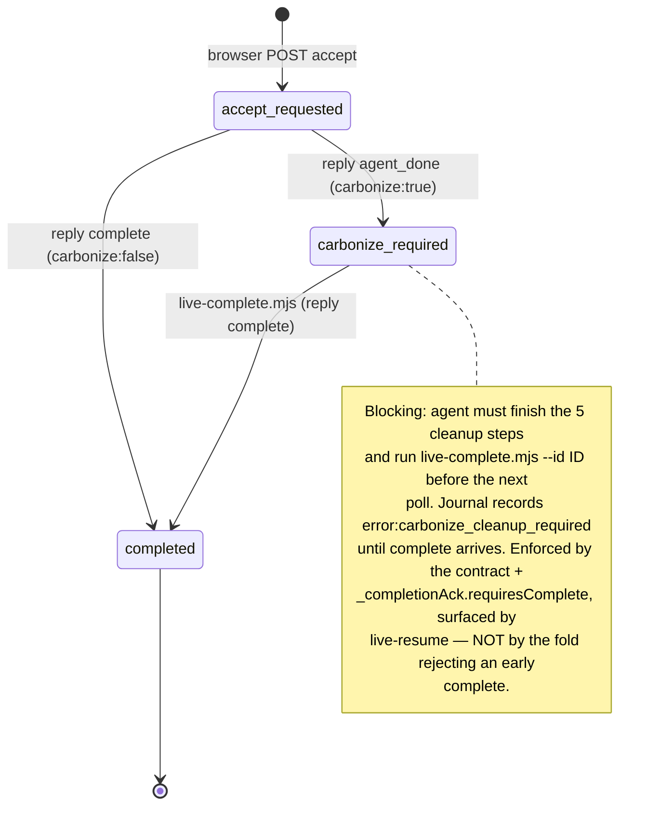

# Live mode deep dive 03c — the variant lifecycle and the carbonize two-phase commit

Companion to [`03-live-mode.md`](03-live-mode.md) (the overview, which owns the orientation). This sub-dive goes to the floor on **what one variant cycle actually does as a trace across all three parties — pick to carbonize — and on the deferred-finalize two-phase commit that is the single most transferable idea in the whole subsystem.**
All `file:line` references are into `../../source/` unless noted.

---

## 0. The one sentence

A variant cycle is: the human **picks** an element → the agent **wraps** it in source and writes **all N variants in one edit** → the human **cycles + tunes** them with zero regeneration cost → the human **accepts** one → a **fast, ugly, correct** write lands the pick instantly *inside the poll, before the agent even reads the accept event* → and only then does the agent do the **slow, clean, permanent** rewrite (**carbonize**), which a `carbonize_required` phase refuses to let the session finish until it is done. The instant-feedback path and the correctness path are **decoupled in time but coupled by durable state**. That decoupling is the pattern worth stealing; the mechanism it rides on (writing code into the user's repo) is not.

This document owns that lifecycle end to end. It does **not** own:

- the server routes / leasing / poll transport that carry the events → [`03a`](03a-server-transport-and-protocol.md);
- the journal/snapshot mechanics and how the fold *records* accept/complete → [`03b`](03b-session-journal-and-recovery.md) (I cite the fold where it gates the lifecycle, but 03b is canonical on it);
- the overlay's cycling-row and parameter-knob *widgets* → [`03d`](03d-overlay-picker-and-locators.md) (I own param **baking** in carbonize and the param **values** flowing into accept; 03d owns the knobs themselves);
- the **Svelte-component** accept path (`inlineSvelteComponentAccept`, expression↔prop write-back, `:global()` CSS scoping) → [`03f`](03f-framework-source-mapping.md). I flag where Svelte variants fork off the HTML/JSX path and cross-link; I do not trace the Svelte accept.

---

## 1. File map for this area

| File | Lines | Role in the lifecycle |
|---|---|---|
| [`skill/reference/live.md`](../../source/skill/reference/live.md) | 722 | **THE agent contract.** Every step below is an instruction here: `Handle generate` (:93), wrap (:139), plan three variants (:198), write all variants in one edit (:298), params (:347), signal done (:402), `Handle accept` (:462), the **five carbonize steps** (:473), discard (:489), steer (:493), prefetch (:515). |
| [`skill/scripts/live-wrap.mjs`](../../source/skill/scripts/live-wrap.mjs) | 894 | The single-CLI-call that replaces grep+read+edit: finds the element (id→class→tag priority), writes the `display:contents` wrapper at the source location, returns `{file, insertLine, commentSyntax, styleMode, cssAuthoring}`. **Load-bearing and absent from draft 03's file map — see the correction below.** |
| [`skill/scripts/live-accept.mjs`](../../source/skill/scripts/live-accept.mjs) | 812 | The deterministic file mutator. `handleAccept` / `handleDiscard`, `buildCarbonizeReplacement` (:274-323), the `needsCarbonize` gate (:359), generated-file refusal (:137), Svelte hand-off (:83-119). |
| [`skill/scripts/live-poll.mjs`](../../source/skill/scripts/live-poll.mjs) | 379 | The agent's poll client. `augmentEventWithAcceptHandling` (:182) runs `live-accept` **inline inside the poll**, computes the completion type, posts the reply, and stashes `_completionAck`; the stderr carbonize banner (:230-237). (03a owns the slice/transport; this doc owns the accept *semantics*.) |
| [`skill/scripts/live/completion.mjs`](../../source/skill/scripts/live/completion.mjs) | 19 | The decision: maps an accept result → completion type (:1) and ack (:10). `complete` vs `agent_done`+`requiresComplete`. |
| [`skill/scripts/live-complete.mjs`](../../source/skill/scripts/live-complete.mjs) | 75 | The canonical final durable ack after carbonize cleanup; posts a `complete` reply → journal `complete` → `completed` phase (cross-ref [`03b`](03b-session-journal-and-recovery.md)). |
| [`skill/scripts/live-insert.mjs`](../../source/skill/scripts/live-insert.mjs) | 272 | Insert-mode wrap: splices a net-new wrapper (no `original`) before/after an anchor. Covered at a high level in §9. |
| [`skill/scripts/live/insert-ui.mjs`](../../source/skill/scripts/live/insert-ui.mjs) | 458 | Pure insert-mode geometry (axis detection, gap hit-testing, placeholder sizing). High level in §9. |
| [`docs/adr-live-variant-mode.md`](../../source/docs/adr-live-variant-mode.md) | 261 | Design rationale. Message flow (:112-169), wrapper format (:171-194), perf (:242-250), limits (:257-261). **Predates carbonize (2026-04-12) — its accept flow is stale; see correction.** |

> **Correction (file-map gap):** `live-wrap.mjs` (894 lines) is the busiest script in a generate cycle — it is the entire "wrap" half of the latency optimization — yet it is **missing from draft 03's file map** (which lists `live-accept.mjs`, `live-poll.mjs`, etc. but not `live-wrap.mjs`). A fresh agent reading only that map would not know the wrap CLI exists and would fall back to grep+read+edit, defeating the 40s→15-20s win. It is restored to the table above.

---

## 2. The full lifecycle as a cross-party trace

Five swimlanes: the **human**, the **browser** (overlay + `live.js`), the **server** (`live-server.mjs`), the **agent** (poll loop + scripts), and the **source files** on disk. The two round-trips are the **variant loop** (generate→done) and the **accept→carbonize commit**.

```mermaid
sequenceDiagram
    actor H as Human
    participant B as Browser (live.js)
    participant S as Server (:8400)
    participant A as Agent (poll loop)
    participant FS as Source files + journal

    Note over H,FS: PICK + GO (human-driven)
    H->>B: hover/click element; pick action; set count; (annotate?); Go
    B->>S: POST /events {generate, id, action, count, element, pageUrl, screenshotPath?}
    S->>FS: appendEvent → phase = generate_requested
    S->>A: resolve /poll with the generate event

    Note over A,FS: GENERATE (agent-driven, the wrap helper)
    A->>FS: (if screenshotPath) Read the annotation PNG
    A->>FS: live-wrap.mjs → finds element, writes display:contents wrapper
    FS-->>A: { file, insertLine, commentSyntax, styleMode, cssAuthoring }
    A->>FS: ONE Edit at insertLine: <style data-impeccable-css> + N variant divs
    A->>S: POST /poll {id, type:"done", file:"public/index.html"}
    S->>FS: appendEvent(agent_done, carbonize:false) → phase = variants_ready
    S-->>B: SSE {type:"done", file}
    A->>S: GET /poll  (immediately back to waiting)

    Note over B,FS: RENDER (HMR or no-HMR fallback)
    alt dev server has HMR
        B->>B: MutationObserver sees the new variant divs → cycling bar
    else no HMR (Bun static import)
        B->>S: GET /source?path=public/index.html
        S-->>B: raw file → parse → inject variants into DOM → cycling bar
    end

    Note over H,B: CYCLE + TUNE (human, zero regen cost)
    H->>B: ← → between variants; drag/click param knobs
    B->>B: knob toggles --p-<id> CSS var / data-p-<id> attr on the wrapper

    Note over H,FS: ACCEPT (the inline file op — the subtle part)
    H->>B: click ✓ Accept on variant 2 (+ current paramValues)
    B->>S: POST /events {accept, id, variantId:"2", paramValues, pageUrl}
    S->>FS: appendEvent(accept) → phase = accept_requested
    S->>A: resolve /poll with the accept event
    Note over A: augmentEventWithAcceptHandling runs BEFORE the agent sees it
    A->>FS: execFileSync live-accept.mjs --variant 2 --page-url … --param-values …
    FS-->>A: { handled:true, file, carbonize:true|false }
    A->>S: POST /poll {type: complete|agent_done, data:{carbonize}?}
    S->>FS: appendEvent → complete⇒completed  OR  agent_done(carbonize)⇒carbonize_required
    S-->>B: SSE {type} → "Variant applied"
    A->>A: poll prints the event with _acceptResult + _completionAck attached

    Note over A,FS: CARBONIZE (only if carbonize:true — the deferred clean rewrite)
    alt _acceptResult.carbonize === true
        A->>FS: move CSS to real stylesheet; bake param values; unwrap; strip markers
        A->>S: node live-complete.mjs --id ID
        S->>FS: appendEvent(complete) → phase = completed
        A->>S: GET /poll  (only now allowed to wait again)
    else carbonize === false (plain accept / discard)
        A->>S: GET /poll  (terminal already; poll immediately)
    end
```

The four things a fresh agent most often gets wrong are all visible here: (1) the wrap call is a **single** CLI invocation, not a grep/read/edit sequence; (2) **all** variants go in **one** Edit; (3) the file op on accept happens **inside the poll**, so by the time the agent's turn runs the file is already written; (4) a **carbonize** accept is **not** terminal — the agent owes a `live-complete.mjs` before it may poll again.

---

## 3. Phase by phase (who drives, what happens, where)

This is the lifecycle table, re-derived against source. Where a phase touches the journal, the phase name is the snapshot's `phase` field set by the fold in [`session-store.mjs`](../../source/skill/scripts/live/session-store.mjs) (canonical in [`03b`](03b-session-journal-and-recovery.md)).

| Phase | Drives | What happens | Journal phase | Primary source |
|---|---|---|---|---|
| **Pick + prefetch** | Human / browser | Hover/click an element, pick an action, set a count, (optionally annotate), click Go. On the first element-select per route the browser may speculatively fire `prefetch` (§8). | — | `live.md:515-526` |
| **Generate** | Browser→Agent | Browser `POST /events {generate}`. Server validates (`count` 1–8, `action` ∈ 12 verbs **or** insert-mode shape), journals, leases to the parked poll. | `generate_requested` | `live.md:93`; validation in [`03a`](03a-server-transport-and-protocol.md) |
| **Wrap** | Agent | (If `screenshotPath`) read the annotation PNG. Run `live-wrap.mjs` to insert a `display:contents` wrapper at the element's **source** location (§4). | — | `live.md:139`; `live-wrap.mjs` |
| **Write variants** | Agent | One Edit at `insertLine`: a `<style data-impeccable-css>` plus N `<div data-impeccable-variant="N">` divs, first visible, rest `display:none` (§5). Then `POST /poll {done, --file}`. | `variants_ready` (via `agent_done`, `carbonize:false`) | `live.md:298`; `session-store.mjs:180` |
| **Render** | Browser | MutationObserver sees the variant divs (HMR) **or** the no-HMR fallback fetches `/source` and injects (§6). | — | ADR `:45-46`, `:137-140` |
| **Cycle + tune** | Human | ← → between variants; drag/click 0–4 per-variant param knobs that toggle CSS vars / data-attrs with **zero** regeneration cost (§7). | — | `live.md:347` |
| **Accept** | Human→Agent | Browser `POST /events {accept, variantId, paramValues}`. The poll runs `live-accept.mjs` **inline** before the agent sees the event; the DOM is already updated (§5–§6). | `accept_requested`, then `completed` **or** `carbonize_required` | `live-poll.mjs:182`; `live.md:462` |
| **Carbonize** | Agent | If accept returned `carbonize:true`: move CSS to the real stylesheet, **bake** param values, unwrap, strip markers — **before the next poll** — then `live-complete.mjs --id ID` (§6). | `carbonize_required` → `completed` | `live.md:473-485`; `live-complete.mjs` |
| **Discard** | Human→Agent | Browser restores the original in DOM immediately and `POST /events {discard}`; the poll runs `live-accept --discard` (removes wrapper, restores original). Terminal at once, always `carbonize:false`. | `discard_requested` → `discarded` | `live.md:489`; `live-accept.mjs:238` |
| **Steer / prefetch** | — | Page-level direction (steer) and speculative reads (prefetch) — §8; steer is not a variant cycle. | `steer_*` / — | `live.md:493`, `:515` |

> **Correction (don't overstate the guard rails):** the per-phase column above describes **checkpoints in a fold**, not a guarded state machine with rejected transitions. The journal is event-sourced ([`03b`](03b-session-journal-and-recovery.md)): `applyEvent` ([`session-store.mjs:155`](../../source/skill/scripts/live/session-store.mjs)) folds each event into a new `phase` and only **two** kinds of transition are actually *guarded* — stale/terminal **checkpoints** are dropped ([`:196-213`](../../source/skill/scripts/live/session-store.mjs)), and `carbonize_required` is enforced by the agent contract + the `_completionAck.requiresComplete` flag, **not** by the fold rejecting a premature `complete`. There is no transition table refusing, say, an `accept` from a `discarded` phase; the fold would happily apply it. Treat the diagrams here as the *intended* path, not an invariant the code enforces.

---

## 4. The wrap helper: one CLI call that re-resolves element identity on the agent side

`live-wrap.mjs` is the "wrap" half of the latency story (ADR `:246`: *"one command replaces 3-4 agent tool calls (grep + read + edit)"*). The agent passes the element identity the browser captured; wrap re-resolves it **live in source** and writes the scaffold. The contract's flag mapping ([`live.md:142-150`](../../source/skill/reference/live.md)):

```bash
# live.md:142
node {{scripts_path}}/live-wrap.mjs --id EVENT_ID --count EVENT_COUNT \
  --element-id "ELEMENT_ID" --classes "class1,class2" --tag "div" --text "TEXT_SNIPPET"
```

The search is **id → full-class combo → single class → tag+class**, built in priority order ([`live-wrap.mjs:528`](../../source/skill/scripts/live-wrap.mjs), `buildSearchQueries`), emitting both `class="…"` and `className="…"` so HTML and JSX both match ([`:539-560`](../../source/skill/scripts/live-wrap.mjs)). The load-bearing flag is **`--text`** — the first ~80 chars of the picked element's `textContent`:

```js
// live-wrap.mjs:138  (the disambiguation branch)
if (text) {
  const candidates = [];
  for (const q of queries) {
    const all = findAllElements(lines, q, tag);
    // … collect every distinct match …
    if (candidates.length === 1) break;   // a specific query already nailed it
  }
  // … if >1 candidate, narrow by textContent via filterByText …
```

`filterByText` ([`:798`](../../source/skill/scripts/live-wrap.mjs)) compares the snippet against each candidate's stripped body under **two** whitespace normalizations (single-space and no-space) because `el.textContent` concatenates sibling text without spaces while source has whitespace between tags. When `--text` matches **multiple** candidates equally, wrap refuses rather than guess and returns `element_ambiguous` with `fallback:"agent-driven"` and the candidate line ranges ([`:172-183`](../../source/skill/scripts/live-wrap.mjs)). When text is too short or not present in source, the current implementation preserves first-match behavior instead of refusing. The contract spells out *why* meaningful text matters ([`live.md:150`](../../source/skill/reference/live.md)):

> When the picked element shares classes + tag with sibling components (a list of `<Card>`s, repeating sections), this is what disambiguates which branch in source to wrap. Without it, wrap silently lands on the first match and may rewrite the wrong element.

This is the **drive-by-selector lesson** in its purest form: the browser ships *enough identity* (id, classes, tag, an ~80ch text snippet) for the agent side to **re-resolve the element against live source**, never trusting a captured coordinate or DOM node reference. The source fallback is not as strict as the ideal, so YoinkIt should tighten this if wrong-target capture is worse than a structured failure. (YoinkIt steal, §10.)

**What wrap writes** ([`:300-310`](../../source/skill/scripts/live-wrap.mjs), the HTML branch). The original element is moved inside a `data-impeccable-variant="original"` slot so the page never flashes empty, wrapped in a `display:contents` shell that is invisible to flex/grid:

```js
// live-wrap.mjs:300  (HTML wrapper; JSX variant at :290 tucks markers INSIDE the <div>)
indent + commentSyntax.open + ' impeccable-variants-start ' + id + ' ' + commentSyntax.close,
indent + '<div data-impeccable-variants="' + id + '" data-impeccable-variant-count="' + count + '" ' + styleContents + '>',
indent + '  ' + commentSyntax.open + ' Original ' + commentSyntax.close,
indent + '  <div data-impeccable-variant="original">',
originalIndented,
indent + '  </div>',
indent + '  ' + commentSyntax.open + ' Variants: insert below this line ' + commentSyntax.close,
indent + '</div>',
indent + commentSyntax.open + ' impeccable-variants-end ' + id + ' ' + commentSyntax.close,
```

Two structural facts a fresh agent must know:

- **JSX/TSX is single-slot.** The picked element occupies one JSX child slot (a ternary branch, a `.map` element, an `asChild` child). Three adjacent siblings (`comment + <div> + comment`) is invalid JSX, and a Fragment `<></>` breaks `asChild`/`cloneElement` parents ("Invalid prop supplied to React.Fragment"). So for JSX the markers are tucked **inside** the wrapper `<div>` ([`:290-299`](../../source/skill/scripts/live-wrap.mjs)), and accept/discard later expand their replace range to swallow the wrapper's `<div>`/`</div>` via div-depth tracking ([`live-accept.mjs:449`, `expandReplaceRange`](../../source/skill/scripts/live-accept.mjs)).
- **`styleMode` is a detected capability, returned in the output.** `.astro` → `astro-global-prefixed` (explicit `[data-impeccable-variant="N"]` prefixes + `is:inline` style tag); everything else → `scoped` (`@scope ([data-impeccable-variant="N"])` blocks). The agent must author preview CSS exactly per the returned `cssAuthoring` object ([`:610-648`](../../source/skill/scripts/live-wrap.mjs)), not from a framework guess.

**Generated-file refusal.** Wrap and accept refuse files classified as generated
by the shared helper: git-ignore checks plus generated-file header markers. The
current source does not enforce a positive "tracked by git" requirement and does
not read a config `generatedFiles` list, even though the contract prose is broader
there. If the element lives only in generated output it errors **without writing**
— `element_not_in_source` / `element_not_found` / `file_is_generated`, all
carrying `fallback:"agent-driven"` ([`:101-126`](../../source/skill/scripts/live-wrap.mjs)).
The contract's rationale ([`live.md:184`](../../source/skill/reference/live.md)):
*"accepting a variant into a generated file is silent data loss."*

> **Svelte fork (cross-link [`03f`](03f-framework-source-mapping.md)):** for Svelte/SvelteKit targets, `live-wrap.mjs` returns `previewMode:"svelte-component"` with `file` pointing at a temp `node_modules/.impeccable-live/<id>/manifest.json` and `componentDir` for `v1.svelte`/`v2.svelte`/… components ([`:319-336`](../../source/skill/scripts/live-wrap.mjs); contract `live.md:158-175`). Markup HMR resets Svelte component-local state, so generation stays source-neutral and the browser mounts compiled components while the user cycles. Params on this path go in `componentDir/params.json`, **not** a `data-impeccable-params` attribute (Svelte parses `{` inside an attribute as an expression and fails to compile). 03f owns that accept.

---

## 5. Writing the variants, and the variant-wrapper format verbatim

The contract is emphatic and singular: **all variants, plus their CSS, in ONE edit** at `insertLine` ([`live.md:298-326`](../../source/skill/reference/live.md)). The reason is both latency (saves N−1 round-trips, ADR `:247`) and atomicity (CSS + HTML arrive together, no FOUC; the browser's MutationObserver picks everything up in one pass). The format ([`live.md:306`](../../source/skill/reference/live.md)):

```html
<!-- Variants: insert below this line -->
<style data-impeccable-css="SESSION_ID">
  /* rules matching cssAuthoring.rulePattern */
</style>
<div data-impeccable-variant="1">
  <!-- variant 1: full element replacement (single top-level element) -->
</div>
<div data-impeccable-variant="2" style="display: none">
  <!-- variant 2: full element replacement -->
</div>
<div data-impeccable-variant="3" style="display: none">
  <!-- variant 3: full element replacement -->
</div>
```

Invariants a fresh agent must respect, each with a real failure mode behind it:

- **Each variant div holds exactly one top-level element** — the full replacement, same tag as the original. Loose siblings break the outline tracking and the accept flow, "which both assume one child" ([`live.md:322`](../../source/skill/reference/live.md)). (Accept's `extractVariant` at [`live-accept.mjs:607`](../../source/skill/scripts/live-accept.mjs) takes the inner content of one wrapper div.)
- **First variant visible, the rest `display:none`** ([`live.md:324`](../../source/skill/reference/live.md)).
- **`:scope` rules must step in with a descendant combinator.** The `@scope` boundary is the variant **wrapper** `<div>`, which is `display:contents`. A bare `:scope { background: cream }` styles the invisible shell, not the inner element. Always `:scope > .card`, `:scope > section`, etc. ([`live.md:328`](../../source/skill/reference/live.md)).
- **JSX target:** wrap `<style>` content in a template literal (`{\`…\`}`) so the CSS `{`/`}` aren't parsed as JSX, and use `className=`/`style={{…}}` ([`live.md:330-345`](../../source/skill/reference/live.md)).

> **Correction — "three variants" vs "N":** reconciling a real tension in the prompt. The **contract plans three by default** — `live.md:198` is titled *"Plan three variants"* and the whole Phase-A–D discipline ([`:204-272`](../../source/skill/reference/live.md)) is built around a trio (three distinct primary axes; the "squint test" checks three side by side). But the **protocol permits 1–8**: the browser's `count` is validated `count >= 1 && count <= 8` ([`event-validation.mjs:100`](../../source/skill/scripts/live/event-validation.mjs)), `live-wrap.mjs --count` defaults to 3 ([`live-wrap.mjs:63`](../../source/skill/scripts/live-wrap.mjs)) but accepts any 1–8, and the wrapper format is written for N divs. State it precisely: **the contract's craft guidance is "plan three"; the machinery is "write the N the user asked for (1–8), default 3."** Draft 03's prose says "all N variants," which is right for the machinery but should be read alongside the three-by-default craft default.

### 5b. The inline-accept subtlety (the load-bearing seam)

This is the part the naive mental model gets wrong. When the browser sends `accept`, the server resolves the agent's parked `/poll` with it. But **before** the agent's turn gets to react, the poll client itself runs the file mutation and posts the completion reply. The whole thing happens *inside* the poll process ([`live-poll.mjs:182`](../../source/skill/scripts/live-poll.mjs)):

```js
// live-poll.mjs:182  (augmentEventWithAcceptHandling)
export async function augmentEventWithAcceptHandling(event, base, token) {
  if (event.type !== 'accept' && event.type !== 'discard') return event;

  const acceptScript = path.join(__dirname, 'live-accept.mjs');
  const scriptArgs = buildAcceptScriptArgs(event);          // --variant N --page-url … --param-values …
  try {
    const out = execFileSync('node', [acceptScript, ...scriptArgs], { encoding: 'utf-8', timeout: 30_000 });
    event._acceptResult = JSON.parse(out.trim());           // { handled, file, carbonize }
  } catch (err) {
    event._acceptResult = { handled: false, mode: 'error', error: err.message };
  }

  const completionType = completionTypeForAcceptResult(event.type, event._acceptResult);
  await postReply(base, token, {                            // tell the server/browser already
    id: event.id, type: completionType,
    message: event._acceptResult?.error,
    file: event._acceptResult?.file,
    data: event._acceptResult?.carbonize === true ? { carbonize: true } : undefined,
  });
  event._completionAck = completionAckForAcceptResult(event.id, completionType, event._acceptResult);
  return event;
}
```

`runPollOnce` calls this between fetching the event and printing it ([`live-poll.mjs:243-250`](../../source/skill/scripts/live-poll.mjs)), so the JSON the agent finally reads on stdout already carries `_acceptResult` and `_completionAck`. The contract states the consequence plainly ([`live.md:464`](../../source/skill/reference/live.md)): *"The poll script already ran `live-accept.mjs` to handle the file operation deterministically, then acknowledged event delivery to the helper. The browser DOM is already updated."*

Why structure it this way? Two reasons. **Determinism:** the accepted-variant extraction and source rewrite are mechanical string surgery — there is nothing an LLM should "decide," so it runs as a pure function with no model in the loop, which is faster and cannot hallucinate. **Instant feedback:** the human gets "Variant applied" the moment the deterministic write lands, not after a model turn. The model's job shrinks to **only** the part that needs judgment — the carbonize cleanup — and even that only when `carbonize:true`.

The accept arg builder ([`live-poll.mjs:219`](../../source/skill/scripts/live-poll.mjs)) is where the **param values** reach the file mutator — this is the seam where 03d's knob state crosses into 03c's baking:

```js
// live-poll.mjs:219
export function buildAcceptScriptArgs(event) {
  const scriptArgs = event.type === 'discard'
    ? ['--id', String(event.id), '--discard']
    : ['--id', String(event.id), '--variant', String(event.variantId)];
  if (event.pageUrl) scriptArgs.push('--page-url', String(event.pageUrl));
  if (event.type === 'accept' && event.paramValues && Object.keys(event.paramValues).length > 0) {
    scriptArgs.push('--param-values', JSON.stringify(event.paramValues));
  }
  return scriptArgs;
}
```

---

## 6. Carbonize: the two-phase commit

### 6a. What accept writes — the "ugly draft" (before)

`handleAccept` ([`live-accept.mjs:333`](../../source/skill/scripts/live-accept.mjs)) extracts the chosen variant, decides whether cleanup is owed, and stitches the variant back in **with the helper markers and inline CSS still present** so the browser renders it instantly with no visual gap. The carbonize decision is one line:

```js
// live-accept.mjs:357
const variantText = variantContent.join('\n');
const hasHelperAttrs = variantText.includes('data-impeccable-variant');
const needsCarbonize = !!(cssContent || hasHelperAttrs);   // :359
```

So `carbonize` is returned **true** only when there is real cleanup to do — the variant carried a `<style>` block **or** `data-impeccable-variant` markup. A pure inline-styled variant with no `<style>` returns `carbonize:false` and is terminal at once. **Discard is always `carbonize:false`** ([`:148-149`](../../source/skill/scripts/live-accept.mjs)).

When `extractCss()` returns CSS, the stitched-in "carbonize block" is built by
`buildCarbonizeReplacement` ([`live-accept.mjs:274-323`](../../source/skill/scripts/live-accept.mjs)).
The HTML shape it emits (re-derived from `pushCarbonizeBody`,
[`live-accept.mjs:294-311`](../../source/skill/scripts/live-accept.mjs)) is:

```html
<!-- impeccable-carbonize-start SESSION_ID -->
<style data-impeccable-css="SESSION_ID">
  /* the accepted variant's scoped CSS, verbatim */
</style>
<!-- impeccable-param-values SESSION_ID: {"density":"packed","color-amount":0.7} -->
<!-- impeccable-carbonize-end SESSION_ID -->
<div data-impeccable-variant="2" style="display: contents">
  …accepted element HTML…
</div>
```

Two details verified against source that the prose summaries gloss:

1. **Order:** the `<style>` and the `impeccable-param-values` comment sit **between** the start and end markers ([`:296-307`](../../source/skill/scripts/live-accept.mjs)); the accepted `<div data-impeccable-variant="N" style="display: contents">` comes **after** the end marker ([`:308-310`](../../source/skill/scripts/live-accept.mjs)). The param-values comment is emitted **only** when `paramValues` is non-empty ([`:302-306`](../../source/skill/scripts/live-accept.mjs)).
2. **JSX gets an extra outer wrapper.** For `.jsx`/`.tsx`, the whole block is tucked inside one outer `<div data-impeccable-carbonize="ID" style={{ display: "contents" }}>` so the single JSX slot keeps a single root node ([`:313-320`](../../source/skill/scripts/live-accept.mjs)), and the `<style>` body is template-literal-wrapped (`{\`…\`}`). `extractCss` strips that wrap back off on the next accept to avoid nesting `{` `{` … `}` `}` ([`:674-707`](../../source/skill/scripts/live-accept.mjs)).

There is a rare edge case worth naming: `needsCarbonize` is also true for inner
helper attrs, but `buildCarbonizeReplacement()` returns the restored content
without a marker block when there is no extracted CSS. In that helper-attrs-only
case the result can say `carbonize:true` without `impeccable-carbonize-start/end`
markers, so the cleanup instructions below describe the CSS-block path rather
than guaranteeing that every carbonize-required accept contains a block.

### 6b. What the agent rewrites it into — the "clean finalize" (after)

The five required steps ([`live.md:477-485`](../../source/skill/reference/live.md)), done **synchronously, in the current thread, before the next poll**:

1. **Locate the carbonize block** in `_acceptResult.file` (between `impeccable-carbonize-start/end SESSION_ID`). If the `impeccable-param-values` comment is present, read it first — it drives steps 3 and 4.
2. **Move the CSS** out of the inline `<style>` into the project's real stylesheet (whichever already owns the surrounding element — e.g. `site/styles/workflow.css` for Astro, the component's co-located CSS for Vite/Next).
3. **Bake the parameter values while rewriting selectors.** For `@scope ([data-impeccable-variant="N"])` → retarget to real semantic classes on the accepted HTML (`.why-visual--v2 .v2-label { … }`). For `:scope[data-p-<id>="VALUE"]` → keep **only** the chosen branch, drop the rest (they are dead after accept). For `var(--p-<id>, DEFAULT)` → substitute the literal, or keep the var and update its initial declaration to the chosen value if the knob is still useful going forward.
4. **Unwrap the accepted content.** Delete the inner `<div data-impeccable-variant="N" style="display: contents">`; on JSX/TSX also delete the outer `<div data-impeccable-carbonize="ID">`. Drop `data-impeccable-params` / `data-p-*`.
5. **Delete the inline `<style>`, the `impeccable-param-values` comment, and both carbonize markers.** Also drop any `@scope` rules for the unaccepted variants — dead code now.

Then `live-complete.mjs --id SESSION_ID`, verify it reports `phase:"completed"`, and only then poll again ([`live.md:485`](../../source/skill/reference/live.md)). The after-state is hand-written source indistinguishable from code a human would have committed: the chosen variant's element in place, its CSS in the real stylesheet with literal values baked, and **zero** `impeccable-*` plumbing.

The result-baking of the param **values** themselves is written by accept as the sibling comment ([`live.md:394-400`](../../source/skill/reference/live.md)); the carbonize step is what *consumes* it. This is the half of the param story 03c owns: 03d sets the knobs, the browser sends current values on accept, accept journals them into a comment, carbonize bakes the comment into the stylesheet.

### 6c. Why it is a *commit*, not just a cleanup: the durable gate

The decoupling is enforced by the journal, not by trust. Three files conspire:

**(i) The decision** ([`completion.mjs`](../../source/skill/scripts/live/completion.mjs), 19 lines, verbatim):

```js
// completion.mjs:1
export function completionTypeForAcceptResult(eventType, acceptResult) {
  if (eventType === 'discard') return acceptResult?.handled === true ? 'discarded' : 'error';
  if (acceptResult?.handled === true && acceptResult?.carbonize === true) return 'agent_done';   // :3
  if (acceptResult?.handled === true) return 'complete';                                          // :4
  if (acceptResult?.mode === 'error') return 'error';                                             // :5
  if (eventType === 'accept' && acceptResult?.previewMode === 'svelte-component') return 'error'; // :6
  return 'agent_done';
}

// completion.mjs:10
export function completionAckForAcceptResult(eventId, completionType, acceptResult) {
  const ack = { ok: true, type: completionType };
  if (acceptResult?.handled === true && acceptResult?.carbonize === true) {
    ack.final = false;                                                  // :13
    ack.requiresComplete = true;                                        // :14
    ack.nextCommand = `live-complete.mjs --id ${eventId}`;             // :15
    ack.message = 'Carbonize cleanup must be verified, then the session must be completed explicitly before polling again.';
  }
  return ack;
}
```

So a **plain accept is terminal the instant `live-accept` returns** (`complete`, :4) — `ack` has no `requiresComplete`. A **carbonize accept** maps to `agent_done` (:3) and `ack.final=false, requiresComplete=true` (:13-14). (Note the Svelte branch :6 maps a `svelte-component` accept to `error` — it takes the 03f path, not this one.)

**(ii) The completion type becomes a journal event** ([`live-server.mjs:904-912`](../../source/skill/scripts/live-server.mjs)): the server maps the agent's reply type to a journal event — `complete`→`complete`, everything-else (including the carbonize accept's `agent_done`)→`agent_done` — and stamps `carbonize: msg.data?.carbonize === true` on it ([`:922`](../../source/skill/scripts/live-server.mjs)).

**(iii) The fold turns it into a blocking phase** ([`session-store.mjs:179-194`](../../source/skill/scripts/live/session-store.mjs)):

```js
// session-store.mjs:179
case 'variants_ready':
case 'agent_done':
  next.phase = event.carbonize === true ? 'carbonize_required' : 'variants_ready';   // :181
  // …
  if (event.carbonize === true) {
    next.diagnostics.push({                                                          // :189
      error: 'carbonize_cleanup_required',
      file: event.file || null,
      message: 'Accepted variant still has carbonize markers that must be folded into source CSS.',
    });
  }
  break;
// …
case 'complete':
  next.phase = 'completed';   // :255
```

This closes the loop. An accept that owes carbonize lands the session in **`carbonize_required`** with a recorded reason, **not** in `completed`. Only `live-complete.mjs` — which posts a `complete` reply → journal `complete` event → `completed` phase ([`live-complete.mjs:53-65`](../../source/skill/scripts/live-complete.mjs)) — closes it. The recovery command keys directly on this phase ([`live-resume.mjs`, cross-ref `03b`](03b-session-journal-and-recovery.md)): if a crash interrupts between accept and `live-complete`, resume prints *"Finish carbonize cleanup, then run `live-complete.mjs --id ID`."* The cleanup **cannot be silently skipped** — the session is visibly unfinished until it runs.

The stderr banner is the third, redundant pointer at the same follow-up ([`live-poll.mjs:230-237`](../../source/skill/scripts/live-poll.mjs)) — alongside `_acceptResult.todo` (set in `live-accept.mjs:157-158`) and `_completionAck.requiresComplete`. The contract calls out that *"none are decorative"* ([`live.md:469`](../../source/skill/reference/live.md)).



> **Correction — ADR accept flow is stale.** The ADR (2026-04-12, [`docs/adr-live-variant-mode.md`](../../source/docs/adr-live-variant-mode.md)) **predates carbonize**. Its accept message flow ([`:142-156`](../../source/docs/adr-live-variant-mode.md)) shows `Agent POST /poll: {id:"abc", type:"done"}` and a single green "Variant applied" — there is no `complete`/`agent_done` split, no `carbonize_required`, no `live-complete`. Its agent-loop sketch ([`:99`](../../source/docs/adr-live-variant-mode.md)) likewise reads *"accept → present variant code + cleanup + reply done."* The **real** protocol routes accept through `completion.mjs` completion **types**, and the file op runs inline in the poll. Read the ADR for the *bets* (source modification, SSE+fetch, `display:contents`, no-HMR fallback, the perf story), not for the accept wire format. Draft 03's §6 carbonize section is the accurate description.

---

## 7. Parameters in the lifecycle (the slice 03c owns)

Parameters are the "zero-regeneration tuning" layer: each variant can declare **0–4** coarse knobs that the browser docks as a panel and that toggle CSS vars / data-attrs the variant's scoped CSS is already authored against ([`live.md:347-400`](../../source/skill/reference/live.md)). 03d owns the panel widgets; **03c owns the two ends of the param lifecycle that touch files**:

- **Authoring** (during generation): the agent declares params as a JSON manifest on the variant wrapper, `data-impeccable-params='[…]'` ([`live.md:370-382`](../../source/skill/reference/live.md)), with three kinds — `range` (drives `--p-<id>`), `steps` (drives `data-p-<id>`), `toggle` (drives both). On the Svelte path they go in `params.json` instead (§4). The composition budget (leaf 0, medium ~2, large 2–4) scales with **visual** weight, not token budget ([`live.md:359-366`](../../source/skill/reference/live.md)).
- **Baking** (during carbonize): the values the user dialed are sent on accept, journaled by `live-accept.mjs` as the `impeccable-param-values` comment ([`live.md:394-400`](../../source/skill/reference/live.md)), then **baked** in carbonize step 3 — keep the chosen `data-p-*` branch, substitute the chosen `var()` literal (§6b).

What crosses the 03c↔03d seam is exactly one object: `event.paramValues`, captured by the browser at accept time and threaded through `buildAcceptScriptArgs` (§5b) into `live-accept.mjs --param-values`. Reset-on-switch (v2 starts at its own defaults when you flip from a tuned v1) is a known limitation owned by 03d ([`live.md:392`](../../source/skill/reference/live.md)).

---

## 8. Discard, steer, prefetch, and the "abort vs discard" trap

**Discard** ([`live.md:489`](../../source/skill/reference/live.md)). The browser restores the original in DOM immediately, then `POST /events {discard}`. The poll runs `live-accept --discard`, which removes the wrapper and restores the original ([`handleDiscard`, `live-accept.mjs:238-261`](../../source/skill/scripts/live-accept.mjs)) — `extractOriginal` pulls the `data-impeccable-variant="original"` content back out and writes it at the wrapper's indent. The completion type is `discarded` ([`completion.mjs:2`](../../source/skill/scripts/live/completion.mjs)), journaled to phase `discarded` ([`session-store.mjs:249`](../../source/skill/scripts/live/session-store.mjs)). Terminal at once; nothing for the agent to do unless `_completionAck.ok !== true`.

**The abort-vs-discard trap** ([`live.md:412-420`](../../source/skill/reference/live.md)). If wrap or generation fails **after** the browser flipped to GENERATING, the agent must tell the **browser** with `--reply EVENT_ID error "reason"` so its bar resets to PICKING. It must **not** run `live-accept --discard` for this — that is a pure file mutator the browser never sees, so the bar gets stuck on the GENERATING dots forever and the user has to refresh. `--discard` is correct **only** when the browser initiated the discard (user clicked ✕ during CYCLING) and the agent is running the source-side cleanup the browser already triggered. A fresh agent must internalize this asymmetry: **the file side and the browser side are separate channels**, and an error during generation lives on the browser channel.

**Steer** ([`live.md:493`](../../source/skill/reference/live.md)). Page-level direction with **no** element pick and **no** variant cycle (typed, or spoken via the browser Web Speech API). Lighter than generate: no screenshot, no element context. The agent does the work (edits or a prose answer), replies `steer_done`; the Steer bar stays locked until that arrives over SSE. No "picked up" ack. (Not a variant cycle; here only for completeness — it shares the poll loop but not the lifecycle.)

**Prefetch** ([`live.md:515`](../../source/skill/reference/live.md)). The browser fires this the first time the user selects an element on a given route — a latency shortcut signaling the user is likely about to Go on a page the agent hasn't read. The agent resolves `pageUrl` → file, **reads it into context, and polls again with no `--reply`** (it is speculative pre-work; the `generate` will come later). Dedupe is the browser's job (one per unique pathname per session). This is the third leg of the latency story (alongside the wrap helper and batched writes): when Go arrives, the page file is already in context.

---

## 9. Insert mode (new element instead of replace) — high level

Insert mode ([`live.md:101-121`](../../source/skill/reference/live.md)) is the lifecycle's sibling for **net-new** content: the user draws a placeholder in a gap between siblings rather than picking an existing element. The event carries `mode:"insert"`, an `insert:{position, anchor}`, and `placeholder` dims; it has **no** `action` and **requires** a non-empty `freeformPrompt` or annotations ([`event-validation.mjs`, cross-ref `03a`](03a-server-transport-and-protocol.md); `canCreateInsert` at [`insert-ui.mjs:61`](../../source/skill/scripts/live/insert-ui.mjs)).

The agent runs `live-insert.mjs` instead of wrap ([`live.md:106-116`](../../source/skill/reference/live.md)). The key structural difference from replace: the scaffold has **no** `data-impeccable-variant="original"` slot ([`buildInsertWrapperLines`, `live-insert.mjs:40-65`](../../source/skill/scripts/live-insert.mjs)) — there is nothing to preserve — and it carries an extra `data-impeccable-mode="insert"` attr ([`:44`](../../source/skill/scripts/live-insert.mjs)). The wrapper is spliced **before** the anchor (`startLine`) or **after** it (`endLine + 1`) per `computeInsertLine` ([`:36-38`](../../source/skill/scripts/live-insert.mjs)). Variants are net-new HTML+CSS at `insertLine`; the agent loads `brand.md`/`product.md` (freeform only, no action sub-command) and writes all variants in one edit, then `--reply done`.

On accept/discard for non-Svelte targets, `live-accept.mjs` **removes the wrapper block; the anchor element is untouched** ([`live.md:120`](../../source/skill/reference/live.md)) — i.e. accept inlines the chosen net-new content into source and strips the scaffold, discard just strips the scaffold. (Svelte insert sessions return `previewMode:"svelte-component"` with `mode:"insert"` and mount temp components before/after the anchor — 03f.)

`insert-ui.mjs` (458 lines) is the pure geometry behind the placeholder: `detectInsertAxisFromStyle` (flex/grid → row/column, [`:18`](../../source/skill/scripts/live/insert-ui.mjs)), `computeInsertPosition` (pointer vs anchor midpoint, [`:45`](../../source/skill/scripts/live/insert-ui.mjs)), `hitSiblingInsertGap` (hit-test the gap between adjacent siblings, [`:128`](../../source/skill/scripts/live/insert-ui.mjs)), `placeholderSizing` (prefer flex/percent so a row insert doesn't inherit full parent width, [`:215`](../../source/skill/scripts/live/insert-ui.mjs)), and `buildInsertPlaceholderSnapshot` / `findInsertAnchorInDom` (re-find the anchor after HMR replaces the live node, [`:425`/`:445`](../../source/skill/scripts/live/insert-ui.mjs)). These are unit-testable and live outside `live-browser.js` deliberately. From the lifecycle's view, insert mode is "generate with no original and a placeholder size hint"; everything downstream (cycle, accept, carbonize) is the same.

---

## 10. Patterns worth stealing for YoinkIt

YoinkIt's product model is the same async human↔agent-in-a-real-browser loop, inverted: the human points at a live animation, the agent works, they iterate. The lifecycle above is the most directly relevant prior art. Tagged STEAL / ADAPT / AVOID with a concrete application.

### ADAPT the full accept feature; STEAL the completion gate (instant draft → gated finalize)

The full Impeccable feature is an adaptation, because its visible output is a source rewrite. The durable sub-pattern is worth stealing outright:

1. On "accept", do a **fast, deterministic, possibly-ugly** write that is *correct enough to show the human immediately* (Impeccable: stitch the variant into source with markers + inline CSS; the file op runs inline with no model in the loop).
2. Hand back a completion that is **either terminal or owes a finalize** — driven by a tiny pure function ([`completion.mjs:1`](../../source/skill/scripts/live/completion.mjs)).
3. If it owes a finalize, land the session in a **blocking phase** that a recovery command surfaces and that **refuses to be `completed`** until the finalize runs (Impeccable: `carbonize_required` → only `live-complete.mjs` clears it).

**YoinkIt application:** accept a capture into an **instant draft spec** the moment sampling finishes; the human is not blocked on the slow part. Then gate a **"crystallize" step** behind a `carbonize_required`-style phase that refuses to mark the capture complete until the draft is rewritten into the final agent-ready spec (normalize keyframes, dedupe layers, resolve easings, attach the disambiguation payload). A `yoinkit-resume`-equivalent prints *"finish crystallize, then run finalize"* if interrupted. Copy the **gate/fold/recovery shape** almost verbatim from `completion.mjs` + `session-store.mjs`; adapt the surrounding accept feature.

> **AVOID — the file-writing mechanic.** Be explicit: the *mechanism* Impeccable's commit rides on does **not** transfer. "Accept = the winning variant is already in source, delete the losers" only works because Impeccable's agent **owns the repo and the dev server** and leans on the framework's HMR to render. YoinkIt captures third-party sites it does not own and its whole stance is *"emit a spec, never write code."* So do not copy the source-modification, do not copy carbonize's "move CSS into the real stylesheet." Copy the **state machine** — the temporal decoupling and the durable blocking gate — not the code-writing. The carbonize idea is a state-machine pattern, not a file-writing one.

### ADAPT — the `wrap`-style single-CLI-call to cut agent round-trips

`live-wrap.mjs` collapses grep + read + edit into **one** call that returns everything the next step needs (file, insert line, comment syntax, CSS authoring mode), and that is half of the 40s→15-20s win (ADR `:246`). The other half is **batched writes** (all variants in one edit) and a **pageUrl hint** that lets the agent skip the file search.

**YoinkIt application:** YoinkIt's capture is a multi-call recipe today (settle → arm `on`/`scan` → trigger → wait → `dump`). Wrap the deterministic spine into one CLI/engine call — e.g. `yoinkit-capture --selector … --trigger hover --duration 600` that arms, fires the real event, waits, and returns the spec object — so the agent pays one round-trip for a capture instead of five. Keep the *real-browser* requirement (the engine still needs a visible tab), but make the agent-facing surface a single call, exactly as `wrap` did for "find + wrap."

### ADAPT — "single one-shot at a time, no cancel mid-flight"

Impeccable's loop is strictly serial and uninterruptible mid-generate: *"the source file can only have one variant wrapper at a time"* and *"once the agent starts generating, it finishes all variants before the user can interact again"* (ADR `:260-261`). This is the **same shape** as YoinkIt's capture recipe, arrived at from the opposite direction: a timed capture is a one-shot you do **not** interrupt, because (per YoinkIt's own contract) *"arming mid-transition captures nothing."*

**YoinkIt application:** make the constraint explicit in the protocol the way Impeccable does. One capture session active at a time; no "cancel" once `arm→trigger` has started (it would yield a torn frame timeline). If the human wants to re-capture, that is a fresh session after the current one settles — mirroring Impeccable's "discard, then Go again." Encoding it as a hard serial constraint (rather than hoping the agent doesn't double-fire) is the lesson.

### STEAL — carry enough element identity in the event to re-resolve on the agent side

The `generate` event ships the element's id, classes, tag, an ~80ch `textContent` snippet, and bounding rect; `live-wrap.mjs` re-resolves the element **against live source** by id → classes → tag+class, using the text snippet to disambiguate siblings ([`live-wrap.mjs:138`, `filterByText:798`](../../source/skill/scripts/live-wrap.mjs)). It refuses when multiple candidates match meaningful text equally; when text is too short or absent from source, the current implementation can preserve first-match behavior. This is YoinkIt's *"drive by selector, never coordinates — captured page coordinates drift with viewport"* lesson, realized as a concrete payload, with a fidelity caveat worth tightening.

**YoinkIt application:** the map step's output for each tracked element should carry the same disambiguation bundle (stable selector candidates + a text/aria fingerprint), so the capture and recreate steps **re-resolve the live element** instead of trusting a captured node handle or a page coordinate. When the fingerprint is meaningful and matches multiple siblings, surface a structured ambiguity (`element_ambiguous`-style) with candidate locations rather than silently capturing the wrong one. If the fingerprint is too weak, YoinkIt should choose stricter ambiguity reporting than Impeccable's first-match fallback, because capturing the wrong animated element corrupts the spec.

---

### Appendix — verified corrections summary

- **`live-wrap.mjs` (894 lines) restored to the file map** — it is the wrap half of the latency optimization and was absent from draft 03's map (§1 correction).
- **The "state machine" is an event-sourced fold, not a guarded transition table.** Only stale/terminal checkpoints and the `carbonize_required` gate are enforced; the fold does not reject out-of-order transitions (§3 correction).
- **The ADR's accept flow is stale.** Written 2026-04-12, pre-carbonize; it shows `type:"done"` for accept with no `complete`/`agent_done` split. Read it for the bets, not the accept wire format (§6c correction).
- **"Three variants" vs "N" reconciled:** the contract's *craft* default is plan three ([`live.md:198`](../../source/skill/reference/live.md)); the *protocol* permits 1–8 ([`event-validation.mjs:100`](../../source/skill/scripts/live/event-validation.mjs)), default 3 ([`live-wrap.mjs:63`](../../source/skill/scripts/live-wrap.mjs)) (§5 correction).
- **`needsCarbonize` is one line at `live-accept.mjs:359`**; `buildCarbonizeReplacement` spans `:274-323`; the carbonize-block order (style + param comment **inside** markers, variant `<div>` **after** the end marker) is verified verbatim (§6a).
