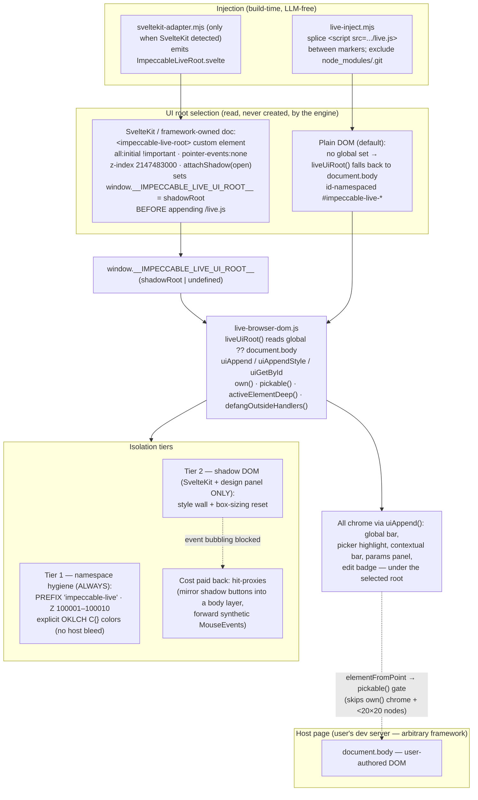
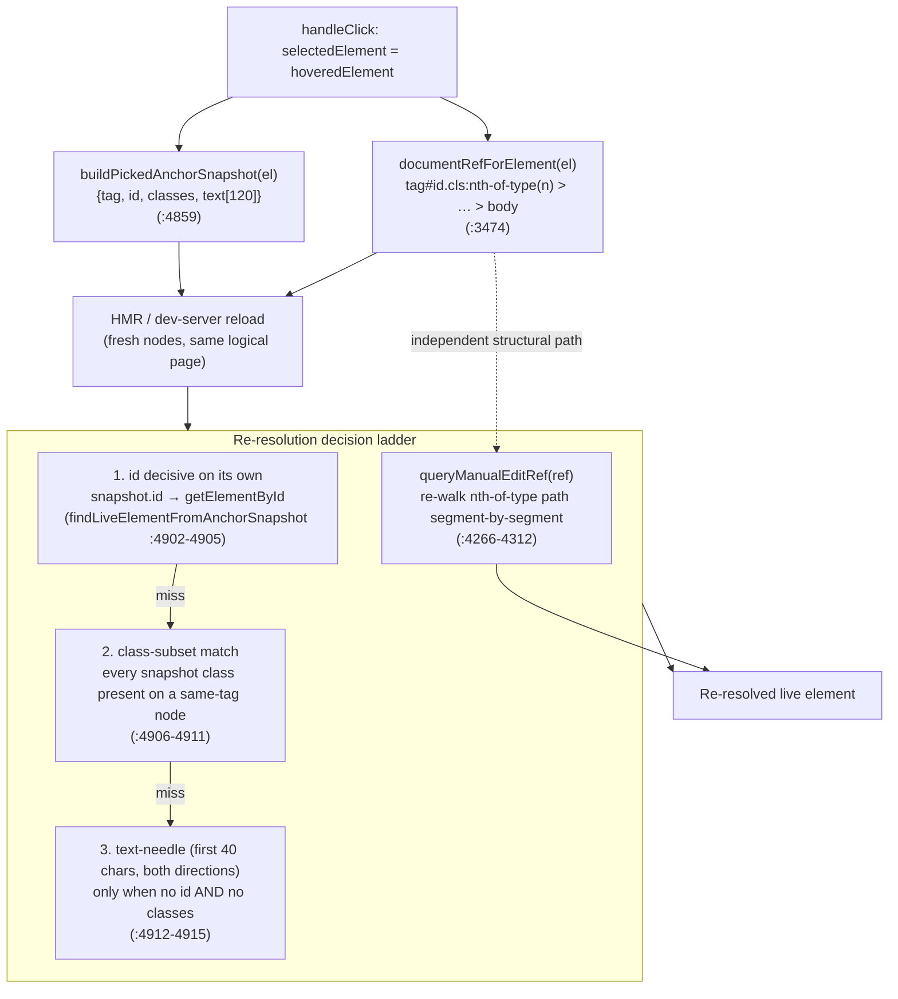

# Live mode deep dive 03d — the in-page overlay: isolation, picker, and self-stabilizing locators

Companion to [`03-live-mode.md`](03-live-mode.md); this sub-dive owns the in-page overlay runtime — how it lands on an arbitrary page, isolates itself, picks elements, and generates the durable selectors/locators that survive HMR, plus the variant-cycling UI.

All `file:line` references are into `../../source/` unless noted.

This is the sub-dive that maps almost 1:1 onto YoinkIt's `pick()` and `on(sel)`. Everything here transfers: the chrome-vs-host discriminator, the 20×20 pickability gate, the capture-phase picker, and above all the **dual locator** (durable structural ref + tolerant snapshot, re-resolved id-first) that answers YoinkIt's hardest open question: *captured selectors drift across reloads and viewports*. The overview ([`03-live-mode.md`](03-live-mode.md)) owns orientation; the server/transport and `/live.js` assembly belong to [`03a-server-transport-and-protocol.md`](03a-server-transport-and-protocol.md); what the agent *does* with a generate event lives in [`03c-variant-lifecycle-and-carbonize.md`](03c-variant-lifecycle-and-carbonize.md); editing mechanics in [`03e-manual-edit-round-trip.md`](03e-manual-edit-round-trip.md); Svelte source write-back in [`03f-framework-source-mapping.md`](03f-framework-source-mapping.md).

---

## File map

| File | Lines | Role |
|---|---|---|
| [`live-browser.js`](../../source/skill/scripts/live-browser.js) | 11,161 | THE injected overlay (IIFE). Owns: init guard, design tokens / Z-band / OKLCH colors, the picker (`handleMouseMove`/`handleClick`), the three selector flavors, the dual-locator re-resolution under HMR, `maybeWarnConditionalAncestor`, hit-proxies, footprint scrub, scroll-lock, variant cycling + param kinds. ~491 `function` declarations, ~all closure-private. |
| [`live-browser-dom.js`](../../source/skill/scripts/live-browser-dom.js) | 146 | Shared DOM helpers (factory `createLiveBrowserDomHelpers`): `own`, `pickable`, `liveUiRoot`/`uiAppend`/`uiGetById`, `activeElementDeep`, `defangOutsideHandlers`, `desc`, `makeFrozenAnchor`. |
| [`live-browser-session.js`](../../source/skill/scripts/live-browser-session.js) | 123 | localStorage session/scroll factory (`createLiveBrowserSessionState`). Used here only for `writeScrollY`/`readScrollY` (scroll-lock + resume position). |
| [`live/sveltekit-adapter.mjs`](../../source/skill/scripts/live/sveltekit-adapter.mjs) | 274 | Generates `ImpeccableLiveRoot.svelte`, which attaches the shadow root, sets `window.__IMPECCABLE_LIVE_UI_ROOT__` **before** appending the `/live.js` script, and patches `+layout.svelte`. |
| [`live-inject.mjs`](../../source/skill/scripts/live-inject.mjs) | 583 | CLI: deterministically splice/remove the `<script src=…/live.js>` block between marker comments; node_modules/.git hard-excludes; `.impeccable/live/*` ignore list. |
| [`detect-csp.mjs`](../../source/skill/scripts/detect-csp.mjs) | 198 | Grep-only CSP classifier (append-arrays / append-string / middleware / meta-tag / null) → drives a dev-only localhost patch proposal. |

> **Correction:** draft 04's file map lists `live-browser-dom.js` at **147** lines. It is **146** (verified `wc -l`). The same draft's "Diagram 1" cites `:77-81` for `liveUiRoot`; the function body is `:77-81` but the helper block (`uiAppend`/`uiAppendStyle`/`uiGetById`) runs `:83-106` — both correct.

---

## Mermaid 1 — host-page isolation & mount-strategy

The engine never *creates* its mount root. It **reads** a global the adapter may have set, and falls back to `document.body`. That one seam is what lets the same chrome code run namespaced-in-body on a plain page and inside an open shadow root on a framework-owned page, with no fork.



## Mermaid 2 — pick → identity → (HMR reload) → re-resolve

Picking captures *two* independent identities at once: a durable structural ref and a tolerant snapshot. After an HMR reload swaps every node, re-resolution walks a decision ladder that is **id-first** — because an id is unique and survives the build, while component tags and hashed CSS-module class names may not.



---

## Trace 1 — getting onto the page and guarding double-init

The script is served as `/live.js` with `window.__IMPECCABLE_TOKEN__`, `window.__IMPECCABLE_PORT__`, and `window.__IMPECCABLE_VOCAB__` prepended by the server (assembly owned by [`03a`](03a-server-transport-and-protocol.md)). The IIFE's very first act — **before** it even reads the token — is to claim a global init flag:

```js
// live-browser.js:12-27
(function () {
  'use strict';
  if (typeof window === 'undefined') return;

  // Guard against double-init. Bun's HTML loader may process the <script> tag
  // and create a bundled copy alongside the external load, or HMR may re-execute.
  // Check BEFORE reading token/port to catch all cases.
  if (window.__IMPECCABLE_LIVE_INIT__) return;
  window.__IMPECCABLE_LIVE_INIT__ = true;

  const TOKEN = window.__IMPECCABLE_TOKEN__;
  const PORT = window.__IMPECCABLE_PORT__;
  if (!TOKEN || !PORT) {
    window.__IMPECCABLE_LIVE_INIT__ = false; // reset so the real load can init
    return;
  }
```

The ordering is deliberate and load-bearing: a Bun HTML-loader can bundle a *copy* of the script alongside the external `<script src>` load, and HMR can re-execute the module. Setting the flag first means the second arrival bails immediately. The reset-on-missing-token path (`:25`) is the safety valve: a bundled copy that runs before the token prelude is present un-sets the flag so the real, prelude-carrying load can still initialize. The same reset fires on every dependency-missing branch (`live-browser-session.js` absent `:69`, `live-browser-dom.js` absent `:208`) and on teardown (`:9975`).

The injection itself is mechanical and LLM-free after first setup. `live-inject.mjs` builds a marker-wrapped block and splices it at a configured anchor:

```js
// live-inject.mjs:359-371
function buildTagBlock(syntax, port, filePath) {
  const open = commentOpen(syntax);
  const close = commentClose(syntax);
  // Astro processes <script> tags by default and rewrites src to its own
  // bundled URL. is:inline opts out so the literal external src survives.
  const isAstro = typeof filePath === 'string' && filePath.endsWith('.astro');
  const scriptAttrs = isAstro ? 'is:inline ' : '';
  return (
    open + ' ' + MARKER_OPEN_TEXT + ' ' + close + '\n' +
    '<script ' + scriptAttrs + 'src="http://localhost:' + port + '/live.js"></script>\n' +
    open + ' ' + MARKER_CLOSE_TEXT + ' ' + close + '\n'
  );
}
```

`MARKER_OPEN_TEXT = 'impeccable-live-start'` / `MARKER_CLOSE_TEXT = 'impeccable-live-end'` (`:28-29`) bracket the block so removal is a deterministic regex (indent-preserving). `insertTag` (`:390-415`) is careful about anchor semantics: `insertBefore` matches the **last** occurrence (anchors like `</body>` belong at the end, and the literal can appear earlier inside rendered doc-page code blocks), `insertAfter` matches the **first** (`<head>`/`<body>` open near the top). Two floors the user cannot override: `HARD_EXCLUDES = ['**/node_modules/**', '**/.git/**']` (`:60-63`) so the tag never lands in third-party code, and a frozen `LIVE_IGNORE_PATTERNS` list (`:33-53`) covering all `.impeccable/live/*` state plus the generated `src/lib/impeccable/ImpeccableLiveRoot.svelte`.

CSP is handled out-of-band so the `<script>` load + the overlay's `fetch`/`EventSource` to `localhost:PORT` aren't blocked. `detect-csp.mjs` is a depth-capped, 64KB-per-file grep walk (no network, no JS eval) that classifies the project's CSP into one of five shapes — named by *patch mechanism*, not framework:

```js
// detect-csp.mjs:146-162  (priority ladder)
// Priority: append-arrays > append-string > middleware > meta-tag.
// Structured patches are safer than string splices; runtime and HTML
// injection patches are less reliable and v1 doesn't auto-apply them.
if (hits.appendArrays.length > 0)  return { shape: 'append-arrays', signals: hits.appendArrays };
if (hits.appendString.length > 0)  return { shape: 'append-string', signals: hits.appendString };
if (hits.middleware.length > 0)    return { shape: 'middleware', signals: hits.middleware };
if (hits.metaTag.length > 0)       return { shape: 'meta-tag', signals: hits.metaTag };
return { shape: null, signals: [] };
```

`append-arrays` (SvelteKit `kit.csp.directives`, nuxt-security, monorepo helpers) and `append-string` (inline Next/Nuxt headers) are auto-patchable; `middleware`/`meta-tag` are detected but the agent proposes the patch by hand. The classifier output drives a user-facing consent prompt; the agent writes the dev-only localhost entry.

---

## Trace 2 — the two isolation tiers

### Tier 1 — namespace hygiene (always on)

Three mechanisms, all unconditional, that keep host CSS out and keep the picker off its own chrome:

```js
// live-browser.js:38-60  (excerpted)
const C = {
  brand:     'oklch(84% 0.19 80.46)',         // kinpaku gold
  brandHov:  'oklch(86% 0.07 84)',
  brandSoft: 'oklch(84% 0.19 80.46 / 0.18)',
  ink:       'oklch(4% 0.004 95)',
  ash:       'oklch(55% 0.018 82)',
  paper:     'oklch(98% 0.005 95 / 0.92)',
  // …
};
// z-index: detect overlays use 99999, so our UI must be above them
const Z = { highlight: 100001, bar: 100005, picker: 100007, toast: 100010 };
const PREFIX = 'impeccable-live';
```

- **PREFIX `impeccable-live`** — every chrome element id starts with it. This is the discriminator `own()` keys on.
- **Z-index band 100001–100010** — above the detector overlays (which sit at 99999, per the inline comment `:56`), and far below the SvelteKit host's `2147483000`.
- **Explicit OKLCH colors (`C`, `:38-48`)** — the chrome paints its own brand tokens rather than inheriting, so host CSS (a global `color`, a `* { font-family }`, a `text-transform: uppercase`) cannot bleed through unstyled text.

`own()` is the two-line chrome-vs-host gate, and `pickable()` adds the size floor:

```js
// live-browser-dom.js:23-33
function own(el) {
  return el && (el.id?.startsWith(prefix) || el.closest?.('[id^="' + prefix + '"]'));
}

function pickable(el) {
  if (!el || el.nodeType !== 1) return false;
  if (tagsToSkip.has(String(el.tagName || '').toLowerCase())) return false;
  if (own(el)) return false;
  const r = el.getBoundingClientRect();
  return r.width >= 20 && r.height >= 20;
}
```

`SKIP_TAGS` (`live-browser.js:81-83`) is `html/head/body/script/style/link/meta/noscript/br/wbr`. The 20×20px floor is a cheap, effective "is this a real, clickable thing" heuristic — it skips 1px spacer divs, zero-size wrappers, and tracking pixels without a tag allow-list.

### Tier 2 — shadow DOM (SvelteKit + design panel only)

The engine reads its mount root through `liveUiRoot()`, which **falls back to body**:

```js
// live-browser-dom.js:77-106
function liveUiRoot() {
  const uiRoot = root.__IMPECCABLE_LIVE_UI_ROOT__;
  if (uiRoot && typeof uiRoot.appendChild === 'function') return uiRoot;
  return doc.body;
}

function uiAppend(el) {
  liveUiRoot().appendChild(el);
  return el;
}

function uiAppendStyle(styleEl) {
  const uiRoot = liveUiRoot();
  if (uiRoot && uiRoot !== doc.body) uiRoot.appendChild(styleEl);
  else doc.head.appendChild(styleEl);
  return styleEl;
}

function uiGetById(id) {
  const uiRoot = liveUiRoot();
  if (uiRoot?.getElementById) {
    const found = uiRoot.getElementById(id);
    if (found) return found;
  }
  if (uiRoot?.querySelector) {
    const found = uiRoot.querySelector('#' + cssId(id));
    if (found) return found;
  }
  return doc.getElementById(id);
}
```

All chrome (the global bottom bar — pick/insert/detect/design/page-chat, see `LIVE_UI_SURFACES` `:99-109` — plus the picker highlight, contextual bar, params panel, edit badge) appends through `uiAppend`/`uiAppendStyle`, and looks itself up through `uiGetById`. So the same code runs in both modes; the only thing that changes is what `liveUiRoot()` returns.

The shadow root is created **by an injected Svelte component, not the engine**. `sveltekit-adapter.mjs` writes `ImpeccableLiveRoot.svelte`, mounted from `+layout.svelte` (the adapter refuses to touch `src/app.html`, which is a document template, not framework-owned chrome — `:1-8`):

```js
// live/sveltekit-adapter.mjs:161-194  (excerpted, inside onMount)
host.dataset.impeccableLiveAdapter = 'sveltekit';
host.style.setProperty('all', 'initial', 'important');
host.style.setProperty('display', 'block', 'important');
host.style.setProperty('position', 'fixed', 'important');
host.style.setProperty('top', '0', 'important');
host.style.setProperty('left', '0', 'important');
host.style.setProperty('width', '0', 'important');
host.style.setProperty('height', '0', 'important');
host.style.setProperty('z-index', '2147483000', 'important');
host.style.setProperty('pointer-events', 'none', 'important');

const root = host.shadowRoot || host.attachShadow({ mode: 'open' });
if (!root.querySelector('style[data-impeccable-live-reset]')) {
  const reset = document.createElement('style');
  reset.dataset.impeccableLiveReset = 'true';
  reset.textContent = ':host, :host *, * { box-sizing: border-box; }';
  root.appendChild(reset);
}

window.__IMPECCABLE_LIVE_ADAPTER__ = 'sveltekit';
window.__IMPECCABLE_LIVE_UI_ROOT__ = root;
window.__IMPECCABLE_LIVE_CHROME_MOUNT__ = { adapter: 'sveltekit', version: 1, host, root };

const script = document.createElement('script');
script.src = LIVE_URL;
script.async = true;
script.dataset.impeccableLiveScript = 'true';
document.head.appendChild(script);
```

Why a custom element + shadow root here specifically: in SvelteKit the framework owns `document.body` hydration, so a stray top-level `<div>` appended by the engine would be reconciled away. A custom element host with an open shadow root survives reconciliation, and `all:initial !important` + `pointer-events:none` make the 0×0 fixed host invisible and click-through (chrome inside re-enables pointer events per-control). The ordering — **set `__IMPECCABLE_LIVE_UI_ROOT__` before appending `/live.js`** (`:182` then `:190-194`) — is what guarantees the engine's `liveUiRoot()` finds the shadow root on its first append.

The engine detects this path with:

```js
// live-browser.js:4328-4331
function usesShadowChromeRoot() {
  const root = liveUiRoot();
  return root && root !== document.body && root.host && root.host.id === PREFIX + '-root';
}
```

The design-system panel *also* mounts its own nested shadow root regardless of adapter (`designHost.attachShadow({ mode:'open' })` `:10037`; a second per-tile shadow `:10811`) — a panel-local isolation independent of the page-level one.

> **Note (deliberate, pragmatic stance — not a limitation):** shadow DOM is used **sparingly**. Only SvelteKit (framework owns body) and the design panel get shadow roots; the default path is id-namespaced-in-body. The team judged that full-shadow isolation costs more — every host listener that relies on event bubbling breaks, forcing the hit-proxy re-plumbing below — than it's worth on most pages.

### The cost shadow DOM imposes: hit-proxies

Shadow DOM blocks event bubbling to host-page listeners. Where the edit badge lives inside a shadow root, its buttons would never receive the host-level pointer interactions the overlay relies on. The fix is a body-level mirror layer that forwards synthetic `MouseEvent`s into the shadow buttons — and it only runs `if (usesShadowChromeRoot())`:

```js
// live-browser.js:4385-4405
function proxyMouseEvent(type, source, target) {
  let event;
  try {
    event = new MouseEvent(type, {
      bubbles: type !== 'mouseenter' && type !== 'mouseleave',
      cancelable: true,
      composed: true,
      clientX: source.clientX, clientY: source.clientY,
      screenX: source.screenX, screenY: source.screenY,
      button: source.button || 0, buttons: source.buttons || 0,
      ctrlKey: source.ctrlKey, metaKey: source.metaKey,
      shiftKey: source.shiftKey, altKey: source.altKey,
    });
    target.dispatchEvent(event);
  } catch {}
}
```

`initEditBadgeHitProxies` (`:4337-4356`) builds a `pointer-events:none`, full-viewport container at `Z.toast + 1`; per-button proxies are positioned over the shadow button rects at `opacity:0.001` / `pointer-events:auto` (`styleEditBadgeProxy` `:4359-4383`), and `bindEditBadgeProxy` (`:4407-4436`) wires each proxy's `mouseenter/leave/down/up/click` to forward into the real shadow target (and `target.click()` on click). `editBadgeProxyTargets` (`:4438-4447`) enumerates only enabled, visible, non-zero-size buttons. `syncEditBadgeHitProxies` (`:4449+`) tears the whole layer down the instant `usesShadowChromeRoot()` is false. (The edit *badge* itself — the inline copy-editor it gates — belongs to [`03e`](03e-manual-edit-round-trip.md); here it is just the canonical example of the proxy pattern.)

Two more shadow-aware helpers round out the tier: `activeElementDeep()` pierces `shadowRoot.activeElement` chains for focus tracking (`live-browser-dom.js:108-112`), and `defangOutsideHandlers()` stops `pointerdown`/`mousedown`/`focusin` propagation so the host framework can't steal focus or clicks from chrome (`:114-123`) — applied to the design host at `:10054`.

---

## Trace 3 — the element picker (the `pick()` analog)

Picking is pure capture-phase interception on `document`. All three listeners attach with `useCapture = true` so the overlay sees events before the host page does:

```js
// live-browser.js:11127-11129  (inside init)
document.addEventListener('mousemove', handleMouseMove, true);
document.addEventListener('click', handleClick, true);
document.addEventListener('keydown', handleKeyDown, true);
```

> **Correction:** draft 04 cites these listeners at `:11126-11128`. They are at **:11127-11129** (one-line drift; `init`'s body grew).

`handleMouseMove` resolves the element under the cursor live, filters it, and moves the highlight — note it resolves by point, never by stored coordinates:

```js
// live-browser.js:6314-6319  (the pick branch)
if (state !== 'PICKING' || !pickActive) return;
const target = document.elementFromPoint(e.clientX, e.clientY);
if (!target || !pickable(target) || target === hoveredElement) return;
hoveredElement = target;
showHighlight(target);
```

`handleClick` commits the pick, transitions to `CONFIGURING`, and — critically — `preventDefault()/stopPropagation()` so the host page never sees the click that selected an element:

```js
// live-browser.js:6375-6394
if (state !== 'PICKING' || !pickActive) return;
if (own(e.target)) return;
if (pagePickSkipClick || pageHasHostTextSelection()) {
  pagePickSkipClick = false;
  return;
}
if (!hoveredElement || !pickable(hoveredElement)) return;
e.preventDefault();
e.stopPropagation();
selectedElement = hoveredElement;
setLiveState('CONFIGURING');
showHighlight(selectedElement);
clearAnnotations();
showAnnotOverlay(selectedElement);
showBar('configure');
renderEditBadge(hasTextRows(selectedElement) ? 'idle' : 'hidden');
startScrollTracking();
maybePrefetchPage();
maybeWarnConditionalAncestor(selectedElement);
```

The picker is entirely framework-agnostic: `elementFromPoint` + a size/own-chrome gate + a highlight box. No assumption about React/Svelte/Vue, no synthetic-event dependency, no library hook. That is exactly the contract YoinkIt's `pick()` needs.

### The ephemeral-ancestor warning

The last call in `handleClick`, `maybeWarnConditionalAncestor`, is a narrow, no-false-positive heuristic that warns when you pick *inside ephemeral state* a reload may hide. It is YoinkIt's "arming mid-transition captures nothing" failure mode, surfaced proactively:

```js
// live-browser.js:6408-6443  (excerpted)
function maybeWarnConditionalAncestor(el) {
  let node = el?.parentElement;
  let depth = 0;
  while (node && depth < 12) {
    // 1. Active dialog / modal
    if (node.getAttribute?.('role') === 'dialog'
        && node.getAttribute('aria-modal') === 'true') {
      showToast('Heads up: this element lives inside a dialog. If state resets during generation, you may need to re-open it.', 6000);
      return;
    }
    // 2. Common Radix / shadcn / headless-ui open-state attribute
    if (node.dataset?.state === 'open') {
      showToast('Heads up: this element lives inside an open panel. …', 6000);
      return;
    }
    // 3. Tab panel — only when ANOTHER tab is selected (tablist with >1 tab)
    if (node.getAttribute?.('role') === 'tabpanel') {
      const list = document.querySelector('[role="tablist"]');
      if (list && list.querySelectorAll('[role="tab"]').length > 1) {
        showToast('Heads up: this element lives in a tab panel. …', 6000);
        return;
      }
    }
    // 4. Collapsible: aria-controls trigger that is aria-expanded
    if (node.id) {
      const trigger = document.querySelector(`[aria-controls="${CSS.escape(node.id)}"][aria-expanded="true"]`);
      if (trigger) { showToast('Heads up: …re-expand it.', 6000); return; }
    }
    node = node.parentElement; depth += 1;
  }
}
```

The tabpanel branch is the tell of the design's care: a lone `role=tabpanel` with no sibling `tablist` is "just a static section in disguise" (`:6423-6425`) and is *not* warned — the check only fires when the page demonstrably has multiple tabs, i.e. when the panel really can become hidden. It climbs at most 12 ancestors and bails on the first hit.

---

## Trace 4 — three selector flavors for three jobs

A picked element is never stored by reference across reloads (HMR replaces the node). Three different identities are computed, each for a different consumer.

### (a) `documentRefForElement` — the durable structural path (the cross-reload key)

```js
// live-browser.js:3474-3527  (excerpted)
function documentRefForElement(el) {
  if (!el || el.nodeType !== 1) return null;
  const parts = [];
  let cur = el;
  while (cur && cur.nodeType === 1) {
    const tag = cur.tagName.toLowerCase();
    if (tag === 'html') break;
    if (tag === 'body') { parts.unshift('body'); break; }
    parts.unshift(documentRefSegment(cur));
    cur = cur.parentElement;
  }
  return parts.join('>') || null;
}

function documentRefSegment(el) {
  const tag = el.tagName.toLowerCase();
  return tag + documentRefIdSuffix(el) + documentRefClassSuffix(el) + ':nth-of-type(' + indexAmongSameTag(el) + ')';
}

function documentRefClassSuffix(el) {
  if (!el.classList || el.classList.length === 0) return '';
  const classes = [];
  for (const cls of el.classList) {
    if (!cls || cls.indexOf('impeccable-') === 0) continue;   // strip own chrome classes
    classes.push(normalizeDocumentRefToken(cls));
    if (classes.length === 2) break;                          // cap at 2 classes
  }
  return classes.length ? '.' + classes.join('.') : '';
}

function indexAmongSameTag(el) {
  const parent = el.parentElement;
  if (!parent) return 1;
  const tag = el.tagName.toLowerCase();
  let n = 0;
  for (const sib of parent.children) {
    if (sib.tagName.toLowerCase() === tag) { n++; if (sib === el) return n; }
  }
  return 1;
}
```

Every segment is `tag#id.cls1.cls2:nth-of-type(n)`, capped at 2 classes, `impeccable-` classes stripped, `>`-joined down to `body`. This is the *structural* identity — the buffer key (`03e`) and the second re-resolution strategy (`queryManualEditRef`). Worked example, an `<h2 class="card-title">` that is the 2nd `<h2>` inside a `<div class="card feature">` (itself the 3rd such div) inside a `<section>`:

```
section:nth-of-type(1)>div.card.feature:nth-of-type(3)>h2.card-title:nth-of-type(2)
```

### (b) `buildLocatorForLeaf` — climb to the nearest grep-able ancestor

For a bare leaf like `<em>` or a raw text node with no id/class, the source-side grep has nothing to match. This climbs to the nearest ancestor that has an id or class:

```js
// live-browser.js:3424-3448
function buildLocatorForLeaf(leafEl, fallbackEl) {
  if (leafEl && (leafEl.id || leafEl.classList.length > 0)) {
    return { tag: leafEl.tagName.toLowerCase(), elementId: leafEl.id || null, classes: [...leafEl.classList] };
  }
  let cur = leafEl?.parentElement;
  while (cur && cur !== document.body) {
    if (cur.id || cur.classList.length > 0) {
      return { tag: cur.tagName.toLowerCase(), elementId: cur.id || null, classes: [...cur.classList] };
    }
    cur = cur.parentElement;
  }
  return {
    tag: (fallbackEl || leafEl).tagName.toLowerCase(),
    elementId: (fallbackEl || leafEl).id || null,
    classes: [...((fallbackEl || leafEl).classList || [])],
  };
}
```

### (c) `elementPath` — the human breadcrumb

A read-only label for the selection pill tooltip, with `›` separators, depth 8, max 2 classes per segment:

```js
// live-browser.js:1381-1394
function elementPath(el, maxDepth = 8) {
  if (!el) return '';
  const parts = [];
  let node = el;
  while (node && node.nodeType === 1 && node !== document.body) {
    let part = node.tagName.toLowerCase();
    if (node.id) part += '#' + node.id;
    else if (node.classList?.length) part += '.' + [...node.classList].slice(0, 2).join('.');
    parts.unshift(part);
    node = node.parentElement;
    if (parts.length >= maxDepth) break;
  }
  return parts.join(' › ');
}
```

For the same `<h2>` above this renders `section › div.card.feature › h2.card-title`. It is shown to the human, never parsed back — distinct from the structural ref, which is machine-consumed.

---

## Trace 5 — the dual locator + re-resolution under HMR (the sharpest point)

This is the answer to YoinkIt's hardest open problem. Alongside the structural ref, the picker captures a lightweight, *tolerant* snapshot:

```js
// live-browser.js:4859-4867
function buildPickedAnchorSnapshot(el) {
  if (!el || el.nodeType !== 1) return null;
  return {
    tag: el.tagName,
    id: el.id || '',
    classes: [...el.classList],
    text: (el.textContent || '').trim().slice(0, 120),
  };
}
```

(Captured at pick time: `pickedAnchorSnapshot = buildPickedAnchorSnapshot(elForCapture)` `:6623`.) After an HMR reload, every node is fresh. Re-resolution from the snapshot is a tolerant, **id-first** ladder — and the comment in the sibling `elementMatchesOriginalMarkup` states the central insight outright:

```js
// live-browser.js:4879-4882
// A matching id is decisive on its own: ids are unique, while the source
// tag and class names may not survive the build (component tags, hashed
// CSS-module class names).
```

> **Correction:** draft 04 cites the id-decisive comment at `:4881-4882`. The comment block actually spans **:4879-4882** (the load-bearing first sentence — "A matching id is decisive on its own" — is on `:4879`). Cite the full range.

The snapshot resolver implements the ladder:

```js
// live-browser.js:4898-4919
function findLiveElementFromAnchorSnapshot(snapshot) {
  if (!snapshot) return null;
  const tag = String(snapshot.tag || '').toLowerCase();
  if (!tag) return null;
  if (snapshot.id) {                                    // 1. id decisive
    const byId = document.getElementById(snapshot.id);
    if (isUsableInjectionAnchor(byId)) return byId;
  }
  const classes = (snapshot.classes || []).filter((name) => /^[A-Za-z_-][\w-]*$/.test(name));
  const needle = (snapshot.text || '').trim();
  const candidates = [...document.getElementsByTagName(tag)];
  for (const c of candidates) {
    if (!isUsableInjectionAnchor(c)) continue;
    if (classes.length > 0 && !classes.every((name) => c.classList.contains(name))) continue;  // 2. class-subset
    if (!snapshot.id && classes.length === 0 && needle.length >= 4) {                            // 3. text-needle
      const text = (c.textContent || '').trim();
      if (!text.includes(needle.slice(0, 40)) && !(text.length >= 4 && needle.includes(text.slice(0, 40)))) continue;
    }
    return c;
  }
  return null;
}
```

The decision ladder, in order:

1. **id decisive (`:4902-4905`)** — if the snapshot has an id, resolve `getElementById` and return immediately if it's a usable anchor. Nothing else is consulted. Ids are unique and authored, so they survive the build where component tags and hashed module classes do not.
2. **class-subset (`:4911`)** — among same-tag candidates, require *every* snapshot class to be present (filtered to safe CSS identifiers, so a hashed `_a1b2c3` token that fails `/^[A-Za-z_-][\w-]*$/` is dropped rather than poisoning the match).
3. **text-needle, both directions (`:4912-4915`)** — only when there is no id *and* no usable class: compare the first 40 chars of the trimmed text content in both directions (live includes snapshot-needle, or snapshot includes live-needle), tolerant of truncation/reflow.

The `isUsableInjectionAnchor` gate (`:4869-4875`) keeps re-resolution from ever landing on chrome or on an existing variant wrapper: it requires the node be in `document.body`, have a parent, *not* `own()`, and *not* be inside `[data-impeccable-variants]`.

The **second, independent** strategy re-walks the structural ref segment-by-segment — used by the manual-edit revert/restore path and anywhere the structural ref is the only identity available:

```js
// live-browser.js:4266-4311  (excerpted)
function queryManualEditRef(ref) {
  if (!ref || typeof ref !== 'string') return null;
  const parts = ref.split('>').map((p) => p.trim()).filter(Boolean);
  let current = null;
  for (let index = 0; index < parts.length; index += 1) {
    const segment = parseManualEditRefSegment(parts[index]);
    if (!segment) return null;
    if (index === 0 && segment.tag === 'body') {
      current = document.body;
      if (!elementMatchesManualRefSegment(current, segment)) return null;
      continue;
    }
    const scope = current || document.body;
    const children = Array.from(scope.children || []);
    current = children.find((child) => elementMatchesManualRefSegment(child, segment)) || null;
    if (!current) return null;
  }
  return current;
}

function elementMatchesManualRefSegment(el, segment) {
  if (!el || !segment) return false;
  if (el.tagName.toLowerCase() !== segment.tag) return false;
  if (segment.id && el.id !== segment.id) return false;
  for (const cls of segment.classes) {
    if (!el.classList || !el.classList.contains(cls)) return false;
  }
  if (segment.nth && indexAmongSameTag(el) !== segment.nth) return false;
  return true;
}
```

Both strategies are then composed in `resolveLiveInjectionAnchor` (`:4961-4983`), which tries in order: the still-live `selectedElement`, then `findLiveElementFromAnchorSnapshot(pickedAnchorSnapshot)`, then a from-markup match — validating every candidate with `elementMatchesOriginalMarkup` — and finally a forgiving "≥1 class overlap on the original selected element" fallback (`:4974-4980`). The robustness is **redundancy + a strict id-first preference**, not one perfect selector.

---

## Trace 6 — footprint scrub of the overlay's own nodes

So the agent's evidence and any serialized context never contain the editor's own scaffolding, the overlay clones and scrubs before serializing. The footprint scrubber removes every runtime attribute the overlay added:

```js
// live-browser.js:867-895
function stripManualEditRuntimeState(root) {
  if (!root || root.nodeType !== 1) return;
  unwrapMixedContentTextNodes(root);
  const nodes = [root, ...root.querySelectorAll('[data-impeccable-editable], [data-impeccable-original-text], [data-impeccable-text-wrap]')];
  for (const node of nodes) {
    const runtimeEditable = node.hasAttribute('data-impeccable-editable')
      || node.hasAttribute('data-impeccable-original-text');
    node.removeAttribute('data-impeccable-editable');
    node.removeAttribute('data-impeccable-original-text');
    node.removeAttribute('data-impeccable-text-wrap');
    if (runtimeEditable) {
      node.removeAttribute('contenteditable');
      if (node.style) {
        node.style.userSelect = ''; node.style.cursor = '';
        node.style.outline = ''; node.style.webkitUserModify = '';
        if (!node.getAttribute('style')?.trim()) node.removeAttribute('style');
      }
    }
  }
}

function sanitizedContextOuterHTML(el, maxLength) {
  if (!el || !el.cloneNode) return '';
  const clone = el.cloneNode(true);
  stripManualEditRuntimeState(clone);
  return clone.outerHTML ? clone.outerHTML.slice(0, maxLength) : '';
}
```

> **Note (shared helper, split ownership):** `stripManualEditRuntimeState` is shared with [`03e`](03e-manual-edit-round-trip.md). This sub-dive covers it as **footprint-scrub-of-own-chrome** — guaranteeing the overlay's markers never leak into serialized output. `03e` covers the *editing*-side concern (sanitizing the manual-edit context an agent receives). It is invoked from `copyEditLeafContext` (`:3539`, 3000-char cap), `copyEditContainerContext` (`:3571`, 10000-char cap), and `selectedElement` cleanup at `:6609`.

This is the direct analog of "`dump()` must never emit capture-engine attributes." The picker also strips its own classes inside the structural ref (`documentRefClassSuffix` skips `impeccable-` `:3504`) and in every locator/leaf-context (`.filter((cls) => cls.indexOf('impeccable-') !== 0)` at `:3535`, `:3555`, `:3569`).

---

## Trace 7 — scroll-lock under HMR

When a variant swap or a DOM patch reflows the page, the viewport drifts. `startScrollLock` holds `scrollY` fixed across the churn so the picked element stays where the human left it. Two mechanisms: it disables `overflow-anchor` (so the browser's own scroll anchoring doesn't fight it), and a `MutationObserver` scoped to the session's variant wrapper re-pins on every mutation:

```js
// live-browser.js:5810-5852  (excerpted)
function startScrollLock(sessionId, initialTargetY) {
  stopScrollLock();
  scrollLockTargetY = typeof initialTargetY === 'number' && isFinite(initialTargetY)
    ? initialTargetY : window.scrollY;

  try { history.scrollRestoration = 'manual'; } catch {}

  const prevHtmlAnchor = document.documentElement.style.overflowAnchor;
  const prevBodyAnchor = document.body.style.overflowAnchor;
  document.documentElement.style.overflowAnchor = 'none';
  document.body.style.overflowAnchor = 'none';

  const correct = () => {
    scrollLockRaf = null;
    if (scrollLockTargetY == null) return;
    if (Math.abs(window.scrollY - scrollLockTargetY) < 0.5) return;
    window.scrollTo({ top: scrollLockTargetY, left: window.scrollX, behavior: 'instant' });
  };
  // …
  scrollLockObserver = new MutationObserver((mutations) => {
    for (const m of mutations) {
      if (m.target?.closest?.('[data-impeccable-variants="' + sessionId + '"]')) { schedule(); return; }
      for (const n of m.addedNodes) {
        if (n.nodeType === 1 && (n.matches?.('[data-impeccable-variants="' + sessionId + '"]')
            || n.querySelector?.('[data-impeccable-variants="' + sessionId + '"]'))) { schedule(); return; }
      }
    }
  });
  scrollLockObserver.observe(document.body, { childList: true, subtree: true });
```

It also gates user-gesture re-anchoring (a 250ms `USER_GESTURE_WINDOW_MS` window, `:5865`) so a programmatic smooth-scroll (browser reload-restore, a `scrollIntoView` from another script) doesn't accidentally move the lock target. The complementary half runs at *script-parse time*: the overlay reads the persisted `scrollY` and re-applies it on `fonts.ready` and `load`, because `scrollTo(y)` clamps to the current (short) `document.scrollHeight` until async fonts swap in and reflow:

```js
// live-browser.js:170-183
try {
  history.scrollRestoration = 'manual';
  const savedY = readScrollY();
  if (savedY != null) {
    const apply = () => { if (Math.abs(window.scrollY - savedY) > 0.5) window.scrollTo(0, savedY); };
    apply();
    if (document.fonts?.ready) document.fonts.ready.then(apply).catch(() => {});
    window.addEventListener('load', apply, { once: true });
  }
} catch {}
```

`readScrollY`/`writeScrollY` are deliberately stored under a key *separate* from session state (`scrollKey = sessionKey + '-scroll'`, `live-browser-session.js:17`) so a `saveSession` write can't clobber a carefully captured pre-reload `scrollY` (`:156-160`).

---

## Trace 8 — variant cycling UI & the three param kinds

Variants are sibling DOM subtrees under `[data-impeccable-variants="<sessionId>"]`, each tagged `[data-impeccable-variant=N]`; exactly one is shown.

```js
// live-browser.js:3000-3010
function getVisibleVariantEl() {
  if (!currentSessionId) return null;
  if (svelteComponentSession?.sessionId === currentSessionId) {
    return resolveSvelteComponentAnchor() || svelteComponentSession.wrapperEl || null;
  }
  const wrapper = document.querySelector('[data-impeccable-variants="' + currentSessionId + '"]');
  if (!wrapper) return null;
  return wrapper.querySelector('[data-impeccable-variant="' + visibleVariant + '"]');
}
```

```js
// live-browser.js:4771-4787
function isVariantShown(el) {
  if (!el) return false;
  if (el.hidden) return false;
  if (el.style?.display === 'none') return false;
  return true;
}
function setVariantShown(el, shown) {
  if (!el) return;
  if (shown) { el.removeAttribute('hidden'); el.style.display = ''; }
  else { el.setAttribute('hidden', ''); el.style.display = 'none'; }
}
```

`buildCyclingRow` (`:2532-...`) renders prev `←` / dots / counter / next `→`, then a **Tune** chip *only when the visible variant exposes params* (`const visParams = parseVariantParams(getVisibleVariantEl()); if (hasParams) …` `:2568-2608`), then Accept/Discard. The Tune chip toggles the params popover (`toggleTunePopover` `:4732-4736` → `openTunePopover` `:4738`).

Params are declared per variant in a `data-impeccable-params` JSON attribute — **except** for Svelte component variants, where JSON-with-braces breaks the compiler, so params live in a sidecar `params.json`:

```js
// live-browser.js:3012-3032
function parseVariantParams(variantEl) {
  // Svelte component variants can't carry a `data-impeccable-params` attribute:
  // the compiler reads `{` inside attribute values as expression delimiters, so
  // JSON-with-braces breaks the build. For that path the params live in a sidecar
  // params.json keyed by variant number, loaded into the session at mount time.
  if (svelteComponentSession?.sessionId === currentSessionId) {
    const byVariant = svelteComponentSession.paramsByVariant || {};
    const params = byVariant[String(visibleVariant)] || byVariant[visibleVariant];
    return Array.isArray(params) ? params : [];
  }
  if (!variantEl) return [];
  const raw = variantEl.getAttribute('data-impeccable-params');
  if (!raw) return [];
  try {
    const parsed = JSON.parse(raw);
    return Array.isArray(parsed) ? parsed : [];
  } catch (err) {
    console.warn('[impeccable] Invalid data-impeccable-params JSON:', err.message);
    return [];
  }
}
```

(The sidecar is loaded at mount: `loadSvelteComponentParams` reads `componentDir/params.json` `:5051`, stashed on the session at `:5358`.) Three param kinds, each applied **live** to the variant element — this is the verbatim apply:

```js
// live-browser.js:3034-3047
function applyParamValue(variantEl, param, value) {
  if (!variantEl) return;
  const attr = 'data-p-' + param.id;
  if (param.kind === 'range') {
    variantEl.style.setProperty('--p-' + param.id, String(value));
  } else if (param.kind === 'toggle') {
    const on = !!value;
    variantEl.style.setProperty('--p-' + param.id, on ? '1' : '0');
    if (on) variantEl.setAttribute(attr, 'on');
    else variantEl.removeAttribute(attr);
  } else if (param.kind === 'steps') {
    variantEl.setAttribute(attr, String(value));
  }
}
```

- **range** → CSS custom property `--p-{id}` set to the numeric value.
- **toggle** → `--p-{id}` set to `'1'`/`'0'` **and** a `data-p-{id}="on"` attribute toggled.
- **steps** → `data-p-{id}="<value>"` attribute (segmented string options).

`buildParamsPanel` (`:3064`) renders a native `<input type=range>`, a custom toggle track/knob, or a segmented button grid. Every change writes `paramsCurrentValues[id]`, calls `applyParamValue`, and `queueCheckpoint('param_changed')` (e.g. range input handler `:3097-3104`). The chosen values flow into the checkpoint so the agent learns the dialed knobs:

```js
// live-browser.js:6233-6249  (excerpted)
function checkpointPayload(reason) {
  return {
    type: 'checkpoint',
    id: currentSessionId,
    // …
    visibleVariant,
    paramValues: { ...paramsCurrentValues },
  };
}
```

The design language: the variant carries its own tunable surface as CSS vars/attrs the agent emitted, and the human dials them with **zero round-trips**, committing only on Accept (the carbonize/bake step is [`03c`](03c-variant-lifecycle-and-carbonize.md)).

---

## A point in YoinkIt's favor: no public API here

The overlay exposes **no clean public API** the way YoinkIt's `__cap.on/scan/dump` does. Of its ~491 `function` declarations, ~all are closure-private. The only deliberate surface is a debug/mount object:

```js
// live-browser.js:227-237  (excerpted)
window.__IMPECCABLE_LIVE_CHROME_CORE__ = {
  version: 1,
  adapter: window.__IMPECCABLE_LIVE_ADAPTER__ || 'dom',
  mountContract: LIVE_CHROME_MOUNT_CONTRACT,
  surfaces: LIVE_UI_SURFACES,
  componentIds: LIVE_UI_COMPONENT_IDS,
  root: liveUiRoot,
  append: uiAppend,
  appendStyle: uiAppendStyle,
  getById: uiGetById,
  activeElementDeep,
  // …
};
```

…plus a scatter of `__IMPECCABLE_*` globals (`__IMPECCABLE_LIVE_UI_ROOT__`, `__IMPECCABLE_LIVE_ADAPTER__`, `__IMPECCABLE_LIVE_CHROME_MOUNT__`, the `__IMPECCABLE_STEER_FOCUS_*` guards `:8435`/`:8497`). For an automation driver this is far less scriptable than `__cap`. YoinkIt's clean, four-verb engine API is the better model; this is a thing YoinkIt already does better, and the contrast is worth keeping in view when borrowing the internals below.

---

## Patterns worth stealing for YoinkIt

YoinkIt: a human points at elements on a live, real, visible page; the engine injects into arbitrary third-party pages; "drive by selector, never coordinates." This subsystem is the closest existing relative, and most of it transfers near-verbatim.

1. **STEAL — `own()` + 20×20 `pickable()` gate, straight into `pick()`.** The two-line discriminator + size floor (`live-browser-dom.js:23-33`) is exactly what `pick()` needs to ignore its own toolbar and skip non-targets, with no tag allow-list to maintain. Application: lift `own()`/`pickable()` verbatim, swap `prefix` for YoinkIt's chrome prefix.

2. **STEAL — capture-phase `mousemove` + `elementFromPoint` framework-agnostic picker.** `handleMouseMove`/`handleClick` (`:6314-6394`) attached with `useCapture=true` (`:11127-11129`), `preventDefault()/stopPropagation()` on the pick click so the host never sees it. No React/Svelte/synthetic-event dependency — the exact contract for injecting into arbitrary pages. Application: this is the body of `pick()`; resolve by point every frame, never store coordinates.

3. **STEAL (the headline) — dual locator: durable structural ref + tolerant snapshot, re-resolved id-first.** `documentRefForElement` (`tag#id.cls:nth-of-type(n)>…`, `:3474`) as the stable key, plus `{tag,id,classes,text[120]}` snapshot (`:4859`), re-resolved **id-decisive → class-subset → text-needle** (`:4898-4919`). This is the direct answer to *"captured selectors drift across reloads and viewports."* Application: `on(sel)` should store **both** identities and re-resolve live, treating **id as decisive on its own** (`:4879-4882`) — exactly what "drive by selector, never coordinates" demands, because a stored coordinate or a single brittle selector dies on the first reload, while id-first re-resolution survives the build. Bonus: filter snapshot classes through `/^[A-Za-z_-][\w-]*$/` so hashed module classes don't poison the class-subset match (`:4906`).

4. **ADAPT — adapter-selected mount root (one global + body fallback).** `liveUiRoot()` reads `window.__IMPECCABLE_LIVE_UI_ROOT__` and falls back to `document.body` (`live-browser-dom.js:77-81`); all chrome flows through `uiAppend`/`uiGetById`. Application: `__cap`'s `pick()` toolbar exposes the same seam — namespaced-in-body by default, but able to **escalate to a shadow root only on framework-owned pages** (SvelteKit-style) without forking the engine. Adapt, don't copy: YoinkIt's engine is dependency-free, so the global should be settable by a thin per-framework shim, mirroring `sveltekit-adapter.mjs` setting the root *before* the engine script loads (`:182`/`:190`).

5. **STEAL — footprint-scrub-own-chrome so `dump()`/`scan()` never measure the toolbar.** `stripManualEditRuntimeState`/`sanitizedContextOuterHTML` (`:867-895`) clone-and-scrub all engine attributes before serializing; the structural ref/locators also strip `impeccable-` classes (`:3504`, `:3535`). Application: `dump()` must guarantee no capture-engine attributes/markers/classes leak into the emitted spec, and `scan()` must skip `own()` nodes so the toolbar is never measured as a moving layer.

6. **ADAPT — `maybeWarnConditionalAncestor` ≈ YoinkIt's "arming mid-transition / ephemeral state" cousin.** The narrow, no-false-positive heuristic (`:6408-6443`) warns when picking inside a dialog/tabpanel/collapsible that a reload may hide. Application: YoinkIt's documented "arming mid-transition captures nothing" failure has a sibling — picking a layer that only exists in an open/hovered/expanded state. Adapt the ancestry scan to warn before a capture that would yield zero moved layers.

7. **STEAL — scroll-lock for "resolve element positions live."** `startScrollLock` (`:5810`) + the parse-time `fonts.ready`/`load` re-apply (`:170-183`) hold `scrollY` fixed through reflow. Application: useful whenever YoinkIt's real-browser capture mutates the page (or the page reflows on font swap) and the picked element must stay put; the `overflowAnchor:'none'` + scoped-MutationObserver pattern is the reusable core.

8. **ADAPT — param-surface-as-CSS-vars so the human fine-tunes before it sticks.** `applyParamValue` (`:3034`) lets a human dial range/steps/toggle knobs locally (CSS vars + data-attrs) with no round-trip, committing only on accept, and the chosen values ride the checkpoint (`:6248`). Application: a model for "let the human tweak the captured/recreated animation before it's written to spec" — expose tunable knobs as live CSS vars, fold the final values into the emitted spec.

9. **AVOID — full-shadow-DOM-by-reflex.** Impeccable deliberately uses shadow DOM *sparingly* (SvelteKit + design panel only) because full-shadow isolation forces the hit-proxy re-plumbing (`:4337-4436`) to restore event flow — a real, ongoing cost. Application: YoinkIt should default to namespaced-in-body (cheaper, no event re-plumbing) and only reach for a shadow root on framework-owned pages where a plain top-level node gets reconciled away. The hit-proxy (`proxyMouseEvent` `:4385`) is the fallback to keep on the shelf for *if* `__cap`'s UI ever must live in a shadow root, not the default.
