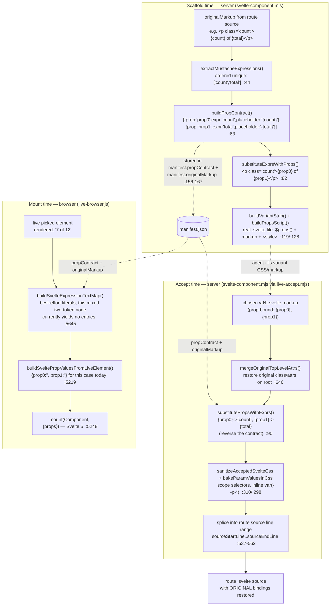
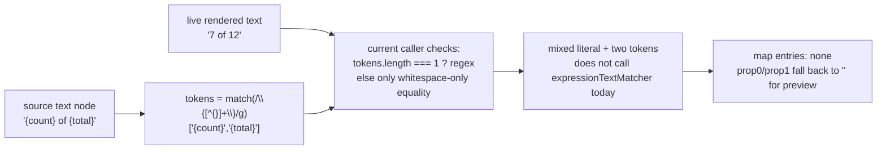

# Live mode deep dive 03f — framework source mapping: the expression↔source hard case

Companion to [`03-live-mode.md`](03-live-mode.md) — the shared "hard case" machinery both live-mode round-trips (the variant loop 03c and the manual-edit loop 03e) lean on when the page is a component framework. All `file:line` references are into `../../source/` unless noted.

This sub-dive owns the **bidirectional contract between live DOM and framework source** under Svelte/SvelteKit: extracting `{expr}` mustaches into a prop contract so each variant compiles as a real `.svelte` component, recovering which expression rendered which visible string, re-resolving a picked element to a fresh DOM node after HMR, and (on Accept) writing the chosen variant back into route source with the original bindings restored. The orientation for the whole live-mode subsystem lives in the overview; this file is the framework-adapter box of [`03-live-mode.md`](03-live-mode.md) Diagram 3, expanded.

---

## Why this is hard (the one fact that shapes everything)

When the host page is plain HTML or a framework that emits literal text, "drive by selector" plus a literal text match is enough to get from a live element back to source. Under a component framework that owns body hydration, **neither is enough**:

1. **The framework owns `document.body`.** In SvelteKit the layout renders the page; a stray top-level `<div>` you inject would be reconciled away. The adapter's own header says it plainly: *"SvelteKit must not be patched through src/app.html. That file is a document template, not framework-owned component chrome"* (`skill/scripts/live/sveltekit-adapter.mjs:4-7`). So the overlay must mount through a Svelte component (`ImpeccableLiveRoot.svelte`) and a shadow root — that mount/isolation story is **03d's** ([`03d-overlay-picker-and-locators.md`](03d-overlay-picker-and-locators.md)); this file picks up *after* the overlay exists.

2. **The rendered text is not the source text.** The source authored `{count} of {total}`; the live DOM shows `7 of 12`. A literal `indexOf("7 of 12")` against source finds nothing — the source contains `{count}`, `of`, `{total}`, and JS bindings, never the rendered string. To make a variant compile and later restore source, you need a prop contract for those expressions; literal recovery is best-effort preview support, not the correctness anchor.

3. **The build erases the identifiers you'd reach for.** Component tag names and hashed CSS-module class names don't survive compilation, so a re-resolution that keys on tag+class is brittle. The id, when present, is the one signal that survives — this is the "id is decisive" insight that 03d derives and this file reuses.

The Svelte component adapter (`svelte-component.mjs`) is where all three problems are answered with one artifact: a **prop contract** that is the bidirectional bridge. Mustaches go *out* to prop names at scaffold time (so each variant is a compilable component); prop names go *back* to the original mustaches at accept time (so route source keeps its bindings). The browser-side expression-text-map is the third leg — it recovers the literal values so the live preview renders correctly while the human cycles variants.

> **Correction:** the first-pass draft (the now-retired `04-live-mode-manual-edits.md`, §5 and Diagram 3) placed `buildSvelteExpressionTextMap` and the prop contract side by side as if they run at the same time. They do not. `buildPropContract` / `substituteExprsWithProps` run **server/agent-side at scaffold and accept time** (`svelte-component.mjs`); `buildSvelteExpressionTextMap` runs **browser-side at mount time** (`live-browser.js:5645`) to feed the live preview. Different processes, different moments. This file keeps them separate.

---

## File map

| File | Lines | Role |
|---|---|---|
| [`skill/scripts/live/svelte-component.mjs`](../../source/skill/scripts/live/svelte-component.mjs) | 826 | The prop-contract bridge. `extractMustacheExpressions`/`buildPropContract`/`substituteExprsWithProps` scaffold compilable variants; `inlineSvelteComponentAccept`/`substitutePropsWithExprs`/`mergeOriginalTopLevelAttrs` write the accepted variant back into route source with bindings restored; `sanitizeAcceptedSvelteCss`/`bakeParamValuesInCss` scope + bake the variant CSS. **Server/agent-side.** |
| [`skill/scripts/live-browser.js`](../../source/skill/scripts/live-browser.js) | 11,161 | `buildSvelteExpressionTextMap`/`expressionTextMatcher` recover literal values from rendered text (browser-side, mount time). `resolveLiveInjectionAnchor`/`elementMatchesOriginalMarkup`/`isUsableInjectionAnchor` re-resolve the picked element to a fresh node after HMR. `sourceHintForElement` reads the Astro `data-*-source` hint. |
| [`skill/scripts/live-manual-edit-evidence.mjs`](../../source/skill/scripts/live-manual-edit-evidence.mjs) | 363 | `analyzeSourceHint` resolves the Astro file+line window and **verifies** it contains `originalText` before trusting it. (Generic candidate search is 03e's; this file owns the hint-verification handoff.) |
| [`skill/scripts/live/sveltekit-adapter.mjs`](../../source/skill/scripts/live/sveltekit-adapter.mjs) | 274 | Context only: *why* SvelteKit needs a component-mounted shadow root (the framework owns body hydration; `app.html` is a document template). Shadow-root creation itself is 03d's. |
| [`skill/scripts/live-accept.mjs`](../../source/skill/scripts/live-accept.mjs) | — | The dispatch point: detects a Svelte manifest and delegates Accept into `inlineSvelteComponentAccept` (`:98`). The generic accept lifecycle is 03c's; this is the seam where it hands off to the Svelte-specific path. |

**Deferred (cross-linked, not re-derived here):**
- Overlay UI-root / shadow-root **mount + isolation** under SvelteKit → [`03d-overlay-picker-and-locators.md`](03d-overlay-picker-and-locators.md). 03d also owns the dual-locator/anchor-snapshot primitives `buildPickedAnchorSnapshot` (`live-browser.js:4859`) and `findLiveElementFromAnchorSnapshot` (`:4898`); this file *uses* them but does not re-derive them.
- Variant **accept lifecycle / carbonize** in general → [`03c-variant-lifecycle-and-carbonize.md`](03c-variant-lifecycle-and-carbonize.md). This file owns only the Svelte-specific accept path that 03c delegates to.
- Server-side **generic candidate search** (literal/object-key/locator/context) + buffer/verify/rollback → [`03e-manual-edit-round-trip.md`](03e-manual-edit-round-trip.md). This file owns the framework-expression hard case and the Astro sourceHint generation→verification handoff; 03e owns the generic search and the commit.

---

## The bidirectional contract (Mermaid)



The artifact that makes this bidirectional is **one object, the prop contract**, persisted in `manifest.json` at scaffold time and read back at both mount (browser) and accept (server). It carries `{prop, expr, placeholder}` per mustache, so `substituteExprsWithProps` (out) and `substitutePropsWithExprs` (back) are exact inverses over that list.

### The expression-text recovery flow (Mermaid)



`expressionTextMatcher` itself can turn the **static, literal fragments** of the source text (`""`, `" of "`, `""`) into anchored regex literals and replace each `{expr}` with a non-greedy capture group `(.*?)`. Whitespace in the static parts is relaxed (`\s+` → `\s*`). But the current caller only invokes that matcher for single-token nodes, so `{count} of {total}` currently yields no map entries. The binding round-trip still works because accept uses the persisted prop contract, not the recovered preview literals.

---

## Trace 1 — the mustache → prop → back-to-mustache round-trip

Worked example: route source contains `<p class="count">{count} of {total}</p>` on lines L..L. Here is the full lifecycle, each step verbatim from source.

### 1a. Extract ordered unique mustaches (scaffold, server)

```js
// svelte-component.mjs:44
export function extractMustacheExpressions(text) {
  const expressions = [];
  const seen = new Set();
  const lines = String(text || '').split('\n');
  for (const line of lines) {
    const trimmed = line.trim();
    if (trimmed.startsWith('<!--')) continue;           // skip comment lines
    let match;
    MUSTACHE_RE.lastIndex = 0;                          // MUSTACHE_RE = /\{([^{}]+)\}/g  :18
    while ((match = MUSTACHE_RE.exec(line)) !== null) {
      const expr = match[1].trim();
      if (!expr || seen.has(expr)) continue;            // ordered + deduped
      seen.add(expr);
      expressions.push(expr);
    }
  }
  return expressions;
}
```

For our markup this yields `['count', 'total']`. Note the regex `[^{}]+` deliberately refuses nested braces, so `{ {nested} }` would not match as one token — a pragmatic limit, since the inner-brace cases are object literals the contract can't name anyway.

### 1b. Build the prop contract + derive prop names (scaffold, server)

```js
// svelte-component.mjs:63
export function buildPropContract(expressions) {
  return expressions.map((expr, index) => {
    const derived = derivePropName(expr, index);
    return {
      prop: derived,
      expr,
      placeholder: `{${expr}}`,
    };
  });
}

// svelte-component.mjs:74
function derivePropName(expr, index) {
  const tail = expr.match(/(?:\.|\[)(\w+)\s*\]?$/);     // trailing .foo or [foo]
  if (tail && tail[1] && /^[A-Za-z_$][\w$]*$/.test(tail[1])) {
    return tail[1];
  }
  return `prop${index}`;                                // fallback: positional
}
```

The prop name is derived from the **trailing identifier** of the expression: `data.count` → `count`, `items[label]` → `label`, but a bare `count` has no `.`/`[` so it falls through to `prop0`. (For our example `{count}` and `{total}` are bare, so the derived names are `prop0` and `prop1`; an expression like `{order.count}` would derive the nicer `count`.) The point of the derived name is only that the variant component has a *stable, valid* prop identifier; the `expr` field is what carries the real binding for the round-trip back.

### 1c. Substitute mustaches → props (scaffold, server)

```js
// svelte-component.mjs:82
export function substituteExprsWithProps(markup, contract) {
  let out = String(markup || '');
  for (const entry of contract) {
    out = out.split(entry.placeholder).join(`{${entry.prop}}`);  // {count} -> {prop0}
  }
  return out;
}
```

`split(placeholder).join(...)` is a literal global replace with no regex escaping hazard. After this, the markup is `<p class="count">{prop0} of {prop1}</p>` — every mustache now references a declared prop, so it compiles.

### 1d. Wrap into a real `.svelte` component with `$props()` (scaffold, server)

```js
// svelte-component.mjs:119
function buildPropsScript(contract) {
  if (contract.length === 0) {
    return '<script>\n  /** @type {Record<string, never>} */\n  let {} = $props();\n</script>\n';
  }
  const names = contract.map((c) => c.prop).join(', ');
  const typeFields = contract.map((c) => `    ${c.prop}: string;`).join('\n');
  return `<script>\n  /** @type {{\n${typeFields}\n  }} */\n  let { ${names} } = $props();\n</script>\n`;
}

// svelte-component.mjs:128
function buildVariantStub(variantNum, originalWithProps, contract) {
  const propsComment = contract.length > 0
    ? `\n<!-- Props: ${contract.map((c) => `${c.prop} <- {${c.expr}}`).join(', ')} -->\n`
    : '';
  return `${buildPropsScript(contract)}${propsComment}${originalWithProps.trim()}\n\n<style>\n  /* Variant ${variantNum}: add scoped CSS here */\n</style>\n`;
}
```

Each `v{N}.svelte` is now a standalone component: a `$props()` destructure typed `string` for each prop, a human-readable `<!-- Props: prop0 <- {count}, prop1 <- {total} -->` breadcrumb, the prop-bound markup, and an empty `<style>` for the agent to fill. The whole session — `propContract`, `originalMarkup`, `sourceStartLine`/`sourceEndLine`, `componentDir` — is persisted to `manifest.json` (`:156-169`), which is what makes the round-trip reversible later.

> **Note (the params.json sidecar).** Variants cannot carry a `data-impeccable-params` attribute the way plain-DOM variants do, because *the Svelte compiler reads `{` inside an attribute value as an expression delimiter, so JSON-with-braces breaks the build.* The browser confirms this rationale verbatim: `live-browser.js:3013-3016`. The CSS-authoring contract restates it as a hard rule (`svelte-component.mjs:822`): "Svelte parses `{` in attribute values as an expression, so `data-impeccable-params` with JSON breaks the build; use `componentDir/params.json` instead." Params therefore live in a sidecar `params.json` keyed by variant number, loaded into the session at mount time (`live-browser.js:3017-3020`).

### 1e. Accept — reverse the contract back into route source (server)

The accept path is reached via `live-accept.mjs:98`, which detects a Svelte manifest and delegates (this is the 03c → 03f handoff):

```js
// live-accept.mjs:96
let result;
try {
  result = inlineSvelteComponentAccept(
    svelteComponentManifest,
    variantNum,
    paramValues,
    process.cwd(),
  );
} catch (err) { /* ...records error result... */ }
```

Inside the accept (`svelte-component.mjs:500`), the chosen variant's markup is read, the original root attributes merged back, and the prop names reversed to the original expressions:

```js
// svelte-component.mjs:528
const rootTag = matchOpeningTag(markup)?.tag || 'div';
const contract = manifest.propContract || [];
const mergedMarkup = mergeOriginalTopLevelAttrs(markup, manifest.originalMarkup || '');
const restoredMarkup = substitutePropsWithExprs(mergedMarkup, contract)
  .split('\n')
  .map((line) => line.trimEnd());
```

`substitutePropsWithExprs` is the exact inverse of step 1c:

```js
// svelte-component.mjs:90
export function substitutePropsWithExprs(markup, contract) {
  let out = String(markup || '');
  for (const entry of contract) {
    out = out.split(`{${entry.prop}}`).join(`{${entry.expr}}`);   // {prop0} -> {count}
  }
  return out;
}
```

So `<p ...>{prop0} of {prop1}</p>` becomes `<p ...>{count} of {total}</p>` again — the route source gets the chosen variant's styling/structure with its **original live bindings restored**, never the frozen literal `7 of 12`. The variant is then spliced into the exact source line range the manifest recorded:

```js
// svelte-component.mjs:535
const sourceContent = fs.readFileSync(sourceFile, 'utf-8');
const sourceLines = sourceContent.split('\n');
const start = Number(manifest.sourceStartLine) - 1;
const end = Number(manifest.sourceEndLine) - 1;
// ...bounds-checked...
const indent = sourceLines[start].match(/^(\s*)/)?.[1] || '';   // preserve indentation
const indentedMarkup = restoredMarkup.map((line) =>
  line.trim() === '' ? '' : indent + line.trimStart());
let newLines = [
  ...sourceLines.slice(0, start),
  ...indentedMarkup,
  ...sourceLines.slice(end + 1),
];
```

The merge-back of root attributes (`mergeOriginalTopLevelAttrs`, `:646`) handles a subtle case: the agent's variant may have dropped or rewritten the root element's `class`/attributes, but the original markup carried framework-meaningful attributes (event bindings, `class:` directives, `bind:`, etc.). It re-parses both opening tags, **unions the class lists** (`mergeStaticClassAttr`, `:713` — variant classes first, then any original ones not already present, deduped), and re-adds any original non-class attribute the variant is missing (`:669-672`). It bails out entirely if the two root tags differ (`:650`) — it will not graft a `<div>`'s attributes onto a `<section>`.

> **Correction:** the draft Diagram 3 box labels the accept step `inlineSvelteComponentAccept → substitutePropsWithExprs → write variant back into route source` with no mention of carbonize. Verified: the Svelte accept **always sets `carbonize: false`** (it is hardcoded in `resultBase`, `svelte-component.mjs:508`). The variants live in `node_modules/.impeccable-live/<id>/` during preview, but accept reads the chosen `v{N}.svelte`, restores the original bindings, splices the result into the route source line range, and removes the temp session (`removeSvelteComponentSession`, `:566`). Carbonize is false because no plain-DOM variant wrapper/carbonize marker remains in source after that splice. The carbonize-cleanup TODO branch in `live-accept.mjs:114` is therefore dead for this path. This is a real divergence from the plain-DOM accept that 03c documents.

---

## Trace 2 — the expression-text-map regex alignment (browser, mount time)

This is the leg that lets the **live preview render correctly** while the human cycles variants: the variant component needs real prop values (`{count:'7', total:'12'}`), and the only place those literals exist is the rendered DOM.

```js
// live-browser.js:5645
function buildSvelteExpressionTextMap(sourceOriginal, liveOriginal) {
  const map = new Map();
  if (!sourceOriginal || !liveOriginal) return map;

  const sourceNodes = collectTextNodes(sourceOriginal)
    .filter((node) => /\{[^{}]+\}/.test(node.nodeValue || ''));   // only text nodes with mustaches
  const liveTexts = collectTextNodes(liveOriginal)
    .map((node) => normalizePreviewText(node.nodeValue || ''))    // collapse whitespace
    .filter(Boolean);
  let liveIndex = 0;

  for (const sourceNode of sourceNodes) {
    const sourceText = sourceNode.nodeValue || '';
    const tokens = sourceText.match(/\{[^{}]+\}/g) || [];
    if (tokens.length === 0) continue;

    const liveText = liveTexts[liveIndex++] || '';                // align by document order
    if (!liveText) continue;

    if (tokens.length === 1) {
      const token = tokens[0];
      const normalizedSource = normalizePreviewText(sourceText);
      if (normalizedSource === token) {                           // text node IS just '{count}'
        map.set(token, liveText);                                 // whole live text is the value
        continue;
      }

      const match = liveText.match(expressionTextMatcher(sourceText, [token]));
      if (match && match[1]) map.set(token, match[1].trim());     // recover via anchored group
      continue;
    }

    if (normalizePreviewText(sourceText) === tokens.join(' ')) {  // '{a} {b}' with only spaces
      for (const token of tokens) {
        const tokenLiveText = liveTexts[liveIndex - 1] || '';
        if (tokenLiveText) map.set(token, tokenLiveText);
      }
    }
  }

  return map;
}
```

`sourceOriginal` here is the **parsed `manifest.originalMarkup`** (the source-shaped DOM, mustaches intact), and `liveOriginal` is the **live picked element** (rendered text). Note the alignment strategy: it walks both DOMs' text nodes in document order and pairs the *i*-th source-with-mustache node against the next live text node. This is positional, not structural — fragile if the framework reorders text nodes, but for the common case (text nodes appear in the same order they were authored) it's correct and cheap.

The three branches handle a subset of realistic shapes:
- **`{count}` alone** in a text node → the entire rendered text *is* the value; no regex needed.
- **`{count} of {total}` mixed with literals** → currently recovers nothing, because the matcher is only called inside the single-token branch.
- **`{a} {b}` separated only by whitespace** → handled coarsely: every token from that source text node receives the same paired live text string.

The matcher itself:

```js
// live-browser.js:5688
function expressionTextMatcher(sourceText, tokens) {
  let pattern = '^';
  let cursor = 0;
  for (const token of tokens) {
    const index = sourceText.indexOf(token, cursor);
    if (index === -1) continue;
    pattern += escapeRegExp(sourceText.slice(cursor, index)).replace(/\s+/g, '\\s*');  // static fragment, relaxed WS
    pattern += '(.*?)';                                                                 // the expression -> capture
    cursor = index + token.length;
  }
  pattern += escapeRegExp(sourceText.slice(cursor)).replace(/\s+/g, '\\s*') + '$';      // trailing static fragment
  return new RegExp(pattern);
}
```

For `sourceText = "{count} of {total}"` and `tokens = ["{count}"]` (the single-token call site at `:5672`), the static slices are `""` (before `{count}`) and `" of {total}"` (after). So the pattern is `^(.*?) of \{total\}$` against `7 of 12` — which would *fail*, because the live text has no literal `{total}`. That is exactly why the single-token branch only fires when there's one token in the node; the genuinely multi-mustache `{count} of {total}` node hits the `tokens.length === 1` guard with `tokens = ['{count}', '{total}']`... no — `match(/\{[^{}]+\}/g)` returns **both** tokens, so `tokens.length === 2`, and the node falls to the final branch which only handles the pure-`{a} {b}` whitespace-separated case (`normalizePreviewText(sourceText) === tokens.join(' ')`, i.e. `"{count} of {total}"` vs `"{count} {total}"` — not equal). 

> **Correction / sharp edge:** so for a node like `{count} of {total}` (two mustaches around a literal `of`), `buildSvelteExpressionTextMap` recovers **nothing** — neither the single-token branch nor the join-equality branch matches, and `expressionTextMatcher` is only ever called with a *single* token (`:5672`). The recovered map is therefore best-effort: it nails `{count}`-alone nodes and handles `{a} {b}` whitespace-only pairs coarsely by assigning the same paired live string to every token from that node; it silently yields empty for mixed literal-plus-multi-mustache nodes. Downstream, `buildSveltePropValuesFromLiveElement` (`:5219`) tolerates the gap — `values[entry.prop] = map.get(token) || ''` — so an unrecovered binding just renders an empty string in the preview; the *binding itself is still restored correctly on accept* via the contract, since accept does not depend on the recovered literal at all. The literal recovery is a **preview convenience, not a correctness requirement**. The worked `{count} of {total}` example is the case the matcher is *designed* around (the static `" of "` becomes `\s*of\s*`), but the current single-token call path doesn't actually exercise the multi-token branch of `expressionTextMatcher` — a latent capability the matcher has but the caller doesn't reach. Treat the matcher's multi-token power as the *intent*, and the single-token call site as the *current reality*.

The map feeds prop values straight into the Svelte 5 `mount()`:

```js
// live-browser.js:5219
function buildSveltePropValuesFromLiveElement(liveEl, manifest) {
  const contract = manifest?.propContract || [];
  const values = {};
  if (!liveEl || contract.length === 0) return values;
  const sourceOriginal = parseOriginalMarkupElement(manifest.originalMarkup || '');
  if (!sourceOriginal) return values;
  const map = buildSvelteExpressionTextMap(sourceOriginal, liveEl);
  for (const entry of contract) {
    const token = '{' + entry.expr + '}';
    values[entry.prop] = map.get(token) || '';        // tolerant: missing -> ''
  }
  return values;
}
```

— and the session stashes those values for the live mount (`:5415` `propValues: buildSveltePropValuesFromLiveElement(detachedOriginal, manifest)`), which then drives `runtime.mount(Component, { target, props })` at `:5248`.

---

## Trace 3 — `resolveLiveInjectionAnchor`'s decision ladder (browser, after HMR)

When the variant wrapper must be injected (variant loop) or re-injected after the page reloaded, the picked element is gone — HMR replaced the node. The original DOM reference is dead; what survives is `manifest.originalMarkup` (a source-shaped HTML string). Re-resolution walks a tolerant ladder, every rung validated against that original markup.

The two guard/predicate helpers first:

```js
// live-browser.js:4869
function isUsableInjectionAnchor(el) {
  return !!el
    && el.parentElement
    && document.body.contains(el)
    && !own(el)                                  // not overlay chrome (03d's own())
    && !el.closest?.('[data-impeccable-variants]');  // not inside an existing variant wrapper
}
```

`isUsableInjectionAnchor` is the *guard against re-anchoring onto chrome or onto an already-injected variant wrapper* — without it, a second injection cycle could nest a wrapper inside a wrapper, or grab a piece of the overlay UI.

```js
// live-browser.js:4877
function elementMatchesOriginalMarkup(liveEl, origContent) {
  if (!isUsableInjectionAnchor(liveEl) || !origContent) return false;
  // A matching id is decisive on its own: ids are unique, while the source
  // tag and class names may not survive the build (component tags, hashed
  // CSS-module class names).
  if (origContent.id) return liveEl.id === origContent.id;        // <- id short-circuit
  if (liveEl.tagName !== origContent.tagName) return false;

  const origClasses = normalizeElementClassName(origContent).split(/\s+/).filter(Boolean)
    .filter((name) => /^[A-Za-z_-][\w-]*$/.test(name));           // drop non-identifier class tokens
  if (origClasses.length > 0 && !origClasses.every((name) => liveEl.classList.contains(name))) return false;

  const origText = (origContent.textContent || '').trim();
  if (origClasses.length === 0 && origText.length >= 4) {         // no class to match on -> use text
    const liveText = (liveEl.textContent || '').trim();
    const needle = origText.slice(0, Math.min(40, origText.length));
    if (!liveText.includes(needle) && !(liveText.length >= 4 && origText.includes(liveText.slice(0, 40)))) return false;
  }
  return true;
}
```

The comment at `:4879-4881` is the single decisive insight reused from 03d: **a matching id ends the comparison immediately** — no tag check, no class check, no text check — because ids are unique and survive the build, whereas component tag names and hashed CSS-module classes do not. When there's no id, it degrades: tag must match, then *all* well-formed original classes must be present, and if there are *no* classes to lean on it falls back to a bidirectional 40-char text-prefix containment check. That fallback is literal prefix/substring matching only; it does not understand mustaches, so pure `{count}` vs `7` fails and even `Count: {count}` vs `Count: 7` only works if enough literal prefix overlaps.

The ladder that uses both:

```js
// live-browser.js:4961
function resolveLiveInjectionAnchor(originalMarkup) {
  const origContent = parseOriginalMarkupElement(originalMarkup);
  if (!origContent) return null;

  const attempts = [
    selectedElement,                                              // 1. still-live picked ref
    findLiveElementFromAnchorSnapshot(pickedAnchorSnapshot),      // 2. 03d snapshot (id->class->text)
    findLiveElementForOriginalMarkup(originalMarkup),             // 3. fresh DOM scan by markup
  ];
  for (const candidate of attempts) {
    if (elementMatchesOriginalMarkup(candidate, origContent)) return candidate;   // each VALIDATED
  }

  // Forgiving last resort: the original selectedElement with >=1 class overlap.
  if (isUsableInjectionAnchor(selectedElement) && selectedElement.tagName === origContent.tagName) {
    const origClasses = normalizeElementClassName(origContent).split(/\s+/).filter(Boolean);
    if (origContent.id && selectedElement.id === origContent.id) return selectedElement;
    if (origClasses.length === 0) return selectedElement;
    const overlap = origClasses.filter((name) => selectedElement.classList.contains(name));
    if (overlap.length >= 1) return selectedElement;              // >=1 class is enough here
  }

  return null;
}
```

The decision ladder, top to bottom:

1. **`selectedElement`** — if the picked reference is still attached and still matches the original markup (it survives a soft re-render), use it.
2. **`findLiveElementFromAnchorSnapshot(pickedAnchorSnapshot)`** — 03d's lightweight `{tag,id,classes,text[120]}` snapshot, re-resolved id-first → all-classes → text-needle (`:4898`).
3. **`findLiveElementForOriginalMarkup`** — a fresh `getElementsByTagName(tag)` scan: id lookup, then *every-class* subset match, then the **shortest** element whose text-prefix overlaps (`:4944-4955`, `bestLen` tracking prefers the tightest container).

Each of rungs 1-3 must pass `elementMatchesOriginalMarkup` — the same validator — so a stale or wrong candidate is rejected and the ladder continues. Only if all three validated attempts fail does it drop to the **forgiving ≥1-class-overlap fallback** on the *original* `selectedElement`: same tag, and either matching id, or no original classes, or at least one class in common. This last rung deliberately loosens "all classes" (rung 1's standard) to "any one class," accepting that HMR may have dropped or renamed some classes while keeping the element identity intact. It is the calculated risk: better to re-anchor onto the very-probably-right element than to fail the whole variant injection.

The call sites confirm the stakes: when the variant wrapper needs to replace the live element, `injectVariantsFromSource` calls `resolveLiveInjectionAnchor(origContent.outerHTML)` (`:5551`) and, on `null`, enters a `MutationObserver`-backed recovery wait (`enterRecoveryWaitingForAnchor`, `:5554`) that retries when the anchor or wrapper reappears (`waitForVariantAnchorAndRetry`, `:4997`). So a failed re-resolution is not fatal — it suspends and waits for the DOM to settle, exactly the "settle → arm → trigger → wait" discipline the YoinkIt CLAUDE.md preaches, applied to HMR instead of a transition.

---

## Trace 4 — the Astro sourceHint generation → verification handoff to 03e

This is the precise-when-available path. Unlike the Svelte expression machinery (which is universal to any `.svelte` route), the source-location *hint* exists **only for Astro today**, because Astro's dev server stamps `data-astro-source-file` / `data-astro-source-loc` onto rendered elements. Reading them is a one-function browser-side extraction:

```js
// live-browser.js:3450
function sourceHintForElement(el) {
  if (!el || !el.getAttribute) return null;
  const file = el.getAttribute('data-astro-source-file');
  const loc = el.getAttribute('data-astro-source-loc');
  if (file || loc) {
    const parsed = parseSourceLoc(loc);                  // "12:5" -> {line:12, column:5}
    return {
      file: file || '',
      loc: loc || '',
      line: parsed.line,
      column: parsed.column,
    };
  }
  return null;
}
```

> **Correction (boundary):** the original audit's Surprises note ("Source hints are Astro-specific") is correct and worth promoting from a footnote to a *design boundary*. `sourceHintForElement` reads **only** `data-astro-source-file`/`-loc` (`:3452-3453`); no React `__source`, no Vite-plugin-emitted hint, no Svelte equivalent. For every non-Astro framework — including the Svelte path this whole sub-dive is about — there is **no precise source hint**, and DOM→source falls entirely back to the generic candidate search (literal/object-key/locator/context, 03e's) plus, for Svelte variants, the `manifest.sourceStartLine`/`sourceEndLine` recorded at wrap time. A Vite plugin or a React `__source` reader would broaden this precise-hint path to those frameworks; that's the current edge, not a permanent one.

The hint is attached to the op on Save (`live-browser.js:3611` `const sourceHint = sourceHintForElement(row.el)`), travels in the buffer, and is **verified, never trusted**, server-side. The verification is where 03f hands off to 03e — `analyzeSourceHint` resolves the file, runs three safety gates, reads a ±4-line window, and crucially **checks the window actually contains `originalText`** before declaring the hint usable:

```js
// live-manual-edit-evidence.mjs:156
function analyzeSourceHint(op, cwd) {
  const hint = normalizeSourceHint(op.sourceHint);
  if (!hint.file) return null;
  const file = path.resolve(cwd, hint.file);
  const relativeFile = path.relative(cwd, file);
  if (!isPathInsideOrEqual(cwd, file)) {
    return { ...hint, status: 'outside_cwd', relativeFile: hint.file };   // gate 1: escapes project
  }
  if (!fs.existsSync(file)) {
    return { ...hint, status: 'file_missing', relativeFile };             // gate 2: stale path
  }
  if (isGeneratedFile(file, { cwd })) {
    return { ...hint, status: 'generated', relativeFile };                // gate 3: don't edit build output
  }

  const content = fs.readFileSync(file, 'utf-8');
  const lines = content.split('\n');
  const line = hint.line || 1;
  const start = Math.max(0, line - 4);
  const end = Math.min(lines.length, line + 3);
  const windowText = lines.slice(start, end).join('\n');
  const containsOriginalText = typeof op.originalText === 'string' && windowText.includes(op.originalText);
  return {
    ...hint,
    status: containsOriginalText ? 'ok' : 'text_not_found_near_hint',     // the verification
    relativeFile,
    excerpt: lines.slice(start, end).map((text, index) => ({
      line: start + index + 1,
      text: text.slice(0, 240),
    })),
  };
}
```

The `status` field is the whole point: `ok` means "the Astro hint pointed at a real, in-project, non-generated source line whose ±4-line window contains the original text" — a *verified* precise location the agent can edit with confidence. Any of `outside_cwd` / `file_missing` / `generated` / `text_not_found_near_hint` tells the agent the hint is **unreliable, fall back to the generic candidates**. (`normalizeSourceHint`, `:189`, tolerates either `{line, column}` or a packed `loc:"12:5"` string — the same shape `sourceHintForElement` emits.) The agent prompt's evidence-priority order (`sourceHint.file+line → candidates → object-key/text/context → DOM refs`) is what consumes this status; that prioritization and the generic candidate search are 03e's territory. 03f's contribution is the *generation* (browser, Astro-only) and the *verification gate* (server) that decides whether the precise hint earns its top-priority slot.

---

## How the four mechanisms compose

| Mechanism | Process | When | Direction | What it produces |
|---|---|---|---|---|
| `extractMustacheExpressions` → `buildPropContract` → `substituteExprsWithProps` | server/agent | wrap/scaffold | source → variant | compilable `v{N}.svelte` + persisted `propContract` |
| `buildSvelteExpressionTextMap` / `expressionTextMatcher` | browser | mount (preview) | live → literal | `{count:'7'}` prop values for the live mount |
| `resolveLiveInjectionAnchor` (+ `elementMatchesOriginalMarkup`) | browser | inject / after HMR | markup → live node | the fresh DOM element to wrap/replace |
| `sourceHintForElement` → `analyzeSourceHint` | browser then server | save then commit | live → verified source loc | a `status:'ok'` precise location, or a fallback signal |

The first three are universal to any `.svelte` route; the fourth is Astro-only. The prop contract is the spine: scaffold serializes it into the manifest, the browser reads it to mount the preview with recovered literals, and accept reads it again to reverse the substitution. Lose the contract and the round-trip can't restore bindings — which is precisely why it's persisted to `manifest.json` (`:163` `propContract: contract`) and re-read at accept (`:529` `const contract = manifest.propContract || []`) rather than recomputed.

---

## Patterns worth stealing for YoinkIt

YoinkIt emits a **spec, not code**, and never edits the user's source. That single fact splits this subsystem cleanly: the *write-back-to-source mechanic does not transfer*, but the *DOM↔expression mapping and anchor re-resolution* are the real prizes. Tagging honestly:

### STEAL — anchor re-resolution validated against original markup, id-decisive short-circuit + forgiving class-overlap fallback

`resolveLiveInjectionAnchor` (`:4961`) + `elementMatchesOriginalMarkup` (`:4877`) is exactly the answer to YoinkIt's "captured selectors drift across reloads/HMR" problem, and the CLAUDE.md "drive by selector, never coordinates" rule. The structure to lift into `on(sel)`'s re-resolution:

1. Store an **original-markup snapshot** (or the source-shaped outerHTML) alongside the selector, not just the live node reference.
2. Re-resolve through a **validated ladder**: still-live ref → lightweight `{tag,id,classes,text}` snapshot → fresh DOM scan, each rung passing the *same* `elementMatchesOriginalMarkup` validator so a wrong candidate is rejected and the ladder continues.
3. Make a **matching id short-circuit the comparison** (`:4882`): ids survive framework builds; hashed CSS-module classes and component tag names do not. This is the single sharpest, most portable insight here.
4. End with a **forgiving ≥1-class-overlap fallback** (`:4978-4979`) so a re-render that dropped/renamed some classes still re-anchors instead of failing the capture.

For YoinkIt this means: after HMR or a transition replaces the tracked node, `on(sel)` can re-find the *same logical element* without re-prompting the user — directly serving "resolve element positions live" and "arming mid-transition captures nothing" (a failed re-resolve should *suspend and retry on a MutationObserver*, as Impeccable does at `:5554`, not abort the capture).

### ADAPT — literal↔expression text recovery (record "this string is dynamic, bound to X", not the frozen literal)

`buildSvelteExpressionTextMap` (`:5645`) + `expressionTextMatcher` (`:5688`) show the intended mechanism for recovering *which expression produced which visible substring*, but the current caller only recovers simple cases such as `{count}` alone and misses mixed multi-token text like `{count} of {total}`. For YoinkIt's hard problem — "the live DOM shows rendered text/values, but the source authored them via framework expressions" — this is still the mechanism to adapt, **inverted**, with honest confidence levels. Impeccable recovers literals only as preview convenience; YoinkIt should recover or annotate the *binding* when evidence supports it. When a captured element's visible text was rendered from an expression, the emitted spec should record **"this layer's text is dynamic, bound to `{count}`"** rather than freezing the literal `7` into the spec (which would mislead the recreating agent into hardcoding `7`). The technique to adapt:
- Anchor the **static fragments** of any available source/template text as regex literals with relaxed whitespace (`\s+` → `\s*`), and treat the gaps as the dynamic bindings — that's `expressionTextMatcher`'s whole trick.
- Where no source text is available (YoinkIt often only has the live DOM), the weaker signal is: a text node whose value matches a numeric/short/variable shape, or that changes between captures, is *probably* an expression — flag it as dynamic in the spec rather than asserting the literal.
- Note Impeccable's own honesty here (Trace 2 correction): the recovery is **best-effort** and tolerant of misses (`map.get(token) || ''`). YoinkIt should likewise degrade gracefully — an unrecovered binding becomes "text (possibly dynamic)" in the spec, not a hard failure.

### ADAPT — the Astro `data-*-source` hint as a precise-when-available, degrade-when-absent signal

`sourceHintForElement` (`:3450`) reads Astro's `data-astro-source-file`/`-loc`; `analyzeSourceHint` (`live-manual-edit-evidence.mjs:156`) **verifies** the pointed-at window actually contains the original text before trusting it. YoinkIt never edits source, but it *does* benefit from knowing an element's source provenance: if a framework dev server exposes a source-location attribute, YoinkIt could **read it when present and record it in the spec as a high-confidence anchor** ("this layer originates at `Foo.astro:12`"), giving the recreating agent a precise target — and **fall back to selector + text identity when absent** (every non-Astro framework today). The two design lessons to adapt: (a) the precise hint is *framework-specific and currently Astro-only* — build the reader as an optional, pluggable source of provenance, not a hard dependency; (b) **always verify the hint** (does the source window contain what the DOM shows?) before trusting it, because a stale/wrong hint is worse than none. A Vite plugin or React `__source` reader would broaden this — note it as the current boundary, not a wall.

### AVOID — writing variants back into route source

`inlineSvelteComponentAccept` (`:500`) — the whole splice-into-`sourceStartLine..sourceEndLine`, `mergeOriginalTopLevelAttrs`, `sanitizeAcceptedSvelteCss`, `bakeParamValuesInCss` apparatus — is an **AVOID for YoinkIt**, because YoinkIt emits a spec and does not own the user's source. The reverse-the-contract idea (`substitutePropsWithExprs`) is elegant, but its entire purpose is *mutating the user's `.svelte` file*, which YoinkIt structurally never does. **Steal the mapping (mustache↔prop, literal↔expression), not the write-back.** The redundancy-plus-verification *principle* behind it — many weak signals, reconcile, then independently *prove* the result rather than trusting it — does transfer, and is the right posture for YoinkIt's own "did the capture actually identify the right element / the right dynamic binding" checks; but the file-editing machinery itself stays on Impeccable's side of the inversion.

### Bonus — the params.json sidecar lesson (one line)

The Svelte compiler treats `{` in an attribute value as an expression delimiter, so JSON-with-braces in `data-impeccable-params` breaks the build (`live-browser.js:3013-3016`, `svelte-component.mjs:822`); Impeccable moved params to a sidecar file. If YoinkIt ever stashes capture metadata in `data-*` attributes on a framework page, **JSON-with-braces will break Svelte (and confuse JSX)** — prefer a sidecar / out-of-band store over inline brace-bearing attributes.
