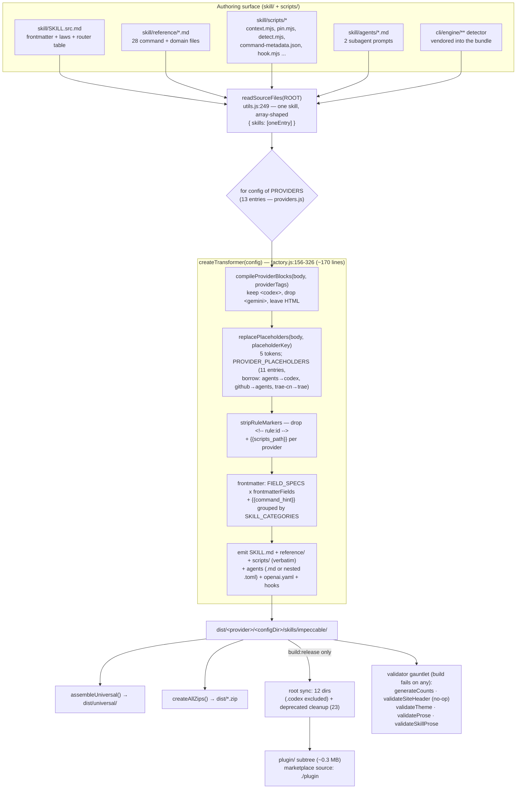
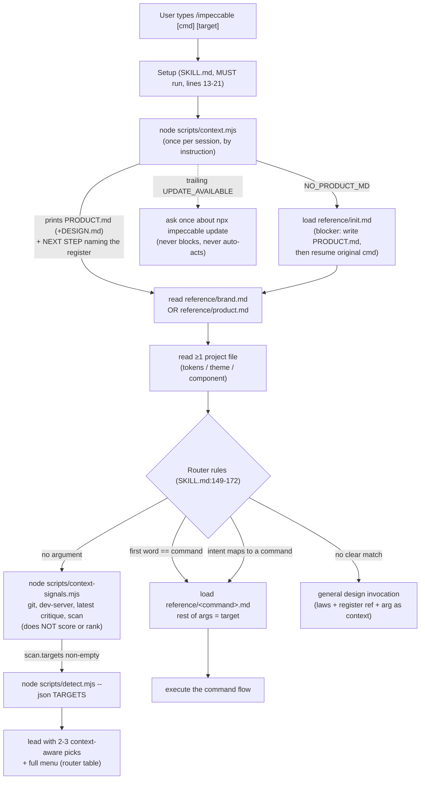

# Impeccable Skill System, Multi-Harness Distribution & Build — Deep Technical Audit

**Subsystem:** the single authored skill (`skill/SKILL.src.md` + a `reference/`
tree + `scripts/` + `agents/`) that compiles **deterministically to 13 agent
harnesses**; the runtime one-skill / N-commands router and context-gathering
protocol; the command-metadata single source of truth; the `pin` shim; and the
install / distribution model.

**Audience:** the YoinkIt team. YoinkIt ships its capability as an agent skill
with **hand-maintained per-harness copies** — `skill/codex/` and `skill/claude/`
kept in sync by hand (AGENTS.md). Impeccable solves exactly that problem: *one*
authoring surface, compiled to every harness by a pure-Node build. Everything
below is framed toward what YoinkIt can lift to delete that duplication.

Of the five subsystems in this audit, this is the one with **no "opposite
physics" caveat**. The collaboration loop and the capture engine must be adapted
through YoinkIt's spec-not-code / real-browser inversion; the build and
distribution machine transfers almost wholesale. It is the highest-value,
lowest-risk takeaway in the whole audit. All paths are under `source/`.

> **Deep dives.** This document is the overview. Five companions go to the floor
> on the parts a fresh agent would reason about or rebuild into YoinkIt, and they
> correct a number of first-draft inaccuracies (flagged inline and collected
> below):
>
> - [`04a-single-source-transform.md`](04a-single-source-transform.md): the one-source → N-harness transform — `readSourceFiles`, the `SKILL.src.md` naming dodge, the 5-stage body pipeline, the 13-row `PROVIDERS` table, the 11-entry `PROVIDER_PLACEHOLDERS` borrow chain, conditional blocks, and the `{{command_hint}}` grouping.
> - [`04b-build-pipeline-and-validators.md`](04b-build-pipeline-and-validators.md): build orchestration — the default-vs-release sync split, the root sync, the deprecated-skill cleanup, the slim plugin subtree, the three-path agents emission, the hook-manifest builders, and the validator gauntlet.
> - [`04c-runtime-routing-and-context.md`](04c-runtime-routing-and-context.md): the runtime router and the context protocol — `SKILL.src.md` anatomy, the consolidation rationale, `context.mjs` (the boot contract), and `context-signals.mjs` (the no-argument gatherer).
> - [`04d-command-metadata-and-pin.md`](04d-command-metadata-and-pin.md): command metadata as SSOT, build-enforced counts, and the `pin` shim — plus the honest nuance that command *identity* is replicated across ~6 hand-synced lists.
> - [`04e-distribution-and-install.md`](04e-distribution-and-install.md): the distribution and install model — committed generated output, the `npx impeccable` CLI, the producer/consumer lockfile, the Claude Code plugin, and the 13/12/10 provider-count reconciliation.
>
> **First-draft corrections (re-verified against `source/`).** The retired draft
> (former report 05) was directionally right but stale in specifics. The
> load-bearing fixes:
>
> - `PROVIDER_PLACEHOLDERS` has **11** entries, not 13; `github` and `trae-cn` are absent and borrow via `placeholderProvider`. The borrow chain is **`agents`→`codex`, `github`→`agents`, `trae-cn`→`trae`** — so the `.agents` build emits "GPT… / `$`" and the `.github` build emits "the model… / `/`". (04a)
> - **Cursor emits 3 frontmatter fields** (`license`, `compatibility`, `metadata`); only Gemini and Codex emit none. The draft said "Cursor/Gemini/Codex emit none." (04a)
> - **`{{command_hint}}` groups by `SKILL_CATEGORIES`** (create/evaluate/refine/simplify/harden/system), *not* the router-table labels (Build/Evaluate/Refine/Enhance/Fix/Iterate). The draft's example argument-hint was wrong. (04a)
> - **`IMPECCABLE_SUB_COMMANDS` is a curated 19**, not all 23 — `{{available_commands}}` deliberately omits `craft`/`init`/`extract`/`live`. (04a, 04d)
> - The deprecated-skill cleanup list is **23 names** (6 pre-v3.0 shims + 17 consolidated), not "17"; the validator gauntlet is **5** late checks (the draft missed `validateSiteHeader`, which is now a **no-op stub**) plus an earlier frontmatter gate. (04b)
> - **13 build targets → 12 committed/installable dirs**: `.codex` is excluded from the skills sync (only its `hooks.json` is committed). (04b, 04e)
> - The Codex subagent ships via the nested `CODEX_SKILL_PROVIDERS` branch; `buildAgentFile`'s `codex-toml` path is **dead code**. Only 11 of 13 providers have named-export spies. (04b)
> - `command-metadata.json` is strictly `{description, argumentHint}` — **no `category` key** — and `VALID_COMMANDS` in `pin.mjs` is the **full 23** (not a pinnable subset). (04d)

---

## File map

Click-through index (relative to `source/`). Line counts re-checked at audit time.

| File | Lines | Role |
|---|---|---|
| **Authoring surface (edit these)** | | |
| [`skill/SKILL.src.md`](../../source/skill/SKILL.src.md) | 186 | The single source: frontmatter, shared design laws, the router table, routing rules, pin/hooks prose |
| [`skill/reference/*.md`](../../source/skill/reference/) | 28 files | One `<command>.md` per command + domain refs (`brand`, `product`, `interaction-design`, `codex`, `hooks`) — lazy-loaded |
| [`skill/scripts/command-metadata.json`](../../source/skill/scripts/command-metadata.json) | 94 | SSOT for each command's `{description, argumentHint}` |
| [`skill/scripts/context.mjs`](../../source/skill/scripts/context.mjs) | 280 | Boot script: prints `PRODUCT.md`/`DESIGN.md` or `NO_PRODUCT_MD`; piggybacks the update check |
| [`skill/scripts/context-signals.mjs`](../../source/skill/scripts/context-signals.mjs) | 225 | No-argument signal gatherer (git, dev-server probe, latest critique, scan targets) |
| [`skill/scripts/detect.mjs`](../../source/skill/scripts/detect.mjs) | 21 | Thin loader for the bundled anti-pattern detector |
| [`skill/scripts/pin.mjs`](../../source/skill/scripts/pin.mjs) | 214 | Creates/removes `/audit`-style standalone shortcut shims across harness dirs |
| [`skill/agents/*.md`](../../source/skill/agents/) | 2 files | Canonical subagent prompts (`impeccable-asset-producer`, `impeccable-manual-edit-applier`) with `providers:` gating |
| **Build / transformer system** | | |
| [`scripts/build.js`](../../source/scripts/build.js) | 794 | Orchestrator: read source → transform per provider → universal → zip → API/CF → (release) root sync + plugin subtree → validators |
| [`scripts/lib/transformers/factory.js`](../../source/scripts/lib/transformers/factory.js) | 326 | `createTransformer(config)` (156-326): the per-skill emit loop. **The 170-line core.** |
| [`scripts/lib/transformers/providers.js`](../../source/scripts/lib/transformers/providers.js) | 122 | The `PROVIDERS` config map (13 entries) |
| [`scripts/lib/transformers/hooks.js`](../../source/scripts/lib/transformers/hooks.js) | 120 | Per-harness hook-manifest builders (Claude `settings.json`, Codex/Cursor `hooks.json`, plugin `hooks/hooks.json`) |
| [`scripts/lib/transformers/index.js`](../../source/scripts/lib/transformers/index.js) | 19 | Named exports kept as test spy targets (load-bearing despite looking dead) |
| [`scripts/lib/utils.js`](../../source/scripts/lib/utils.js) | 852 | `readSourceFiles`, `PROVIDER_PLACEHOLDERS`, `replacePlaceholders`, `compileProviderBlocks`, `stripRuleMarkers`, YAML emit, per-project artifact stash/restore |
| [`scripts/lib/sub-pages-data.js`](../../source/scripts/lib/sub-pages-data.js) | 334 | `SKILL_CATEGORIES` + `CATEGORY_ORDER` (drive `{{command_hint}}` and the site) |
| **Distribution / install** | | |
| [`docs/HARNESSES.md`](../../source/docs/HARNESSES.md) | 107 | The capability matrix (frontmatter support, hook surface, skill dir per harness) that *informs* `providers.js` by hand |
| [`.claude-plugin/plugin.json`](../../source/.claude-plugin/plugin.json) + [`marketplace.json`](../../source/.claude-plugin/marketplace.json) | 12 + 26 | Claude Code plugin/marketplace manifests (`source: "./plugin"`) |
| [`cli/bin/cli.js`](../../source/cli/bin/cli.js) + [`cli/bin/commands/skills.mjs`](../../source/cli/bin/commands/skills.mjs) | 80 + 1818 | `npx impeccable install/link/update/check` |
| [`cli/lib/download-providers.js`](../../source/cli/lib/download-providers.js) | 25 | Provider→config-dir map for website downloads (10 + universal) |
| [`skills-lock.json`](../../source/skills-lock.json) | 4 | `vercel-labs/skills` lockfile — empty; Impeccable is the *producer*, not a consumer |
| Generated outputs (committed, do not hand-edit) | — | `.claude/`, `.cursor/`, `.agents/`, … (12 dirs at root) — read by `npx skills` directly from GitHub |

---

## Diagram 1 — the build pipeline (one source → N provider outputs)



The transform `T1→T5` is the whole secret: everything provider-specific is **data
in two tables** (`PROVIDERS` = how to emit, `PROVIDER_PLACEHOLDERS` = who the
provider is); the code path is identical for all 13 targets. Full trace in
[`04a`](04a-single-source-transform.md); the orchestration around it in
[`04b`](04b-build-pipeline-and-validators.md).

---

## Diagram 2 — runtime skill-routing flow



Key invariant: **context is loaded by Setup before the router runs**, so
sub-commands "don't re-invoke `/impeccable`" (`SKILL.src.md:168`). The boot is
once-per-session **by instruction, not a lock file** — the model is told *"If
you've already seen its output in this conversation, do not re-run it"*
(`SKILL.src.md:17`). Full anatomy in [`04c`](04c-runtime-routing-and-context.md).

---

## 1. The one-skill / N-commands router architecture

There is exactly **one** user-invocable skill, `impeccable`, with **23 commands**
beneath it. The router is a plain markdown table in
[`SKILL.src.md:121-145`](../../source/skill/SKILL.src.md) (header at 121-122, 23
data rows at 123-145):

```
| Command | Category | Description | Reference |
|---|---|---|---|
| `craft [feature]` | Build | Shape, then build a feature end-to-end | [reference/craft.md](reference/craft.md) |
| `audit [target]`  | Evaluate | Technical quality checks (a11y, perf, responsive) | [reference/audit.md](reference/audit.md) |
...
```

Plus three management commands declared in prose: `pin`, `unpin`, `hooks`
(`SKILL.src.md:147`). **Routing is 4 rules** (`SKILL.src.md:149-172`): (1) no
argument → run `context-signals.mjs`, reason over the JSON, lead with 2-3
context-aware picks; (2) first word matches a command → load that reference, rest
is the target; (3) first word maps to a command by intent → load it; (4) no
match → general design invocation.

**Why they consolidated.** Before v3.0 each command was its own top-level skill.
The project's own `CLAUDE.md` is blunt: *"Do not add standalone skills unless
there's a strong reason. The consolidation was deliberate: the `/` menu pollution
problem is real and gets worse as users install more plugins."* The build still
carries the gravestones — `build.js:684-697` lists **23** deprecated standalone
skills and deletes them from local harness dirs on every release sync
([`04b`](04b-build-pipeline-and-validators.md)). Impeccable traded 23 entries in
the harness's `/` menu for **one** (`/impeccable`) plus an in-skill router,
accepting one extra hop (`/impeccable audit` vs `/audit`) to avoid polluting a
shared namespace. The `pin` shim ([`04d`](04d-command-metadata-and-pin.md)) is the
escape hatch for power users who want a command back at top level.

This is **progressive disclosure done structurally**: the ~24 KB `SKILL.src.md`
(shared design laws + router table) is always in context, but each per-command
flow (`reference/*.md`, ~100-200 lines) is loaded *only* for the command invoked.
The router table is the manifest; the reference files are the lazy chunks. Full
treatment in [`04c`](04c-runtime-routing-and-context.md).

---

## 2. The single-source → multi-provider build

This is the payoff. One `skill/SKILL.src.md` + `reference/` + `scripts/` +
`agents/` becomes 13 provider directories through `createTransformer`
([`factory.js:156-326`](../../source/scripts/lib/transformers/factory.js), 170
lines) over two data tables.

**Source ingestion.** `readSourceFiles`
([`utils.js:249`](../../source/scripts/lib/utils.js)) reads exactly one skill from
`skill/SKILL.src.md` and returns a `{ skills: [oneEntry] }` shape (array-shaped
for backwards compatibility with the old multi-skill build). It collects all
`reference/*.md`, all of `skill/scripts/**` (minus per-project artifacts, plus the
vendored detector bundle), and the `agents/`.

**The `SKILL.src.md` naming dodge — the single most important one-line lesson.**
The source is `SKILL.src.md`, *not* `SKILL.md`, on purpose
([`utils.js:242-247`](../../source/scripts/lib/utils.js)): `vercel-labs/skills`
discovers a skill by finding a literal `SKILL.md` and copies that directory
verbatim. If `skill/SKILL.md` existed, `npx skills` would install the *uncompiled*
source — unresolved `{{placeholders}}`, no vendored detector. Hiding it as
`.src.md` forces the installer to fall through to a compiled harness dir.

**The 5-stage body pipeline** (`factory.js:229-236`), in order:

1. `compileProviderBlocks(body, providerTags)` — harness-conditional blocks.
2. `replacePlaceholders(body, placeholderKey, …)` — token substitution.
3. `stripRuleMarkers(body)` — remove `<!-- rule:id -->` eval anchors.
4. `body.replace(/\{\{scripts_path\}\}/g, …)` — provider-aware script path.
5. `bodyTransform(body, skill)` if the config defines one.

**The two tables.** Per-provider variation is *data*, not code:

- **`PROVIDERS`** ([`providers.js`](../../source/scripts/lib/transformers/providers.js), 13 entries) — `configDir`, `providerTags`, `frontmatterFields`, `placeholderProvider`, `agentFormat`, `emitHooks`, `writeOpenAIMetadata`, `includeVersion`.
- **`PROVIDER_PLACEHOLDERS`** ([`utils.js:564-631`](../../source/scripts/lib/utils.js), **11 entries**) — `{ model, config_file, ask_instruction, command_prefix }`. `github` and `trae-cn` are absent: they borrow another provider's table via `placeholderProvider`. The full chain is **`agents`→`codex`, `github`→`agents`, `trae-cn`→`trae`**, which is why the `.agents` build (Codex's repo skills) says *"GPT is capable…"* with a `$` prefix while `.github` (Copilot) says *"the model is capable…"* with `/`.

`replacePlaceholders` ([`utils.js:714`](../../source/scripts/lib/utils.js))
substitutes five tokens (`{{model}}`, `{{config_file}}`, `{{ask_instruction}}`,
`{{command_prefix}}`, `{{available_commands}}`) and rewrites `/skillname` →
`$skillname` for non-`/` providers. `{{scripts_path}}` and `{{command_hint}}` are
resolved separately in the factory. Verified output differences:

| Token | Claude Code | Codex (`.agents`) | Cursor | Gemini | GitHub Copilot |
|---|---|---|---|---|---|
| `{{model}}` | `Claude` | `GPT` | `the model` | `Gemini` | `the model` |
| `{{command_prefix}}` | `/` | `$` | `/` | `/` | `/` |
| `{{config_file}}` | `CLAUDE.md` | `AGENTS.md` | `.cursorrules` | `GEMINI.md` | `.github/copilot-instructions.md` |
| frontmatter fields | 6 (full) | 0 | **3** (`license`,`compatibility`,`metadata`) | 0 | 5 |

**Harness-conditional blocks.** `compileProviderBlocks`
([`utils.js:662`](../../source/scripts/lib/utils.js)) is the second axis:
standalone `<tag>…</tag>` blocks (tag must be on its own line) where the tag is in
`PROVIDER_BLOCK_TAGS`. Matching tags keep their body and drop the wrapper;
non-matching blocks are deleted; unknown tags (real HTML/markdown) are left alone.
`SKILL.src.md` uses three: a `<codex>` typography ceiling (42-45), a `<gemini>`
"never animate `` on hover" ban (69-71), and a `<codex>` defects list
(100-108). Because the regex requires the tag on its own line, a YoinkIt source
could still use inline `<element>` prose safely.

**`{{command_hint}}`** ([`factory.js:208-224`](../../source/scripts/lib/transformers/factory.js))
builds the frontmatter `argument-hint` by grouping the command-metadata keys with
`SKILL_CATEGORIES` / `CATEGORY_ORDER`
([`sub-pages-data.js:47-80`](../../source/scripts/lib/sub-pages-data.js)) — the
`create`/`evaluate`/`refine`/`simplify`/`harden`/`system` taxonomy, *not* the
router table's `Build`/`Evaluate`/`Refine`/`Enhance`/`Fix`/`Iterate` labels. The
two taxonomies coexist; the draft conflated them. Full trace, including the
end-to-end "one source line → 13 outputs" walk, in
[`04a`](04a-single-source-transform.md).

> One scope fact worth pinning: the transform only rewrites **markdown**. Scripts
> are copied **verbatim** — which is why the compiled `pin.mjs` still contains a
> literal `{{command_prefix}}` (a latent Codex bug, [`04d`](04d-command-metadata-and-pin.md)),
> and why `{{available_commands}}` lives in the *reference files* that
> `replacePlaceholders` also runs over, not in the SKILL body.

---

## 3. The context-gathering protocol

`SKILL.src.md:13-21` (§Setup, "You MUST do these steps") is the boot contract: run
`context.mjs` once per session; if a sub-command was invoked, read its reference;
read ≥1 existing project file; read the matching register reference
(`brand.md`/`product.md`); if brand-new, run `palette.mjs`.

**`context.mjs`** ([`context.mjs:235-262`](../../source/skill/scripts/context.mjs))
resolves a context dir (cwd → `.agents/context/` → `docs/` → `$IMPECCABLE_CONTEXT_DIR`), then:

- **No PRODUCT.md** → prints an explicit `NO_PRODUCT_MD:` directive telling the agent to stop and load `reference/init.md`. The comment at `context.mjs:240-241` is a sharp prompt-as-protocol point: it uses *a direct stdout message instead of relying on empty output as a signal, because "cheap models miss the empty case more often than the explicit one."*
- **PRODUCT.md present** → prints `# PRODUCT.md` (and `# DESIGN.md` if present) followed by a `NEXT STEP:` directive that *names the register* (extracted via `extractRegister`, [`context.mjs:97-112`](../../source/skill/scripts/context.mjs)) and orders the agent to read `reference/<register>.md`.

It avoids re-running purely by instruction (`SKILL.src.md:17`), and self-guards
against accidental double-execution with a realpath check rather than a loose
`endsWith`.

**The piggybacked update check.** `context.mjs` also runs a once-per-day version
poll (cached in `~/.impeccable/update-check.json`, re-surfaced at most once per
week — anti-nag). On a newer version it *appends* an `UPDATE_AVAILABLE:` directive
the agent surfaces once but must not auto-act on. Everything is best-effort
(1200 ms timeout, silent on failure, opt-out via `IMPECCABLE_NO_UPDATE_CHECK=1`).
**A free release-notification channel bolted onto a boot script the agent already
runs** — no extra round trip, no separate command.

**The no-argument signal gatherer.** `context-signals.mjs`
([`gatherSignals`, :189-206](../../source/skill/scripts/context-signals.mjs)) is
run *only* on bare `/impeccable`. With zero LLM calls and no writes it collects
`setup` (PRODUCT/DESIGN presence + register + hasCode), `critique.latest`, `git`
(branch + changed files vs main, capped at 50), `devServer` (TCP-probes a port
list to gate `live`), and `scan` (local files/dirs the detector should target,
*never* a URL). Its header is explicit: *"It does NOT score or rank. The agent
reasons over the raw signals."* This is a clean **deterministic-signal /
probabilistic-reasoning split**: cheap Node gathers facts, the model decides. Full
treatment, plus the 9×3 skill-behavior test matrix that regression-tests this
prose contract, in [`04c`](04c-runtime-routing-and-context.md).

---

## 4. Command metadata as single source of truth + the `pin` shim

`skill/scripts/command-metadata.json` (23 keys, strictly `{description,
argumentHint}` — no `category` field) is the one place each command's copy is
written. It is consumed by **three** independent surfaces: the build's
`{{command_hint}}` expansion (`factory.js:208-224`), `pin.mjs`
(`loadCommandMetadata`), and the OG social-card generator (`generate-og-image.js`,
which independently does `Object.keys(metadata).length`). The descriptions are
deliberately **auto-trigger-optimized** ("Use when the user mentions…"), distinct
from the human-friendly `tagline` in `site/content/skills/<id>.md` — two registers
of copy, machine-matching vs human-reading.

**The honest nuance the draft missed.** "Single source" is real for *descriptions*
and the *count*, but command **identity** is replicated across ~6 hand-synced
lists — the router table (23), `SKILL_CATEGORIES` (24 = `impeccable` + 23),
`IMPECCABLE_SUB_COMMANDS` (19), `VALID_COMMANDS` (23), the metadata keys (23), and
the upstream `CLAUDE.md` 11-step "Adding New Commands" checklist. The count
validator catches a *miscount* but never *identity skew*. This is both a pattern
to steal and a warning to heed; the full multiplicity table is the analytical
centerpiece of [`04d`](04d-command-metadata-and-pin.md).

**Build-enforced counts.** `generateCounts`
([`build.js:33-113`](../../source/scripts/build.js)) regex-counts the router-table
rows (`/^\| `[^`]+` \|/gm`) → `COMMAND_COUNT`, counts the detector registry →
`DETECTION_COUNT`, then **fails the build** if any of five docs
(`index.astro`, `README.md`, `AGENTS.md`, `plugin.json`, `marketplace.json`)
carry a stale "N commands" or "N rules" number. The count cannot drift from
source.

**The `pin` shim.** `pin.mjs` lets a user run `node …/pin.mjs pin audit` to get
`/audit` back at top level. It finds the project root, finds every harness dir
that already has impeccable installed (11 `HARNESS_DIRS`), and writes a tiny
`SKILL.md` shim into each: frontmatter + a `<!-- impeccable-pinned-skill -->`
marker + a one-line body that delegates to `/impeccable audit`. The `PIN_MARKER`
is the safety mechanism: `pin` skips any pre-existing non-pinned skill and `unpin`
refuses to delete anything lacking the marker, so pinning can never clobber a
real skill. The shim ships a literal `{{command_prefix}}` (it is written
post-build and never re-run through `replacePlaceholders`) — harmless for the 10
`/`-prefix harnesses, technically wrong for Codex. Details in
[`04d`](04d-command-metadata-and-pin.md).

---

## 5. Distribution & install

**Generated output is committed on purpose.** The harness dirs (`.claude/`,
`.cursor/`, …) are intentionally committed so `npx skills add pbakaus/impeccable`
reads them directly from GitHub at install time and submodule users get them for
free. But they are *artifacts, not authoring surfaces*: normal PRs are
source-first (stage `skill/`, `scripts/`, `cli/`…; do not stage regenerated
permutations), and a CI workflow runs `build:release` after source lands on `main`
and commits the regenerated output back. This drives the **default-vs-release
build split**: the default build (`--skip-root-sync`) never touches the committed
output; only release/CI does. So feature-PR diffs stay one source edit, not 13
mirrored edits. (CLAUDE.md is loose on script names here — the flag actually rides
`build:skills` vs `build:skills:release`; see [`04e`](04e-distribution-and-install.md).)

**The slim plugin subtree.** `build.js:707-761` builds a `plugin/` directory
(manifest + skills + agents + `hooks/hooks.json`). The Claude Code marketplace
points at `"source": "./plugin"`, so the plugin cache copies ~0.3 MB instead of
the entire ~291 MB monorepo. The manifest rewrites `skills` to `./skills/`
(trailing slash — issue #86, slash commands don't register without it).

**The install CLI.** `npx impeccable install` detects harness folders
(project-local or global), confirms providers + scope, downloads the universal
bundle, and installs provider-native hook manifests for Claude/Cursor/Codex;
`link` symlinks from a local checkout/submodule; `update`/`check` round out the
set. `skills-lock.json` is the `vercel-labs/skills` lockfile *for consumers*; here
it's empty (`{version:1, skills:{}}`) because Impeccable is the *producer*.

**Provider-count reconciliation:** **13** build targets (`PROVIDERS`) → **12**
committed/installable dirs (`.codex` excluded from the skills sync; only its
`hooks.json` is committed) → **10** website-download providers + universal. The
"~12 harnesses" framing counts user-facing tools (Codex = one tool, two dirs:
`.agents` for skills, `.codex` for hooks). `docs/HARNESSES.md` is the matrix of
record that feeds `providers.js` by hand. The three components (CLI, skill,
extension) version independently with tag prefixes `cli-v`/`skill-v`/`ext-v`. Full
model in [`04e`](04e-distribution-and-install.md).

---

## 6. Patterns worth stealing for YoinkIt

Ranked, most valuable first. YoinkIt hand-maintains `skill/codex/` and
`skill/claude/`; this subsystem dissolves that duplication.

1. **Author once, compile to N harnesses via a config table + placeholder pass — STEAL.** Replace YoinkIt's parallel `skill/codex/` + `skill/claude/` with one `SKILL.src.md` + a `PROVIDERS`-style map and a `PROVIDER_PLACEHOLDERS`-style table. The whole transform is ~170 lines (`factory.js:156-326`) over two data tables. YoinkIt's harness deltas (the driver adapter, `realHover` vs CDP, `$ARGUMENTS` syntax) are exactly what `{{placeholder}}` + `<harness>` blocks were built for. See [`04a`](04a-single-source-transform.md).
2. **Harness-conditional inline blocks for the ~5% that differs — STEAL.** `compileProviderBlocks` lets one source carry both the agent-browser and the CDP/Playwright driver specifics, with the non-matching block stripped at build. The own-line-tag regex keeps YoinkIt's inline `<element>` prose safe. See [`04a`](04a-single-source-transform.md).
3. **Name the source `SKILL.src.md`, not `SKILL.md` — STEAL.** A one-character-class change that stops any `npx skills`-style installer from shipping uncompiled `{{placeholders}}`. Adopt it the moment YoinkIt introduces a build step. See [`04a`](04a-single-source-transform.md).
4. **A boot script that loads context once and prints a `NEXT STEP:` (or explicit STOP) directive — STEAL.** YoinkIt's map→capture pipeline has setup state (which driver, which viewports, prior runs). A `context.mjs`-style script that prints either the loaded state or an explicit directive — never relying on empty output, because cheap models miss it — makes the multi-step skill deterministic. Piggyback an update check for free. See [`04c`](04c-runtime-routing-and-context.md).
5. **Deterministic-signal gather, model reasons (don't score in code) — STEAL.** Emit cheap JSON signals (what's mapped, is a capture server up, which selectors moved last run) and let the agent reason over them, as `context-signals.mjs` does (*"does NOT score or rank"*). Keeps the Node side cheap and the routing intelligence in the model. See [`04c`](04c-runtime-routing-and-context.md).
6. **Derive counts/metadata from source and fail the build on drift — STEAL (lightly), but heed the warning.** `generateCounts` recomputes counts from the router table and fails the build on any stale doc; a `command-metadata.json`-style SSOT means a description is written once. *But* command identity still lives in ~6 hand-synced lists — derive what you can (e.g. `VALID_COMMANDS = Object.keys(metadata)`), and know that the rest is a checklist, not a single source. See [`04d`](04d-command-metadata-and-pin.md).
7. **Commit generated output, keep PRs source-first, re-sync on release — ADAPT.** If YoinkIt commits per-harness output so installs read GitHub directly, adopt the split: a default build that skips the sync, a release build that does it, a CI job that regenerates on `main`. See [`04e`](04e-distribution-and-install.md).
8. **Consolidate sub-capabilities behind one router skill (+ optional `pin`) — ADAPT.** If YoinkIt grows beyond `map`/`capture` into many commands, the `/`-menu-pollution argument (one top-level skill, an in-body router table, lazy reference files, opt-in `pin` shims) is the proven shape. See [`04c`](04c-runtime-routing-and-context.md), [`04d`](04d-command-metadata-and-pin.md).

**What not to copy — AVOID.** The fossils that a single-source build accretes:
the dead `codex-toml` branch in `buildAgentFile`, the no-op `validateSiteHeader`
stub, and the `pin.mjs` literal-`{{command_prefix}}` bug all show that the
abstraction needs a "no dead branches / full spy coverage / substitute at every
write site" discipline beside it. And the two-taxonomy split (router labels vs
`SKILL_CATEGORIES`) plus the ~6-list command-identity fan-out are the maintenance
tax of the model — keep one category map and derive every other list from it.

---

## Appendix: surprises & sharp edges

- **The 23-command count is regex-derived from a markdown table and build-enforced across 5 docs** (`build.js:42`). Elegant, and it makes stale marketing numbers a build failure. But the OG card derives the same count a *second*, independent way (`Object.keys(metadata).length`) — two derivations that nothing reconciles.
- **The update check rides the context boot** (`context.mjs`). Most tools would add an `update` command and hope users run it; Impeccable folds a throttled, anti-nag, opt-out poll into the once-per-session script the agent runs anyway. Zero extra round trips.
- **Empty stdout was abandoned as a signal because cheap models miss it** (`context.mjs:240-241`). The protocol was hardened against the *weakest* model that runs it — a real lesson for prompt-as-protocol design.
- **Named transformer exports look dead but are load-bearing for tests.** `index.js` exports `transformCursor` etc. that `build.js` never calls; they exist only as `spyOn` targets, and only 11 of 13 providers have them (trae/trae-cn don't). The upstream `CLAUDE.md` warns in capitals not to delete them ("I made that mistake once and broke 8 tests").
- **The skill-behavior test harness symlinks the raw source** (with `{{placeholders}}` showing) and asserts on the *tool-call trace*, not model text. So edits to SKILL/reference/`context.mjs` are tested instantly without a rebuild — 9 scenarios × 3 providers = 27 tests.
- **`writeOpenAIMetadata` + nested Codex agents** mean Codex gets *three* things from one source: the `SKILL.md`, an `agents/openai.yaml` branding sidecar, and a `.toml` subagent bundled *inside* the skill's `agents/` folder (auto-discovered on install — `CODEX_SKILL_PROVIDERS`, [`04b`](04b-build-pipeline-and-validators.md)).
- **One source file is 24 KB and always in context, but 28 reference files are lazy.** The architecture spends its always-loaded budget on the shared design laws + router, and defers per-command flow. That is the deliberate progressive-disclosure trade.

---

*The five companions above carry the floor-level traces. Start anywhere from the
deep-dives box; [`04a`](04a-single-source-transform.md) is the duplication-killer
YoinkIt should read first.*
