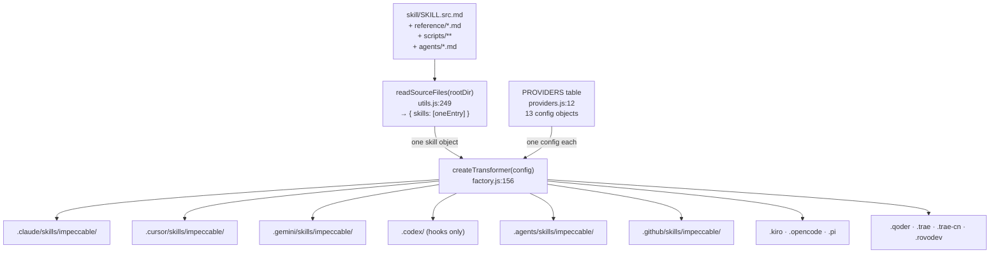
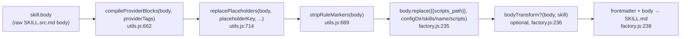
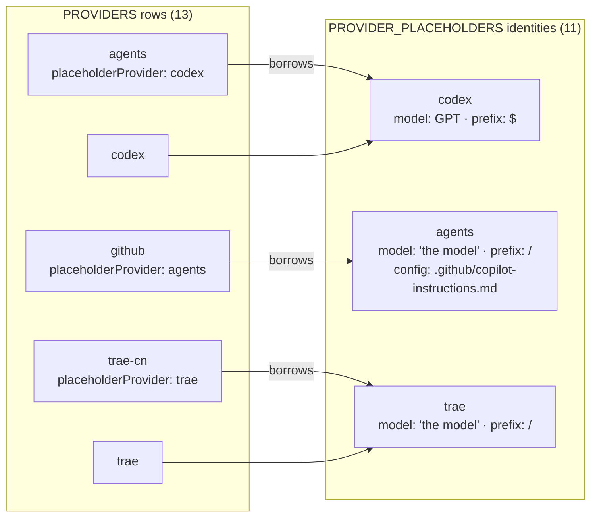

# Skill deep dive 04a — the single-source → N-harness transform

Companion to [`04-skill-harness.md`](04-skill-harness.md). That report is the
overview. This one goes to the floor on the single most transferable idea in the
subsystem for YoinkIt: **how ONE skill source compiles deterministically into 13
provider-specific harness directories**, so the repo never hand-maintains a
`skill/codex/` and a `skill/claude/` copy in parallel. Read this if a fresh agent
is going to delete YoinkIt's duplicated skill copies and replace them with a
build step, or needs to reason about exactly which text ends up in which
provider's `SKILL.md` and why.

The mechanism is small: one source manifest, two reference data tables, and
~170 lines of transformer. The leverage is large: adding a 14th harness is a
table row, not a new copy of the skill.

All `file:line` references are verified against
`/home/martin/src/perso/yoinkit/audit/impeccable/source/` at the time of writing.
Where the upstream `CLAUDE.md` or the stale first draft disagreed, the corrected
number is stated inline.

---

## 1. File map

| File | Lines | Role |
|---|---|---|
| [`skill/SKILL.src.md`](../../source/skill/SKILL.src.md) | 186 | **The single source.** Frontmatter + shared design laws + router table, with `{{placeholders}}`, `<provider>` conditional blocks, and `<!-- rule:id -->` markers. Deliberately *not* named `SKILL.md`. |
| [`scripts/lib/utils.js`](../../source/scripts/lib/utils.js) | 852 | The transform primitives: `readSourceFiles` (reads the source tree), `compileProviderBlocks`, `replacePlaceholders`, `stripRuleMarkers`, the `PROVIDER_PLACEHOLDERS` (11 entries) and `PROVIDER_BLOCK_TAGS` (14 entries) tables. |
| [`scripts/lib/transformers/factory.js`](../../source/scripts/lib/transformers/factory.js) | 326 | `createTransformer(config)` — the per-provider transform. `FIELD_SPECS` frontmatter dispatch, the 5-stage body pipeline, `{{command_hint}}` and `{{scripts_path}}` resolution, reference/script/agent emission. |
| [`scripts/lib/transformers/providers.js`](../../source/scripts/lib/transformers/providers.js) | 122 | The **13-entry `PROVIDERS` table** — the data axis. One config object per harness: `provider`, `configDir`, `providerTags`, `frontmatterFields`, `placeholderProvider`, etc. |
| [`scripts/lib/sub-pages-data.js`](../../source/scripts/lib/sub-pages-data.js) | 334 | Defines `SKILL_CATEGORIES` (47-78) and `CATEGORY_ORDER` (80) — the taxonomy that drives the `{{command_hint}}` grouping. Imported by factory.js. |
| [`skill/scripts/command-metadata.json`](../../source/skill/scripts/command-metadata.json) | — | 23 command keys; their **order** sets the within-group order of `{{command_hint}}`. (SSOT story → [`04d`](04d-command-metadata-and-pin.md).) |
| [`scripts/lib/transformers/hooks.js`](../../source/scripts/lib/transformers/hooks.js) | 120 | Hook-manifest emission. Out of scope here → [`04b`](04b-build-pipeline-and-validators.md). |

What this doc does **not** cover (cross-links): build orchestration / sync /
validators / zips / plugin subtree → [`04b-build-pipeline-and-validators.md`](04b-build-pipeline-and-validators.md);
top-level `agents/` subagent emission and hook manifests → [`04b`](04b-build-pipeline-and-validators.md);
runtime routing and `context.mjs` → [`04c-runtime-routing-and-context.md`](04c-runtime-routing-and-context.md);
`command-metadata.json` as SSOT + the pin shim + count enforcement →
[`04d-command-metadata-and-pin.md`](04d-command-metadata-and-pin.md);
distribution / install / why the output is committed →
[`04e-distribution-and-install.md`](04e-distribution-and-install.md).

---

## 2. Topology: one source, two tables, thirteen outputs



Two data tables carry all the per-provider variation, so the transform body has
no provider `if`/`switch` ladder:

1. **`PROVIDERS`** ([`providers.js:12`](../../source/scripts/lib/transformers/providers.js)) — 13 entries. Each is the *config* for one harness: where it writes (`configDir`), which conditional blocks it keeps (`providerTags`), which YAML fields it emits (`frontmatterFields`), and whose placeholder identity it borrows (`placeholderProvider`).
2. **`PROVIDER_PLACEHOLDERS`** ([`utils.js:564`](../../source/scripts/lib/utils.js)) — **11 entries** (not 13; see §6). Each is the *identity* of a provider: its model name, config file, ask-instruction, and command prefix.

The split matters. `PROVIDERS` is "how to emit"; `PROVIDER_PLACEHOLDERS` is "who
the provider is." Two `PROVIDERS` rows can point at the same `PROVIDER_PLACEHOLDERS`
identity via `placeholderProvider` (§6), which is how 13 outputs share 11
identities.

### STEAL — the data-axis shape

**STEAL.** This is the exact structure that kills YoinkIt's `skill/codex/` +
`skill/claude/` duplication. Today YoinkIt maintains two full skill trees that
must be kept byte-aligned by hand. Replace them with: one `skill/SKILL.src.md`
(plus `reference/`, `scripts/`, `agents/`), and a `PROVIDERS` table with two rows
to start — `claude` and `codex`. The Codex/Claude *differences* (command prefix,
how to ask the user a question, the model name in "X is capable of extraordinary
work") become table data, not forked prose. Adding a third harness later (Cursor,
Gemini) is one more row, never a third copy.

---

## 3. `readSourceFiles`: collecting the one-skill source tree

[`readSourceFiles(rootDir)`](../../source/scripts/lib/utils.js) is defined at
[`utils.js:249`](../../source/scripts/lib/utils.js). It reads the whole
`skill/` tree into a single in-memory object and returns it wrapped in an array.

### 3a. The `{ skills: [oneEntry] }` back-compat shape

Post-v3.0 the repo holds **exactly one** user-invocable skill (`impeccable`),
flat at `skill/`. But every downstream consumer (`createTransformer`,
`buildSubPageData`) was written against a *list* of skills from the multi-skill
era. Rather than rewrite them, `readSourceFiles` returns
`{ skills: [oneEntry] }` — a one-element array — so the array-shaped consumers
stay happy ([`utils.js:240-248`](../../source/scripts/lib/utils.js) docblock,
`return { skills }` at [`utils.js:335`](../../source/scripts/lib/utils.js)). The
transform loop `for (const skill of skills)`
([`factory.js:191`](../../source/scripts/lib/transformers/factory.js)) iterates
once today, but the seam for "more than one skill" is intact for forks.

The single skill object is assembled at [`utils.js:318-333`](../../source/scripts/lib/utils.js):

```js
skills.push({
  name: frontmatter.name || 'impeccable',
  description: frontmatter.description || '',
  license: frontmatter.license || '',
  compatibility: frontmatter.compatibility || '',
  metadata: frontmatter.metadata || null,
  allowedTools: frontmatter['allowed-tools'] || '',
  userInvocable: frontmatter['user-invocable'] === true || frontmatter['user-invocable'] === 'true',
  argumentHint: frontmatter['argument-hint'] || '',
  context: frontmatter.context || null,
  body,
  filePath: skillMdPath,
  references,   // [{ name, content, filePath }]
  scripts,      // [{ name, content, filePath, generated? }]
  agents        // [{ name, codexName, claudeName, description, ... providers, body }]
});
```

### 3b. What gets collected

- **Frontmatter + body**: parsed from `SKILL.src.md` by `parseFrontmatter` ([`utils.js:128`](../../source/scripts/lib/utils.js)), a hand-rolled YAML mini-parser (handles top-level scalars, arrays, and arrays-of-objects — enough for skill frontmatter, no `js-yaml` dependency).
- **References**: every `.md` under `skill/reference/`, collected as `{ name, content, filePath }` at [`utils.js:261-273`](../../source/scripts/lib/utils.js). `name` is the basename without extension (`audit`, `polish`, `brand`, ...).
- **Scripts**: two sources merged at [`utils.js:278-283`](../../source/scripts/lib/utils.js):
  1. `readSkillScripts(scriptsDir)` ([`utils.js:95`](../../source/scripts/lib/utils.js)) — everything under `skill/scripts/`, walked recursively, sorted, **excluding per-project artifacts** (`config.json`, see 3d).
  2. `readDetectorBundleScripts(rootDir)` ([`utils.js:55`](../../source/scripts/lib/utils.js)) — the **vendored detector bundle** (see 3c).
- **Agents**: every `.md` under `skill/agents/`, parsed for its own frontmatter at [`utils.js:285-316`](../../source/scripts/lib/utils.js). Each agent carries a `codexName` (default `name` with `-`→`_`), a `claudeName` (default `name`), and an optional `providers` allow-list. Agent emission is detailed in [`04b`](04b-build-pipeline-and-validators.md); this doc only notes that agents ride along in the same source object.

### 3c. The vendored detector bundle

`readDetectorBundleScripts` ([`utils.js:55-93`](../../source/scripts/lib/utils.js))
walks `cli/engine/**` (the constant `DETECTOR_BUNDLE_DIR = 'cli/engine'`,
[`utils.js:12`](../../source/scripts/lib/utils.js)) and adds every file under the
script name `detector/<relpath>`, tagged `generated: true`. The detector — the
subject of report [`01`](../01-detector-engine/01-detector-engine.md) — is the
CLI's anti-pattern engine; the skill vendors a copy so the installed harness can
run `node {{scripts_path}}/detect.mjs` locally with no npx round-trip.

One sharp edge worth carrying: the bundled `cli/engine/cli/main.mjs` imports
`../../lib/impeccable-config.mjs`, which lives *outside* `cli/engine`. So
`DETECTOR_EXTERNAL_DEPS` ([`utils.js:21-23`](../../source/scripts/lib/utils.js))
copies `cli/lib/impeccable-config.mjs` → `lib/impeccable-config.mjs` inside the
bundle ([`utils.js:81-90`](../../source/scripts/lib/utils.js)) so the relative
import still resolves from the new location. **Lesson for YoinkIt:** if the skill
vendors `extension/capture-animation.js`, walk its real import graph and copy
out-of-tree dependencies too, or the installed copy import-fails.

### 3d. Per-project artifact exclusion

`PER_PROJECT_SCRIPT_ARTIFACTS = new Set(['config.json'])`
([`utils.js:10`](../../source/scripts/lib/utils.js)) names files that live inside
an installed skill's `scripts/` but belong to the *consuming* project, not the
distributable skill (here: the legacy live-mode inject-target list). They are
skipped on read ([`utils.js:109`](../../source/scripts/lib/utils.js)) so the build
never bundles one project's local state into another's distribution, and there is
a stash/restore pair (`stashPerProjectArtifacts` / `restorePerProjectArtifacts`,
[`utils.js:29-53`](../../source/scripts/lib/utils.js)) so the release sync's
`rm -rf` + recopy does not destroy a user's local config. That sync path is
[`04b`](04b-build-pipeline-and-validators.md)/[`04e`](04e-distribution-and-install.md).

### STEAL — vendor the engine, exclude local state

**STEAL.** YoinkIt's capture engine is one file; vendoring it into the skill so
the agent can run capture-adjacent tooling locally is the same move. **ADAPT** the
per-project exclusion: YoinkIt captures produce `*.animation.json` (already
gitignored per the repo's own conventions). A `PER_PROJECT_SCRIPT_ARTIFACTS`-style
denylist guarantees the build never sweeps a user's captured spec into the
shipped skill.

---

## 4. The naming dodge: `SKILL.src.md`, not `SKILL.md`

This is the **single most important one-line lesson** of the subsystem, and the
cheapest to copy. The source manifest is named `SKILL.src.md`. The
`readSourceFiles` docblock at [`utils.js:242-247`](../../source/scripts/lib/utils.js)
states exactly why:

> The source manifest is `SKILL.src.md`, NOT `SKILL.md`, on purpose: the
> `vercel-labs/skills` CLI discovers a skill by finding a literal `SKILL.md`
> and copies that directory verbatim. If `skill/SKILL.md` existed, `npx skills`
> would install the UNCOMPILED source (unresolved `{{placeholders}}`, no vendored
> detector). Naming it `SKILL.src.md` hides it from discovery so the CLI falls
> through to a compiled harness dir (`.agents/skills/impeccable`) instead.

The whole pipeline pivots on a file *naming convention*. The installer's discovery
rule is "find a literal `SKILL.md` and copy that directory." If the author's
source were `SKILL.md`, the installer would happily ship the template — braces
and all (`{{model}}`, `{{command_prefix}}`, `{{available_commands}}`) plus no
vendored detector. By naming the source `SKILL.src.md`, the *only* files in the
repo named `SKILL.md` are the **compiled** outputs under `.claude/skills/`,
`.agents/skills/`, etc. — exactly what the installer should find.

`readSourceFiles` looks for `skill/SKILL.src.md` and returns an empty
`{ skills: [] }` if it is absent ([`utils.js:253-256`](../../source/scripts/lib/utils.js)),
so the build is keyed to the `.src.md` name on the read side too.

Verified: the repo contains exactly one `skill/SKILL.src.md` (the source) and 12
committed `*/skills/impeccable/SKILL.md` compiled outputs. (Codex is the
exception — see §6/§9 — its `skills/` dir is not committed; only `.codex/hooks.json`
is. The codex *identity* still drives `.agents` via the borrow chain.)

### STEAL — the naming dodge is free insurance

**STEAL, verbatim.** YoinkIt ships skills the same way (a `SKILL.md` per provider
dir today). The instant YoinkIt introduces a compile step, rename the author's
file to `SKILL.src.md` so the installer can never grab the un-compiled template.
This is a one-character-class change (`.md` → `.src.md`) that prevents the
worst-case install bug: a user getting a skill full of literal `{{placeholders}}`.

---

## 5. The 5-stage body pipeline

The transform per provider is `createTransformer(config)`
([`factory.js:156-326`](../../source/scripts/lib/transformers/factory.js) — line
range confirmed; the upstream prose was vague). It destructures the config
([`factory.js:157-168`](../../source/scripts/lib/transformers/factory.js)),
pre-resolves `activeFields` from `FIELD_SPECS`
([`factory.js:170-173`](../../source/scripts/lib/transformers/factory.js)), and
returns the actual `transform(skills, distDir, options)` closure at
[`factory.js:174`](../../source/scripts/lib/transformers/factory.js).

The body of each skill goes through **five stages, in this exact order**
([`factory.js:229-236`](../../source/scripts/lib/transformers/factory.js) — range
confirmed):

```js
// 1. keep/strip <provider> conditional blocks
let skillBody = compileProviderBlocks(skill.body, providerTags);
// 2. replace {{model}} {{config_file}} {{ask_instruction}} {{command_prefix}} {{available_commands}}
skillBody = replacePlaceholders(skillBody, placeholderKey, commandNames, allSkillNames);
// 3. strip <!-- rule:id --> markers
skillBody = stripRuleMarkers(skillBody);
// 4. resolve {{scripts_path}} to the provider-aware path
const scriptsPath = `${configDir}/skills/${skillName}/scripts`;
skillBody = skillBody.replace(/\{\{scripts_path\}\}/g, scriptsPath);
// 5. optional provider-specific body transform
if (bodyTransform) skillBody = bodyTransform(skillBody, skill);
```

Order is load-bearing in two places:

- **Blocks before placeholders.** `compileProviderBlocks` (stage 1) drops the body of non-matching `<provider>` blocks. If `replacePlaceholders` ran first, it would expand `{{...}}` tokens inside blocks that are about to be deleted — wasted work, and (for the legacy `/skill`→`$skill` rewrite) potential corruption of text that should have vanished.
- **`{{scripts_path}}` resolved separately (stage 4), not in the `replacePlaceholders` table.** `{{scripts_path}}` depends on `configDir` + `skillName`, which are per-provider *and* per-skill, so it cannot be a static row in `PROVIDER_PLACEHOLDERS`. It is resolved inline against the computed `scriptsPath` ([`factory.js:234-235`](../../source/scripts/lib/transformers/factory.js)). Likewise `{{command_hint}}` is resolved in the frontmatter step, not the body table (§8).

The same three stages (1, 2, 3) plus the `{{scripts_path}}` replace also run over
every **reference file** ([`factory.js:251-254`](../../source/scripts/lib/transformers/factory.js)).
That is why `{{available_commands}}` — which appears only in `reference/audit.md`
and `reference/critique.md`, not in the SKILL body — still gets expanded
(verified: [`skill/reference/audit.md:98,117`](../../source/skill/reference/audit.md)
holds `{{available_commands}}`; the compiled
`.claude/skills/impeccable/reference/audit.md` holds the full resolved list).

The final write: `content = ${frontmatter}\n\n${skillBody}` →
`writeFile(.../SKILL.md)` ([`factory.js:238-239`](../../source/scripts/lib/transformers/factory.js)).

### One nuance the transform does NOT do: it never rewrites copied scripts

Stages run on **markdown** (bodies + references) only. Script files are copied
**verbatim** ([`factory.js:261-268`](../../source/scripts/lib/transformers/factory.js)):
no placeholder replacement. Verified: the compiled
`.claude/skills/impeccable/scripts/pin.mjs` still contains a literal
`{{command_prefix}}` token — because `pin.mjs` resolves the prefix itself at
*runtime* from the harness it finds, rather than at build time. This bounds the
transform's blast radius cleanly: prose is compiled, executable scripts are
shipped as-is and self-resolve. **Worth copying:** keep build-time substitution to
human-readable instruction text; let scripts read their own environment.



### STEAL — fixed pipeline, ordered, markdown-only

**STEAL.** A short fixed-order pipeline of pure string transforms is the entire
engine. For YoinkIt: `compileProviderBlocks` (drop Codex-only / Claude-only
guidance) → `replacePlaceholders` (model name, prefix, ask-instruction) →
`{{scripts_path}}` resolve. Three stages would carry YoinkIt's two-harness needs.
Keep it markdown-only; ship `capture-animation.js` and any helper scripts verbatim.

---

## 6. `replacePlaceholders` + `PROVIDER_PLACEHOLDERS` — the 5 simple tokens

`replacePlaceholders(content, provider, commandNames, allSkillNames)` is at
[`utils.js:714`](../../source/scripts/lib/utils.js). It looks up the provider's
identity in `PROVIDER_PLACEHOLDERS`, **falling back to `cursor`** if the key is
absent ([`utils.js:715`](../../source/scripts/lib/utils.js)), and replaces five
tokens ([`utils.js:734-739`](../../source/scripts/lib/utils.js)):

| Token | Source field | Example (claude-code) | Example (codex) |
|---|---|---|---|
| `{{model}}` | `placeholders.model` | `Claude` | `GPT` |
| `{{config_file}}` | `placeholders.config_file` | `CLAUDE.md` | `AGENTS.md` |
| `{{ask_instruction}}` | `placeholders.ask_instruction` | `STOP and call the AskUserQuestion tool...` | `STOP and use Codex's structured user-input/question tool...` |
| `{{command_prefix}}` | `placeholders.command_prefix` | `/` | `$` |
| `{{available_commands}}` | computed (below) | `/impeccable adapt, /impeccable animate, ...` | `$impeccable adapt, ...` |

`{{model}}` is what makes the line "**{{model}}** is capable of extraordinary
work. Don't hold back." ([`SKILL.src.md:25`](../../source/skill/SKILL.src.md))
render per-harness. Verified outputs: `.claude` → "Claude is capable...",
`.agents` → "GPT is capable...", `.github` → "the model is capable...".

### 6a. `PROVIDER_PLACEHOLDERS` has 11 entries, not 13

**Correction (confirmed).** The table at
[`utils.js:564-631`](../../source/scripts/lib/utils.js) has **11 keys**, not 13:
`claude-code`, `cursor`, `gemini`, `codex`, `agents`, `kiro`, `opencode`, `pi`,
`qoder`, `trae`, `rovo-dev`. Two `PROVIDERS` rows have **no** entry of their own —
`github` and `trae-cn` — because they borrow another provider's identity via the
`placeholderProvider` field. `createTransformer` resolves
`placeholderKey = placeholderProvider || provider`
([`factory.js:168`](../../source/scripts/lib/transformers/factory.js)) and threads
`placeholderKey` into every `replacePlaceholders` call.

### 6b. The borrow chain (the draft muddled this)



The chain set in [`providers.js`](../../source/scripts/lib/transformers/providers.js):

- **`agents` → `codex`** (`placeholderProvider: 'codex'`, [`providers.js:60`](../../source/scripts/lib/transformers/providers.js)). So the **`.agents` build uses CODEX placeholders**: it emits "**GPT** is capable..." and the **`$`** prefix (`$impeccable`). Verified in committed output: `.agents/skills/impeccable/SKILL.md:21` reads "GPT is capable of extraordinary work"; its Pin section reads "`$<command>` invokes `$impeccable <command>`".
- **`github` → `agents`** (`placeholderProvider: 'agents'`, [`providers.js:69`](../../source/scripts/lib/transformers/providers.js)). The **`.github` build uses the `agents` placeholder entry** — `model: 'the model'`, `config_file: '.github/copilot-instructions.md'`, prefix `/`. Verified: `.github/skills/impeccable/SKILL.md:24` reads "the model is capable..."; its Pin section reads "`/<command>` invokes `/impeccable <command>`".
- **`trae-cn` → `trae`** (`placeholderProvider: 'trae'`, [`providers.js:104`](../../source/scripts/lib/transformers/providers.js)).

The subtle, easy-to-get-wrong fact: the `agents` entry inside
`PROVIDER_PLACEHOLDERS` (`model: 'the model'`, config
`.github/copilot-instructions.md`, [`utils.js:589-594`](../../source/scripts/lib/utils.js))
effectively **serves `github`, not the `.agents` build** — because the `.agents`
build borrows `codex`. The naming is a trap: the placeholder entry literally named
`agents` is the GitHub Copilot identity, and the build dir named `.agents` uses the
Codex identity. Read the `placeholderProvider` indirection, never the name.

### 6c. `{{available_commands}}` is built from `IMPECCABLE_SUB_COMMANDS` (curated 19)

`{{available_commands}}` is *not* a static field. It is computed in
`replacePlaceholders` ([`utils.js:722-732`](../../source/scripts/lib/utils.js)).
Because the repo is single-skill (the `commandNames` passed in are empty after the
`EXCLUDED_FROM_SUGGESTIONS` filter), it takes the single-skill branch
([`utils.js:724-728`](../../source/scripts/lib/utils.js)):

```js
commandList = IMPECCABLE_SUB_COMMANDS
  .map(n => `${cmdPrefix}impeccable ${n}`)
  .join(', ');
```

**Correction (confirmed).** `IMPECCABLE_SUB_COMMANDS`
([`utils.js:708-712`](../../source/scripts/lib/utils.js)) is a **curated 19**, not
all 23 commands. The 19, in source order:

```
adapt, animate, audit, bolder, clarify, colorize, critique, delight, distill,
document, harden, layout, onboard, optimize, overdrive, polish, quieter, shape, typeset
```

It **excludes** `craft`, `init`, `extract`, `live` (and the management commands
`pin`/`unpin`/`hooks`). The reason is semantic: `{{available_commands}}` is the
"suggest a next step" list that `audit`/`critique` draw from when recommending a
follow-up. You would not suggest `init` (setup) or `craft`/`extract`/`live`
(full-build / setup / interactive modes) as a *next* step after an audit. Verified
end-to-end: the compiled `.claude/skills/impeccable/reference/audit.md:98` lists
exactly those 19 as `/impeccable adapt, /impeccable animate, ... /impeccable typeset`,
in source order, and `craft`/`init`/`extract`/`live` are absent.

`EXCLUDED_FROM_SUGGESTIONS` ([`utils.js:700-704`](../../source/scripts/lib/utils.js))
is a *separate* filter for the multi-skill back-compat branch (drops `impeccable`
itself plus two deprecated shims). It doesn't fire in the single-skill path but
guards forks.

### 6d. The legacy `/skill` → `$skill` rewrite (longest-first)

After the five token replacements, `replacePlaceholders` does a second pass
([`utils.js:743-751`](../../source/scripts/lib/utils.js)): when the provider's
prefix is not `/` (i.e. Codex / `.agents`, prefix `$`), it rewrites bare
`/skillname` invocations to `$skillname`. It sorts `allSkillNames`
**longest-first** ([`utils.js:744`](../../source/scripts/lib/utils.js)) so a longer
name is matched before a shorter name that is its prefix (avoids
`/normalize` being half-rewritten by a `/norm` rule). The lookahead regex
`\/(?=name(?:[^a-zA-Z0-9_-]|$))` ([`utils.js:747`](../../source/scripts/lib/utils.js))
only fires on a full-word boundary. This is largely vestigial in the single-skill
era (one skill name) but is the mechanism that flips every `/impeccable` in the
body to `$impeccable` for Codex.

### STEAL — identity table + borrow, but watch the naming trap

**STEAL** the identity table for YoinkIt's two harnesses: a `claude` entry
(model `Claude`, prefix `/`, AskUserQuestion ask-instruction) and a `codex` entry
(model `GPT`, prefix `$`, Codex's question-tool ask-instruction). The single line
"X is capable of extraordinary work" already differs between YoinkIt's two skill
copies; making it `{{model}}` deletes that divergence. **AVOID** the naming trap:
if YoinkIt ever adds a borrow (`placeholderProvider`), do not let the borrowing
dir's name imply its identity. Comment the indirection at the table.

---

## 7. `compileProviderBlocks` + `PROVIDER_BLOCK_TAGS` — conditional prose

`compileProviderBlocks(content, activeTags)` is at
[`utils.js:662-674`](../../source/scripts/lib/utils.js). It keeps or strips
provider-conditional markdown blocks.

### 7a. The regex and its standalone-tag requirement

```js
const providerBlockPattern =
  /(^|\r?\n)[ \t]*<([a-z][a-z0-9-]*)>[ \t]*\r?\n([\s\S]*?)\r?\n[ \t]*<\/\2>[ \t]*(?=\r?\n|$)/g;
```

The pattern ([`utils.js:664`](../../source/scripts/lib/utils.js)) requires the
open and close tags to sit **on their own lines** (optional surrounding
whitespace, then a newline). The `\2` backreference forces the close tag to match
the open tag name. This is deliberate: it means ordinary inline HTML/markdown
(e.g. a literal `<div>` mid-sentence, or `` named inside prose) is never
touched — only standalone `<provider>` … `</provider>` fences are.

Semantics per matched block ([`utils.js:667-671`](../../source/scripts/lib/utils.js)):

- Tag **not** in `PROVIDER_BLOCK_TAGS` → `return match` (leave untouched — unknown tags are ordinary content).
- Tag in `PROVIDER_BLOCK_TAGS` and in `activeTagSet` → return `${prefix}${body}` (**keep body, drop the tags**).
- Tag in `PROVIDER_BLOCK_TAGS` but **not** active → return `${prefix}` (**strip the whole block**, keeping only the leading newline).

Finally, if any known block was compiled, collapse 3+ consecutive newlines to 2
([`utils.js:673`](../../source/scripts/lib/utils.js)) — the **blank-line reaping**
that prevents stripped blocks from leaving holes. (This same normalization also
reaps the blank lines that `stripRuleMarkers` leaves behind; see §8.)

`PROVIDER_BLOCK_TAGS` ([`utils.js:633-648`](../../source/scripts/lib/utils.js)) has
**14 entries**: `agents`, `claude`, `claude-code`, `codex`, `cursor`, `gemini`,
`github`, `kiro`, `opencode`, `pi`, `qoder`, `rovo-dev`, `trae`, `trae-cn`. (Note
both `claude` and `claude-code` are valid block tags — see 7c.)

### 7b. The three real blocks in `SKILL.src.md` and who keeps them

Verified line numbers (the draft and CLAUDE.md were imprecise):

| Block | Lines | Content | Kept by providers whose `providerTags` include... |
|---|---|---|---|
| `<codex>` typography ceiling | [`42-45`](../../source/skill/SKILL.src.md) | "Display letter-spacing ≥ -0.04em. Your default of -0.05 to -0.085em..." | `codex` |
| `<gemini>` image-hover ban | [`69-71`](../../source/skill/SKILL.src.md) | "**Gemini-specific defect: hard ban.** Never animate `` elements on hover..." | `gemini` |
| `<codex>` defects list | [`100-108`](../../source/skill/SKILL.src.md) | "**Codex-specific defects**... ghost-card... over-round... sketchy SVG... stripes... meta-criticism" | `codex` |

Now cross with the `providerTags` column of `PROVIDERS`
([`providers.js`](../../source/scripts/lib/transformers/providers.js)):

| Provider | `providerTags` | Keeps `<codex>`? | Keeps `<gemini>`? |
|---|---|:--:|:--:|
| `claude-code` | `['claude-code','claude']` | – | – |
| `codex` | `['codex']` | ✓ | – |
| `agents` | `['agents','codex']` | ✓ | – |
| `github` | `['github']` | – | – |
| `gemini` | `['gemini']` | – | ✓ |
| `cursor` | `['cursor']` | – | – |
| (kiro, opencode, pi, qoder, trae, trae-cn, rovo-dev) | `[<self>]` (trae-cn also `trae`) | – | – |

The critical, non-obvious result: **`.agents` keeps the `<codex>` blocks** because
its `providerTags` is `['agents','codex']` — even though it borrows the *codex
identity* separately for placeholders. Both the block-keep *and* the identity flow
through "agents behaves like codex," but via two different config fields
(`providerTags` vs `placeholderProvider`). Verified: the compiled
`.agents/skills/impeccable/SKILL.md` contains "Your default of -0.05 to -0.085em"
(the codex typography block); no other dir except codex's own (uncommitted) build
would. Verified the inverse too: only `.gemini` contains "Never animate ``".

### 7c. Why `claude-code: ['claude-code','claude']`

`providerTags` is a *list* so a provider can answer to more than one block name.
`claude-code` accepts both `<claude-code>` and `<claude>` fences (none exist in
the current `SKILL.src.md`, but the seam is there). `agents` accepts `<agents>`
and `<codex>`. `trae-cn` accepts `<trae-cn>` and `<trae>`
([`providers.js:101`](../../source/scripts/lib/transformers/providers.js)). The
default is `providerTags = [provider]`
([`factory.js:163`](../../source/scripts/lib/transformers/factory.js)) — a single
tag matching the provider key.

### STEAL — conditional blocks delete the per-harness forks

**STEAL — this is the heart of the duplication kill.** YoinkIt's `skill/codex/`
and `skill/claude/` differ mostly in a handful of harness-specific paragraphs (how
each drives a real browser, Codex's vs Claude's tool names). Today those
differences force two whole copies. With `compileProviderBlocks`, the *shared*
99% lives once in `SKILL.src.md`, and the harness-specific 1% goes in
`<codex>...</codex>` / `<claude>...</claude>` fences. One source; the build emits
both. The standalone-tag-on-own-line rule means YoinkIt's prose can still contain
inline `<element>` mentions (it is a tool *about* HTML) without false matches —
that guard is exactly why the regex insists on own-line fences.

---

## 8. `stripRuleMarkers` — eval IDs that never ship

`stripRuleMarkers(content)` ([`utils.js:689-691`](../../source/scripts/lib/utils.js)):

```js
return content.replace(/[ \t]*<!--\s*rule:[a-z0-9-]+\s*-->/g, '');
```

`SKILL.src.md` carries `<!-- rule:id -->` markers on most instruction lines
(`<!-- rule:skill-color-verify-contrast -->`,
[`SKILL.src.md:31`](../../source/skill/SKILL.src.md), and ~40 more). These let
external eval tooling pin each instruction to a stable ID **in lock-step with the
file** — the mapping is verifiable because the marker lives right on the line it
identifies. But the markers are noise to the agent reading the compiled skill, so
stage 3 strips them ([`factory.js:231`](../../source/scripts/lib/transformers/factory.js)).

The regex eats the leading whitespace too, so `something. <!-- rule:foo -->`
becomes `something.` and a *standalone* marker line collapses to an empty line —
which the blank-line normalization inside `compileProviderBlocks` (§7a) reaps.
There is an ordering coupling here: `stripRuleMarkers` (stage 3) relies on
`compileProviderBlocks` (stage 1) having installed the collapse, **but** the
collapse only runs if a known block was compiled
([`utils.js:673`](../../source/scripts/lib/utils.js), guarded by
`didCompileBlock`). In practice the SKILL body always has `<codex>`/`<gemini>`
blocks so the collapse fires; reference files without blocks keep the marker's
trailing blank line, which is harmless in markdown. Verified: **no** committed
output under any `*/skills/` dir contains a `rule:` marker.

### STEAL — author-time eval anchors, stripped at build

**STEAL.** If YoinkIt ever builds an eval harness (does the skill actually make
the agent capture correctly?), `<!-- rule:id -->` markers on each instruction line
give a stable, in-file-verifiable mapping that the build strips before ship.
Cheap to add now (a comment), valuable later.

---

## 9. `FIELD_SPECS` + per-provider `frontmatterFields`

Every output's frontmatter starts with `name` + `description`
([`factory.js:196-199`](../../source/scripts/lib/transformers/factory.js)), then
`version` when `includeVersion` and a version are present
([`factory.js:200`](../../source/scripts/lib/transformers/factory.js)). Beyond
that, *which* YAML fields appear is driven by the provider's `frontmatterFields`
list × the `FIELD_SPECS` dispatch table.

`FIELD_SPECS` ([`factory.js:23-51`](../../source/scripts/lib/transformers/factory.js))
maps a field name → extraction spec `{ sourceKey, yamlKey, condition?, value? }`:

| Field | sourceKey → yamlKey | Condition / value |
|---|---|---|
| `user-invocable` | `userInvocable` → `user-invocable` | only if `skill.userInvocable`; value forced to `true` |
| `argument-hint` | `argumentHint` → `argument-hint` | only if `userInvocable && argumentHint` |
| `license` | `license` → `license` | emit if truthy |
| `compatibility` | `compatibility` → `compatibility` | emit if truthy |
| `metadata` | `metadata` → `metadata` | emit if truthy |
| `allowed-tools` | `allowedTools` → `allowed-tools` | emit if truthy |

The loop ([`factory.js:202-206`](../../source/scripts/lib/transformers/factory.js))
walks `activeFields` (the provider's `frontmatterFields` mapped through
`FIELD_SPECS`, [`factory.js:170-173`](../../source/scripts/lib/transformers/factory.js)),
skips on a failing `condition`, takes `value()` if present else `skill[sourceKey]`,
and only writes truthy values.

What each harness emits, from the `frontmatterFields` column of `PROVIDERS`:

| Provider | `frontmatterFields` | Net YAML beyond name/description/version |
|---|---|---|
| `claude-code` | all 6 | `user-invocable`, `argument-hint`, `license`, `allowed-tools` (compatibility/metadata empty in source → omitted) |
| `opencode`, `qoder`, `rovo-dev` | 6 (incl. `allowed-tools`) | same as claude-code |
| `github`, `trae`, `trae-cn` | 5 (no `allowed-tools`) | `user-invocable`, `argument-hint`, `license` |
| `pi` | `['license','compatibility','metadata','allowed-tools']` | `license`, `allowed-tools` |
| **`cursor`** | **`['license','compatibility','metadata']`** | **`license`** |
| `kiro` | `['license','compatibility','metadata']` | `license` |
| **`gemini`** | **`[]`** | none |
| **`codex`** | **`[]`** | none |

**Correction (confirmed).** **Cursor emits frontmatter, not zero.** Its
`frontmatterFields = ['license','compatibility','metadata']`
([`providers.js:18`](../../source/scripts/lib/transformers/providers.js)). Since
`compatibility` and `metadata` are empty in the source frontmatter, only `license`
actually renders — but the field list is non-empty, and any draft claim of
"Cursor/Gemini/Codex emit none" is wrong for Cursor. Verified: the committed
`.cursor/skills/impeccable/SKILL.md` frontmatter is `name`, `description`,
`version`, `license: Apache 2.0`. **Gemini and Codex** are the true `[]` cases —
verified: `.gemini/skills/impeccable/SKILL.md` frontmatter is only `name` +
`description` + `version`.

The field lists track each harness's *support matrix* — what YAML keys a given
tool actually honors (the HARNESSES.md story is in
[`04e`](04e-distribution-and-install.md)). Gemini honors none of the optional
keys, so it gets none; Claude Code honors `user-invocable`/`argument-hint`/
`allowed-tools`, so it gets them.

### STEAL — declarative frontmatter dispatch

**STEAL.** `FIELD_SPECS` + a per-provider `frontmatterFields` list is a clean way
to emit only the YAML each harness understands. For YoinkIt's two harnesses the
list is short, but the pattern beats a hand-forked frontmatter block per copy: add
a field once to `FIELD_SPECS`, opt providers in by name.

---

## 10. `{{command_hint}}` — the second taxonomy

The frontmatter `argument-hint` in source is
`"[{{command_hint}}] [target]"` ([`SKILL.src.md:4`](../../source/skill/SKILL.src.md)).
`{{command_hint}}` is resolved in the frontmatter step (not the body table)
because it depends on the command-metadata + category data
([`factory.js:208-224`](../../source/scripts/lib/transformers/factory.js)):

```js
if (frontmatterObj['argument-hint']?.includes('{{command_hint}}')) {
  const metaScript = skill.scripts?.find(s => s.name === 'command-metadata.json');
  if (metaScript) {
    const commands = Object.keys(JSON.parse(metaScript.content));
    const grouped = CATEGORY_ORDER
      .map(cat => commands.filter(c => SKILL_CATEGORIES[c] === cat).join('|'))
      .filter(Boolean)
      .join(' · ');
    frontmatterObj['argument-hint'] =
      frontmatterObj['argument-hint'].replace('{{command_hint}}', grouped);
  }
}
```

Three inputs combine:

1. **The command list + order** from `command-metadata.json` keys (parsed at [`factory.js:213`](../../source/scripts/lib/transformers/factory.js)). The 23 keys in file order: `craft, init, document, extract, live, adapt, animate, audit, bolder, clarify, colorize, critique, delight, distill, harden, onboard, layout, optimize, overdrive, polish, quieter, shape, typeset`.
2. **The category map** `SKILL_CATEGORIES` ([`sub-pages-data.js:47-78`](../../source/scripts/lib/sub-pages-data.js)) — `craft: 'create'`, `audit: 'evaluate'`, `polish: 'harden'`, etc.
3. **The group order** `CATEGORY_ORDER = ['create','evaluate','refine','simplify','harden','system']` ([`sub-pages-data.js:80`](../../source/scripts/lib/sub-pages-data.js)).

The algorithm: for each category in `CATEGORY_ORDER`, filter the
`command-metadata.json` keys (in file order) whose `SKILL_CATEGORIES` value is that
category, join them with `|`, drop empty groups, join groups with ` · ` (middle
dot, for natural line-breaking).

### Correction (confirmed): two distinct taxonomies, and the real output

**Correction.** The `{{command_hint}}` grouping uses `SKILL_CATEGORIES`
(`create / evaluate / refine / simplify / harden / system`), **NOT** the
router-table categories in `SKILL.src.md`'s Commands table
(`Build / Evaluate / Refine / Enhance / Fix / Iterate`,
[`SKILL.src.md:121-145`](../../source/skill/SKILL.src.md)). These are **two
different taxonomies** that happen to coexist in the repo:

- The **router table** (`Build/Evaluate/Refine/Enhance/Fix/Iterate`) is human-facing documentation of the command menu.
- **`SKILL_CATEGORIES`** (`create/evaluate/refine/simplify/harden/system`) is the machine taxonomy that drives the argument-hint *and* the website's category pages.

Deriving the real output by hand (group order × metadata key order × category map):

- **create**: `craft`, `shape` → `craft|shape`  *(`impeccable` is `create` too but is not a metadata key, so it never appears)*
- **evaluate**: `audit`, `critique` → `audit|critique`
- **refine**: `animate`, `bolder`, `colorize`, `delight`, `layout`, `overdrive`, `quieter`, `typeset` → `animate|bolder|colorize|delight|layout|overdrive|quieter|typeset`
- **simplify**: `adapt`, `clarify`, `distill` → `adapt|clarify|distill`
- **harden**: `harden`, `onboard`, `optimize`, `polish` → `harden|onboard|optimize|polish`
- **system**: `init`, `document`, `extract`, `live` → `init|document|extract|live`

Joined with ` · `:

```
[craft|shape · audit|critique · animate|bolder|colorize|delight|layout|overdrive|quieter|typeset · adapt|clarify|distill · harden|onboard|optimize|polish · init|document|extract|live] [target]
```

Verified byte-for-byte against the committed
`.claude/skills/impeccable/SKILL.md:6`,
`.github/skills/impeccable/SKILL.md:6`, and
`.opencode/skills/impeccable/SKILL.md:6`. (Any draft showing
`[craft|shape · audit|critique · …]` with a different ordering/grouping — e.g.
mixing in the router-table labels — was wrong.) The within-group order is the
**metadata key order**, not the `SKILL_CATEGORIES` declaration order: e.g. refine
emits `animate|bolder|...` (metadata order) — note `layout` precedes `optimize`
because that is the metadata order, even though `SKILL_CATEGORIES` declares
`layout` before `colorize`.

This block only fires for providers whose `frontmatterFields` include
`argument-hint` (claude-code, github, opencode, qoder, rovo-dev, trae, trae-cn).
Gemini/codex/cursor/kiro/pi never carry `argument-hint`, so they never resolve
`{{command_hint}}`.

### STEAL — keep one taxonomy, or label the two

**ADAPT.** The lesson is double-edged. The grouping mechanism (category-ordered,
metadata-ordered within group, generated into the hint) is **STEAL-worthy** for
YoinkIt if its commands grow. But the *two coexisting taxonomies* are an **AVOID**:
they are a live correctness trap (the draft fell into it). If YoinkIt builds an
argument-hint generator, drive it from **one** category map and let the docs table
render from the same map, so a human and the build can never disagree.

---

## 11. The `PROVIDERS` table as the data axis — one line → 13 outputs

`build.js` iterates `PROVIDERS` and calls `createTransformer(config)(skills, ...)`
once per entry (orchestration in [`04b`](04b-build-pipeline-and-validators.md)).
The 13 entries ([`providers.js:12-122`](../../source/scripts/lib/transformers/providers.js)),
with the fields that change behavior:

| key | configDir | providerTags | placeholderProvider | frontmatterFields (count) | other |
|---|---|---|---|---|---|
| `cursor` | `.cursor` | `[cursor]` | — | 3 | emitHooks, hooksRel `hooks.json` |
| `claude-code` | `.claude` | `[claude-code, claude]` | — | 6 | agentFormat `claude-md`, emitHooks→`settings.json` |
| `gemini` | `.gemini` | `[gemini]` | — | 0 | — |
| `codex` | `.codex` | `[codex]` | — | 0 | writeOpenAIMetadata, emitHooks `hooks.json` |
| `agents` | `.agents` | `[agents, codex]` | **codex** | 0 | writeOpenAIMetadata |
| `github` | `.github` | `[github]` | **agents** | 5 | — |
| `kiro` | `.kiro` | `[kiro]` | — | 3 | — |
| `opencode` | `.opencode` | `[opencode]` | — | 6 | — |
| `pi` | `.pi` | `[pi]` | — | 4 | — |
| `qoder` | `.qoder` | `[qoder]` | — | 6 | — |
| `trae-cn` | `.trae-cn` | `[trae-cn, trae]` | **trae** | 5 | — |
| `trae` | `.trae` | `[trae]` | — | 5 | — |
| `rovo-dev` | `.rovodev` | `[rovo-dev]` | — | 6 | — |

(Note `rovo-dev`'s `configDir` is `.rovodev`, not `.rovo-dev` —
[`providers.js:118`](../../source/scripts/lib/transformers/providers.js).)

### One source line → its 13 provider outputs (end-to-end trace)

Take the single line at [`SKILL.src.md:25`](../../source/skill/SKILL.src.md):

> "... {{model}} is capable of extraordinary work. Don't hold back."

It is outside any `<provider>` block and carries no `rule:` marker, so stages 1
and 3 pass it through untouched. Stage 2 (`replacePlaceholders`) substitutes
`{{model}}` with each provider's resolved identity:

```mermaid
flowchart TD
  L["SKILL.src.md:25\n'{{model}} is capable of extraordinary work.'"]
  L --> claude[".claude → 'Claude is capable...'\n(claude-code identity)"]
  L --> cursor[".cursor → 'the model is capable...'"]
  L --> gemini[".gemini → 'Gemini is capable...'"]
  L --> codex[".codex → 'GPT is capable...'"]
  L --> agents[".agents → 'GPT is capable...'\n(borrows codex)"]
  L --> github[".github → 'the model is capable...'\n(borrows agents)"]
  L --> kiro[".kiro → 'Claude is capable...'"]
  L --> opencode[".opencode → 'Claude is capable...'"]
  L --> pi[".pi → 'the model is capable...'"]
  L --> qoder[".qoder → 'the model is capable...'"]
  L --> trae[".trae → 'the model is capable...'"]
  L --> traecn[".trae-cn → 'the model is capable...'\n(borrows trae)"]
  L --> rovo[".rovodev → 'Rovo Dev is capable...'"]
```



Resolved from `PROVIDER_PLACEHOLDERS.model`
([`utils.js:564-631`](../../source/scripts/lib/utils.js)): Claude (claude-code,
kiro, opencode), GPT (codex, agents-via-borrow), "the model" (cursor, agents-entry,
github-via-borrow, pi, qoder, trae, trae-cn-via-borrow), Gemini (gemini), Rovo Dev
(rovo-dev). The two committed cross-checks proving the borrow direction:
`.agents` → "GPT" (it borrows codex), `.github` → "the model" (it borrows the
`agents` identity, whose model is "the model"). One source line, 13 deterministic
renderings, zero hand-maintained copies.

### STEAL — the table IS the duplication killer

**STEAL.** The entire payoff of this report condenses to: *the per-harness
difference is a table row, not a forked file.* YoinkIt replaces `skill/codex/` and
`skill/claude/` with one `skill/` source + a two-row `PROVIDERS` table
(`claude-code`, `codex` / `agents`). Each new harness YoinkIt wants to support
(Cursor, Gemini, …) is a row. The thing that today requires diffing two trees by
hand to keep aligned becomes impossible to drift, because there is only one source
and the outputs are generated and committed (the committed-output policy is
[`04e`](04e-distribution-and-install.md)).

---

## 12. Summary — what to steal, adapt, avoid

- **STEAL — the naming dodge.** Author the source as `SKILL.src.md`; the only `SKILL.md` files are compiled outputs the installer can safely grab. One-character-class change, prevents shipping un-compiled `{{placeholders}}`.
- **STEAL — one source + two data tables.** `PROVIDERS` (how to emit) and `PROVIDER_PLACEHOLDERS` (who the provider is). All per-harness variation is data; the transform body has no provider branch. This is the mechanism that deletes `skill/codex/` + `skill/claude/`.
- **STEAL — the 5-stage, markdown-only pipeline.** `compileProviderBlocks` → `replacePlaceholders` → `stripRuleMarkers` → `{{scripts_path}}` → optional `bodyTransform`, in that order. Compile prose; ship scripts verbatim and let them self-resolve.
- **STEAL — `<provider>` conditional blocks.** Shared 99% lives once; the harness-specific paragraph goes in a standalone-tag fence. The own-line-tag regex means a tool whose prose mentions inline `<elements>` (YoinkIt) is safe from false matches.
- **STEAL — author-time `<!-- rule:id -->` anchors stripped at build.** Free now, valuable when an eval harness arrives.
- **ADAPT — the borrow chain (`placeholderProvider`).** Useful (13 dirs, 11 identities), but the dir name can lie about its identity (`.agents` uses codex; the `agents` placeholder entry serves `.github`). If YoinkIt borrows, comment the indirection.
- **AVOID — two coexisting taxonomies.** The router-table labels (`Build/Evaluate/...`) and `SKILL_CATEGORIES` (`create/evaluate/...`) are different; the argument-hint is driven by the latter. This dual taxonomy is a live correctness trap. YoinkIt should keep exactly one category map and render both the docs and the generated hint from it.
