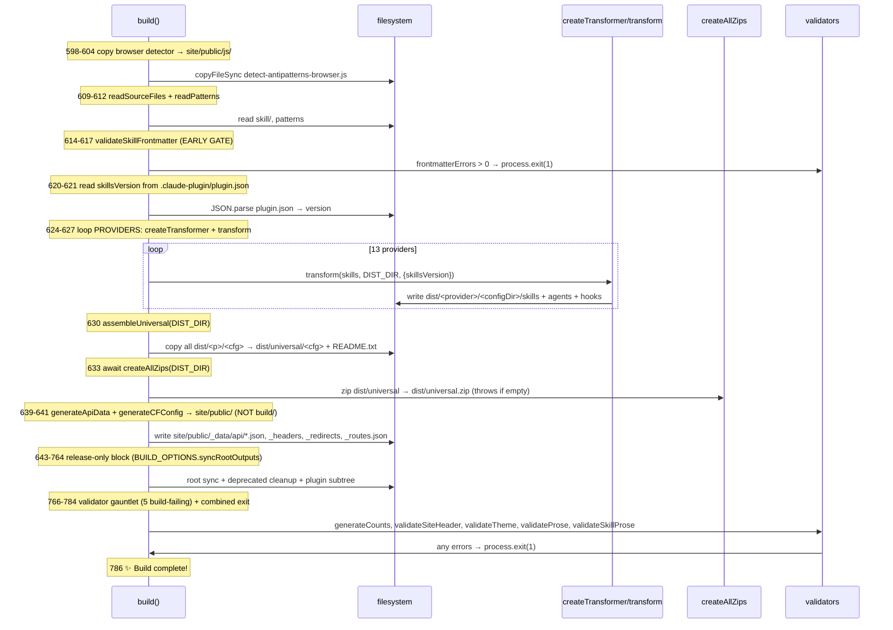
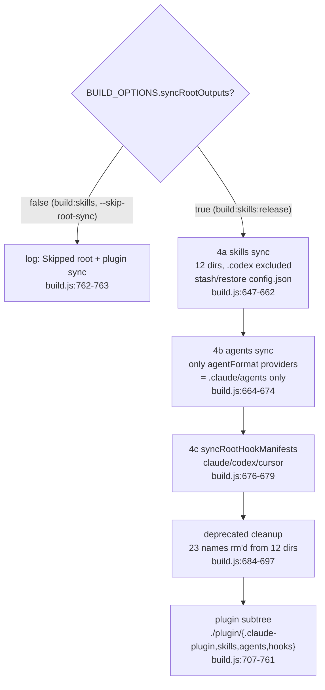
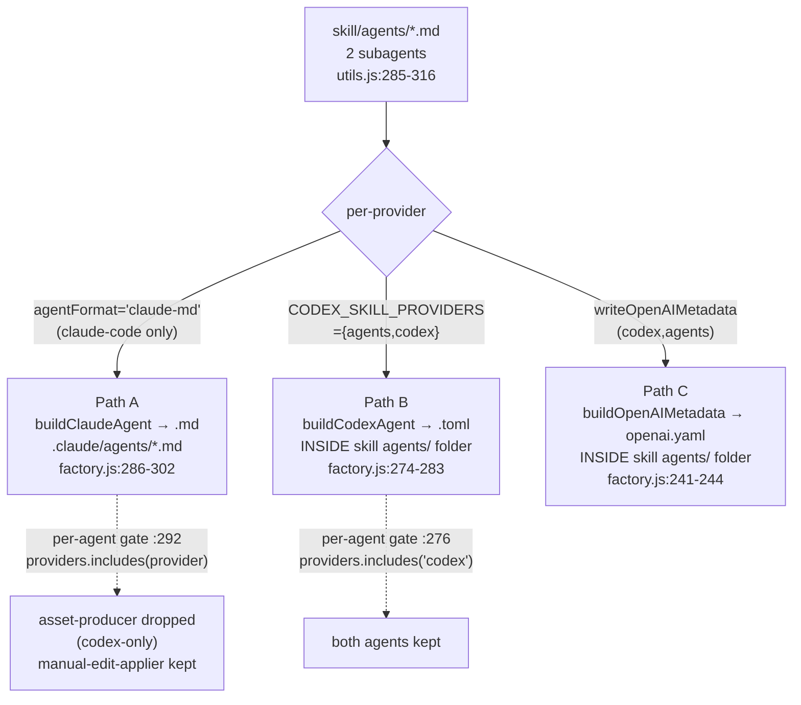
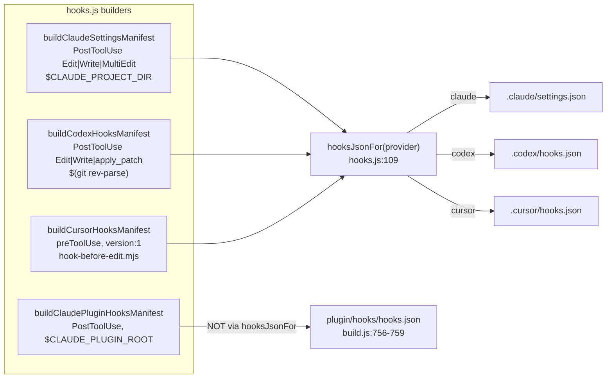
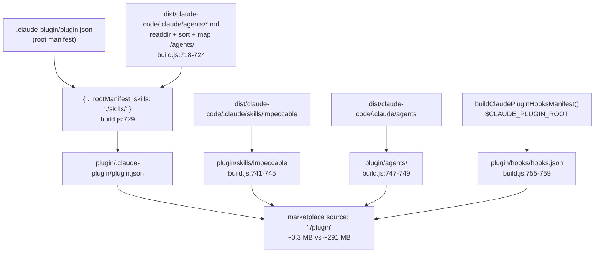
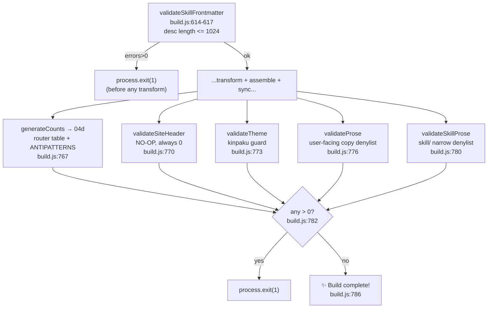

# Skill deep dive 04b — build orchestration, agents, hooks, and validators

Companion to [`04-skill-harness.md`](04-skill-harness.md). That report is the
overview. This one goes to the floor on everything that *wraps* the per-provider
transform: the `build()` flow itself, the default-vs-release split, universal
assembly and zipping, the root sync (with its `.codex` carve-out and per-project
artifact stash), the deprecated-skill cleanup, the slim plugin subtree, the
agents/subagent emission (claude-md vs nested codex `.toml` vs `openai.yaml`), the
hook-manifest generation, and the build-failing validator gauntlet.

Where [`04a-single-source-transform.md`](04a-single-source-transform.md) covers the
per-provider *transform* (placeholders, provider blocks, frontmatter assembly),
this report covers the orchestrator that calls it once per provider and then does
everything else. Count enforcement (`generateCounts` internals) belongs to
[`04d-command-metadata-and-pin.md`](04d-command-metadata-and-pin.md); install / CLI /
committed-output policy / versioning to
[`04e-distribution-and-install.md`](04e-distribution-and-install.md); the hook
*runtime* (`hook.mjs` / `hook-lib.mjs` / `hook-before-edit.mjs`, anti-nag,
fail-open) to [`../06-hook-system.md`](../06-hook-system.md). This report covers only
hook manifest *generation*.

All `file:line` references are into `../../source/` and were re-verified against the
working tree. Where the first-draft report or the upstream `CLAUDE.md` are stale,
the correction is stated inline.

---

## File map

| File | Lines | Role |
|---|---|---|
| [`scripts/build.js`](../../source/scripts/build.js) | 794 | The orchestrator. `build()` ordered sequence, the 6 validators + frontmatter gate, root sync, deprecated cleanup, plugin subtree, CF config. |
| [`scripts/lib/transformers/factory.js`](../../source/scripts/lib/transformers/factory.js) | 326 | `createTransformer(config)`. Per-provider transform plus the agents emission (claude-md top-level + nested codex `.toml` + `openai.yaml` sidecar) and per-provider hook emission. |
| [`scripts/lib/transformers/providers.js`](../../source/scripts/lib/transformers/providers.js) | 122 | The 13 provider configs. Carries `agentFormat`, `emitHooks`, `hooksManifestRel`, `writeOpenAIMetadata` per provider — the switches the orchestrator reads. |
| [`scripts/lib/transformers/index.js`](../../source/scripts/lib/transformers/index.js) | 19 | `PROVIDERS` + `createTransformer` re-export, plus 11 named `transformXxx` exports kept as test spy targets. |
| [`scripts/lib/transformers/hooks.js`](../../source/scripts/lib/transformers/hooks.js) | 120 | The 4 hook-manifest builders + `hooksJsonFor()` dispatch. Generation only; no runtime. |
| [`scripts/lib/zip.js`](../../source/scripts/lib/zip.js) | 71 | `createAllZips` / `createProviderZip`. Universal-only zip, with empty-zip guards that throw. |
| [`scripts/lib/api-data.js`](../../source/scripts/lib/api-data.js) | 98 | `generateApiData`: static API JSON written into `site/public/_data/api/`. |
| [`scripts/lib/utils.js`](../../source/scripts/lib/utils.js) | (large) | `readSourceFiles` (parses `skill/agents/*.md` into `skill.agents`), `stashPerProjectArtifacts` / `restorePerProjectArtifacts`. |
| [`skill/agents/impeccable-asset-producer.md`](../../source/skill/agents/impeccable-asset-producer.md) | 101 | Source subagent #1. `providers: codex` — Codex-only. |
| [`skill/agents/impeccable-manual-edit-applier.md`](../../source/skill/agents/impeccable-manual-edit-applier.md) | 103 | Source subagent #2. No `providers` field — emits everywhere a provider has `agentFormat`/`CODEX_SKILL_PROVIDERS`. |

Two structural facts to anchor on before the trace:

- **13 providers, 12 land at root.** `PROVIDERS` has 13 entries
  ([`providers.js:12-122`](../../source/scripts/lib/transformers/providers.js)):
  cursor, claude-code, gemini, codex, agents, github, kiro, opencode, pi, qoder,
  trae-cn, trae, rovo-dev. The root sync excludes `.codex`
  ([`build.js:647`](../../source/scripts/build.js)), so 12 dot-dirs land at the repo
  root. (The first-draft "every provider syncs to root" framing is wrong; `.codex`
  is dist-only.)
- **2 source subagents, not part of the skill body.** They live in
  `skill/agents/` and are parsed into `skill.agents` by `readSourceFiles`
  ([`utils.js:285-316`](../../source/scripts/lib/utils.js)), separate from the
  SKILL body and reference files.

---

## 1. `build()` — the ordered sequence

`build()` is one async function ([`build.js:590-787`](../../source/scripts/build.js))
wrapped in a `.catch` that exits non-zero
([`build.js:791-794`](../../source/scripts/build.js)). The order is load-bearing;
several steps depend on artifacts the previous step wrote.



### Step by step, with line refs

1. **Copy the browser detector** ([`build.js:598-604`](../../source/scripts/build.js)).
   `cli/engine/detect-antipatterns-browser.js` is copied into
   `site/public/js/` so the antipattern examples can load it. Guarded by an
   `existsSync` so a missing bundle is non-fatal.

2. **`readSourceFiles(ROOT_DIR)`** ([`build.js:609`](../../source/scripts/build.js)).
   Returns `{ skills }`. This is the parse that produces each skill object's
   `references`, `scripts`, and — critically for §6 — `agents` (parsed from
   `skill/agents/*.md`, [`utils.js:285-316`](../../source/scripts/lib/utils.js)).
   `readPatterns` ([`build.js:610`](../../source/scripts/build.js)) loads the
   pattern/antipattern catalogs for the API data.

3. **`validateSkillFrontmatter` — the early gate**
   ([`build.js:614-617`](../../source/scripts/build.js)). This is the *first*
   build-failing check and it runs *before* any transform. The function itself
   ([`build.js:115-126`](../../source/scripts/build.js)) only checks one thing
   today: that no skill `description` exceeds 1024 characters (the SKILL frontmatter
   limit). If `frontmatterErrors > 0`, `process.exit(1)` immediately — no dist is
   written. It is its own gate, separate from the §7 gauntlet, because a bad
   description would otherwise be baked into every provider before anything failed.

4. **Read `skillsVersion`** ([`build.js:620-621`](../../source/scripts/build.js)).
   `JSON.parse(...'.claude-plugin/plugin.json').version`. This is the canonical
   skills version; it is threaded into every transform as `{ skillsVersion }` and
   stamped into each `SKILL.md` frontmatter when `includeVersion` is set
   ([`factory.js:200`](../../source/scripts/lib/transformers/factory.js)). The same
   value is re-read independently by `generateApiData` for `version.json`
   ([`api-data.js:80-82`](../../source/scripts/lib/api-data.js)).

5. **Loop `PROVIDERS`** ([`build.js:624-627`](../../source/scripts/build.js)):

   ```js
   for (const config of Object.values(PROVIDERS)) {
     const transform = createTransformer(config);
     transform(skills, DIST_DIR, { skillsVersion });
   }
   ```

   13 iterations, each writing `dist/<provider>/<configDir>/`. The per-provider
   transform internals (placeholders, blocks, frontmatter) are
   [`04a`](04a-single-source-transform.md)'s topic; the agents and hook emission
   *inside* this loop are §6 and §7 below.

6. **`assembleUniversal(DIST_DIR)`** ([`build.js:441-485`](../../source/scripts/build.js),
   called at [`630`](../../source/scripts/build.js)). Wipes and recreates
   `dist/universal/`, then copies each `dist/<provider>/<configDir>` into
   `dist/universal/<configDir>`. Note this is keyed on `configDir`, so `.codex`
   **is** present in the universal bundle (the root-sync exclusion is separate). A
   `README.txt` listing all 11 visible dot-dir mappings is written
   ([`build.js:461-482`](../../source/scripts/build.js)) so macOS Finder users do
   not see an empty folder (every provider dir is a hidden dotfile).

7. **`await createAllZips(DIST_DIR)`** ([`build.js:633`](../../source/scripts/build.js)).
   See §3 — this is universal-only and throws on a zero-entry/zero-byte archive.

8. **`generateApiData` + `generateCFConfig`** ([`build.js:639-641`](../../source/scripts/build.js)) —
   both write into `site/public/`, **not** `build/`. The comment at
   [`build.js:636-638`](../../source/scripts/build.js) is the reason: Astro
   (`build:site`) wipes `build/` before writing, so anything dropped directly into
   `build/` during the skills build would be destroyed. By writing into
   `site/public/`, the files become Astro static inputs and Astro copies them into
   `build/` itself. `generateApiData` produces `_data/api/{skills,commands,patterns,version}.json`
   plus a `command-source/<id>.json` per skill
   ([`api-data.js:14-94`](../../source/scripts/lib/api-data.js)); `generateCFConfig`
   produces `_headers`, `_redirects`, `_routes.json`
   ([`build.js:500-585`](../../source/scripts/build.js)).

9. **Release-only block** ([`build.js:643-764`](../../source/scripts/build.js)),
   gated on `BUILD_OPTIONS.syncRootOutputs`. Root sync + deprecated cleanup +
   plugin subtree — §2 through §5.

10. **The validator gauntlet** ([`build.js:766-784`](../../source/scripts/build.js)) —
    5 build-failing checks, combined into one `process.exit(1)`. §7.

11. **`✨ Build complete!`** ([`build.js:786`](../../source/scripts/build.js)) only
    if every validator returned 0.

The outer wrapper is deliberate:

```js
build().catch((err) => {            // build.js:791-794
  console.error(`\n❌ Build failed: ${err.message}`);
  process.exit(1);
});
```

A rejected promise (e.g. the zip step throwing on an empty archive) must exit
non-zero so a broken artifact never deploys silently. So there are **three**
distinct non-zero exit paths: the frontmatter gate (step 3), the gauntlet (step 10),
and any thrown rejection (step 11).

> **YoinkIt steal — STEAL.** The fail-fast ordering is the lesson: cheap structural
> gates run *first* (frontmatter length, before any output), expensive
> content/correctness gates run *last* (after dist is assembled), and every gate is
> wired to a real non-zero exit. YoinkIt's capture pipeline has the same shape
> latent in it — a spec that is malformed (bad layer count, missing timeline)
> should fail the run before anything writes the `.animation.json`, and a spec that
> is *suspicious* (zero moved layers, the headless-capture footgun) should fail at
> emit. Adopt the "one combined exit at the end + immediate exit for structural
> impossibility" split rather than letting a half-bad spec ship.

---

## 2. The default-vs-release split

The single switch is `parseBuildOptions`
([`build.js:427-432`](../../source/scripts/build.js)):

```js
function parseBuildOptions(argv = process.argv.slice(2)) {
  const skipRootSync = argv.includes('--skip-root-sync') || argv.includes('--no-root-sync');
  return { syncRootOutputs: !skipRootSync };
}
const BUILD_OPTIONS = parseBuildOptions();          // build.js:434
```

The package.json scripts wire the flag
([`package.json:43-52`](../../source/package.json)):

| Script | Expands to | Root sync? |
|---|---|---|
| `build:skills` | `bun run scripts/build.js --skip-root-sync` | **no** |
| `build:skills:release` | `bun run scripts/build.js` | **yes** |
| `build` | `build:skills && build:site && cp -R dist build/_data/dist` | **no** |
| `build:release` | `build:skills:release && build:site && cp -R …` | **yes** |
| `rebuild` / `rebuild:release` | `clean && build` / `clean && build:release` | no / yes |

**Correction to the upstream `CLAUDE.md`:** that file says "`bun run build:release`
... sync root harness dirs" — which is true at the top level, but the *actual*
`--skip-root-sync` decision is made by `build:skills` vs `build:skills:release`
([`package.json:43-44`](../../source/package.json)). `build` and `build:release`
are thin wrappers that pick one of those two and then run Astro. So the precise
statement is: **`build:skills` (default path) passes `--skip-root-sync`;
`build:skills:release` does not.**

Why the split exists: feature PRs should be source-first. The committed harness
dirs (`.claude/skills/`, `.cursor/skills/`, …) are *generated distribution
artifacts*, and regenerating them on every `bun run build` would put a giant noisy
diff into every feature PR. The default `build` validates the source (it still runs
the full validator gauntlet — those are *not* gated on `syncRootOutputs`) without
touching the committed permutations. Only the release path
(`.github/workflows/sync-generated-output.yml`, or a human running
`build:release`) refreshes the tracked output. See
[`04e`](04e-distribution-and-install.md) for the committed-output policy in full.

---

## 3. Universal assembly + zips

`assembleUniversal` (§1 step 6) builds `dist/universal/` from the 13 per-provider
outputs. The zip step then archives only that one directory:

```js
export async function createAllZips(distDir) {        // zip.js:67-71
  console.log('\n📦 Creating ZIP bundles...');
  await createProviderZip(path.join(distDir, 'universal'), distDir, 'universal');
}
```

So despite the plural name, **only `universal.zip` is produced** — there are no
per-provider zips today. `createProviderZip`
([`zip.js:20-61`](../../source/scripts/lib/zip.js)) uses `archiver` v8's
`ZipArchive` class (v8 went ESM and dropped the factory function — note the
class-import comment at [`zip.js:11-12`](../../source/scripts/lib/zip.js)) and
globs `**/*` with `dot: true` (so the dot-dirs are included) and
`ignore: ['**/.DS_Store']`.

The hardening here is the interesting part and is explicitly a scar:

```js
archive.on('entry', () => { entryCount += 1; });      // zip.js:40
...
if (entryCount === 0) {                                // zip.js:51-53
  throw new Error(`Created ${zipFileName} but it contains no entries (source: ${providerDir}).`);
}
const { size } = statSync(zipPath);                    // zip.js:54
if (size === 0) {                                      // zip.js:55-57
  throw new Error(`Created ${zipFileName} but it is 0 bytes.`);
}
```

The comment at [`zip.js:28-31`](../../source/scripts/lib/zip.js) records why:
archiver v8's ESM break "previously failed here silently and shipped a 0-byte
`universal.zip`". The throw propagates to `build().catch` (§1 step 11) and exits
non-zero. This artifact is what `npx impeccable skills install` downloads, so a
0-byte zip would have silently broken every install.

> **YoinkIt steal — STEAL.** "Never ship an empty artifact" is directly
> transferable. YoinkIt's `dump()` can legitimately return a spec with zero moved
> layers — and that is exactly the headless-capture failure the project warns
> about. A capture harness should assert the spec is non-empty (entry count > 0,
> at least one layer with a timeline) and *throw* rather than write a confident-looking
> but empty `.animation.json`. Count entries, assert non-zero, fail loud.

---

## 4. The root sync (release-only)

`build.js:643-699`. Four sub-operations, all under `if (BUILD_OPTIONS.syncRootOutputs)`.

### 4a. Skills sync with the `.codex` carve-out

```js
const syncConfigs = Object.values(PROVIDERS)
  .filter(({ configDir }) => configDir !== '.codex');     // build.js:647
for (const { provider, configDir } of syncConfigs) {
  const skillsSrc  = path.join(DIST_DIR, provider, configDir, 'skills');
  const skillsDest = path.join(ROOT_DIR, configDir, 'skills');
  if (fs.existsSync(skillsSrc)) {
    const stashed = stashPerProjectArtifacts(skillsDest);   // build.js:657
    if (fs.existsSync(skillsDest)) fs.rmSync(skillsDest, { recursive: true });
    copyDirSync(skillsSrc, skillsDest);                     // build.js:659
    restorePerProjectArtifacts(skillsDest, stashed);        // build.js:660
  }
}
```

`dist/<provider>/<configDir>/skills` → `<repo-root>/<configDir>/skills`. The
`.codex` filter at [`build.js:647`](../../source/scripts/build.js) is why **12**
dot-dirs land at root, not 13: Codex no longer consumes the `.codex/` layout (it
reads skills from `.agents/skills/`), so the generated Codex bundle stays under
`dist/` only ([`build.js:644-646`](../../source/scripts/build.js) comment). `.codex`
is still in `dist/universal/` (§1 step 6) — the carve-out is *root-only*.

**The stash/restore is a destroy-on-rebuild guard.** Each provider's `skills` dir
is `rm`'d and recopied. But the build intentionally does not ship per-project
runtime state — e.g. live-mode's `config.json` — so a naive `rm + copy` would
delete a user's local config on every release rebuild. `stashPerProjectArtifacts`
([`utils.js:29`](../../source/scripts/lib/utils.js)) reads anything in
`PER_PROJECT_SCRIPT_ARTIFACTS` (`new Set(['config.json'])`,
[`utils.js:10`](../../source/scripts/lib/utils.js)) into memory before the `rm`;
`restorePerProjectArtifacts` ([`utils.js:47`](../../source/scripts/lib/utils.js))
writes it back after the copy. The build's own output never contains these files;
the stash exists purely to survive them across the `rm`.

### 4b. Agents sync

```js
for (const { provider, configDir, agentFormat } of Object.values(PROVIDERS)) {
  if (!agentFormat) continue;                               // build.js:665
  const agentsSrc  = path.join(DIST_DIR, provider, configDir, 'agents');
  const agentsDest = path.join(ROOT_DIR, configDir, 'agents');
  if (fs.existsSync(agentsDest)) fs.rmSync(agentsDest, { recursive: true, force: true });
  if (fs.existsSync(agentsSrc)) copyDirSync(agentsSrc, agentsDest);
}
```

Only providers with `agentFormat` get a top-level `agents/` synced to root — and
**only `claude-code` sets `agentFormat`** (`'claude-md'`,
[`providers.js:29`](../../source/scripts/lib/transformers/providers.js)). So in
practice this loop syncs exactly one dir: `.claude/agents/`. (The codex `.toml`
agents ride *inside* `.agents/skills/impeccable/agents/` and are carried by the
skills sync in 4a, not here — §6.)

### 4c. `syncRootHookManifests`

[`build.js:676-679`](../../source/scripts/build.js) calls
`syncRootHookManifests(ROOT_DIR)` ([`build.js:407-420`](../../source/scripts/build.js)):

```js
for (const config of Object.values(PROVIDERS)) {
  if (!config.emitHooks) continue;
  const manifest = hooksJsonFor(config.emitHooks);
  if (!manifest) continue;
  const rel = config.hooksManifestRel || path.join('hooks', 'hooks.json');
  const dest = path.join(rootDir, config.configDir, rel);
  fs.mkdirSync(path.dirname(dest), { recursive: true });
  fs.writeFileSync(dest, JSON.stringify(manifest, null, 2) + '\n');
}
```

This regenerates the hook manifest at the root for each provider that opts in via
`emitHooks` — claude (`.claude/settings.json`), codex (`.codex/hooks.json`), cursor
(`.cursor/hooks.json`). Manifest *shapes* are §7; this is just where the root copies
are written.



> **YoinkIt steal — ADAPT.** The stash/restore around a destructive recopy is the
> transferable shape, and YoinkIt has a direct analogue: the agent-browser repo
> wrapper deliberately *does not* ship per-project capture artifacts
> (`*.animation.json` is gitignored), yet a regen of the skill copies (codex ⇄
> claude) must not clobber a captured spec sitting in a working dir. If YoinkIt
> ever scripts the two-skill sync, lift the `PER_PROJECT_*` set + stash/restore
> pattern verbatim so a sync never eats a local capture. The `.codex` carve-out is
> also a model: a generated layout that is *built but not synced to root* is exactly
> how you'd keep one of YoinkIt's two skill copies as dist-only if it ever became
> legacy.

---

## 5. Deprecated-skill cleanup — the gravestones

[`build.js:684-697`](../../source/scripts/build.js). After the skills sync, a fixed
list of names is `rm`'d from each of the 12 synced root dirs:

```js
const deprecatedLocalSkills = [
  'frontend-design', 'teach-impeccable',
  'arrange', 'normalize', 'onboard', 'extract',
  // v3.0 consolidation: standalone skills -> /impeccable sub-commands
  'adapt', 'animate', 'audit', 'bolder', 'clarify', 'colorize',
  'critique', 'delight', 'distill', 'harden', 'layout', 'optimize',
  'overdrive', 'polish', 'quieter', 'shape', 'typeset',
];
for (const { configDir } of syncConfigs) {
  for (const name of deprecatedLocalSkills) {
    const p = path.join(ROOT_DIR, configDir, 'skills', name);
    if (fs.existsSync(p)) fs.rmSync(p, { recursive: true, force: true });
  }
}
```

**Correction:** the first-draft report called this "17". The list is **23 names**
(verified by count). It is two cohorts:

- **6 pre-v3.0 shims**: `frontend-design`, `teach-impeccable`, `arrange`,
  `normalize`, `onboard`, `extract`.
- **17 v3.0-consolidated** standalone skills that became `/impeccable` sub-commands:
  `adapt`, `animate`, `audit`, `bolder`, `clarify`, `colorize`, `critique`,
  `delight`, `distill`, `harden`, `layout`, `optimize`, `overdrive`, `polish`,
  `quieter`, `shape`, `typeset`.

These are the gravestones of the pre-v3.0 era when *every command was a top-level
skill* and polluted the `/` menu. The consolidation collapsed them into one
`impeccable` skill with a command router; this cleanup ensures a release rebuild
deletes any stale top-level skill dir that a prior build left behind, so the repo's
own harness dirs stay clean.

**The `onboard`/`extract` subtlety worth pinning:** both appear here as *deprecated
standalone skills*, yet `onboard` and `extract` still exist as *sub-commands* of
`/impeccable` (they live as `reference/*.md` entries under the one skill). There is
no contradiction: what is deleted is the old *top-level skill directory*
`.claude/skills/onboard/`; the *capability* survives as `/impeccable onboard`,
routed inside the single skill. The cleanup targets directory clutter, not the
command. They exist in `dist/` as redirect stubs (so the install cleanup script can
point users at the new form) but are scrubbed from the repo's own dirs
([`build.js:681-683`](../../source/scripts/build.js) comment).

> **YoinkIt steal — AVOID.** This list is a maintenance liability: a hand-kept array
> of 23 string literals that must be edited every time a skill is renamed or
> retired, with no test that it stays in sync with the actual set of retired
> commands. YoinkIt's whole thesis is that hand-maintaining two parallel skill
> copies is the bug; this is the same anti-pattern in miniature (a hand-maintained
> denylist of gravestones). If YoinkIt ever needs a "remove stale outputs" step,
> derive the deletion set from data (diff the built set against the on-disk set),
> never from a literal list someone has to remember to update.

---

## 6. Agents / subagent emission

This is the part most likely to be rebuilt wrong, because there are **three
distinct emission paths** for the 2 source subagents, and they fire for different
provider sets. Source: the agents loop in `transform`
([`factory.js:286-302`](../../source/scripts/lib/transformers/factory.js)), the
nested-codex block ([`factory.js:274-283`](../../source/scripts/lib/transformers/factory.js)),
the `openai.yaml` sidecar ([`factory.js:241-244`](../../source/scripts/lib/transformers/factory.js)),
and `CODEX_SKILL_PROVIDERS` ([`factory.js:57`](../../source/scripts/lib/transformers/factory.js)).

### The source: 2 subagents with per-agent gating

`skill.agents` is populated by `readSourceFiles`
([`utils.js:285-316`](../../source/scripts/lib/utils.js)) from `skill/agents/*.md`.
Each agent object carries `codexName` / `claudeName` / `tools` / `model` / `effort`
/ `maxTurns` / `nicknameCandidates` / `providers` / `body`, mapped from frontmatter
([`utils.js:301-314`](../../source/scripts/lib/utils.js)). The `providers` field
([`utils.js:294-300`](../../source/scripts/lib/utils.js)) accepts an array or a
comma string and is the per-agent gate. The two source agents:

- `impeccable-asset-producer.md`: `providers: codex`
  ([`impeccable-asset-producer.md:9`](../../source/skill/agents/impeccable-asset-producer.md)) —
  Codex-only.
- `impeccable-manual-edit-applier.md`: **no `providers` field** — ships everywhere a
  provider has an agent-emission path.

### Path A — top-level `claude-md` agents → `.claude/agents/*.md`

[`factory.js:286-302`](../../source/scripts/lib/transformers/factory.js), gated on
`config.agentFormat`:

```js
if (config.agentFormat) {                                   // factory.js:286
  const agentsDir = path.join(providerDir, `${configDir}/agents`);
  for (const skill of skills) {
    for (const agent of skill.agents || []) {
      if (agent.providers && !agent.providers.includes(provider)) continue;  // 292
      ...
      const agentFile = buildAgentFile(config, agent, body); // 295
      if (!agentFile) continue;
      ensureDir(agentsDir);
      writeFile(path.join(agentsDir, agentFile.filename), agentFile.content);
    }
  }
}
```

**Only `claude-code` sets `agentFormat`** (`'claude-md'`,
[`providers.js:29`](../../source/scripts/lib/transformers/providers.js)). So this
loop fires once, for claude-code, and emits to `dist/claude-code/.claude/agents/`.
The per-agent gate at [`factory.js:292`](../../source/scripts/lib/transformers/factory.js)
filters out `asset-producer` (its `providers: ['codex']` does not include
`'claude-code'`), so only `manual-edit-applier` lands as `.claude/agents/impeccable-manual-edit-applier.md`.
`buildAgentFile` → `buildClaudeAgent` ([`factory.js:118-130`](../../source/scripts/lib/transformers/factory.js))
emits YAML frontmatter (`name`, `description`, and conditionally `tools`/`model`/`effort`/`maxTurns`)
+ the body.

### Path B — nested codex `.toml` inside the skill's `agents/` folder

[`factory.js:274-283`](../../source/scripts/lib/transformers/factory.js), gated on
`CODEX_SKILL_PROVIDERS = new Set(['agents', 'codex'])`
([`factory.js:57`](../../source/scripts/lib/transformers/factory.js)):

```js
if (CODEX_SKILL_PROVIDERS.has(provider)) {                  // factory.js:274
  for (const agent of skill.agents || []) {
    if (agent.providers && !agent.providers.includes('codex')) continue;     // 276
    ...
    const filename = `${agent.codexName || agent.name.replace(/-/g, '_')}.toml`;
    ensureDir(path.join(skillDir, 'agents'));
    writeFile(path.join(skillDir, 'agents', filename), buildCodexAgent(agent, agentBody));
  }
}
```

This runs *inside the per-skill loop* (not the separate agents loop), so the `.toml`
is written **into the skill's own `agents/` folder** —
`dist/agents/.agents/skills/impeccable/agents/*.toml` and the `.codex` mirror.
Codex auto-discovers agents nested in an installed skill, so this in-skill copy is
the whole delivery; no separate `.codex/agents/` sidecar is needed
([`factory.js:53-57,270-273`](../../source/scripts/lib/transformers/factory.js)
comments). The gate at [`factory.js:276`](../../source/scripts/lib/transformers/factory.js)
is hardcoded to `'codex'` (not `provider`), so both `agents` and `codex` providers
emit the codex-shaped agent. `buildCodexAgent`
([`factory.js:100-116`](../../source/scripts/lib/transformers/factory.js)) emits TOML:
`name`, `description`, conditional `model_reasoning_effort` and
`nickname_candidates`, then `developer_instructions` as a TOML multi-line string.
Here, *both* source agents qualify (asset-producer is `providers: codex`,
manual-edit-applier is ungated), so both `.toml` files ship inside the codex/agents
skill bundles.

### Path C — `agents/openai.yaml` sidecar

[`factory.js:241-244`](../../source/scripts/lib/transformers/factory.js), gated on
`config.writeOpenAIMetadata`:

```js
if (writeOpenAIMetadata) {                                  // factory.js:241
  const openaiMetadata = buildOpenAIMetadata(skill);
  writeFile(path.join(skillDir, 'agents', 'openai.yaml'), generateYamlDocument(openaiMetadata));
}
```

`writeOpenAIMetadata: true` on exactly two providers — codex and agents
([`providers.js:47,62`](../../source/scripts/lib/transformers/providers.js)). It is
*skill* metadata (display name, short description, default prompt;
[`buildOpenAIMetadata`, factory.js:73-82](../../source/scripts/lib/transformers/factory.js)),
not agent metadata, and is written once per skill into the skill's `agents/` folder
alongside the codex `.toml`.



### Correction: the `codex-toml` branch of `buildAgentFile` is dead

`buildAgentFile` ([`factory.js:132-148`](../../source/scripts/lib/transformers/factory.js))
has a `config.agentFormat === 'codex-toml'` branch at
[`factory.js:133-138`](../../source/scripts/lib/transformers/factory.js). **No
provider config sets `agentFormat: 'codex-toml'`** — the only `agentFormat` value in
`providers.js` is `'claude-md'` (verified: `grep agentFormat providers.js` returns
only [`line 29`](../../source/scripts/lib/transformers/providers.js) plus a comment).
Therefore that branch is **effectively dead code**: `buildAgentFile` is only ever
reached from the top-level agents loop ([`factory.js:295`](../../source/scripts/lib/transformers/factory.js)),
which only runs when `config.agentFormat` is truthy, and the only truthy value is
`'claude-md'`. The codex `.toml` ships exclusively via Path B (the nested
`CODEX_SKILL_PROVIDERS` block), which calls `buildCodexAgent` *directly*
([`factory.js:281`](../../source/scripts/lib/transformers/factory.js)), bypassing
`buildAgentFile` entirely. The `codex-toml` branch is a fossil of an earlier design
where Codex agents were emitted as top-level sidecars; the nested-in-skill delivery
replaced it but the dead branch was never removed.

### Correction: 11 of 13 providers have named-export spies

`index.js` ([`index.js:7-17`](../../source/scripts/lib/transformers/index.js))
defines 11 `transformXxx` named exports (cursor, claude-code, gemini, codex, agents,
github, kiro, opencode, pi, qoder, rovo-dev). **`trae` and `trae-cn` have no
named-export spies** — the list stops at `transformRovoDev` and never adds the two
Trae variants. These exports exist only as stable `spyOn` targets for
`tests/build.test.js` ([`index.js:4-6`](../../source/scripts/lib/transformers/index.js)
comment); `build.js` itself uses `createTransformer + PROVIDERS` directly
([`build.js:23,624-626`](../../source/scripts/build.js)). So the Trae providers are
exercised by the real build loop but are not individually spy-able in tests — a gap
worth noting if a test needs to assert Trae-specific transform behavior.

> **YoinkIt steal — ADAPT for emission, AVOID the drift.** The per-agent `providers:`
> gate is exactly the right primitive: one source subagent declares *which harnesses
> it ships to*, and the build fans it out. That is the model YoinkIt should use if it
> ever ships subagents — declare provider applicability *on the artifact*, not in the
> build script. But the dead `codex-toml` branch and the trae spy gap are the
> cautionary half: a single-source build accumulates fossils (dead branches, partial
> test coverage) exactly because it is more abstract than the two hand-maintained
> copies YoinkIt has today. Steal the build discipline, but pair it with a "no dead
> emission branches" rule and complete spy coverage, or you trade two honest copies
> for one lying abstraction.

---

## 7. Hook-manifest generation

[`hooks.js`](../../source/scripts/lib/transformers/hooks.js). Four builders + one
dispatcher. **This section is generation only.** The hook *runtime* — what
`hook.mjs` / `hook-lib.mjs` / `hook-before-edit.mjs` actually do (anti-nag, the
fail-open behavior, the detector invocation) — is [`../06-hook-system.md`](../06-hook-system.md).

### The four builders

| Builder | Provider | Event matcher | Command path | Schema note |
|---|---|---|---|---|
| `buildClaudeSettingsManifest` ([`hooks.js:28-47`](../../source/scripts/lib/transformers/hooks.js)) | claude | `PostToolUse` `Edit\|Write\|MultiEdit` | `${CLAUDE_PROJECT_DIR}/.claude/skills/impeccable/scripts/hook.mjs` | written to `settings.json` |
| `buildCodexHooksManifest` ([`hooks.js:74-93`](../../source/scripts/lib/transformers/hooks.js)) | codex | `PostToolUse` `Edit\|Write\|apply_patch` | `$(git rev-parse --show-toplevel)/.agents/skills/impeccable/scripts/hook.mjs` | written to `.codex/hooks.json` |
| `buildCursorHooksManifest` ([`hooks.js:95-107`](../../source/scripts/lib/transformers/hooks.js)) | cursor | `preToolUse` (blocks *before* write) | `.cursor/skills/impeccable/scripts/hook-before-edit.mjs` | `version: 1`; written to `.cursor/hooks.json` |
| `buildClaudePluginHooksManifest` ([`hooks.js:53-72`](../../source/scripts/lib/transformers/hooks.js)) | (plugin) | `PostToolUse` `Edit\|Write\|MultiEdit` | `${CLAUDE_PLUGIN_ROOT}/skills/impeccable/scripts/hook.mjs` | **not** in `hooksJsonFor`; §5 plugin subtree only |

Shared constants: `TIMEOUT_SECONDS = 5`, `STATUS_MESSAGE = 'Checking UI changes'`
([`hooks.js:21-22`](../../source/scripts/lib/transformers/hooks.js)). The path
constants are at [`hooks.js:23-26`](../../source/scripts/lib/transformers/hooks.js).

The three meaningful axes of variation:

1. **When it fires.** Claude and Codex are `PostToolUse` (detect *after* the edit,
   surface findings as a system reminder). Cursor is `preToolUse` and *blocks before
   the write* via a different script (`hook-before-edit.mjs`). Codex adds
   `apply_patch` to the matcher because that is Codex's edit primitive.

2. **How the script path resolves.** Claude project-local uses
   `${CLAUDE_PROJECT_DIR}`; the plugin variant uses `${CLAUDE_PLUGIN_ROOT}` so it
   stays correct wherever Claude Code unpacks the plugin
   ([`hooks.js:49-52`](../../source/scripts/lib/transformers/hooks.js) comment).
   Codex uses a shell `$(git rev-parse --show-toplevel)` because it has no
   project-dir variable. Cursor uses a plain relative path.

3. **Schema shape.** Claude/codex emit `{ description, hooks: { PostToolUse: [...] } }`.
   Cursor emits `{ version: 1, hooks: { preToolUse: [...] } }` — no description, a
   `version` field, lowercase event key.

### Dispatch and per-provider wiring

`hooksJsonFor(provider)` ([`hooks.js:109-120`](../../source/scripts/lib/transformers/hooks.js))
selects claude/codex/cursor and returns `null` for anything else:

```js
switch (provider) {
  case 'claude':  return buildClaudeSettingsManifest();
  case 'codex':   return buildCodexHooksManifest();
  case 'cursor':  return buildCursorHooksManifest();
  default:        return null;
}
```

`buildClaudePluginHooksManifest` is **deliberately not** in this switch. It is
imported directly by `build.js` ([`build.js:24`](../../source/scripts/build.js)) and
called only when writing the plugin subtree's `hooks/hooks.json`
([`build.js:756-759`](../../source/scripts/build.js)). The `${CLAUDE_PLUGIN_ROOT}`
path makes no sense for a project-local install, so it is kept out of the generic
dispatcher.

Per-provider, the transform decides whether to emit a hook manifest at all via
`config.emitHooks` ([`factory.js:308-315`](../../source/scripts/lib/transformers/factory.js)),
and the destination filename via `config.hooksManifestRel`. From `providers.js`:

- cursor → `emitHooks: 'cursor'`, `hooksManifestRel: 'hooks.json'`
  ([`providers.js:19-21`](../../source/scripts/lib/transformers/providers.js)).
  Cursor reads `.cursor/hooks.json`, *not* `.cursor/hooks/hooks.json`.
- claude-code → `emitHooks: 'claude'`, `hooksManifestRel: 'settings.json'`
  ([`providers.js:30-32`](../../source/scripts/lib/transformers/providers.js)).
  Claude project-local hooks live in `.claude/settings.json`, not a separate hooks
  file.
- codex → `emitHooks: 'codex'`, `hooksManifestRel: 'hooks.json'`
  ([`providers.js:51-53`](../../source/scripts/lib/transformers/providers.js)).

The `hooksManifestRel` default (when a provider opts into hooks without overriding)
is `hooks/hooks.json` ([`factory.js:311`](../../source/scripts/lib/transformers/factory.js)),
but all three hook providers override it, so the default is never used in practice
today. The same `emitHooks`/`hooksManifestRel` pair drives both the per-provider dist
emission ([`factory.js:308-315`](../../source/scripts/lib/transformers/factory.js))
and the root sync ([`build.js:407-420`](../../source/scripts/build.js)).



> **YoinkIt steal — STEAL the manifest/runtime split.** Impeccable keeps manifest
> *generation* (declarative JSON shapes, one builder per provider) cleanly separate
> from the runtime script the manifest points at. The per-provider variation is
> entirely in the manifest (event name, matcher, path-resolution variable);
> `hook.mjs` is one shared script. That is precisely the discipline YoinkIt should
> hold if it ever ships a capture-trigger hook across harnesses: one engine, N thin
> declarative manifests describing *when* and *how* each harness invokes it. Do not
> fork the engine per harness; fork only the manifest.

---

## 8. The plugin subtree (release-only)

[`build.js:707-761`](../../source/scripts/build.js). After the root sync, a slim
`./plugin/` directory is built. The motivation is in the comment at
[`build.js:701-706`](../../source/scripts/build.js): the Claude Code marketplace is
configured with `source: "./plugin"`, so the plugin cache copies only this slim
directory (~0.3 MB) instead of the entire monorepo (~291 MB on the previous `"./"`
source). The harness dirs stay where they are because `npx skills add` reads them
from the GitHub repo at install time.

The build first wipes the four plugin subdirs
([`build.js:712-715`](../../source/scripts/build.js)) then rebuilds:

### 8a. `plugin/.claude-plugin/plugin.json`

```js
const rootManifest = JSON.parse(fs.readFileSync('.claude-plugin/plugin.json'));   // build.js:717
...
const pluginManifest = { ...rootManifest, skills: './skills/' };                   // build.js:729
if (pluginAgentEntries.length) pluginManifest.agents = pluginAgentEntries;         // 730-734
```

The manifest is the root manifest spread, with `skills` overridden to `'./skills/'`
(**trailing slash**, [`build.js:729`](../../source/scripts/build.js)). The
[`build.js:726-728`](../../source/scripts/build.js) comment ties this to issue #86:
3 reporters converged on "add trailing slash to fix slash commands not registering",
and the documented schema example uses `"./custom/skills/"` form. The `agents` list
is derived from the actual `.md` files in `dist/claude-code/.claude/agents`
([`build.js:718-724`](../../source/scripts/build.js)), sorted, mapped to
`./agents/<file>` — so it stays in sync with whatever Path A (§6) emitted, rather
than being hardcoded.

### 8b. skills + agents copy

`dist/claude-code/.claude/skills/impeccable` → `plugin/skills/impeccable`
([`build.js:741-745`](../../source/scripts/build.js)); the claude agents dir →
`plugin/agents/` ([`build.js:747-749`](../../source/scripts/build.js)). So the plugin
carries exactly the claude-code skill bundle plus its agents.

### 8c. `plugin/hooks/hooks.json`

```js
fs.mkdirSync(pluginHooksDir, { recursive: true });            // build.js:755
fs.writeFileSync(
  path.join(pluginHooksDir, 'hooks.json'),
  JSON.stringify(buildClaudePluginHooksManifest(), null, 2) + '\n',   // build.js:756-759
);
```

This is the *only* caller of `buildClaudePluginHooksManifest` (§7). Claude Code
auto-discovers `hooks/hooks.json` at a plugin root, so marketplace / `/plugin
install` users get the PostToolUse detector hook without it being merged into their
project `.claude/settings.json` (that merge is the CLI's job, see
[`04e`](04e-distribution-and-install.md)). The `${CLAUDE_PLUGIN_ROOT}` path is what
makes this work regardless of where the plugin is unpacked.



> **YoinkIt steal — STEAL the slim-subtree pattern.** "Don't make the marketplace
> copy your whole monorepo" is a clean, measurable win (0.3 MB vs 291 MB). The
> deeper transferable idea: the *distribution unit* should be assembled, not equal
> to the source tree. YoinkIt ships an MV3 extension + a snippet + skill copies out
> of one repo; if any of those ever gets a marketplace/registry presence, build a
> dedicated slim subtree for it rather than pointing the registry at repo root. The
> trailing-slash issue #86 is also a real lesson: copy the *documented* schema form
> exactly, even when an omitted character "looks fine".

---

## 9. The validator gauntlet

[`build.js:766-784`](../../source/scripts/build.js). After all output is written,
**5 build-failing validators** run late and their errors are summed into one
`process.exit(1)`. This is in addition to the *early* `validateSkillFrontmatter`
gate (§1 step 3), which runs before any transform. So there are 6 build-failing
checks total: 1 early structural gate + 5 late content/correctness checks.

```js
const countErrors      = generateCounts(ROOT_DIR, skills, buildDir);   // 767
const headerErrors     = validateSiteHeader(ROOT_DIR);                 // 770
const themeErrors      = validateTheme(ROOT_DIR);                      // 773
const proseErrors      = validateProse(ROOT_DIR);                      // 776
const skillProseErrors = validateSkillProse(ROOT_DIR);                 // 780

if (countErrors > 0 || headerErrors > 0 || themeErrors > 0 ||
    proseErrors > 0 || skillProseErrors > 0) {
  process.exit(1);                                                     // 782-784
}
```

**Correction:** the first-draft report listed only 4 validators and missed
`validateSiteHeader`. The full late set is 5, in source order:

1. **`generateCounts`** ([`build.js:33-113`](../../source/scripts/build.js), called
   at [`767`](../../source/scripts/build.js)). Counts active commands from the
   `/impeccable` router table (`^\| \`[^\`]+\` \|` regex against the SKILL body,
   [`build.js:42`](../../source/scripts/build.js)) and detection rules from the
   `ANTIPATTERNS` registry ([`build.js:55`](../../source/scripts/build.js)), writes
   `site/public/js/generated/counts.js`, then scans `index.astro`, `README.md`,
   `AGENTS.md`, `plugin.json`, `marketplace.json` for stale numeric counts and
   returns a non-zero error count if any disagree. *This is a one-paragraph summary
   on purpose:* count enforcement (the router-table parse, the changelog-strip
   logic, the dual command/detection patterns) is owned in depth by
   [`04d-command-metadata-and-pin.md`](04d-command-metadata-and-pin.md). Cross-link
   there.

2. **`validateSiteHeader`** ([`build.js:331-338`](../../source/scripts/build.js)).
   **Currently a no-op that always returns 0.** With Astro, the shared header is a
   component (`site/components/Header.astro`) imported by `Base.astro`, so there is
   nothing per-page to validate. It is kept as a 0-returning stub so the call site
   at [`build.js:770`](../../source/scripts/build.js) does not need to change. Worth
   knowing it is in the gauntlet (it is summed into the exit condition) but cannot
   currently fail — a placeholder for a check that the migration to Astro made
   redundant.

3. **`validateTheme`** ([`build.js:349-388`](../../source/scripts/build.js)) — the
   kinpaku token guard. Reads `site/styles/tokens.css` and fails if the retired
   light-mode palette is reintroduced: surfaces (`--color-paper/cream/bg`) must be a
   `var(--ks-*)` reference or a dark OKLCH (lightness < 35%)
   ([`build.js:360-370`](../../source/scripts/build.js)); the accent must not be the
   retired magenta (hue 300–360, [`build.js:373-380`](../../source/scripts/build.js)).
   Scoped to the token source only — page CSS may still use light values locally for
   the deliberate AI-slop demos.

4. **`validateProse`** ([`build.js:143-235`](../../source/scripts/build.js)) — the
   AI-tell denylist on **user-facing copy**. Scans `site/components`, `site/content`,
   `site/layouts`, `site/pages`, `README.md`, `README.npm.md`
   ([`build.js:144-151`](../../source/scripts/build.js)) over `.html/.md/.js/.mjs/.css/.astro`,
   *excluding* `site/pages/slop` ([`build.js:156`](../../source/scripts/build.js))
   because the slop catalog must contain the specimens it documents. Flags em dashes
   (`—` + HTML entities, [`build.js:157`](../../source/scripts/build.js)), the ` -- `
   substitute ([`build.js:194`](../../source/scripts/build.js)), and ~22 denylisted
   phrases each with a printed rationale ([`build.js:159-180`](../../source/scripts/build.js):
   `load-bearing`, `highest-leverage`, `seamless`, `robust`, `delve`, `elevate`,
   `empower`, `underscore`, `pivotal`, `tapestry`, `data-driven`, `moreover`,
   `furthermore`, etc.). Returns total occurrences; build fails if > 0.

5. **`validateSkillProse`** ([`build.js:250-323`](../../source/scripts/build.js)) — a
   *narrower* denylist on `skill/` only ([`build.js:251`](../../source/scripts/build.js)),
   `.md` files only. It enforces only the rules that "have no technical reading"
   ([`build.js:258-271`](../../source/scripts/build.js)): em dashes + a 12-entry
   subset (`load-bearing`, `data-driven`, `delve`, `tapestry`, throat-clearing
   openers, …). The comment at [`build.js:254-257`](../../source/scripts/build.js)
   is explicit about why it is narrower than `validateProse`: `skill/` is LLM-facing
   reference text where hardening repetition and triadic checklists are *intentional*,
   and where words like `seamless`/`robust` may have legitimate technical uses. Only
   `data-driven` and em-dash creep are policed there.



The shape: **generated-output correctness** (`generateCounts`), **theme regression**
(`validateTheme`), and **prose hygiene** (`validateProse` + `validateSkillProse`) are
all enforced *by the build* rather than left to review. The denylist is the editorial
brief in `docs/STYLE.md`, mechanically enforced, with each rule printing its
rationale so the next author understands the rejection.

> **YoinkIt steal — STEAL the executable-style-guide pattern, mind the no-op.**
> `validateProse` is the standout: a project that "kept getting called out for AI
> prose" turned its style guide into a build-failing regex denylist with printed
> rationales. That is *directly* applicable — YoinkIt's own user-facing docs and skill
> text could carry the same gate (Martin's global rule "no em dashes, no AI-style
> writing" is exactly this denylist). The two-tier split (strict on marketing copy,
> narrow on LLM-facing skill text where technical phrasing is legitimate) is a
> genuinely good idea worth copying wholesale. The *caution* is `validateSiteHeader`:
> a no-op kept in the gauntlet "so the call site doesn't change" is dead weight that
> reads as a real gate but cannot fail. When a check becomes redundant, delete it and
> its call site; don't leave a 0-returning stub pretending to guard something.

---

## 10. Rebuild checklist (for a fresh agent)

To reproduce this orchestration from scratch, the load-bearing facts:

- **`build()` order is fixed and dependency-driven**: detector copy → read source →
  *frontmatter gate (early exit)* → read version → 13-provider transform loop →
  universal assembly → zip → API/CF config *into `site/public/` (Astro wipes
  `build/`)* → release-only sync block → *5-validator gauntlet (combined exit)*. Plus
  the `build().catch` non-zero exit ([`build.js:791-794`](../../source/scripts/build.js)).
- **Default vs release** is one CLI flag: `build:skills` adds `--skip-root-sync`;
  `build:skills:release` does not ([`package.json:43-44`](../../source/package.json)).
  Default validates source without touching committed permutations; release refreshes
  them.
- **Root sync touches 12 dirs** (`.codex` excluded,
  [`build.js:647`](../../source/scripts/build.js)), stashes/restores per-project
  artifacts (`config.json`) across the destructive recopy, syncs only `agentFormat`
  agents (= `.claude/agents`), and regenerates hook manifests via `emitHooks`.
- **Deprecated cleanup is 23 hardcoded names** (6 shims + 17 v3.0-consolidated),
  `rm`'d from each synced dir; `onboard`/`extract` are deleted as *standalone skill
  dirs* but survive as `/impeccable` *sub-commands*.
- **Agents have 3 emission paths**: claude-md top-level (claude-code only, via
  `buildAgentFile`/`buildClaudeAgent`), nested codex `.toml` (CODEX_SKILL_PROVIDERS =
  {agents, codex}, via `buildCodexAgent` direct), `openai.yaml` sidecar
  (writeOpenAIMetadata = {codex, agents}). The `codex-toml` branch of `buildAgentFile`
  is dead; only 11 of 13 providers have spy exports (trae/trae-cn lack them).
- **Hook manifests** are generated by 4 builders; `hooksJsonFor` dispatches
  claude/codex/cursor; the plugin variant (`${CLAUDE_PLUGIN_ROOT}`) is wired only into
  the plugin subtree. Hook *runtime* is [`../06-hook-system.md`](../06-hook-system.md).
- **The plugin subtree** (`./plugin/`) is a slim assembled distribution unit (0.3 MB)
  with a trailing-slash `skills: './skills/'` (issue #86) and a plugin-root hook
  manifest, so the marketplace `source: "./plugin"` doesn't copy the 291 MB monorepo.
- **6 build-failing checks**: the early `validateSkillFrontmatter` gate, then the late
  5 (`generateCounts` → [`04d`](04d-command-metadata-and-pin.md); `validateSiteHeader`
  no-op; `validateTheme` kinpaku guard; `validateProse` user-facing denylist;
  `validateSkillProse` narrow skill denylist).

The single most transferable idea for YoinkIt across all of this: **the build is a
gauntlet of cheap-first, fail-loud gates around a fan-out, and the distribution unit
is assembled rather than equal to the source.** Steal that discipline; it is exactly
what would let YoinkIt collapse its two hand-maintained skill copies into one source
without losing the safety the two copies currently buy by hand.
