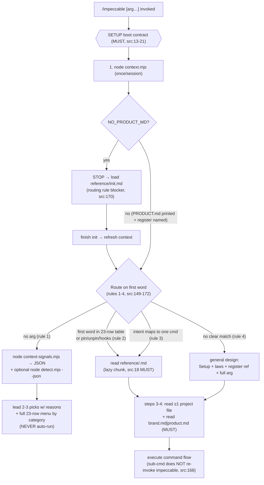
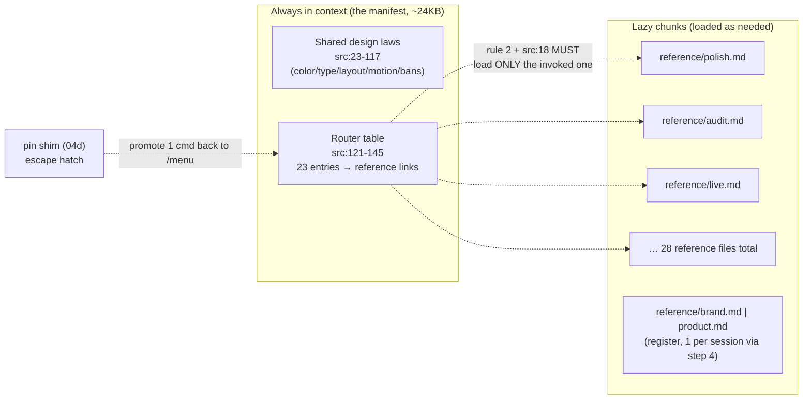
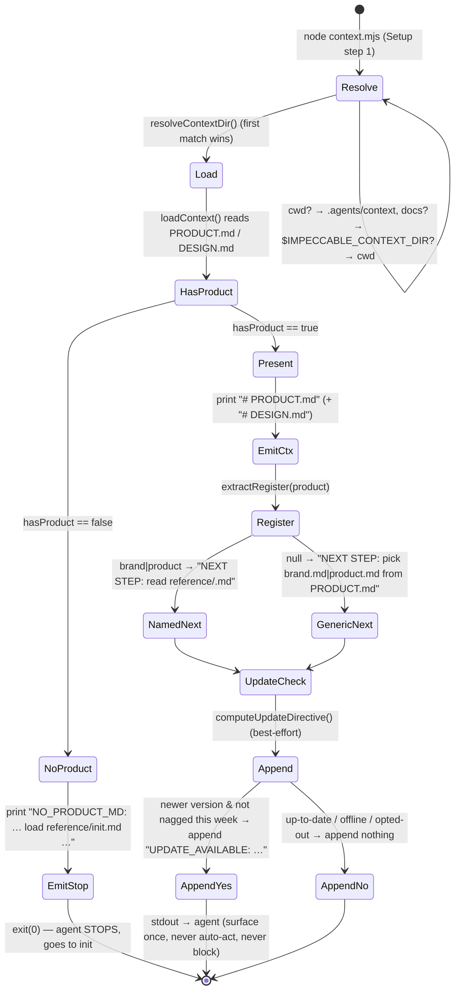
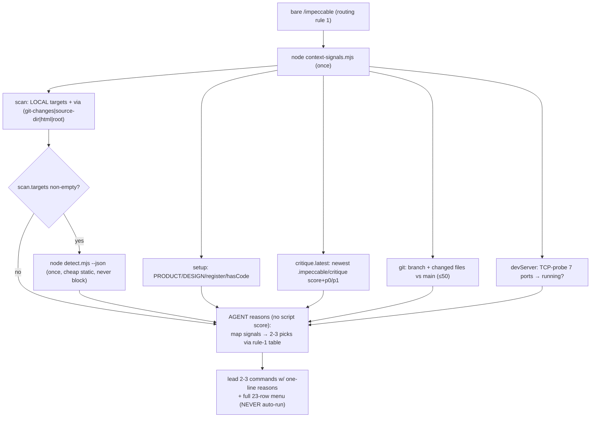

# Skill deep dive 04c — the runtime router and the context-gathering protocol

Companion to [`04-skill-harness.md`](04-skill-harness.md). That report is the
overview. This one goes to the floor on the single most transferable idea in the
subsystem for YoinkIt: **how a ~24 KB markdown file plus three tiny Node scripts
in the boot/menu routing path drive an arbitrary LLM deterministically — one
skill, 23 sub-commands, a once-per-session boot contract, and a no-LLM signal
gatherer.** Read this if a fresh agent is going to rebuild
YoinkIt's `map → capture` skill as one router instead of two hand-kept copies
(`skill/codex/`, `skill/claude/`).

The inversion to hold throughout: Impeccable's skill writes *code* into the
user's repo and treats running the detector as free; YoinkIt emits a *spec* and
the real-browser capture is the hard, expensive step. So Impeccable can afford a
fat always-loaded contract and lazy per-command chunks; YoinkIt's equivalent
"router" has to gate the one genuinely costly action (a real visible browser
capture) the way Impeccable gates `live` behind a dev-server probe.

All `file:line` references are into `../../source/skill/` unless noted. Every
number below was re-verified against source on read; the upstream `CLAUDE.md`
and the prior draft drifted in three places, corrected inline and summarized in
§7.

---

## 1. The files, restated precisely

| File | Lines | Role |
|---|---|---|
| [`skill/SKILL.src.md`](../../source/skill/SKILL.src.md) | 186 | The prose contract: frontmatter (auto-trigger description + `allowed-tools`), the 5-step Setup boot contract, the shared design laws, the **23-row Commands router table**, the 4 routing rules. This is the always-in-context manifest. |
| [`skill/scripts/context.mjs`](../../source/skill/scripts/context.mjs) | 280 | The once-per-session boot script. Resolves the context dir, prints `PRODUCT.md`/`DESIGN.md` or a `NO_PRODUCT_MD` STOP directive, names the register via `extractRegister`, and piggybacks a best-effort update check. Also exports `resolveContextDir`/`loadContext`/`extractRegister` for the other scripts. |
| [`skill/scripts/context-signals.mjs`](../../source/skill/scripts/context-signals.mjs) | 225 | The no-argument menu gatherer. Collects `setup`/`critique`/`git`/`devServer`/`scan` signals with zero LLM calls and zero writes, emits JSON. Explicitly does NOT score or rank. |
| [`skill/scripts/detect.mjs`](../../source/skill/scripts/detect.mjs) | 21 | A 21-line loader for the bundled anti-pattern detector — resolves the detector path (bundled-in-dist first, repo `cli/engine` fallback) and calls `detectCli()`. No network, no `npx`. |
| [`skill/reference/init.md`](../../source/skill/reference/init.md) | 172 | The `NO_PRODUCT_MD` blocker target: the 7-step init flow that writes `PRODUCT.md`/`DESIGN.md`/live config. (Owned by the overview; touched here only as the boot contract's STOP destination.) |
| [`skill/scripts/lib/impeccable-paths.mjs`](../../source/skill/scripts/lib/impeccable-paths.mjs) | — | Path helpers; `getCritiqueDir` ([:116](../../source/skill/scripts/lib/impeccable-paths.mjs)) → `<cwd>/.impeccable/critique`, consumed by the signal gatherer. |
| [`CLAUDE.md`](../../source/CLAUDE.md) | 348 | Upstream agent guide. Carries the consolidation rationale ("Architecture (v3.0+)", "Do not add standalone skills"), the register definition, and the 9 skill-behavior test scenarios. Stale on three counts (§7). |

One thing the table cannot show: **there is no router process.** No dispatcher,
no command registry the way a CLI has one. The "router" is the markdown in
`SKILL.src.md` §Commands, interpreted by whatever model loaded the skill. The
three `.mjs` scripts above are the executable code in the boot/menu routing path;
other command flows invoke other scripts such as `palette.mjs`, `pin.mjs`,
`hook-admin.mjs`, and the live-mode scripts. In this path, each script does one
deterministic, side-effect-bounded thing the model cannot reliably do in its head
(read files, probe ports, poll a version endpoint). That division — **Node gathers
facts, the model decides** — is the spine of the whole design and recurs at every
layer below.

---

## 2. `SKILL.src.md` anatomy — the prose-as-protocol contract

`SKILL.src.md` is authored source: it carries `{{placeholders}}` (`{{model}}`,
`{{scripts_path}}`, `{{command_prefix}}`, `{{command_hint}}`) that the build
([04a](04a-single-source-transform.md)) substitutes per provider into the
shipped `SKILL.md`. At runtime the agent reads the *substituted* file, but the
contract — the steps, the table, the rules — is identical across providers
because there is one source. This section walks the substituted shape.

### 2.1 Frontmatter — the trigger surface and the tool fence

[`SKILL.src.md:1-9`](../../source/skill/SKILL.src.md):

```yaml
name: impeccable
description: "Use when the user wants to design, redesign, shape, critique, audit, polish, clarify, distill, harden, optimize, adapt, animate, colorize, extract, or otherwise improve a frontend interface. Covers websites, landing pages, dashboards, product UI, app shells, components, forms, settings, onboarding, and empty states. Handles UX review, visual hierarchy, ... Not for backend-only or non-UI tasks."
argument-hint: "[{{command_hint}}] [target]"
user-invocable: true
allowed-tools:
  - Bash(npx impeccable *)
license: Apache 2.0
```

Four load-bearing fields:

- **`description`** is not documentation; it is the **auto-trigger keyword
  surface**. The harness fuzzy-matches a user's free-form request against this
  string to decide whether to surface `/impeccable` at all. Every verb in the
  one-skill consolidation (`design, redesign, shape, critique, audit, polish, …`)
  is jammed in deliberately so the *single* skill fires for the union of what
  used to be ~17 skills. The closing `Not for backend-only or non-UI tasks`
  is a negative boundary to suppress false positives. CLAUDE.md's "Adding
  editorial content" section is explicit that the long description "stays
  optimized for auto-trigger keyword matching in the AI harness," distinct from
  the human-facing `tagline`.
- **`argument-hint: "[{{command_hint}}] [target]"`** — the build fills
  `{{command_hint}}` with the command list so the harness shows the user a
  completion hint (`/impeccable [craft|shape|…] [target]`). The two-slot shape
  `[command] [target]` is the entire calling convention the routing rules parse.
- **`user-invocable: true`** — this is the *only* user-invocable skill. The 23
  commands are NOT user-invocable skills; they are sub-commands routed inside.
  This single flag is what keeps the `/` menu clean (§3).
- **`allowed-tools: Bash(npx impeccable *)`** — a capability fence. The skill
  pre-authorizes exactly one Bash pattern: `npx impeccable *` (the CLI:
  `detect`, `live`, `skills install`). Note what is *not* fenced here: the
  `node {{scripts_path}}/context.mjs` / `context-signals.mjs` / `detect.mjs` /
  `palette.mjs` / `pin.mjs` invocations the body asks for are plain `node`
  calls. The fence narrows the always-allowed surface to the published CLI; the
  `node` script calls go through the harness's normal tool-permission path. A
  rebuilder should read `allowed-tools` as "the one command we trust
  un-prompted," not "every command the skill runs."

### 2.2 The Setup boot contract — 5 numbered MUSTs

[`SKILL.src.md:13-21`](../../source/skill/SKILL.src.md). The header is blunt:
*"You MUST do these steps before proceeding."* This is the deterministic spine.
Paraphrased with the load-bearing clauses kept verbatim:

1. **([:17](../../source/skill/SKILL.src.md))** Run `node {{scripts_path}}/context.mjs`
   **once per session**. *"If you've already seen its output in this conversation,
   do not re-run it."* Follow whatever it prints. **If it reports `NO_PRODUCT_MD`,
   stop and follow `reference/init.md` before doing anything else.** If the output
   ends with `UPDATE_AVAILABLE`, follow it (ask once, then continue) — *"It never
   blocks the current task."*
2. **([:18](../../source/skill/SKILL.src.md))** If the user invoked a sub-command,
   **you MUST read `reference/<command>.md` next. Non-optional.** *"The reference
   defines the command's flow; without it you will skip steps the user expects."*
   This is the lazy-load instruction — the manifest tells the agent to fetch the
   chunk.
3. **([:19](../../source/skill/SKILL.src.md))** Familiarize yourself with the
   existing design system; read at least one project file. *"Required even when
   you've loaded a sub-command reference in step 2."*
4. **([:20](../../source/skill/SKILL.src.md))** Read the matching register
   reference. *"This is non-optional; skipping it produces generic output."*
   Pick `brand.md` vs `product.md` by first match: task cue → surface in focus →
   `register` field in PRODUCT.md.
5. **([:21](../../source/skill/SKILL.src.md))** If the project is brand-new,
   run `node {{scripts_path}}/palette.mjs` for a brand seed color. Skip only if
   step 3 found committed brand colors.

The rhetorical engineering here is the point. Steps are **numbered** (ordering is
enforceable), every soft step carries an explicit **failure consequence** ("you
will skip steps the user expects," "produces generic output"), and the
non-optional ones are bolded *and* restated ("Required even when…", "This is
non-optional"). This is how you make prose deterministic across models that
weight instructions differently: redundancy plus stated stakes, not a single
polite sentence. Scenario 3 and 8 in the behavioral spec (§6) regression-test
exactly steps 3-4.

### 2.3 The design-law body and the rule markers

[`SKILL.src.md:23-117`](../../source/skill/SKILL.src.md) is the shared design
guidance — Color, Typography, Layout, Motion, Interaction, plus "New projects
only," "Absolute bans," and "The AI slop test." Every guideline ends with an
HTML comment marker, e.g. `<!-- rule:skill-color-verify-contrast -->`
([:31](../../source/skill/SKILL.src.md)). These markers are the join key between
the prose law and the detector rule that enforces it (the `skillGuideline` field
on the catalog entry, see [01a](../01-detector-engine/01a-rule-trinity-and-dispatch.md));
they are invisible to the reader but let the build and the docs site cross-link
prose ↔ detector. Two provider-specific blocks are fenced inline:
`<codex>…</codex>` ([:42-45](../../source/skill/SKILL.src.md),
[:100-108](../../source/skill/SKILL.src.md)) and `<gemini>…</gemini>`
([:69-71](../../source/skill/SKILL.src.md)) — these are the model-specific defect
bans the build keeps or strips per provider ([04a](04a-single-source-transform.md)).
For routing purposes the body is inert; the agent applies it, the router doesn't
parse it. It matters here only as bulk: it is *why* the always-loaded manifest is
~24 KB, which is the cost side of the progressive-disclosure trade in §3.

### 2.4 The Commands router table — 23 rows

[`SKILL.src.md:121-145`](../../source/skill/SKILL.src.md). **Correction:** the
prior draft cited "121-146" for the rows; verified, the markdown header is at
[:121-122](../../source/skill/SKILL.src.md) (`| Command | Category | … |` then
the `|---|` separator) and the **23 data rows span [:123-145](../../source/skill/SKILL.src.md)**
exactly. Shape:

```
| Command | Category | Description | Reference |
|---|---|---|---|
| `craft [feature]`  | Build    | Shape, then build a feature end-to-end | [reference/craft.md](reference/craft.md) |
| `shape [feature]`  | Build    | Plan UX/UI before writing code         | [reference/shape.md](reference/shape.md) |
... 21 more ...
| `live`             | Iterate  | Visual variant mode: pick elements …   | [reference/live.md](reference/live.md) |
```

The 23 rows, by the 6 categories the table assigns:

| Category | Commands |
|---|---|
| Build (5) | `craft`, `shape`, `init`, `document`, `extract` |
| Evaluate (2) | `critique`, `audit` |
| Refine (6) | `polish`, `bolder`, `quieter`, `distill`, `harden`, `onboard` |
| Enhance (6) | `animate`, `colorize`, `typeset`, `layout`, `delight`, `overdrive` |
| Fix (3) | `clarify`, `adapt`, `optimize` |
| Iterate (1) | `live` |

That is **the entire router**: command name (with optional `[target]` hint),
category (used for the no-arg menu grouping in rule 1), a one-line description,
and a relative `reference/<command>.md` link. The link column is the lazy-load
map — routing rule 2 turns "first word matches a row" into "read that file."

Below the table, [:147](../../source/skill/SKILL.src.md) adds **three management
commands not in the table**: `pin <command>`, `unpin <command>`, and
`hooks <on|off|status|…>`. They are documented in their own sections
([:174-186](../../source/skill/SKILL.src.md)) and are routable (rule 2 names them
explicitly) but are deliberately kept *out* of the 23-row catalog because they
manage the skill rather than design anything. So: **23 catalog commands + 3
management commands = 26 commands, plus the deprecated `teach` alias accepted as
an `init` route.** If counting accepted first words, the total is 27. The "23
commands" figure everyone quotes is the design catalog only; `pin`/`unpin`/`hooks`
are the escape-hatch tier. (`pin` mechanics → [04d](04d-command-metadata-and-pin.md);
`hooks` runtime → [05-hook-system.md](../05-hook-system/05-hook-system.md).)

> Aside worth flagging for a rebuilder: a *different* 19-name list lives at
> [`scripts/lib/utils.js:708-712`](../../source/scripts/lib/utils.js)
> (`IMPECCABLE_SUB_COMMANDS`). That is **not** the router catalog — it is the
> build-time `{{available_commands}}` suggestion list, and it omits
> `craft`/`init`/`document`/`extract`/`live` on purpose (they aren't auto-trigger
> keywords). The authoritative count is the router table's 23. Count enforcement
> across the codebase is [04d](04d-command-metadata-and-pin.md)'s topic; the
> takeaway here is just: *don't read the router count off `utils.js`.*

### 2.5 The 4 routing rules

[`SKILL.src.md:149-172`](../../source/skill/SKILL.src.md). This is the decision
procedure the agent runs against the user's first word, after Setup. Verbatim
shape:

1. **No argument** ([:151-163](../../source/skill/SKILL.src.md)) — the user is
   asking "what should I do?" Make the menu context-aware: run
   `node {{scripts_path}}/context-signals.mjs` once, read its JSON, lead with the
   **2-3 highest-value next commands** each with a one-line reason from the
   signals, then show the full table grouped by category. *"Never auto-run a
   command; the recommendation is a suggestion the user confirms."* This rule
   embeds the entire signal→command reasoning playbook (covered in §4) and the
   optional `detect.mjs` fold-in.
2. **First word matches a command** ([:164](../../source/skill/SKILL.src.md)) —
   "table above OR `pin`/`unpin`/`hooks`": load its reference file, follow it;
   everything after the command name is the target.
3. **First word doesn't match but intent maps to one command**
   ([:165](../../source/skill/SKILL.src.md)) — e.g. "fix the spacing" → `layout`.
   Load that reference and proceed as if invoked. *"If two commands could fit, ask
   once which."*
4. **No clear command match** ([:166](../../source/skill/SKILL.src.md)) — general
   design invocation: apply Setup + General rules + the loaded register reference,
   using the full argument as context.

Three invariants close the section:

- **([:168](../../source/skill/SKILL.src.md))** *"Setup (context gathering,
  register) is already loaded by then; **sub-commands don't re-invoke
  `{{command_prefix}}impeccable`**."* This is the recursion guard. Without it a
  model reading `craft.md` (which mentions `shape`) could re-enter the skill and
  re-run Setup, double-loading context. The line makes the router a flat
  dispatch, not a re-entrant call.
- **([:170](../../source/skill/SKILL.src.md))** `craft` runs Setup first, then
  `craft.md` owns the rest; **if Setup invokes `init` as a blocker, finish init,
  refresh context, then resume the original command + target.** This is the only
  place where one command (`init`) preempts another and control returns.
- **([:172](../../source/skill/SKILL.src.md))** `teach` is a **deprecated alias**
  for `init`: type `teach` → load `reference/init.md`, proceed as if `init`. A
  cheap, prose-only redirect — no code, no new reference file.



---

## 3. One skill, N commands — progressive disclosure done structurally

### 3.1 Why they collapsed ~17 skills into one router

The consolidation rationale is stated outright in upstream
[`CLAUDE.md`](../../source/CLAUDE.md) "Architecture (v3.0+)":

> There is **one** user-invocable skill, `impeccable`, with **23 commands**
> underneath it. Users type `/impeccable polish`, `/impeccable audit`, etc. …
> **Do not add standalone skills** unless there's a strong reason. The
> consolidation was deliberate: the `/` menu pollution problem is real and gets
> worse as users install more plugins.

That is the whole argument. Each top-level skill costs a slot in the user's `/`
menu and a line in the harness's skill-selection prompt; 17 design skills would
drown out every other tool the user has installed and dilute the auto-trigger
match. Collapsing to one `user-invocable: true` skill (§2.1) means **one menu
entry, one trigger surface**, and the 23 commands become an *internal* routing
concern the user never sees in their skill list.

### 3.2 The progressive-disclosure split, made structural

The interesting part for a rebuilder is *where the disclosure boundary sits*.
Impeccable splits the skill into two tiers by load-time:

- **Always in context — the manifest.** `SKILL.src.md` (~24 KB substituted) is
  loaded in full the moment the skill triggers. It holds the *shared laws*
  (every design rule, every ban — §2.3) and the *router table* (§2.4). These are
  the things every command needs, or needs to know exist. The router table is
  literally a manifest: 23 one-line entries pointing at chunks.
- **Lazy chunks — command, register, and occasional domain references.** Each
  `reference/<command>.md` (~100-200 lines) is fetched **only for the invoked
  command**, by the MUST in [`SKILL.src.md:18`](../../source/skill/SKILL.src.md).
  Setup also loads the matching register reference (`brand.md` or `product.md`),
  and some flows may load an additional domain reference such as `codex.md`,
  `hooks.md`, or `interaction-design.md`. The 28-file tree is lazy, but it is not
  exactly-one-per-turn. A `polish` run never pays the token cost of `live.md` or
  `craft.md`.

So the design is: **pay once for the laws + the map (always), pay per-command for
the flow (lazy).** This is the same shape as a CLI that ships one binary with a
fat `--help` index and lazy man-pages, except the "loader" is the agent reading a
markdown link. The `pin` shim ([04d](04d-command-metadata-and-pin.md)) is the
escape hatch: it lets a power user promote one command back to a top-level `/`
shortcut (`/audit` → `/impeccable audit`) when they use it constantly enough that
the menu-pollution cost is worth paying for that one command.



**STEAL for YoinkIt** — this is the most directly transferable structural idea
in the report. YoinkIt today hand-maintains `skill/codex/` and `skill/claude/`
as *parallel full copies*; that is the duplication [04a](04a-single-source-transform.md)
kills with a build. But this section is a second, orthogonal collapse: even
*within* one provider's skill, YoinkIt's `map → capture` pipeline has natural
sub-commands (`map`, `capture`, `scan`, `verify`, the timed-capture recipe) that
could be **one `/yoink` router skill** with a shared-laws manifest (the
single hard rule — *capture needs a real visible browser* — plus the
driver-primitive vocabulary `open/evalJS/realHover/realScroll/realClick/wait`)
and lazy `reference/map.md` / `reference/capture.md` chunks. That keeps the one
expensive, easy-to-get-wrong instruction (settle → arm → trigger → wait → dump,
*arming mid-transition captures nothing*) in the always-loaded manifest where no
command can skip it, while the per-step detail loads lazily. The menu-pollution
argument applies verbatim: one `/yoink` entry, not five.

---

## 4. `context.mjs` — the boot script

`context.mjs` is the first thing the agent runs (Setup step 1) and the only
script in the boot path. It does four things in sequence: resolve where context
lives, load it, branch on presence, and append an optional update directive.

### 4.1 Context-dir resolution (first match wins)

`resolveContextDir` ([:41-57](../../source/skill/scripts/context.mjs)) tries, in
order:

1. **`cwd`** — if `PRODUCT.md`/`DESIGN.md` (any case variant, see
   `PRODUCT_NAMES`/`DESIGN_NAMES` [:23-24](../../source/skill/scripts/context.mjs))
   sits directly in the working directory.
2. **`.agents/context/` then `docs/`** — the `FALLBACK_DIRS`
   ([:25](../../source/skill/scripts/context.mjs)), resolved relative to cwd.
3. **`$IMPECCABLE_CONTEXT_DIR`** ([:51-55](../../source/skill/scripts/context.mjs))
   — the power-user escape hatch, absolute or cwd-relative. *Only consulted when
   the defaults are empty* (it is checked after 1 and 2).
4. **`cwd` as a "nothing found" default** ([:56](../../source/skill/scripts/context.mjs)).

`loadContext` ([:59-74](../../source/skill/scripts/context.mjs)) then reads the
first matching `PRODUCT.md` and `DESIGN.md` in that dir and returns the structured
`{hasProduct, product, productPath, hasDesign, design, designPath, contextDir}`.
Both functions are **exported** ([:41](../../source/skill/scripts/context.mjs),
[:59](../../source/skill/scripts/context.mjs)) because `context-signals.mjs` and
the live-mode server scripts reuse them — one resolution policy, not three.

### 4.2 The two branches and the NO_PRODUCT_MD lesson

`cli()` ([:235-262](../../source/skill/scripts/context.mjs)) is the entry point.
**Correction:** the prior draft cited the CLI block at "200-262"; verified, the
async `cli()` runs [:235-262](../../source/skill/scripts/context.mjs).

**Branch A — no PRODUCT.md** ([:239-250](../../source/skill/scripts/context.mjs)).
The script prints an explicit `NO_PRODUCT_MD:` STOP directive and `exit(0)`:

```js
// Direct stdout message instead of relying on empty output as a signal
// — cheap models miss the empty case more often than the explicit one.
const parts = [
  'NO_PRODUCT_MD: This project has no PRODUCT.md yet. ' +
  'Stop the current task, load reference/init.md, and follow its ' +
  'instructions to write PRODUCT.md before resuming.',
];
```

This is the single most transferable *prompt-as-protocol* lesson in the file, and
worth dwelling on. An earlier design (still described in the file header,
[:1-6](../../source/skill/scripts/context.mjs): *"exits with empty stdout when no
PRODUCT.md is found … The skill keys off 'empty stdout'"*) relied on the agent
*noticing the absence of output* and inferring "must be missing → go init." The
comment at [:240-241](../../source/skill/scripts/context.mjs) records why that was
abandoned: **"cheap models miss the empty case more often than the explicit one."**
Absence is not a reliable signal to a weaker model; an explicit imperative string
that names the next file (`load reference/init.md`) and the next action
(`write PRODUCT.md before resuming`) is. The header comment is now stale relative
to the code — the code prints a directive, it does not rely on empty stdout — but
the *header was left as the archaeology* of why. A rebuilder should read this as:
**emit explicit directives, never expect the model to reason from a void.** It is
the same instinct as the numbered-MUST redundancy in §2.2, applied to a script's
stdout contract.

**Branch B — PRODUCT.md present** ([:251-261](../../source/skill/scripts/context.mjs)).
The script prints the context as markdown blocks and a register-naming directive:

```js
const parts = [`# PRODUCT.md\n\n${ctx.product.trim()}`];
if (ctx.hasDesign) parts.push(`# DESIGN.md\n\n${ctx.design.trim()}`);
const register = extractRegister(ctx.product);
const next = register
  ? `NEXT STEP: This project's register is \`${register}\`. You MUST now read \`reference/${register}.md\` …`
  : `NEXT STEP: You MUST now read the matching register reference (\`reference/brand.md\` or \`reference/product.md\`) … Pick based on PRODUCT.md above.`;
parts.push(next);
```

`extractRegister` ([:97-112](../../source/skill/scripts/context.mjs)) parses a
`## Register` section out of PRODUCT.md: it finds the heading
(`/^##\s+Register\b/i`) and reads the **first non-empty line after it**, returning
`brand` or `product`, else `null`. **Correction:** the prior draft put
`extractRegister` at "170-179"; that range is actually the *update directive
builder*. `extractRegister` is [:97-112](../../source/skill/scripts/context.mjs).
The payoff: when the register is known, the boot output **names the exact file**
(`reference/brand.md`) the agent must read next — turning Setup step 4 from a
judgment call into a literal instruction. When it is `null` (legacy register-less
PRODUCT.md), the directive degrades to "pick based on PRODUCT.md above," which
behavioral scenario 5 (§6) verifies the agent can still do from the task cue.

### 4.3 Once-per-session by instruction, not lockfile

There is **no run-state lockfile** for the per-session guard. The "run it once"
contract lives entirely in [`SKILL.src.md:17`](../../source/skill/SKILL.src.md):
*"Run … once per session. If you've already seen its output in this conversation,
do not re-run it."* The script will happily run again if invoked again; the
guarantee is the agent's instruction-following, regression-tested by behavioral
scenario 4 (turn 2 must NOT re-run `context.mjs`). This is a deliberate choice:
a lockfile would have to know what "session" means (the script can't see the
conversation), so the only actor that *can* enforce once-per-session is the agent.
Push the guarantee to the layer that has the information.

What the script *does* guard against is **double-execution as a module**, via
`invokedAsScript()` ([:268-276](../../source/skill/scripts/context.mjs)):

```js
function invokedAsScript() {
  const arg = process.argv[1];
  if (!arg) return false;
  try {
    return fs.realpathSync(arg) === fs.realpathSync(fileURLToPath(import.meta.url));
  } catch { return false; }
}
if (invokedAsScript()) cli();
```

The comment ([:264-267](../../source/skill/scripts/context.mjs)) explains the
**realpath** comparison rather than `endsWith()`: a loose suffix match would also
fire for an unrelated `load-context.mjs`, and — load-bearing for this repo —
**realpath tolerates symlinked invocation, "the test harness symlinks the skill
dir"** (§6). So `cli()` runs when `context.mjs` is the entry point, even through a
symlink, but stays silent when `context-signals.mjs` imports `loadContext`/
`extractRegister` from it. The same guard pattern is copied verbatim into
`context-signals.mjs` ([:213-221](../../source/skill/scripts/context-signals.mjs)).



### 4.4 The piggybacked update check

[`context.mjs:27-39, 159-233`](../../source/skill/scripts/context.mjs). **Correction:**
the prior draft cited the update machinery at "~170-233"; verified, the constants
are [:34-39](../../source/skill/scripts/context.mjs), the helpers
([:119-179](../../source/skill/scripts/context.mjs)) and `computeUpdateDirective`
([:200-233](../../source/skill/scripts/context.mjs)) span a wider range. The
header comment ([:27-32](../../source/skill/scripts/context.mjs)) frames it:
*"Piggyback a lightweight skill-version check on the once-per-session boot …
Everything here is best-effort and silent on failure."*

The mechanism, end to end:

- `readLocalSkillVersion` ([:119-129](../../source/skill/scripts/context.mjs))
  reads `version:` from the **sibling `SKILL.md`** frontmatter
  (`<skill>/scripts/context.mjs` → `../SKILL.md`). **Important nuance for a
  rebuilder:** the *source* tree has no `SKILL.md` — it has `SKILL.src.md` with
  no `version:` field. `SKILL.md` (with a `version:`) is a **build artifact**.
  So under the symlinked-source test harness (§6), `readLocalSkillVersion`
  returns `null` and `computeUpdateDirective` short-circuits to `null`
  ([:204-205](../../source/skill/scripts/context.mjs)) — which is exactly why the
  behavioral suite *seeds* a version to test scenario 9 rather than relying on the
  real check firing.
- `computeUpdateDirective` ([:200-233](../../source/skill/scripts/context.mjs)) is
  the policy:
  - **Opt-out gates first** ([:202-203](../../source/skill/scripts/context.mjs)):
    `IMPECCABLE_NO_UPDATE_CHECK=1` env, or `updateCheck: false` in
    `.impeccable/config.json` / `config.local.json`
    (`updateCheckDisabledByConfig`, [:189-198](../../source/skill/scripts/context.mjs),
    inlined rather than importing hook-lib *"so the boot path stays lightweight"*).
  - **Once-per-day network poll** ([:211-216](../../source/skill/scripts/context.mjs)):
    only fetch `${UPDATE_HOST}/api/version` when `now - cache.lastCheck >
    CHECK_INTERVAL_MS` (24 h). The cache is `~/.impeccable/update-check.json`
    ([:35-36](../../source/skill/scripts/context.mjs)). `lastCheck` is stamped
    **even on failure** ([:213](../../source/skill/scripts/context.mjs)) so an
    offline machine doesn't re-poll every boot.
  - **Best-effort fetch** (`fetchLatestSkillVersion`,
    [:159-168](../../source/skill/scripts/context.mjs)): `AbortSignal.timeout(1200)`
    (`FETCH_TIMEOUT_MS`), and *every* failure mode — offline, sandboxed, non-OK,
    bad JSON — returns `null` silently.
  - **Anti-nag** ([:221-227](../../source/skill/scripts/context.mjs)): even when a
    newer version exists, re-surface a given version **at most once per week**
    (`RENOTIFY_INTERVAL_MS`, 7 days), tracked by `notifiedVersion`/`notifiedAt`.
  - On all gates passing, append `buildUpdateDirective`
    ([:170-179](../../source/skill/scripts/context.mjs)) — a directive that tells
    the agent to **ask the user once**, run `npx impeccable update` only on yes,
    *"continue the current task without waiting, and do not raise this again,"*
    and notes the update *"applies to the next session, not this one."*

The whole thing is one `try/catch` returning `null` ([:230-232](../../source/skill/scripts/context.mjs)),
so any unexpected throw degrades to "no directive." Mental model: **a free
release channel bolted onto a boot script the agent already runs.** The agent was
going to call `context.mjs` once per session anyway; the update check rides that
call for free, surfaces as one appended line the agent relays once, and is
forbidden from auto-acting or blocking. Setup step 1 ([:17](../../source/skill/SKILL.src.md))
mirrors this on the agent side: *"It never blocks the current task."*

---

## 5. `context-signals.mjs` — the no-argument gatherer

When the user types a bare `/impeccable` (routing rule 1), the agent runs
`context-signals.mjs` once and reasons over its JSON. The script's header
([:7-11](../../source/skill/scripts/context-signals.mjs)) states the contract that
defines its whole design:

> It does NOT score or rank. The agent reasons over the raw signals using its
> knowledge of the command catalog (see SKILL.md routing rule 1). Deliberately
> light: no LLM calls, no detector run … no file writes.

### 5.1 The deterministic-signal / probabilistic-reasoning split

This is the architectural thesis of the menu path, and it is the same split as
§1 made concrete. `gatherSignals` ([:189-206](../../source/skill/scripts/context-signals.mjs))
— **verified at exactly that span** — returns five fact buckets, each gathered by
cheap deterministic Node, and hands them to the model un-ranked:

```js
export async function gatherSignals(cwd = process.cwd()) {
  const ctx = loadContext(cwd);          // reuses context.mjs resolution
  const git = gitSignals(cwd);
  return {
    setup:     { hasProduct, productPath, hasDesign, designPath, hasCode, register },
    critique:  { latest: latestCritique(cwd) },
    git,                                   // { isRepo, branch, base, changedFiles, changedCount }
    devServer: await devServerSignals(),   // { running, ports }
    scan:      scanTargets(cwd, git),      // { targets, via }
  };
}
```

The division of labor: **Node answers "what is true here" (does a port answer? is
the tree dirty? is there a cached critique?); the model answers "so what should
you do" (which of 23 commands fits those facts).** The script ships no scoring
function on purpose — a score would bake a fixed policy into Node that the routing
prose ([`SKILL.src.md:153-159`](../../source/skill/SKILL.src.md)) can
evolve without a code change. Routing rule 1 is the matching reasoning table:
`hasDesign false & hasCode true → document`; `critique.latest null → critique`;
`critique.latest low score / nonzero p0/p1 → polish`; `git.changedFiles on one
surface → scope audit/polish to those`; `devServer.running → live available`.

### 5.2 The five probes, each best-effort and write-free

| Signal | Function | What it reads | Notes |
|---|---|---|---|
| `setup` | inline + `hasCode` ([:28-34](../../source/skill/scripts/context-signals.mjs)) | `loadContext` + presence of `package.json` or `src`/`app`/`pages`/`site`/`public`/`components`/`lib` | `register` via `extractRegister` — the *same* parser as boot. |
| `critique.latest` | `latestCritique` ([:41-69](../../source/skill/scripts/context-signals.mjs)) | newest `*.md` in `.impeccable/critique` (`getCritiqueDir`, [paths:116](../../source/skill/scripts/lib/impeccable-paths.mjs)) | Filenames are `<iso>__<slug>.md`, so a **lexical sort is chronological** ([:42-47](../../source/skill/scripts/context-signals.mjs)); parses frontmatter `score`/`p0`/`p1`/`slug`/`timestamp`. |
| `git` | `gitSignals` ([:72-120](../../source/skill/scripts/context-signals.mjs)) | `git diff --name-only <base>...HEAD` if on a branch off `main`/`master`, else `git status --porcelain` | Capped at **50 files** ([:117](../../source/skill/scripts/context-signals.mjs)). The porcelain path is *not* trimmed ([:99-102](../../source/skill/scripts/context-signals.mjs)) because a ` M path` line's leading space is significant; renames (`old -> new`) resolve to the new path. |
| `devServer` | `devServerSignals` ([:142-151](../../source/skill/scripts/context-signals.mjs)) | TCP-connects to `[4321, 3000, 5173, 5174, 8080, 8000, 4200]` (`COMMON_DEV_PORTS`, [:122](../../source/skill/scripts/context-signals.mjs)) | 250 ms per-port timeout, all in parallel; `running` **gates `live`** in rule 1. |
| `scan` | `scanTargets` ([:170-187](../../source/skill/scripts/context-signals.mjs)) | **LOCAL files/dirs only, never a URL** | classifies `via`: `git-changes` → `source-dir` → `html` → `root`. |

`scanTargets` ([:170-187](../../source/skill/scripts/context-signals.mjs)) deserves
the close read because its comment ([:162-169](../../source/skill/scripts/context-signals.mjs))
encodes a YoinkIt-relevant lesson: *"never a URL. A URL means a costly Puppeteer
browser render, and a probed dev-server port may not even belong to this project.
An HTML file or a source tree is scanned by the cheap, jsdom-free static engine."*
The priority is (1) the scannable files in the **dirty git tree** (most relevant,
small, local), (2) existing source dirs (`src`/`app`/`components`/`pages`/`public`),
(3) a root `index.html`, (4) `.` if there's code at all. The `via` tag tells the
agent *what kind* of target set it got so it can word its recommendation. Note the
asymmetry with Impeccable's own ethos elsewhere: the detector's authoritative
runtime is the *browser* engine ([01a](../01-detector-engine/01a-rule-trinity-and-dispatch.md)),
but the **menu** path deliberately refuses the browser because it must stay cheap
and side-effect-free — a port might not be this project's.

### 5.3 Folding in real detector hits (rule 1's optional step)

If `scan.targets` is non-empty, routing rule 1
([`SKILL.src.md:161`](../../source/skill/SKILL.src.md)) tells the agent to
run `node {{scripts_path}}/detect.mjs --json <scan.targets joined by spaces>`
**once** — the bundled detector over those local files. This is the one place the
menu path touches the heavy detector, and it is opt-in and bounded: *"If detect
errors or the tree is large and slow, skip it and recommend the user run `audit`
themselves; never block the suggestion on it."* So the flow is: cheap signals
always; one cheap static detector run when there are local targets; never the
browser engine; never a blocker. The hits then bias the picks (many quality/
contrast hits → `audit`/`polish`; a slop family → the matching command).



**STEAL / ADAPT for YoinkIt.** The deterministic-signal / probabilistic-reasoning
split is exactly the discipline YoinkIt's skill should adopt for *map → capture*.
A `yoink-signals.mjs` could cheaply gather facts the model otherwise guesses at:
detected animation libraries (a static scan for GSAP/Webflow IX2/Lenis/Motion
signatures in the page source), candidate moving selectors from the DOM map,
whether a real visible browser session is already open (the analogue of
`devServer.running` gating `live` — here it would gate *capture*), and viewport.
Like Impeccable, it must **never** do the expensive thing itself: the signal
gatherer maps and probes; it does not capture (capture needs the real visible
browser and real events — *headless yields zero moved layers*). The model reasons
over the signals to decide which selectors to arm and which trigger to fire. The
`scan.via` idea — *classify the target set so the agent can word its move* —
maps to classifying capture targets by trigger type (hover / scroll / click /
boot), which is precisely what the timed-capture recipe branches on.

---

## 6. `detect.mjs` and the behavioral spec

### 6.1 `detect.mjs` — the thin detector loader

[`detect.mjs`](../../source/skill/scripts/detect.mjs) is 21 lines and does one
thing: locate the bundled anti-pattern detector and run its CLI. It tries two
paths ([:8-12](../../source/skill/scripts/detect.mjs)) —
`<scripts>/detector/detect-antipatterns.mjs` (the *bundled* copy shipped inside
the distributed skill) first, then `../../cli/engine/detect-antipatterns.mjs`
(the repo-relative source, for in-repo use) — `import`s it dynamically, and calls
`detectCli()` ([:19-21](../../source/skill/scripts/detect.mjs)). The point is
right there in rule 1's parenthetical: *"the bundled detector over local files:
no network, no npx."* A bare `/impeccable` menu must be fast and offline-safe, so
the menu path uses this loader, **not** `npx impeccable detect` (which would
resolve/download a package). The `allowed-tools` fence (§2.1) pre-authorizes
`npx impeccable *` for the *commands* that legitimately shell out; the menu's
detect fold-in deliberately stays a local `node` call. The detector engine itself
is [01a-01d](../01-detector-engine/01a-rule-trinity-and-dispatch.md)'s subject;
here it is just "the heavy thing the menu may optionally, cheaply, invoke."

### 6.2 The behavioral spec — regression-testing prose across 3 providers

The prose contract in §2 is only deterministic if it is *tested* as such. That is
what `tests/skill-behavior/scenarios.test.mjs` does, per
[`CLAUDE.md`](../../source/CLAUDE.md) "Testing → Skill-behavior tests." The harness
**inlines the source `SKILL.src.md` into a real LLM's system prompt**, gives the
agent `bash`/`read`/`write`/`list` tools scoped to a temp workspace, and
**asserts on the tool-call trace, not the model's free-form text** — *"The trace
is the source of truth."* Two design choices make it robust:

- **It symlinks the raw `skill/` source, not built output.** CLAUDE.md:
  *"deliberate so SKILL.md / reference / `scripts/context.mjs` edits show up
  immediately without `bun run build`."* The trade-off it names: reference files
  *"surface their raw `{{placeholders}}`,"* but since the assertions key on tool
  calls rather than content, *"it doesn't matter for correctness."* This is the
  exact reason `context.mjs`'s `invokedAsScript()` uses realpath (§4.3) — the
  symlink would defeat an `endsWith` guard — and the reason scenario 9 must
  *seed* a version (§4.4): under the symlink, `readLocalSkillVersion` finds no
  built `SKILL.md` and returns `null`.
- **`fileLoaded(trace, filename)` checks both `read` and bash commands containing
  the filename** because *"different models prefer different tools"* — the
  assertion is tool-agnostic so a model reading via `cat` or another shell read
  isn't scored as failing to load the file.

**The nine scenarios** (from CLAUDE.md), each pinning one clause of §2/§4:

1. empty workspace → agent loads `reference/init.md` (boot Branch A, §4.2)
2. PRODUCT.md only → loads `brand.md` (Setup step 4 + register directive, §4.2)
3. PRODUCT.md + DESIGN.md → loads `brand.md` **and** consults the design system (steps 3-4)
4. context already loaded in turn 1 → turn 2 does **not** re-run `context.mjs` (once-per-session, §4.3)
5. PRODUCT.md without `## Register` → agent infers `brand` from the task cue (`extractRegister` → null path, §4.2)
6. `/impeccable polish` → loads `reference/polish.md` (routing rule 2 lazy-load, §2.5)
7. `/impeccable audit` → loads `reference/audit.md` (routing rule 2)
8. existing SvelteKit project → agent reads ≥1 project code file (Setup step 3)
9. `context.mjs` emits `UPDATE_AVAILABLE` (seeded) → agent surfaces it but does **NOT** auto-run the update (§4.4)

**Reconciliation of the test-count drift.** CLAUDE.md says both **"Nine
scenarios"** and, in the run command, **"full suite (27 tests …)."** These are
consistent: the suite runs **3 providers per run, every run** —
`claude-sonnet-4-6`, `gpt-5.5`, `gemini-3.1-flash-lite` — so **9 scenarios × 3
providers = 27 tests.** CLAUDE.md is explicit that the three-provider matrix is
the point: *"many of the most useful findings come from divergence between
providers."* (Note: CLAUDE.md's "Baseline" paragraph still references the old
cheap `claude-haiku-4-5`/`gpt-5.4-mini` tier and a "21-22 / 24 baseline" pending
re-measurement — treat the baseline numbers as stale; the **9 × 3 = 27** structure
is current.)

This is *how the prose stays a contract*: not by hoping models obey it, but by
running the actual contract through three real models on every change and failing
on a divergent tool-call trace. The shared source goes through the harness via a
symlink so there is no build-skew between what is tested and what is authored.

**STEAL for YoinkIt** — assert on the trace, not the text. YoinkIt's skill
("settle → arm → trigger → wait → dump") is a *procedure* whose correctness is
the **sequence of driver primitives** (`open`, `realHover`/`realScroll`,
`wait(duration)`, `dump`), not the model's prose. A YoinkIt skill-behavior suite
should assert that the trace contains `arm` (`on`/`scan`) **before** the trigger
and `dump` **after** a wait of the captured duration — the repo's own measured
failure ("arming mid-transition captures nothing") is exactly a trace-ordering
bug a tool-call assertion would catch and a text assertion would miss. Run it
across the providers YoinkIt targets (it already keeps `skill/codex/` and
`skill/claude/`), and the symlinked-source trick keeps the test reading the
single source [04a](04a-single-source-transform.md) would produce, with no
build-skew.

---

## 7. Corrections, and what this means for YoinkIt

### Drift corrected against source (the draft and upstream CLAUDE.md were stale)

| Claim (prior draft / CLAUDE.md) | Verified |
|---|---|
| Router table rows "121-146" | Header [:121-122](../../source/skill/SKILL.src.md); **23 data rows [:123-145](../../source/skill/SKILL.src.md)**. The 23rd is `live`. |
| `context.mjs` CLI "200-262" | `cli()` is [:235-262](../../source/skill/scripts/context.mjs). |
| `extractRegister` at "170-179" | `extractRegister` is [:97-112](../../source/skill/scripts/context.mjs); [:170-179](../../source/skill/scripts/context.mjs) is the *update-directive builder*. |
| Update machinery "~170-233" | Constants [:34-39](../../source/skill/scripts/context.mjs); helpers [:119-179](../../source/skill/scripts/context.mjs); `computeUpdateDirective` [:200-233](../../source/skill/scripts/context.mjs). |
| `gatherSignals` "~189-206" | Exactly [:189-206](../../source/skill/scripts/context-signals.mjs). ✓ no drift. |
| NO_PRODUCT_MD / "cheap models miss the empty case" comment | [:240-241](../../source/skill/scripts/context.mjs). ✓ as cited. |
| "9 scenarios" vs "27 tests" | Both true: **9 scenarios × 3 providers (sonnet-4-6 / gpt-5.5 / gemini-3.1-flash-lite) = 27 tests.** CLAUDE.md's "21-22 / 24 baseline" is stale (old cheap tier). |
| `version:` read from a sibling `SKILL.md` | True at runtime, but **`SKILL.md` is a build artifact**; the *source* tree has only `SKILL.src.md` (no `version:`). Under the symlinked-source test harness `readLocalSkillVersion` → `null`, so the update check no-ops there. |

Stale upstream docs extend beyond CLAUDE.md: the skill-behavior README and
scenario comments still describe the old cheap-tier lineup, while
`tests/skill-behavior/providers.mjs` names the current three-provider matrix.
CLAUDE.md also mentions older domain refs such as `typography.md` and
`color-and-contrast.md`; the current `skill/reference/` tree uses `brand.md`,
`product.md`, `codex.md`, `hooks.md`, and `interaction-design.md`.

Also worth recording: CLAUDE.md's `context.mjs` *file header* ([:1-6](../../source/skill/scripts/context.mjs))
still describes the abandoned "empty stdout" signaling design — the code now
prints an explicit `NO_PRODUCT_MD` directive ([:239-250](../../source/skill/scripts/context.mjs)).
The header is left as archaeology of *why* the change was made, not as a current
description.

### The transferable theses

- **STEAL the one-skill / N-commands router as progressive disclosure.** One
  `user-invocable` skill, a fat always-loaded manifest (shared laws + a router
  table that is literally a list of lazy chunks), and `reference/<command>.md`
  loaded only for the invoked command. YoinkIt should collapse `map`/`capture`/
  `scan`/`verify` into one `/yoink` router whose manifest pins the one
  un-skippable law (*capture needs a real visible browser; arming mid-transition
  captures nothing*) and lazy-loads the per-step flow. One menu entry, not five.
- **STEAL the deterministic-signal / probabilistic-reasoning split.** Cheap Node
  gathers verifiable facts (presence, ports, dirty tree, cached state) and emits
  un-ranked JSON; the model reasons over them against the command catalog. No
  scoring function in Node — the routing prose owns policy and can change without
  a code change. YoinkIt's `yoink-signals.mjs`: detected libraries, candidate
  selectors, is-a-visible-browser-open (gates *capture* the way `devServer`
  gates `live`), viewport — but **never capture in the gatherer** (it must stay
  cheap; capture is the expensive real-browser step).
- **STEAL the explicit-directive-over-absence lesson.** *"Cheap models miss the
  empty case more often than the explicit one"* ([:240-241](../../source/skill/scripts/context.mjs)).
  Every script in the boot path emits a named next-action string
  (`NO_PRODUCT_MD: … load reference/init.md`, `NEXT STEP: read reference/<reg>.md`).
  YoinkIt scripts should likewise print imperative directives the agent relays,
  never rely on the model inferring meaning from missing output.
- **STEAL assert-on-the-trace behavioral tests across providers.** The procedure's
  correctness is the tool-call sequence, not the prose. Test the single source
  through real models (the providers YoinkIt targets) via a symlink so there's no
  build-skew. YoinkIt's analogue: assert `arm` precedes `trigger` and `dump`
  follows the wait.
- **ADAPT the piggybacked update channel.** *"A free release channel bolted onto a
  boot script the agent already runs"* — best-effort, 1.2 s timeout, once/day
  poll, once/week renotify, opt-out, never blocks, never auto-acts. If YoinkIt's
  skill ever boots a session script, the same free-ride update nudge applies; keep
  it non-blocking and advisory.
- **AVOID leaking the "23" count into multiple non-authoritative lists.** The
  router table is the one true catalog; `IMPECCABLE_SUB_COMMANDS`
  ([utils.js:708](../../source/scripts/lib/utils.js)) is a *different* 19-name
  build-time list, and CLAUDE.md enumerates ~6 more files that must echo the
  count. Impeccable pays for this with a build-time count validator
  ([04b](04b-build-pipeline-and-validators.md), [04d](04d-command-metadata-and-pin.md)).
  YoinkIt should keep its command catalog single-sourced from the start rather
  than scatter the count and bolt on a validator later.

Deeper sub-slices of this subsystem: the single-source → N-harness transform that
produces the substituted `SKILL.md` and the placeholder set
([04a](04a-single-source-transform.md)); the build pipeline and its validators
([04b](04b-build-pipeline-and-validators.md)); `command-metadata.json`, the
count enforcement, and the `pin` shim mechanics
([04d](04d-command-metadata-and-pin.md)); install/distribution
([04e-distribution-and-install.md](04e-distribution-and-install.md)); and the
hook runtime ([05-hook-system.md](../05-hook-system/05-hook-system.md)).
