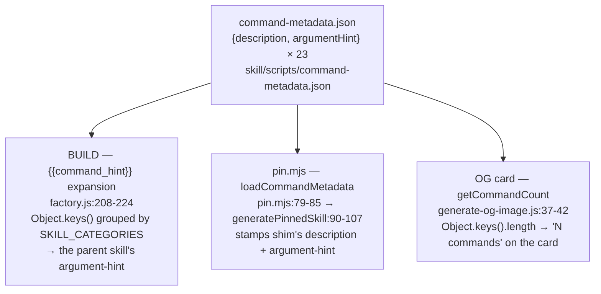
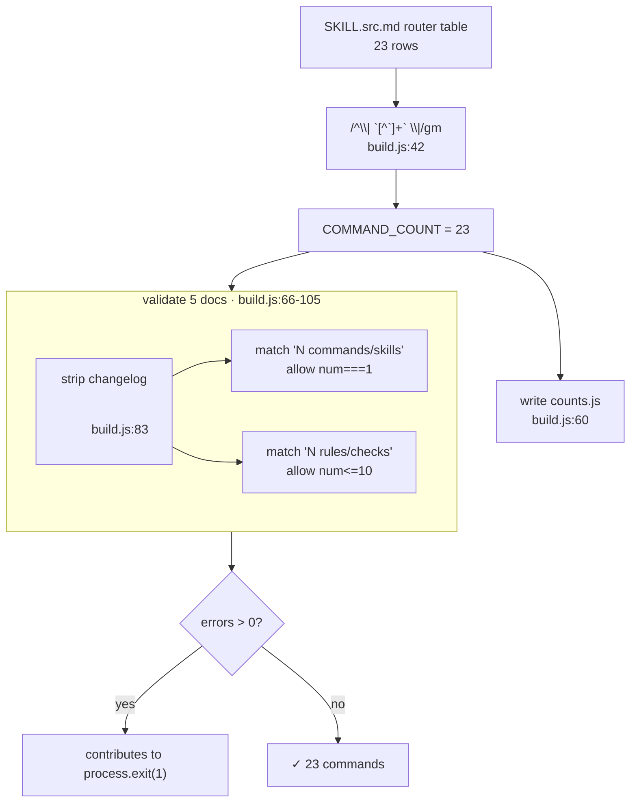
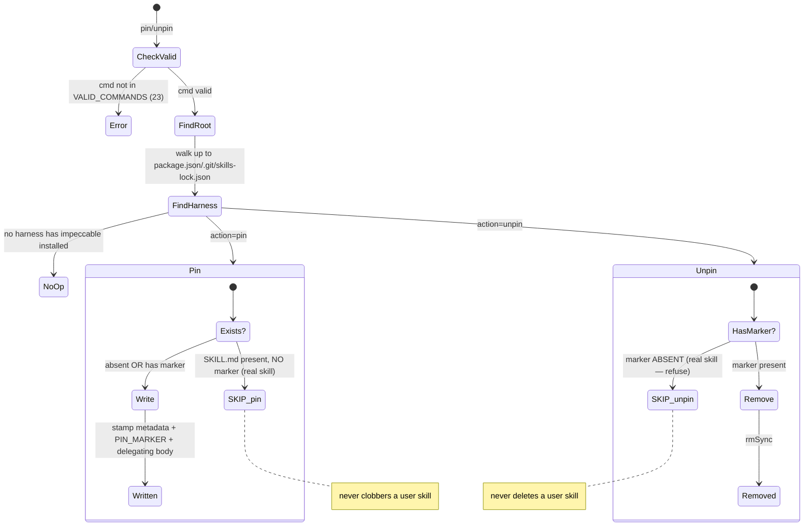

# Skill deep dive 04d — command metadata SSOT, count enforcement, and the pin shim

Companion to [`04-skill-harness.md`](04-skill-harness.md). That report is the
overview. This one goes to the floor on **how Impeccable keeps 23 commands
described, counted, and individually invocable across a fan-out of consuming
surfaces** — and, critically, on the gap between the marketing claim ("single
source of truth") and the measured reality: *description text* and *the count*
are genuinely single-sourced, but command *identity* (the list of which commands
exist) is replicated across roughly six hand-maintained lists kept in lock-step
by a written checklist plus one count validator. Read this if a fresh agent is
going to copy the metadata-fan-out pattern, the build-fails-on-stale-count trick,
or the `pin` escape-hatch — and needs to know exactly what is and isn't actually
de-duplicated.

All `file:line` references are verified against
`/home/martin/src/perso/yoinkit/audit/impeccable/source/` at the time of writing.
The stale first draft and the upstream `CLAUDE.md` both contained wrong anchors;
corrections are called out inline as **[CORRECTION]**.

---

## File map

| File | Lines | Role |
|---|---|---|
| [`skill/scripts/command-metadata.json`](../../source/skill/scripts/command-metadata.json) | 94 | The SSOT for command *copy*: `{description, argumentHint}` per command. **23 keys.** Read by the build's `{{command_hint}}` expansion, by `pin.mjs`, and by the OG-image generator. |
| [`skill/scripts/pin.mjs`](../../source/skill/scripts/pin.mjs) | 214 | The `pin`/`unpin` shim generator. Walks to project root, finds harness dirs, writes a marker-stamped redirect `SKILL.md`. Carries its own `VALID_COMMANDS` (23) and `HARNESS_DIRS` (11). |
| [`scripts/build.js`](../../source/scripts/build.js) | 794 | Build orchestrator. `generateCounts` (lines 33–113) is the count authority + validator. |
| [`scripts/lib/transformers/factory.js`](../../source/scripts/lib/transformers/factory.js) | 326 | Per-provider transform. Lines 208–224 expand `{{command_hint}}` from the metadata keys, grouped by `SKILL_CATEGORIES`. |
| [`scripts/lib/utils.js`](../../source/scripts/lib/utils.js) | 852 | Carries `IMPECCABLE_SUB_COMMANDS` (lines 708–712) — a curated **19** that drives `{{available_commands}}`. |
| [`scripts/lib/sub-pages-data.js`](../../source/scripts/lib/sub-pages-data.js) | 334 | Carries `SKILL_CATEGORIES` (lines 47–78) — **24 keys** (`impeccable` + 23) — plus `CATEGORY_ORDER` (line 80) and the relationships map. |
| [`skill/SKILL.src.md`](../../source/skill/SKILL.src.md) | 186 | The single source. Its **Commands** router table (lines 121–145) is the **canonical 23**; the build counts it by regex. |
| [`scripts/generate-og-image.js`](../../source/scripts/generate-og-image.js) | 174 | OG/Twitter card. `getCommandCount` (lines 37–42) reads the metadata key count live so the card's "N commands" never goes stale. |
| [`site/content/skills/<id>.md`](../../source/site/content/skills) | — | The *second register* of copy: a short human-friendly `tagline` per command, distinct from the keyword-dense `description` in metadata. |

---

## 1. `command-metadata.json` as the copy SSOT, and its three consumers

The file is a flat object keyed by command name. Every value is exactly two
keys ([`command-metadata.json:1-94`](../../source/skill/scripts/command-metadata.json)):

```json
"audit": {
  "description": "Run technical quality checks across accessibility, performance, theming, responsive design, and anti-patterns. ... Use when the user wants an accessibility check, performance audit, or technical quality review.",
  "argumentHint": "[area (feature, page, component...)]"
}
```

**[CORRECTION]** The upstream `CLAUDE.md` and the draft both describe the schema
as `description + argumentHint + (eventually) category`. There is **no category
key** in the file today — category lives only in `SKILL_CATEGORIES` (§2). The
schema is strictly `{description, argumentHint}`.

**Verified key count: 23.** The exact set (file order) is:

```
craft, init, document, extract, live,
adapt, animate, audit, bolder, clarify, colorize, critique, delight,
distill, harden, onboard, layout, optimize, overdrive, polish, quieter,
shape, typeset
```

This **does** include the management/setup commands `init`, `document`,
`extract`, `live`, `craft`, `shape` — every command the router knows. It is the
same 23-member set as the router table (§2), just in a different order.

### Two registers of copy (deliberate, documented)

The `description` here is **auto-trigger-optimized**: keyword-dense, almost
always ending in a "Use when the user mentions / wants …" clause so an AI harness
fuzzy-matches a free-form request onto the right command. The upstream `CLAUDE.md`
("Adding editorial content") states this explicitly: *"The long description in
`command-metadata.json` stays optimized for auto-trigger keyword matching in the
AI harness."*

The **human-friendly** register lives separately in
[`site/content/skills/<id>.md`](../../source/site/content/skills) as a `tagline`
frontmatter field. Verified example — `site/content/skills/audit.md`:

```
tagline: "Five-dimension technical quality check with P0 to P3 severity."
```

versus the metadata `description` for the same command (the long keyword blob
above). Same command, two strings, two audiences: the tagline drives UI surfaces
(docs cards, magazine spread), the description drives the agent's command router.
This split is a feature — do not collapse them.

### The fan-out



**Consumer A — the build, `{{command_hint}}` expansion.**
**[CORRECTION]** The draft cited `factory.js:210-224`; the verified block is
[`factory.js:208-224`](../../source/scripts/lib/transformers/factory.js) (the
comment starts at 208). The parent skill's frontmatter declares
`argument-hint: "[{{command_hint}}] [target]"`
([`SKILL.src.md:4`](../../source/skill/SKILL.src.md)). At transform time the
factory finds the metadata script, takes `Object.keys(...)`, groups them by
`SKILL_CATEGORIES` in `CATEGORY_ORDER` sequence joining with `|` inside a group
and ` · ` between groups, and substitutes
([`factory.js:211-222`](../../source/scripts/lib/transformers/factory.js)):

```js
const commands = Object.keys(JSON.parse(metaScript.content));
const grouped = CATEGORY_ORDER
  .map(cat => commands.filter(c => SKILL_CATEGORIES[c] === cat).join('|'))
  .filter(Boolean)
  .join(' · ');
frontmatterObj['argument-hint'] =
  frontmatterObj['argument-hint'].replace('{{command_hint}}', grouped);
```

So the rendered hint a user sees in the harness is e.g.
`craft|shape · critique|audit · typeset|layout|… · …`. Note this consumer reads
**both** the metadata (for *which* commands) **and** `SKILL_CATEGORIES` (for the
grouping). It silently drops any command missing from `SKILL_CATEGORIES`
(`.filter(Boolean)` removes empty groups, but a command absent from the category
map lands in no group at all).

**Consumer B — `pin.mjs`, `loadCommandMetadata`.**
[`pin.mjs:79-85`](../../source/skill/scripts/pin.mjs) reads the same JSON
(resolved relative to the script's own `__dirname`, so the shim picks up the
*installed* copy) and `generatePinnedSkill`
([`pin.mjs:90-107`](../../source/skill/scripts/pin.mjs)) stamps the shim's
frontmatter with `metadata[command]?.description` and
`metadata[command]?.argumentHint`, falling back to
`Shortcut for /impeccable ${command}.` / `[target]` if absent. The pinned skill
therefore inherits the *exact* auto-trigger description, which is correct: the
pinned `/audit` should fuzzy-match the same way `/impeccable audit` does.

**Consumer C — the OG card, `getCommandCount`.**
**[CORRECTION]** The draft/`CLAUDE.md` say the card "reads the N-commands figure
live." Precisely: [`generate-og-image.js:37-42`](../../source/scripts/generate-og-image.js)
does `Object.keys(metadata).length` — it counts the **metadata keys**, not a
literal stored figure, and renders `${commands} commands` into the card HTML
([`generate-og-image.js:137`](../../source/scripts/generate-og-image.js)). This is
a *second*, independent derivation of the count (the build derives it from the
router table; the card derives it from the metadata keys). They agree only
because metadata-keys == router-rows is maintained by hand. If someone added a
router row but forgot the metadata entry, the build count (24) and the card count
(23) would silently disagree — and nothing cross-checks them, because the build
validator (§3) compares docs against the *router-derived* count, never against
the metadata key count.

### STEAL / ADAPT / AVOID — the copy SSOT

- **STEAL** the two-register split. YoinkIt's skill (`skill/codex/`, `skill/claude/`)
  has the same latent need: one keyword-dense description to make an agent route
  a "yoink this hover animation" request to the capture skill, and a short
  human label for any docs/site surface. Put the agent-facing copy in one data
  file consumed by the build; keep the human tagline elsewhere.
- **ADAPT** the live-count-on-the-card idea. YoinkIt has no OG card, but the same
  principle applies anywhere a number is quoted (README "supports N harnesses",
  a docs "captures N animation properties"): derive it from the source array at
  build time, never type it.
- **AVOID** Impeccable's *two independent derivations of the same count* (router
  rows vs metadata keys) with no reconciliation between them. If you derive a
  number twice from two sources, also assert the two sources agree, or you have
  reintroduced the drift you were trying to kill.

---

## 2. The analytical centerpiece: command-list multiplicity

The headline of this report. "Single source of truth" is the repo's stated goal,
and it is **true for descriptions and for the count**. It is **false for command
identity**: the bare list of *which 23 commands exist* is physically written out
in (at least) six places. Five of them are hand-synced; only one is derived.

| # | Where command identity lives | Count | Shape | DERIVED or HAND-SYNCED | What it drives |
|---|---|---|---|---|---|
| 1 | Router table, [`SKILL.src.md:121-145`](../../source/skill/SKILL.src.md) | **23** | markdown table rows | **CANONICAL** (everything else should track it) | The agent's command menu; the build's `COMMAND_COUNT` regex source |
| 2 | `command-metadata.json` keys | **23** | JSON object keys | HAND-SYNCED to #1 | Descriptions/hints → `{{command_hint}}`, pin shim, OG card |
| 3 | `SKILL_CATEGORIES`, [`sub-pages-data.js:47-78`](../../source/scripts/lib/sub-pages-data.js) | **24** | object keys (`impeccable` + 23) | HAND-SYNCED to #1 | `{{command_hint}}` grouping; site category grouping |
| 4 | `IMPECCABLE_SUB_COMMANDS`, [`utils.js:708-712`](../../source/scripts/lib/utils.js) | **19** | string array | HAND-SYNCED, *intentionally a subset* | `{{available_commands}}` (the "next steps" suggestions) |
| 5 | `VALID_COMMANDS`, [`pin.mjs:29-35`](../../source/skill/scripts/pin.mjs) | **23** | string array | HAND-SYNCED to #1 | The pinnable allowlist |
| 6 | Per-command reference files `skill/reference/<command>.md` | **23** | files on disk | HAND-SYNCED to #1 | The instructions the agent loads per command |

Plus the downstream site mirrors the upstream `CLAUDE.md` "Adding New Commands"
list enumerates but this report defers (§5): `site/scripts/data.js`
`commandCategories`/`commandProcessSteps` and `framework-viz.js`
`commandSymbols`/`commandNumbers`.

### Reconciling the four different numbers

The counts genuinely differ, and the differences are *meaningful*, not bugs:

- **23 (router / metadata / valid / reference)** — the real command total. Three
  separate lists all land on 23 because they each need every command.
- **24 (`SKILL_CATEGORIES`)** — 23 commands **plus the parent skill** `impeccable`
  itself, which is given a category (`create`) so the site can place the umbrella
  skill in the grouping. Verified: keys are `impeccable` + the 23.
- **19 (`IMPECCABLE_SUB_COMMANDS`)** — a **deliberate curated subset**. Verified
  diff: the 4 excluded are **`craft`, `init`, `extract`, `live`**. The comment at
  [`utils.js:706-707`](../../source/scripts/lib/utils.js) explains why — these are
  the commands that `audit`/`critique`/etc. *suggest as next steps*, and you do
  not suggest "run init" or "open live mode" as a follow-up to a finished audit.
  **[CORRECTION]** The draft/scope note described the exclusions as
  "craft/init/extract/**live** + management"; verified there is no separate
  "management" bucket — the exact four omitted are craft, init, extract, live.

There is also a **category-vocabulary multiplicity** worth flagging: the router
table's Category column uses the labels `Build / Evaluate / Refine / Enhance /
Fix / Iterate` ([`SKILL.src.md:123-145`](../../source/skill/SKILL.src.md)), while
`CATEGORY_ORDER` ([`sub-pages-data.js:80`](../../source/scripts/lib/sub-pages-data.js))
uses `create / evaluate / refine / simplify / harden / system`. Both are 6-member
groupings of the same commands, but the *names and the partition differ*. Nothing
reconciles them; they are two independent editorial groupings serving the agent
menu vs the site.

### The honest maintenance cost: the "Adding New Commands" checklist

The upstream `CLAUDE.md` "Adding New Commands" section is an **11-step ordered
checklist**, and steps 2–7 plus 9–10 are nothing but "write this command's name
into the next list." Condensed (verbatim intent):

1. Create `skill/reference/<command>.md` *(list #6)*
2. Add a router-table row in `SKILL.src.md` *(list #1)*
3. Add a Command-menu entry in the same file
4. Add to `IMPECCABLE_SUB_COMMANDS` in `utils.js` *(list #4)*
5. Add to `VALID_COMMANDS` in `pin.mjs` *(list #5)*
6. Add metadata to `command-metadata.json` *(list #2)*
7. Add category to `SKILL_CATEGORIES` in `sub-pages-data.js` *(list #3)*
8. Add relationships to `COMMAND_RELATIONSHIPS`
9. Add the same category to `site/scripts/data.js`
10. Add symbol + number to `framework-viz.js`
11. *(optional)* editorial wrapper

Then a **separate** "update the count in all of these locations" list covers the
five prose docs the validator guards (§3): `index.astro`, README, `AGENTS.md`,
`plugin.json`, `marketplace.json`.

So the precise truth: **adding a command is a ~10-touch manual fan-out.** The
"single source of truth" framing holds only for the two things actually
de-duplicated — the description string (write once in metadata, three consumers
read it) and the *numeric count* (derive once from the router, validator catches
prose drift). The *identity* of a command is copied by hand into ~6 code lists,
and the only automated guard is the count validator, which catches a *miscount*
but **cannot** catch identity skew (e.g. metadata has `audit` but `VALID_COMMANDS`
spells it `audtit`, or `SKILL_CATEGORIES` is missing it). Those failures surface
only at runtime: an un-pinnable command, a command that falls out of a group, a
suggestion that never appears.

### STEAL / ADAPT / AVOID — the multiplicity lesson

This is the single most load-bearing transfer for YoinkIt, which is *about to
delete* its hand-maintained `skill/codex/` + `skill/claude/` duplication.

- **STEAL** the discipline of one description SSOT + one regex-derived count with
  a build-time validator. That part is genuinely excellent and is exactly what
  YoinkIt should adopt for its skill copy and any "N" it quotes.
- **AVOID** mistaking that for "command identity is single-sourced." It is not.
  When YoinkIt collapses its two skill copies into one source, do not stop there
  and assume the job is done — audit for the *secondary* lists (allowlists,
  category maps, suggestion subsets) that will accrete the same way Impeccable's
  six did. Each new list is a new place to forget.
- **ADAPT** by going one step further than Impeccable did: make the secondary
  lists **derive** from the canonical list where possible (e.g. `VALID_COMMANDS`
  could be `Object.keys(metadata)`; the pin allowlist needs no separate array),
  and where a list must stay a *curated subset* (Impeccable's 19), assert at build
  time that it is a strict subset of the canonical 23 so a typo can't smuggle in a
  non-command. Impeccable proves the checklist works under careful human
  maintenance; YoinkIt should aim to delete most of the checklist instead.

---

## 3. `generateCounts` — the build-enforced count

[`build.js:33-113`](../../source/scripts/build.js). This function is the entire
count-correctness machinery. It runs inside the build and contributes its return
value to the build's eventual `process.exit(1)` (full build orchestration is
[`04b`](04b-build-pipeline-and-validators.md); here we trace just this function).

### Step 1 — derive the command count from the router table (regex)

[`build.js:36-52`](../../source/scripts/build.js):

```js
const impeccableSkill = skills.find(s => s.name === 'impeccable');
const routerMatches = impeccableSkill.body.match(/^\| `[^`]+` \|/gm);
commandCount = routerMatches ? routerMatches.length : 0;
```

The regex `/^\| \`[^\`]+\` \|/gm` matches a line that begins with `|`, a space, a
backtick-quoted run, a space, then `|`. Verified against
[`SKILL.src.md:123-145`](../../source/skill/SKILL.src.md): it matches exactly the
**23 command rows** and *not* the header row `| Command | Category | …`
(no backticks) nor the `|---|---|` separator. The backtick requirement is what
makes the table header immune. The comment notes it is "tolerant of argument
hints inside the backticks (e.g. `craft [feature]`) and of multi-word commands
(e.g. `pin <command>`)" — the `[^\`]+` swallows the whole `craft [feature]`
token. **This is the one genuinely single-sourced count in the system.**

### Step 2 — derive the detection count

[`build.js:55`](../../source/scripts/build.js):
`new Set(ANTIPATTERNS.map(r => r.id)).size` from the imported registry. Detail
deferred to [`01-detector-engine.md`](../01-detector-engine/01-detector-engine.md);
here it is just the second number the validator guards.

### Step 3 — write the generated module

[`build.js:57-64`](../../source/scripts/build.js) writes
`site/public/js/generated/counts.js`:

```js
// GENERATED by build.js — do not edit
export const COMMAND_COUNT = 23;
export const DETECTION_COUNT = <n>;
```

This file is what the live site imports, so the homepage's "23 commands" is the
derived number, not a hand-typed one.

### Step 4 — validate five prose docs against the derived counts

[`build.js:66-105`](../../source/scripts/build.js). The five guarded files
([`build.js:67-73`](../../source/scripts/build.js)):

```
site/pages/index.astro
README.md
AGENTS.md
.claude-plugin/plugin.json
.claude-plugin/marketplace.json
```

For each existing file:

1. **Strip the changelog list first** ([`build.js:83`](../../source/scripts/build.js)):
   `content.replace(/<ul class="changelog-items">[\s\S]*?<\/ul>/g, '')`. This is
   the crucial subtlety — historical changelog entries legitimately say things
   like "28 rules" from an older release, and they must **not** trip the
   validator. Stripping the `<ul>` block is how past counts are exempted.
2. **Command-count check** ([`build.js:84-92`](../../source/scripts/build.js)):
   the pattern
   `/\b(\d+)\s+(design\s+)?(commands|sub-commands|skills|steering commands)/gi`
   finds every "N commands / N skills / …" in the stripped text. For each, if
   `num !== commandCount && num !== 1`, it logs `❌` and increments `errors`. The
   **`num !== 1` allowance** ([`build.js:88`](../../source/scripts/build.js)) is so
   prose can correctly say "**1** skill" (there genuinely is one user-invocable
   umbrella skill) without being read as a stale "1 command".
3. **Detection-count check** ([`build.js:97-103`](../../source/scripts/build.js)):
   pattern `/\b(\d+)\s+(deterministic\s+)?(checks|patterns|rules|detections)/gi`,
   flags when `num !== detectionCount && num > 10` — the `> 10` floor ignores
   incidental small numbers like "3 patterns" in unrelated prose.

### Step 5 — return the error count

[`build.js:107-112`](../../source/scripts/build.js): if `errors > 0` it prints a
summary line and **returns `errors`**. The caller folds this into the build's
total error tally that drives `process.exit(1)` (see
[`04b`](04b-build-pipeline-and-validators.md)). So **the build fails if any of the
five docs quotes a command/rule count that disagrees with the source.** A
contributor who adds the 24th command and updates the router but forgets the
README cannot land a green build.



### STEAL / ADAPT / AVOID — count enforcement

- **STEAL, verbatim if you can.** This is the cleanest idea in the subsystem:
  derive the count from the canonical artifact, and make the build *fail* on any
  doc that disagrees. YoinkIt quotes numbers in its README and skill docs
  ("captures N properties", "supports N harnesses"); the same regex-validate-prose
  pattern would keep them honest at zero ongoing cost.
- **ADAPT** the changelog-stripping trick. Any doc with a *history* section
  (changelog, release notes) needs an exemption window so old true numbers don't
  read as new stale ones. The `<ul class="changelog-items">` strip is the
  mechanism; replicate it for whatever historical region your docs have.
- **AVOID** over-trusting a *count* validator as a proxy for *content*
  correctness. As §2 showed, this catches a wrong number but not a wrong list. It
  is necessary, not sufficient.

---

## 4. The `pin` shim

[`pin.mjs`](../../source/skill/scripts/pin.mjs) (214 lines). The escape hatch for
the deliberate single-skill architecture: Impeccable ships **one** user-invocable
skill to keep the `/` menu uncluttered, but a power user who lives in `/audit` can
*pin* it as a top-level shortcut that delegates to `/impeccable audit`. `unpin`
reverses it.

**[CORRECTION]** Verified anchors (the draft's were mostly right; the two that
were off are flagged):

| Function | Verified lines | Draft said |
|---|---|---|
| `findProjectRoot` | [43–58](../../source/skill/scripts/pin.mjs) | 43-58 ✓ |
| `findHarnessDirs` | [63–74](../../source/skill/scripts/pin.mjs) | 63-74 ✓ |
| `loadCommandMetadata` | [79–85](../../source/skill/scripts/pin.mjs) | 79-85 ✓ |
| `generatePinnedSkill` | [90–107](../../source/skill/scripts/pin.mjs) | 90-107 ✓ |
| `VALID_COMMANDS` | [29–35](../../source/skill/scripts/pin.mjs) | 29-35 ✓ |
| `pin` body / SKIP guard | [112–150](../../source/skill/scripts/pin.mjs) (SKIP at 131-134) | 127-134 |
| `unpin` body / REFUSE guard | [155–186](../../source/skill/scripts/pin.mjs) (REFUSE at 168-171) | 166-171 |
| `{{command_prefix}}` in shim body | **103 and 105** | 103-105 ✓ |

### `findProjectRoot` — walk up

[`pin.mjs:43-58`](../../source/skill/scripts/pin.mjs). From `process.cwd()`, walk
parent directories until one contains **`package.json`**, **`.git`**, or
**`skills-lock.json`**; stop at `/`. This makes `pin` work from anywhere inside a
project, not just its root. Falls back to `startDir` if nothing is found.

### `findHarnessDirs` — only where Impeccable is already installed

[`pin.mjs:63-74`](../../source/skill/scripts/pin.mjs). Iterates the
**`HARNESS_DIRS`** constant ([`pin.mjs:23-26`](../../source/skill/scripts/pin.mjs))
— verified **11 entries**:

```
.claude, .cursor, .gemini, .codex, .agents,
.trae, .trae-cn, .pi, .opencode, .kiro, .rovodev
```

For each, it checks `<root>/<harness>/skills/impeccable` (or the
`i-impeccable` naming-dodge variant — see [`04a`](04a-single-source-transform.md))
and only adds harnesses where Impeccable is **already installed**. So pinning
mirrors the existing install footprint; it never creates a harness dir from
scratch.

### `generatePinnedSkill` — the redirect SKILL.md

[`pin.mjs:90-107`](../../source/skill/scripts/pin.mjs). Builds the shim content:

```js
const desc = metadata[command]?.description || `Shortcut for /impeccable ${command}.`;
const hint = metadata[command]?.argumentHint || '[target]';
return `---
name: ${command}
description: "${desc}"
argument-hint: "${hint}"
user-invocable: true
---

${PIN_MARKER}

This is a pinned shortcut for \`{{command_prefix}}impeccable ${command}\`.

Invoke {{command_prefix}}impeccable ${command}, passing along any arguments provided here, and follow its instructions.
`;
```

So the shim is a real, user-invocable skill whose frontmatter `name` is the bare
command, whose `description`/`argument-hint` are stamped from metadata, and whose
*entire body* is one delegating instruction plus the `PIN_MARKER`. The agent that
loads `/audit` is told to go invoke `/impeccable audit` and follow *its*
instructions — the shim carries no logic of its own.

### PIN_MARKER — the can't-clobber safety

`PIN_MARKER = '<!-- impeccable-pinned-skill -->'`
([`pin.mjs:38`](../../source/skill/scripts/pin.mjs)) is the linchpin of the whole
design. It appears in every generated shim body and is checked on both sides:

- **`pin` SKIPS pre-existing non-pinned skills.**
  [`pin.mjs:126-135`](../../source/skill/scripts/pin.mjs): if a `SKILL.md` already
  exists at the target and its content **does not** include the marker, it logs
  `SKIP: … (non-pinned skill already exists)` and `continue`s. So pinning `/audit`
  will never overwrite a real, user-authored `/audit` skill.
- **`unpin` REFUSES to delete anything lacking the marker.**
  [`pin.mjs:167-171`](../../source/skill/scripts/pin.mjs): before `rmSync`, it
  reads the file and if the marker is absent logs `SKIP: … (not a pinned skill)`
  and `continue`s. So `unpin audit` can never `rm -rf` a user's real skill that
  happens to be named `audit`.

This is a clean, symmetric, content-addressed safety: the tool only ever touches
files it can prove it authored. There is no manifest, no state file — the proof
travels *inside* the artifact.

### `VALID_COMMANDS` — the allowlist gate

**[CORRECTION — important].** [`pin.mjs:29-35`](../../source/skill/scripts/pin.mjs)
is a 23-member array, and the scope brief's framing ("verify the count/contents")
matters here: it is **not** a *reduced* allowlist. Verified, it is the **full 23**,
the same set as the router table and metadata keys, merely in a different source
order (it leads with `craft, init, extract, document, shape` then the rest). Any
`pin <name>`/`unpin <name>` where `name` is not in this array errors out before
touching the filesystem ([`pin.mjs:202-206`](../../source/skill/scripts/pin.mjs)),
and the usage text on missing args lists them ([`pin.mjs:191-195`](../../source/skill/scripts/pin.mjs)).
So `VALID_COMMANDS` is **list #5 in the multiplicity table (§2)** — another
hand-synced copy of command identity, not a curated subset like the 19.

### The `{{command_prefix}}` latent bug

The most interesting defect in the subsystem. `generatePinnedSkill` is invoked at
**runtime** (when a user runs `node pin.mjs pin audit`), not at build time. The
shim body it writes contains the literal token `{{command_prefix}}` on
[`pin.mjs:103`](../../source/skill/scripts/pin.mjs) and
[`pin.mjs:105`](../../source/skill/scripts/pin.mjs). Verified: `pin.mjs` **never
imports or calls** `replacePlaceholders` (grep for it in the file returns nothing)
— that substitution only ever runs in the build's
[`factory.js`](../../source/scripts/lib/transformers/factory.js)/[`utils.js`](../../source/scripts/lib/utils.js)
transform, which the shim never passes through. Therefore **the pinned skill ships
with a literal, unsubstituted `{{command_prefix}}` in its body.**

Why it is mostly harmless: 10 of the 11 harnesses use `/` as the command prefix,
and the body still reads `Invoke {{command_prefix}}impeccable audit` — a capable
agent infers the intent and the delegation works. But for **Codex**, whose prefix
is `$` ([`04a`](04a-single-source-transform.md) covers the placeholder table), the
shim says `{{command_prefix}}impeccable audit` where it should say
`$impeccable audit`. It is wrong, just usually-survivable.

**The fix is one line of intent:** substitute the prefix at shim-write time.
`pin.mjs` already knows it is writing into a specific harness dir
([`pin.mjs:124`](../../source/skill/scripts/pin.mjs) iterates `harnessDirs`), so it
could map each harness to its prefix and `.replace(/\{\{command_prefix\}\}/g, …)`
on the content before `writeFileSync` — or `loadCommandMetadata`-style import the
`PROVIDER_PLACEHOLDERS` table from `utils.js`. The shim is generated per-harness
already; making it prefix-correct per-harness is a small extension of the loop
that already exists.



### STEAL / ADAPT / AVOID — the pin shim

- **STEAL the PIN_MARKER pattern wholesale.** A generated artifact that embeds a
  self-identifying marker, and tooling that *refuses to touch* artifacts without
  it, is the correct way to make "install / uninstall" idempotent and safe with no
  external state. If YoinkIt ever generates files into a user's project (skill
  shims, capture-config stubs), stamp them and gate removal on the stamp. This is
  directly transferable and low-cost.
- **ADAPT the install-footprint mirroring.** `findHarnessDirs` only acts where the
  parent is already installed — pinning never invents structure. Any YoinkIt
  "shortcut" generator should likewise mirror the existing install set rather than
  guessing harness dirs.
- **AVOID the `{{command_prefix}}` mistake — and learn the general rule from it.**
  A placeholder that is only substituted on **one** code path (the build) will
  ship raw on **any other** path that emits the same template (here, the runtime
  shim writer). When YoinkIt collapses its two skill copies into a templated single
  source, every emit path — build, install, any runtime generator — must route
  through the *same* substitution, or pick a representation that needs none. The
  draft missed this bug entirely; it is the concrete cautionary tale for the
  single-source migration this whole audit is about.

---

## Cross-links

- The transform / placeholder mechanics (how `{{command_prefix}}`,
  `{{available_commands}}`, `{{command_hint}}` are substituted, and the
  source→13-harness compile): [`04a-single-source-transform.md`](04a-single-source-transform.md).
- Build orchestration and the full validator gauntlet (where `generateCounts`'s
  return value joins the other validators into `process.exit(1)`):
  [`04b-build-pipeline-and-validators.md`](04b-build-pipeline-and-validators.md).
- Runtime routing and context (how `/impeccable audit` actually loads
  `reference/audit.md`, which the pin shim delegates to):
  [`04c-runtime-routing-and-context.md`](04c-runtime-routing-and-context.md).
- Install / distribution (how the harness dirs the shim writes into get there in
  the first place): [`04e-distribution-and-install.md`](04e-distribution-and-install.md).
