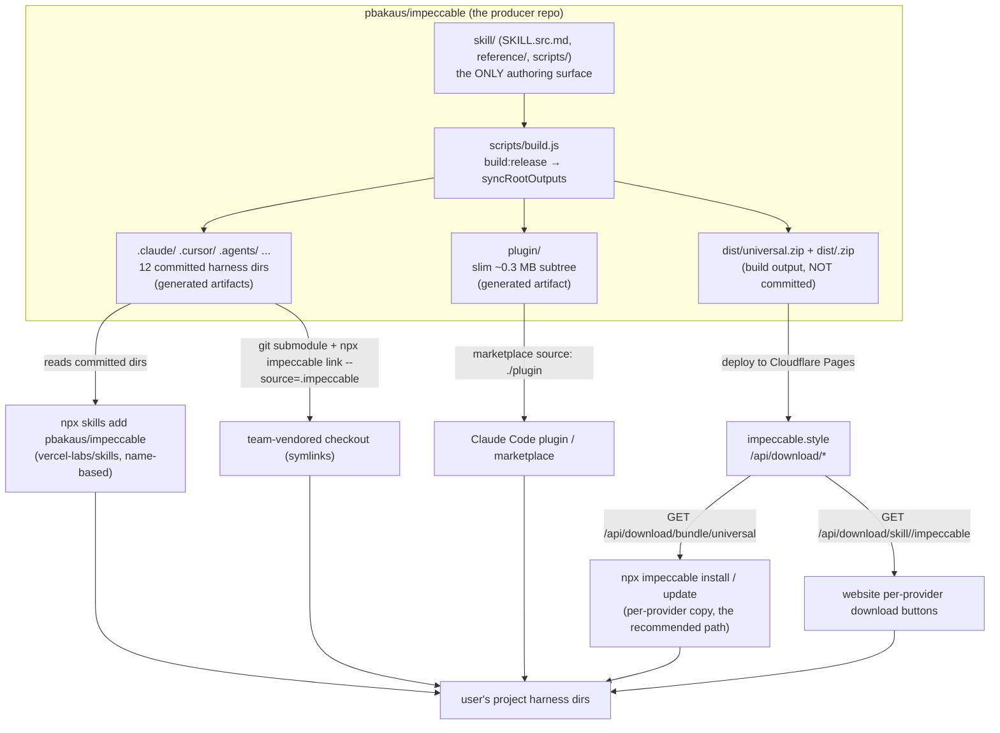
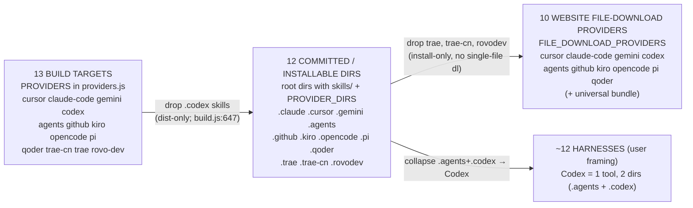

# Skill deep dive 04e — the distribution and install model

Companion to [`04-skill-harness.md`](04-skill-harness.md). That report is the
overview. This one goes to the floor on **how the compiled harness output reaches
a user's machine** — the committed-generated-output policy, the source-first PR
discipline and CI re-sync, the `npx impeccable install/link/update/check` CLI, the
per-provider website download bundles, the `vercel-labs/skills` consumer lockfile,
the Claude Code plugin/marketplace manifests, the three independent version
streams, and the provider-count reconciliation (**13** build targets → **12**
committed installable dirs → **10** website download providers + universal).

This matters to the audit because the install/distribution surface is where
YoinkIt and Impeccable are *most* directly comparable: both ship an installable
agent skill across multiple harnesses, and both must answer "what is the
authoring surface vs what is the artifact." Impeccable has the more developed
answer; this is the doc to mine for it.

All `file:line` references are into `../../source/` and were re-verified against
the actual checkout. **The upstream `CLAUDE.md` is stale on the build-script
names** (it documents `build`/`build:release` as the default-vs-release split; the
`--skip-root-sync` flag actually lives on `build:skills`/`build:skills:release`,
which `build`/`build:release` then call). Corrections are flagged inline with
**CORRECTION**.

---

## 0. File map

| File | Lines | Role |
|---|---|---|
| [`cli/bin/cli.js`](../../source/cli/bin/cli.js) | 80 | npx entry: dispatch `detect`/`ignores`/`skills` + the `SKILL_COMMANDS` shorthands (`help install link update check`) |
| [`cli/bin/commands/skills.mjs`](../../source/cli/bin/commands/skills.mjs) | 1818 | The whole install machine: provider tables, detection, bundle download/extract, copy vs symlink, hook manifests, `install`/`link`/`update`/`check` |
| [`cli/lib/download-providers.js`](../../source/cli/lib/download-providers.js) | 25 | The 10 website file-download providers + their config dirs + the `universal` bundle list; shared by CLI and Pages Functions |
| [`functions/api/download/bundle/[provider].js`](../../source/functions/api/download/bundle/[provider].js) | 29 | Pages Function serving `dist/<provider>.zip` (the `universal` bundle the CLI installs from) |
| [`functions/api/download/[type]/[provider]/[id].js`](../../source/functions/api/download/[type]/[provider]/[id].js) | 46 | Pages Function serving one provider's single `SKILL.md` for manual download |
| [`skills-lock.json`](../../source/skills-lock.json) | 4 | The `vercel-labs/skills` *consumer* lockfile, empty `{version:1, skills:{}}` — Impeccable is a producer |
| [`.claude-plugin/plugin.json`](../../source/.claude-plugin/plugin.json) | 12 | Claude Code plugin manifest (skills version 3.7.1, `skills: "./.claude/skills/"`) |
| [`.claude-plugin/marketplace.json`](../../source/.claude-plugin/marketplace.json) | 26 | Marketplace manifest; `plugins[0].source: "./plugin"` → the slim subtree |
| [`docs/HARNESSES.md`](../../source/docs/HARNESSES.md) | 107 | Human capability matrix of record; header says it informs `scripts/lib/transformers/providers.js` |
| [`scripts/lib/transformers/providers.js`](../../source/scripts/lib/transformers/providers.js) | 122 | `PROVIDERS` — the **13** build targets |
| [`scripts/build.js`](../../source/scripts/build.js) | 794 | Build orchestrator; `BUILD_OPTIONS.syncRootOutputs` gates the root harness sync; `.codex` filtered out |
| [`scripts/release.mjs`](../../source/scripts/release.mjs) | 285 | Per-component tag/publish with the dirty-tree / unpushed / tag-exists / changelog / rebuild-drift guards |
| [`.github/workflows/sync-generated-output.yml`](../../source/.github/workflows/sync-generated-output.yml) | 98 | CI that runs `build:release` after source lands on `main` and commits generated output back |
| [`package.json`](../../source/package.json) | 110 | The `build*` and `release:*` script wiring (CLI version lives here) |
| [`CLAUDE.md`](../../source/CLAUDE.md) | 348 | Upstream agent guide; "Generated provider output policy", "Versioning", "Releases" sections (stale on script names) |

Deferred (cross-linked): transform internals → [`04a`](04a-single-source-transform.md);
build orchestration / validators / plugin-subtree mechanics →
[`04b-build-pipeline-and-validators.md`](04b-build-pipeline-and-validators.md);
routing/context → [`04c`](04c-runtime-routing-and-context.md); command metadata / pin →
[`04d`](04d-command-metadata-and-pin.md). (Adjust the 04a/04c/04d filenames to the
ones actually committed; only 04b's name is asserted here.)

---

## 1. The install-path topology

There is one producer repo and four distinct paths out of it. Crucially, **three
of the four read the *committed* harness dirs, not a build server** — the repo
itself is the distribution artifact.



The split that organizes everything: **`skill/` is the authoring surface; the 12
root harness dirs, `plugin/`, and the `dist/*.zip` bundles are all generated
artifacts.** Two of those artifact families are committed (the harness dirs and
`plugin/`); one is not (the zips — they are rebuilt and deployed). Why commit
generated output at all is §2.

---

## 2. Why the generated output is committed (and the PR discipline that follows)

### 2.1 The policy

`.claude/skills/`, `.cursor/skills/`, `.agents/skills/` and the other harness
directories are **intentionally committed** ([`CLAUDE.md:117-125`](../../source/CLAUDE.md)).
The reason is the `npx skills add pbakaus/impeccable` path in the topology above:
`vercel-labs/skills` resolves a GitHub repo and **reads the provider dirs straight
out of the checked-out tree at install time**. If they were gitignored, that path
installs nothing. The same committed dirs also make clean git-submodule vendoring
possible (the `link` path, §5.3). So the artifacts are checked in *so a consumer
tool can read them without a build step*.

### 2.2 The consequence: source-first PRs

Because the harness dirs are artifacts, normal development PRs are **source-first**
([`CLAUDE.md:121`](../../source/CLAUDE.md)): you stage `skill/`, `scripts/`, `cli/`,
`site/`, `extension/`, `functions/`, `tests/` — the *inputs*. You do **not** stage
the regenerated provider permutations unless the PR *is* a release/generated-output
sync or a build-system change. The validation command for source edits is `bun run
build` (which, per §6, does **not** sync the root dirs); `bun run build:release` is
reserved for intentionally refreshing tracked output.

This is the single most important norm to copy: a 291 MB monorepo where 12 large
directories are machine-generated would be a constant merge-conflict and
review-noise generator if contributors hand-edited them. The discipline keeps the
diff honest — a feature PR touches `skill/` and a generated diff is a red flag, not
a feature.

### 2.3 The CI re-sync that closes the loop

If contributors don't regenerate, who does? **CI does, after merge.**
[`.github/workflows/sync-generated-output.yml`](../../source/.github/workflows/sync-generated-output.yml)
triggers on push to `main` scoped to the source paths
(`.claude-plugin/**`, `cli/engine/**`, `skill/**`, `scripts/**`, `package.json`,
`bun.lock` — [`sync-generated-output.yml:6-12`](../../source/.github/workflows/sync-generated-output.yml)),
runs `bun run build:release`
([`:63-64`](../../source/.github/workflows/sync-generated-output.yml)), diffs the
generated paths, and if anything drifted, commits it back to `main` as
"Sync generated provider output"
([`:78-92`](../../source/.github/workflows/sync-generated-output.yml)).

Three details worth stealing:

- **The drift gate is exact.** `GENERATED_PATHS`
  ([`:23-36`](../../source/.github/workflows/sync-generated-output.yml)) is the
  precise list of synced dirs: `.agents .claude .cursor .gemini .github/skills
  .kiro .opencode .pi .qoder .rovodev .trae .trae-cn plugin`. Note `.github/skills`
  (not all of `.github` — CODEOWNERS, workflows, templates are hand-authored;
  **verified**: only `.github/skills/` is generated, the rest of `.github/` is
  source) and the **absence of `.codex`** (it is dist-only for skills; §3).
- **Race protection.** After committing, it re-fetches `origin/main` and refuses
  to push if `main` advanced underneath it
  ([`:86-90`](../../source/.github/workflows/sync-generated-output.yml)) —
  "main advanced while generated output was building; rerun."
- **The token trick.** It checks out with `SYNC_GENERATED_OUTPUT_TOKEN ||
  github.token` ([`:46-48`](../../source/.github/workflows/sync-generated-output.yml))
  because a commit made with the default `GITHUB_TOKEN` does **not** trigger
  follow-up workflow runs; a PAT/App token re-enables CI on the generated commit.

> **YoinkIt steal — STEAL.** This is the cleanest answer to a problem YoinkIt will
> hit the moment `skill/codex/` and `skill/claude/` stop being hand-maintained
> twins: **author once, generate the rest, commit the generated output so the
> install path can read it raw, and let a post-merge CI job own the regeneration.**
> Today YoinkIt hand-maintains both skill dirs — the `04` overview already flags
> that as the divergence risk. The fix is not a runtime build; it is (1) one source
> dir, (2) a generator, (3) committed per-harness output, (4) a `sync-generated-
> output`-style workflow with the exact-path drift gate and the PAT-re-trigger
> trick. Adopt the source-first PR rule alongside it or the committed output rots.

---

## 3. The `.codex` asymmetry: 13 build targets, 12 committed dirs

The build emits **13** provider targets (§7), but the repo root carries **12**
installable harness dirs. The missing one is `.codex`, and the reason is the
single most error-prone fact in the whole subsystem.

`scripts/build.js` filters it out of the root skills sync explicitly:

```js
// build.js:644-647
// `.codex/` is intentionally excluded: Codex no longer
// consumes that layout; keep generated Codex bundles under dist/ only.
const syncConfigs = Object.values(PROVIDERS).filter(({ configDir }) => configDir !== '.codex');
```

**CORRECTION to the prompt's "`.codex` is dist-only" framing.** It is dist-only
*for skills*, but it is **not absent from the repo**. Exactly one file under
`.codex/` is committed: **`.codex/hooks.json`** (verified: `git ls-files | grep
'^\.codex/'` → one line). That hook manifest is synced to root by a *separate*
pass, `syncRootHookManifests`
([`build.js:407-420`](../../source/scripts/build.js)), which runs for every
provider with `emitHooks` set — and the `codex` target has `emitHooks: 'codex'`
with `hooksManifestRel: 'hooks.json'`
([`providers.js:41-54`](../../source/scripts/lib/transformers/providers.js)).
`syncRootHookManifests` is *not* filtered by the `!== '.codex'` predicate, so the
hook sidecar lands at `.codex/hooks.json` even though the skills directory does
not.

This is the `codex → .agents` quirk made physical: **Codex reads its *skills* from
`.agents/skills` but its *project hooks* from `.codex/hooks.json`.** So one logical
tool ("Codex") owns two root dirs — `.agents` (the skills payload) and `.codex`
(just the hook manifest). That is also why the user-facing framing is "~12
harnesses": Codex is one tool counted once, even though it touches two dot-dirs.

The install side mirrors this precisely. `PROVIDER_HOOK_ARTIFACTS` routes the
Codex hook to `.codex` even though the install *target* is `.agents`:

```js
// skills.mjs:103-105
'.agents': [
  { sourceProvider: '.codex', rel: 'hooks.json', destProvider: '.codex' },
],
```

So when a user installs the `.agents` (Codex) skill bundle, the CLI writes the
skill under `.agents/skills/` and the hook under `.codex/hooks.json`. The two-dir
split is honored end to end.

> **YoinkIt steal — ADAPT.** YoinkIt's Codex skill faces the same "one tool, more
> than one config location" reality (skills dir vs hooks vs OpenAI metadata). The
> lesson is *not* to force a 1:1 tool→dir mapping. Model the build target and the
> on-disk layout independently: a single provider config can emit a skills payload
> to one dir and a hook/metadata sidecar to another, and the install-time alias
> table (`PROVIDER_ALIASES`, `codex → .agents`) is what keeps the user typing one
> name (`codex`) while the bytes land in two places.

---

## 4. The `npx impeccable` CLI: dispatch

[`cli/bin/cli.js`](../../source/cli/bin/cli.js) is 80 lines and does almost
nothing but route. The skill-side commands are a small set:

```js
// cli.js:18
const SKILL_COMMANDS = new Set(['help', 'install', 'link', 'update', 'check']);
```

Dispatch ([`cli.js:51-69`](../../source/cli/bin/cli.js)): `detect` → the engine;
`ignores`/`ignore` → `commands/ignores.mjs`; `skills` → `commands/skills.mjs` with
the *rest* of argv; any member of `SKILL_COMMANDS` → `commands/skills.mjs` with the
*full* argv (so `npx impeccable install` and `npx impeccable skills install` both
work — the legacy `skills` namespace is preserved, [`cli.js:40-41`](../../source/cli/bin/cli.js)).
Anything else falls through to `detect` so `npx impeccable src/` is a shorthand
([`cli.js:64-68`](../../source/cli/bin/cli.js)). One nicety: an
`IMPECCABLE_PROMPT_ABORT` error code exits **130** (Ctrl-C convention) instead of 1
([`cli.js:72-79`](../../source/cli/bin/cli.js)).

`commands/skills.mjs`'s own `run()` re-dispatches the sub-verb
([`skills.mjs:1800-1818`](../../source/cli/bin/commands/skills.mjs)):
`install`/`link`/`update`/`check`, with bare/`help`/`--help` → `showHelp()`.

### The provider tables (the heart of the install model)

Four tables in `skills.mjs` encode the provider universe. **CORRECTION:** the
first draft cited the alias block as `skills.mjs:26-43`; it is actually **lines
27-44** (off by one).

- **`PROVIDER_DIRS`** ([`skills.mjs:26`](../../source/cli/bin/commands/skills.mjs)) — the
  **12** dot-dirs the installer scans/writes:
  `.claude .cursor .gemini .agents .github .kiro .opencode .pi .qoder .trae
  .trae-cn .rovodev`. This is the canonical "installable harness dirs" count and it
  matches the 12 committed root dirs exactly. (Note `.codex` is **absent** here too
  — the CLI never installs a `.codex` *skills* dir; it only writes `.codex/hooks.json`
  as the Codex hook sidecar via `PROVIDER_HOOK_ARTIFACTS`.)
- **`PROVIDER_ALIASES`** ([`skills.mjs:27-44`](../../source/cli/bin/commands/skills.mjs)) —
  the user-facing-name → dir map. The load-bearing entry is
  **`codex: '.agents'`** ([`:30`](../../source/cli/bin/commands/skills.mjs)): a user
  typing `--providers=codex` installs into `.agents`. `copilot → .github`,
  `claude-code → .claude`, `rovo-dev`/`rovodev → .rovodev`, `trae-cn → .trae-cn`
  are the other normalizers. There is no `codex → .codex` alias — `.codex` is never
  an install target.
- **`PROVIDER_DISPLAY`** ([`skills.mjs:46-59`](../../source/cli/bin/commands/skills.mjs)) —
  dir → `{name, input}` for prompts (12 entries, `.codex` again absent).
- **`GLOBAL_HARNESS_HINTS`** ([`skills.mjs:65-74`](../../source/cli/bin/commands/skills.mjs)) —
  **8** entries mapping a user's `~/.X` home harness to the provider dir to install.
  This is where `~/.codex → .agents`
  ([`:67`](../../source/cli/bin/commands/skills.mjs)) appears: if the project has no
  harness folder, the CLI infers the target from globally installed harnesses, and
  a global Codex install maps to the `.agents` bundle variant.

### `install` — detect, confirm, copy, hook

`install` ([`skills.mjs:1471-1598`](../../source/cli/bin/commands/skills.mjs)) is a
plan-then-execute flow:

1. **Plan** (`chooseInstallPlan`, [`:995-1005`](../../source/cli/bin/commands/skills.mjs)):
   resolve *which providers* (`chooseInstallProviders`, [`:939-964`](../../source/cli/bin/commands/skills.mjs))
   and *what scope* (`chooseInstallScope`, [`:966-993`](../../source/cli/bin/commands/skills.mjs)).
   Provider resolution precedence (`resolveInstallTargets`, [`:831-840`](../../source/cli/bin/commands/skills.mjs)):
   explicit `--providers=` wins → else **project-local** harness folders present
   (`.cursor` etc.) → else infer from **global** harnesses (`~/.claude`, `~/.codex`)
   → else the last-resort default `['.claude', '.agents']` (`DEFAULT_TARGETS`,
   [`:78`](../../source/cli/bin/commands/skills.mjs)). Scope is project (`.cursor`)
   vs user/global (`~/.claude`); both are scriptable via `--scope=`/`--user`/
   `--project` ([`:849-853`](../../source/cli/bin/commands/skills.mjs)).
2. **Hook consent** (`decideHookInstall`, [`:1317-1335`](../../source/cli/bin/commands/skills.mjs)):
   prompts once (default yes), records the answer in `.impeccable/config.local.json`,
   never re-asks. Non-interactive (`-y` or no TTY) keeps install-by-default.
3. **Download the universal bundle** (`downloadAndExtractBundle`,
   [`:475-486`](../../source/cli/bin/commands/skills.mjs)): GET
   `${API_BASE}/api/download/bundle/universal` to a temp dir
   (`API_BASE = 'https://impeccable.style'`, [`:23`](../../source/cli/bin/commands/skills.mjs)).
   An `IMPECCABLE_BUNDLE_PATH` env var lets tests/local point at a local zip or dir
   ([`:476-477`](../../source/cli/bin/commands/skills.mjs)).
4. **Copy per-provider** (`copyProviderSkills`, [`:1012-1035`](../../source/cli/bin/commands/skills.mjs)):
   from the *one* universal bundle, copy each target's *own* compiled variant
   (`bundleDir/<provider>/skills/*`) into the project as **real directories, never
   symlinks**. The comment at [`:1552-1556`](../../source/cli/bin/commands/skills.mjs)
   is the key design statement: it deliberately does **not** shell out to `npx
   skills add`, because that tool's name-based discovery can install the *uncompiled
   source* and its symlink default points every harness at one shared variant.
   Copying per-provider variants is the only correct install — each harness gets the
   build compiled *for it* (different `{{scripts_path}}`, frontmatter fields, etc.).
5. **Install provider-native hook manifests** (`copyProviderHooks`,
   [`:1259-1301`](../../source/cli/bin/commands/skills.mjs)) for the three providers
   with a documented hook surface (`PROVIDER_HOOK_ARTIFACTS`, [`:89-106`](../../source/cli/bin/commands/skills.mjs)):
   Claude (`.claude/settings.local.json`, written to the gitignored *local* file,
   not the team-shared `settings.json` — [`:90-97`](../../source/cli/bin/commands/skills.mjs)),
   Cursor (`.cursor/hooks.json`), Codex (`.codex/hooks.json`). The merge logic is
   careful: it strips any stale Impeccable hook before re-adding
   (`mergeHookManifests`, [`:1226-1249`](../../source/cli/bin/commands/skills.mjs))
   and honors a hook a user manually moved into the shared `settings.json`
   ([`:1271-1274`](../../source/cli/bin/commands/skills.mjs)) so the detector never
   runs twice per edit.

The bundle UI itself is hand-rolled: `promptRadio` / `promptCheckbox`
([`:249-373`](../../source/cli/bin/commands/skills.mjs)) implement raw-keypress TTY
menus with no dependency. Non-TTY runs fall back to piped stdin answers
(`ask`, [`:137-161`](../../source/cli/bin/commands/skills.mjs)).

### `update` and `check`

`update` ([`:1678-1765`](../../source/cli/bin/commands/skills.mjs)) finds installed
providers, downloads the bundle, and **content-hashes** local vs bundle before
touching anything (`isUpToDate` → `hashSkillFile` → `normalizeForHash`,
[`:514-580`](../../source/cli/bin/commands/skills.mjs)). The normalization step is
neat: it rewrites `.<provider>/skills/` to `.PROVIDER/skills/` before hashing
([`:514-517`](../../source/cli/bin/commands/skills.mjs)) so an install done via
`npx skills add` (which resolves `{{scripts_path}}` to a *different* provider dir)
still compares equal — only real content changes count, and version fields are
deliberately *kept* in the hash so metadata-only releases still refresh.
**CORRECTION-adjacent note:** `update` skips `npx skills update` on purpose,
citing upstream bug `vercel-labs/skills#775` (lockfile not found)
([`:1684-1685`](../../source/cli/bin/commands/skills.mjs)).

`check` ([`:584-613`](../../source/cli/bin/commands/skills.mjs)) is `update`'s
read-only half: download, `isUpToDate`, print "up to date (vX)" or "Updates
available. Run `npx impeccable update`." This is exactly the verb the in-skill
`UPDATE_AVAILABLE` directive points the user at: `skill/scripts/context.mjs`
appends an `UPDATE_AVAILABLE` line telling the agent to offer `npx impeccable
update` when a newer skill ships
([`context.mjs:172-176`](../../source/skill/scripts/context.mjs)) — and the
skill-behavior test asserts the agent surfaces it but does **not** auto-run it
([`CLAUDE.md:186`](../../source/CLAUDE.md)). So `context.mjs` (detect drift) →
`check`/`update` (resolve it) is a deliberate loop. Cross-link:
[`04c`](04c-runtime-routing-and-context.md) owns `context.mjs`.

> **YoinkIt steal — STEAL.** The **copy-per-provider, never symlink-to-one-shared-
> variant** stance is the right call for any multi-harness skill, and the reasoning
> transfers verbatim: each harness needs the build compiled for *it*. If YoinkIt
> ever ships `skill/claude/` and `skill/codex/` as a single `npx yoinkit install`,
> copy the harness-specific variant per target rather than symlinking one. **ADAPT**
> the content-hash-with-normalization update check: it is the difference between
> "re-download every time" and "no-op when nothing changed," and the
> `.PROVIDER/skills/` normalization is how it stays correct across install methods.

---

## 5. The other three exits: website, plugin, vendoring

### 5.1 Website per-provider downloads

[`cli/lib/download-providers.js`](../../source/cli/lib/download-providers.js) (25
lines) is the shared source of truth for the *website* download surface — imported
by both the CLI lib and the Cloudflare Pages Functions. It defines **10** file
providers + their config dirs
([`download-providers.js:1-12`](../../source/cli/lib/download-providers.js)):
`cursor claude-code gemini codex agents github kiro opencode pi qoder`, plus a
separate `BUNDLE_DOWNLOAD_PROVIDERS = ['universal']`
([`:18-20`](../../source/cli/lib/download-providers.js)).

Two Pages Functions consume it:

- [`functions/api/download/bundle/[provider].js`](../../source/functions/api/download/bundle/[provider].js):
  validates against `BUNDLE_DOWNLOAD_PROVIDERS`, then serves
  `/_data/dist/<provider>.zip` from Cloudflare's `ASSETS` binding as an attachment
  ([`:6-28`](../../source/functions/api/download/bundle/[provider].js)). This is the
  endpoint `npx impeccable install/update` hits for `universal`.
- [`functions/api/download/[type]/[provider]/[id].js`](../../source/functions/api/download/[type]/[provider]/[id].js):
  validates `type` ∈ {skill, command}, `provider` ∈ `FILE_DOWNLOAD_PROVIDERS`, `id`
  against `/^[a-zA-Z0-9_-]+$/`, then serves the single
  `/_data/dist/<provider>/<configDir>/skills/<id>/SKILL.md`
  ([`:8-44`](../../source/functions/api/download/[type]/[provider]/[id].js)). This
  backs the website's per-harness "download this SKILL.md" buttons.

**The 10 vs 12 gap, reconciled.** The website offers `codex` *and* `agents` as
*separate* download options (10 file providers include both), while the CLI's
`PROVIDER_DIRS` has `.agents` but not `.codex` (because Codex installs to
`.agents`). The website surface is more granular (it can hand you the literal
`.codex` layout if you want it); the CLI collapses Codex onto `.agents`. Neither
the website file list nor `PROVIDER_DIRS` carries `.trae`/`.trae-cn`/`.rovodev` for
downloads — those three are install-only (no website single-file download), which
is why the website count is 10 and the installable count is 12.

### 5.2 The Claude Code plugin / marketplace

[`.claude-plugin/plugin.json`](../../source/.claude-plugin/plugin.json) is the
plugin manifest: name `impeccable`, version **3.7.1**, `skills:
"./.claude/skills/"` ([`plugin.json:11`](../../source/.claude-plugin/plugin.json)).

[`.claude-plugin/marketplace.json`](../../source/.claude-plugin/marketplace.json)
is the marketplace listing. The load-bearing line is
**`"source": "./plugin"`** ([`marketplace.json:20`](../../source/.claude-plugin/marketplace.json)):
the marketplace installs from the slim `plugin/` *subtree*, **not** the 291 MB
monorepo. `plugin/` is a generated artifact (verified committed: 96 tracked files
under `plugin/`, containing only `.claude-plugin/plugin.json`, `agents/`,
`hooks/hooks.json`, and `skills/impeccable/**` — the ~0.3 MB the plugin actually
needs). How `plugin/` is built is owned by
[`04b`](04b-build-pipeline-and-validators.md); the distribution fact is that the
marketplace points at the subtree so a plugin install does not drag the website,
the CLI engine, the fixtures, or the eval scaffolding along with it.

### 5.3 The `link` / vendoring path

`link` ([`skills.mjs:1420-1469`](../../source/cli/bin/commands/skills.mjs)) is the
team-vendoring exit. `resolveLinkSource`
([`:1337-1348`](../../source/cli/bin/commands/skills.mjs)) defaults the source to
**`.impeccable`** and accepts either a `dist/universal/` dir or raw provider skill
folders. `linkProviderSkills`
([`:1384-1418`](../../source/cli/bin/commands/skills.mjs)) creates **relative
symlinks** from the project's `.<provider>/skills/<skill>` to the checkout. The
intended workflow (printed on success, [`:1468`](../../source/cli/bin/commands/skills.mjs)):
add Impeccable as a git submodule at `.impeccable`, `link` once, and `git submodule
update --remote` to update. This is the path the committed harness dirs enable
(§2.1) — a submodule is just a checkout of this repo, and its committed dirs are
directly linkable. `update`/`install` detect linked providers (`findLinkedProviders`,
[`:1624-1633`](../../source/cli/bin/commands/skills.mjs)) and leave them alone,
telling the user to `git submodule update --remote` instead.

> **YoinkIt steal — ADAPT.** YoinkIt already ships an installable skill, so it
> wants exactly these three consumer-facing exits: a managed install (copy from a
> bundle), a plugin/marketplace listing (point at a *slim subtree*, never the whole
> repo), and a submodule/symlink vendoring path for teams. The slim-subtree trick
> is the one to **STEAL** outright: do not let a marketplace install drag the whole
> capture engine, the extension, and the test corpus along — generate a
> `plugin/`-equivalent subtree and point the manifest's `source` at it.

---

## 6. The build-script split (CORRECTION to CLAUDE.md)

The default-vs-release build split is the mechanism behind §2's "validate with
`build`, refresh tracked output with `build:release`." The exact wiring is in
`package.json`, and **the upstream `CLAUDE.md` names the wrong scripts.**

```jsonc
// package.json:43-47 (verified)
"build:skills":         "bun run scripts/build.js --skip-root-sync",
"build:skills:release": "bun run scripts/build.js",
"build":                "bun run build:skills && bun run build:site && cp -R dist build/_data/dist",
"build:release":        "bun run build:skills:release && bun run build:site && cp -R dist build/_data/dist",
```

**CORRECTION.** `CLAUDE.md:100-107` and `:121` describe `build` (no sync) vs
`build:release` (sync) as if the flag lived on those scripts. It does not. The
`--skip-root-sync` flag is on **`build:skills`**, and `build`/`build:release` are
thin wrappers that call `build:skills`/`build:skills:release` then add the site
build and the `dist → build/_data/dist` copy. The *net behavior* CLAUDE.md
describes is correct (`build` skips the root sync, `build:release` performs it) —
but a fresh agent editing the build must know the flag-bearing script is
`build:skills`, not `build`. Inside `build.js`, `parseBuildOptions` reads
`--skip-root-sync` (or `--no-root-sync`) into `BUILD_OPTIONS.syncRootOutputs`
([`build.js:428-430`](../../source/scripts/build.js)), and the root sync block at
[`build.js:643`](../../source/scripts/build.js) is gated on it. Build mechanics
beyond this gate are [`04b`](04b-build-pipeline-and-validators.md)'s.

---

## 7. Provider-count reconciliation

Four different counts describe "the providers," and they are all correct at
different layers. Each was re-verified against the checkout.



| Count | Where it is defined | Members | The delta |
|---|---|---|---|
| **13** build targets | `PROVIDERS` ([`providers.js:12`](../../source/scripts/lib/transformers/providers.js)), verified 13 keys | cursor, claude-code, gemini, **codex**, agents, github, kiro, opencode, pi, qoder, trae-cn, trae, rovo-dev | the full compile matrix |
| **12** committed/installable dirs | root dirs with a tracked `skills/` (verified 12) ≡ `PROVIDER_DIRS` ([`skills.mjs:26`](../../source/cli/bin/commands/skills.mjs)) | `.claude .cursor .gemini .agents .github .kiro .opencode .pi .qoder .trae .trae-cn .rovodev` | `.codex` *skills* dropped — Codex skills live in `.agents`; only `.codex/hooks.json` is committed |
| **10** website file providers | `FILE_DOWNLOAD_PROVIDERS` ([`download-providers.js:14`](../../source/cli/lib/download-providers.js)) | cursor, claude-code, gemini, codex, agents, github, kiro, opencode, pi, qoder (+ `universal`) | keeps both `codex` and `agents` for granularity, but drops trae/trae-cn/rovodev (install-only) |
| **~12** harnesses | user-facing framing; `docs/HARNESSES.md` matrix | the tools, Codex counted once | `.agents` + `.codex` are one tool ("Codex") |

**`docs/HARNESSES.md` is the human matrix of record.** Verified: its header
declares "Source of truth for what each AI coding harness supports... Used to
inform provider configs in `scripts/lib/transformers/providers.js`"
([`HARNESSES.md:3-4`](../../source/docs/HARNESSES.md)). The flow is **manual**:
someone verifies harness capabilities, records them in `HARNESSES.md` (last
verified 2026-04-28, [`:6`](../../source/docs/HARNESSES.md)), and *by hand* keeps
`providers.js` in step. There is no codegen from the doc to the config — the doc is
the spec, `providers.js` is the implementation, and a human is the compiler. That
doc is also where the `.codex` two-surface reality is documented in prose
([`HARNESSES.md:53,63,74`](../../source/docs/HARNESSES.md): Codex reads skills from
`.agents/skills`, hooks from `.codex/hooks.json`).

> **YoinkIt steal — ADAPT, with an AVOID rider.** The **`HARNESSES.md` capability
> matrix as a hand-maintained spec-of-record** is worth copying directly: YoinkIt's
> driver model (§ the repo's CLAUDE.md, "~6 browser primitives, thin adapter per
> environment") is exactly the kind of cross-harness surface that benefits from one
> dated, human-verified table feeding the code. **AVOID** letting the counts drift
> across layers without a single reconciliation doc like §7 — Impeccable has *four*
> legitimate provider counts and they are only non-confusing because each layer's
> count is intentional and documented. YoinkIt should pick its canonical count
> (probably "tools," not "dirs") and state the deltas explicitly anywhere a second
> count appears.

---

## 8. Versioning and releases: three independent streams

The repo ships **three independently versioned components**, and the whole release
machine is built around never coupling them.

| Component | Version source | Tag prefix | Release build / artifacts |
|---|---|---|---|
| **CLI** (npm `impeccable`) | [`package.json`](../../source/package.json) `version` → **3.0.3** | `cli-v` | no build; prints "run `npm publish`" |
| **Skills** (plugin) | [`.claude-plugin/plugin.json`](../../source/.claude-plugin/plugin.json) `version` **3.7.1** + [`marketplace.json`](../../source/.claude-plugin/marketplace.json) `plugins[0].version` (must agree) | `skill-v` | `build:release`; attaches `dist/universal.zip` |
| **Extension** | [`extension/manifest.json`](../../source/extension/manifest.json) `version` → **1.2.0** (verified) | `ext-v` | `build:extension`; attaches `dist/extension.zip` **and `dist/extension-firefox.zip`** |

The version numbers being different (CLI 3.0.3, skills 3.7.1, ext 1.2.0) is the
point: skills change far more often than the CLI engine, so they drift apart. The
mapping is encoded in `COMPONENTS` in
[`scripts/release.mjs:18-55`](../../source/scripts/release.mjs), invoked via
`release:skill`/`release:cli`/`release:ext`
([`package.json:74-76`](../../source/package.json)).

`release.mjs` is a wall of guards (re-verified against the script):

1. **Skill version agreement** — `plugin.json.version` must equal
   `marketplace.json.plugins[0].version` ([`release.mjs:97-104`](../../source/scripts/release.mjs)).
2. **Clean tree** — refuses on any `git status --porcelain` output
   ([`:108-111`](../../source/scripts/release.mjs)).
3. **Rebuild-drift gate** — for skill/extension, it *re-runs* the build
   (`build:release` / `build:extension`) and refuses if it produces uncommitted
   changes ([`:113-125`](../../source/scripts/release.mjs)): "Build produced
   uncommitted changes... commit the result, then re-run." This is the mechanical
   enforcement of §2 — **you cannot tag a skill release if you forgot to regenerate
   the harness dirs/plugin subtree.** The release refuses until the committed
   artifacts match source.
4. **HEAD pushed** — refuses if `HEAD != origin/<branch>`
   ([`:127-137`](../../source/scripts/release.mjs)).
5. **Tag free** — refuses if the tag exists locally *or* on origin
   ([`:139-150`](../../source/scripts/release.mjs)).
6. **Changelog entry present** — extracts notes from
   `site/pages/changelog.astro` by matching `<span class="cf-version">${label}
   ${version}</span>` and fails if absent ([`:152-159`](../../source/scripts/release.mjs)).
   **CORRECTION:** `CLAUDE.md:247` says changelog entries live in
   `site/pages/index.astro`; the release script actually reads
   **`site/pages/changelog.astro`** ([`release.mjs:153`](../../source/scripts/release.mjs)).
   The `changelogLabel` prefix matters (`v` for skills, `CLI v`, `Extension v`) —
   the matcher keys on it.

On success it creates an annotated tag, pushes it, and `gh release create`s with
the extracted notes + artifacts ([`:182-198`](../../source/scripts/release.mjs)),
then prints a generated tweet ([`:212-215`](../../source/scripts/release.mjs)).
CLI releases print "run `npm publish` next"; extension releases print "upload to
Chrome Web Store + AMO" ([`release.mjs:38-51`](../../source/scripts/release.mjs)).

### `skills-lock.json`: producer, not consumer

[`skills-lock.json`](../../source/skills-lock.json) is four lines:
`{"version": 1, "skills": {}}`. This is the `vercel-labs/skills` **consumer**
lockfile — the file that, in a *downstream* project, records which third-party
skills were installed and at what revision. Here it is **empty on purpose**:
Impeccable is the **producer** of a skill, not a consumer of others. The file
exists so the repo is itself a valid `skills`-managed project (and so tooling that
expects it does not choke), but there is nothing to lock because Impeccable doesn't
install anyone else's skills. Do not mistake it for a manifest of *Impeccable's*
skill — that is `.claude-plugin/plugin.json`.

> **YoinkIt steal — STEAL.** The **three-independent-version model with a per-
> component tag prefix and a rebuild-drift release gate** is directly applicable.
> YoinkIt has the same shape latent in it: the `__cap` engine (`extension/capture-
> animation.js`), the MV3 extension wrapper, and the agent skill all version on
> different cadences. Adopt `cap-v`/`ext-v`/`skill-v`-style prefixes, and **STEAL
> the rebuild-drift guard specifically**: a release script that re-runs the build
> and refuses to tag if committed output drifts is the cheapest possible guarantee
> that "the published artifact matches source." It is the enforcement arm of the
> committed-generated-output policy — without it, the committed dirs silently rot
> between releases. And keep the producer/consumer lockfile distinction crisp:
> YoinkIt is a producer; its own skill manifest is not its dependency lockfile.

---

## 9. What a rebuilder must hold

- **One authoring surface (`skill/`), four exits, three of which read committed
  artifacts.** Commit the generated per-harness dirs so `npx skills add <repo>` and
  submodule vendoring can read them raw; keep the zips out of git and serve them
  from the site.
- **Source-first PRs + post-merge CI re-sync** (`sync-generated-output.yml`,
  exact-path drift gate, PAT-re-trigger) is the discipline that keeps committed
  artifacts honest without making contributors regenerate.
- **The counts are layered and intentional:** 13 build targets → 12 installable
  dirs (`.codex` skills dropped, `.codex/hooks.json` kept) → 10 website file
  providers + universal → ~12 user-facing harnesses (Codex = `.agents` + `.codex`).
- **Install copies per-provider variants from one universal bundle; never symlinks
  to a shared one; never shells out to `npx skills add`.** Update content-hashes
  with provider-path normalization so it no-ops correctly across install methods.
- **Three independent versions, per-component tags, and a release script whose
  rebuild-drift guard refuses to tag when committed output doesn't match source.**

Corrections this doc makes to the stale inputs: build split flag is on
`build:skills`/`build:skills:release` (not `build`/`build:release`); changelog
lives in `site/pages/changelog.astro` (not `index.astro`); `PROVIDER_ALIASES` is
`skills.mjs:27-44` (not 26-43); `.codex` is dist-only *for skills* but
`.codex/hooks.json` is committed; extension version is 1.2.0 and ships a Firefox
zip too.
