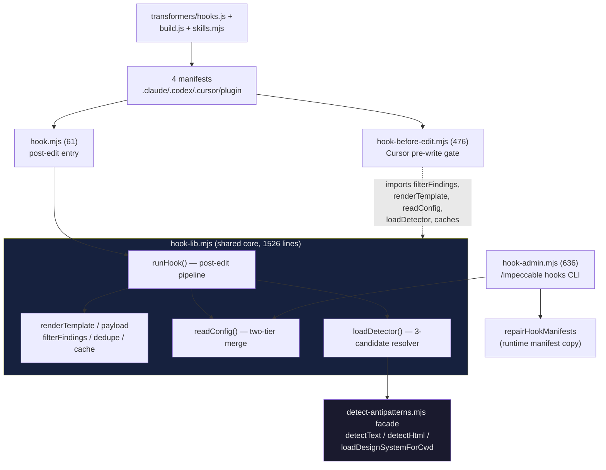
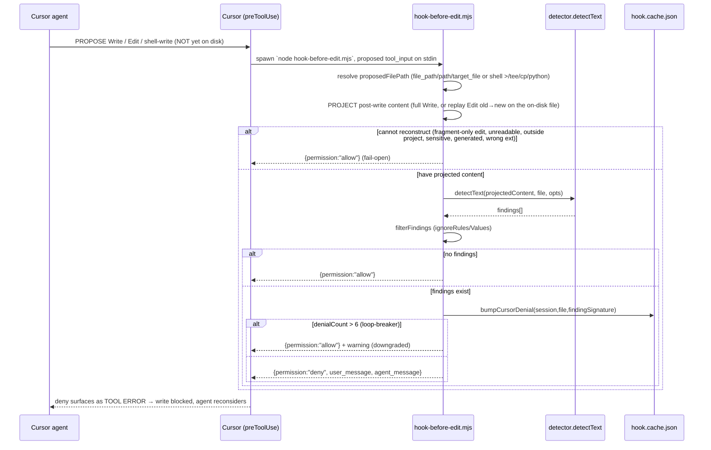
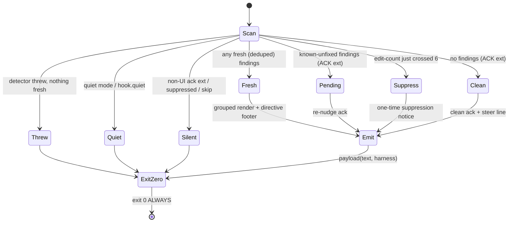
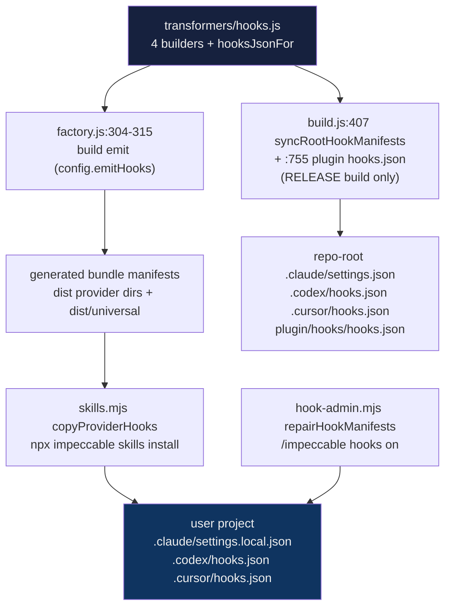

# Impeccable Hook System + Per-Project Config Model — Deep Technical Audit

**Subsystem:** the provider-native **hooks** that run Impeccable's deterministic
design detector automatically on every file edit — a **post-edit advisory
surface** for Claude Code / Codex and a **pre-write blocking gate** for Cursor —
plus the shared hook library, the `/impeccable hooks` admin CLI, the build-time
manifest generation, the install/consent path, and the **two-tier per-project
config** (`.impeccable/config.json` team-shared + `config.local.json`
per-developer).

**Audience:** the YoinkIt team. YoinkIt today is map (headless) → capture (real
browser) → emit-spec, with no automated agent-feedback loop. Impeccable's hook
system *is* that loop for a deterministic checker, and it is the closest
reference for the question this subsystem answers: **how to wire YoinkIt's own
deterministic checks (capture-spec schema validation, motion-coverage gates,
"is this animation actually captured?") into Claude Code / Codex / Cursor
harness hooks without breaking the agent's turn.**

Hold the audit's inversion the whole way through (see
[`00-EXECUTIVE-SUMMARY.md`](../../00-EXECUTIVE-SUMMARY.md)): Impeccable *writes
code into the user's repo* and treats inspection as free, so its hook can afford
to fire the full detector on every edit and lean on the model to act on findings.
YoinkIt emits a spec and refuses to write code, and its hard problem is firing
real-browser motion — so what transfers from this subsystem is the **control
posture** (post-edit surface vs pre-write gate), the **"never break the turn"
contract**, the **anti-nag machinery**, and the **two-tier config + ask-once
consent** — not the assumption that running the check is cheap or that a finding
maps to an edit.

All paths are under `source/` unless noted.

> **Deep dives.** This document is the overview. Five companions go to the floor
> on the parts a fresh agent would reason about or rebuild into YoinkIt, and they
> re-verify every line number against `source/` (corrections flagged inline and
> collected below):
>
> - [`05a-hook-models-and-runtime-core.md`](05a-hook-models-and-runtime-core.md): the two hook models traced end to end, the shared `runHook` pipeline and emission-priority ladder, harness/target-file resolution (incl. Codex `apply_patch` patch-body parsing), co-located-stylesheet expansion, the scan surface (skip gates, the two generated-file mechanisms, the 3-candidate detector loader, post-edit's 2-of-4-engine coverage and Cursor's text-only pre-write coverage), and the **"never break the turn" fail-open contract** through every error path.
> - [`05b-anti-nag-and-the-directive.md`](05b-anti-nag-and-the-directive.md): the qualified no-silent-fires policy, the per-session dedup cache, edit-count suppression, the three ack states and the `ACK_EXTS` gate, the Cursor per-signature denial loop-breaker, and the directive footer as a tuned prompt.
> - [`05c-config-and-ignore-model.md`](05c-config-and-ignore-model.md): the two-tier config schema, the three ignore axes (incl. the in-lib CSS color parser for `design-system-color` matching), env overrides, consent storage, the `cli/lib` duplication, and the **two divergent `.git/info/exclude` writers** in the hook/config subsystem.
> - [`05d-admin-cli-and-contract.md`](05d-admin-cli-and-contract.md): the `/impeccable hooks` CLI (`status`/`on`/`off`/`ignore-*`/`reset`), the runtime manifest-repair machinery, the agent-facing contract (`hooks.md`), and the intentional-findings policy + taught escape-hatch.
> - [`05e-manifest-generation-and-install.md`](05e-manifest-generation-and-install.md): the build-time manifest builders, per-provider `emitHooks` opt-in (3 of 13), the four placement paths, the four committed manifests, the `npx impeccable skills install` path (merge-don't-clobber, leave-it-never-duplicate, skill-root rewrite), and the ask-once consent decision.
>
> **First-draft corrections (re-verified against `source/`).** The retired draft
> (former report 06) was directionally right but stale in specifics. The
> load-bearing fixes:
>
> - **Line counts.** `hook-before-edit.mjs` is **476** lines (not 477), `hook-lib.mjs` **1526** (not 1527), `hook-admin.mjs` **636** (not 637). Interior anchors are unaffected. (05a, 05b, 05d)
> - **`DEFAULT_CONFIG` shape.** The frozen default (`hook-lib.mjs:72-81`) also carries `designSystem:{enabled:true}`, `ignoreRules:[]`, `ignoreFiles:[]`, `ignoreValues:[]` — the draft's §4b listed only `enabled/quiet/auditLog/limits`. (05c)
> - **`hook.pending.json` is a tombstone, not an active state file.** Nothing in the current code writes it; the live Cursor denial state is `cursorDenials` inside `hook.cache.json` (`hook-before-edit.mjs:351-363`). `hook.pending.json` survives only in the git-exclude pattern list and the `reset` cleanup. The draft's §4e and `hooks.md:28` ("Cursor pending queue") read it as live. (05b, 05c, 05d)
> - **The manifest duplication is two shape-definitions, not "three copies of the JSON."** The shape is defined independently in `transformers/hooks.js` (4 builders) and `hook-admin.mjs` `HOOK_MANIFEST_TARGETS`; the committed manifests are generated from the first; `skills.mjs` is a *consumer* that reads+merges the bundled file (it duplicates only the 5-element marker list + merge/strip logic). The `hook-lib` ↔ `cli/lib` config-layout/color-parser duplication is a separate axis. (05e, 05c)
> - **Two divergent `.git/info/exclude` writers in the hook/config subsystem.** `ensureHookGitExcludes` (`hook-lib`, 3 patterns, marker `# impeccable-hook-ignore-*`) and `ensureConfigGitExclude` (`cli/lib`, 1 pattern, marker `# impeccable-config-ignore-*`); both list `config.local.json`, so it can appear in both blocks. Live mode has a third writer outside this slice. (05c)
> - **`IMPECCABLE_HOOK_COMMAND_MARKERS` carries 3 legacy tombstone script names** (`hook-probe.mjs`, `hook-after-edit.mjs`, `hook-stop.mjs`) that no longer exist — evidence of earlier hook designs, kept to clean stale installs. (05d, 05e)
> - **Post-edit uses only 2 of the detector's 4 engines; Cursor pre-write uses 1.** Post-edit dispatches `.html` to `detectHtml` (static-html cascade) and non-HTML to `detectText` (regex), plus `loadDesignSystemForCwd`; Cursor pre-write uses only `detectText` over reconstructed proposed content. Neither uses the Puppeteer/visual engines. And re-confirmed: `cli/engine/detect-antipatterns.mjs` is a **50-line re-export facade** (the upstream `source/CLAUDE.md`'s references to lines ~1837 / ~2058 inside it are stale; see report [`01`](../01-detector-engine/01-detector-engine.md)). (05a)
> - **Consent is never read by the hook runtime.** `readConfig` reads `enabled/quiet/auditLog/limits` + ignores, not `consent`; installer consent is read/written by the CLI module (`getHookConsent`/`setHookConsent`), while `/impeccable hooks on` also writes local accepted consent through `hook-admin.mjs`. Consent gates install/enable flows, not runtime scanning. (05c, 05e)

---

## File map

Click-through index of the subsystem (relative to `source/`). Line counts
re-verified at audit time.

| File | Lines | Role |
|---|---|---|
| **Hook runtime (the two entry points + shared core)** | | |
| [`skill/scripts/hook.mjs`](../../source/skill/scripts/hook.mjs) | 61 | Post-edit entry (Claude/Codex). Thin stdin→`runHook`→stdout adapter; sets the re-entrancy depth guard; always exits 0 |
| [`skill/scripts/hook-before-edit.mjs`](../../source/skill/scripts/hook-before-edit.mjs) | 476 | Cursor pre-write blocking gate. Reconstructs the *proposed* content (Write, projected Edit, or shell write), denies on findings |
| [`skill/scripts/hook-lib.mjs`](../../source/skill/scripts/hook-lib.mjs) | 1526 | **The shared core.** Config read, finding filter, dedup, render, cache, the detector loader, `runHook`, `payload`. Unit-testable without a subprocess |
| **Admin + agent contract** | | |
| [`skill/scripts/hook-admin.mjs`](../../source/skill/scripts/hook-admin.mjs) | 636 | `/impeccable hooks <on\|off\|status\|ignore-*\|reset>` CLI; edits config; runtime manifest repair |
| [`skill/reference/hooks.md`](../../source/skill/reference/hooks.md) | 90 | Agent-facing docs for `/impeccable hooks` + the intentional-finding policy |
| **Config model** | | |
| [`.impeccable/config.json`](../../source/.impeccable/config.json) | 84 | The live unified config (`hook` + `detector` keys) |
| [`cli/lib/impeccable-config.mjs`](../../source/cli/lib/impeccable-config.mjs) | 638 | CLI-side config reader/writer (duplicate of `hook-lib`'s slice) + `getHookConsent`/`setHookConsent` + `ensureConfigGitExclude` |
| [`skill/scripts/lib/impeccable-paths.mjs`](../../source/skill/scripts/lib/impeccable-paths.mjs) | 126 | `.impeccable/` path layout (design sidecar, live config). The hook does **not** import it |
| [`skill/scripts/lib/is-generated.mjs`](../../source/skill/scripts/lib/is-generated.mjs) | 69 | `git check-ignore` + header-marker "is generated?" — used by the **live** pipeline, **not** the hook |
| **Build-time manifest generation** | | |
| [`scripts/lib/transformers/hooks.js`](../../source/scripts/lib/transformers/hooks.js) | 120 | The manifest *builders* (4) + `hooksJsonFor(provider)` |
| [`scripts/lib/transformers/providers.js`](../../source/scripts/lib/transformers/providers.js) | 122 | `PROVIDERS` table; `emitHooks` set on `cursor`/`claude-code`/`codex` only (3 of 13) |
| [`scripts/lib/transformers/factory.js`](../../source/scripts/lib/transformers/factory.js) | 326 | Per-skill emit loop; the hook emit gate at `:304-315` |
| [`scripts/build.js`](../../source/scripts/build.js) | 794 | `syncRootHookManifests` (`:407`) + plugin `hooks/hooks.json` writer (`:755`) — **release build only** |
| **Install + consent** | | |
| [`cli/bin/commands/skills.mjs`](../../source/cli/bin/commands/skills.mjs) | 1818 | `npx impeccable skills install`: `PROVIDER_HOOK_ARTIFACTS`, `copyProviderHooks`, the consent prompt |
| **The detector call surface (boundary — report 01 owns the internals)** | | |
| [`cli/engine/detect-antipatterns.mjs`](../../source/cli/engine/detect-antipatterns.mjs) | 50 | Re-export facade. The hook calls `detectText` / `detectHtml` / `loadDesignSystemForCwd` only |
| **The four installed/bundled manifests** | | |
| [`.claude/settings.json`](../../source/.claude/settings.json) | 18 | `PostToolUse`, matcher `Edit\|Write\|MultiEdit`, `${CLAUDE_PROJECT_DIR}` |
| [`.codex/hooks.json`](../../source/.codex/hooks.json) | 18 | `PostToolUse`, matcher `Edit\|Write\|apply_patch`, `$(git rev-parse --show-toplevel)/.agents/...` |
| [`.cursor/hooks.json`](../../source/.cursor/hooks.json) | 11 | `version:1` + `preToolUse`, `hook-before-edit.mjs` |
| [`plugin/hooks/hooks.json`](../../source/plugin/hooks/hooks.json) | 18 | `PostToolUse`, `${CLAUDE_PLUGIN_ROOT}` (marketplace `/plugin install`) |

> Note: the repo mirrors the canonical `skill/scripts/` tree into every provider
> directory (`.claude/skills/impeccable/scripts/`, `.cursor/...`, `.agents/...`,
> `.gemini/...`, etc.) as committed distribution artifacts. They are *generated*,
> not authored — edit `skill/scripts/` and `bun run build:release` regenerates
> the rest. This audit reads the canonical source. (How the multi-harness build
> works in general is report [`04`](../04-skill-harness/04-skill-harness.md); this
> report owns only the **hook** slice of it.)

---

## 1. Orientation: two models, one core, one config, one contract

Impeccable ships a single `/impeccable` skill plus a small set of
**provider-native hook manifests** the agent harness executes automatically on
file edits. There are two distinct hook *models*, not one, and they share one
library and one config:

- **Post-edit advisory surface** (Claude Code, Codex). The agent's edit lands on
  disk, *then* `hook.mjs` runs the detector against the touched file(s) and
  injects findings back into the next model turn as a developer-role system
  reminder. Advisory, never blocking, **always exit 0**.
- **Pre-write blocking gate** (Cursor). `hook-before-edit.mjs` runs *before* the
  write lands, **reconstructs** the proposed file content (Cursor hands you the
  operation, not the result), runs the same detector facade/config/filter stack
  but only through `detectText`, and returns
  `{permission:"deny"}` to stop the write when findings exist.

Both delegate to `hook-lib.mjs`, both read `.impeccable/config.json` +
`config.local.json`, and both obey the one contract that shapes every decision:
**the hook must never break the agent's turn** — every failure path swallows the
error and allows / exits 0.



---

## 2. The two round-trips

### Diagram 1 — post-edit advisory surface (Claude Code / Codex)

```mermaid
sequenceDiagram
    participant Agent
    participant Harness as Harness (PostToolUse)
    participant Hook as hook.mjs
    participant Lib as hook-lib.runHook()
    participant Det as detector (detectText/Html)
    participant Cache as hook.cache.json

    Agent->>Harness: Edit / Write / MultiEdit (apply_patch on Codex) lands ON DISK
    Note over Agent,Harness: file already written — edit is NOT gated
    Harness->>Hook: spawn `node hook.mjs`, event JSON on stdin
    Hook->>Hook: snapshot inherited env, then set IMPECCABLE_HOOK_DEPTH=1
    Hook->>Lib: runHook({stdinJson, env, cwd})
    Lib->>Lib: re-entrancy + kill-switch guards; parse event; resolve harness
    Lib->>Lib: resolveTargetFiles (+ apply_patch body parse) → expandScanTargets (+ co-located CSS, cap 6)
    Lib->>Lib: per-file skip gates (sensitive / generated / ext / ignoreFiles / missing)
    Lib->>Cache: bumpEditCount (primary files) — suppress after >6 edits
    Lib->>Det: detectHtml(.html) | detectText(other), each try/caught
    Det-->>Lib: findings[]
    Lib->>Lib: filterFindings (ignoreRules/Values) → dedupeAgainstCache
    Lib->>Cache: rememberFindings(fresh); persistCache (gc >8 sessions)
    alt fresh findings
        Lib-->>Hook: stdout = {hookSpecificOutput.additionalContext: "[impeccable@1] ...fix these..."}
    else known-but-unfixed (UI file)
        Lib-->>Hook: pending re-nudge ack
    else clean (UI file, not quiet)
        Lib-->>Hook: clean ack
    end
    Hook->>Hook: writeAuditLog; process.exit(0) (ALWAYS)
    Harness-->>Agent: additionalContext injected as developer-role context NEXT turn
    Note over Agent: reads findings, fixes or justifies, surfaces resolution in reply
```

### Diagram 2 — pre-write blocking gate (Cursor)



### The core difference

Post-edit is a **reactive surface**: the byte is already on disk, the hook can
only push a reminder into the next turn, and it leans on the model's cooperation
to act on it. Pre-write is a **proactive gate**: the hook must *reconstruct* what
the file would contain (Cursor doesn't hand you the result, only the operation),
and a `deny` actually prevents the write — the bad content never lands. Post-edit
therefore optimizes for *"keep nudging without nagging"* (dedup + pending
re-nudge + clean acks + edit-count suppression). Pre-write optimizes for *"block
once, then yield"* (a per-signature denial counter that downgrades to allow after
6 repeats so the agent can't deadlock). **Same detector, same config, opposite
control posture.** Full traces with every line reference are in
[`05a`](05a-hook-models-and-runtime-core.md).

One asymmetry worth pinning here because it bounds the Cursor guarantee: a
targeted `Edit` whose `old_string` cannot be located on disk, or any edit
delivered as fragments only, is **allowed through unchecked** (the
`fragment-only-edit` sentinel). The pre-write block is airtight only for full
writes and successfully-projected edits — see [`05a`](05a-hook-models-and-runtime-core.md).

---

## 3. The shared runtime core (`hook-lib.runHook`)

`hook.mjs` is a deliberately tiny adapter (61 lines): snapshot the inherited env
*first*, then set `IMPECCABLE_HOOK_DEPTH=1` so the re-entrancy guard checks the
**parent's** value (`hook.mjs:29-30`); read stdin; call `runHook`; write the
audit log; write stdout and `process.exit(0)`. The top-level `.catch` audit-logs
and **still exits 0** (`hook.mjs:47-61`). All real logic lives in
`hook-lib.runHook()` (`hook-lib.mjs:1274-1517`), split out so it is unit-testable
without a subprocess.

The pipeline, in order: re-entrancy guard (`:1280`) → kill switch
`IMPECCABLE_HOOK_DISABLED` (`:1284`) → parse event (`:1290`) → resolve harness
(`:1300`, `resolveHarness:959` returns `'claude'` for **both** Claude and Codex;
only Cursor diverges, via `event.conversation_id` or explicit env) → resolve
target files (`:1306`, including Codex `apply_patch` patch-body parsing because
Codex exposes touched files only inside `tool_input.command`) → expand to
co-located/imported stylesheets up to `MAX_SCAN_TARGETS = 6` (`:1308`) → config
gate (`:1316`) → per-file loop with skip reasons (`:1338-1413`) → `persistCache`
(`:1415`) → the **emission-priority ladder** (`:1417-1509`).

The ladder is the heart of the post-edit model:



The output envelope is provider-shaped by `payload()` (`:1519-1526`): Claude/Codex
get `{hookSpecificOutput:{hookEventName, additionalContext}}`; Cursor gets
`{additional_context}`. Every message is prefixed `[impeccable@1]`
(`ENVELOPE_PREFIX`, `:44`).

**The scan surface.** `ALLOWED_EXTS` (`:46-49`) is the 13-extension allowlist;
`SENSITIVE_PATH` (`:59-65`, not config-overridable) hard-skips `.env`/`.git`/keys;
`GENERATED_PATH` (`:68`) skips `*.generated.*`, `*.d.ts`, `*.min.*`,
`node_modules/`, build dirs, lockfiles. The hook deliberately uses these cheap
**path regexes** rather than the richer `is-generated.mjs` (which shells out to
`git check-ignore` and reads header markers) because it runs synchronously on
every edit under a 5-second timeout; `is-generated.mjs` is reserved for the
interactive live pipeline. The detector itself is resolved by a 3-candidate
loader (`DETECTOR_CANDIDATES:1152-1156`: a bundled `detector/` next to the hook
in the built skill layout, else the repo-root `cli/engine/`), and the hook
invokes only **two** of the detector's four engines — `detectText` (regex) and
`detectHtml` (static-html cascade) — plus `loadDesignSystemForCwd`. It never
touches the Puppeteer or visual engines. Full detail in
[`05a`](05a-hook-models-and-runtime-core.md).

**The fail-open contract.** Every error and skip path returns `exitCode:0`
(post-edit) or `{permission:"allow"}` (pre-write): the entry `.catch`, the outer
`runHook` try/catch (`:1510-1516`), every `detector throws` branch, malformed or
empty stdin, a missing detector. A hook that crashes the agent's turn gets
uninstalled instantly — so the system refuses to ever be that hook. This is the
single most transferable discipline in the subsystem.

---

## 4. Anti-nag: the hardest UX problem in an automated agent loop

An advisory hook that fires on *every* edit will nag the model into ignoring it,
and a blocking gate that denies the *same* write forever will deadlock the agent.
Impeccable solves both, three ways (full mechanics in
[`05b`](05b-anti-nag-and-the-directive.md)):

- **Per-session dedup** (`dedupeAgainstCache:726`, `findingCacheKey:748`). A
  finding is keyed `antipattern:line:value` and remembered per
  `(session, file)`; the same finding is not re-reported as *fresh*. The cache
  (`hook.cache.json`) is gc'd to the 8 most recent sessions.
- **Edit-count suppression** (`EDIT_COUNT_THRESHOLD = 6`, `:1367-1380`). Only
  directly-edited (primary) files are counted; after 6 edits to one file the
  hook emits a **one-time** suppression notice (exactly when `editCount`
  crosses 6) and then goes silent for that file.
- **The Cursor loop-breaker** (`hook-before-edit.mjs:444-459`). A per-
  `(session, file, finding-signature)` denial counter **downgrades deny→allow
  after 6 repeats** with a warning, so the agent can never get stuck
  re-proposing a blocked write.

The "no silent fires" policy is deliberate (`hook-lib.mjs:1177-1201`): the model
forgets a prior reminder once tool output scrolls past, so a clean/pending **ack**
keeps the discipline in context. It is still a qualified policy, not an absolute
invariant: detector errors, quiet mode, non-UI ack extensions, and post-notice
edit-count suppression deliberately fall silent. Plain `.ts`/`.js` files (in
`ALLOWED_EXTS` but not `ACK_EXTS`, `:51-54`) are scanned yet stay silent unless
something is found. And the **directive footer** (`directiveFooter:1254-1266`) is
a carefully tuned prompt: imperative ("Handle these before finalizing"), an
explicit judgment clause ("a finding is not automatically a defect; intentional
motion, demos, fixtures... can be valid"), and an acknowledgement instruction so
the resolution surfaces in the model's reply (the user never sees the raw
envelope).

---

## 5. The config model

Two files, one unified schema (full detail in
[`05c`](05c-config-and-ignore-model.md)):

- **`.impeccable/config.json`** — team-shared, committed. Holds `hook`
  (runtime/lifecycle) and `detector` (ignore filters).
- **`.impeccable/config.local.json`** — per-developer, gitignored via
  **`.git/info/exclude`** (not `.gitignore`). Holds the per-developer
  `hook.consent` decision and any `--local` ignore-values.

`readConfig(cwd)` (`hook-lib.mjs:137-148`) reads both, **local last**. Local wins
for scalar hook settings, `designSystem.enabled`, and duplicate ignore-value
keys, while `ignoreRules`/`ignoreFiles` are additive unions. Back-compat reads
detector filters from an older `hook` subtree before applying the canonical
`detector` subtree, which overrides scalars/duplicate value entries and extends
rule/file arrays. The `hook` subtree gates runtime (`enabled`, `quiet`,
`auditLog`, `limits`); the `detector` subtree carries the **three ignore axes**
that are shared with manual `npx impeccable detect` so a suppression travels:

- **`ignoreRules`** — antipattern ids dropped entirely.
- **`ignoreFiles`** — globs (a custom `globToRegex` supporting `**`,`*`,`?`,`{a,b}`).
- **`ignoreValues`** — the richest axis: `{rule, value, files?, reason?, createdAt?}`
  with a `value:"*"` wildcard and path-scoped `files`. Only five rules carry an
  ignorable value, and for `design-system-color` the value is matched by
  **parsed RGBA** — a whole hex/rgb/hsl color parser lives in the hook lib so
  `#fff` matches `rgb(255,255,255)`.

Two duplication facts that matter for anyone copying this: (1) `cli/lib/impeccable-config.mjs`
re-implements the config-path layout, the color parser, `globToRegex` plus a
functionally parallel matcher, and the ignore semantics, because (per its header)
the published CLI and the bundled skill scripts "live in separate trees and
cannot share runtime code" — kept in sync by hand. (2) There are **two independent
`.git/info/exclude` writers** with different marker comments and pattern sets in
the hook/config subsystem (`ensureHookGitExcludes` in `hook-lib`, three patterns;
`ensureConfigGitExclude` in `cli/lib`, one pattern), so `config.local.json` can end
up listed in both blocks. Installer **consent** (`getHookConsent`/`setHookConsent`)
writes only `config.local.json` and is read only by the CLI; `/impeccable hooks on`
also writes local accepted consent via `hook-admin.mjs`. The hook runtime never
reads consent.

---

## 6. The admin CLI + the agent contract

`/impeccable hooks` is the user's runtime control surface, driven by the LLM from
`reference/hooks.md` (full detail in [`05d`](05d-admin-cli-and-contract.md)).
`hook-admin.mjs` (636 lines) handles `status` / `on` / `off` / `ignore-rule` /
`ignore-file` / `ignore-value` / `reset`. Notable:

- `on` (`setEnabled:282`) writes `hook.enabled:true`, records local
  `consent:'accepted'`, and calls `repairHookManifests` (`:309`) to install/merge
  the provider manifests for any installed skill folder.
- `ignore-rule overused-font` is **rejected unless `--all-values`** (`:493`),
  forcing value-specific suppression for fonts.
- `reset` strips only the `hook`/`detector` subtrees (preserving siblings like
  `updateCheck`) and deletes the state files.

Unlike the hook itself, the admin CLI is **fail-closed** (`exit 1` on bad input)
— it is a user-invoked tool, not an in-turn hook. The agent contract's load-bearing
rule is the intentional-findings policy: **the hook itself never writes ignore
config**; an exception is persisted only after the user explicitly confirms,
always through `hook-admin.mjs`, and always at the **narrowest** scope. The hook
*teaches the model its own escape hatch* — each value-specific finding ships the
exact `/impeccable hooks ignore-value ... --shared --reason "..."` command
(`formatFindingIgnoreCommand:889`) — but only the user-confirmed admin path runs it.

---

## 7. How a manifest is generated, shipped, and installed

The manifest JSON lives in one build module and is placed four ways (full detail
in [`05e`](05e-manifest-generation-and-install.md)):



Only **3 of 13 providers** opt in via `emitHooks` (`cursor`, `claude-code`,
`codex`). The install path is the one users hit: it asks consent **once** (default
yes, recorded per-developer, never re-asked — `decideHookInstall:1317`), writes the
Claude manifest into the **gitignored `.claude/settings.local.json`** so the hook
stays machine-local, **merges rather than clobbers** any existing manifest
(preserving the user's other hooks), and uses a **leave-it-never-duplicate** rule
so a hook the user moved into the shared `settings.json` is honored in place and
never double-fires. The Codex hook is a `.agents`/`.codex` pair: the skill ships
under `.agents/skills/...`, the manifest lands in `.codex/hooks.json`.

---

## 8. Patterns worth stealing for YoinkIt

Ranked by leverage for wiring YoinkIt's deterministic checks (capture-spec
validity, motion-coverage gates) into the agent harness. Each is expanded in the
named sub-dive.

1. **One library, thin per-event adapters, harness recovered at runtime —
   STEAL.** `hook.mjs` (61 lines) and `hook-before-edit.mjs` both delegate to
   `hook-lib.mjs`; `payload()` and `resolveHarness()` branch on provider at the
   seam. YoinkIt should keep its capture/validation engine harness-agnostic (it
   already aims for ~6 browser primitives) and add only thin Claude/Codex/Cursor
   shims. *([`05a`](05a-hook-models-and-runtime-core.md))*

2. **The "never break the turn" fail-open contract — STEAL.** Every error path
   exits 0 / allows; the detector is always try/caught; the entry `.catch`
   audit-logs and exits 0. A capture/validation hook that crashes the agent gets
   uninstalled instantly. This is non-negotiable. *([`05a`](05a-hook-models-and-runtime-core.md))*

3. **Post-edit context injection via `additionalContext` + envelope prefix +
   tuned directive footer — STEAL.** This is the exact mechanism for feeding a
   deterministic finding back into the loop without breaking the turn — what
   YoinkIt would use to surface "your recreation drifted from the captured spec at
   frame 12" after an edit. Steal the `[impeccable@1]`-style prefix and especially
   the directive-footer design (imperative + explicit judgment clause +
   acknowledge-what-you-changed). *([`05b`](05b-anti-nag-and-the-directive.md))*

4. **The three anti-nag mechanisms — STEAL (all three).** Dedup by finding-key,
   edit-count suppression with a one-time notice, and the per-signature loop-breaker
   that downgrades deny→allow. A YoinkIt coverage gate needs all three or it will
   spam (advisory) or stall (blocking). *([`05b`](05b-anti-nag-and-the-directive.md))*

5. **Two-tier config + ask-once-remembered consent — STEAL (when config arrives).**
   Team-shared `config.json` (which surfaces to capture, coverage thresholds,
   ignore lists) committed; per-developer install/consent decisions in a
   `config.local.json` gitignored via `.git/info/exclude`. The `.git/info/exclude`
   trick keeps the local file invisible without touching the tracked `.gitignore`.
   *([`05c`](05c-config-and-ignore-model.md))*

6. **"Teach the model its own escape hatch, but gate the write" — STEAL.** Each
   finding ships the exact suppression command, yet only a user-confirmed admin
   command writes it. A capture tool must never let the agent silently mark a
   motion as "ignore" — that is how coverage quietly rots. *([`05d`](05d-admin-cli-and-contract.md))*

7. **Merge-don't-clobber install + machine-local settings + per-provider opt-in —
   STEAL.** YoinkIt's installer must never overwrite a user's `settings.json`,
   should write the hook to a gitignored local file, and should opt in per harness.
   *([`05e`](05e-manifest-generation-and-install.md))*

8. **Pre-write content reconstruction — ADAPT (mostly does not transfer).** Cursor's
   gate reconstructs the would-be file because it blocks before the write. YoinkIt's
   checks (did the motion get captured? does the spec validate?) are inherently
   *post-hoc* and depend on a real-browser run — there is rarely a "proposed
   artifact" to reconstruct and block on. Default to the **post-edit surface**;
   reserve a blocking gate only for a cheap synchronous invariant (e.g. "the spec
   JSON the agent just wrote is schema-valid"). *([`05a`](05a-hook-models-and-runtime-core.md))*

9. **The by-hand multi-copy sync hazard — AVOID.** The manifest shape is defined
   twice, the marker list + merge logic twice more, the config layout / color
   parser twice, and the git-exclude writer twice. Impeccable documents the CLI/skill
   split as unavoidable, but most of these are drift risk. If YoinkIt splits CLI vs
   bundled code, share one module or generate it — do not hand-maintain parallel
   copies. *([`05c`](05c-config-and-ignore-model.md), [`05e`](05e-manifest-generation-and-install.md))*

---

## Appendix: surprises / risks / drift

- **Cursor `fragment-only-edit` is a real coverage gap.** A targeted `Edit` whose
  `old_string` can't be located, or any fragment-only edit, is allowed unchecked.
  The blocking guarantee holds only for full writes and successfully-projected
  edits. *([`05a`](05a-hook-models-and-runtime-core.md))*
- **`hook.pending.json` is write-dead.** Referenced in the git-exclude list and
  deleted by `reset`, but never written — a tombstone of an earlier Cursor-pending
  design. Live Cursor denial state is in `hook.cache.json` (`cursorDenials`).
- **Three legacy hook-script markers** (`hook-probe.mjs`, `hook-after-edit.mjs`,
  `hook-stop.mjs`) in `IMPECCABLE_HOOK_COMMAND_MARKERS` point at files that no
  longer exist — kept so old installs get cleaned. Evidence of a prior Stop-hook /
  after-edit / probe design.
- **`MAX_SCAN_TARGETS = 6` is a hard cap** on co-scanned files; a large component
  tree silently won't fully scan past it.
- **Codex `apply_patch` needs patch-body parsing** to know which file changed — the
  path isn't in a structured field. Any YoinkIt Codex hook hits the same requirement.
- **The fail-closed admin vs fail-open hook split is intentional** and worth
  internalizing: the in-turn hook must never throw; the user-invoked admin CLI may.
- **The upstream `source/CLAUDE.md` is stale** about the engine: its rule-authoring
  recipe still cites `detect-antipatterns.mjs` "browser loop ~line 1837 / jsdom loop
  ~line 2058", but that file is now a 50-line re-export facade (the loops moved into
  `engines/`). See report [`01`](../01-detector-engine/01-detector-engine.md).
- **A latent dedup-key inconsistency** (`hook-admin.mjs`): `addIgnoreValue` dedups on
  `rule\0value` while `mergeIgnoreValueEntries` dedups on `rule\0value\0files`.
  Harmless today (the CLI never sets `files`) but inconsistent. *([`05d`](05d-admin-cli-and-contract.md))*
