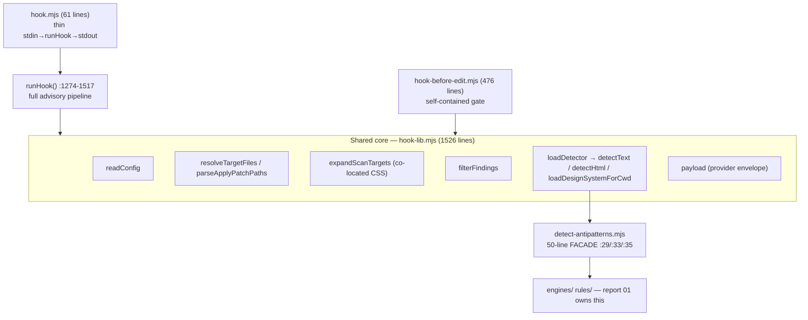
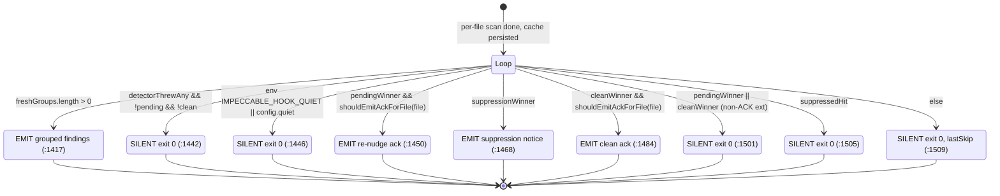
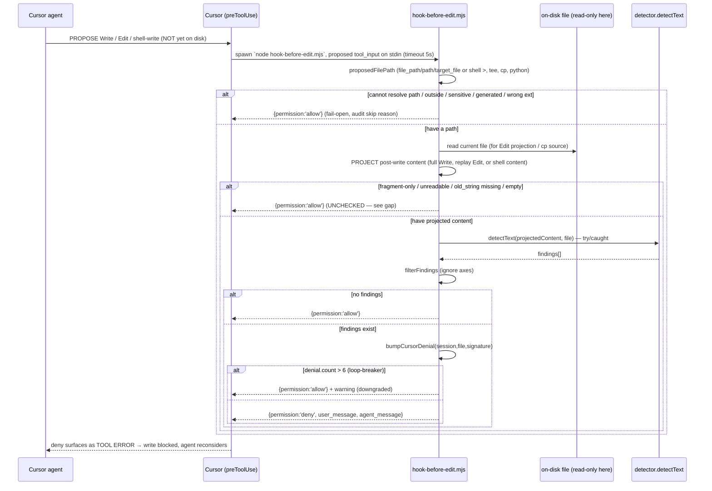

# Hook deep dive 05a — the two hook models, the shared runtime core, and the fail-open contract

Companion to [`05-hook-system.md`](05-hook-system.md). That report is the
overview. This one goes to the floor on the spine of the subsystem: **the two
opposite control postures Impeccable runs over one detector**, the single
runtime function that powers the advisory path, the proactive gate that powers
the blocking path, the exact surface they scan, and the one invariant that makes
either safe to install — **the hook must never break the agent's turn**. Read
this if a fresh agent is going to rebuild the mechanism, or reason about why a
finding shows up after an edit on Claude but blocks the write on Cursor.

The YoinkIt question this sub-dive answers: **how do you wire a deterministic
check — capture-spec schema validation, a motion-coverage gate, "is this
animation actually captured?" — into Claude Code / Codex / Cursor harness hooks
without breaking the agent's turn?** Impeccable is the worked reference.

All `file:line` references are into
[`../../source/skill/scripts/`](../../source/skill/scripts/) unless noted. Every
line number below was re-verified against source; drift from the first-draft
report and from the upstream `source/CLAUDE.md` is flagged inline.

**Scope boundaries (cross-link, don't duplicate):**
- The anti-nag *mechanics* (dedup cache shape, edit-count suppression timing,
  Cursor denial loop-breaker, ack wording, the directive footer) belong to
  [`05b`](05b-anti-nag-and-the-directive.md). This doc describes the emission
  *order*; 05b owns the *why*.
- The config *schema*, ignore axes, and `.git/info/exclude` trick belong to
  [`05c`](05c-config-and-ignore-model.md).
- The `/impeccable hooks` admin CLI + agent contract belong to
  [`05d`](05d-admin-cli-and-contract.md).
- Build-time manifest generation + install/consent belong to
  [`05e`](05e-manifest-generation-and-install.md).
- The detector engine internals (`engines/`, `rules/`, cascade, color) belong to
  report [`01`](../01-detector-engine/01a-rule-trinity-and-dispatch.md). My
  boundary is the 50-line re-export facade
  [`cli/engine/detect-antipatterns.mjs`](../../source/cli/engine/detect-antipatterns.mjs).

---

## 1. Two models, one core — the map

There are **two distinct hook models**, not one, and the difference is the whole
story.

| | Post-edit advisory | Pre-write blocking |
|---|---|---|
| Harnesses | Claude Code, Codex | Cursor |
| Harness event | `PostToolUse` | `preToolUse` |
| Entry script | [`hook.mjs`](../../source/skill/scripts/hook.mjs) (61 lines) | [`hook-before-edit.mjs`](../../source/skill/scripts/hook-before-edit.mjs) (476 lines) |
| When it fires | **after** the byte is on disk | **before** the write lands |
| Input it gets | the edit *result* (file path → read from disk) | the proposed *operation* (must reconstruct content) |
| What it can do | push a reminder into the **next** turn | **deny** the operation now |
| Leans on | model cooperation | hard block |
| Output shape | `{hookSpecificOutput.additionalContext}` | `{permission: "deny"\|"allow", user_message, agent_message}` |
| Never-break invariant | `exitCode: 0` always | `{permission: "allow"}` on any error/skip |



`hook.mjs` is a thin adapter and pushes **all** logic down into
`hook-lib.runHook()`. `hook-before-edit.mjs` is **self-contained** — it imports,
among others, `filterFindings`, `loadDetector`, `readConfig`,
`designSystemOptions`, `persistCache`, `readCache`, `renderTemplate`,
`matchesAnyGlob`, the path regexes, and generated/sensitive path guards from
`hook-lib.mjs`
([`hook-before-edit.mjs:16-33`](../../source/skill/scripts/hook-before-edit.mjs))
but owns its own `main()` and its own decision flow, because it does the hard
work the post-edit path never has to: reconstructing the file *before* it exists.

Both load the **same detector facade** through `loadDetector` and the same config
through `readConfig`, then pass through the same finding filters. Their engine
selection differs by posture: post-edit can read disk and dispatch HTML to the
static-HTML engine; pre-write only has reconstructed proposed content and uses
text/regex scanning. Same facade and policy, not exactly the same evidence.

> **Drift note (first draft):** `hook-before-edit.mjs` is 476 lines, not 477;
> `hook.mjs` is 61; `hook-lib.mjs` is 1526. Interior anchors are unaffected.

---

## A. The post-edit advisory round-trip (Claude Code / Codex)

### A.1 `hook.mjs` — the thin adapter (61 lines)

[`hook.mjs`](../../source/skill/scripts/hook.mjs) does five things and nothing
else. The contract is stated in its own header comment
([`hook.mjs:9`](../../source/skill/scripts/hook.mjs)): *"never break a turn.
Always exit 0."*

1. **Snapshot inherited env FIRST, then set the depth flag.**
   [`hook.mjs:29-30`](../../source/skill/scripts/hook.mjs):

   ```js
   const inheritedEnv = { ...process.env };
   process.env.IMPECCABLE_HOOK_DEPTH = process.env.IMPECCABLE_HOOK_DEPTH || '1';
   ```

   The ordering is load-bearing. The re-entrancy guard inside `runHook` reads
   the *parent's* depth. If `hook.mjs` set the env var before snapshotting, the
   guard would always see `1` and the hook would no-op on its first invocation.
   Snapshot first → the guard sees the parent's value (unset on a normal edit,
   set only if a hook-spawned edit re-triggered the harness). The export still
   propagates to any child process the hook itself might spawn.

2. **Read stdin** ([`hook.mjs:32-33`](../../source/skill/scripts/hook.mjs)). A
   TTY (no piped event) yields `''`; a read error falls through silently.

3. **Call `runHook({ stdinJson, env: inheritedEnv, cwd })`**
   ([`hook.mjs:35-39`](../../source/skill/scripts/hook.mjs)). All real work.

4. **`writeAuditLog`** ([`hook.mjs:41`](../../source/skill/scripts/hook.mjs)) —
   NDJSON, no-op unless `IMPECCABLE_HOOK_LOG` or `hook.auditLog` is set.

5. **Write stdout + `process.exit(0)`**
   ([`hook.mjs:43-44`](../../source/skill/scripts/hook.mjs)). The exit code is
   `result.exitCode || 0` — and `runHook` can only ever return `exitCode: 0`
   (see §F).

The top-level `.catch`
([`hook.mjs:47-61`](../../source/skill/scripts/hook.mjs)) is the last-ditch
guard: if anything `hook.mjs` itself did throws (a read error, a write error,
an `import` failure), it audit-logs the error, optionally prints to stderr under
`IMPECCABLE_HOOK_DEBUG`, and **still `process.exit(0)`**. There is no code path
out of `hook.mjs` that exits non-zero.

### A.2 `runHook()` — the advisory pipeline, traced end to end

All logic lives in
[`hook-lib.runHook()`](../../source/skill/scripts/hook-lib.mjs), lines
**1274-1517**, split out of `hook.mjs` so it is unit-testable without spawning a
subprocess. The whole body is wrapped in one `try { ... } catch` that converts
any throw to `exitCode: 0` (:1510-1516). Walking it in order:

| Step | Line | What | Skip/exit reason on failure |
|---|---|---|---|
| Re-entrancy guard | :1280 | `depthIsSet(env.IMPECCABLE_HOOK_DEPTH) \|\| depthIsSet(env.CLAUDE_HOOK_DEPTH)` → return | `reentrant` |
| Kill switch | :1284 | `truthy(env.IMPECCABLE_HOOK_DISABLED)` → return | `env-disabled` |
| Parse event | :1290-1298 | `JSON.parse(stdinJson)`; non-object → return | `stdin-malformed` / `stdin-empty` |
| Resolve harness | :1300 | `resolveHarness(env, event)` | — |
| Normalize event | :1301 | `normalizeHookEvent` (cursor-only no-op) | — |
| Resolve target files | :1306 | `normalizeScanTargets(resolveTargetFiles(...))` | — |
| Expand scan targets | :1308 | `expandScanTargets` adds co-located CSS | — |
| No targets | :1312-1314 | empty → return | `no-file-path` |
| Config gate | :1316-1319 | `readConfig`; `enabled === false` → return | `config-disabled` |
| Load detector | :1323-1327 | `loadDetector()`; missing → persist cache, return | `detector-missing` |
| Design-system opts | :1328 | `designSystemOptions(config, det, cwd)` | — |
| Per-file loop | :1338-1413 | scan each target (see below) | per-file `lastSkip` |
| Persist cache | :1415 | `persistCache(projectCwd, cache)` | — |
| Emission ladder | :1417-1509 | choose what to emit (see §A.4) | fallback `lastSkip` |

> **Drift note:** the draft and the upstream-style mental model say "config gate
> at `:1316`, detector at `:1323`." Both correct. But note the detector is
> loaded *after* the config gate and the empty-target check — so a disabled hook
> or an edit to a non-file never pays the `import()` cost.

### A.3 The per-file loop (`:1338-1413`)

Each target is run through an ordered gauntlet. Every gate records a `lastSkip`
reason into the audit and `continue`s; nothing throws out of the loop.

1. **Path traversal / sensitive** ([:1341-1344](../../source/skill/scripts/hook-lib.mjs)):
   `hasPathTraversal(filePath) || SENSITIVE_PATH.test(filePath)` → `sensitive`.
2. **Generated** ([:1345-1348](../../source/skill/scripts/hook-lib.mjs)):
   `GENERATED_PATH.test(filePath)` → `generated`.
3. **Extension** ([:1350-1355](../../source/skill/scripts/hook-lib.mjs)):
   not in `ALLOWED_EXTS` → `extension`.
4. **Ignore-file glob** ([:1357-1361](../../source/skill/scripts/hook-lib.mjs)):
   `matchesAnyGlob(rel, config.ignoreFiles) || matchesAnyGlob(abs, ...)` →
   `config-ignore-file`.
5. **Missing** ([:1362-1365](../../source/skill/scripts/hook-lib.mjs)):
   `!fs.existsSync` → `file-missing`.
6. **Edit-count suppression** ([:1367-1380](../../source/skill/scripts/hook-lib.mjs)):
   **primary (directly-edited) files only** — `bumpEditCount`; once `editCount >
   EDIT_COUNT_THRESHOLD` (`6`, [:92](../../source/skill/scripts/hook-lib.mjs)),
   set the one-time `suppressionWinner` *the moment the threshold is crossed*
   (`editCount === EDIT_COUNT_THRESHOLD + 1`) and skip. Co-scanned stylesheets
   are never edit-counted. (Timing mechanics → [`05b`](05b-anti-nag-and-the-directive.md).)
7. **Detect** ([:1382-1389](../../source/skill/scripts/hook-lib.mjs)): read the
   file, then dispatch by extension —
   - `.html` / `.htm` → `await det.detectHtml(filePath, scanOptions)`
   - everything else → `await det.detectText(content, filePath, scanOptions)`

   **Each call is individually wrapped in `try/catch`**
   ([:1386](../../source/skill/scripts/hook-lib.mjs) and
   [:1388](../../source/skill/scripts/hook-lib.mjs)): a throw sets `findings =
   []; detectorThrew = true` and the loop carries on. The detector throwing on
   one file never aborts the scan or the turn.
8. **Filter → dedup → remember** ([:1391-1412](../../source/skill/scripts/hook-lib.mjs)):
   `filterFindings` (ignore axes, [:616](../../source/skill/scripts/hook-lib.mjs)) →
   `dedupeAgainstCache` (per-session, [:726](../../source/skill/scripts/hook-lib.mjs)).
   Fresh findings → `rememberFindings` + push to `freshGroups`. Otherwise the
   file becomes the `pendingWinner` (known-but-unfixed) or `cleanWinner` (no
   findings at all), whichever slot is still empty. (Dedup shape → [`05b`](05b-anti-nag-and-the-directive.md).)

### A.4 The emission-priority ladder (`:1417-1509`)

After the loop, exactly one outcome is chosen. The order is a priority ladder —
the first matching rung wins and returns. This is the part the overview's
Diagram 1 sketches; here is the verified order with the exact guards.



The rungs, with their exact predicates:

1. **Fresh findings** ([:1417](../../source/skill/scripts/hook-lib.mjs)) —
   `freshGroups.length > 0`. Emit `renderGroupedTemplate(freshGroups, ...)`
   (one file → `renderTemplate`; many → a grouped block). This is the only
   non-silent rung that always wins.
2. **Detector threw, silently** ([:1442](../../source/skill/scripts/hook-lib.mjs)) —
   `detectorThrewAny && !pendingWinner && !cleanWinner`. If detection blew up and
   there is nothing else to say, say *nothing* (return `emitted: false, error:
   'detector-threw'`). A detector crash never surfaces to the model as noise.
3. **Quiet mode** ([:1446](../../source/skill/scripts/hook-lib.mjs)) —
   `truthy(env.IMPECCABLE_HOOK_QUIET) || config.quiet === true`. Silences acks;
   note this is *below* fresh findings, so real findings still surface in quiet
   mode — quiet only suppresses the chatter (pending/clean/suppression acks).
4. **Pending re-nudge** ([:1450](../../source/skill/scripts/hook-lib.mjs)) —
   `pendingWinner && shouldEmitAckForFile(pendingWinner.filePath)`. The file
   still carries findings flagged earlier this session; re-state them.
5. **Suppression notice** ([:1468](../../source/skill/scripts/hook-lib.mjs)) —
   `suppressionWinner`. The one-time "more than 6 edits, suppressing further
   hints" message.
6. **Clean ack** ([:1484](../../source/skill/scripts/hook-lib.mjs)) —
   `cleanWinner && shouldEmitAckForFile(cleanWinner.filePath)`. "Scanned, no
   anti-patterns."
7. **Non-UI ack** ([:1501](../../source/skill/scripts/hook-lib.mjs)) —
   `pendingWinner || cleanWinner` exists but the file failed the ACK-ext gate →
   silent (`non-ui-ack`).
8. **Suppressed hit** ([:1505](../../source/skill/scripts/hook-lib.mjs)) — a
   file was suppressed but didn't win the suppression slot → silent.
9. **Fallback** ([:1509](../../source/skill/scripts/hook-lib.mjs)) — return the
   `lastSkip` reason, silent.

> **The `ACK_EXTS` gate** ([:51-54](../../source/skill/scripts/hook-lib.mjs))
> via `shouldEmitAckForFile` ([:1221-1223](../../source/skill/scripts/hook-lib.mjs))
> is why rungs 4 and 6 carry the extra `&& shouldEmitAckForFile(...)` clause.
> `ALLOWED_EXTS` (what gets *scanned*) includes `.ts` and `.js`; `ACK_EXTS`
> (what gets a *clean/pending ack*) does **not**. So a clean `.ts` edit is
> scanned and stays silent (it would be noise to ack every utility-file save),
> while a clean `.tsx`/`.css` edit gets the reassuring ack. Findings on a `.ts`
> file still surface via rung 1 — only the *acks* are gated.

> The *why* of each rung (why pending beats suppression, why dedup, the ack
> wording, the directive footer prompt design) is [`05b`](05b-anti-nag-and-the-directive.md).
> This doc fixes the *order*.

### A.5 The output envelope and the round-trip

The chosen text is wrapped by `payload(text, eventName, harness)`
([:1519-1526](../../source/skill/scripts/hook-lib.mjs)):

```js
export function payload(text, eventName = 'PostToolUse', harness = 'claude') {
  if (harness === 'cursor') return JSON.stringify({ additional_context: text });
  return JSON.stringify({ hookSpecificOutput: { hookEventName: eventName, additionalContext: text } });
}
```

For Claude/Codex (`harness === 'claude'`, see §D) the envelope is
`hookSpecificOutput.additionalContext`. The harness injects that string as
**developer-role context in the agent's NEXT turn** — it is not a chat message,
the user never sees the raw envelope. Every emitted string is prefixed
`[impeccable@1]` (`ENVELOPE_PREFIX`, [:44](../../source/skill/scripts/hook-lib.mjs))
so the model can recognize hook-injected context, and findings carry the
directive footer ([`05b`](05b-anti-nag-and-the-directive.md)) that tells the
model to handle them before finalizing.

```mermaid
sequenceDiagram
    participant Agent as Agent (Claude/Codex)
    participant Harness as Harness (PostToolUse)
    participant Hook as hook.mjs
    participant Lib as hook-lib.runHook()
    participant Det as detector.detectText / detectHtml
    participant Disk as file on disk + .impeccable/hook.cache.json

    Agent->>Harness: Edit / Write / MultiEdit (apply_patch on Codex) — lands ON DISK
    Note over Agent,Disk: byte already written; the edit is NOT gated
    Harness->>Hook: spawn `node hook.mjs`, event JSON on stdin (timeout 5s)
    Hook->>Hook: snapshot inherited env, set IMPECCABLE_HOOK_DEPTH=1 (:29-30)
    Hook->>Lib: runHook({ stdinJson, env, cwd })
    Lib->>Lib: depth guard, kill switch, parse, resolveHarness/TargetFiles, expandScanTargets
    Lib->>Lib: readConfig (enabled?) ; loadDetector ; designSystemOptions
    loop each target file (primary + co-located CSS)
        Lib->>Lib: skip gates (sensitive/generated/ext/ignore/missing/edit-count)
        Lib->>Det: detectHtml(file) or detectText(content, file) — try/caught
        Det-->>Lib: findings[]
        Lib->>Lib: filterFindings → dedupeAgainstCache → rememberFindings
        Lib->>Disk: bump edit count / remember findings (in-memory cache)
    end
    Lib->>Disk: persistCache (gc oldest sessions > 8)
    Lib->>Lib: emission ladder → choose one (fresh / acks / silent)
    Lib-->>Hook: { exitCode: 0, stdout: payload(text, ...), audit }
    Hook->>Disk: writeAuditLog (NDJSON, opt-in)
    Hook->>Hook: process.exit(0)  (ALWAYS)
    Hook-->>Harness: stdout = {hookSpecificOutput.additionalContext}
    Harness-->>Agent: injected as developer-role context in the NEXT turn
    Note over Agent: model reads findings, fixes or justifies, surfaces it in its reply
```

---

## B. The pre-write blocking gate (Cursor)

### B.1 Why Cursor is different

[`hook-before-edit.mjs`](../../source/skill/scripts/hook-before-edit.mjs) is
**self-contained** and does the work the post-edit path skips: reconstructing
the *proposed* file content before it lands. The header states the why
([:4-6](../../source/skill/scripts/hook-before-edit.mjs)): *"Cursor's stop hook
is not consistently dispatched by the headless agent, so this hook checks
proposed Write/Edit content before it lands."* A post-edit surface on Cursor
would miss edits; the only reliable lever is the `preToolUse` gate, and that
gate hands you the *operation*, not the result. So the gate must project the
result itself.

The structural primitives:
- `allow(extra, payload)` ([:47-54](../../source/skill/scripts/hook-before-edit.mjs))
  audit-logs and `done({permission:'allow', ...})`.
- `deny(message, audit)` ([:56-68](../../source/skill/scripts/hook-before-edit.mjs))
  audit-logs `blocked:true` and `done({permission:'deny', user_message,
  agent_message})`.
- `done(payload)` ([:42-45](../../source/skill/scripts/hook-before-edit.mjs))
  writes the JSON and `process.exit(0)`. **The block is the JSON `permission`
  field, never a non-zero exit.**

### B.2 Reconstructing the proposed content

`proposedContent(event, cwd, filePath)`
([:84-105](../../source/skill/scripts/hook-before-edit.mjs)) tries, in order:

1. **Direct full content** — `tool_input.content` / `streamContent` / `text`
   ([:86-88](../../source/skill/scripts/hook-before-edit.mjs)). A full Write
   hands you the whole new file; return it verbatim.
2. **Projected edit** — `projectedEditContent`
   ([:115-142](../../source/skill/scripts/hook-before-edit.mjs)): read the
   *current* on-disk file via `readExistingProjectFile`
   ([:158-168](../../source/skill/scripts/hook-before-edit.mjs)) and replay the
   edit to produce the post-write state:
   - single `old_string`→`new_string` (or aliases `oldString`/`old_str`/`target`
     and `newString`/`new_str`/`replacement`) via `replaceOnce`
     ([:151-156](../../source/skill/scripts/hook-before-edit.mjs), first
     occurrence only);
   - or each entry in `edits[]` replayed in sequence.

   It returns **skip sentinels** when it cannot project: `edit-original-unreadable`
   (file unreadable/sensitive/generated/>1MB,
   [:122](../../source/skill/scripts/hook-before-edit.mjs)/[:129](../../source/skill/scripts/hook-before-edit.mjs)),
   `edit-old-string-missing` (the `old_string` isn't in the file,
   [:124](../../source/skill/scripts/hook-before-edit.mjs)/[:138](../../source/skill/scripts/hook-before-edit.mjs)),
   `fragment-only-edit` (an edit object lacking a resolvable old+new pair,
   [:120](../../source/skill/scripts/hook-before-edit.mjs)/[:133](../../source/skill/scripts/hook-before-edit.mjs)/[:136](../../source/skill/scripts/hook-before-edit.mjs)).
3. **Fragment sentinel** ([:93-95](../../source/skill/scripts/hook-before-edit.mjs)) —
   if the input *looks* like an edit (has a `new_string`/`edits[]`) but step 2
   couldn't project it, return `{skipped: 'fragment-only-edit'}`.
4. **Shell-write reconstruction** ([:97-104](../../source/skill/scripts/hook-before-edit.mjs)) —
   this is how the gate covers an agent writing UI via a *shell command*, not
   just the Write tool. `readExistingProjectFile` enforces the same
   sensitive/generated/1 MB guards on every source it reads.

`readExistingProjectFile` ([:158-168](../../source/skill/scripts/hook-before-edit.mjs))
returns `null` if the path is outside the project, matches `SENSITIVE_PATH` /
`GENERATED_PATH`, isn't a file, or exceeds 1 MB.

### B.3 The shell-write reconstruction family

A real coverage win: Cursor agents sometimes write files with `cat > foo`,
`tee`, `cp`, or a Python one-liner instead of the Write tool. The gate parses
the proposed `command` string for the destination *and* the content.

| Mechanism | Destination parser | Content parser | Lines |
|---|---|---|---|
| `>` / `>>` redirect | `shellRedirectPath` | (content is the file body, not reconstructable from the command) | dest [:176-180](../../source/skill/scripts/hook-before-edit.mjs) |
| `tee dest` | `shellTeeDestination` | — | [:213-224](../../source/skill/scripts/hook-before-edit.mjs) |
| `cp src dest` | `shellCopyPaths.dest` | `shellCopiedFileContent` (reads `src`) | [:226-253](../../source/skill/scripts/hook-before-edit.mjs) |
| heredoc `<<EOF` | (destination via redirect) | `shellHereDocContent` | [:266-276](../../source/skill/scripts/hook-before-edit.mjs) |
| Python `.write_text` / `open(...,'w')` | `shellPythonWriteDestination` | `shellPythonWriteContent` | dest [:186-206](../../source/skill/scripts/hook-before-edit.mjs), content [:278-310](../../source/skill/scripts/hook-before-edit.mjs) |

Destination resolution and content reconstruction are separate. Redirect, `tee`,
`cp`, and Python writes can identify a destination; Python/heredoc/`cp` can also
reconstruct content. Plain redirects without a recoverable body fall through to
`no-proposed-content` ([:405-406](../../source/skill/scripts/hook-before-edit.mjs))
and fail open. `shellWriteDestination`
([:182-184](../../source/skill/scripts/hook-before-edit.mjs)) chains them:
`redirect || tee || cp.dest || python || ''`. `shellWords`
([:255-264](../../source/skill/scripts/hook-before-edit.mjs)) is a small
quote-aware tokenizer that `tee`/`cp` parsing rides on. The Python path
([:186-206](../../source/skill/scripts/hook-before-edit.mjs)) even tracks
`Path(...)` variable assignments so `p = Path("x"); p.write_text(...)` resolves.

This is comprehensive — but it is also the source of the gap.

### B.4 `main()` — the decision flow (`:365-469`)

Every branch ends in `allow(...)` (with an audit `skipped`/`error` reason) or
`deny(...)`. The order:

| # | Guard | Line | Result |
|---|---|---|---|
| 1 | `truthy(env.IMPECCABLE_HOOK_DISABLED)` | :366-368 | allow `env-disabled` |
| 2 | stdin parse throws | :371-376 | allow `stdin-malformed` |
| 3 | empty/non-object event | :378-380 | allow `stdin-empty` |
| 4 | no resolvable `filePath` | :392 | allow `no-file-path` |
| 5 | outside project | :393 | allow `outside-project` |
| 6 | `SENSITIVE_PATH` | :394 | allow `sensitive` |
| 7 | `GENERATED_PATH` | :395 | allow `generated` |
| 8 | ext not in `ALLOWED_EXTS` | :397-399 | allow `extension` |
| 9 | content is a skip sentinel | :401-404 | allow `<sentinel>` (incl. `fragment-only-edit`) |
| 10 | no proposed content (empty) | :405-406 | allow `no-proposed-content` |
| 11 | `config.enabled === false` | :408-409 | allow `config-disabled` |
| 12 | `ignoreFiles` glob match | :411-414 | allow `config-ignore-file` |
| 13 | detector missing | :416-419 | allow `detector-missing` |
| 14 | `detector.detectText` throws | :423-427 | allow `error: detector-threw` |
| 15 | `filterFindings` empty | :429-437 | allow (clean) |
| 16 | findings exist | :442 | `bumpCursorDenial` then deny/downgrade |

At step 16 ([:439-468](../../source/skill/scripts/hook-before-edit.mjs)):
build the block message (`cursorBlockMessage`,
[:335-342](../../source/skill/scripts/hook-before-edit.mjs) — reuses
`renderTemplate`, rewrites the header to *"Impeccable design hook blocked this
write before it landed"*, clamps to 4000 chars), then `bumpCursorDenial`
([:351-363](../../source/skill/scripts/hook-before-edit.mjs)) increments a
per-`(session, file, finding-signature)` counter. If `denial.count >
EDIT_COUNT_THRESHOLD` (6) the gate **downgrades to allow** with a warning
([:444-459](../../source/skill/scripts/hook-before-edit.mjs)) — the loop-breaker
so the agent can't deadlock re-proposing the same write; otherwise it **denies**
([:460-468](../../source/skill/scripts/hook-before-edit.mjs)). The deny surfaces
to the agent as the tool's *error*, so the agent sees the findings and the bad
content never lands. (The denial counter / loop-breaker mechanics are
[`05b`](05b-anti-nag-and-the-directive.md).)



### B.5 The real coverage gap

> **The blocking guarantee only holds for full writes and successfully-projected
> edits.** A targeted `Edit` whose `old_string` can't be located, or *any*
> fragment-only edit, is **allowed unchecked** via the `fragment-only-edit`
> sentinel ([:94](../../source/skill/scripts/hook-before-edit.mjs),
> [:120](../../source/skill/scripts/hook-before-edit.mjs),
> [:133](../../source/skill/scripts/hook-before-edit.mjs),
> [:136](../../source/skill/scripts/hook-before-edit.mjs)) → `main` step 9
> ([:402-404](../../source/skill/scripts/hook-before-edit.mjs)). This is the
> fail-open contract working as designed (better to allow a write than to block
> on a content you couldn't reconstruct), but it means the pre-write gate is not
> a complete fence — an agent that lands UI via edits the projector can't replay
> slips through. The post-edit path has no such gap because it reads the *result*
> off disk. The first-draft report flags this correctly.

---

## C. The core difference (why two postures)

**Post-edit is reactive.** The byte is already on disk before the hook runs. The
hook can only push a reminder into the next turn and lean on the model to act on
it. Its whole design optimizes for *keep nudging without nagging*: dedup, pending
re-nudge, clean acks, edit-count suppression. It always exits 0; the "block" it
doesn't have is replaced by social pressure on the model (the imperative
directive footer).

**Pre-write is proactive.** Cursor hands you the *operation*, not the *result*,
so the gate must RECONSTRUCT what the file would contain before deciding. A
`deny` actually prevents the write — the bad content never lands. Its design
optimizes for *block once, then yield*: a per-signature denial counter that
downgrades deny→allow after 6 repeats so the agent never deadlocks.

Same detector, same config, same finding filter. Opposite control posture. The
deep lesson for any "deterministic check in the agent loop" system: **the
harness's hook surface dictates whether you get to be reactive or proactive, and
each posture needs its own anti-nag discipline** — re-nudge dampening for the
reactive one, a loop-breaker for the proactive one.

---

## D. Shared seam mechanics — which file changed, and what else to scan

### D.1 `resolveTargetFiles` (`:935-957`)

The post-edit path recovers the touched file(s) from a union of fields, because
the three harnesses disagree about where the path lives:

```js
// resolveTargetFiles(event, projectCwd) — :935
if (event?.tool_name === 'apply_patch' && ti?.command) {        // Codex
  for (const p of parseApplyPatchPaths(ti.command, projectCwd)) add(p);
}
if (ti?.file_path) add(ti.file_path);   // Claude Edit/Write/MultiEdit  :946
if (ti?.path) add(ti.path);             // Cursor Write/StrReplace      :950
if (event?.file_path) add(event.file_path);  // top-level fallback       :953
```

The Codex case is the subtle one. `apply_patch` exposes the touched files only
*inside* `tool_input.command` (the raw patch body), not in a structured field,
so `parseApplyPatchPaths` ([:923-933](../../source/skill/scripts/hook-lib.mjs))
scans it with `APPLY_PATCH_FILE_RE`
([:921](../../source/skill/scripts/hook-lib.mjs)):

```js
const APPLY_PATCH_FILE_RE = /^\*\*\* (?:Update|Add) File: (.+)$/gm;
```

> **Note for any YoinkIt Codex hook:** the same requirement applies. Codex
> doesn't tell you which file changed in a field; you parse the patch body. The
> regex matches `*** Update File:` and `*** Add File:` lines and resolves
> relative paths against the project cwd.

### D.2 `expandScanTargets` (`:1084-1121`)

A JSX edit shouldn't be able to report "clean" while the sibling stylesheet
still has `Inter`/bounce. So after resolving primaries, the hook adds co-located
and imported stylesheets:

- `coLocatedStylesheets(filePath)` ([:1041-1058](../../source/skill/scripts/hook-lib.mjs))
  — for `Button.tsx` it probes `Button.css`, `Button.module.css`, the
  `.scss`/`.sass`/`.less` variants, plus a fixed set of well-known sheet names
  (`styles.css`, `index.css`, `global(s).css`, `CO_SCAN_STYLE_NAMES`
  [:1002-1007](../../source/skill/scripts/hook-lib.mjs)) in the same directory,
  filtered to ones that exist on disk.
- `parseStaticStyleImports(content, fromFile, projectCwd)`
  ([:1026-1039](../../source/skill/scripts/hook-lib.mjs)) — scans the UI file's
  source for `import './x.css'` statements (`STATIC_STYLE_IMPORT_RE`,
  [:1010](../../source/skill/scripts/hook-lib.mjs)) and resolves them, rejecting
  anything outside the project.

Both only run for UI-code extensions (`UI_CODE_EXTS` = jsx/tsx/vue/svelte/astro,
[:1000](../../source/skill/scripts/hook-lib.mjs)); a `.css` primary doesn't fan
out further.

> **The `MAX_SCAN_TARGETS = 6` cap** ([:1008](../../source/skill/scripts/hook-lib.mjs))
> silently truncates. `normalizeScanTargets` adds primaries up to 6
> ([:1060-1082](../../source/skill/scripts/hook-lib.mjs)), then
> `expandScanTargets` adds stylesheets until it hits 6
> ([:1090](../../source/skill/scripts/hook-lib.mjs)/[:1102](../../source/skill/scripts/hook-lib.mjs)/[:1112](../../source/skill/scripts/hook-lib.mjs)/[:1116](../../source/skill/scripts/hook-lib.mjs)).
> A `MultiEdit` touching 6 files leaves no budget for any sibling stylesheet; a
> large component tree co-scan stops at 6. This is a deliberate latency cap (the
> hook runs under a 5s harness timeout), not a bug — but it is a real limit on
> coverage worth knowing.

---

## E. The scan surface — what gets scanned, what gets skipped, how the detector loads

### E.1 The extension allow-lists

Two sets, deliberately different ([:46-54](../../source/skill/scripts/hook-lib.mjs)):

```js
ALLOWED_EXTS = { .tsx .jsx .html .htm .vue .svelte .astro .css .scss .sass .less .ts .js }  // SCANNED
ACK_EXTS     = { .tsx .jsx .html .htm .vue .svelte .astro .css .scss .sass .less }          // ACKABLE
```

`.ts`/`.js` are scanned (a utility file can still contain inline styles / slop)
but never get a clean/pending ack (see §A.4) — that's the only difference
between the two sets.

### E.2 The hard-skip regexes (no I/O)

- `SENSITIVE_PATH` ([:59-65](../../source/skill/scripts/hook-lib.mjs)) —
  hard-skips `.env*`, `.git/`, `id_rsa*`, `*.pem`, and tokenized
  secret/credential filenames. **Not config-overridable** (it's checked before
  any ignore config). Deliberately tokenized so it skips real secrets but *not*
  UI names like `CredentialForm.tsx` or `SecretPage.jsx`.
- `GENERATED_PATH` ([:68](../../source/skill/scripts/hook-lib.mjs)) — skips
  `*.generated.*`, `*.d.ts`, `*.min.*`, `node_modules/`, build dirs
  (`dist`/`build`/`out`/`.next`/`.cache`/`coverage`), and lockfiles.

Both run in the post-edit per-file loop
([:1341-1348](../../source/skill/scripts/hook-lib.mjs)), in the Cursor gate
([:394-395](../../source/skill/scripts/hook-before-edit.mjs)), **and** inside
`readExistingProjectFile` ([:160](../../source/skill/scripts/hook-before-edit.mjs))
so the gate never even reads a sensitive/generated file to project an edit.

### E.3 The two-mechanism "don't touch generated files" subtlety

There are **two distinct** generated-file checks, used by different subsystems:

1. **The hook uses the cheap regex.** `GENERATED_PATH` is a pure path test, no
   I/O. Confirmed: neither `hook.mjs`, `hook-before-edit.mjs`, nor `hook-lib.mjs`
   imports `is-generated.mjs`.
2. **The live/picker pipeline uses a richer check.**
   [`skill/scripts/lib/is-generated.mjs`](../../source/skill/scripts/lib/is-generated.mjs)
   (69 lines) exposes `isGeneratedFile` ([:33](../../source/skill/scripts/lib/is-generated.mjs)),
   which combines `git check-ignore --quiet <path>` via `execSync`
   (`isGitIgnored`, [:42-54](../../source/skill/scripts/lib/is-generated.mjs)) with
   file-header markers (`@generated`, `GENERATED FILE`, `AUTO-GENERATED`,
   `DO NOT EDIT` — `HEADER_MARKERS` [:21-26](../../source/skill/scripts/lib/is-generated.mjs),
   `hasGeneratedHeader` [:56-69](../../source/skill/scripts/lib/is-generated.mjs)).
   Imported by `live-wrap.mjs`, `live-accept.mjs`, `live-insert.mjs`,
   `live-manual-edit-evidence.mjs`, `live-commit-manual-edits.mjs` — **not** by
   the hook.

**The rationale is the latency budget.** The hook runs synchronously on *every*
edit under a 5s harness timeout; shelling out to `git check-ignore` per file
risks the timeout. So the hook uses the fast regex and accepts that it won't
catch project-specific gitignored generated files. The interactive live pipeline
(human in the loop, not on the hot path) can afford the git call. **The
transferable rule: match the generated-file check to the latency budget of the
caller** — fast regex on the hot hook path, git-aware check on the interactive
path.

### E.4 The detector loader — 3 candidates, 2 engines, 1 facade

`DETECTOR_CANDIDATES` ([:1152-1156](../../source/skill/scripts/hook-lib.mjs)) is
tried in order:

```js
[ join(__dirname, 'detector', 'detect-antipatterns.mjs'),          // built skill layout (bundled next to hook-lib)
  join(__dirname, '..', '..', 'cli', 'engine', 'detect-antipatterns.mjs'),     // running from source
  join(__dirname, '..', '..', '..', 'cli', 'engine', 'detect-antipatterns.mjs') ]
```

`loadDetector` ([:1159-1170](../../source/skill/scripts/hook-lib.mjs)) finds the
first existing candidate, dynamically `import()`s it once (cached in
`detectorCache`), and exposes exactly three functions:
`detectText`, `detectHtml`, `loadDesignSystemForCwd`.

**The post-edit hook invokes only 2 of report 01's 4 engines.** HTML files →
`detectHtml` (the static-HTML cascade engine); everything else → `detectText`
(the regex engine). The Cursor pre-write gate invokes only `detectText` over the
projected content. Neither path uses the Puppeteer/browser engine or the visual
engine — those need a live page, which a hook running on a file edit doesn't
have. `loadDesignSystemForCwd` is used only to pass design-system options
(`designSystemOptions`, [:1225-1234](../../source/skill/scripts/hook-lib.mjs)),
which returns `{}` if design-system is disabled, the detector lacks the function,
or it throws — never propagating.

The facade boundary is
[`cli/engine/detect-antipatterns.mjs`](../../source/cli/engine/detect-antipatterns.mjs):
a **50-line re-export facade**. The three functions the hook needs are at
`loadDesignSystemForCwd` ([:29](../../source/cli/engine/detect-antipatterns.mjs)),
`detectHtml` ([:33](../../source/cli/engine/detect-antipatterns.mjs)),
`detectText` ([:35](../../source/cli/engine/detect-antipatterns.mjs)). Everything
behind that facade — the rule cores, the cascade, color — is report 01's
territory.

> **Drift note (upstream `source/CLAUDE.md`):** its "Adding or modifying
> anti-pattern detection rules" section (`CLAUDE.md:321`) tells you to wire
> adapters into *"the browser loop (~line 1837) and the jsdom loop in
> `detectHtml` (~line 2058)"* of `cli/engine/detect-antipatterns.mjs`. Those line
> numbers are **stale**: that file is now a 50-line facade (verified `wc -l` =
> 50). The loops moved into `engines/browser/injected/index.mjs` and
> `engines/static-html/detect-html.mjs` when the monolith was split (see report
> [`01a`](../01-detector-engine/01a-rule-trinity-and-dispatch.md)). The hook is
> unaffected — it only touches the three re-exported symbols — but anyone
> following that CLAUDE.md recipe will look in the wrong place.

---

## F. The "never break the turn" fail-open contract

This is THE defining invariant. A hook that crashes the agent gets uninstalled
instantly, so *every* error and skip path resolves to a benign outcome:
`exitCode: 0` on the post-edit path, `{permission: 'allow'}` on the pre-write
path. The complete enumeration:

**Post-edit (`hook.mjs` + `runHook`) — always `exitCode: 0`:**

| Path | Line | Outcome |
|---|---|---|
| `hook.mjs` top-level `.catch` | [hook.mjs:47-61](../../source/skill/scripts/hook.mjs) | audit-log, `process.exit(0)` |
| `runHook` outer try/catch | [:1510-1516](../../source/skill/scripts/hook-lib.mjs) | any throw → `exitCode: 0` + audit `error` |
| re-entrancy guard | [:1280](../../source/skill/scripts/hook-lib.mjs) | return, exit 0 |
| kill switch | [:1284](../../source/skill/scripts/hook-lib.mjs) | return, exit 0 |
| stdin malformed / empty | [:1294](../../source/skill/scripts/hook-lib.mjs) / [:1297](../../source/skill/scripts/hook-lib.mjs) | return, exit 0 |
| no target file | [:1313](../../source/skill/scripts/hook-lib.mjs) | return, exit 0 |
| config disabled | [:1318](../../source/skill/scripts/hook-lib.mjs) | return, exit 0 |
| detector missing | [:1326](../../source/skill/scripts/hook-lib.mjs) | persist cache, return, exit 0 |
| **detector throws (per file)** | [:1386](../../source/skill/scripts/hook-lib.mjs) / [:1388](../../source/skill/scripts/hook-lib.mjs) | `findings=[]; detectorThrew=true`, loop continues |
| detector-threw, nothing else | [:1442](../../source/skill/scripts/hook-lib.mjs) | silent, exit 0 |
| every per-file skip gate | [:1341-1380](../../source/skill/scripts/hook-lib.mjs) | `lastSkip`, continue |

`result()` ([:1276](../../source/skill/scripts/hook-lib.mjs)) hard-codes
`exitCode: 0`; no return in `runHook` ever sets anything else. `hook.mjs` reads
`result.exitCode || 0` — so even a malformed result exits 0.

**Pre-write (`hook-before-edit.mjs`) — always `{permission: 'allow'}` on
error/skip:**

| Path | Line | Outcome |
|---|---|---|
| top-level `.catch` | [:471-476](../../source/skill/scripts/hook-before-edit.mjs) | `done({permission:'allow'})` |
| env-disabled / malformed / empty | [:366-380](../../source/skill/scripts/hook-before-edit.mjs) | allow |
| no path / outside / sensitive / generated / ext | [:392-399](../../source/skill/scripts/hook-before-edit.mjs) | allow |
| content sentinel (incl. fragment-only) | [:402-404](../../source/skill/scripts/hook-before-edit.mjs) | allow |
| no proposed content | [:406](../../source/skill/scripts/hook-before-edit.mjs) | allow |
| config disabled / ignore-file / detector missing | [:409-419](../../source/skill/scripts/hook-before-edit.mjs) | allow |
| **detector throws** | [:426](../../source/skill/scripts/hook-before-edit.mjs) | allow `error: detector-threw` |
| no findings after filter | [:430-437](../../source/skill/scripts/hook-before-edit.mjs) | allow |
| denial loop-breaker (>6) | [:444-459](../../source/skill/scripts/hook-before-edit.mjs) | allow + warning (downgraded) |

The *only* non-allow outcome on the pre-write path is a `deny` when projected
content exists, the detector ran cleanly, findings survive the filter, and the
denial count is at or below the threshold ([:460](../../source/skill/scripts/hook-before-edit.mjs)).
Everything else allows. Even the block is a *JSON field*, not a non-zero exit —
the process always exits 0 via `done()`
([:44](../../source/skill/scripts/hook-before-edit.mjs)).

---

## What this means for YoinkIt

YoinkIt today is map (headless) → capture (real browser) → emit-spec, with no
automated agent-feedback loop. Impeccable's hook system is exactly that loop for
a deterministic checker. Read it through the inversion
([`00-EXECUTIVE-SUMMARY.md`](../../00-EXECUTIVE-SUMMARY.md)): Impeccable writes
code into the user's repo and treats inspection as free, so it engineers around
*agent round-trip latency*. YoinkIt emits a spec, refuses to write code, and its
hard problem is firing real-browser motion. That changes what transfers.

- **STEAL: the thin-adapter / one-core / recover-harness-at-runtime shape.**
  `hook.mjs` (61 lines) and `hook-before-edit.mjs` both reach one detector
  facade, one config, and one filter/output policy; `payload()`
  ([:1519](../../source/skill/scripts/hook-lib.mjs)) and
  `resolveHarness()` ([:959](../../source/skill/scripts/hook-lib.mjs)) branch on
  provider at the seam, not by forking the script. YoinkIt should keep its
  capture/validation engine harness-agnostic (it already aims for ~6 browser
  primitives) and add only thin Claude/Codex/Cursor shims that translate the
  hook event in and the result envelope out. One core, N adapters.

- **STEAL: the fail-open contract, verbatim.** Every error/skip path returns
  `exitCode: 0` (post-edit) or `{permission: 'allow'}` (pre-write); the detector
  is *always* try/caught per-file; even a detector crash emits nothing. A
  capture-validation hook that ever crashes the agent's turn gets uninstalled on
  the first bad page. YoinkIt's hooks must swallow-and-allow the same way — and
  the per-file try/catch around the detector call ([:1386/:1388](../../source/skill/scripts/hook-lib.mjs))
  is the precise pattern to copy, because a spec validator that throws on one
  malformed frame must not abort the scan.

- **STEAL: the emission-priority ladder shape.** "Fresh findings beat acks beat
  silence," with a one-time suppression rung and an `ACK_EXTS`-style gate so you
  only chime on files where a clean ack is reassuring rather than noise. YoinkIt's
  analog: emit a coverage warning when the recreation newly drifts, a re-nudge
  when it still drifts, a quiet ack when a capture-backed file checks out, and
  silence everywhere else.

- **ADAPT (and mostly skip): the pre-write reconstruction idea.** This is the
  cleverest part of the Cursor path — projecting the post-write file from an
  operation you haven't applied yet — and YoinkIt rarely needs it. The inversion
  is why: Impeccable's deterministic check runs on *source text*, which the agent
  is about to write, so reconstructing it pre-write is both possible and
  valuable. YoinkIt's deterministic check runs on a *captured motion spec*, which
  only exists *after* a real browser fired the animation — there is no
  "proposed spec" to reconstruct before the agent acts, and the expensive,
  truthful signal (did the layers actually move?) can't be projected from an
  edit's `old_string`. So YoinkIt should default to the **post-edit surface**,
  not a pre-write gate. (A narrow exception: if YoinkIt ever validates that a
  generated recreation's *static* CSS matches the captured spec's static fields,
  that check *is* projectable pre-write and the reconstruction pattern would
  transfer — but the motion-coverage gate, the one that matters, is inherently
  post-hoc.)

- **The concrete YoinkIt application.** Wire capture-spec validation into a
  `PostToolUse` surface that, after the agent edits a recreation, re-runs the
  deterministic comparison and injects via `hookSpecificOutput.additionalContext`
  a finding like *"your recreation drifted from the captured spec at frame 12:
  expected `translateY(-8px)`, the spec timeline shows `-24px`"* — advisory,
  dedup'd against prior turns, fail-open, never blocking. The mechanism is
  exactly `runHook`'s shape: detect → filter → dedup → render → `payload` →
  inject next turn. The hard part for YoinkIt is *producing* the comparison
  signal (which needs a real-browser re-capture, the inversion's tax), not
  *delivering* it — and Impeccable has already solved the delivery half end to
  end.

The siblings go deeper on the pieces this doc only orders: the anti-nag
mechanics and the directive footer ([`05b`](05b-anti-nag-and-the-directive.md)),
the config + ignore model ([`05c`](05c-config-and-ignore-model.md)), the
`/impeccable hooks` admin CLI ([`05d`](05d-admin-cli-and-contract.md)), and manifest
generation + install/consent ([`05e`](05e-manifest-generation-and-install.md)).
