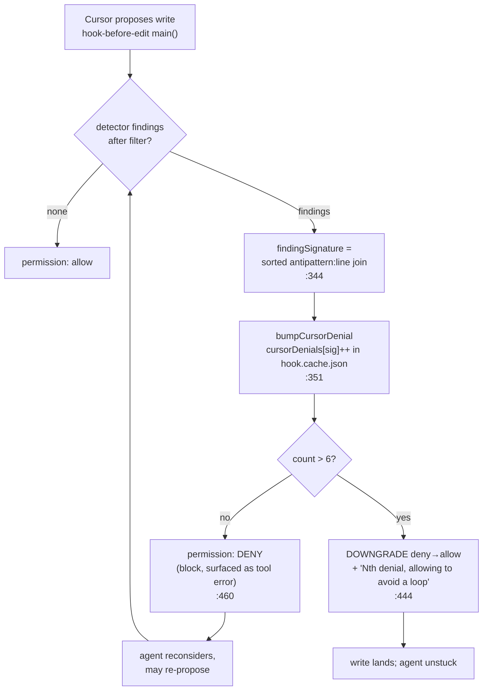

# Hook deep dive 05b — anti-nag machinery and the directive footer

Companion to [`05-hook-system.md`](05-hook-system.md). That report is the
overview; [`05a`](05a-hook-models-and-runtime-core.md) owns the two hook models,
the `runHook` emission-priority **ladder as control flow**, and the output
envelope. This sub-dive goes to the floor on the single hardest UX problem an
automated agent-feedback loop has: **nagging**. A deterministic checker wired
into the agent loop has to stay *present* — keep re-asserting itself as tool
output scrolls the prior reminder out of the model's attention — without
spamming the turn or deadlocking the agent. Impeccable solves that with five
machined parts, and this report is about the **semantics of each** (when and
*why* each state is chosen). 05a owns the order and the plumbing; I own the why.

The inversion frames the whole thing. Impeccable writes code into the user's
repo and treats inspection as free, so its hook is a *reactive presence* that
nudges after every edit and leans on the model's cooperation. YoinkIt emits a
spec and its hard problem is getting a real browser to render motion — so
YoinkIt's analog is a **motion-coverage gate** that re-reminds the agent about
un-captured animations without stalling the capture run. Every mechanism below
is something a YoinkIt coverage gate would need verbatim, or it will spam and
stall.

All `file:line` references are into
[`skill/scripts/hook-lib.mjs`](../../source/skill/scripts/hook-lib.mjs) unless a
different file is named. Re-verified against source at audit time
(2026-06-18); drift from the first draft is flagged inline.

---

## 0. The five parts, at a glance

| Part | What it prevents | Mechanism | Anchor |
|---|---|---|---|
| **A. No-silent-fires** | the checker going invisible after the model forgets | every file-scanning fire emits *something* (fresh / pending / clean) | doc `:1177-1201` |
| **B. Per-session dedup** | re-reporting the same finding as if it were new | composite finding-key cache per `(session, file)` | `readCache:425`, `findingCacheKey:748` |
| **C. Edit-count suppression** | drowning a heavily-edited file in repeated reminders | `bumpEditCount` + a **one-time** notice at threshold+1 | `:551`, `:1367-1380` |
| **D. Three ack states + ACK_EXTS gate** | nagging on plain logic files; staying silent when a re-mind is due | `renderCleanAck` / `renderPendingAck` gated by `ACK_EXTS ⊂ ALLOWED_EXTS` | `:1205-1223`, `ACK_EXTS:51` |
| **E. Cursor loop-breaker** | the blocking gate deadlocking the agent | per-`(session,file,signature)` denial counter that downgrades deny→allow | `hook-before-edit.mjs:351,444` |
| **F. Directive footer** | the model treating findings as soft advice it ignores | imperative + judgment clause + acknowledge-what-you-changed | `:1254-1266` |

Parts A–D and F live on the **post-edit surface** (Claude/Codex): the byte is
already on disk, so the strategy is *"keep nudging without nagging."* Part E
lives on the **pre-write block** (Cursor): the byte hasn't landed, so the
strategy is the opposite — *"block once, then yield."* Same detector, same
config, opposite control posture; the anti-nag machinery is what makes both
liveable.

---

## 1. The no-silent-fires policy (Part A)

The governing doc-comment is the block at `:1177-1201`. It states the design
intent in three sentences worth lifting verbatim: *"The hook is designed to be a
conversational presence: every fire that actually scans a file emits a
developer-role message into the model's next turn."* Three states map to three
templates:

1. **Fresh findings** → `renderTemplate` (`:758`) — imperative, the real
   correction prompt.
2. **Pending findings** → `renderPendingAck` (`:1211`) — a re-nudge for issues
   the model was already told about *this session* but hasn't fixed.
3. **Truly clean** → `renderCleanAck` (`:1205`) — a short positive nudge that
   keeps the design discipline in context.

The load-bearing rationale is at `:1196-1200`, answering "why not stay silent on
dedup-clean?": *"Earlier versions did. The model quickly forgets the prior
reminder once tool output scrolls past it, so re-nudging on the same file with a
short 'still pending' line keeps the pressure on."* This is the entire thesis of
anti-nag-vs-presence: silence is not free, because **the agent's context window
is a scrolling buffer and an un-acted reminder ages out of attention**. A
deterministic checker that goes quiet after one reminder is, functionally,
uninstalled. So the hook re-asserts — but cheaply.

The cost bound is explicit: all three acks are *"short (≤ ~40 tokens each) so
the cumulative cost stays bounded across a long active editing session"*
(`:1191`). That is the discipline that makes "fire every time" affordable. The
fresh template is *not* token-bounded the same way — it carries per-finding
detail and is instead capped by `clampToBudget` to `maxChars` (§5).

**Quiet mode silences #2 and #3 but never #1.** `IMPECCABLE_HOOK_QUIET` (env) or
`hook.quiet` (config) short-circuits emission *before* the pending/clean
branches (`runHook:1446`), but the fresh-findings branch (`:1417`) sits *above*
the quiet check in the ladder, so a genuine finding is never silenced. The
comment names this directly: quiet *"checks that env before emitting #2 or #3"*
(`:1193-1194`). Real problems always surface; only the re-nudges and the
all-clear acks are optional noise.

---

## 2. The per-session dedup cache (Part B)

Dedup is what lets the hook fire on every edit (Part A) without re-reporting the
same finding as fresh every time. It is a per-session cache keyed by a composite
finding identity.

### Cache shape and lifecycle

`readCache(cwd)` (`:425-434`) reads `.impeccable/hook.cache.json` and hard-defaults
to `{ version: 1, sessions: {} }` on any malformed read or version mismatch —
fail-open, like everything in the hook. Each session is
`{ updatedAt, files: { <path>: { editCount, findings: [] } } }`, materialized
lazily by `ensureSession` / `ensureFile` (`:536-549`).

`persistCache(cwd, cache)` (`:436-458`) writes it back with two behaviors that
matter:

- **GC oldest sessions.** When `Object.keys(sessions).length > CACHE_MAX_SESSIONS`
  (`= 8`, `:91`), it sorts sessions by `updatedAt` descending and keeps the
  newest 8 (`:439-448`). Long-lived projects accrue sessions; this keeps the
  file size predictable without any TTL or manual cleanup.
- **Keep the cache gitignored.** Before writing, it calls
  `ensureHookGitExcludes(cwd)` (`:451`), which idempotently maintains the cache
  file (and the local-config + tombstone patterns) inside `.git/info/exclude`
  rather than the tracked `.gitignore`. The *schema* of that mechanism — the
  marker block, the worktree-prefix handling, why `.git/info/exclude` over
  `.gitignore` — belongs to [`05c`](05c-config-and-ignore-model.md); here it only
  matters that **persisting the cache and hiding it from git are the same
  call**, so the dedup state can never accidentally get committed.

### The composite finding key

`findingCacheKey(finding)` (`:748-756`) is the identity that makes "same finding
≠ fresh" work across edits:

```js
const line  = finding?.line || 0;
const value = extractFindingIgnoreValue(finding);     // font name, color, easing...
if (line > 0 && value) return `${finding.antipattern}:${line}:${value}`;  // antipattern:line:value
if (line > 0)          return `${finding.antipattern}:${line}`;
if (value)             return `${finding.antipattern}:0:${value}`;
const snippet = String(finding?.snippet || '').trim().slice(0, 80);
return snippet ? `${finding.antipattern}:0:${snippet}` : `${finding.antipattern}:0`;
```

The preferred key is `antipattern:line:value`, with graceful degradation: drop
`value` if the finding has none, drop `line` if it's a page-level finding, and
fall back to an 80-char `snippet` prefix when neither line nor value is
available. (`extractFindingIgnoreValue` only returns a value for the five
value-bearing rules — `overused-font`, `bounce-easing`,
`design-system-font/color/radius` — see `:655-667`; for everything else the key
is `antipattern:line`.) The key is *not* the raw finding object; it's a stable
string, so it survives JSON round-trips and small re-orderings.

### How dedup + remember interact

```js
dedupeAgainstCache(findings, cache, sessionId, filePath)   // :726-738
```

builds a `Set` of the file's `known` keys, then returns only findings whose key
isn't already in it. `rememberFindings(...)` (`:740-746`) folds the *fresh* keys
back into `fileEntry.findings` and bumps `updatedAt`. The runtime ordering in
`runHook` (`:1391-1398`) is: filter → dedupe → **if fresh, remember + collect
into `freshGroups`**.

The subtlety that makes Part A and Part B cooperate: dedup removes a finding from
the *fresh* set, but the finding is still *present* in `fileEntry.findings`. So
on the next edit, `filterFindings` still surfaces it, `dedupeAgainstCache`
returns it as non-fresh (empty `fresh`), and `runHook` routes to the **pending**
branch (`:1407`) — which reads the same `fileEntry.findings` to build the
re-nudge. That is the precise mechanism by which *"the same finding isn't
re-reported as fresh, but is still re-nudged."* Dedup doesn't forget; it
demotes.

---

## 3. Edit-count suppression (Part C)

Dedup stops re-reporting *the same* finding. Edit-count suppression stops the
hook from firing *at all* on a file the agent is hammering — the case where the
agent is mid-refactor on one component and every keystroke-batch triggers another
scan.

`bumpEditCount(cache, sessionId, filePath)` (`:551-556`) increments
`fileEntry.editCount` and returns the new count. The threshold is
`EDIT_COUNT_THRESHOLD = 6` (`:92`). Three details give it its character:

**Only primary files are counted.** In `runHook`, `primaryFileSet` is the set of
*directly-edited* files (`:1307`), distinct from the co-scanned sibling
stylesheets that `expandScanTargets` adds. The bump is gated on
`primaryFileSet.has(filePath)` (`:1367`). So editing `Button.tsx` six times
suppresses `Button.tsx`, but the `Button.css` that gets co-scanned alongside it
never accrues an edit count of its own — it isn't the thing being hammered. (The
co-scan expansion itself is 05a's territory.)

**The notice fires exactly once.** This is the anti-nag move inside the anti-nag
mechanism. At `:1371-1375`:

```js
if (editCount > EDIT_COUNT_THRESHOLD) {
  const wasJustCrossed = editCount === EDIT_COUNT_THRESHOLD + 1;   // exactly 7
  if (wasJustCrossed && !suppressionWinner) {
    suppressionWinner = { filePath };       // emit the notice — once
  }
  lastSkip = 'suppressed';
  suppressedHit = true;                      // true forever after, but silent
  continue;
}
```

`suppressionWinner` is set **only** at the exact moment the count crosses from 6
to 7. On edit 8, 9, 10…, `editCount > 6` is still true so the file is skipped and
`suppressedHit` stays true, but `wasJustCrossed` is false, so nothing new emits.
The agent gets one `suppressionNotice` (`:558-560`) — *"Suppressing further
design hints on `<file>`. More than 6 edits in this session reached. Run
/impeccable audit to revisit."* — and then silence. Suppression itself is
suppressed after its first announcement. That's the whole trick: you tell the
model once that you're backing off, then you actually back off.

`suppressedHit` (the silent-after-notice flag) only matters at the very bottom
of the ladder (`:1505`): if a file was suppressed but produced no fresh / pending
/ clean winner from any *other* target, `runHook` returns a silent
`{ suppressed: true, emitted: false }`. It's the "we did suppress, but there's
nothing left to say" terminal state.

---

## 4. The three ack states and the ACK_EXTS gate (Part D)

### Why two extension sets exist

```js
ALLOWED_EXTS = { .tsx .jsx .html .htm .vue .svelte .astro .css .scss .sass .less .ts .js }  // :46-49
ACK_EXTS     = { .tsx .jsx .html .htm .vue .svelte .astro .css .scss .sass .less }          // :51-54
```

`ACK_EXTS` is `ALLOWED_EXTS` **minus `.ts` and `.js`**. This single difference
encodes a deliberate posture: plain `.ts`/`.js` files are *scanned* (they're in
`ALLOWED_EXTS`, so the detector runs and **fresh findings always emit**), but
they stay **silent on clean-or-pending** because `shouldEmitAckForFile` (`:1221-1223`)
gates the clean and pending acks on `ACK_EXTS`:

```js
export function shouldEmitAckForFile(filePath) {
  return ACK_EXTS.has(path.extname(String(filePath || '')).toLowerCase());
}
```

The reasoning: a UI-ish file (`.tsx`, `.css`, `.svelte`…) is where a positive
"scanned, no anti-patterns" ack or a "still pending" re-nudge is *useful design
presence*. A plain `.ts` utility or a `.js` config is mostly logic; emitting
"design hook scanned `utils.ts`, no anti-patterns" on every edit would be pure
noise. So those files are silent unless the detector actually finds something —
findings escalate regardless of `ACK_EXTS`, only the *chatter* is gated. The
upstream `hooks.md:5` states it plainly: *"Plain `.ts` and `.js` files are still
scanned, but stay quiet unless the detector finds something."*

### The two ack renderers

`renderCleanAck(filePath, opts)` (`:1205-1209`) is the all-clear, built on the
shared `STEER_LINE` (`:1203`):

> `[impeccable@1] Design hook scanned <file>. No anti-patterns. Keep typography
> hierarchy, spacing rhythm, and color contrast intentional on the next change.`

It does double duty — it confirms the file is clean *and* keeps the design
vocabulary ("hierarchy, rhythm, contrast") in the model's context so the next
edit starts design-aware. That's presence without a finding.

`renderPendingAck(filePath, knownFindings, opts)` (`:1211-1219`) is the re-nudge,
and it's the cleverest of the three:

> `[impeccable@1] Design hook scanned <file>. Still has N finding(s) flagged
> earlier this session (side-tab:3, gradient-text:12, +2 more). Handle them
> before finalizing — the previous reminder still applies.`

`knownFindings` here are the **cache-key strings** (e.g. `side-tab:3`) pulled
from `fileEntry.findings` at `runHook:1408`. It samples the first three
(`:1216`), appends `+N more` if there are more (`:1217`), and — per the doc
intent at `:1199-1200` — deliberately points back to *"earlier this session"* so
the model reads it as a *re-mind, not a new finding*. The raw cache keys are a
slightly leaky abstraction (the model sees `side-tab:3` rather than prose), but
they're stable, cheap, and unambiguous about which findings are meant.

### Where each is chosen in the ladder

The full emission-priority ladder is 05a's; here is only the *order* and the
*why*, mapped to anchors:

| Priority | Branch | Anchor | Why it's here |
|---|---|---|---|
| 1 | fresh findings (grouped render) | `:1417` | a real, never-before-seen problem outranks everything |
| 2 | detector threw (silent) | `:1442` | a crash must not nag; fail-open |
| 3 | quiet mode (silent) | `:1446` | user opted out of acks (but #1 already passed) |
| 4 | **pending re-nudge** (UI files only) | `:1450` | unfixed known findings still apply — re-mind |
| 5 | suppression notice (once) | `:1468` | "I'm backing off this file" |
| 6 | **clean ack** (UI files only) | `:1484` | positive presence, keep discipline in context |
| 7 | non-ui-ack skip (silent) | `:1501` | a `.ts`/`.js` had a pending/clean winner but isn't in `ACK_EXTS` |
| 8 | suppressed-but-nothing-else (silent) | `:1505` | terminal "did suppress, nothing to say" |

The two ACK-gated branches (#4 pending, #6 clean) each call
`shouldEmitAckForFile` *before* rendering. If a `.ts` file is the only pending or
clean winner, both gates fail and the ladder falls through to #7 — the explicit
`non-ui-ack` silent return (`:1501`). That branch exists precisely so a logic
file with a stale-but-known finding doesn't get a re-nudge it doesn't warrant,
while still recording that the hook ran.

Pending **outranks** clean (#4 above #6) because if a file has *any* unfixed
known finding, re-nudging is more valuable than congratulating it; and pending
**outranks** suppression (#4 above #5) because a re-mind about a real issue beats
a "backing off" notice. The ordering is a priority on *usefulness of the
message*, and that priority is the anti-nag policy made executable.

---

## 5. The render path and the directive footer (Part F)

### The two renderers and their budgets

`renderTemplate(findings, filePath, config, opts)` (`:758-787`) builds the
single-file fresh-findings message: a header carrying `ENVELOPE_PREFIX`
(`[impeccable@1]`, `:44`) and the file + issue count, then up to
`limits.maxFindings` (default 5) `formatFindingLine` rows, an
`... and N more (see /impeccable audit).` line when truncated, a blank line, and
the directive footer. If the assembled text exceeds `limits.maxChars` (default
8000), `clampToBudget` (`:852-873`) pops finding lines one at a time — preserving
header and footer — until it fits, with a hard `…` truncation as the final
backstop. **The footer is never dropped**: clamping sacrifices findings, not the
behavioral instruction.

`renderGroupedTemplate(groups, config, opts)` (`:789-827`) handles the
multi-file case (several files each with fresh findings, from co-scan expansion).
Two design points:

- It degenerates to `renderTemplate` for a single real group (`:792-795`), so
  there's one code path for the common case.
- The `maxFindings` cap is a **shared budget across files**, tracked by
  `shownCount` (`:804`). Each group gets `cap - shownCount` remaining slots
  (`:809`), and overflow within a group prints `- ... N more in <file>`
  (`:816-818`). So five total findings spread over three files won't print
  fifteen lines — the budget is global, not per-file. `clampGroupedToBudget`
  (`:829-850`) is the grouped analog of the char-budget backstop.

`formatFindingLine(f)` (`:875-887`) emits one finding row: an `L<line>` prefix,
the `[antipattern]` tag, the rule name and description, and — when the rule has
an ignorable value — an inline *"If the user explicitly confirms this value is
intentional: `<command>`"* segment from `formatFindingIgnoreCommand`. That is the
*surface* of the per-finding escape hatch; the **policy** for it (when the model
may run it, why the hook itself never writes ignore config) is
[`05d`](05d-admin-cli-and-contract.md)'s, not mine.

`appendDesignSystemNote(text, scanOptions)` (`:1236-1239`) tacks a second
`[impeccable@1]` line onto *any* emitted message when
`scanOptions.designSystem.mdNewerThanJson` is set — *"DESIGN.md is newer than
.impeccable/design.json. Run /impeccable document to refresh the design-system
sidecar."* It rides along on fresh, pending, and clean emissions alike (called at
`:1419`, `:1451`, `:1485`), so a stale design sidecar gets nudged opportunistically
without its own fire. Classic free-ride, same instinct as the boot script's
update check.

### The footer as a tuned prompt

`directiveFooter(display, opts)` (`:1254-1266`) is the part of the output that
actually steers behavior, and its design doc-comment (`:1241-1253`) names three
intentional moves. This is the single most copyable artifact in the subsystem
for YoinkIt, so it's worth reading each move against its rationale:

1. **Imperative, not advisory** (`:1243-1245`, body `:1260`). The opening line is
   *"Handle these before finalizing: fix findings that are real design problems,
   or explicitly classify contextually intentional findings as false positives."*
   The comment explains why: *"'Handle these...' beats 'Consider revising...'
   which the model treats as a soft suggestion it can override when the user
   asked for any kind of throwaway / demo UI."* A nag the model can dismiss as
   optional is a nag that does nothing.

2. **Explicit judgment clause** (`:1246-1249`, body `:1262`). *"A finding is not
   automatically a defect; literal or domain-appropriate motion, intentional
   demos or fixtures, documentation of bad design, and user-confirmed choices can
   be valid as-is."* The comment: *"Without it, the model will try to 'fix'
   intentional motion, bad fixtures, anti-pattern examples in docs, or test
   cases."* This is the counterweight to move #1 — having made the instruction
   imperative, you must explicitly carve out the cases where compliance would be
   *wrong*, or you trade silent-misses for over-eager false fixes. Naming the
   judgment inline beats hoping the model infers it.

3. **Acknowledgement instruction** (`:1250-1253`, body `:1260`). *"Acknowledge
   what you changed or why you are leaving a finding unchanged."* The comment
   gives the mechanical reason: *"Hook output is injected as developer-role
   context, not a chat turn, so the user never sees the raw envelope. Asking the
   model to surface the resolution in its reply is the cheapest way to make the
   feedback loop visible."* Without this, the entire loop is invisible to the
   human — the finding goes in as hidden context, the model silently complies or
   doesn't, and the user never learns it happened. The acknowledgement is what
   turns a hidden nudge into a visible decision.

The footer's third paragraph (`:1264`) folds in the ignore-command guidance
(narrowest-exception policy, the `overused-font` special-case, "do not add
`impeccable: ignore` source comments"). That guidance is 05d's domain; what
matters *here* is that it sits inside the same imperative-plus-judgment frame, so
the escape hatch is taught in the same breath as the instruction not to abuse it.

---

## 6. The Cursor blocking-path loop-breaker (Part E)

Everything above is the post-edit surface. The pre-write block
([`hook-before-edit.mjs`](../../source/skill/scripts/hook-before-edit.mjs)) has
the opposite anti-nag problem: it can `deny` a write, and an agent that keeps
re-proposing the same blocked write would deadlock forever. The loop-breaker is
the fix.

`findingSignature(findings)` (`:344-349`) is a *coarser* identity than the
post-edit `findingCacheKey`: it's the sorted join of `antipattern:line` over all
findings, with no value component:

```js
findings.map((f) => `${f.antipattern || 'unknown'}:${f.line || 0}`).sort().join('|');
```

It identifies the *whole proposed write's finding set*, not an individual
finding, because the question Cursor is answering is "have I denied *this exact
bad write* before?"

`bumpCursorDenial(cache, sessionId, filePath, findings)` (`:351-363`) stores the
counter in the **same `hook.cache.json`** the post-edit path uses, under a
per-file `cursorDenials` map keyed by that signature (`:358-362`):

```js
fileEntry.cursorDenials[key] = (fileEntry.cursorDenials[key] || 0) + 1;
return { key, count: fileEntry.cursorDenials[key] };
```

Then `main()` decides (`:444-460`):

```js
if (denial.count > EDIT_COUNT_THRESHOLD) {          // > 6
  // downgrade deny → allow, with a warning appended to the block message
  return allow({ ...audit, downgraded: true, ... }, { user_message: warning, agent_message: warning });
}
return deny(message, { ...audit, ... });            // the normal block
```

The warning (`:445`) is explicit: *"This is the Nth repeated denial for the same
file and finding signature, so Impeccable is allowing this write to avoid a loop.
Reconsider the issue immediately after the tool runs."* So the gate blocks the
first six identical proposals, then on the seventh it **yields** — lets the write
land but tells the agent why it's being let through and that it should still
reconsider. The bad content lands, but the agent is unstuck, and the audit
records `downgraded: true`. Note it reuses `EDIT_COUNT_THRESHOLD` (6) — one
constant governs both "stop nudging" (post-edit) and "stop blocking"
(pre-write), which keeps the two postures symmetric.

### The contrast that defines the whole subsystem

| | Post-edit surface (Claude/Codex) | Pre-write block (Cursor) |
|---|---|---|
| Posture | keep nudging without nagging | block once, then yield |
| Identity unit | per-finding `antipattern:line:value` (`:748`) | per-write-set `antipattern:line` signature (`:344`) |
| Counter | `editCount` per file (`:551`) | `cursorDenials[signature]` per file (`:358`) |
| Threshold-7 behavior | one suppression notice, then silent (`:1372`) | downgrade deny→allow with warning (`:444`) |
| Failure mode it prevents | reminder noise / aging out of attention | agent deadlock on a repeated blocked write |

The shared idea: a deterministic gate in an agent loop **must have a yield
condition**, or it becomes either noise (post-edit) or a deadlock (pre-write).
Both paths cap repetition at 6 and then change behavior. That's the single
transferable principle — *count your own interventions and back off* — expressed
twice for two opposite control postures.

---

## 7. The nag-control ladder, as a state machine

This is the post-edit surface (`runHook`) resolving one fire to exactly one
outcome, plus the parallel Cursor denial-counter downgrade. Keyed on dedup
result, edit-count, `ACK_EXTS`, and quiet mode.

```mermaid
stateDiagram-v2
    [*] --> PerFile: runHook scans each target

    state "per-file classify" as PerFile
    PerFile --> Skip: sensitive / generated / ext∉ALLOWED / ignored / missing
    Skip --> PerFile: next file

    PerFile --> EditCount: primary file?
    EditCount --> Suppressed: editCount > 6
    state Suppressed {
        [*] --> Once: editCount == 7 (just crossed)
        Once --> NoticeArmed: set suppressionWinner
        [*] --> SilentSuppress: editCount > 7
    }
    Suppressed --> PerFile: continue (skip scan)

    EditCount --> Detect: editCount <= 6 (or co-scanned file)
    Detect --> Threw: detector throw
    Detect --> Dedupe: findings[]
    Dedupe --> Fresh: key NOT in cache
    Dedupe --> KnownPending: filtered>0, all keys cached
    Dedupe --> Clean: filtered == 0

    Fresh --> Remember: rememberFindings + freshGroups.push
    Remember --> PerFile: continue

    note right of PerFile
      after all files: resolve ONE
      emission by priority ↓
    end note

    PerFile --> L1_Fresh: freshGroups non-empty
    L1_Fresh --> [*]: renderGroupedTemplate (imperative + footer)

    PerFile --> L2_Threw: detectorThrewAny only
    L2_Threw --> [*]: SILENT (fail-open)

    PerFile --> L3_Quiet: QUIET env/config
    L3_Quiet --> [*]: SILENT (acks off; fresh already handled above)

    PerFile --> L4_Pending: pendingWinner && ext∈ACK_EXTS
    L4_Pending --> [*]: renderPendingAck (re-nudge "earlier this session")

    PerFile --> L5_Notice: suppressionWinner armed
    L5_Notice --> [*]: suppressionNotice (ONCE)

    PerFile --> L6_Clean: cleanWinner && ext∈ACK_EXTS
    L6_Clean --> [*]: renderCleanAck (positive presence + STEER_LINE)

    PerFile --> L7_NonUiAck: pending/clean winner but ext∉ACK_EXTS (.ts/.js)
    L7_NonUiAck --> [*]: SILENT

    PerFile --> L8_SuppSilent: suppressedHit, nothing else
    L8_SuppSilent --> [*]: SILENT
```





The first machine shows the post-edit "keep nudging, but resolve to exactly one
message per fire" logic; the second shows the pre-write "block N times then
yield" logic. They share the constant 6 and the principle of self-limiting
intervention, nothing else.

---

## 8. Drift finding: `hook.pending.json` is write-dead

The first draft (`06-hook-system.md` §4e, `:508`) lists
`.impeccable/hook.pending.json` alongside `hook.cache.json` as if both are
**active** state files the hook maintains. **That is inaccurate, and this report
corrects it.** Verified by grepping the entire `skill/`, `cli/`, and `scripts/`
trees: `hook.pending.json` has **no writer anywhere in the current code**. Every
reference is one of:

- `getPendingPath(cwd)` (`:126-128`) — the path *definition*, exported.
- `HOOK_LOCAL_IGNORE_PATTERNS` (`:83-87`) and `LIVE_IGNORE_PATTERNS`
  (`live-inject.mjs:35`) — the pattern lists that keep it gitignored *if it ever
  existed*.
- `hook-admin.mjs reset` (`:595`) — the only place it's touched at runtime, and it
  only ever **deletes** it: `for (const filePath of [getCachePath(cwd),
  getPendingPath(cwd)]) { ... fs.unlinkSync(filePath) }`.
- `scripts/smoke-provider-hooks.mjs` — reads it only as test evidence (it will be
  empty/absent).

The Cursor pre-write denial state — the only thing one might assume lives in a
"pending" file — actually lives in `hook.cache.json` under `cursorDenials`
(`hook-before-edit.mjs:358-362`, §6 above). **`hook.pending.json` is a tombstone
of an earlier Cursor-pending-queue design.** The path constant, the
ignore-pattern entries, and the reset-deletion all survive as cleanup-only
references; nothing creates the file. A reader should treat it as dead: the
`hooks.md:28` reset doc still says reset *"deletes the … Cursor pending queue,"*
which is now only true in the sense of "deletes a file that is never written."

**Sibling note (for the overview and 05d):** do not describe `hook.pending.json`
as part of the live cache/state model. The active per-session state is *one* file
— `hook.cache.json` — carrying three independent maps per file: `editCount`
(Part C), `findings` (Part B dedup keys), and `cursorDenials` (Part E). 05c, when
documenting `ensureHookGitExcludes` and the local-ignore patterns, should note
that `hook.pending.json` is in the pattern list for historical reasons and is
never created.

---

## 9. What this means for YoinkIt

YoinkIt's analog is a **motion-coverage gate**: a deterministic check that, after
an edit (or a capture run), reminds the agent which animations on a surface are
*not yet captured* — "you have a hover transition on `.work-card` with no
captured spec." The hard UX problem is identical: keep that reminder present in
the agent loop without spamming or deadlocking. All three anti-nag mechanisms
transfer, and a coverage gate needs **all three or it will spam/stall**.

- **STEAL the dedup-by-finding-key (Part B).** YoinkIt's finding key is the
  natural composite `uncaptured-motion:<selector>:<trigger>` (e.g.
  `uncaptured:.work-card:hover`). Cache it per session so a re-edit doesn't
  re-announce the same un-captured animation as new — but keep it in
  `fileEntry.findings` so the gate can *re-nudge* ("still un-captured from
  earlier this session") instead of going silent. The demote-don't-forget
  behavior (§2) is the exact thing that makes a coverage reminder durable.
  *Ref: `findingCacheKey:748`, `dedupeAgainstCache:726`, the pending re-route at
  `runHook:1407`.*

- **STEAL edit-count suppression with a one-time notice (Part C).** A capture
  sweep that re-arms a surface repeatedly must not re-fire the coverage reminder
  on every pass. Suppress after N attempts on the same surface, and announce the
  back-off **exactly once** (the threshold+1 winner trick, `:1372-1375`).
  Critically, count only the *directly-targeted* surface, not every co-scanned
  sibling — YoinkIt's analog of `primaryFileSet` is "the surface the user is
  actually capturing," not every element `scan()` touched.

- **STEAL the per-signature loop-breaker (Part E).** If YoinkIt ever adds a
  *blocking* gate — e.g. refusing to mark a capture "done" while a known
  animation is un-captured — it needs Cursor's downgrade-after-N. An agent that
  keeps re-submitting "done" against the same un-captured signature must be let
  through eventually (with a warning) or the run deadlocks. Count the
  signature, yield at the threshold, log `downgraded`.

- **STEAL the no-silent-fires + ACK-gate posture (Parts A, D).** Re-nudge about
  un-captured motion rather than going quiet (the model forgets once tool output
  scrolls), but bound it to ≤~40 tokens, and gate the *positive* "all motion
  captured" ack to surfaces where it's useful — silent on files with no animation
  surface at all (YoinkIt's analog of `.ts`/`.js` ∉ `ACK_EXTS`). Findings escalate
  regardless; only chatter is gated. *Ref: doc `:1177-1201`, `shouldEmitAckForFile:1221`.*

- **STEAL the directive-footer design (Part F)** essentially verbatim, retargeted:
  - *Imperative, not advisory:* "Capture these animations before finalizing the
    spec," not "consider capturing."
  - *Judgment clause:* the analog of "not every finding is a defect" is **"not
    every moving element needs a spec"** — decorative loops the user doesn't care
    about, third-party widget motion, intentional CSS-only hovers the recreation
    already handles, demo/fixture animations. Name these inline or the agent will
    over-capture noise.
  - *Acknowledge-what-you-changed:* "State which animations you captured and which
    you're intentionally skipping, and why" — because the coverage reminder, like
    Impeccable's, goes in as hidden context the user never sees. This is what makes
    YoinkIt's coverage loop *visible* to the human.

  *Ref: `directiveFooter:1254-1266` and its doc-comment `:1241-1253`.*

- **ADAPT the single-cache, multi-map shape.** Impeccable keeps editCount,
  dedup-findings, and denial-counters in one `hook.cache.json` per session,
  GC'd to 8 sessions. A YoinkIt `.yoinkit/coverage.cache.json` can hold the same
  three maps per surface, GC'd the same way, gitignored via `.git/info/exclude`
  (cross-ref [`05c`](05c-config-and-ignore-model.md)). But **do not** replicate the
  `hook.pending.json` tombstone (§8): one state file, three maps, no dead siblings.

- **AVOID treating the coverage check as free.** This is the inversion biting
  again. Impeccable can fire on *every* edit because reading computed styles is
  trivial for it. A YoinkIt coverage check that requires a real browser render to
  know what moved is **not** cheap — so the "fire every time" half of the
  no-silent-fires policy must be tempered. Cache the last known coverage state and
  re-nudge from *cache* on subsequent edits (cheap, Part B), and only re-run the
  expensive real-browser coverage probe when the surface actually changed or the
  user re-captures. Steal the *presence* discipline; do not steal the assumption
  that re-checking is free.

The deeper sub-slices this report defers to: the emission ladder as control flow
and the payload envelope ([`05a`](05a-hook-models-and-runtime-core.md)); the
config schema, `ensureHookGitExcludes`, and quiet/limits ([`05c`](05c-config-and-ignore-model.md));
and the ignore-command policy plus the admin CLI ([`05d`](05d-admin-cli-and-contract.md)).
