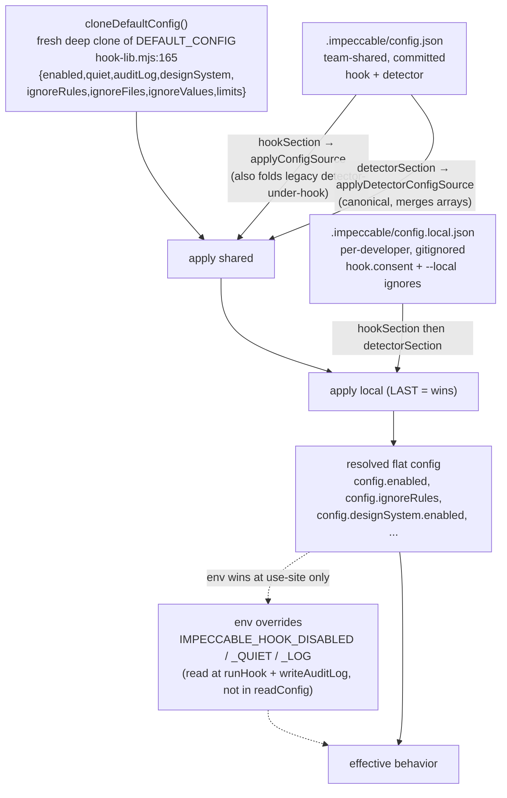
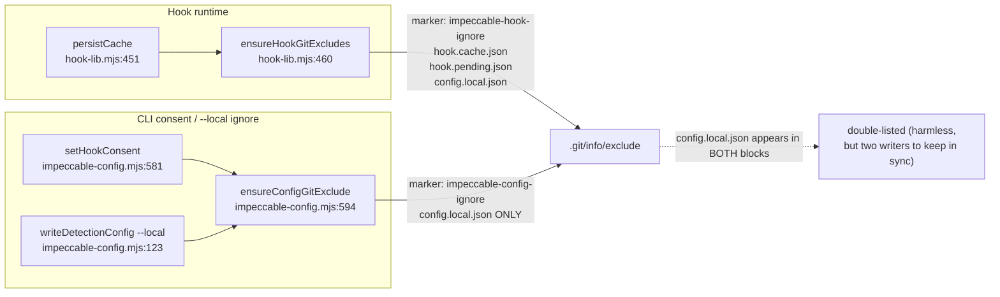

# Hook deep dive 05c — the two-tier config model, the three ignore axes, consent storage, and the two git-exclude writers

Companion to [`05-hook-system.md`](05-hook-system.md). That report is the
overview. This one goes to the floor on the part of the subsystem YoinkIt is
most likely to copy wholesale when it grows project config (default driver,
viewport sets, ignore lists): **how Impeccable splits one config schema across a
team-shared committed file and a per-developer gitignored file, how a suppression
travels across three independent axes, where the "ask once, remember
per-developer" consent lives, and the two duplication hazards baked into the
design.**

Sibling slices, so this one stays in its lane:
- the two hook *models* + the runtime core + the per-file scan loop + the
  fail-open contract → [`05a-hook-models-and-runtime-core.md`](05a-hook-models-and-runtime-core.md)
- the dedup cache, edit-count suppression, Cursor loop-breaker, ack states, the
  directive footer → [`05b-anti-nag-and-the-directive.md`](05b-anti-nag-and-the-directive.md)
- the `/impeccable hooks` CLI that *writes* this config + the overused-font guard
  + the intentional-findings policy → [`05d-admin-cli-and-contract.md`](05d-admin-cli-and-contract.md)
- build-time manifest generation + install + the consent DECISION flow →
  [`05e-manifest-generation-and-install.md`](05e-manifest-generation-and-install.md)

All `file:line` references are into `../../source/skill/scripts/hook-lib.mjs`
unless the path says otherwise. Line numbers were re-verified against the source
on read; drift from the first-draft `06-hook-system.md` §4 is called out inline.

---

## 1. Two files, one unified schema

Impeccable stores all project config in **one `.impeccable/` directory**, split
across exactly two files that share a single schema:

| File | Committed? | Holds | Why |
|---|---|---|---|
| `.impeccable/config.json` | **yes**, team-shared | `hook` (runtime/lifecycle) + `detector` (ignore filters) | the team agrees on whether the hook runs and what's intentionally suppressed |
| `.impeccable/config.local.json` | **no**, gitignored via `.git/info/exclude` | `hook.consent` + any `--local` ignores | each developer's *install* decision and private exceptions stay on their machine |

The path helpers are trivial and live in both readers (this is the first instance
of the duplication §5 documents): `getConfigPath`/`getLocalConfigPath`
([`hook-lib.mjs:114-120`](../../source/skill/scripts/hook-lib.mjs)) and the
byte-identical pair in
[`cli/lib/impeccable-config.mjs:21-27`](../../source/cli/lib/impeccable-config.mjs).

### The merge order (local wins) and the back-compat fold

`readConfig(cwd)` ([`hook-lib.mjs:137-148`](../../source/skill/scripts/hook-lib.mjs))
is small but does three things at once:

```js
export function readConfig(cwd) {
  const config = cloneDefaultConfig();
  for (const filePath of [getConfigPath(cwd), getLocalConfigPath(cwd)]) {  // shared FIRST, local LAST
    const raw = safeReadJson(filePath);
    applyConfigSource(config, hookSection(raw));         // the `hook` subtree (+ back-compat detector-under-hook)
    applyDetectorConfigSource(config, detectorSection(raw)); // the canonical `detector` subtree, wins
  }
  return config;
}
```

1. **Start from a deep clone of the defaults** (`cloneDefaultConfig` :165-174, not
   the frozen `DEFAULT_CONFIG` itself — the arrays/objects are fresh so a reader
   can't mutate the shared default).
2. **Read both files in array order, local last** — so anything in
   `config.local.json` overrides `config.json`. Each file is read with
   `safeReadJson` (:106-112), which returns `null` on parse failure, so a
   malformed file is *ignored*, not fatal (the fail-open posture 05a covers, here
   applied to config).
3. **Fold in the back-compat path.** Older configs stored detector filters under
   the `hook` key. So for each file `applyConfigSource` runs first on
   `hookSection` (:151-154) — and `applyConfigSource` itself *also* calls
   `applyDetectorConfigSource` internally (:207) to pick up any detector filters
   that legacy configs left under `hook`. Then `applyDetectorConfigSource` runs on
   the canonical `detectorSection` (:156-159), and because detector arrays are
   **merged** (not replaced — see `uniqueStrings`/`mergeIgnoreValues` :185-191),
   canonical `detector` settings win by being applied last. The comment at
   :139-141 states this verbatim.

`safeReadJson` is the fail-open seam: a half-written `config.json` reads as
`null`, both `hookSection`/`detectorSection` short-circuit to `null` on a
non-object (:152, :157), and the reader silently falls back to defaults.

### `DEFAULT_CONFIG` — verify the full shape

The first draft's §4b described `DEFAULT_CONFIG` as `{ enabled, quiet, auditLog,
limits }` and **omitted `designSystem` and the three ignore arrays.** That is
wrong. The real shape ([`hook-lib.mjs:72-81`](../../source/skill/scripts/hook-lib.mjs)):

```js
export const DEFAULT_CONFIG = Object.freeze({
  enabled: true,
  quiet: false,
  auditLog: null,
  designSystem: { enabled: true },   // ← omitted by the draft
  ignoreRules: [],                   // ← omitted by the draft
  ignoreFiles: [],                   // ← omitted by the draft
  ignoreValues: [],                  // ← omitted by the draft
  limits: { maxFindings: 5, maxChars: 8000 },
});
```

The resolved config object is **flat** — `readConfig` flattens the `hook` and
`detector` subtrees into one object. So `config.enabled`, `config.ignoreRules`,
and `config.designSystem.enabled` all live at the top level of the *returned*
value even though they come from different subtrees of the *file*. `designSystem`
matters because it gates a whole rule family (the design-system-font/color/radius
detectors) and is the one detector toggle expressed as a boolean rather than a
list; `applyDetectorConfigSource` reads it as "enabled unless explicitly `false`"
(:181). `cloneDefaultConfig` (:165-174) re-creates the mutable members
(`ignoreRules`, `ignoreFiles`, `ignoreValues`, `designSystem`, `limits`) on every
read so the frozen default is never aliased.

### The real live config (worked example)

This is the actual `.impeccable/config.json` from Impeccable's own repo
([`../../source/.impeccable/config.json`](../../source/.impeccable/config.json),
84 lines). It is the canonical demonstration of all three ignore axes plus the
`hook` subtree, so read it as the schema-by-example:

```json
{
  "detector": {
    "ignoreRules": [],
    "ignoreFiles": [
      "tests/fixtures/**",
      "tests/detect-antipatterns.test.js",
      "site/pages/slop/**",
      "site/data/anti-patterns-catalog.js",
      "site/pages/shader-lab/**",
      "site/scripts/demos/commands/**",
      "site/styles/skill-demos.css",
      "site/styles/slop-kinpaku.css"
    ],
    "ignoreValues": [
      {
        "rule": "bounce-easing",
        "value": "bounce-ball",
        "createdAt": "2026-06-15T04:15:03.164Z",
        "reason": "User confirmed ball bounce animation is intentional"
      },
      {
        "rule": "design-system-color",
        "value": "*",
        "files": ["site/styles/home-rebuild.css"],
        "createdAt": "2026-06-15T23:37:38.170Z",
        "reason": "AURELIA hotel picker is intentionally a foreign boutique-hotel palette inside the live picker demo"
      },
      { "rule": "design-system-color", "value": "*", "files": ["site/styles/main.css"], "createdAt": "2026-06-15T23:37:38.170Z", "reason": "Generic AI slop card intentionally uses off-system colors for the before-state comparison" },
      { "rule": "design-system-color", "value": "*", "files": ["site/styles/home-kinpaku.css"], "createdAt": "2026-06-15T23:37:38.170Z", "reason": "Homepage before-state slop demo intentionally uses off-system purple/magenta colors" },
      { "rule": "design-system-color", "value": "*", "files": ["site/styles/design-system.css"], "createdAt": "2026-06-15T23:37:38.170Z", "reason": "Design-system comparison intentionally shows an off-system before-state" },
      { "rule": "design-system-color", "value": "*", "files": ["site/styles/workflow.css"], "createdAt": "2026-06-15T23:37:38.170Z", "reason": "Generic slop card intentionally uses off-system purple colors for the before-state comparison" },
      { "rule": "design-system-font",  "value": "*", "files": ["site/styles/workflow.css"], "createdAt": "2026-06-15T23:37:38.170Z", "reason": "Generic slop card intentionally uses Inter for the before-state comparison" }
    ]
  },
  "hook": {
    "enabled": true,
    "limits": { "maxFindings": 5, "maxChars": 8000 }
  }
}
```

Three things to read off it: (1) every `ignoreValue` carries a `reason` and a
`createdAt` — the suppression is an audited decision, not a silent toggle; (2)
five of seven entries use `value: "*"` scoped by `files` (a "this whole file is an
intentional slop demo" suppression); (3) the `hook` subtree here only sets
`enabled` and `limits` — everything else (`quiet`, `auditLog`, `consent`) is
absent and falls back to defaults / lives in `config.local.json`. Note this repo's
own checkout has **no `config.local.json`** (the team config carries `consent`
nowhere; consent is the per-developer file's job, §4).

### Config resolution diagram



The dashed env layer is deliberate: env overrides are **not** merged into the
config object by `readConfig`. They are read at the point of use (`runHook`,
`writeAuditLog`) so they always win over whatever the file said. §2 enumerates
them.

---

## 2. The `hook` (runtime/lifecycle) subtree

The `hook` key carries everything about *whether and how the hook runs*. Each key
and exactly what it gates:

| Key | Default | Gates | Notes |
|---|---|---|---|
| `hook.enabled` | `true` | **automatic hook execution only** | `runHook` bails with `skipped: 'config-disabled'` when `enabled === false` ([`hook-lib.mjs:1316-1319`](../../source/skill/scripts/hook-lib.mjs)). Stops **both** the Claude/Codex post-edit reminders **and** Cursor's pre-write blocking. **Manual `npx impeccable detect` still runs** when disabled ([`hooks.md:9`](../../source/skill/reference/hooks.md)) — `enabled` is purely the hook lifecycle switch. |
| `hook.quiet` | `false` | the clean/pending **acks** | Silences "looks clean" and "still pending" acks; **findings still surface**. Set by `applyConfigSource` only when `quiet === true` (:201-203). |
| `hook.auditLog` | `null` | NDJSON audit-log path | `writeAuditLog` ([`hook-lib.mjs:1123-1150`](../../source/skill/scripts/hook-lib.mjs)) appends one JSON line per invocation. Path may be `~/`-relative, absolute, or project-relative (resolved against the event's project cwd, :1136-1142). Env `IMPECCABLE_HOOK_LOG` **overrides** it (:1129). |
| `hook.consent` | absent | the install decision | `'accepted'` / `'declined'`, written to **`config.local.json`** by the CLI, never to the shared file. Read/written by `getHookConsent`/`setHookConsent` (§4). |
| `hook.limits.maxFindings` | `5` | rendered reminder size | caps how many findings render in one reminder. |
| `hook.limits.maxChars` | `8000` | rendered reminder size | caps total reminder chars (the render/clamp mechanics are 05b's). `numberOr` (:161-163) rejects non-positive values back to the default. |

**Env overrides always win** (read at use-site, never folded into the config):

| Env var | Effect | Read at |
|---|---|---|
| `IMPECCABLE_HOOK_DISABLED` | truthy → hook skips entirely | `runHook` kill-switch (05a) |
| `IMPECCABLE_HOOK_QUIET` | truthy → force quiet | runHook |
| `IMPECCABLE_HOOK_LOG` | overrides `hook.auditLog` | `writeAuditLog:1129` |
| `IMPECCABLE_HOOK_HARNESS` | force `cursor`/`claude`/`codex` | `resolveHarness` (05a) |
| `IMPECCABLE_HOOK_DEPTH` / `CLAUDE_HOOK_DEPTH` | re-entrancy guard (set by `hook.mjs`) | runHook (05a) |
| `IMPECCABLE_HOOK_DEBUG` | debug tracing | runHook |

The `truthy` test (`/^(1|true|yes|on)$/i`, :70,:94) is what "truthy" means for the
boolean envs; `depthIsSet` (:98-104) additionally treats any positive integer as
set, so `CLAUDE_HOOK_DEPTH=1` trips the re-entrancy guard.

---

## 3. The `detector` (ignore) subtree — three ignore axes

The `detector` key is shared by the hook **and** manual `npx impeccable detect`
(through the duplicated CLI reader, §5), so **a suppression travels**: ignore a
font once and both the post-edit hook and a CLI scan honor it. There are three
orthogonal axes, plus the `designSystem.enabled` toggle from §1.

### Axis 1 — `ignoreRules` (drop a whole antipattern)

An array of antipattern ids dropped entirely. `filterFindings`
([`hook-lib.mjs:616-626`](../../source/skill/scripts/hook-lib.mjs)) builds a `Set`
of normalized ids (`normalizeIgnoreRule` :230-232 lowercases/trims) and removes
any finding whose `antipattern` is listed. `overused-font` is the one rule that
**cannot** be ignored this way without an explicit `--all-values` flag — the guard
lives in the admin CLI; see [`05d`](05d-admin-cli-and-contract.md). The per-file
loop that consumes the filtered findings is 05a's.

### Axis 2 — `ignoreFiles` (skip a path before detection)

Globs matched by the custom `globToRegex`
([`hook-lib.mjs:563-596`](../../source/skill/scripts/hook-lib.mjs)) — a hand-rolled
translator supporting `**` (cross-segment), `*` (within-segment), `?`, and
`{a,b}` alternation, with all other regex metachars escaped.
`matchesAnyGlob` (:598-614) tests the full normalized path **and** the basename,
so `*.generated.tsx` catches `src/foo.generated.tsx` without writing `**/`. Matched
files are skipped in the per-file loop with reason `config-ignore-file` (05a). No
custom glob engine should exist twice, but it does — the CLI side re-implements
`globToRegex`/`matchesAnyGlob` byte-for-byte
([`cli/lib/impeccable-config.mjs:376-425`](../../source/cli/lib/impeccable-config.mjs)).

### Axis 3 — `ignoreValues` (the richest axis: suppress a specific value)

Each entry is `{ rule, value, files?, reason?, createdAt? }`, normalized by
`normalizeIgnoreValueEntries`
([`hook-lib.mjs:385-408`](../../source/skill/scripts/hook-lib.mjs)) — which also
accepts a singular `file` and folds it into `files`, dedups via `uniqueStrings`,
and drops entries with no `rule` or no `value`. The matching engine is
`isIgnoredFindingValue` (:628-639):

```js
function isIgnoredFindingValue(finding, ignoreValues) {
  const rule = normalizeIgnoreRule(finding.antipattern);
  const value = extractFindingIgnoreValue(finding);          // only 5 rules yield a value
  if (!rule || !value) return false;
  return ignoreValues.some((entry) => {
    const wildcardValue = entry.value === '*';                            // "*" = all values of this rule
    if (entry.rule !== rule || (!wildcardValue && !ignoreValueMatches(rule, entry.value, value))) return false;
    if (!Array.isArray(entry.files) || entry.files.length === 0) return !wildcardValue;  // unscoped wildcard never matches alone
    return findingMatchesScopedIgnoreFile(finding, entry.files);          // scope to paths
  });
}
```

Three subtleties:

- **`value: "*"` is a wildcard** — suppress *all* values of that rule. But an
  unscoped wildcard (no `files`) returns `!wildcardValue` = `false`, i.e. a bare
  `{rule, value:"*"}` with no files is a no-op. A wildcard **must** be paired with
  `files` to do anything (which is exactly the live config's pattern: "this whole
  file is an intentional foreign palette").
- **`files` scopes the suppression** via `findingMatchesScopedIgnoreFile`
  (:641-653), which is cleverer than a plain glob test: it tries the full finding
  path, then walks every **path suffix** (`a/b/c.css` → `b/c.css` → `c.css`)
  matching each against the globs. This is why a scoped glob like
  `site/styles/main.css` matches a finding whose `file` is reported as an absolute
  or differently-rooted path — the repo-relative tail still matches.
- **Only FIVE rules carry an ignorable value.** `extractFindingIgnoreValue`
  (:655-667) returns `''` for any rule not in `{overused-font, bounce-easing,
  design-system-font, design-system-color, design-system-radius}`, so an
  `ignoreValue` entry for any other rule can never match. The value is dug out of
  `finding.ignoreValue` / `finding.value` first, then mined from `finding.detail`
  / `finding.snippet` by `extractFindingIgnoreValueRaw` (:669-698) — which knows
  the shapes "Primary font: X", `font-family: X`, and Google-Fonts
  `?family=X` — plus `extractMotionIgnoreValue` (:700-716) for bounce
  (`animate-bounce`, a `cubic-bezier(...)`, or a bounce/elastic/wobble animation
  name).

#### The standout: `design-system-color` compares by parsed RGBA

For `design-system-color`, an exact string compare is wrong — `#fff`,
`#ffffff`, and `rgb(255,255,255)` are the same color written three ways. So a
**whole CSS color parser lives inside the hook library** purely to make a color
suppression survive format differences. `ignoreValueMatches` (:378-383):

```js
function ignoreValueMatches(rule, entryValue, findingValue) {
  if (entryValue === findingValue) return true;            // fast path: identical strings
  if (rule !== 'design-system-color') return false;        // every other rule: string-equality only
  const entryColor = colorIgnoreKey(entryValue);
  return Boolean(entryColor && entryColor === colorIgnoreKey(findingValue));  // else compare parsed RGBA
}
```

`colorIgnoreKey` (:234-238) parses a color to a canonical `r,g,b,a` (alpha
quantized to a byte) string. The parser underneath is a real one:
`parseIgnoreColor` (:240-272) dispatches on hex / `rgb(a)` / `hsl(a)`;
`parseHexIgnoreColor` (:274-287) handles 3/4/6/8-digit hex;
`splitColorArgs` (:289-302) splits both comma and slash-alpha syntaxes;
`parseRgbChannel` / `parseAlphaChannel` / `parseHueChannel` / `parsePercentChannel`
(:304-345) validate and range-check each channel (including `%` rgb, `deg`/`rad`/
`turn`/`grad` hue, `%` alpha); `hslToRgb` (:347-372) converts HSL. So
`/impeccable hooks ignore-value design-system-color "#fff"` suppresses a finding
the detector reported as `rgb(255, 255, 255)`. **Why this matters:** a color
suppression is a decision about a *color*, not about a *string*, and the detector
and the source file rarely spell the same color the same way. Without the parser,
a developer would have to know which format the detector emits and copy it exactly
— the suppression would be brittle and confusing. This is the single sharpest idea
in the ignore model and the direct template for YoinkIt's value-tolerance axis
(§"What this means for YoinkIt").

---

## 4. Consent storage — "ask once, remember per-developer"

The consent DECISION flow (the prompt, `decideHookInstall`) belongs to
[`05e`](05e-manifest-generation-and-install.md). This slice covers only **where
the decision is stored**, which is the cleanest expression of the two-tier model.

Storage lives in the CLI config module
([`cli/lib/impeccable-config.mjs`](../../source/cli/lib/impeccable-config.mjs)),
not in `hook-lib.mjs` — the hook runtime never reads consent (it only checks
`enabled`). Two functions:

```js
export function getHookConsent(root) {            // :561-568
  let consent;
  for (const filePath of [getConfigPath(root), getLocalConfigPath(root)]) {  // shared then local
    const hook = hookSection(safeReadJson(filePath));
    if (hook && (hook.consent === 'accepted' || hook.consent === 'declined')) consent = hook.consent;
  }
  return consent;                                  // local wins; undefined if never decided
}

export function setHookConsent(root, value) {     // :574-583
  const filePath = getLocalConfigPath(root);       // ALWAYS the gitignored local file
  const existing = safeReadJson(filePath) || {};
  const hook = hookSection(existing) || {};
  const next = { ...existing, hook: { ...hook, consent: value } };  // preserve siblings
  mkdirSync(dirname(filePath), { recursive: true });
  writeFileSync(filePath, `${JSON.stringify(next, null, 2)}\n`);
  ensureConfigGitExclude(root);                    // guarantee it's gitignored before/after writing
  return filePath;
}
```

The shape is the whole lesson: the **team shares `config.json`** (is the hook
enabled, what's intentionally ignored) while **each developer's install decision
stays in `config.local.json`** and is guaranteed never committed by
`ensureConfigGitExclude` (§5). `getHookConsent` reads both with local-wins so a
developer can locally `decline` a hook the team config has `accepted`, without
touching the shared file. `setHookConsent` always targets the local file and
preserves sibling keys (it spreads `existing` and only overwrites `hook.consent`),
so writing consent never clobbers a developer's private `--local` ignores.

---

## 5. The CLI-side duplication (documented, intentional)

`cli/lib/impeccable-config.mjs` (638 lines) **re-implements a slice of
`hook-lib.mjs`.** This is not accidental drift — the file header states the
rationale verbatim
([`cli/lib/impeccable-config.mjs:1-16`](../../source/cli/lib/impeccable-config.mjs)):

> The CLI (published to npm) and the skill scripts (bundled into the install) live
> in separate trees and cannot share runtime code, so this duplicates a small
> slice of skill/scripts/hook-lib.mjs — the config-path layout, detector ignore
> semantics, and the `.git/info/exclude` handling. Keep the schema, ignore
> filtering, and exclude marker in sync if either side changes.

What's duplicated, with both anchors:

| Concept | hook-lib.mjs | cli/lib/impeccable-config.mjs |
|---|---|---|
| config-path layout | `getConfigPath`/`getLocalConfigPath` :114-120 | :21-27 |
| the **entire CSS color parser** | :234-372 | :184-326 (byte-identical) |
| `globToRegex` / `matchesAnyGlob` | :563-614 | :376-425 |
| ignore-value extraction | `extractFindingIgnoreValue` :655-667 | :486-498 |
| finding filter | `filterFindings` :616-626 | `filterDetectionFindings` :447-457 |
| file-ignore test | (per-file loop, 05a) | `shouldIgnoreDetectionFile` :427-445 |

Verified identical color parser and identical file overall:

```
$ diff cli/lib/impeccable-config.mjs .claude/skills/impeccable/scripts/lib/impeccable-config.mjs
$ echo $?   # 0 — identical
```

### The build copies this file into the skill bundle (but the hook doesn't use it)

A subtlety worth pinning so a fresh agent doesn't mis-trace which reader runs
where: the build **copies** `cli/lib/impeccable-config.mjs` into the skill bundle
as `lib/impeccable-config.mjs`. The mapping is
[`scripts/lib/utils.js:21-23`](../../source/scripts/lib/utils.js):

```js
const DETECTOR_EXTERNAL_DEPS = [
  { src: 'cli/lib/impeccable-config.mjs', dest: 'lib/impeccable-config.mjs' },
];
```

The comment above it (:14-20) explains why: the detector bundle copies
`cli/engine/**` into `scripts/detector/**`, and the **bundled detector**
`cli/engine/cli/main.mjs` imports `../../lib/impeccable-config.mjs`
([`cli/engine/cli/main.mjs:9-12`](../../source/cli/engine/cli/main.mjs) —
`filterDetectionFindings`, `readDetectionConfig`, `shouldIgnoreDetectionFile`),
which from the bundled location resolves to `scripts/lib/impeccable-config.mjs`.
Without the copy the bundled detector fails at import time.

**But this bundled copy is NOT the hook's config reader.** Verified:
`hook-lib.mjs`, `hook.mjs`, and `hook-before-edit.mjs` import *nothing* from
`impeccable-config`. The hook has its own reader (`readConfig`, §1). So three
distinct copies of the config/ignore logic exist at runtime: (a) `hook-lib.mjs`'s,
used by the hook; (b) `cli/lib/impeccable-config.mjs`, used by the published CLI
and (c, same bytes as b) the build-copied `scripts/lib/impeccable-config.mjs`,
used by the **bundled** `npx impeccable detect` detector. The hook and the CLI
reach the same ignore semantics by two independently-maintained code paths.

---

## 6. The two divergent `.git/info/exclude` writers (a sharp finding)

There are **two independent functions** that write marker-delimited blocks to
`.git/info/exclude`, with **different markers** and **different pattern sets**.
This is a real hazard worth naming.

### Writer A — the hook runtime: `ensureHookGitExcludes`

[`hook-lib.mjs:460-499`](../../source/skill/scripts/hook-lib.mjs). Writes **three**
patterns (`HOOK_LOCAL_IGNORE_PATTERNS`, :83-87):

```js
export const HOOK_LOCAL_IGNORE_PATTERNS = Object.freeze([
  '.impeccable/hook.cache.json',
  '.impeccable/hook.pending.json',
  '.impeccable/config.local.json',
]);
```

Markers `# impeccable-hook-ignore-start` / `-end` (:89-90). Called from
`persistCache` (:451, which runs on every hook invocation that touches the cache —
:1325, :1415). It is the most robust of the two: `resolveHookGitExcludeTarget`
(:501-519) **walks up** the directory tree to find `.git`; `resolveGitDir`
(:521-530) handles git **worktrees and submodules** by reading the `gitdir:` line
from a `.git` *file*; and it computes a `patternPrefix` (:509-512, :467-469) so
that when the project cwd is a *subdirectory* of the git root, the patterns are
written relative to the git root (e.g. `frontend/.impeccable/config.local.json`).
The markers even carry the prefix as a suffix (:470-472) so multiple subdirs can
coexist in one exclude file.

### Writer B — the CLI consent path: `ensureConfigGitExclude`

[`cli/lib/impeccable-config.mjs:594-617`](../../source/cli/lib/impeccable-config.mjs).
Writes **one** pattern (`EXCLUDE_PATTERNS`, :587):

```js
const EXCLUDE_PATTERNS = ['.impeccable/config.local.json'];
```

Markers `# impeccable-config-ignore-start` / `-end` (:585-586). Called from
`setHookConsent` (:581) and `writeDetectionConfig` when `--local` (:123). Its
`resolveGitDir` (:619-634) is **simpler** — it only checks `.git` directly in
`root` (still handles the worktree `gitdir:` file, but does **not** walk up and
does **not** compute a prefix).

### The overlap



So after a hook has run **and** consent has been recorded,
`.impeccable/config.local.json` ends up listed in **both** marker blocks of
`.git/info/exclude` — once by the hook runtime, once by the CLI. This is harmless
to git (a path listed twice is still just ignored) but it is a maintenance smell:
two functions, two markers, two `resolveGitDir` implementations, one of which is
strictly more capable (worktree-prefix-aware) than the other.

**Why `.git/info/exclude` and not `.gitignore`?** This is the deliberate, clever
core of the pattern. `.git/info/exclude` is a per-clone, untracked ignore file —
patterns there are **invisible to the team** and never show up in a diff. So a
developer's `config.local.json` (and the hook's cache/pending state) stay ignored
**without modifying the tracked `.gitignore`**, which would otherwise create noisy
"why did the hook touch my `.gitignore`" diffs and merge conflicts. The exclude
file is the right tool for "ignore this on my machine, don't tell anyone."

---

## 7. Cache & state files (mechanics belong to 05b)

Two state files round out the `.impeccable/` directory, both listed in
`HOOK_LOCAL_IGNORE_PATTERNS` so both are git-excluded:

- `hook.cache.json` — `getCachePath` (:122-124). Per-session dedup + edit counts +
  Cursor denial counts; gc'd to `CACHE_MAX_SESSIONS = 8` by `persistCache`
  (:436-458). Mechanics → [`05b`](05b-anti-nag-and-the-directive.md).
- `hook.pending.json` — `getPendingPath` (:126-128).

**Accuracy note on `hook.pending.json`:** it is referenced in
`HOOK_LOCAL_IGNORE_PATTERNS` (:85) and deleted by `/impeccable hooks reset`
([`hook-admin.mjs:595`](../../source/skill/scripts/hook-admin.mjs), in the `reset`
function :577-606), **but it is never *written* by any current code.** Verified: a
repo-wide grep for a `writeFileSync` to a pending path in `skill/scripts/` returns
nothing. It is a **tombstone of an earlier Cursor-pending-queue design**. The live
Cursor denial state lives in `hook.cache.json` under `cursorDenials`
([`hook-before-edit.mjs:351-362`](../../source/skill/scripts/hook-before-edit.mjs)),
not in a pending file. The first-draft §4e and the `hooks.md` routing table
(":28", "Cursor pending queue") both still imply a live pending file; treat that as
stale. (The `reset` function correctly cleans it anyway — deleting a file that may
exist from an older install is harmless.) The pattern is also carried in the
parallel live-mode ignore list `LIVE_IGNORE_PATTERNS`
([`live-inject.mjs:35`](../../source/skill/scripts/live-inject.mjs)), another place
the tombstone survives.

`reset` (:577-606) is the inverse of the writers: it strips only the `hook` and
`detector` subtrees from both config files (preserving siblings like `updateCheck`
— :585-590, deleting the file only if nothing else remains) and deletes the cache
and pending state files outright (:595-602). It does **not** clean the
`.git/info/exclude` marker blocks — those persist.

---

## What this means for YoinkIt

YoinkIt has no project config today; when it grows one (a default driver, a
viewport set per project, region/motion ignore lists), this is the model to copy —
and the two hazards to avoid.

- **STEAL the two-tier config + ask-once-remembered consent.** One
  `.yoinkit/config.json` for team-shared settings (default capture driver,
  the project's standard viewport set, coverage thresholds, ignore lists) committed
  to the repo, plus one `.yoinkit/config.local.json` for each developer's local
  preferences and the **install/consent decision**, gitignored via
  `.git/info/exclude` (not `.gitignore`) so it's invisible and never shows in a
  diff. Read both with **local-wins** merge, fall back to a frozen default, and
  treat a malformed file as absent (fail-open). The `getHookConsent`/
  `setHookConsent` pair (read both, write only local, preserve siblings, ensure the
  git-exclude) is the exact shape to lift. *Ref: `readConfig` :137-148;
  `getConfigPath`/`getLocalConfigPath` :114-120; `getHookConsent`/`setHookConsent`
  `impeccable-config.mjs:561-583`; `.git/info/exclude` over `.gitignore` rationale,
  §6.*

- **ADAPT the three ignore axes to YoinkIt's analogs.** Impeccable's
  rule/file/value triad maps cleanly onto a capture pipeline:
  - `ignoreRules` → **ignore-motion-kind**: "never flag missing scroll-parallax on
    this project" (drop a whole check class).
  - `ignoreFiles` → **ignore-region / ignore-selector**: "this hero canvas is
    intentionally static; don't expect motion under `.hero-bg`" (a glob/selector
    scope, suffix-matched like `findingMatchesScopedIgnoreFile` so a live-resolved
    selector still matches).
  - `ignoreValues` → **value-tolerance**: the richest axis, and the place to copy
    the parsed-comparison idea. A captured easing of `cubic-bezier(.17,.67,.83,.67)`
    and the spec's `ease-out` should compare **semantically**, not as strings —
    exactly as `design-system-color` compares parsed RGBA, not hex text. Build the
    tolerance comparator (easing curves within ε, durations within a few ms,
    transform deltas within a pixel) the way Impeccable built the color parser:
    once, in the shared core, so a suppression survives the inevitable format
    differences between what was captured and what was authored. Carry `reason` +
    `createdAt` on every entry so a suppression is an audited decision.

- **AVOID the by-hand duplication and the double git-exclude writer.** Impeccable
  duplicates its config reader + the entire color parser + the glob engine across
  `hook-lib.mjs` and `cli/lib/impeccable-config.mjs` ("separate trees, cannot share
  runtime code") and keeps them in sync **by hand** — and ships *two* independent
  `.git/info/exclude` writers with different markers that both list
  `config.local.json`. If YoinkIt ever splits CLI-published code from
  bundled-skill code, do **not** reproduce the hand-sync hazard: share one module
  (a published `@yoinkit/config` package both sides import) or **generate** the
  bundled copy from the canonical one at build time, and have exactly **one**
  function own the `.git/info/exclude` block. The engine being a single
  dependency-free file today (`extension/capture-animation.js`) is the right
  instinct; if config logic ever needs to live in two trees, generate-don't-copy is
  the lesson. *Ref: duplication header `impeccable-config.mjs:1-16`; the two
  writers `ensureHookGitExcludes` :460-499 vs `ensureConfigGitExclude`
  `impeccable-config.mjs:594-617`, §6.*
