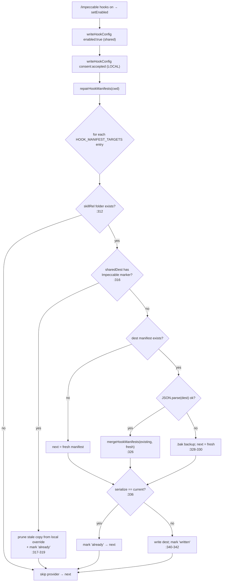
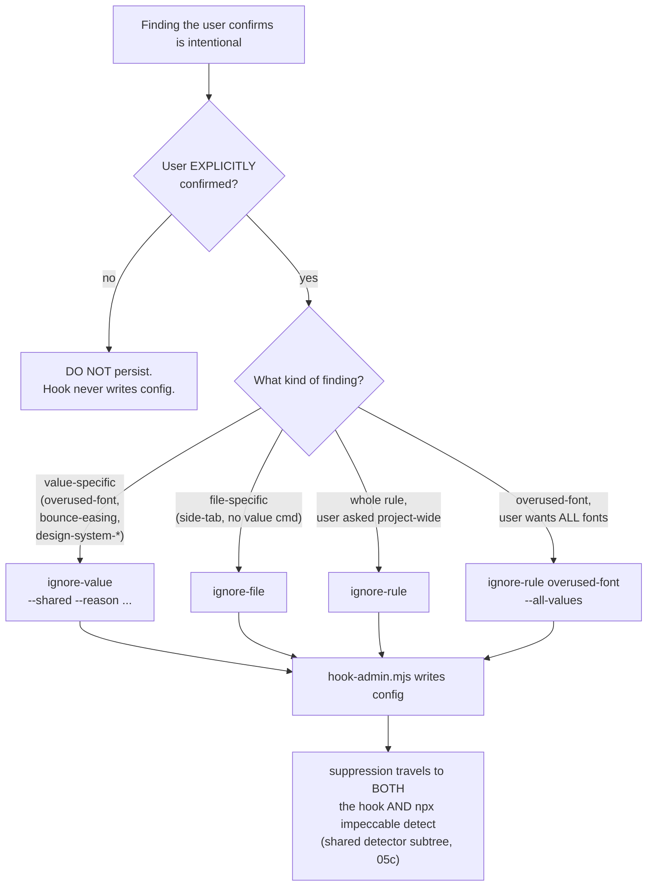

# Hook deep dive 05d — the `/impeccable hooks` admin CLI, the agent contract, and the intentional-findings policy

Companion to [`05-hook-system.md`](05-hook-system.md). That report is the
overview. This one goes to the floor on the **administrative surface** of the
hook system: the runtime CLI the model is handed to toggle and scope the
detector (`skill/scripts/hook-admin.mjs`), the agent-facing contract that drives
it (`skill/reference/hooks.md`), and the single discipline that ties them
together — **the model is taught its own escape hatch, but only a
user-confirmed admin command writes suppression config.**

This is the slice a fresh agent should read before copying Impeccable's "give the
agent a runtime knob for a deterministic checker, without letting it silently
disable the checker" pattern. The YoinkIt analog is a `/yoinkit capture`-style
admin command that scopes motion-coverage gates with the same discipline: the
capture engine may *tell* the agent how to mark a motion intentional, but it must
never let the agent write that suppression itself.

All `file:line` references are into
[`../../source/skill/scripts/hook-admin.mjs`](../../source/skill/scripts/hook-admin.mjs)
unless noted. Render mechanics of the finding lines and footer belong to
[`05b`](05b-anti-nag-and-the-directive.md); the config schema, ignore-axis
semantics, consent storage, and git-exclude mechanics belong to
[`05c`](05c-config-and-ignore-model.md); the *build-time* manifest generation
and the `npx impeccable skills install` path belong to
[`05e`](05e-manifest-generation-and-install.md). This document owns the
**runtime** twin of manifest repair and the **policy** half of the escape hatch.

---

## 1. The CLI surface — one dispatcher, seven actions, fail-*closed*

`hook-admin.mjs` is a 636-line standalone Node script (the draft's File map says
"637 lines"; the file's last content line is `main();` at :636, with a trailing
newline — read it as 636). It is **not** part of the hook runtime. It is a
user-invoked admin tool that the LLM shells out to from the
[`reference/hooks.md`](../../source/skill/reference/hooks.md) flow, and whose
human-readable stdout the harness passes straight back to the user.

`ACTIONS` ([`:37`](../../source/skill/scripts/hook-admin.mjs)) is the closed set:

```js
const ACTIONS = new Set(['status', 'on', 'off', 'ignore-rule', 'ignore-file', 'ignore-value', 'reset']);
```

`main()` ([`:608-636`](../../source/skill/scripts/hook-admin.mjs)) is the whole
dispatcher:

```js
function main() {
  const [, , actionArg, ...rest] = process.argv;
  const action = (actionArg || 'status').toLowerCase();   // default: status
  const cwd = process.cwd();

  if (!ACTIONS.has(action)) {
    process.stderr.write(`Unknown action: ${action}\nValid: ...\n`);
    process.exit(1);                                       // unknown → stderr + exit 1
  }
  try {
    let out = '';
    switch (action) { /* status|on|off|ignore-rule|ignore-file|ignore-value|reset */ }
    process.stdout.write(out + '\n');
  } catch (err) {
    process.stderr.write(`Error: ${err.message || err}\n`);
    process.exit(1);                                       // any throw → stderr + exit 1
  }
}
```

**This CLI is deliberately NOT fail-open.** This is the single most important
contrast with the hook runtime. The hook (`hook.mjs`, `hook-before-edit.mjs`) is
built around "never break the agent's turn — always exit 0, always allow"
([`05a`](05a-hook-models-and-runtime-core.md)). `hook-admin.mjs` is the opposite:
an unknown action or any thrown error exits **1** and writes to **stderr**. The
justification is structural — this is a user-typed admin command, not an in-turn
hook. If the user asks to ignore a rule and the write fails, the *right*
behavior is a loud failure the user sees, not a silent swallow that leaves the
user believing a suppression was persisted when it wasn't. A fail-open admin tool
would be a footgun: it would let the model report "done" when nothing happened.

The validation in `parseIgnoreRuleArgs` ([`:464-487`](../../source/skill/scripts/hook-admin.mjs))
and the double-scope guard in `addIgnoreValue` ([`:551-553`](../../source/skill/scripts/hook-admin.mjs))
both `throw`, and those throws ride this same exit-1 path. The CLI prefers to
refuse a malformed suppression rather than write a wrong one.

---

## 2. Each action, traced

### 2a. `status` → `statusReport` ([`:250-280`](../../source/skill/scripts/hook-admin.mjs))

The default action. Reads the raw shared file, the raw local file, and the merged
`readConfig(cwd)` view (cross-link [`05c`](05c-config-and-ignore-model.md) for the
two-file merge), and prints a fixed human-readable block:

```
Impeccable design hook
  state:        enabled | disabled
  shared file:  .impeccable/config.json   [| (malformed; ignored) | (using defaults; file not present)]
  local file:   .impeccable/config.local.json   [| (malformed; ignored) | (not present)]
  ignoreRules:  side-tab, ...  | (none)
  ignoreFiles:  tests/fixtures/**, ...  | (none)
  ignoreValues: overused-font=Inter, ...  | (none)
  maxFindings:  5
  maxChars:     8000
  env override: IMPECCABLE_HOOK_DISABLED=1 | unset
  cache file:   .impeccable/hook.cache.json  [| (not present)]
```

The `fileState` helper ([`:259-263`](../../source/skill/scripts/hook-admin.mjs))
is the notable bit: a malformed config file renders as
`"(malformed; ignored)"`, mirroring the hook's own "ignore that file, use the
rest" failure mode — so `status` is the user-facing diagnostic for the
malformed-config failure path documented in
[`hooks.md:89`](../../source/skill/reference/hooks.md). `ignoreValues` is
flattened to `rule=value` pairs ([`:264`](../../source/skill/scripts/hook-admin.mjs));
the richer `{files, reason, createdAt}` shape is not shown here (that lives in
the file, schema in [`05c`](05c-config-and-ignore-model.md)).

### 2b. `on` / `off` → `setEnabled` ([`:282-307`](../../source/skill/scripts/hook-admin.mjs))

`off` is one write: `writeHookConfig(cwd, {enabled: false, ...})`.

`on` is **three** ordered steps, and the order matters:

1. `writeHookConfig(cwd, config)` with `enabled: true` — flips the team-shared
   `hook.enabled` in `.impeccable/config.json`.
2. `writeHookConfig(cwd, {consent: 'accepted'}, {local: true})`
   ([`:290`](../../source/skill/scripts/hook-admin.mjs)) — records *per-developer*
   consent in the gitignored `.impeccable/config.local.json`. So enabling the
   hook for the team also records that *this* developer accepted it locally.
   (Consent **storage** and the `ensureHookGitExcludes` git-exclude mechanism are
   [`05c`](05c-config-and-ignore-model.md); the install-time consent **decision**
   is [`05e`](05e-manifest-generation-and-install.md).)
3. `repairHookManifests(cwd)` ([`:291`](../../source/skill/scripts/hook-admin.mjs))
   — the runtime manifest repair (§3 below).

The output is assembled from the repair result: it reports which providers were
written vs already-installed vs "no installed provider skill folders found,"
plus any malformed-manifest `.bak` backups.

**`writeHookConfig`** ([`:159-171`](../../source/skill/scripts/hook-admin.mjs)) is
the careful writer. It merges over the *existing* hook object so that fields the
admin CLI doesn't manage survive the edit:

```js
const existingHook = stripDetectorKeys(hookSection(existing));
const next = { ...existing, hook: { ...existingHook, ...hookConfig } };
```

`stripDetectorKeys` ([`:148-155`](../../source/skill/scripts/hook-admin.mjs))
removes the four `DETECTOR_CONFIG_KEYS` (`ignoreRules`, `ignoreFiles`,
`ignoreValues`, `designSystem`, [`:123`](../../source/skill/scripts/hook-admin.mjs))
from the hook subtree — back-compat for old configs that stored detector filters
under `hook`. The `{ ...existing, ... }` spread preserves **sibling top-level
keys** (e.g. `updateCheck`), and the `{ ...existingHook, ...hookConfig }` spread
preserves **unmanaged hook fields** the comment names explicitly: `consent`,
`quiet`, `auditLog`. So toggling `enabled` never clobbers a developer's
`quiet: true` or their recorded consent.

### 2c. `ignore-rule` → `addIgnoreRule` ([`:489-500`](../../source/skill/scripts/hook-admin.mjs))

Appends a rule id to `detector.ignoreRules` (dedup via `includes`). The
argument parsing is `parseIgnoreRuleArgs` ([`:464-487`](../../source/skill/scripts/hook-admin.mjs)),
which accepts `--all-values`, tolerates `--reason`/`--reason=` for command
symmetry (but discards it — `ignoreRules` stores rule ids only), and throws on
any other `--flag`.

**The `overused-font` guard** ([`:493-495`](../../source/skill/scripts/hook-admin.mjs))
is the one piece of policy hardcoded into the CLI rather than left to the prompt:

```js
if (rule === 'overused-font' && !parsed.allValues) {
  throw new Error('overused-font is value-specific by default. Use ... ignore-value overused-font <font> ...');
}
```

`ignore-rule overused-font` is **rejected** unless `--all-values` is passed. The
reasoning: suppressing the entire `overused-font` rule across a project is almost
never what a user wants when they confirm one font is intentional — they want
that *one font* ignored. Forcing `ignore-value` (or an explicit `--all-values`
opt-in) makes the broad suppression a deliberate act, not an accident. This guard
is the one place the narrowest-exception policy (§5) is enforced *in code*
instead of just *in the prompt*.

### 2d. `ignore-file` → `addIgnoreFile` ([`:502-508`](../../source/skill/scripts/hook-admin.mjs))

Appends a glob to `detector.ignoreFiles` (dedup via `includes`). One line of
logic; the glob *matching* semantics (`globToRegex`, basename matching) live in
the hook lib and are covered in [`05c`](05c-config-and-ignore-model.md).

### 2e. `ignore-value` → `addIgnoreValue` ([`:545-575`](../../source/skill/scripts/hook-admin.mjs))

The richest action, parsed by `parseIgnoreValueArgs`
([`:510-543`](../../source/skill/scripts/hook-admin.mjs)): positional `<rule>
<value...>` (value parts joined and `normalizeIgnoreValue`-d), plus `--shared`
(default), `--local`, and `--reason "..."` (multi-word or `--reason=` form).

- **Scope guard** ([`:551-553`](../../source/skill/scripts/hook-admin.mjs)):
  passing both `--shared` and `--local` throws. One scope only.
- **Dedup** ([`:557-558`](../../source/skill/scripts/hook-admin.mjs)): keyed on
  `` `${rule}\0${value}` `` (a NUL-joined composite). An existing entry with the
  same rule+value gets its `reason` updated rather than duplicated.
- **Stamp**: a fresh entry records `createdAt: new Date().toISOString()`
  ([`:566`](../../source/skill/scripts/hook-admin.mjs)) and the optional `reason`.
- Writes via `writeDetectorConfig` ([`:173-189`](../../source/skill/scripts/hook-admin.mjs))
  to either the shared or local file (`--local` triggers
  `ensureHookGitExcludes`, [`:175`](../../source/skill/scripts/hook-admin.mjs)).

`writeDetectorConfig` is the detector-subtree mirror of `writeHookConfig`: it
preserves sibling keys, strips detector keys out of any legacy `hook` subtree,
merges the new `detector` config over the existing one, and — a small asymmetry
worth noting — **deletes the `hook` subtree entirely if stripping detector keys
left it empty** ([`:184-185`](../../source/skill/scripts/hook-admin.mjs)). This
keeps the file from accumulating an empty `"hook": {}`.

> Note the **dedup-key inconsistency**: `addIgnoreValue`'s in-function dedup
> ([`:557`](../../source/skill/scripts/hook-admin.mjs)) keys on `rule\0value`
> only, while the deeper `mergeIgnoreValueEntries`/`ignoreValueEntryKey` helpers
> ([`:234-248`](../../source/skill/scripts/hook-admin.mjs)) key on
> `rule\0value\0files`. So a same-rule+value entry with a *different* `files`
> scope is treated as duplicate by `addIgnoreValue` (reason updated in place) but
> as distinct by the merge path. In practice the CLI never sets `files` (only the
> manual `npx impeccable ignores` CRUD path does), so the two keys agree on
> everything the CLI writes — but it's a latent divergence a fresh agent should
> not trip over.

### 2f. `reset` → `reset` ([`:577-606`](../../source/skill/scripts/hook-admin.mjs))

Two phases:

1. **Config files** ([`:581-593`](../../source/skill/scripts/hook-admin.mjs)):
   for both `config.json` and `config.local.json`, destructure out the `hook` and
   `detector` subtrees (`const { hook, detector, ...rest } = raw`) and keep
   `rest`. If `rest` is empty, **delete the file**; otherwise rewrite it with only
   the surviving keys. This is the surgical part: a project that also stores
   `updateCheck` in `.impeccable/config.json` keeps that key after `reset`.
2. **State files** ([`:595-602`](../../source/skill/scripts/hook-admin.mjs)):
   `hook.cache.json` and `hook.pending.json` are deleted **outright** (the comment
   says "wholly ours; delete outright").

> **`hook.pending.json` is a tombstone.** I verified across all of
> `skill/scripts/` that **no current code ever writes** `hook.pending.json` —
> it appears only in `HOOK_LOCAL_IGNORE_PATTERNS`
> ([`hook-lib.mjs:85`](../../source/skill/scripts/hook-lib.mjs), the git-exclude
> list), `getPendingPath` ([`hook-lib.mjs:126-127`](../../source/skill/scripts/hook-lib.mjs),
> the path helper), this `reset` cleanup, and a separate `live-inject.mjs`
> ignore list. There is no `writeFileSync` to it anywhere. So `reset` cleans a
> file that the current pending-re-nudge implementation never creates (pending
> state lives in the session cache, [`05b`](05b-anti-nag-and-the-directive.md)/
> [`05c`](05c-config-and-ignore-model.md)). It's defensive housekeeping for a
> prior on-disk pending design that was folded into the cache.

---

## 3. The runtime manifest-repair machinery

This is the third step of the `on` path, and it is the **runtime twin** of the
build-time generation + `npx impeccable skills install` copy that
[`05e`](05e-manifest-generation-and-install.md) owns. Same job (get the correct
provider manifest onto disk without clobbering the user's other hooks), different
trigger (the user typing `/impeccable hooks on`, not a build or an install).

### 3a. The targets — and a second hardcoded copy of the manifests

`HOOK_MANIFEST_TARGETS` ([`:48-112`](../../source/skill/scripts/hook-admin.mjs))
is an array of three target descriptors, one per supported harness:

| `provider` | `skillRel` (must exist) | `destRel` | `sharedDestRel` |
|---|---|---|---|
| `.claude` | `.claude/skills/impeccable` | `.claude/settings.local.json` | `.claude/settings.json` |
| `.agents` (Codex) | `.agents/skills/impeccable` | `.codex/hooks.json` | — |
| `.cursor` | `.cursor/skills/impeccable` | `.cursor/hooks.json` | — |

Each entry carries a `manifest()` thunk returning the provider-shaped object
inline (Claude `PostToolUse`/`Edit|Write|MultiEdit`; Codex
`PostToolUse`/`Edit|Write|apply_patch` via git-toplevel; Cursor `version:1` +
`preToolUse`). The `TIMEOUT_SECONDS = 5` and
`STATUS_MESSAGE = 'Checking UI changes'` constants
([`:45-46`](../../source/skill/scripts/hook-admin.mjs)) pin the shared fields.

> **Manifest-shape duplication (flag; census in [`05e`](05e-manifest-generation-and-install.md)).**
> `HOOK_MANIFEST_TARGETS` here is a **second, independent** definition of the same
> manifest objects that the build emits from
> [`scripts/lib/transformers/hooks.js`](../../source/scripts/lib/transformers/hooks.js).
> I verified both exist and are genuinely separate code: the build version
> interpolates command-string constants (`CLAUDE_PROJECT_HOOK`,
> `CODEX_PROJECT_HOOK`, `CURSOR_BEFORE_EDIT_SCRIPT`,
> [`hooks.js:23-26`](../../source/scripts/lib/transformers/hooks.js)) through
> `buildClaudeSettingsManifest`/`buildCodexHooksManifest`/`buildCursorHooksManifest`,
> while the runtime version writes the same strings as inline literals inside the
> `manifest()` thunks. The serialized provider manifest shapes are
> object-equivalent; the *source* is duplicated, maintained by hand.
> Runtime-repair (here) and build-generation (05e) can drift independently. I am
> only flagging it here — 05e owns the full duplication census (build,
> runtime-repair, and the `skills.mjs` installer copy).

### 3b. `IMPECCABLE_HOOK_COMMAND_MARKERS` — five entries, three of which are tombstones

The marker list used to detect "is this an Impeccable hook entry?" is
([`:38-44`](../../source/skill/scripts/hook-admin.mjs)):

```js
const IMPECCABLE_HOOK_COMMAND_MARKERS = [
  'skills/impeccable/scripts/hook-probe.mjs',        // ← does not exist
  'skills/impeccable/scripts/hook.mjs',              //   real
  'skills/impeccable/scripts/hook-before-edit.mjs',  //   real
  'skills/impeccable/scripts/hook-after-edit.mjs',   // ← does not exist
  'skills/impeccable/scripts/hook-stop.mjs',         // ← does not exist
];
```

**Three of these five script names no longer exist as files.** I verified with
`ls` of `skill/scripts/`: the only canonical `hook*` scripts present are `hook.mjs`,
`hook-lib.mjs`, `hook-before-edit.mjs`, and `hook-admin.mjs`. `hook-probe.mjs`,
`hook-after-edit.mjs`, and `hook-stop.mjs` are **tombstones of prior hook
designs** — a probe hook, a separate after-edit hook (since merged into
`hook.mjs`'s `PostToolUse`), and a Stop hook (the design Cursor's
`hook-before-edit.mjs` header explicitly replaced because "Cursor's stop hook is
not consistently dispatched"). They are kept in the marker list on purpose: so
that an **old install** carrying one of those stale commands still gets matched
and **cleaned** by `pruneImpeccableHookFromManifest` / `stripImpeccableHookEntry`.
The markers are a migration-cleanup allowlist, not a description of current files.
This is a meaningful correction to flag — a reader scanning the list would
reasonably assume five hook scripts exist; only two of the five do (`hook.mjs`,
`hook-before-edit.mjs`), and `hook-admin.mjs` itself is not in the list because it
is never installed as a hook.

### 3c. `repairHookManifests` — leave-it-never-duplicate, merge, idempotent

`repairHookManifests` ([`:309-345`](../../source/skill/scripts/hook-admin.mjs))
walks the targets:



The three behaviors worth naming:

- **Skill-folder gate** ([`:312`](../../source/skill/scripts/hook-admin.mjs)): if
  the provider's skill folder (`.claude/skills/impeccable`, etc.) is absent, skip
  the target entirely. Repair only touches harnesses the project actually has
  installed.
- **Leave-it-never-duplicate** ([`:316-320`](../../source/skill/scripts/hook-admin.mjs)):
  if the **team-shared** manifest (`sharedDest`, only Claude has one — its
  `settings.json`) already carries the Impeccable marker via
  `fileHasImpeccableHookMarker`, then `pruneImpeccableHookFromManifest(dest)`
  removes any stale copy from the **local override** (`settings.local.json`) and
  the target is reported as `already`. The point: if the developer deliberately
  moved the hook into the shared `settings.json`, repair must **not** re-add it to
  the gitignored local file — that would make Claude load both and run the
  detector twice per edit. This mirrors the installer's identical guard
  ([`05e`](05e-manifest-generation-and-install.md)).
- **Merge, don't clobber + idempotent** ([`:322-339`](../../source/skill/scripts/hook-admin.mjs)):
  if `dest` exists, parse and `mergeHookManifests(existing, fresh)`; if `dest` is
  malformed JSON, copy it to `.bak` and fall back to writing `fresh`. Then
  serialize the result and compare to the current on-disk text
  ([`:334-339`](../../source/skill/scripts/hook-admin.mjs)) — if identical,
  report `already` and write nothing. So running `on` twice is a no-op the second
  time.

### 3d. The supporting merge/prune functions

- **`mergeHookManifests`** ([`:355-377`](../../source/skill/scripts/hook-admin.mjs)):
  for each hook event, keep the user's other hook entries
  (`stripImpeccableHookEntries` removes any prior Impeccable entry) and append the
  fresh Impeccable entry. Carries `version`/`description` from the fresh object.
  This is what makes repair preserve a user's hand-added `PostToolUse` hooks.
- **`stripImpeccableHookEntry` / `stripImpeccableHookEntries`** ([`:401-423`](../../source/skill/scripts/hook-admin.mjs)):
  returns `null` for any entry whose `command`/`args` (or nested `hooks[]`) match
  a marker, so it's dropped from the array.
- **`pruneImpeccableHookFromManifest`** ([`:425-458`](../../source/skill/scripts/hook-admin.mjs)):
  the file-level version — strips Impeccable entries from every event, then if no
  hooks remain, deletes `hooks`/`description`/`version`, and if the whole object
  is then empty, **removes the file**.
- **`fileHasImpeccableHookMarker`** ([`:379-390`](../../source/skill/scripts/hook-admin.mjs))
  and **`valueHasImpeccableHookMarker`** ([`:392-399`](../../source/skill/scripts/hook-admin.mjs)):
  the recursive marker scan — walks strings/arrays/objects looking for any of the
  five `IMPECCABLE_HOOK_COMMAND_MARKERS` substrings.

---

## 4. The agent-facing contract — `reference/hooks.md`

[`skill/reference/hooks.md`](../../source/skill/reference/hooks.md) (90 lines) is
the file the LLM loads when the user types `/impeccable hooks`. It is the contract
that turns the CLI into agent behavior. The load-bearing sections:

- **Per-project toggle prose + the design-relevant extension list**
  ([`:5-11`](../../source/skill/reference/hooks.md)): the hook fires on
  `.tsx .jsx .html .vue .svelte .astro .css .scss .sass .less .ts .js`; Claude/Codex
  push a `PostToolUse` reminder, Cursor uses `preToolUse` to block. Plain `.ts`/`.js`
  are scanned but stay quiet unless something is found.
- **Supported harnesses** ([`:11`](../../source/skill/reference/hooks.md)): Claude
  (`.claude/settings.local.json`, gitignored so the hook stays machine-local — a
  hook moved into the shared `settings.json` is honored in place too), Codex
  (`.codex/hooks.json`), Cursor (`.cursor/hooks.json`).
- **The Cursor blocking note** ([`:13`](../../source/skill/reference/hooks.md)):
  `preToolUse` denies only when the real detector finds an issue, and the denial
  surfaces to the agent as the **tool error** so it can reconsider before the bad
  write lands.
- **The Routing table** ([`:19-28`](../../source/skill/reference/hooks.md)): the
  one-line description per action — the model's map from a user request to a CLI
  action. Note `ignore-rule <id>` already states "for `overused-font`, requires
  `--all-values`," surfacing the §2c code guard in the prompt. Its `reset`
  wording is user-friendly but stale/overbroad: implementation preserves
  non-hook config siblings, and the "Cursor pending queue" file is a legacy
  tombstone rather than live queue storage.
- **The Flow** ([`:31-42`](../../source/skill/reference/hooks.md)): resolve the
  action (default `status`) → invoke `node {{scripts_path}}/hook-admin.mjs <action>
  [args...]` → **pass the output through verbatim**, with action-specific
  follow-ups (a one-liner after `on`/`off`; nothing added after `status`). The
  contract is explicit that the script's stdout is the user-facing answer; the
  model is a thin driver, not a paraphraser.
- **Constraints** ([`:80-85`](../../source/skill/reference/hooks.md)): never
  hand-edit `config.json`/`config.local.json` (always go through `hook-admin.mjs`
  "so writes stay validated and the file shape stays consistent"); never edit the
  hook scripts from this flow; on Codex the user must approve via `/hooks` the
  first time; on Cursor confirm Settings → Hooks.
- **Failure modes** ([`:87-91`](../../source/skill/reference/hooks.md)): malformed
  config → ignore that file, use the rest (and `status` shows it as malformed);
  global "disable the hook" → lead with `/impeccable hooks off` (persistent),
  `IMPECCABLE_HOOK_DISABLED=1` as the one-shot env override.

### 4a. The Intentional findings policy ([`:44-54`](../../source/skill/reference/hooks.md))

This is the heart of the contract and the part YoinkIt should copy verbatim in
spirit. Three rules, in priority order:

1. **The hook itself never writes ignore config.** The opening line:
   *"The hook itself never writes ignore config. Persist an exception only after
   the user explicitly confirms the flagged issue is intentional, and always go
   through `hook-admin.mjs`."* The gate is **explicit user confirmation**, and the
   writer is **always** the admin CLI.
2. **Prefer the narrowest exception.** The decision tree
   ([`:50-53`](../../source/skill/reference/hooks.md)):
   - finding line shows an exact `ignore-value` command → run that (writes shared
     config by default);
   - value-specific findings (`overused-font`, `bounce-easing`) → `ignore-value`
     for the confirmed value, **never** `ignore-rule overused-font` for one font;
   - finding has no value-specific command (e.g. `side-tab`) → `ignore-file
     <path>` for the current file;
   - `ignore-rule <id>` **only** when the user asks to suppress the whole rule
     project-wide; broad font suppression uses `ignore-rule overused-font
     --all-values` only on explicit request.
3. **No inline source comments.** ([`:54`](../../source/skill/reference/hooks.md))
   Do not add `impeccable: ignore` comments; they pollute code and are not a
   supported suppression mechanism. (The directive footer reinforces this too,
   [`hook-lib.mjs:1264`](../../source/skill/scripts/hook-lib.mjs).)



---

## 5. The taught escape-hatch — taught everywhere, written only at the gate

This is the closed loop that makes the whole admin surface interesting, and the
policy half is this slice's to own (the render half is
[`05b`](05b-anti-nag-and-the-directive.md)).

The hook output **literally teaches the model the exact suppression command**,
per finding. Three render sites do it (mechanics → 05b):

- `formatFindingIgnoreCommand` ([`hook-lib.mjs:889-899`](../../source/skill/scripts/hook-lib.mjs))
  builds the command string:
  `/impeccable hooks ignore-value <rule> <value> --shared --reason "User confirmed <value> is intentional"`.
  It only emits for the five value-bearing rules that
  `extractFindingIgnoreValue` ([`hook-lib.mjs:655-667`](../../source/skill/scripts/hook-lib.mjs))
  recognizes (`overused-font`, `bounce-easing`, `design-system-font`,
  `design-system-color`, `design-system-radius`) — so the model is only handed a
  ready command where a *narrowest* value-scoped exception is the right move.
- `formatFindingLine` ([`hook-lib.mjs:875-887`](../../source/skill/scripts/hook-lib.mjs))
  appends that command to each finding, prefixed with the gate in plain language:
  *"If the user explicitly confirms this value is intentional: `<command>`."*
- The `directiveFooter` ([`hook-lib.mjs:1254-1266`](../../source/skill/scripts/hook-lib.mjs))
  restates the whole narrowest-exception policy and the "persist only after the
  user explicitly confirms" gate, so the discipline rides in the reminder itself,
  not just in `hooks.md`.

The **policy** — the part this slice owns — is the discipline that makes the loop
safe:

> The model is **taught its own escape hatch** (the exact command is in front of
> it on every relevant finding), but **only the user-confirmed admin path writes
> the config.** The render is advisory; the write is gated.

The full closed loop:

1. The detector finds, say, `overused-font: Inter`.
2. The hook reminder hands the model the exact command, prefixed with the
   confirmation gate.
3. The model does **not** run it on its own — it surfaces the finding and asks
   the user (or the user volunteers that Inter is intentional).
4. On explicit confirmation, the model runs `/impeccable hooks ignore-value
   overused-font Inter --shared --reason "..."`, which the
   [`hooks.md`](../../source/skill/reference/hooks.md) flow routes to
   `hook-admin.mjs ignore-value`.
5. `addIgnoreValue` writes the entry to the shared `detector.ignoreValues`.
6. Because that subtree is shared by **both** the hook *and* manual `npx
   impeccable detect` (cross-link [`05c`](05c-config-and-ignore-model.md)), the
   suppression travels to every surface at once. The next hook run and the next
   CLI scan both honor it.

The model proposes the exact command; the user confirms; the admin CLI writes;
the suppression propagates. The agent never silently mutes a finding. That is the
single transferable idea.

---

## 6. What this means for YoinkIt

YoinkIt emits a *spec*, not code, and its hard problem is capturing real-browser
motion. It has no automated agent-feedback loop today. But the moment it grows
one — a coverage gate that says "you claimed to capture the work-card hover but
the spec has 0 moved layers" — it inherits exactly the admin-surface problem this
slice dissects: the agent needs a runtime knob to scope the gate, and it must
**never** be able to silently mark a motion as "ignore, not captured."

- **STEAL the taught-but-gated escape hatch.** This is the headline. A YoinkIt
  capture-coverage hook should, per uncovered animation, hand the agent the exact
  command to mark it intentional — and refuse to let the agent run it without
  explicit user confirmation. Concretely: when capture yields 0 moved layers for
  a declared interaction, the reminder should say *"If the user confirms this
  element has no motion: `/yoinkit capture ignore-element <selector> --reason
  '...'`"* — taught in front of the agent, written only after the human says yes.
  A capture tool that let the agent self-suppress "no motion here" would quietly
  erode the one guarantee that matters: that the spec reflects what the page
  actually does.

- **STEAL the narrowest-persisted-exception policy.** Impeccable's
  value → file → rule ladder maps cleanly: for YoinkIt, prefer
  **ignore-element** (this one selector has no motion) over **ignore-interaction**
  (this whole hover gate) over **ignore-coverage** (turn the gate off for the
  project). The `overused-font`-style hardcoded guard transfers too: reject the
  broadest suppression (`ignore-coverage` for one stubborn element) unless the
  user explicitly asks for it, forcing the narrow form by default in code, not
  just in the prompt.

- **STEAL the fail-closed admin / fail-open hook split.** YoinkIt's *capture*
  primitives already fail-open by nature (a flaky real-browser run yields nothing,
  not a crash). But a `/yoinkit` admin command that scopes gates should fail
  **loud**: if writing a coverage exception fails, the user must see it, not be
  told "done" over a silent no-op. Two opposite postures for two opposite call
  sites — the in-turn hook and the user-typed admin command.

- **ADAPT the `/impeccable hooks` admin surface into `/yoinkit capture`.** Mirror
  the action set: `status` (what's gated, what's ignored, which viewports are
  covered), `on`/`off` (enable the coverage gate per project), and an
  `ignore-*` family scoped to YoinkIt's axes (element / interaction / viewport).
  Route it through `reference`-style agent docs that say "invoke the admin script,
  pass the output verbatim, never hand-edit the config." Carry the two-file
  config split ([`05c`](05c-config-and-ignore-model.md)) so coverage thresholds
  are team-shared while per-developer install/consent stays local, and make the
  runtime-repair twin ([`05e`](05e-manifest-generation-and-install.md)) re-install
  the harness manifests on `on`.

The deeper sub-slices: the hook models and runtime core
([`05a`](05a-hook-models-and-runtime-core.md)), the anti-nag machinery and the
directive footer ([`05b`](05b-anti-nag-and-the-directive.md)), the config and
ignore model ([`05c`](05c-config-and-ignore-model.md)), and the build-time
manifest generation plus `npx` install ([`05e`](05e-manifest-generation-and-install.md)).
