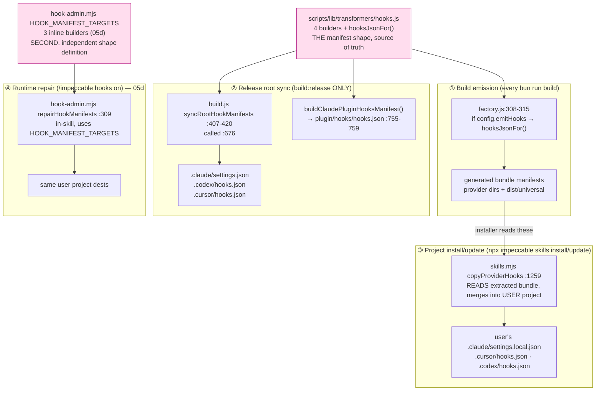
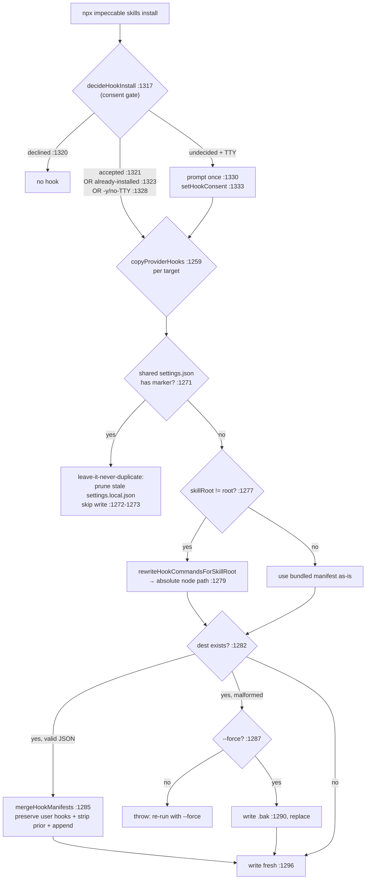

# Hook deep dive 05e — manifest generation, the four manifests, and the consenting install

Companion to [`05-hook-system.md`](05-hook-system.md). That report is the overview;
the runtime (what `hook.mjs` *does* once it fires) is [`05a`](05a-hook-models-and-runtime-core.md).
This one owns the **distribution mechanics**: how one build emits provider-native
hook manifests, what those four manifests actually contain, and how
`npx impeccable skills install` lands them in a *user's* project — without
clobbering their existing hooks, without double-firing the detector, and asking
consent exactly once. This is the slice YoinkIt needs to reason about if it ever
ships capture-validation hooks to Claude / Codex / Cursor from a single build.

This is the **build/install twin** of [`05d`](05d-admin-cli-and-contract.md)'s
runtime `/impeccable hooks on` repair path: both write the same manifests into a
project, but 05d repairs at runtime from inside the skill, while this report
covers build emission and the `npx` installer. They share the manifest *shape*
problem (§6) but are otherwise independent code.

The build machinery that surrounds this — the transformer factory, the 13-provider
fan-out, the universal zip — is report 04's: see
[`04b-build-pipeline-and-validators.md`](../04-skill-harness/04b-build-pipeline-and-validators.md)
and [`04e-distribution-and-install.md`](../04-skill-harness/04e-distribution-and-install.md).
The hook-manifest slice is the piece 04 deliberately leaves here. This report
cross-links 04 for the surrounding build, owns only the hook part.

All `file:line` references are into `../../source/...` (verified against source at
audit time; draft drift from the first-draft `06-hook-system.md` noted inline).

---

## 1. The four placement paths (the spine)

A hook manifest can reach a destination by exactly four routes. Keeping them
straight is the whole game — they write different files, run at different times,
and one is for *this* repo while another is for a *stranger's* project.



| # | Path | Code | When | Writes to | Source of shape |
|---|---|---|---|---|---|
| ① | Build emission | [`factory.js:308-315`](../../source/scripts/lib/transformers/factory.js) | every `bun run build` | provider bundle dirs (`<providerDir>/<configDir>/<rel>`) | `hooks.js` |
| ② | Release root sync + plugin | [`build.js:407-420`](../../source/scripts/build.js), called [`:676`](../../source/scripts/build.js); plugin [`:755-759`](../../source/scripts/build.js) | `build:release` **only** | repo-root `.claude/settings.json` etc. + `plugin/hooks/hooks.json` | `hooks.js` |
| ③ | Project install/update | [`skills.mjs:1259-1301`](../../source/cli/bin/commands/skills.mjs) | `npx impeccable skills install/update` | **user's** project, gitignored `settings.local.json` for Claude | reads ①'s extracted/generated bundle |
| ④ | Runtime repair | `hook-admin.mjs:309` (→ [`05d`](05d-admin-cli-and-contract.md)) | `/impeccable hooks on` | user's project dests | `HOOK_MANIFEST_TARGETS` (own copy) |

Paths ① and ② are about *this* repo: path ① emits bundle manifests under
`dist/<provider>/<configDir>/<rel>` and `dist/universal`; path ② release-syncs
tracked root/plugin copies of the same shapes. Path ③ is the live path into
someone else's codebase and reads an extracted bundle, not the tracked root
copies directly. Path ④ is the runtime twin owned by 05d. Only ① and ② read from
`hooks.js`; ③ reads ①'s *output*; ④ hardcodes its own. That asymmetry is the
duplication census in §6 — get it precise.

### The critical default-vs-release distinction

The first draft (`06-hook-system.md`, §2c) says path ② happens "only on
`build:release`" — **correct, and worth stating loudly**. The default `bun run
build` is *source-first*: it builds `dist/` but does **not** touch the tracked
root harness dirs or the plugin. The `--skip-root-sync` else branch logs
`"Skipped root harness and plugin sync"` ([`build.js:762-763`](../../source/scripts/build.js)).
Only `bun run build:release` runs the `syncRootHookManifests` + plugin block. This
matches [`../../source/CLAUDE.md`](../../source/CLAUDE.md) "Build System":

> The default build is source-first and does not sync tracked root harness
> folders; the release build performs the tracked distribution sync.

So in normal development the committed `.claude/settings.json` etc. at the repo
root are **not** rewritten by your build — they only refresh on release (or via
the `sync-generated-output.yml` workflow on `main`). The plugin variant
(`buildClaudePluginHooksManifest()`, imported at [`build.js:24`](../../source/scripts/build.js))
is in the same release-only block.

---

## 2. The manifest builders — one file, four shapes

[`scripts/lib/transformers/hooks.js`](../../source/scripts/lib/transformers/hooks.js)
(120 lines) is **the** source of the manifest JSON. It is four pure builders, each
returning a plain object, plus a dispatch switch. No I/O, no provider config — just
shapes. The command strings are pinned as four constants
([`:23-26`](../../source/scripts/lib/transformers/hooks.js)):

```js
const CLAUDE_PROJECT_HOOK = '${CLAUDE_PROJECT_DIR}/.claude/skills/impeccable/scripts/hook.mjs';
const CLAUDE_PLUGIN_HOOK  = '${CLAUDE_PLUGIN_ROOT}/skills/impeccable/scripts/hook.mjs';
const CODEX_PROJECT_HOOK  = '$(git rev-parse --show-toplevel)/.agents/skills/impeccable/scripts/hook.mjs';
const CURSOR_BEFORE_EDIT_SCRIPT = '.cursor/skills/impeccable/scripts/hook-before-edit.mjs';
```

| Builder | Line | Schema head | Matcher | Event | statusMessage | Command base |
|---|---|---|---|---|---|---|
| `buildClaudeSettingsManifest` | [`:28`](../../source/scripts/lib/transformers/hooks.js) | `description` + `hooks` | `Edit\|Write\|MultiEdit` | `PostToolUse` | `Checking UI changes` | `${CLAUDE_PROJECT_DIR}`-relative |
| `buildClaudePluginHooksManifest` | [`:53`](../../source/scripts/lib/transformers/hooks.js) | **identical** to above | `Edit\|Write\|MultiEdit` | `PostToolUse` | `Checking UI changes` | `${CLAUDE_PLUGIN_ROOT}`-relative |
| `buildCodexHooksManifest` | [`:74`](../../source/scripts/lib/transformers/hooks.js) | `description` + `hooks` | `Edit\|Write\|apply_patch` | `PostToolUse` | `Checking UI changes` | `$(git rev-parse --show-toplevel)/.agents/...` |
| `buildCursorHooksManifest` | [`:95`](../../source/scripts/lib/transformers/hooks.js) | `version:1` + `hooks` | (none) | `preToolUse` | **none** | `.cursor/...hook-before-edit.mjs` (relative) |

Three things are load-bearing here:

- **The plugin builder is the Claude builder with one substitution.** Schema is
  byte-identical; only the command base changes from `${CLAUDE_PROJECT_DIR}/.claude/skills/...`
  to `${CLAUDE_PLUGIN_ROOT}/skills/...`. The comment ([`:49-52`](../../source/scripts/lib/transformers/hooks.js))
  explains why: a marketplace `/plugin install` doesn't put the skill under
  `.claude/skills/` — Claude unpacks the plugin wherever it likes — so the hook
  must resolve relative to the plugin root. Same hook, two different "where am I?"
  assumptions, one per distribution channel.
- **Cursor is the odd one out structurally.** A top-level `version: 1`, a
  `preToolUse` (not `PostToolUse`) array, no `matcher`, no `type: "command"`, no
  `statusMessage`. That is Cursor's hook schema, and it reflects the pre-write
  blocking model (the *why* of `preToolUse` is [`05a`](05a-hook-models-and-runtime-core.md) /
  [`05b`](05b-anti-nag-and-the-directive.md)). For this report it just means: the
  installer cannot assume one schema across providers.
- **`IMPECCABLE_HOOK_COMMAND_MARKER`** ([`:19`](../../source/scripts/lib/transformers/hooks.js))
  is a *single* string, `'skills/impeccable/scripts/hook.mjs'` — distinct from the
  five-element marker *arrays* in `skills.mjs` and `hook-admin.mjs` (§6). It is the
  substring common to the build-time command paths. Don't conflate the singular
  build constant with the plural runtime arrays.

`hooksJsonFor(provider)` ([`:109-120`](../../source/scripts/lib/transformers/hooks.js))
is a three-case switch (`claude` → settings, `codex` → codex, `cursor` → cursor;
else `null`). **The plugin variant is deliberately not in the switch** — it is
emitted separately by `build.js` (path ②), because there is no "plugin provider"
in the factory's provider list; the plugin is a special release artifact, not a
13-provider permutation.

---

## 3. Per-provider opt-in: `emitHooks` on 3 of 13

Which providers get a hook is declared once, as a flag on the provider config in
[`scripts/lib/transformers/providers.js`](../../source/scripts/lib/transformers/providers.js)
(122 lines, 13 providers). Exactly **three** set `emitHooks`:

| Provider | `configDir` | `emitHooks` | `hooksManifestRel` | Line |
|---|---|---|---|---|
| `cursor` | `.cursor` | `'cursor'` | `'hooks.json'` | [`:19`](../../source/scripts/lib/transformers/providers.js), [`:21`](../../source/scripts/lib/transformers/providers.js) |
| `claude-code` | `.claude` | `'claude'` | `'settings.json'` | [`:30`](../../source/scripts/lib/transformers/providers.js), [`:32`](../../source/scripts/lib/transformers/providers.js) |
| `codex` | `.codex` | `'codex'` | `'hooks.json'` | [`:51`](../../source/scripts/lib/transformers/providers.js), [`:53`](../../source/scripts/lib/transformers/providers.js) |

The other ten (`gemini`, `agents`, `github`, `kiro`, `opencode`, `pi`, `qoder`,
`trae-cn`, `trae`, `rovo-dev`) have **no** `emitHooks` key, so they get the skill
but no hook. Adding a hook to a provider is a one-line opt-in; that is the whole
extensibility surface for "which harnesses run the detector."

### The `.agents` / `.codex` split — a pair, not a contradiction

The single most confusable fact in this subsystem: the `agents` provider
([`:55-63`](../../source/scripts/lib/transformers/providers.js), `configDir: '.agents'`,
the Codex repo-skills bundle) has **no** `emitHooks` — yet the Codex hook
*command* targets `.agents/skills/impeccable/scripts/hook.mjs`. How?

They are a pair across two directories:
- The **skill** ships under `.agents/skills/impeccable/` (the `agents` provider, no hook of its own).
- The **manifest** is emitted by the `codex` provider into `.codex/hooks.json`, and its command points back at the `.agents` skill via `$(git rev-parse --show-toplevel)`.

So Codex reads its skills from `.agents/skills` but its project hooks from
`.codex/hooks.json`. The `agents` provider has no `emitHooks` because the Codex
provider already emits the sidecar; a second emit would duplicate it. The
installer (§4) encodes the same pairing: the `.agents` *install target* is what
writes `.codex/hooks.json`.

---

## 4. The four committed manifests

These are the generated artifacts of path ① / ②, **and** the files the installer
(path ③) reads and merges into a user's project. Reading them confirms the
builders produce exactly what the tables above claim.

| File | Lines | Command (verbatim) | statusMessage | Why this base |
|---|---|---|---|---|
| [`.claude/settings.json`](../../source/.claude/settings.json) | 18 | `node "${CLAUDE_PROJECT_DIR}/.claude/skills/impeccable/scripts/hook.mjs"` | yes | project-local, Claude exports `CLAUDE_PROJECT_DIR` |
| [`.codex/hooks.json`](../../source/.codex/hooks.json) | 18 | `node "$(git rev-parse --show-toplevel)/.agents/skills/impeccable/scripts/hook.mjs"` | yes | Codex has no project-dir env var; resolve via git, skill under `.agents` |
| [`.cursor/hooks.json`](../../source/.cursor/hooks.json) | 11 | `node ".cursor/skills/impeccable/scripts/hook-before-edit.mjs"` | **no** | Cursor resolves relative to project root; different script (pre-write gate) |
| [`plugin/hooks/hooks.json`](../../source/plugin/hooks/hooks.json) | 18 | `node "${CLAUDE_PLUGIN_ROOT}/skills/impeccable/scripts/hook.mjs"` | yes | plugin unpacked anywhere; resolve via plugin root |

All four set `timeout: 5` (seconds). `statusMessage: "Checking UI changes"` is on
claude/codex/plugin but **not** cursor (its schema has no such field). The
command-path differences are the heart of the "same hook, four resolution
strategies" design — each base answers "how do I find `hook.mjs` from where this
manifest lives?" for that harness. The *meaning* of these command strings at
runtime (harness resolution, `apply_patch` body parsing) is
[`05a`](05a-hook-models-and-runtime-core.md)'s.

---

## 5. The project-install path (`skills.mjs`)

[`cli/bin/commands/skills.mjs`](../../source/cli/bin/commands/skills.mjs) is 1818
lines; this report owns the hook slice. The path into a user's project is
**consent gate → copy/merge per target**, and the copy step has three pieces of
hard-won discipline.



### 5.1 Targets and artifact mapping

`DEFAULT_TARGETS = ['.claude', '.agents']` ([`:78`](../../source/cli/bin/commands/skills.mjs)).
A default install therefore wires **both** the Claude hook **and** — via the
`.agents` target — the Codex `.codex/hooks.json` sidecar (the §3 pairing in
action).

`PROVIDER_HOOK_ARTIFACTS` ([`:89-106`](../../source/cli/bin/commands/skills.mjs))
maps each install target to a `{sourceProvider, rel, destProvider, destRel}`:

```js
'.claude': [{ sourceProvider: '.claude', rel: 'settings.json',
              destProvider: '.claude', destRel: 'settings.local.json' }],   // :96
'.cursor': [{ sourceProvider: '.cursor', rel: 'hooks.json', destProvider: '.cursor' }], // :99
'.agents': [{ sourceProvider: '.codex', rel: 'hooks.json', destProvider: '.codex' }],   // :104
```

The subtle one is `.claude`: the bundle ships the manifest as `settings.json`, but
the installer writes it to the **gitignored `.claude/settings.local.json`**. The
hook stays machine-local; it is never committed to a team repo as a side effect of
one developer installing. `hookArtifactsForProvider`
([`:1057-1072`](../../source/cli/bin/commands/skills.mjs)) resolves these into
`{src, dest}` and, when `destRel !== rel` (i.e. only for `.claude`), also sets a
`sharedDest` pointing at the team-shared `settings.json` — the file it must check
to avoid duplication (5.2).

### 5.2 The three smart behaviors in `copyProviderHooks` ([`:1259-1301`](../../source/cli/bin/commands/skills.mjs))

**(a) Leave-it-never-duplicate** ([`:1271-1274`](../../source/cli/bin/commands/skills.mjs)).
If the team-shared `settings.json` *already* has the Impeccable marker — a legacy
install or a deliberate user move into the committed file — honor it there and
skip the local write, **but first prune any stale copy** from
`settings.local.json` via `pruneImpeccableHookFromManifest`
([`:1190-1224`](../../source/cli/bin/commands/skills.mjs)). Why it matters: if both
files carried the hook, Claude Code would load both and run the detector **twice
per edit**. This is the discipline that prevents a self-inflicted double-fire.

**(b) Merge, don't clobber** ([`:1282-1293`](../../source/cli/bin/commands/skills.mjs)).
If the destination already exists, parse it and call `mergeHookManifests(existing,
fresh)` ([`:1226-1249`](../../source/cli/bin/commands/skills.mjs)). The merge:
- starts from the user's whole existing object (`{...existingObject, hooks: {}}`),
- for each hook event, **strips prior Impeccable entries** from the user's array
  (`stripImpeccableHookEntries` → recursive marker match,
  [`:1161-1184`](../../source/cli/bin/commands/skills.mjs)) and **appends the fresh
  Impeccable entry** — so the user's *other* hooks survive untouched and the
  operation is idempotent (re-installing never stacks duplicate Impeccable
  entries).

Malformed existing JSON → **throw** with a clear message ("Re-run with `--force`")
unless `--force`, in which case it writes a `.bak` backup
([`:1290`](../../source/cli/bin/commands/skills.mjs)) and replaces. The installer
never silently destroys a settings file it can't parse.

**(c) Skill-root command rewrite** ([`:1277-1279`](../../source/cli/bin/commands/skills.mjs)).
When installing from a `skillRoot` that differs from the project `root` — a
submodule checkout, or a global install where the skill is *not* at
`${CLAUDE_PROJECT_DIR}/.claude/skills/` — the relative command base would not
resolve. `rewriteHookCommandsForSkillRoot`
([`:1084-1103`](../../source/cli/bin/commands/skills.mjs)) walks the manifest and
rewrites any command carrying the marker to an absolute `node "<skillRoot>/.../hook.mjs"`,
using `hookScriptPathForProvider` ([`:1074-1082`](../../source/cli/bin/commands/skills.mjs))
to pick `hook.mjs` (claude/agents) vs `hook-before-edit.mjs` (cursor). In the
normal in-project install (`skillRoot === root`) the bundled manifest is used
as-is.

### 5.3 The detection helpers (why these don't false-positive)

The merge/dedup logic leans on a family of marker checks. The non-obvious one:

- `fileHasImpeccableHookMarker` ([`:1119-1130`](../../source/cli/bin/commands/skills.mjs))
  parses the JSON and scans **only the `hooks` subtree** via
  `valueHasImpeccableHookMarker` ([`:1150-1159`](../../source/cli/bin/commands/skills.mjs)),
  **not** the raw file text. So a `permissions` allow-entry that happens to mention
  the hook path does **not** read as "hook installed." This is the kind of bug a
  naive `text.includes(marker)` would ship.
- `hookInstalledForProvider` ([`:1139-1148`](../../source/cli/bin/commands/skills.mjs))
  checks the local write target *and* the shared sibling (for `.claude`), so a
  user who moved the hook into `settings.json` still reads as installed.
- `expectedHookDests` ([`:1107-1113`](../../source/cli/bin/commands/skills.mjs))
  returns the local-override dest paths (used by callers to report/verify).
- `IMPECCABLE_HOOK_COMMAND_MARKERS` ([`:82-88`](../../source/cli/bin/commands/skills.mjs))
  is the **five-element** list (`hook-probe`, `hook`, `hook-before-edit`,
  `hook-after-edit`, `hook-stop`) — identical to `hook-admin.mjs`'s (§6). The
  extra entries beyond `hook.mjs`/`hook-before-edit.mjs` catch hooks from older or
  experimental variants so stripping/dedup is robust across versions.

---

## 6. The consent decision

Storage of the consent value (`getHookConsent`/`setHookConsent`, the gitignored
`config.local.json`, the `.git/info/exclude` trick) belongs to
[`05c`](05c-config-and-ignore-model.md). This report owns the **decision logic**.

`decideHookInstall(root, targets, {yes})` ([`:1317-1335`](../../source/cli/bin/commands/skills.mjs))
is the cleanest "ask once, remember, never nag" gate in the codebase. The
explainer text is `HOOK_EXPLAINER` ([`:1303-1311`](../../source/cli/bin/commands/skills.mjs)).
The decision tree, in order:

| Condition | Line | Result |
|---|---|---|
| no targets | `:1318` | `false` |
| consent `=== 'declined'` | `:1320` | `false` (short-circuit) |
| consent `=== 'accepted'` | `:1321` | `true` |
| already installed (marker present on every target) | `:1323` | `true` — **never nag existing users** |
| undecided + not-installed + (`-y` flag **or** no TTY) | `:1328` | `true` — default-on **without recording** a re-promptable decision |
| else (undecided + interactive) | `:1330-1334` | prompt once (default Yes), `setHookConsent`, return answer |

Two design choices stand out. First, the **already-installed** branch returns
`true` without prompting — an existing user is never re-asked, even if they never
explicitly consented (they vote with their feet by having the hook). Second, the
**non-interactive** branch (`-y` or no TTY) installs by default but **does not
record** a decision — so a CI run or piped install doesn't lock in an `accepted`
that the developer never actually saw; the next interactive run can still prompt.
Consent is recorded *only* when a human is actually asked.

Call sites — there are several install/update entry points, all using the same
consent + copy contract: existing install uses `:1497`/`:1529`, fresh install
uses `:1563`/`:1582`, and update uses `:1717-1718` and `:1751-1752`. Each pairs
`decideHookInstall(...) && copyProviderHooks(...)`. `skills link` currently links
skill folders only; it does not install or repair hooks. The install path
additionally filters to *missing* targets before copying via
`hookInstalledForProvider` ([`:1508`](../../source/cli/bin/commands/skills.mjs)),
so an update only tops up the hooks a project is actually missing.

---

## 7. The manifest-shape duplication census (refining the draft)

The first draft (`06-hook-system.md`, "Surprises") claims **"three independent
copies of the manifest JSON."** That is imprecise; the accurate picture is **two
shape definitions plus a consumer**, on a *separate* axis from the config-layout
duplication. State the axes, not a count:

**Axis 1 — the manifest SHAPE is defined independently in TWO places:**
1. [`scripts/lib/transformers/hooks.js`](../../source/scripts/lib/transformers/hooks.js)
   — 4 builders (build-time; also consumed by `build.js`'s root sync, path ②).
2. `hook-admin.mjs` `HOOK_MANIFEST_TARGETS` ([`:48-112`](../../source/skill/scripts/hook-admin.mjs))
   — 3 inline `manifest: () => ({...})` builders (runtime repair, owned by
   [`05d`](05d-admin-cli-and-contract.md)). Byte-for-byte the same `description` /
   `matcher` / `command` / `timeout` / `statusMessage`, but maintained separately.
   (Note: only three targets — claude/agents/cursor; **no** plugin variant, since
   runtime repair doesn't ship plugins.)

These two are the genuine drift hazard: edit a matcher in `hooks.js` and you must
mirror it in `hook-admin.mjs` by hand.

**`skills.mjs` is NOT a third shape definition.** It does **not** hardcode the
manifest JSON — `copyProviderHooks` *reads* the generated bundled manifest
(`readJsonFile(src, ...)`, [`:1276`](../../source/cli/bin/commands/skills.mjs)) and
merges it. It is a **consumer** of definition #1's output, not a third source of
truth. What `skills.mjs` *does* duplicate from `hook-admin.mjs` is the
**five-element marker list** (`IMPECCABLE_HOOK_COMMAND_MARKERS`,
[`:82-88`](../../source/cli/bin/commands/skills.mjs) vs `hook-admin.mjs:38-44`) and
the near-identical **merge/strip/prune functions** — a logic duplication, not a
shape duplication.

**Axis 2 (separate, owned by [`05c`](05c-config-and-ignore-model.md)):** the
config layout / color parser / git-exclude logic is duplicated between
`hook-lib.mjs` and `cli/lib/impeccable-config.mjs` — a different axis entirely,
documented as intentional (separate npm/skill trees that can't share runtime
code).

So: two manifest-*shape* definitions (`hooks.js` ↔ `hook-admin.mjs`), one consumer
(`skills.mjs`, which adds a marker-list + merge-logic duplication), and a separate
config-layout axis. "Three copies of the JSON" overcounts by folding the consumer
in with the definitions.

---

## What this means for YoinkIt

YoinkIt emits a spec; it doesn't write code (the inversion — see
[`00-EXECUTIVE-SUMMARY.md`](../../00-EXECUTIVE-SUMMARY.md), [`PATTERNS-FOR-YOINKIT.md`](../../PATTERNS-FOR-YOINKIT.md)
A5/F). But if YoinkIt ever ships **capture-validation hooks** — "your recreation
drifted from the captured spec," "this animation isn't covered" — wired into the
agent harness on edit, it faces this exact distribution problem: provider-native
manifests, from one build, into a stranger's project, asking consent once. This
sub-dive is the blueprint.

**STEAL — the installer discipline (`copyProviderHooks`).** YoinkIt's installer
must never overwrite a user's `settings.json` and must never double-fire. Copy the
two behaviors verbatim in spirit:
- **Merge-don't-clobber:** parse the existing manifest, strip prior YoinkIt
  entries, append fresh, preserve the user's other hooks; malformed JSON throws
  unless `--force` (then `.bak`). Idempotent re-install.
- **Leave-it-never-duplicate:** if the hook already lives in a shared/committed
  location, honor it there and prune the local copy, so the validator never runs
  twice per edit.

**STEAL — install to gitignored `settings.local.json` + ask-once consent.** A
capture-validation hook is a machine-local choice, not a team commitment. Land it
in the gitignored local-override file (the `.claude/settings.local.json` pattern),
and gate on a `decideHookInstall`-style decision: ask once with a one-line
explainer, record `accepted`/`declined` to a gitignored config, treat
already-installed as accepted (never nag), and on non-interactive runs default-on
**without** recording — so CI doesn't lock in a phantom consent.

**ADAPT — per-provider opt-in (`emitHooks`) to YoinkIt's harness set.** YoinkIt
already models the pipeline against ~6 browser primitives with thin per-driver
adapters (see the repo's driver model). Mirror that for hooks: one `emitHooks`
flag per harness config, a `hooksJsonFor(harness)` switch returning the
provider-native manifest, and one consent + copy contract shared across them. A
new harness is then a one-line opt-in plus a builder. Reuse YoinkIt's *existing*
provider/driver registry rather than inventing a parallel list.

**AVOID — the multi-copy manifest-shape hazard.** Impeccable defines the manifest
shape twice (`hooks.js` build-time, `hook-admin.mjs` runtime-repair) and keeps
them in sync by hand. YoinkIt should generate every manifest from **one** builder
module and have the installer *read* the generated artifact (the `skills.mjs`
consumer model is the right half of Impeccable's design; the `hook-admin.mjs`
second copy is the wrong half). One shape source, many consumers — never two
shape sources.

**Concrete YoinkIt application.** A `yoinkit hooks install` command:
`hooksJsonFor('claude'|'codex'|'cursor')` from one `transformers/hooks.js`-style
module emits a `PostToolUse` (Claude/Codex) / `preToolUse` (Cursor) manifest whose
command runs YoinkIt's spec-validator on edited UI/animation files; `bun run build`
emits the generated bundle; `yoinkit hooks install` reads that bundle, runs the
consent gate, and merges into the user's gitignored local settings — never
clobbering, never double-firing, asking once. The runtime side of that hook (what
the validator emits back into the turn) follows Impeccable's directive-footer
pattern in [`05b`](05b-anti-nag-and-the-directive.md).

---

*Scope boundaries:* the runtime `repairHookManifests` twin + agent contract →
[`05d`](05d-admin-cli-and-contract.md). Consent storage + `.git/info/exclude` →
[`05c`](05c-config-and-ignore-model.md). The command strings' runtime *meaning*
(harness resolution, `apply_patch`) → [`05a`](05a-hook-models-and-runtime-core.md).
The surrounding transformer factory / 13-provider build →
[`04b`](../04-skill-harness/04b-build-pipeline-and-validators.md),
[`04e`](../04-skill-harness/04e-distribution-and-install.md).
