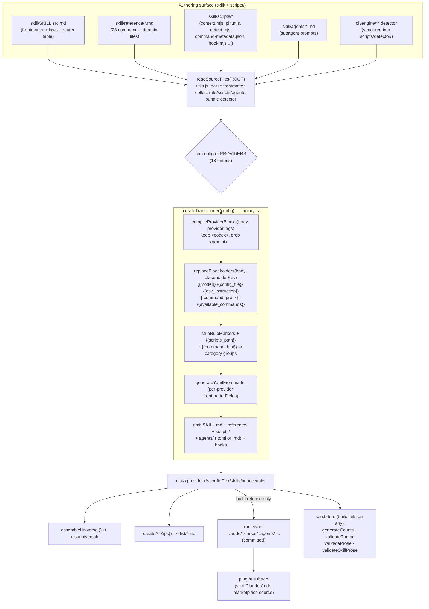
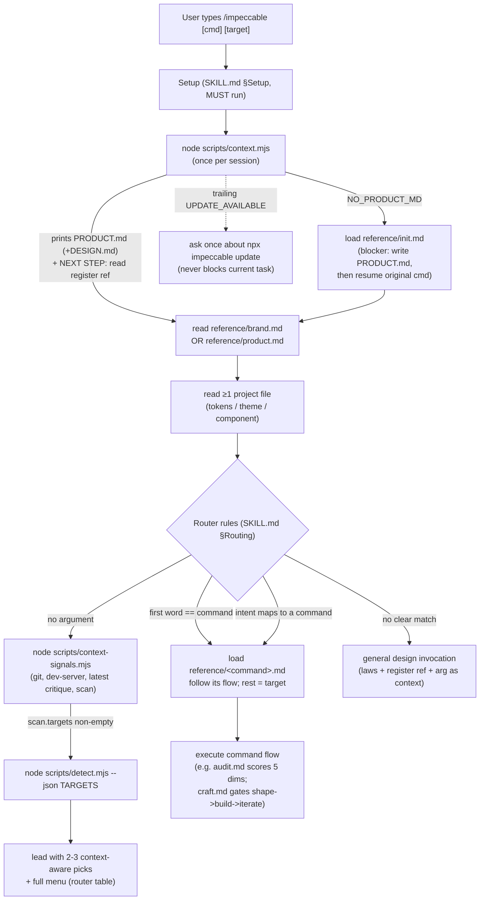

# Audit 05 — Skill System, Multi-Harness Distribution & Build

**Subsystem:** the single-source skill (`skill/SKILL.src.md`), the build/transformer pipeline that compiles it to ~12 agent harnesses, the runtime context-gathering protocol, the command-metadata single-source-of-truth, the pin shim, and the install/distribution model.

**Audience:** YoinkIt, which currently ships its capability as an agent skill with **hand-maintained per-harness copies** (`skill/codex/`, `skill/claude/`) driving a map→capture pipeline. Impeccable solves the exact problem YoinkIt has: *one* authoring surface compiled deterministically to every harness. Every finding is framed toward what YoinkIt can steal.

---

## Orientation

Impeccable is built around one hard inversion of YoinkIt's current model. YoinkIt authors the same skill twice (once per harness) and keeps them in sync by hand; Impeccable authors **once** in `skill/SKILL.src.md` plus a `reference/` tree, then a pure Node build (`scripts/build.js` + `scripts/lib/transformers/*`) stamps out 13 provider directories (`.claude/`, `.cursor/`, `.gemini/`, `.codex/`, `.agents/`, `.github/`, `.kiro/`, `.opencode/`, `.pi/`, `.qoder/`, `.trae/`, `.trae-cn/`, `.rovodev/`). Providers differ only by a small **config object** (`PROVIDERS` in `providers.js`) and a **placeholder table** (`PROVIDER_PLACEHOLDERS` in `utils.js`); a 7-token substitution pass (`{{model}}`, `{{config_file}}`, `{{ask_instruction}}`, `{{command_prefix}}`, `{{available_commands}}`, `{{scripts_path}}`, `{{command_hint}}`) plus harness-conditional `<codex>…</codex>` blocks resolve everything per target. At runtime the skill is *one* `/impeccable` command exposing 23 sub-commands behind a router table; a `context.mjs` boot script runs once per session to load project context, and the router lazy-loads `reference/<command>.md` only for the command actually invoked. The generated output is committed to the repo (so `npx skills` and submodule installs read it directly), while the source-of-truth lives entirely under `skill/` + `scripts/`.

---

## File map

Authoring surface (edit these):
- [`skill/SKILL.src.md`](../source/skill/SKILL.src.md) — the single source: frontmatter (auto-trigger description, `argument-hint`, `allowed-tools`), shared design laws, the **Commands** router table, routing rules, pin/hooks docs.
- [`skill/reference/`](../source/skill/reference/) — 28 files: one `<command>.md` per command (`craft.md`, `audit.md`, `critique.md`, `polish.md`, `live.md`, `hooks.md`, …) **plus** domain references (`brand.md`, `product.md`, `interaction-design.md`, `codex.md`).
- [`skill/scripts/command-metadata.json`](../source/skill/scripts/command-metadata.json) — single source of truth for each command's `description` + `argumentHint`.
- [`skill/scripts/context.mjs`](../source/skill/scripts/context.mjs) — boot script: prints `PRODUCT.md`/`DESIGN.md` or `NO_PRODUCT_MD`; piggybacks the update check.
- [`skill/scripts/context-signals.mjs`](../source/skill/scripts/context-signals.mjs) — the no-argument `/impeccable` signal gatherer (git, dev-server probe, latest critique, scan targets).
- [`skill/scripts/detect.mjs`](../source/skill/scripts/detect.mjs) — thin loader for the bundled anti-pattern detector.
- [`skill/scripts/pin.mjs`](../source/skill/scripts/pin.mjs) — creates/removes `/audit`-style standalone shortcut shims across harness dirs.
- [`skill/agents/`](../source/skill/agents/) — canonical subagent prompts (`impeccable-asset-producer.md`, `impeccable-manual-edit-applier.md`) with `providers:` gating.

Build / transformer system:
- [`scripts/build.js`](../source/scripts/build.js) — orchestrator: read source → transform per provider → assemble universal → zip → API data → CF config → root sync → plugin subtree → validators.
- [`scripts/lib/transformers/index.js`](../source/scripts/lib/transformers/index.js) — named exports kept as test spy targets.
- [`scripts/lib/transformers/factory.js`](../source/scripts/lib/transformers/factory.js) — `createTransformer(config)`; the per-skill emit loop (frontmatter, body, references, scripts, agents, hooks).
- [`scripts/lib/transformers/providers.js`](../source/scripts/lib/transformers/providers.js) — the `PROVIDERS` config map (13 entries).
- [`scripts/lib/transformers/hooks.js`](../source/scripts/lib/transformers/hooks.js) — per-harness hook manifest builders (Claude `settings.json`, Codex/Cursor `hooks.json`, plugin `hooks/hooks.json`).
- [`scripts/lib/utils.js`](../source/scripts/lib/utils.js) — `readSourceFiles`, `PROVIDER_PLACEHOLDERS`, `replacePlaceholders`, `compileProviderBlocks`, `stripRuleMarkers`, YAML emit, per-project artifact stash/restore.
- [`scripts/lib/sub-pages-data.js`](../source/scripts/lib/sub-pages-data.js) — `SKILL_CATEGORIES` + `CATEGORY_ORDER` (drive the `{{command_hint}}` grouping and site).

Distribution / install:
- [`docs/HARNESSES.md`](../source/docs/HARNESSES.md) — the capability matrix (frontmatter support, hook surface, skill dir per harness) that *informs* `providers.js`.
- [`.claude-plugin/plugin.json`](../source/.claude-plugin/plugin.json) + [`marketplace.json`](../source/.claude-plugin/marketplace.json) — Claude Code plugin/marketplace manifests.
- [`cli/bin/cli.js`](../source/cli/bin/cli.js) + [`cli/bin/commands/skills.mjs`](../source/cli/bin/commands/skills.mjs) — `npx impeccable install/link/update/check`.
- [`cli/lib/download-providers.js`](../source/cli/lib/download-providers.js) — provider→config-dir map for website downloads.
- [`skills-lock.json`](../source/skills-lock.json) — `vercel-labs/skills` lockfile (empty here; it's a *consumer* manifest, see §5).

Generated outputs (committed, do not hand-edit): [`.claude/skills/impeccable/SKILL.md`](../source/.claude/skills/impeccable/SKILL.md), [`.cursor/skills/impeccable/SKILL.md`](../source/.cursor/skills/impeccable/SKILL.md), [`.agents/skills/impeccable/SKILL.md`](../source/.agents/skills/impeccable/SKILL.md), and 10 more.

---

## Diagram 1 — The build pipeline (one source → N provider outputs)



The 5-stage transform (`T1→T5`) is the whole secret. Everything provider-specific is data in two tables; the code path is identical for all 13 targets.

---

## Diagram 2 — Runtime skill-routing flow



Key invariant: **context is loaded by Setup before the router runs**, so sub-commands "don't re-invoke `/impeccable`" (SKILL.src.md:168). The boot is once-per-session by instruction, not by lock file — the model is told "If you've already seen its output in this conversation, do not re-run it" (SKILL.src.md:17).

---

## 1. The one-skill / N-commands router architecture (and why they consolidated)

There is exactly **one** user-invocable skill, `impeccable`, with **23 commands** beneath it. The router is a plain markdown table in `SKILL.src.md:121-146`:

```
| Command | Category | Description | Reference |
|---|---|---|---|
| `craft [feature]` | Build | Shape, then build a feature end-to-end | [reference/craft.md](reference/craft.md) |
| `audit [target]`  | Evaluate | Technical quality checks (a11y, perf, responsive) | [reference/audit.md](reference/audit.md) |
...
```

Plus three management commands declared in prose: `pin`, `unpin`, `hooks` (SKILL.src.md:147).

**Routing is 4 rules** (`SKILL.src.md:149-172`):
1. **No argument** → "what should I do?": run `context-signals.mjs`, reason over the JSON, lead with 2-3 context-aware picks, then show the full menu. *Never auto-run.*
2. **First word matches a command** (table or `pin`/`unpin`/`hooks`) → load that reference, the rest is the target.
3. **First word doesn't match but intent maps** (e.g. "fix the spacing" → `layout`) → load that command's reference as if invoked.
4. **No clear match** → general design invocation using the full arg as context.

The 23-count is **derived, not declared**: `generateCounts()` in `build.js:33-52` counts router-table rows with the regex `/^\| `[^`]+` \|/gm`, writes `COMMAND_COUNT` to `site/public/js/generated/counts.js`, then **fails the build** if any of `index.astro`, `README.md`, `AGENTS.md`, `plugin.json`, `marketplace.json` carry a stale "N commands" number (`build.js:84-92`). The count cannot drift from the source.

**Why they consolidated (the `/`-menu-pollution rationale):** stated bluntly in the project's own `CLAUDE.md`:

> *"Do not add standalone skills unless there's a strong reason. The consolidation was deliberate: the `/` menu pollution problem is real and gets worse as users install more plugins."*

Before v3.0, each command was its own top-level skill. The build still carries the gravestones — `build.js:684-697` lists the 17 deprecated standalone skills (`adapt, animate, audit, bolder, …`) and actively deletes them from local harness dirs on every release sync. So Impeccable consciously traded 23 entries in the harness's `/` menu for **one** (`/impeccable`) plus an in-skill router, accepting one extra hop (`/impeccable audit` vs `/audit`) to avoid polluting a shared namespace. The `pin` mechanism (§4) is the escape hatch for power users who want a specific command back at top level.

This is **progressive disclosure done structurally**: the 24 KB `SKILL.src.md` is always in context, but the per-command flow (each `reference/*.md` is 100-200 lines) is loaded *only* for the command invoked. The router table is the manifest; the reference files are the lazy chunks.

---

## 2. The single-source → multi-provider build

### 2a. Source ingestion

`readSourceFiles(rootDir)` (`utils.js:249-336`) reads exactly one skill from `skill/SKILL.src.md` and returns a `{ skills: [oneEntry] }` shape (array-shaped for backwards compat with the old multi-skill build). It collects `references` (all `reference/*.md`), `scripts` (all of `skill/scripts/**` **minus** per-project artifacts like `config.json`, *plus* the vendored detector bundle from `cli/engine/**`), and `agents` (parsed from `skill/agents/*.md`).

**Critical naming trick** (`utils.js:238-248`): the source is `SKILL.src.md`, **not** `SKILL.md`, on purpose. `vercel-labs/skills` discovers a skill by finding a literal `SKILL.md` and copying that directory verbatim. If `skill/SKILL.md` existed, `npx skills` would install the *uncompiled* source with unresolved `{{placeholders}}` and no vendored detector. Hiding it as `.src.md` forces the CLI to fall through to a compiled harness dir. **This is the single most important lesson for YoinkIt** (see §6).

### 2b. The transformer factory

`createTransformer(config)` (`factory.js:156-326`) returns a `transform(skills, distDir)` closure. Per skill it builds frontmatter, compiles the body, and copies references/scripts/agents/hooks into `dist/<provider>/<configDir>/skills/<name>/`. The body pipeline, in order (`factory.js:229-236`):

1. `compileProviderBlocks(body, providerTags)` — harness-conditional blocks.
2. `replacePlaceholders(body, placeholderKey, commandNames, allSkillNames)` — token substitution.
3. `stripRuleMarkers(body)` — remove `<!-- rule:id -->` eval anchors.
4. `body.replace(/\{\{scripts_path\}\}/g, scriptsPath)` — provider-aware script path.
5. `bodyTransform(body, skill)` if the config defines one.

### 2c. Placeholder substitution — where it's defined and applied

Two tables, both in `utils.js`:

- `PROVIDER_PLACEHOLDERS` (`utils.js:564-631`) maps each provider key → `{ model, config_file, ask_instruction, command_prefix }`.
- `replacePlaceholders()` (`utils.js:714-754`) does the regex replacement of `{{model}}`, `{{config_file}}`, `{{ask_instruction}}`, `{{command_prefix}}`, `{{available_commands}}`.

Verified differences across the three generated outputs I compared:

| Token | `{{model}}` | `{{ask_instruction}}` | `{{command_prefix}}` | `{{config_file}}` |
|---|---|---|---|---|
| **Claude Code** | `Claude` | `STOP and call the AskUserQuestion tool to clarify.` | `/` | `CLAUDE.md` |
| **Codex** | `GPT` | `STOP and use Codex's structured user-input/question tool…` | `$` | `AGENTS.md` |
| **Cursor** | `the model` | `ask the user directly to clarify what you cannot infer.` | `/` | `.cursorrules` |
| **Gemini** | `Gemini` | (ask directly) | `/` | `GEMINI.md` |
| **OpenCode** | `Claude` | `STOP and call the \`question\` tool to clarify.` | `/` | `AGENTS.md` |

Confirmed in the generated files: `.claude/.../SKILL.md` says *"Claude is capable of extraordinary work"*, `.agents/.../SKILL.md` says *"GPT is capable…"*, `.cursor/.../SKILL.md` says *"the model is capable…"*. The Codex hooks line reads `$impeccable hooks` (dollar prefix), every other provider reads `/impeccable hooks`.

Three placeholders resolve outside the simple table:
- **`{{scripts_path}}`** — set per skill in `factory.js:234` to `${configDir}/skills/${skillName}/scripts`. So Claude's Setup says `node .claude/skills/impeccable/scripts/context.mjs`, Cursor's says `.cursor/...`, agents' says `.agents/...`. (Verified.)
- **`{{available_commands}}`** — built in `replacePlaceholders` from `IMPECCABLE_SUB_COMMANDS` (`utils.js:708-712`); since there's one user-invocable skill, it emits the list as `/impeccable adapt, /impeccable animate, …` (or `$impeccable …` for Codex). Used by `audit.md` to constrain which commands it may recommend.
- **`{{command_hint}}`** — resolved in `factory.js:210-224` (the *frontmatter* `argument-hint`). It reads `command-metadata.json`, groups command names by `SKILL_CATEGORIES`, and joins groups with ` · `. The Claude output's `argument-hint` becomes `"[craft|shape · audit|critique · animate|bolder|… · init|document|extract|live] [target]"`.

There's also a **legacy invocation rewrite** (`utils.js:743-751`): when `command_prefix !== '/'` (i.e. Codex), any `/skillname` reference in the body is rewritten to `$skillname`, longest-name-first to avoid partial clobbering.

### 2d. Harness-conditional blocks

`compileProviderBlocks(content, activeTags)` (`utils.js:662-674`) is the second axis of per-provider variation: standalone `<tag>…</tag>` blocks where the tag is in `PROVIDER_BLOCK_TAGS` (`utils.js:633-648`). Matching tags keep their body and drop the wrapper; non-matching blocks are deleted; unknown tags (real HTML) are left alone. `SKILL.src.md` uses three such blocks: a `<codex>`-only typography ceiling reminder (line 42-45), a `<codex>` defects list (line 100-108), and a `<gemini>` "never animate `` on hover" ban (line 69-71).

**Verified:** the gemini ban appears in `.gemini/.../SKILL.md` and is absent from `.claude/`; the codex `ghost-card` ban appears in `.agents/` (Codex reads `.agents/skills`) and is absent from `.claude/`. `providerTags` is set per config — e.g. `claude-code: ['claude-code', 'claude']`, `agents: ['agents', 'codex']` — so a `<claude>` block also targets Claude Code, and `<codex>` targets both the `codex` and `agents` builds.

### 2e. How each provider differs (the `PROVIDERS` config)

`providers.js:12-122` is a 13-entry map. The differentiators per entry:

- **`configDir`** — `.claude`, `.cursor`, `.gemini`, `.codex`, `.agents`, `.github`, `.kiro`, `.opencode`, `.pi`, `.qoder`, `.trae`, `.trae-cn`, `.rovodev`.
- **`providerTags`** — which `<…>` blocks survive.
- **`frontmatterFields`** — which optional YAML fields to emit. Claude Code emits the full set (`user-invocable`, `argument-hint`, `license`, `compatibility`, `metadata`, `allowed-tools`); Cursor/Gemini/Codex emit *none* of the extensions (Gemini validates only name+description). This is driven directly by the `HARNESSES.md` support matrix.
- **`placeholderProvider`** — lets a config borrow another's placeholder table (`agents` borrows `codex`; `github` borrows `agents`; `trae-cn` borrows `trae`).
- **`agentFormat`** — `claude-md` (Claude) vs `codex-toml` (Codex via `CODEX_SKILL_PROVIDERS`) vs none. Controls whether/how subagents are emitted.
- **`emitHooks`** — `'claude' | 'codex' | 'cursor'` selector into `hooksJsonFor()`; `hooksManifestRel` overrides the manifest filename (Claude → `settings.json`, Cursor → `hooks.json`, default → `hooks/hooks.json`).
- **`writeOpenAIMetadata`** — Codex/agents also emit an `agents/openai.yaml` sidecar (`factory.js:241-244`, `buildOpenAIMetadata` at `factory.js:73-82`).
- **`includeVersion`** — whether to stamp `version:` into frontmatter (default true; read from `plugin.json`).

### 2f. Hooks per harness

`hooks.js` builds **four** distinct manifest shapes from the same logical hook:
- Claude project: `PostToolUse` matcher `Edit|Write|MultiEdit` → `${CLAUDE_PROJECT_DIR}/.claude/skills/impeccable/scripts/hook.mjs` (`buildClaudeSettingsManifest`, lines 28-47).
- Claude **plugin**: same schema but `${CLAUDE_PLUGIN_ROOT}/skills/...` so it works wherever the plugin unpacks (`buildClaudePluginHooksManifest`, lines 53-72).
- Codex: matcher `Edit|Write|apply_patch` → `$(git rev-parse --show-toplevel)/.agents/skills/...` (lines 74-93).
- Cursor: `preToolUse` (blocks bad writes *before* they land) → `hook-before-edit.mjs` (lines 95-107).

### 2g. Build orchestration & validators

`build()` (`build.js:590-787`): read source → validate frontmatter length → loop `PROVIDERS` → `assembleUniversal` → `createAllZips` → `generateApiData` + `generateCFConfig` → (release only) root sync + deprecated-skill cleanup + hook-manifest sync + **plugin subtree build** → then four build-failing validators: `generateCounts` (stale counts), `validateTheme` (kinpaku token guard), `validateProse` (AI-tell denylist on user-facing copy), `validateSkillProse` (narrower denylist on `skill/`). Any non-zero error count → `process.exit(1)` (`build.js:782-784`).

---

## 3. The context-gathering protocol

### What runs at skill start

`SKILL.src.md:13-21` (§Setup, "You MUST do these steps") is the boot contract:
1. Run `node {{scripts_path}}/context.mjs` once per session.
2. If a sub-command was invoked, read `reference/<command>.md`.
3. Read ≥1 existing project file (tokens/theme/component).
4. Read the matching register reference (`brand.md` or `product.md`).
5. If brand-new (no committed colors), run `palette.mjs`.

`context.mjs` (`context.mjs:235-262`) resolves a context dir (cwd → `.agents/context/` → `docs/` → `$IMPECCABLE_CONTEXT_DIR`), then:
- **No PRODUCT.md** → prints an explicit `NO_PRODUCT_MD:` directive telling the agent to stop and load `reference/init.md` (`context.mjs:241-249`). The comment at 240-241 is a sharp UX-for-cheap-models point: *"Direct stdout message instead of relying on empty output as a signal — cheap models miss the empty case more often than the explicit one."*
- **PRODUCT.md present** → prints `# PRODUCT.md\n\n…` and, if present, `# DESIGN.md\n\n…`, followed by a `NEXT STEP:` directive that *names the register* (extracted from a `## Register` section via `extractRegister`, `context.mjs:97-112`) and orders the agent to read `reference/<register>.md`.

### How it avoids re-running

Purely by instruction, not by a lock file: *"If you've already seen its output in this conversation, do not re-run it"* (SKILL.src.md:17). This is one of the nine LLM-backed skill-behavior test scenarios (`CLAUDE.md` testing section, scenario 4: "context already loaded in turn 1 → turn 2 does not re-run `context.mjs`"). The script self-guards against accidental double-execution via realpath comparison (`invokedAsScript()`, `context.mjs:268-276`) rather than a loose `endsWith`.

### How PRODUCT.md / DESIGN.md feed it

`PRODUCT.md` (strategic: register, users, brand, anti-references, principles) and `DESIGN.md` (visual: colors, type, components, Google-Stitch format) are the project context **every** command reads first. `init.md` writes them from a multi-round interview (`init.md` Steps 2-4). The `## Register` field is the load-bearing fork: it selects `brand.md` vs `product.md`, which shapes every downstream answer. `register` is a bare value (`brand`/`product`), parsed by `extractRegister` and surfaced in both `context.mjs` (the NEXT STEP directive) and `context-signals.mjs` (`setup.register`).

### The bonus: piggybacked update check

`context.mjs:200-233` runs a once-per-day version poll against `https://impeccable.style/api/version`, cached in `~/.impeccable/update-check.json`, re-surfacing a given version at most once per week (anti-nag). On a newer version it *appends* an `UPDATE_AVAILABLE:` directive to the boot output (`buildUpdateDirective`, lines 170-179) that the agent surfaces once but must not auto-act on (skill-behavior scenario 9). Everything is best-effort: a 1200 ms fetch timeout, silent on any failure, opt-out via `IMPECCABLE_NO_UPDATE_CHECK=1` or `.impeccable/config.json` `updateCheck:false`. **A free release-notification channel bolted onto a boot script the agent already runs** — no extra round trip, no separate command.

### The no-argument signal gatherer

`context-signals.mjs` (`gatherSignals`, lines 189-206) is run *only* on bare `/impeccable`. It collects, with zero LLM calls and no writes: `setup` (PRODUCT/DESIGN presence + register + hasCode), `critique.latest` (newest cached critique score + P0/P1 from `.impeccable/critique`), `git` (branch + files changed vs main, capped at 50), `devServer` (TCP-probes ports `[4321,3000,5173,…]` to gate `live`), and `scan` (local files/dirs the detector should target, *never* a URL). The script's own header is explicit: *"It does NOT score or rank. The agent reasons over the raw signals."* The skill then optionally runs `detect.mjs --json <scan.targets>` to fold real anti-pattern hits into its recommendation. This is a clean **deterministic-signal / probabilistic-reasoning split**: cheap Node gathers facts, the model decides.

---

## 4. Command metadata as single source of truth + the `pin` shim

### Metadata SSOT

`skill/scripts/command-metadata.json` holds `{ description, argumentHint }` per command. It is consumed by **three** independent surfaces, so the description is written once:
1. **The build** — `factory.js:210-224` reads it to expand `{{command_hint}}` into the grouped frontmatter `argument-hint`.
2. **`pin.mjs`** — `loadCommandMetadata()` (lines 79-85) reads it to stamp the pinned shim's description/hint.
3. **The OG social card** — per the project `CLAUDE.md`, `generate-og-image.js` reads the "N commands" figure live from `command-metadata.json` so it never goes stale.

The descriptions here are deliberately **auto-trigger-optimized** (keyword-dense "Use when the user mentions…") — distinct from the human-friendly `tagline` in `site/content/skills/<id>.md`. The project keeps two registers of copy: machine-matching vs human-reading.

### The `pin` shim mechanism

`pin.mjs` solves the cost of consolidation: a user who wants `/audit` back at top level runs `node …/pin.mjs pin audit`. It:
1. Finds the project root by walking up for `package.json`/`.git`/`skills-lock.json` (`findProjectRoot`, lines 43-58).
2. Finds every harness dir that *already* has impeccable installed (`findHarnessDirs`, lines 63-74) — across all 11 `HARNESS_DIRS`.
3. Writes a tiny `SKILL.md` shim into each (`generatePinnedSkill`, lines 90-107): frontmatter (`name: audit`, the metadata description/hint, `user-invocable: true`) + a `<!-- impeccable-pinned-skill -->` marker + a one-line body: *"Invoke {{command_prefix}}impeccable audit, passing along any arguments provided here, and follow its instructions."*

The `PIN_MARKER` is the safety mechanism: `pin` **skips** any pre-existing non-pinned skill (lines 127-134), and `unpin` **refuses** to delete anything lacking the marker (lines 166-171). So pinning can never clobber or delete a user's real skill. `VALID_COMMANDS` (lines 29-35) is a hardcoded allowlist — pinning an unknown name errors out. The shim itself still contains `{{command_prefix}}` because pinned skills are written at runtime into already-installed (already-`/`-prefixed-or-not) dirs; for the harnesses that use `$`, the literal `{{command_prefix}}` is a latent bug-or-feature (the shims are generated post-build and never run back through `replacePlaceholders`) — worth noting but low impact since 10/11 harnesses use `/`.

---

## 5. Distribution & install

### Generated-output-committed policy

The 13 harness dirs (`.claude/`, `.cursor/`, …) are **intentionally committed** (project `CLAUDE.md`, "Generated provider output policy"). Rationale: `npx skills add pbakaus/impeccable` reads them directly from the GitHub repo at install time (`build.js:706`), and they enable clean git-submodule use. But they are *artifacts, not authoring surfaces*: normal PRs are source-first (stage `skill/`, `scripts/`, `cli/`, …; do **not** stage regenerated permutations). A CI workflow (`.github/workflows/sync-generated-output.yml`) runs `bun run build:release` after source lands on `main` and commits the regenerated output back. This is the crux of the **default-vs-release build split**:
- `bun run build` — builds `dist/` + site, **skips** the root harness sync (`--skip-root-sync`, parsed at `build.js:427-432`).
- `bun run build:release` — also syncs the tracked root dirs + builds the `plugin/` subtree.

So day-to-day development never touches the committed output; only release/CI does. This keeps feature PR diffs clean (one source edit, not 13 mirrored edits).

### The plugin subtree

`build.js:707-761` builds a slim `plugin/` directory (manifest + skills + agents + `hooks/hooks.json`). The Claude Code marketplace (`marketplace.json:20`) points at `"source": "./plugin"` rather than `./`, so the plugin cache copies ~0.3 MB instead of the entire ~291 MB monorepo. The plugin manifest rewrites `skills` to `./skills/` (trailing slash — `build.js:726-729` cites issue #86 about slash commands not registering without it) and lists agents explicitly.

### `skills-lock.json` and the `npx … install/link` model

`skills-lock.json` is the `vercel-labs/skills` lockfile *for projects that consume skills*; in this repo it's `{ "version": 1, "skills": {} }` because Impeccable is the *producer*. The first-party install path is `npx impeccable install` (`cli/bin/cli.js`, `SKILL_COMMANDS = {help, install, link, update, check}`):
- `install` (`skills.mjs`) detects harness folders (project-local `.cursor` or global `~/.claude`, `~/.codex`, …), confirms providers + scope, downloads the universal bundle, and installs provider-native hook manifests for Claude/Cursor/Codex. Scriptable via `--providers=` / `--scope=`.
- `link` symlinks from a local checkout/submodule (`--source=.impeccable`) — the recommended path for teams who vendor the repo.
- `update` refreshes; `check` reports availability (and is what `context.mjs`'s `UPDATE_AVAILABLE` directs the agent toward).

`PROVIDER_ALIASES` (`skills.mjs:26-43`) maps friendly names to dirs, with the important quirk that `codex → .agents` (Codex reads skills from `.agents/skills`, while `.codex/` is reserved for hooks + the OpenAI-metadata bundle). The website download path (`cli/lib/download-providers.js` + `functions/api/download/bundle/[provider].js`) serves per-provider zips and the universal bundle.

### Provider count reconciliation

`providers.js` defines **13** build targets; `PROVIDER_DIRS` in `skills.mjs` lists **12** installable dirs (it omits `.codex` because Codex installs into `.agents`); `download-providers.js` lists **10** file-download providers + universal. The "12 harnesses" framing counts user-facing tools (Codex = one tool, two dirs). The matrix of record is `docs/HARNESSES.md`, which feeds `providers.js` by hand (its header says so).

---

## 6. Patterns worth stealing for YoinkIt

YoinkIt hand-maintains `skill/codex/` and `skill/claude/`. Impeccable's model directly dissolves that duplication. Ranked, most valuable first:

1. **Author once, compile to N harnesses via a config table + placeholder pass.** Replace YoinkIt's parallel `skill/codex/` + `skill/claude/` with one `SKILL.src.md` + a `PROVIDERS`-style map and a `PROVIDER_PLACEHOLDERS`-style table. The entire transform is ~170 lines (`factory.js:156-326`) over two data tables (`providers.js`, `utils.js:564-631`). YoinkIt's harness deltas (the driver adapter, `realHover` vs CDP, `$ARGUMENTS` syntax) are exactly the kind of thing `{{placeholder}}` + `<harness>` blocks were built for. *Refs: `scripts/lib/transformers/factory.js`, `scripts/lib/transformers/providers.js`, `scripts/lib/utils.js:714-754`.*

2. **Harness-conditional inline blocks (`<codex>…</codex>`) for the 5% that genuinely differs.** Most of YoinkIt's capture recipe is identical across harnesses; only the driver primitives differ. `compileProviderBlocks` (`utils.js:662-674`) lets one source carry both, with the non-matching block stripped at build. This beats forking the whole file to vary three sentences about how to drive a real browser. *Ref: `scripts/lib/utils.js:633-674`, used in `skill/SKILL.src.md:42,69,100`.*

3. **The `SKILL.src.md` (not `SKILL.md`) discovery dodge.** YoinkIt ships an installable skill; if its source carries unresolved placeholders and lives at `SKILL.md`, any `npx skills`-style installer will copy the *broken source*. Naming the source `SKILL.src.md` so only the compiled output is named `SKILL.md` is a one-line fix that prevents shipping uncompiled artifacts. *Ref: `scripts/lib/utils.js:238-248`.*

4. **A boot script that loads project context once + a `NEXT STEP:` directive.** YoinkIt's map→capture pipeline has a natural "load the manifest / detect the framework" preamble. Impeccable's `context.mjs` pattern — a Node script the skill runs first that prints either the loaded context or an explicit `STOP, do X` directive (never relies on empty output for cheap models) — is a robust way to make a multi-step skill deterministic about its setup. Piggyback a version/update check on it for free. *Refs: `skill/scripts/context.mjs:235-262`, SKILL.src.md:17.*

5. **Deterministic-signal gather, model reasons (don't score in code).** YoinkIt could emit cheap JSON signals (what's mapped, is a capture server up, which selectors moved last run) and let the agent reason over them, exactly as `context-signals.mjs` does (git/dev-server/critique → 2-3 picks, *"does NOT score or rank"*). Keeps the Node side cheap and the routing intelligence in the model. *Ref: `skill/scripts/context-signals.mjs:1-18,189-206`.*

6. **Derive counts/metadata from source and fail the build on drift.** YoinkIt's docs reference command/feature counts; Impeccable's `generateCounts` (`build.js:33-113`) recomputes them from the router table and *fails the build* if any doc disagrees. A `command-metadata.json`-style SSOT consumed by build + shim + docs (§4) means a description is written exactly once. *Refs: `scripts/build.js:33-113`, `skill/scripts/command-metadata.json`.*

7. **Generated-output-committed + source-first PR discipline + CI re-sync.** If YoinkIt commits per-harness outputs (so installs read GitHub directly), adopt Impeccable's split: a default build that skips the committed-output sync, a release build that does it, and a CI job that regenerates on `main`. Feature PRs stay one-source-edit instead of N-mirrored-edits. *Refs: `scripts/build.js:427-432,643-764`; project `CLAUDE.md` "Generated provider output policy".*

8. **Consolidate sub-capabilities behind one router skill (+ optional `pin`).** If YoinkIt ever grows beyond `map`/`capture` into many commands, the `/`-menu-pollution argument (one top-level skill, an in-body router table, lazy-loaded reference files, opt-in `pin` shims) is the proven shape. *Refs: `skill/SKILL.src.md:119-172`, `skill/scripts/pin.mjs`.*

---

## Surprises & sharp edges

- **The 23-command count is regex-derived from a markdown table and build-enforced across 5 docs.** The source of truth for "how many commands" is literally `grep`-counting table rows (`build.js:42`). Elegant, and it makes stale marketing numbers a build failure.
- **The update check rides the context boot.** Most tools would add an `update` command and hope users run it. Impeccable folds a throttled, anti-nag, opt-out version poll into the once-per-session `context.mjs` the agent runs anyway (`context.mjs:200-233`). Zero extra round trips.
- **Empty stdout was abandoned as a signal because cheap models miss it** (`context.mjs:240-241`). The protocol was hardened against the *weakest* model that runs it, not the strongest — a real lesson for prompt-as-protocol design.
- **Named transformer exports are dead-looking but load-bearing for tests.** `index.js:7-17` exports `transformCursor` etc. that `build.js` never calls; they exist only as `spyOn` targets. The project `CLAUDE.md` warns in capitals not to delete them ("I made that mistake once and broke 8 tests").
- **`writeOpenAIMetadata` + nested Codex agents** mean Codex gets *three* things from one source: the `SKILL.md`, an `agents/openai.yaml` branding sidecar, and a `.toml` subagent bundled *inside* the skill's `agents/` folder (auto-discovered on install, no separate `.codex/agents/` copy — `factory.js:274-283`, `CODEX_SKILL_PROVIDERS`).
- **The skill-behavior test harness symlinks `skill/` (raw source with `{{placeholders}}`), not built output**, and asserts on the *tool-call trace*, not model text (project `CLAUDE.md`). So edits to SKILL/reference/context.mjs are tested instantly without a rebuild — the placeholders surface raw but the assertions key on which file the model loaded.
- **The pin shim writes literal `{{command_prefix}}`** because it's generated at runtime and never re-run through `replacePlaceholders` (`pin.mjs:103-105`). Harmless for the 10/11 `/`-prefix harnesses; technically wrong for Codex (`$`). Minor.
- **One source file is 24 KB and always in context**, but 28 reference files are lazy. The architecture spends its always-loaded budget on the shared design laws + router, and defers per-command flow. That's the deliberate progressive-disclosure trade.

---

*Report written to `/home/martin/src/perso/yoinkit/audit/impeccable/reports/05-skill-harness-distribution.md`. No source files were modified.*
