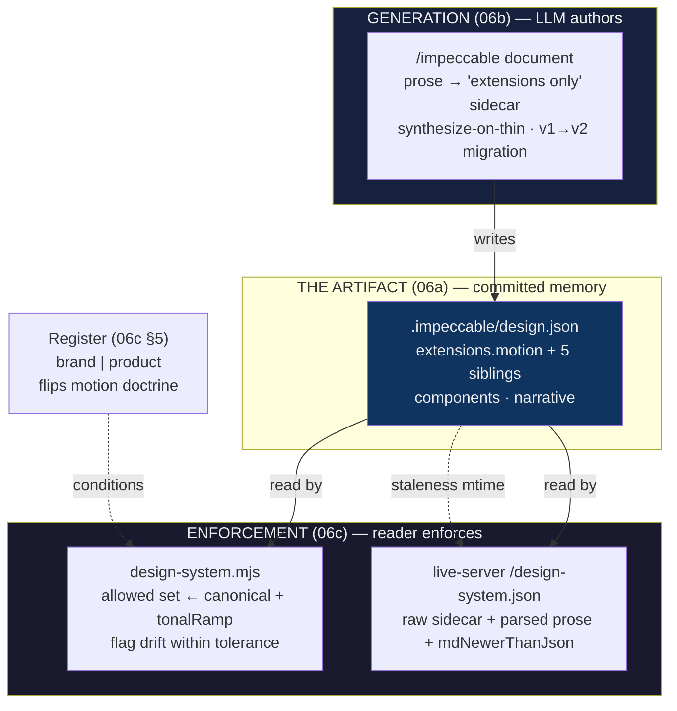
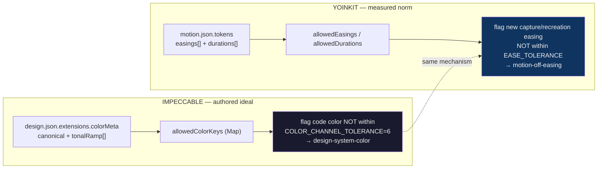

# Impeccable Persisted Design-Memory → a Measured Motion Memory for YoinkIt — Deep Technical Audit

**Subsystem:** Impeccable's **persisted design-memory** — the durable,
git-tracked, `schemaVersion`-stamped `.impeccable/design.json` captured from a
project and committed into its repo. Its `extensions.motion` block (read in the
context of its `colorMeta` / `typographyMeta` / `shadows` / `breakpoints` /
`roundedMeta` siblings), the LLM **generation** path that writes it
(`/impeccable document`), the documented **v1→v2 migration** and the
`mdNewerThanJson` staleness signal, the **enforcement reader**
(`cli/engine/design-system.mjs`) that folds it into an allowed set and flags
off-system drift, the live-panel **merge** that returns it beside the parsed
prose, and the one-field **Register** taxonomy that flips its motion doctrine.

**Audience:** the YoinkIt team. YoinkIt captures what a web animation *actually
does* (per-frame computed-style sampling) and emits a **measured spec, not code** —
but it emits it as a **throwaway, gitignored, per-run** artifact
(`*.animation.json`, `yoink-runs/{host}/{date}-{slug}/`) with **no cross-run, per-
site memory**. Impeccable — a *static design* tool — has already built and shipped
the durable, versioned, accumulating, enforceable motion-carrying artifact that
YoinkIt — a *motion* tool — structurally lacks. This report goes to the floor on
that artifact and ends with a concrete, implementable **`motion.json`** proposal:
the *measured* counterpart to Impeccable's *authored* memory.

**Hold the inversion the whole way** (see [`00-EXECUTIVE-SUMMARY.md`](../../00-EXECUTIVE-SUMMARY.md)
and the [06 survey](../../06-UNEXPLORED-TERRITORY.md) lines 180-186): Impeccable's
design memory is **prescriptive and authored** — an LLM writes down the design a
project *should* follow, and the reader enforces code against that authored ideal.
YoinkIt's motion memory must be **measured and observed** — the `__cap` engine
writes down what a site *actually does*, frame by frame, and a linter would check a
new animation against the site's own empirical vocabulary. Same shape (a committed,
versioned, enforced token file), opposite physics (authored ideal vs measured
norm). The thing to **not** copy is the generation path — an LLM inventing tokens.
The new object exists in neither tool today, which is exactly why it is the
strongest angle.

All paths are under `../../source/` unless noted; YoinkIt paths are under the repo
root.

> **Deep dives.** This document is the overview. Four companions go to the floor on
> the parts a fresh agent would rebuild into YoinkIt, re-verifying every line number
> against `source/` (corrections flagged inline and collected below):
>
> - [`06a-the-persisted-artifact.md`](06a-the-persisted-artifact.md): the full
>   `design.json` schema anatomy — the motion block read in the context of its five
>   sibling extension blocks, `components`, and `narrative` — plus the three-file
>   git-tracked `.impeccable/` directory, versioning, and the real-≠-demo-≠-spec
>   schema looseness.
> - [`06b-generation-and-migration.md`](06b-generation-and-migration.md): the
>   LLM-driven generation path (`/impeccable document`, "extensions only",
>   never-silently-overwrite, seed mode), the day-zero synthesis rule, the v1→v2
>   reshaping, what `schemaVersion` actually does at read time (nothing), and where
>   `mdNewerThanJson` really lives (the readers, not `document.md`).
> - [`06c-the-enforcement-reader.md`](06c-the-enforcement-reader.md):
>   `design-system.mjs` traced end to end — allowed-set construction (every
>   `canonical` + every `tonalRamp` stop), **tolerance** drift-flagging
>   (`COLOR_CHANNEL_TOLERANCE`, `RADIUS_TOLERANCE_PX`), value-not-string dedup, the
>   live-server merge, and the Register one-field conditioner.
> - [`06d-a-motion-json-for-yoinkit.md`](06d-a-motion-json-for-yoinkit.md): **the
>   payoff.** A literal, written-out `.yoinkit/motion.json` schema; how a
>   `__cap.dump()` spec folds in field by field; how multiple captures accumulate;
>   the free interop with `extensions.motion`; the motion `narrative` (human Notes);
>   the per-motion `register` tag (on YoinkIt's own `signature`/`importance` terms);
>   and the motion-consistency linter — `design-system.mjs` with its truth-source
>   inverted.
>
> **First-draft corrections (re-verified against `source/`).** The [06 survey](../../06-UNEXPLORED-TERRITORY.md)
> §"Territory 1" was directionally right and its load-bearing quotes (the
> `motion` block, the register doctrines) are accurate to the line. The stale or
> imprecise specifics, each fixed in a sub-dive:
>
> - **`.impeccable/` is a three-file directory, not one sidecar.** `git ls-files
>   .impeccable/` returns `config.json`, `design.json`, **and** `live/config.json`
>   — a multi-concern committed store, not a lone artifact. (06a §1)
> - **`mdNewerThanJson` is a reader-side mtime heuristic, not a `document.md` /
>   generation field.** The survey files it under generation/migration. It does not
>   exist in `document.md`; it is computed by comparing mtimes in
>   `design-system.mjs:386` and `live-server.mjs:574`, consumed by `hook-lib.mjs:1237`,
>   and rendered by `live-browser.js:10474`. `document.md:244` references only the
>   downstream "stale-hint". (06b §4, 06c §4)
> - **No reader branches on `schemaVersion`.** The survey says "readers branch on
>   `schemaVersion`." `design-system.mjs` has zero references to it; `live-server.mjs:545`
>   mentions it only in a comment. A v1 file is not migrated at read time — it
>   silently reads as **empty**. Durability comes from *regeneration*, not version
>   dispatch. (06b §3)
> - **`motion[].duration` is demo-only.** The survey's "lived schema is `{name,
>   value, duration?, purpose}`" is accurate only as a *union*. `duration` appears in
>   exactly one of three instances — the worked-example demo
>   (`DESIGN.json:155-168`). The real committed artifact (`design.json:226-232`) and
>   the `document.md` schema (`:264-266`) both ship `{name, value, purpose}` with no
>   duration; the curve is tokenised, the duration lives inline in component CSS. (06a §3d, §6; 06b §2)
> - **Synthesize-on-thin does not name motion.** The survey generalises "synthesise
>   a plausible default token (`document.md:313`)" onto motion. `:313` is about
>   component primitives, `:317` about tonal ramps; no directive synthesizes motion.
>   The only motion default is the `ease-standard` example at `:265`. A *measured*
>   memory must never synthesize motion — the catch. (06b §2, 06d §9)
> - **The three "same-schema" instances disagree.** colorMeta `description` and
>   `roundedMeta` are present in the real artifact but **absent** from the demo;
>   `shadows` is 4 tokens in the real artifact and empty `[]` in the demo. The schema
>   is a bag of optional blocks validated by tolerance, not a strict contract. (06a §3a, §6)
> - **The `Register` field is the third-priority signal, not an override.** Per
>   `source/CLAUDE.md`, Setup selects on **task cue → surface in focus → the
>   `register` field** (first match wins). The demo's value is `brand`
>   (`PRODUCT.md:5`, heading `:3`). The motion bullets are `product.md:40-42`
>   (durations `150–250 ms`, en-dash) and `brand.md:88` + `:105`; the survey's
>   `:38-42`/`:86-88` are heading-inclusive spans. (06c §5)

---

## File map

Click-through index (relative to `source/` unless marked **YoinkIt**). Line counts
re-verified this session.

| File | Lines | Role |
|---|---|---|
| **The committed `.impeccable/` directory** | | |
| [`.impeccable/design.json`](../../source/.impeccable/design.json) | 419 | **The design memory.** `schemaVersion 2`, `extensions` (6 token blocks incl. `motion`), `components`, `narrative`. (06a) |
| [`.impeccable/config.json`](../../source/.impeccable/config.json) | 84 | The detector/hook ignore model — not design memory. ([`05c`](../05-hook-system/05c-config-and-ignore-model.md)) |
| [`.impeccable/live/config.json`](../../source/.impeccable/live/config.json) | 6 | Live-mode injection config. (06a §1) |
| **Generation + migration** | | |
| [`skill/reference/document.md`](../../source/skill/reference/document.md) | 429 | `/impeccable document`: LLM writes prose then "extensions only" sidecar; synthesize-on-thin; v1→v2 migration note. (06b) |
| **Consumption + enforcement** | | |
| [`cli/engine/design-system.mjs`](../../source/cli/engine/design-system.mjs) | 750 | **The enforcement reader.** Folds memory → allowed set; flags `design-system-color/-font/-radius` drift within tolerance. (06c) |
| [`skill/scripts/live-server.mjs`](../../source/skill/scripts/live-server.mjs) | 1134 | `/design-system.json` (`:537-596`): merges raw sidecar + parsed `DESIGN.md` + `mdNewerThanJson`. (06c §4) |
| **The register conditioner** | | |
| [`skill/reference/brand.md`](../../source/skill/reference/brand.md) | 108 | Brand motion doctrine: ambitious page-load choreography (`:86,88,105`). (06c §5) |
| [`skill/reference/product.md`](../../source/skill/reference/product.md) | 60 | Product motion doctrine: `150–250 ms`, state-not-decoration, no page-load (`:38,40-42`). (06c §5) |
| **The worked example** | | |
| [`demos/landing-demo/DESIGN.json`](../../source/demos/landing-demo/DESIGN.json) | 281 | Demo sidecar; the `{name,value,duration?,purpose}` motion shape + reserved `ease-card` (`:155-168`). (06a §6) |
| [`demos/landing-demo/DESIGN.md`](../../source/demos/landing-demo/DESIGN.md) | 207 | Demo prose the `narrative` is pulled from. (06a §5, 06b §1) |
| [`demos/landing-demo/PRODUCT.md`](../../source/demos/landing-demo/PRODUCT.md) | 39 | The bare `## Register` value (`brand`, `:5`). (06c §5) |
| **YoinkIt (the measured side)** | | |
| [`extension/capture-animation.js`](../../../../extension/capture-animation.js) **YoinkIt** | 1530 | The `__cap` engine; the `dump()` spec `{meta, evidence, summary, stagger, findings[]}` (`:1344-1368`). (06d §2) |
| [`CONTEXT.md`](../../../../CONTEXT.md) **YoinkIt** | 261 | Domain language: Signature, Confidence, Trigger, Note, Region, Pass. (06d §1) |
| [`docs/CONTRACT.md`](../../../../docs/CONTRACT.md) **YoinkIt** | 1215 | Run contract; `page-model.json` schema; the abstract `06-spec/spec.json`. (06d §1) |
| [`docs/ARCHITECTURE.md`](../../../../docs/ARCHITECTURE.md) **YoinkIt** | 410 | Pipeline + "measured not authored" + the real-browser constraint. (06d §1, §9) |

---

## 1. Orientation: a memory, three disciplines, one conditioner

Impeccable's design memory is one committed file backed by three disciplines and
conditioned by one field:

- **The artifact** ([`06a`](06a-the-persisted-artifact.md)) — `.impeccable/design.json`,
  `schemaVersion: 2`, a bag of optional token-metadata blocks (`extensions.colorMeta`
  … `extensions.motion`), self-contained `components`, and a `narrative` of human
  intent. Committed to git, alongside `config.json` and `live/config.json`.
- **Generation** ([`06b`](06b-generation-and-migration.md)) — `/impeccable document`
  has an **LLM write** the memory: `DESIGN.md` prose, then the sidecar as "extensions
  only", with day-zero synthesis, never-silently-overwrite, seed mode, and a
  documented v1→v2 reshaping.
- **Enforcement** ([`06c`](06c-the-enforcement-reader.md)) — `design-system.mjs`
  folds the memory into an allowed set (every `canonical` + every `tonalRamp` stop)
  and flags any color/font/radius in code that drifts off it **within a tolerance**;
  the live server merges it with the parsed prose for the panel.
- **The conditioner** ([`06c`](06c-the-enforcement-reader.md) §5) — a single
  `Register` value (`brand` | `product`) flips the downstream motion doctrine, so
  the same measured 1200ms reveal reads as "the point" (brand) or "a bug" (product).



The whole loop is **authored**: a model writes the tokens, the reader enforces code
against them, a staleness signal tells the model when to re-author. YoinkIt's
inversion keeps the loop and replaces the core — the tokens come from measurement,
and "off-system" means "unlike what the site actually does."

---

## 2. The motion block, in the context that makes it legible

The survey's stop-you-in-your-tracks quote is the entire `extensions.motion` of
Impeccable's own design system ([`design.json:226-232`](../../source/.impeccable/design.json)):

```json
"motion": [
  {
    "name": "ks-ease",
    "value": "cubic-bezier(0.2, 0.8, 0.2, 1)",
    "purpose": "Default kit easing for color, border, and transform transitions."
  }
]
```

Read in isolation this looks like a motion schema. Read in context
([`06a`](06a-the-persisted-artifact.md) §3) it is **one `{name, value, purpose}`
row** in a token-metadata family — identical in shape to `shadows`, one of six
sibling blocks — carrying a *single easing curve* and **no duration**. The duration
of Impeccable's actual hover transitions (180ms) lives inline in `components[].css`
(`:285`), not in the motion token. So the authored artifact tokenises the *curve*
(reusable) and leaves the *duration* uncaptured.

That asymmetry is the report's hinge. A **measured** memory has the opposite
pressure: YoinkIt measures duration cleanly first and most often *cannot* read
easing (rAF/JS-driven motion yields `easing: "unknown (rAF/JS) — verify"`,
[`capture-animation.js:666-667`](../../../../extension/capture-animation.js)). So
YoinkIt's `motion.json` inverts the emphasis — duration and per-layer timeline are
first-class measured fields, easing carries a confidence marker — while keeping the
`{name, value, purpose}` row as the interop seam back to Impeccable
([`06d`](06d-a-motion-json-for-yoinkit.md) §4-5).

---

## 3. The mechanism worth stealing: memory as a tolerance-gated linter

`design-system.mjs` is the proof that "memory is an enforcement contract, not
passive docs" ([`06c`](06c-the-enforcement-reader.md)). It reads the sidecar's
`colorMeta` — **every** `canonical` and **every** `tonalRamp` stop — into an
allowed-color set ([`design-system.mjs:260-273`](../../source/cli/engine/design-system.mjs)),
and flags any color in code that is not **within `COLOR_CHANNEL_TOLERANCE = 6`
channels** of an allowed color ([`:396-408`](../../source/cli/engine/design-system.mjs)),
emitting a `design-system-color` finding the hook surfaces on every edit. Radii get
the same treatment within `RADIUS_TOLERANCE_PX = 0.5`. Colors compare **as parsed
values, not strings**, on both the allow side and the dedup side
([`:681-702`](../../source/cli/engine/design-system.mjs)).



YoinkIt's `motion.json` linter ([`06d`](06d-a-motion-json-for-yoinkit.md) §7) is
this file with the **truth-source inverted**: read the site's measured easing /
duration vocabulary into an allowed set, flag a new capture or a recreation whose
motion drifts off it within an easing/duration tolerance, weighted by `confidence`
and `register`. The data structure is identical; "off-system" flips from "unlike the
authored ideal" to "unlike what the site empirically does." That single inversion is
the whole product idea: **a capture tool that also lints motion consistency.**

---

## 4. The payoff in one screen: `__cap.dump()` → `.yoinkit/motion.json`

[`06d`](06d-a-motion-json-for-yoinkit.md) writes the schema out in full; the
correspondence at a glance:

| Impeccable `design.json` (authored) | YoinkIt `motion.json` (measured) | Inversion |
|---|---|---|
| `schemaVersion` / `generatedAt` / `title` | same | **ADOPT** the frame verbatim |
| `extensions.motion[] = {name,value,purpose}` | `tokens.easings[]/durations[] = {name,value,purpose, confidence, observedIn}` | extend the interop row with measured fields |
| LLM authors tokens (`/impeccable document`) | the **fold**: a pure fn of `__cap.dump()` | **drop** authoring; no value is invented |
| `narrative` (LLM intent prose) | `narrative` from human **Notes** (`CONTEXT.md:248`) | same slot, opposite origin |
| `Register` brand/product (whole-site, authored) | `register` signature/incidental (per-motion, from `importance`) | YoinkIt's native axis |
| `design-system.mjs` flags off-**authored**-ideal | motion linter flags off-**measured**-norm | same mechanism, truth-source inverted |
| day-zero **synthesize** a default token | **never** — coverage shows thinness | the catch |
| `mdNewerThanJson` (memory lags source) | `sourceChangedSinceCapture` (re-capture, can't re-author) | reader heuristic, reframed |

A `motion.json` token is a valid `extensions.motion` row, so a YoinkIt capture can
**seed an Impeccable motion block with measured tokens** — the one thing
Impeccable's generation path cannot produce. The reverse imports as `confidence:
"unknown"`. That asymmetry is the inversion enforced in a single field
([`06d`](06d-a-motion-json-for-yoinkit.md) §5).

---

## 5. Patterns for YoinkIt

Ranked by leverage for building the measured motion memory. Each is expanded in the
named sub-dive, with tags matching the survey's scheme (**ADOPT** a pattern/schema,
**EXPLORE** worth prototyping, **INSPIRATION** a stance).

1. **The durable artifact — ADOPT.** A committed, `schemaVersion`/`generatedAt`-
   stamped `.yoinkit/motion.json` (`tokens` + `motions` by Region + `narrative` +
   `coverage`) replacing N throwaway gitignored `*.animation.json`. The single
   highest-value move; it is the *object* YoinkIt lacks.
   *([`06a`](06a-the-persisted-artifact.md), [`06d`](06d-a-motion-json-for-yoinkit.md) §3)*

2. **The fold (`__cap.dump()` → memory) — ADOPT.** A pure function from a capture
   spec + existing memory to a new memory. No authoring step exists in it; that is
   what keeps the object measured. *([`06d`](06d-a-motion-json-for-yoinkit.md) §4)*

3. **The motion-consistency linter — ADOPT (truth-source inverted).** `design-system.mjs`'s
   allowed-set + tolerance-flag mechanism, reading the site's measured easing/duration
   vocabulary and flagging new motion off it (`motion-off-easing/-duration`), weighted
   by confidence and register. *([`06c`](06c-the-enforcement-reader.md) §2-3, [`06d`](06d-a-motion-json-for-yoinkit.md) §7)*

4. **The `{name,value,purpose}` interop seam — ADOPT.** Measured tokens that are
   valid `extensions.motion` rows, so a YoinkIt capture can seed an Impeccable motion
   block (one direction; reverse imports as `confidence: unknown`).
   *([`06a`](06a-the-persisted-artifact.md) §3d, [`06d`](06d-a-motion-json-for-yoinkit.md) §5)*

5. **The lifecycle disciplines — ADOPT.** Stamp versions, never silently overwrite,
   ship a thin memory that commits to enrichment (seed mode), track staleness as a
   reader-side mtime/hash heuristic. All inversion-safe.
   *([`06b`](06b-generation-and-migration.md) §1-2, §4)*

6. **The motion `narrative` — EXPLORE.** Pair measured tokens with human-intent prose
   from Notes (not an LLM), so the memory says what is load-bearing.
   *([`06a`](06a-the-persisted-artifact.md) §5, [`06d`](06d-a-motion-json-for-yoinkit.md) §5)*

7. **The per-motion `register` tag — EXPLORE.** `signature`/`incidental` (preserve vs
   normalise), mapped from YoinkIt's `importance` enum, with an optional coarse
   brand/product `siteRegister` fallback. *([`06c`](06c-the-enforcement-reader.md) §5, [`06d`](06d-a-motion-json-for-yoinkit.md) §6)*

8. **The motion panel + URL lab — EXPLORE (Territory 3 seam).** The live-merge
   contract gives a panel that renders captured timelines beside human Notes.
   *([`06c`](06c-the-enforcement-reader.md) §4, [`06d`](06d-a-motion-json-for-yoinkit.md) §8)*

9. **Confidence as the spine; coverage shows thinness; never synthesize —
   INSPIRATION.** The disciplines that keep an accumulating measured memory from
   decaying into an authored one. The catch, made structural.
   *([`06b`](06b-generation-and-migration.md) §2, [`06d`](06d-a-motion-json-for-yoinkit.md) §9)*

---

## Appendix: surprises / risks / drift

- **`.impeccable/` is three tracked files.** `git ls-files` returns `config.json`,
  `design.json`, `live/config.json` — a multi-concern committed store. The survey's
  one-file framing undersells the directory. (06a §1)
- **A v1 `design.json` reads as empty, not migrated.** No reader branches on
  `schemaVersion` ([`design-system.mjs`](../../source/cli/engine/design-system.mjs)
  has none; [`live-server.mjs:545`](../../source/skill/scripts/live-server.mjs) only a
  comment). The "migratable schema" is migratable by **regeneration**, which YoinkIt
  cannot do (it must re-measure) — so a YoinkIt reader must fail *visible*, not
  *silent-empty*. (06b §3)
- **`mdNewerThanJson` lives in two readers with no shared helper.** Computed
  identically at [`design-system.mjs:386`](../../source/cli/engine/design-system.mjs)
  and [`live-server.mjs:574`](../../source/skill/scripts/live-server.mjs) — the
  hand-sync hazard [`05c`](../05-hook-system/05c-config-and-ignore-model.md) §5 warns
  about, here in the design-memory slice. (06b §4, 06c §4)
- **The schema is loose: real ≠ demo ≠ spec.** The real artifact, the worked-example
  demo, and the `document.md` schema disagree on `description`, `roundedMeta`,
  `shadows` emptiness, and `motion[].duration`. The reader tolerates it (every block
  guarded by `typeof`), which is a feature to copy and a precision trap for anyone
  citing "the schema." (06a §6)
- **Fonts are enforced from the prose frontmatter, colors/radii from the sidecar.**
  The allowed-font axis reads `frontmatter.typography`
  ([`design-system.mjs:275`](../../source/cli/engine/design-system.mjs)), not
  `typographyMeta`. Enforcement reads **both halves** of the memory, which is why the
  panel must merge them. (06c §2)
- **The motion token is curve-only; the duration is uncaptured.** `ks-ease` is a
  curve referenced at 180ms in component CSS (`design.json:285`); the token has no
  duration. The authored artifact's blind spot (uncaptured timing) is exactly the
  measured memory's strength. (06a §3d)
- **The `Register` field is a fallback, not a switch.** Task cue → surface → field,
  first match wins (`source/CLAUDE.md`). The "one-field conditioner" holds only when
  the first two are absent or agree. (06c §5)
- **The richest motion vocabulary YoinkIt ever wrote is archived.** The concrete
  `animations.json` field set (`tokens`, `patterns`, `lead{from,to,duration,ease,
  easeBezier}`, `confidence`, `timelineRef`) lives in
  `docs/archive/legacy-capture-pipeline/SPEC.md:143-181`, demoted by `CLAUDE.md` to
  historical. The `motion.json` proposal re-grounds it on the *current* `__cap.dump()`
  output and the place-first page model. (06d §1, §3)
