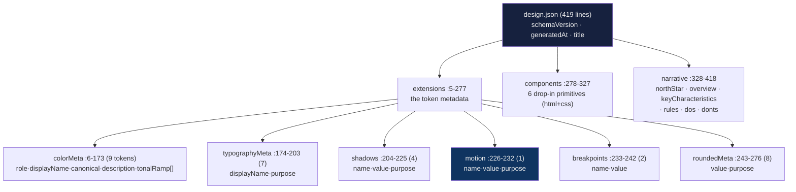

# Design-memory deep dive 06a — the persisted artifact: `design.json` anatomy, the `.impeccable/` directory, and versioning

Companion to [`06-design-memory.md`](06-design-memory.md). That report is the
overview. This one goes to the floor on the **thing itself**: the full schema of
`.impeccable/design.json`, the `motion` block read in the context of its
siblings, the whole committed `.impeccable/` directory, and how the artifact is
versioned. It is the file a fresh agent must know cold before proposing
YoinkIt's measured counterpart in [`06d`](06d-a-motion-json-for-yoinkit.md).

Sibling slices, so this one stays in its lane:
- how the artifact is *written* and *reshaped* over time (the LLM generation
  path, synthesize-on-thin, the v1→v2 migration, the staleness signal) →
  [`06b-generation-and-migration.md`](06b-generation-and-migration.md)
- how the artifact is *read back and enforced* (the allowed-set reader, the
  drift flags, the live-panel merge, the register conditioner) →
  [`06c-the-enforcement-reader.md`](06c-the-enforcement-reader.md)
- the YoinkIt payoff: a concrete measured `motion.json` →
  [`06d-a-motion-json-for-yoinkit.md`](06d-a-motion-json-for-yoinkit.md)

All `file:line` references are into `../../source/` unless the path says
otherwise; YoinkIt paths are under the repo root. Line numbers were re-verified
against `source/` on read this session, and where the [06 survey](../../06-UNEXPLORED-TERRITORY.md)
was loose the correction is called out inline.

Hold the inversion the whole way: this artifact is **prescriptive and authored**
— an LLM wrote down the design a project *should* follow. YoinkIt's analog is
**measured and observed**. 06a is the closest read of the authored object; what
to keep and what to drop is [`06d`](06d-a-motion-json-for-yoinkit.md)'s job.

---

## 1. The committed `.impeccable/` directory (three tracked files, not one)

The survey says the design system "is git-tracked (`git ls-files .impeccable/`
returns it)". True, but underspecified: `git ls-files` returns **three** files,
not one. Verified this session:

```
$ git -C source ls-files .impeccable/
.impeccable/config.json
.impeccable/design.json
.impeccable/live/config.json
```

So the durable, committed surface of Impeccable's per-project memory is a small
directory, not a single sidecar:

| File | Lines | Role | Owner |
|---|---|---|---|
| [`.impeccable/design.json`](../../source/.impeccable/design.json) | 419 | **The design memory.** `schemaVersion`, `generatedAt`, `title`, `extensions`, `components`, `narrative`. This slice. | `/impeccable document` (06b) |
| [`.impeccable/config.json`](../../source/.impeccable/config.json) | 84 | The detector/hook **ignore model** (`detector` + `hook` keys). Not design memory; the audited-suppression store. | hook + `/impeccable hooks` ([`05c`](../05-hook-system/05c-config-and-ignore-model.md)) |
| [`.impeccable/live/config.json`](../../source/.impeccable/live/config.json) | 6 | Live-mode **injection config**: where to inject the overlay. | live mode (report [`03`](../03-live-mode/03-live-mode.md)) |

The two non-design files matter to this report only as context for "what a
committed `.impeccable/` directory looks like in practice." `config.json` is the
ignore/suppression model report [`05c`](../05-hook-system/05c-config-and-ignore-model.md)
already traced to the floor; it carries a *per-developer* companion
`config.local.json` that is gitignored via `.git/info/exclude` and is therefore
**not** in `ls-files`. `live/config.json` is tiny and worth quoting in full
because it shows the directory is a genuine multi-concern project store, not a
single artifact:

```json
{
  "files": ["site/layouts/Base.astro"],
  "insertBefore": "</body>",
  "commentSyntax": "html",
  "cspChecked": true
}
```
([`.impeccable/live/config.json:1-6`](../../source/.impeccable/live/config.json))

**The lesson for YoinkIt (a directory, not a file).** When YoinkIt grows a
durable store, the natural home is a committed `.yoinkit/` directory that can
hold more than one concern — a `motion.json` memory ([`06d`](06d-a-motion-json-for-yoinkit.md)),
a team-shared `config.json` (the two-tier config [`05c`](../05-hook-system/05c-config-and-ignore-model.md)
already proposed), and whatever live/capture-driver config follows — with
per-developer files kept out of git the same way. The committed/gitignored split
is already designed; 06a only adds that the *design memory itself* is one tracked
file among several in that directory.

---

## 2. `design.json` top-level shape

The real artifact is the Impeccable repo's own design system, titled "Design
System: Impeccable". Top of file, verbatim ([`.impeccable/design.json:1-5`](../../source/.impeccable/design.json)):

```json
{
  "schemaVersion": 2,
  "generatedAt": "2026-06-15T23:30:35.569Z",
  "title": "Design System: Impeccable",
  "extensions": {
```

Six top-level keys, in file order. The survey's list
("`schemaVersion`, `generatedAt` (ISO-8601), `title`, then three big keys:
`extensions`, `components`, `narrative`") is complete and correct; the precise
ranges:

| Key | Lines | Type | Note |
|---|---|---|---|
| `schemaVersion` | `:2` | integer `2` | a number, not `"2"`. No reader branches on it (06b §3). |
| `generatedAt` | `:3` | ISO-8601 string | write-time stamp; the freshness baseline `mdNewerThanJson` compares against (06b §4). |
| `title` | `:4` | string | `"Design System: Impeccable"`. |
| `extensions` | `:5-277` | object | the token metadata the prose frontmatter can't hold. §3. |
| `components` | `:278-327` | array | self-contained drop-in primitives. §4. |
| `narrative` | `:328-418` | object | the human-intent layer inside the machine file. §5. |

There is **no top-level `name`** key — the project name lives in the paired
`DESIGN.md` frontmatter, not the sidecar. The sidecar is deliberately "extensions
only" (06b §1): everything in it is metadata that the Markdown frontmatter's
fixed token schema cannot carry.



---

## 3. `extensions` — six token-metadata sub-blocks, motion among them

`extensions` (`:5-277`) is a container of six keyed sub-blocks. The motion block
is the third-smallest and sits *between* `shadows` and `breakpoints`. Reading it
in isolation (as the survey's verbatim quote invites) hides that it is one row in
a token-metadata family that all share the same `{name, value, purpose}` spine.

### 3a. `colorMeta` (`:6-173`) — the richest token shape

Nine tokens, each keyed by token name. Shape: `{ role, displayName, canonical,
description, tonalRamp[] }`. One token verbatim ([`.impeccable/design.json:7-26`](../../source/.impeccable/design.json)):

```json
"kinpaku-gold": {
  "role": "primary",
  "displayName": "Kinpaku Gold",
  "canonical": "oklch(84% 0.19 80.46)",
  "description": "Primary accent. CTAs, wordmark, active state, live picker borders, key rules.",
  "tonalRamp": [
    "oklch(22% 0.04 78)", "oklch(34% 0.06 78)", "oklch(48% 0.08 78)",
    "oklch(61% 0.085 78)", "oklch(72% 0.105 82)", "oklch(78% 0.12 82)",
    "oklch(84% 0.075 84)", "oklch(89% 0.055 84)", "oklch(95% 0.04 84)",
    "oklch(98% 0.04 84)", "oklch(94% 0.07 82)", "oklch(98% 0.035 84)"
  ]
}
```

Four facts that matter downstream:

- **`role`** is an open string taxonomy: across the nine tokens it takes
  `primary`, `secondary`, `neutral` (×3), `data-viz`, `utility`, and `state`
  (×2) (`:8,28,43,59,92,116,136,147,160`). Role is descriptive metadata, not an
  enum the reader enforces.
- **`canonical`** is normally OKLCH (`:10`) but is allowed to be hex when the
  source is a literal hex palette — `terminal-chrome.canonical` is `"#ff5f56"`
  (`:138`). The reader parses both (06c §2).
- **`description`** is a one-line prose statement of *where the token is used*
  (`:11`). **This is present on every colorMeta token in the real artifact.**
  (Correction: the survey's sibling worked-example demo,
  `demos/landing-demo/DESIGN.json`, has **no** `description` on its colorMeta
  tokens — §6. The field is real, but the two artifacts disagree on it, which is
  itself a finding about schema looseness.)
- **`tonalRamp`** is a **variable-length** OKLCH array, dark→light, synthesised
  when the source page has no scale (06b §2). The lengths in this one file range
  from **3 stops** (`terminal-chrome`, `:140-144`) to **25 stops**
  (`neutral-text`, `:63-88`). It is not a fixed N-step ramp; the reader iterates
  whatever length it finds (06c §2). The survey's "dark to light, synthesised in
  OKLCH" is correct; "variable-length" is the load-bearing word, and the 3↔25
  spread proves it.

### 3b. `typographyMeta` (`:174-203`) — `{displayName, purpose}`

Seven tokens (`wordmark`, `display`, `headline`, `title`, `body`, `eyebrow`,
`mono`), each `{ displayName, purpose }`. Verbatim ([`.impeccable/design.json:179-182`](../../source/.impeccable/design.json)):

```json
"display": {
  "displayName": "Display",
  "purpose": "Hero h1. Alumni Sans Pinstripe, weight 300."
}
```

Note what is **not** here: the font family names themselves. Those live in the
`DESIGN.md` frontmatter (`typography:` block); `typographyMeta` is purely the
display-name + purpose annotation. The enforcement reader pulls **allowed fonts
from the frontmatter, not from this sidecar block** (06c §2) — a separation the
survey did not call out.

### 3c. `shadows` (`:204-225`) — `{name, value, purpose}`

Four tokens. This is the exact `{name, value, purpose}` shape the `motion` block
uses. One verbatim ([`.impeccable/design.json:205-209`](../../source/.impeccable/design.json)):

```json
{
  "name": "Panel Setback",
  "value": "0 24px 70px oklch(2% 0.004 95 / 0.42)",
  "purpose": "Large framed modules only."
}
```

### 3d. `motion` (`:226-232`) — the block this report exists for

The whole block, verbatim ([`.impeccable/design.json:226-232`](../../source/.impeccable/design.json)):

```json
"motion": [
  {
    "name": "ks-ease",
    "value": "cubic-bezier(0.2, 0.8, 0.2, 1)",
    "purpose": "Default kit easing for color, border, and transform transitions."
  }
]
```

The survey quotes this exactly and it is correct to the line. What the isolated
quote hides:

- **One token.** The entire motion vocabulary of Impeccable's own design system
  is a *single* easing curve. It is a `{name, value, purpose}` row identical in
  shape to `shadows` (§3c). There is **no `duration`** field on it.
- **`value` is the curve; duration lives in the component CSS, not the token.**
  The `ks-ease` bezier `cubic-bezier(0.2, 0.8, 0.2, 1)` (`:229`) is referenced
  verbatim inside the `components` CSS — e.g. Primary Button's
  `transition: transform 180ms cubic-bezier(0.2, 0.8, 0.2, 1)` (`:285`). So the
  *curve* is tokenised once and reused; the *180ms duration* is written inline at
  each call site and is **not** captured in the motion token. This is the sharpest
  structural fact for YoinkIt: in the authored artifact, easing is a reusable
  token and duration is not. A *measured* memory has the opposite pressure —
  duration is the first thing YoinkIt measures cleanly and easing is the thing it
  most often cannot read (06d §3).
- **It is prescriptive.** "Default kit easing" is a *rule the project should
  follow*, authored by the LLM that ran `/impeccable document` (06b). It is not a
  measurement of anything.

### 3e. `breakpoints` (`:233-242`) and `roundedMeta` (`:243-276`)

`breakpoints` is two `{name, value}` tokens (`md: 980px`, `lg: 1080px`). The
survey lists `roundedMeta` as a sibling and it is real here: `:243-276`, eight
tokens keyed by name, each `{ value, purpose }`:

```json
"roundedMeta": {
  "code": { "value": "3px", "purpose": "Inline code, terminal chips, tiny badges." },
  ...
  "pill": { "value": "999px", "purpose": "Tags, toggles, and circular controls." }
}
```
([`.impeccable/design.json:243-276`](../../source/.impeccable/design.json))

`roundedMeta` is read by the enforcement reader into the allowed-radius set
(06c §2). (Correction: the worked-example demo has **no** `roundedMeta` block —
§6 — another real-vs-demo divergence.)

**The shape census, all six sub-blocks at once:**

| Sub-block | Keyed by | Per-token shape | Count here |
|---|---|---|---|
| `colorMeta` | token name | `{role, displayName, canonical, description, tonalRamp[]}` | 9 |
| `typographyMeta` | token name | `{displayName, purpose}` | 7 |
| `shadows` | array | `{name, value, purpose}` | 4 |
| `motion` | array | `{name, value, purpose}` | 1 |
| `breakpoints` | array | `{name, value}` | 2 |
| `roundedMeta` | token name | `{value, purpose}` | 8 |

Two are keyed objects, four are arrays. `motion`, `shadows`, and `breakpoints`
are arrays of `{name, value, ...}`; `colorMeta`, `typographyMeta`, and
`roundedMeta` are name-keyed maps. The motion block sits on the array side, which
is why an Impeccable motion token "drops straight into an `extensions.motion`
array" (06d §4) — it is just one more `{name, value, purpose}` row.

---

## 4. `components` (`:278-327`) — drop-in primitives, html + css

Six entries (`Primary Button`, `Secondary Button`, `Text Input`,
`Site Navigation`, `Bento Tile`, `Live Picker Bar`). The survey says "5-10
representative primitives, each with a self-contained drop-in `html` + `css`"; the
real count is **6** and the shape is `{ name, kind, refersTo, description, html,
css }`. One verbatim ([`.impeccable/design.json:279-286`](../../source/.impeccable/design.json)):

```json
{
  "name": "Primary Button",
  "kind": "button",
  "refersTo": "button-primary",
  "description": "Filled kinpaku CTA on lacquer. Both .ks-button and .ks-button-primary required.",
  "html": "<button type=\"button\" class=\"ds-btn-primary\">Get started</button>",
  "css": ".ds-btn-primary { ... transition: transform 180ms cubic-bezier(0.2, 0.8, 0.2, 1), background-color 180ms cubic-bezier(0.2, 0.8, 0.2, 1), border-color 180ms cubic-bezier(0.2, 0.8, 0.2, 1); } .ds-btn-primary:hover { ... transform: translateY(-1px); } ..."
}
```

`refersTo` keys the component back to a frontmatter component id; `kind` is a
loose category (`button`, `input`, `nav`, `card`, `custom`). The point for this
report: **the components carry the only concrete motion the artifact has** — the
180ms `ks-ease` transitions inlined in four components' CSS (`:285,293,301,309`),
plus the Live Picker Bar's own `0.15s ease` (`:325`). The `motion` token (§3d)
names the *curve* those four transitions share; the *durations* and the
*properties transitioned* live here, in prose-free CSS strings. If you
wanted to reconstruct Impeccable's actual motion behaviour from this file you
would read the `components[].css`, not the one-row `motion` block. That asymmetry
is the authored artifact's blind spot and exactly the gap a *measured* memory
fills.

---

## 5. `narrative` (`:328-418`) — human intent inside the machine file

The survey's headline finding for this block is right and worth holding: the
`narrative` key is "the human-intent layer **inside** the machine file." Sub-keys,
in order:

| Sub-key | Lines | Shape |
|---|---|---|
| `northStar` | `:329` | string — `"Neo Kinpaku"` |
| `overview` | `:330` | string — 2–3 sentences of philosophy |
| `keyCharacteristics` | `:331-338` | string[] (6 here) |
| `rules` | `:339-395` | `{name, section, body}[]` (11 here) |
| `dos` | `:396-405` | string[] (8 here) |
| `donts` | `:406-417` | string[] (10 here) |

One `rules[]` entry verbatim ([`.impeccable/design.json:340-344`](../../source/.impeccable/design.json)):

```json
{
  "name": "The Gold Carries Brand Rule",
  "section": "colors",
  "body": "Kinpaku gold is the primary brand signal. If a single accent must represent Impeccable, use gold, not magenta or cyan."
}
```

The `section` discriminator (`colors`, `typography`, `elevation`, `components`)
is a machine-only field added on top of the prose: the rule's *text* is lifted
verbatim from `DESIGN.md`, and the JSON adds the structured tag (06b §1 traces
the prose→JSON mapping). `dos`/`donts` are flat prose arrays (`:397`: "Do use
kinpaku gold as the primary brand color."; `:407`: "Do not use editorial magenta
as a brand accent.").

**Why this matters to 06d.** The narrative block is the proof that Impeccable
ships *machine tokens and human intent in one versioned file* — the `value` rows
say *what*, the `rules`/`northStar` say *why* and *what is load-bearing*. A raw
frame timeline (YoinkIt's measured output) has the same gap a raw token list has:
it says what moved, not why or what is the point. The motion `narrative` proposal
in [`06d`](06d-a-motion-json-for-yoinkit.md) §5 is a direct lift of this
structure, with the inversion that YoinkIt's prose comes from a human *Note*
(CONTEXT.md's own term) over measured motion, not from an LLM authoring intent.

---

## 6. The artifact is loosely versioned: real ≠ demo ≠ spec

A schema is only as durable as its instances agree. Three instances of "the same"
design-memory schema exist in the repo, and they **disagree** in ways the survey
flattened. Pinning the disagreement is necessary so 06d doesn't inherit a wrong
schema:

| Field | `.impeccable/design.json` (real) | `demos/landing-demo/DESIGN.json` (worked example) | `document.md` schema (the spec) |
|---|---|---|---|
| `schemaVersion` | `2` (`:2`) | `2` (`DESIGN.json:2`) | `2` (`document.md:250`) |
| colorMeta `description` | **present** (`:11`) | **absent** | n/a (frontmatter owns colors) |
| `motion[].duration` | **absent** (`:226-232`) | **present** (`DESIGN.json:155-168`: `150ms`/`300ms`) | **absent** (`document.md:264-266`) |
| `roundedMeta` | **present** (`:243-276`) | **absent** | n/a |
| `shadows` | 4 tokens (`:204-225`) | empty `[]` (`DESIGN.json:154`) | 1 example (`document.md:261-263`) |
| `motion` count | 1 (`ks-ease`) | 2 (`ease-button`, `ease-card` "reserved") | 1 (`ease-standard`) |

Read off this:

- **The "lived motion schema" is `{name, value, purpose}`; `duration` is
  demo-only.** The survey concludes "the lived schema is `{ name, value (bezier or
  keyword), duration?, purpose }`." Accurate **as a union**, but the precise truth
  is sharper: `duration` appears in **exactly one** of the three instances — the
  worked-example demo. The real committed artifact and the canonical `document.md`
  schema both ship motion as `{name, value, purpose}` with no duration. So
  `duration` is the optional, demo-only extension; a YoinkIt schema that wants
  duration as a first-class field is **extending** the lived shape, not adopting
  it (which is correct, because YoinkIt measures duration first — 06d §3).
- **`ease-card` is "currently unused but reserved"** in the demo
  (`DESIGN.json:163-166`): a motion token that exists in the machine sidecar
  *ahead of any code that uses it* — a forward-declared vocabulary entry. The real
  artifact has no such reserved token. This is the prescriptive habit in miniature:
  the authored memory can contain motion the project does not yet exhibit. A
  measured memory cannot (06d §6, the catch).
- **The schema tolerates absent blocks.** Empty `shadows: []`, missing
  `roundedMeta`, missing `description` — none break the reader (06c shows the
  reader guards every block with `typeof ... === 'object'`). The artifact is a
  *bag of optional metadata blocks*, not a strict schema. For YoinkIt this is a
  feature to copy: a measured `motion.json` should render whatever blocks a
  capture filled and stay silent on the rest, not demand a fixed shape.

---

## What this means for YoinkIt

- **ADOPT the artifact's outer frame.** A committed, single-file,
  `schemaVersion`-stamped, `generatedAt`-stamped store with a small number of
  optional top-level blocks is exactly the durable shape YoinkIt lacks today (its
  captures are per-run and gitignored — [`06d`](06d-a-motion-json-for-yoinkit.md)
  §1). Copy `schemaVersion` + `generatedAt` + `title`/`source`, and the
  "bag-of-optional-blocks" tolerance. *Ref: `.impeccable/design.json:1-5`;
  the optional-block tolerance, §6.*
- **ADOPT the `.yoinkit/` directory, not a lone file.** The committed store is a
  *directory* with three concerns (memory, config, live-inject) and a
  gitignored per-developer companion. YoinkIt's `.yoinkit/motion.json` should live
  beside the two-tier `config.json` [`05c`](../05-hook-system/05c-config-and-ignore-model.md)
  already proposed. *Ref: `git ls-files .impeccable/`, §1.*
- **ADOPT the `{name, value, purpose}` motion row as the interop seam — but know
  it is curve-only.** The real motion token is one easing curve with no duration
  (§3d). A YoinkIt token that is *also* a `{name, value, purpose}` row drops into
  an `extensions.motion` array for free (06d §4); YoinkIt then **extends** it with
  the measured fields (duration, per-layer timeline, trigger, confidence) the
  authored shape never had. *Ref: `.impeccable/design.json:226-232`; the union vs
  demo-only `duration`, §6.*
- **ADOPT pairing tokens with a `narrative`.** The `narrative` block (§5) is the
  pattern that keeps an authored artifact from being a context-free token dump.
  YoinkIt's measured tokens want the same companion prose — sourced from human
  *Notes*, not an LLM (06d §5). *Ref: `.impeccable/design.json:328-418`.*
- **INSPIRATION: let blocks be optional and the schema loose.** The real artifact
  validates by tolerance, not by a strict contract (§6). A measured memory should
  do the same: render the blocks a capture filled, stay quiet on the rest, never
  fail because a site had no loops or no scroll motion. *Ref: real≠demo≠spec, §6.*
