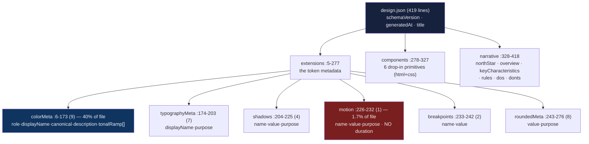
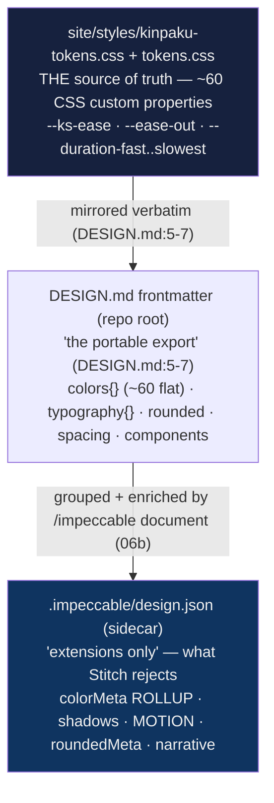

# Design-memory deep dive 06a — the persisted artifact: `design.json` anatomy, the `DESIGN.md` pairing, the `.impeccable/` directory, and versioning

Companion to [`06-design-memory.md`](06-design-memory.md). That report is the
overview. This one goes to the floor on the **thing itself**: what
`.impeccable/design.json` actually is (a *sidecar* to a Stitch-standard
`DESIGN.md`, not a free-standing file), where every value in it comes from, the
full schema of all six `extensions` sub-blocks, the `motion` block read against
the project's *real* motion vocabulary, the whole committed `.impeccable/`
directory, and how the artifact is versioned. It is the file a fresh agent must
know cold before proposing YoinkIt's measured counterpart in
[`06d`](06d-a-motion-json-for-yoinkit.md).

Sibling slices, so this one stays in its lane:
- how the artifact is *written* and *reshaped* over time (the LLM generation
  path, synthesize-on-thin, the v1→v2 migration *mechanism*, the staleness
  signal) → [`06b-generation-and-migration.md`](06b-generation-and-migration.md).
  06a owns the *shape* delta between v1 and v2 (§6); 06b owns the *process* that
  performs it.
- how the artifact is *read back and enforced* (the allowed-set reader, the
  drift flags, the live-panel merge, the register conditioner) →
  [`06c-the-enforcement-reader.md`](06c-the-enforcement-reader.md). 06a cites the
  reader only to prove "the memory is two files" (§1); 06c traces it.
- the YoinkIt payoff: a concrete measured `motion.json` →
  [`06d-a-motion-json-for-yoinkit.md`](06d-a-motion-json-for-yoinkit.md).

All `file:line` references are into `../../source/` unless the path says
otherwise; YoinkIt paths are under the repo root. Line numbers were re-verified
against `source/` on read this session, and where the [06 survey](../../06-UNEXPLORED-TERRITORY.md)
was loose the correction is called out inline.

Hold the inversion the whole way: this artifact is **prescriptive and authored**
— an LLM wrote down the design a project *should* follow. YoinkIt's analog is
**measured and observed**. 06a is the closest read of the authored object; what
to keep and what to drop is [`06d`](06d-a-motion-json-for-yoinkit.md)'s job. The
single fact this report drives toward: **the authored memory keeps the easing
*curve* and throws away the *timing* — and timing is the one thing YoinkIt
measures cleanly** (§3d).

---

## 1. The artifact in context: a *sidecar* to `DESIGN.md`, inside a committed directory

The survey (and the first draft of this slice) treats `.impeccable/design.json`
as the design memory. It is **half** of it. The design memory is a **pair**, and
`design.json` is the junior partner — the bin for everything the senior partner's
format structurally cannot hold.

### 1a. The pair

The real, committed design memory of the Impeccable repo is two files:

| File | Lines | What it is | Owns |
|---|---|---|---|
| [`DESIGN.md`](../../source/DESIGN.md) (repo root) | 497 | **The senior file.** YAML frontmatter (machine tokens) + a six-section Markdown body (prose). Follows the [official Google Stitch `DESIGN.md` format](https://stitch.withgoogle.com/docs/design-md/format/) (`document.md:3`). | the **normative token primitives**: `colors{}` (~60 flat tokens), `typography{}`, `rounded`, `spacing`, `components` |
| [`.impeccable/design.json`](../../source/.impeccable/design.json) | 419 | **The sidecar.** "Extensions only." | everything Stitch's schema rejects: tonal ramps, shadows, **motion**, breakpoints, `roundedMeta`, full component HTML/CSS, narrative |

This is not a casual split. It is forced by the upstream format. Stitch's schema
is a fixed Zod contract, and `document.md` is explicit about what it can and
cannot carry:

> "Stitch's Zod schema only accepts `colors`, `typography`, `rounded`,
> `spacing`, `components`. Anything else belongs in the sidecar's `extensions`."
> ([`document.md:429`](../../source/skill/reference/document.md))

> "Component sub-tokens are limited to 8 props … Shadows, motion, focus rings,
> backdrop-filter: none of those fit. Carry them in the sidecar."
> ([`document.md:47`](../../source/skill/reference/document.md))

So `.impeccable/design.json` is **defined by negation**: it is the set of design
facts that have no home in the Stitch frontmatter. `document.md:242` names the
exiles directly — "tonal ramps per color, shadow/elevation tokens, **motion
tokens**, breakpoints, full component HTML/CSS snippets …, and narrative. It
extends the frontmatter, it doesn't duplicate it."

**This is the deepest single fact in 06a, and it points straight at YoinkIt.**
Impeccable inherited a design-token format (Stitch's `DESIGN.md`) in which
**motion does not exist as a first-class concept**. There is no `motion:`
frontmatter group; motion is exiled into a free-form `extensions` bag alongside
shadows and breakpoints. A tool whose entire domain *is* motion (YoinkIt) cannot
inherit that format — it has to build one where motion is the spine, not the
appendix. The thinness of `extensions.motion` (one token, §3d) is not Impeccable
being lazy; it is what motion looks like when it is a guest in someone else's
schema.

### 1b. The committed `.impeccable/` directory (three tracked files, not one)

The survey says the design system "is git-tracked (`git ls-files .impeccable/`
returns it)". True, but underspecified: `git ls-files` returns **three** files,
and the design memory's senior half (`DESIGN.md`) is **not even in this
directory** — it sits at the repo root. Verified this session:

```
$ git -C source ls-files .impeccable/
.impeccable/config.json
.impeccable/design.json
.impeccable/live/config.json
```

| File | Lines | Role | Owner |
|---|---|---|---|
| [`.impeccable/design.json`](../../source/.impeccable/design.json) | 419 | **The design-memory sidecar.** `schemaVersion`, `generatedAt`, `title`, `extensions`, `components`, `narrative`. This slice. | `/impeccable document` ([`06b`](06b-generation-and-migration.md)) |
| [`.impeccable/config.json`](../../source/.impeccable/config.json) | 84 | The detector/hook **ignore model** (`detector` + `hook` keys). Not design memory; the audited-suppression store. | hook + `/impeccable hooks` ([`05c`](../05-hook-system/05c-config-and-ignore-model.md)) |
| [`.impeccable/live/config.json`](../../source/.impeccable/live/config.json) | 6 | Live-mode **injection config**: where to inject the overlay. | live mode (report [`03`](../03-live-mode/03-live-mode.md)) |

`config.json` is the ignore/suppression model report
[`05c`](../05-hook-system/05c-config-and-ignore-model.md) already traced to the
floor; it carries a *per-developer* companion `config.local.json` gitignored via
`.git/info/exclude` and therefore **not** in `ls-files`. `live/config.json` is
tiny and worth quoting in full because it shows the directory is a genuine
multi-concern project store:

```json
{
  "files": ["site/layouts/Base.astro"],
  "insertBefore": "</body>",
  "commentSyntax": "html",
  "cspChecked": true
}
```
([`.impeccable/live/config.json:1-6`](../../source/.impeccable/live/config.json))

### 1c. Both halves of the memory are read at enforcement time

The pairing is not just a storage convention — it is load-bearing at read time.
The enforcement reader ([`06c`](06c-the-enforcement-reader.md)) builds its
allowed set out of **both files**:

- **Allowed fonts** come from the **frontmatter**, not the sidecar:
  `addTypographyFonts(out, frontmatter.typography)`
  ([`design-system.mjs:346`](../../source/cli/engine/design-system.mjs)). The
  sidecar's `typographyMeta` (§3b) carries no font families at all.
- **Allowed colors** come from the **sidecar** `colorMeta` — every `canonical`
  plus every `tonalRamp` stop
  ([`design-system.mjs:261-269`](../../source/cli/engine/design-system.mjs)).
- **Allowed radii** come from the **sidecar** `roundedMeta`
  ([`design-system.mjs:305-315`](../../source/cli/engine/design-system.mjs)).

So a reader that wants the whole design vocabulary must open `DESIGN.md` *and*
`.impeccable/design.json`. The memory is genuinely two files; this report covers
one of them. (06c traces exactly how the live panel merges the two into one
response.)

### 1d. The lesson for YoinkIt

- **A directory, not a file.** When YoinkIt grows a durable store, the natural
  home is a committed `.yoinkit/` directory holding more than one concern — a
  `motion.json` memory ([`06d`](06d-a-motion-json-for-yoinkit.md)), a team-shared
  `config.json` (the two-tier config [`05c`](../05-hook-system/05c-config-and-ignore-model.md)
  already proposed), live/capture-driver config — with per-developer files kept
  out of git the same way.
- **Don't inherit a motion-blind format.** Impeccable's motion is thin because it
  rents space in a format built for static tokens. YoinkIt's whole value is
  motion, so its artifact must make motion the top-level subject, not an
  `extensions` guest. *This is the inversion stated as a schema decision.* *Ref:
  `document.md:47,429`; the pair, §1a.*

---

## 2. The file's shape, its byte budget, and the three-layer derivation

### 2a. Top-level shape

Top of file, verbatim ([`.impeccable/design.json:1-5`](../../source/.impeccable/design.json)):

```json
{
  "schemaVersion": 2,
  "generatedAt": "2026-06-15T23:30:35.569Z",
  "title": "Design System: Impeccable",
  "extensions": {
```

Six top-level keys, in file order:

| Key | Lines | Type | Note |
|---|---|---|---|
| `schemaVersion` | `:2` | integer `2` | a number, not `"2"`. **No reader branches on it** (06b §3). |
| `generatedAt` | `:3` | ISO-8601 string (ms precision) | write-time stamp; the freshness baseline `mdNewerThanJson` compares against (06b §4, 06c §4). |
| `title` | `:4` | string | `"Design System: Impeccable"`. |
| `extensions` | `:5-277` | object | the token metadata the Stitch frontmatter can't hold. §3. |
| `components` | `:278-327` | array | self-contained drop-in primitives. §4. |
| `narrative` | `:328-418` | object | the human-intent layer inside the machine file. §5. |

There is **no top-level `name`** key — the project name lives in the paired
`DESIGN.md` frontmatter (`name: Impeccable`, `DESIGN.md:2`), not the sidecar.

### 2b. Where the bytes go (and where motion sits in that budget)

The file's 419 lines are not evenly spread. Two blocks dominate; motion is a
rounding error:

| Block | Lines | % of file | Tokens |
|---|---:|---:|---:|
| `extensions.colorMeta` | 168 | **40.1%** | 9 |
| `narrative` | 91 | 21.7% | (prose) |
| `components` | 50 | 11.9% | 6 |
| `extensions.roundedMeta` | 34 | 8.1% | 8 |
| `extensions.typographyMeta` | 30 | 7.2% | 7 |
| `extensions.shadows` | 22 | 5.3% | 4 |
| `extensions.breakpoints` | 10 | 2.4% | 2 |
| **`extensions.motion`** | **7** | **1.7%** | **1** |
| top matter (`:1-4`) | 4 | 1.0% | — |

Of 31 extension tokens, exactly **one** is a motion token. Color outweighs
motion ~40:1 by lines and 9:1 by token count. In the authored memory, motion is
the smallest, last-considered dimension; in the *measured* memory YoinkIt would
build, motion is the **only** dimension. The same physical block (a list of
`{name, value, purpose}` rows) is an afterthought in one tool and the entire
product in the other.



### 2c. The three-layer derivation — nothing in the sidecar is born here

The survey calls the sidecar values "synthesised in OKLCH." For this real
artifact that is mostly **wrong**: the values are *extracted and rolled up* from
the project's own CSS. The sidecar sits at the top of a three-layer pyramid, two
hops from the source of truth:



The frontmatter declares its own provenance, verbatim
([`DESIGN.md:5-7`](../../source/DESIGN.md)):

```
# All values below mirror site/styles/kinpaku-tokens.css verbatim. That file
# is the source of truth; this frontmatter is the portable export. If a token
# changes there, update both.
```

Two consequences that the rest of this report leans on:

1. **The sidecar's `colorMeta` is a semantic *rollup* of the frontmatter's flat
   token list.** The frontmatter `colors:` block has ~60 flat entries
   (`kinpaku-gold`, `kinpaku-pale`, `kinpaku-rich`, `kinpaku-deep`,
   `neutral-100` … `neutral-22`, `text-warm`, `text-muted` …;
   [`DESIGN.md:8-103`](../../source/DESIGN.md)). The sidecar's `colorMeta` has
   **9** entries — each a *named family* whose `tonalRamp` is assembled from the
   real frontmatter stops. `colorMeta.neutral-text.tonalRamp` (25 stops) is the
   frontmatter `neutral-*` + `text-*` ladder gathered into one array;
   `colorMeta.kinpaku-gold.tonalRamp` (12 stops) is the frontmatter `kinpaku-*`
   tokens gathered. The sidecar adds the *semantic grouping* (role, displayName,
   canonical, a prose description) that the flat list lacks. (§3a.)
2. **Variable ramp length is a feature of extraction, not synthesis.** Because
   the ramps are *gathered real stops*, their length reflects how many stops each
   family actually has in the source CSS — 3 to 25 (§3a). The `document.md` spec
   asks for a synthesised "8-step `tonalRamp`" ([`document.md:317`](../../source/skill/reference/document.md));
   the worked-example demo obeys (every demo ramp is exactly 8 stops); the real
   artifact does **not**, because real projects don't have uniform 8-step scales.
   The "8-step" rule applies only when the generator has to synthesise, and the
   real artifact didn't have to. (§6.)

---

## 3. `extensions` — six token-metadata sub-blocks, motion among them

`extensions` (`:5-277`) is a container of six keyed sub-blocks. Reading `motion`
in isolation (as the survey's verbatim quote invites) hides that it is one row in
a token-metadata family that all share the same `{name, value, …}` spine.

### 3a. `colorMeta` (`:6-173`) — the richest token shape, and an overloaded `tonalRamp`

Nine tokens, each keyed by token name. Shape: `{ role, displayName, canonical,
description, tonalRamp[] }`. One verbatim ([`.impeccable/design.json:7-26`](../../source/.impeccable/design.json)):

```json
"kinpaku-gold": {
  "role": "primary",
  "displayName": "Kinpaku Gold",
  "canonical": "oklch(84% 0.19 80.46)",
  "description": "Primary accent. CTAs, wordmark, active state, live picker borders, key rules.",
  "tonalRamp": [
    "oklch(22% 0.04 78)", "oklch(34% 0.06 78)", "oklch(48% 0.08 78)",
    "oklch(61% 0.085 78)", "oklch(72% 0.105 82)", "oklch(78% 0.12 82)",
    "oklch(84% 0.075 84)", "oklch(89% 0.055 84)", "oklch(95% 0.04 84)",
    "oklch(98% 0.04 84)", "oklch(94% 0.07 82)", "oklch(98% 0.035 84)"
  ]
}
```

The full census of all nine, which the first draft only sampled:

| Token | `role` | `canonical` | format | ramp len | canonical ∈ ramp? | ramp is… |
|---|---|---|---|---:|---|---|
| `kinpaku-gold` | `primary` | `oklch(84% 0.19 80.46)` | OKLCH | 12 | **no** | tonal |
| `verdigris-patina` | `secondary` | `oklch(70% 0.12 188)` | OKLCH | 7 | **no** | tonal |
| `lacquer-black` | `neutral` | `oklch(7% 0.006 95)` | OKLCH | 8 | yes (`:49`) | tonal |
| `neutral-text` | `neutral` | `oklch(88% 0 0)` | OKLCH | **25** | yes (`:71`) | tonal |
| `light-paper` | `neutral` | `oklch(97% 0.012 95)` | OKLCH | 16 | yes (`:99`) | tonal |
| `command-category` | `data-viz` | `oklch(86% 0.075 82)` | OKLCH | 12 | yes (`:121`) | **categorical** |
| `terminal-chrome` | `utility` | `#ff5f56` | **hex** | **3** | yes (`:141`) | **categorical** |
| `vermilion-warning` | `state` | `oklch(58% 0.15 35)` | OKLCH | 5 | yes (`:156`) | tonal (unsorted) |
| `positive-success` | `state` | `oklch(45% 0.18 145)` | OKLCH | 6 | yes (`:166`) | tonal |

Five facts that matter downstream:

- **`role` is an open string taxonomy**, not an enforced enum: `primary`,
  `secondary`, `neutral` (×3), `data-viz`, `utility`, `state` (×2). It is
  descriptive metadata the reader never branches on.
- **`canonical` is normally OKLCH but is allowed to be hex** when the source is a
  literal hex palette — `terminal-chrome.canonical` is `"#ff5f56"` (`:138`). The
  reader parses both (06c §2).
- **`canonical` is not necessarily *in* the ramp — and for the two brand anchors
  it is deliberately not.** `kinpaku-gold` (chroma 0.19) and `verdigris-patina`
  (chroma 0.12) have canonicals *more saturated* than any stop in their own ramp;
  the ramp is the usable scale, the canonical is the idealized brand value. The
  reader adds `canonical` to the allowed set *separately* from the ramp
  ([`design-system.mjs:266-269`](../../source/cli/engine/design-system.mjs))
  precisely so these brand values are allowed even though no ramp stop equals
  them. The other seven tokens happen to include their canonical as a ramp stop.
- **`tonalRamp` is an overloaded field — it is not always tonal.** For
  `kinpaku-gold` / `neutral-text` it is a true dark→light lightness ramp. For
  `terminal-chrome` it is three *unrelated hues* (red `#ff5f56`, yellow
  `#ffbd2e`, green `#27c93f` — faux-terminal traffic lights, `:140-144`), and for
  `command-category` it is twelve different category hues (`:120-133`), not a
  scale at all. And `vermilion-warning`'s ramp is **not monotonic** (52%→46%→42%
  →22%→58%, `:152-156`). The field name says "tonal ramp"; the data is "whatever
  set of related stops this family spans," tonal or categorical, sorted or not.
  The reader treats them all identically — a bag of allowed colors — which is the
  only reason the looseness is harmless.
- **`description`** is a one-line statement of *where the token is used* (`:11`),
  present on **every** colorMeta token here. It is **not in the `document.md`
  schema** (the spec's colorMeta example is `{role, displayName, canonical,
  tonalRamp}`, [`document.md:255-256`](../../source/skill/reference/document.md))
  and **absent** from the worked-example demo. The real artifact is *richer than
  its own spec* — itself a finding about schema looseness (§6).

There are **94 tonal-ramp stops** across the nine tokens (12+7+8+25+16+12+3+5+6),
plus 9 canonicals — up to 103 allowed colors before dedup. The color memory is
large and real; the contrast with the one-row motion memory is the whole point of
this report.

### 3b. `typographyMeta` (`:174-203`) — `{displayName, purpose}`, and no fonts

Seven tokens (`wordmark`, `display`, `headline`, `title`, `body`, `eyebrow`,
`mono`), each `{ displayName, purpose }`. Verbatim ([`.impeccable/design.json:179-182`](../../source/.impeccable/design.json)):

```json
"display": {
  "displayName": "Display",
  "purpose": "Hero h1. Alumni Sans Pinstripe, weight 300."
}
```

Note what is **not** here: the font family names. Those live in the `DESIGN.md`
frontmatter `typography:` block (`display.fontFamily: "Alumni Sans Pinstripe,
…"`, [`DESIGN.md:115-120`](../../source/DESIGN.md)). This is the §1c asymmetry made
concrete: the enforcement reader pulls **allowed fonts from the frontmatter, not
from this sidecar block** ([`design-system.mjs:346`](../../source/cli/engine/design-system.mjs)).
`typographyMeta` is purely a display-name + purpose annotation; it carries the
prose *about* the type, while the actual font values stay in the senior file.

### 3c. `shadows` (`:204-225`) — `{name, value, purpose}`, the motion twin

Four tokens. This is the **exact** `{name, value, purpose}` shape `motion` uses —
`shadows` and `motion` are structural twins, both arrays of `{name, value,
purpose}` rows. One verbatim ([`.impeccable/design.json:205-209`](../../source/.impeccable/design.json)):

```json
{
  "name": "Panel Setback",
  "value": "0 24px 70px oklch(2% 0.004 95 / 0.42)",
  "purpose": "Large framed modules only."
}
```

`value` here is a full CSS `box-shadow` string carrying OKLCH with an alpha
channel (`/ 0.42`). The "value grammar" differs per block (§3e census) but the
*container* shape — an array of named, purposed values — is shared by `shadows`,
`motion`, and `breakpoints`.

### 3d. `motion` (`:226-232`) — the block this report exists for

The whole block, verbatim ([`.impeccable/design.json:226-232`](../../source/.impeccable/design.json)):

```json
"motion": [
  {
    "name": "ks-ease",
    "value": "cubic-bezier(0.2, 0.8, 0.2, 1)",
    "purpose": "Default kit easing for color, border, and transform transitions."
  }
]
```

The survey quotes this exactly and it is correct to the line. The three facts the
isolated quote hides:

- **One token.** The entire motion vocabulary of Impeccable's own design system,
  *as recorded in the memory*, is a single easing curve. A `{name, value,
  purpose}` row identical in shape to `shadows` (§3c).
- **No `duration` field.** The curve is tokenised; the timing is not.
- **It is prescriptive.** "Default kit easing" is a *rule the project should
  follow*, authored into the memory. It is not a measurement.

That last point is where the survey stops. But the real artifact lets us go
much further, because the project's *actual* CSS is in `source/` and we can
measure exactly how much motion the memory threw away.

#### 3d.i — Where the duration actually lives: the component CSS census

The memory records the curve once; the *durations* and the *properties
transitioned* live inline in `components[].css` (§4), in prose-free CSS strings.
Censusing all six components precisely:

| Component | `:line` | transition props | duration | easing |
|---|---|---|---|---|
| Primary Button | `:285` | transform, background-color, border-color (3) | 180ms | `cubic-bezier(0.2, 0.8, 0.2, 1)` |
| Secondary Button | `:293` | transform, background-color (2) | 180ms | `cubic-bezier(0.2, 0.8, 0.2, 1)` |
| Text Input | `:301` | border-color (1) | 180ms | `cubic-bezier(0.2, 0.8, 0.2, 1)` |
| Site Navigation | `:309` | color (1) | 180ms | `cubic-bezier(0.2, 0.8, 0.2, 1)` |
| Bento Tile | `:317` | **none** | — | — |
| **Live Picker Bar** | `:325` | background, color (2) | **0.15s** | **`ease`** (generic!) |

Three things fall out of this table that the one-row `motion` block cannot tell
you:

1. **The duration is `180ms` and appears nowhere in the memory.** Four of six
   components transition at 180ms with `ks-ease` — that *is* the project's motion
   default. It is documented in prose on the design-system page ("Defaults to
   180ms unless a slower motion is justified by the surface",
   [`site/pages/design-system/index.astro:286`](../../source/site/pages/design-system/index.astro))
   and inlined 56 times in the site CSS (§3d.ii) — but it is **not** a field on
   the `motion` token. The memory captured the curve and dropped the default
   duration.
2. **The memory's own component violates the memory's own motion token.** The
   Live Picker Bar (`:325`) uses `transition: background 0.15s ease, color 0.15s
   ease` — generic CSS `ease`, **not** the `ks-ease` bezier, and `0.15s` not
   `180ms`. The motion token says "Default kit easing for … transitions" and one
   of the six shipped components ignores it. Authored memory drifts from even its
   own artifact, and nothing in the schema notices (the motion token and the
   component CSS are denormalized copies with no link between them).
3. **Motion is keyed to triggers the memory never names.** Every transition
   exists to animate a *state change* — `:hover` (`translateY(-1px)` lifts on the
   buttons, `:286`, `:293`), `:active` (`translateY(0)`, `:285`), `:focus-visible`
   (outline, `:285`, `:293`, `:301`). The *trigger* is encoded implicitly in the
   CSS pseudo-class; the `motion` token has no trigger concept at all. (YoinkIt
   measures the trigger as a first-class field — `06d` §2.)

#### 3d.ii — The project's *real* motion vocabulary (a CSS census)

If the memory's motion is one easing curve, the project's actual motion is an
order of magnitude richer. Measured across `site/styles/` this session:

- **The curve the memory kept:** `--ks-ease: cubic-bezier(0.2, 0.8, 0.2, 1)`
  ([`kinpaku-tokens.css:145`](../../source/site/styles/kinpaku-tokens.css)) —
  used **112 times** across the stylesheets.
- **A second easing the memory dropped:** `--ease-out: cubic-bezier(0.16, 1, 0.3,
  1)` ([`tokens.css:56`](../../source/site/styles/tokens.css)), still referenced
  by `footer.css` and `gallery.css`.
- **A whole duration ladder the memory dropped:** `--duration-fast: 0.15s`
  through `--duration-slowest: 1.2s`
  ([`tokens.css:59-63`](../../source/site/styles/tokens.css)) — five named
  duration steps sitting in the same token files, none of which reached
  `extensions.motion`.
- **Eight distinct inline durations** paired with `var(--ks-ease)`, none
  tokenised anywhere:

  | duration | uses with `var(--ks-ease)` |
  |---|---:|
  | 180ms | 56 |
  | 160ms | 22 |
  | 220ms | 6 |
  | 200ms | 4 |
  | 260ms | 3 |
  | 140ms | 3 |
  | 120ms | 3 |
  | 360ms | 1 |

The memory recorded **1** of roughly **16** distinct motion values the project
actually uses (1 curve of ≥2 easings; 0 of 5 named duration tokens; 0 of 8 inline
durations). The most-used single value in the entire motion system — the 180ms
default, 56 occurrences — appears **zero** times in the memory.

#### 3d.iii — Doctrine vs reality vs memory

Three layers describe Impeccable's motion, and they disagree in an instructive
direction:

| | What it says | Where |
|---|---|---|
| **Doctrine** (prose) | "All transitions use a single easing curve … Defaults to 180ms unless a slower motion is justified." | `design-system/index.astro:286` |
| **Reality** (CSS) | one curve **+ a second easing** + a 5-step duration ladder + 8 inline durations (120–360ms) across 112 call sites | `site/styles/*` |
| **Memory** (sidecar) | one curve, no duration, no second easing | `design.json:226-232` |

The memory is a *lossy projection of the doctrine*, and the doctrine is itself a
*tidied-up projection of the reality*. The authored pipeline preserves the part
of motion that is a single clean value (the curve) and discards everything with
variance (durations, the second easing, the per-surface scatter). That is exactly
backwards from what a motion tool needs.

#### 3d.iv — Motion is the least-documented dimension in the entire artifact

It is not only the `motion` block that is thin. Motion is under-documented
*everywhere* in the file. Pairing the token counts (§3a–3e) with the
section-tagged `narrative.rules` (§5):

| Dimension | extension tokens | section-tagged `rules` |
|---|---:|---:|
| colors | 9 | 4 |
| typography | 7 | 4 |
| elevation/shadow | 4 | 2 |
| components | 6 | 1 |
| **motion** | **1** | **0** |

The 11 narrative rules cover colors (×4), typography (×4), elevation (×2), and
components (×1) — motion gets **zero**. And not one of the 8 `dos` or 10 `donts`
mentions motion, duration, easing, transition, or animation (verified by scan).
The authored memory has *opinions* about color rarity, type weight inversion, and
shadow restraint, and *nothing* to say about how things move.

#### 3d.v — The inversion, sharpened

Put §3d together and the report's hinge is no longer abstract:

- The authored memory **keeps the curve** (one stable, doctrinal value) and
  **discards the timing** (8 durations, a named ladder, the 180ms default).
- A *measured* memory has the opposite pressure. YoinkIt measures **duration**
  cleanly and first; it most often *cannot* read easing (rAF/JS-driven motion
  yields `easing: "unknown (rAF/JS) — verify"`,
  [`capture-animation.js:666-667`](../../../../extension/capture-animation.js)).
- So YoinkIt's `motion.json` inverts the emphasis: duration and the per-layer
  timeline are first-class measured fields, easing carries a confidence marker —
  while keeping the `{name, value, purpose}` row as the interop seam back to
  `extensions.motion` ([`06d`](06d-a-motion-json-for-yoinkit.md) §4-5). The
  authored artifact's blind spot (timing) is the measured memory's only clean
  signal.

### 3e. `breakpoints` (`:233-242`) and `roundedMeta` (`:243-276`)

`breakpoints` is two `{name, value}` tokens (`md: 980px`, `lg: 1080px`) — the
thinnest shape in the file (no `purpose`). `roundedMeta` (`:243-276`) is eight
tokens keyed by name, each `{ value, purpose }`, read by the enforcement reader
into the allowed-radius set ([`design-system.mjs:305-315`](../../source/cli/engine/design-system.mjs)):

```json
"roundedMeta": {
  "code": { "value": "3px", "purpose": "Inline code, terminal chips, tiny badges." },
  ...
  "pill": { "value": "999px", "purpose": "Tags, toggles, and circular controls." }
}
```
([`.impeccable/design.json:243-276`](../../source/.impeccable/design.json))

**The shape census, all six sub-blocks at once:**

| Sub-block | Container | Per-token shape | `value` grammar | Count |
|---|---|---|---|---:|
| `colorMeta` | name-keyed map | `{role, displayName, canonical, description, tonalRamp[]}` | OKLCH / hex color | 9 |
| `typographyMeta` | name-keyed map | `{displayName, purpose}` | (no value; fonts in frontmatter) | 7 |
| `shadows` | array | `{name, value, purpose}` | CSS `box-shadow` w/ OKLCH alpha | 4 |
| `motion` | array | `{name, value, purpose}` | CSS easing function | 1 |
| `breakpoints` | array | `{name, value}` | px length | 2 |
| `roundedMeta` | name-keyed map | `{value, purpose}` | px / `999px` | 8 |

Two are keyed maps with no `name` field (the key *is* the name); three are arrays
of `{name, value, …}`; `breakpoints` alone drops `purpose`. `motion`, `shadows`,
and `breakpoints` sit on the array side — which is why an Impeccable motion token
"drops straight into an `extensions.motion` array" (06d §4): it is just one more
`{name, value, purpose}` row.

---

## 4. `components` (`:278-327`) — drop-in primitives, html + css

Six entries (`Primary Button`, `Secondary Button`, `Text Input`,
`Site Navigation`, `Bento Tile`, `Live Picker Bar`). The survey says "5-10
representative primitives, each with a self-contained drop-in `html` + `css`"; the
real count is **6** and the shape is `{ name, kind, refersTo, description, html,
css }`. One verbatim ([`.impeccable/design.json:279-286`](../../source/.impeccable/design.json)):

```json
{
  "name": "Primary Button",
  "kind": "button",
  "refersTo": "button-primary",
  "description": "Filled kinpaku CTA on lacquer. Both .ks-button and .ks-button-primary required.",
  "html": "<button type=\"button\" class=\"ds-btn-primary\">Get started</button>",
  "css": ".ds-btn-primary { ... transition: transform 180ms cubic-bezier(0.2, 0.8, 0.2, 1), ...; } .ds-btn-primary:hover { ... transform: translateY(-1px); } ..."
}
```

Three structural facts:

- **`refersTo`** keys the component back to a frontmatter component id
  (`button-primary`); **`kind`** is a loose category (`button`, `input`, `nav`,
  `card`, `custom`).
- **The snippets are self-contained and *denormalized*.** `document.md:296-303`
  requires `html`/`css` to be "self-contained, drop-in snippets" the panel
  injects into a shadow DOM with no runtime. So the component CSS inlines the
  *literal* bezier `cubic-bezier(0.2, 0.8, 0.2, 1)` rather than `var(--ks-ease)`
  (which the real site CSS uses, §3d.ii). The motion token names the curve; the
  components carry a flattened copy of its value. Nothing keeps the two in sync —
  the Live Picker Bar (§3d.i) is the proof they can diverge.
- **The components carry the only concrete motion the artifact has.** The
  `motion` token names the *curve* four components share; the *durations* (180ms)
  and the *properties transitioned* live here, in CSS strings (§3d.i). To
  reconstruct Impeccable's actual motion from this file you read
  `components[].css`, not the one-row `motion` block. That asymmetry — behaviour
  hidden in denormalized CSS, the token layer too thin to hold it — is exactly
  the gap a *measured* memory closes.

---

## 5. `narrative` (`:328-418`) — human intent inside the machine file

The survey's headline finding for this block is right and worth holding: the
`narrative` key is "the human-intent layer **inside** the machine file." Sub-keys,
in order:

| Sub-key | Lines | Shape | Count here |
|---|---|---|---:|
| `northStar` | `:329` | string — `"Neo Kinpaku"` | 1 |
| `overview` | `:330` | string — 2–3 sentences of philosophy | 1 |
| `keyCharacteristics` | `:331-338` | string[] | 6 |
| `rules` | `:339-395` | `{name, section, body}[]` | 11 |
| `dos` | `:396-405` | string[] | 8 |
| `donts` | `:406-417` | string[] | 10 |

One `rules[]` entry verbatim ([`.impeccable/design.json:340-344`](../../source/.impeccable/design.json)):

```json
{
  "name": "The Gold Carries Brand Rule",
  "section": "colors",
  "body": "Kinpaku gold is the primary brand signal. If a single accent must represent Impeccable, use gold, not magenta or cyan."
}
```

The `section` discriminator is a **machine-only field added on top of the prose**:
the rule's *text* is lifted verbatim from `DESIGN.md`, and the JSON adds the
structured tag (06b §1 traces the prose→JSON mapping). Its values and counts:

| `section` | rules |
|---|---:|
| `colors` | 4 |
| `typography` | 4 |
| `elevation` | 2 |
| `components` | 1 |
| **`motion`** | **0** |

The discriminator's vocabulary mirrors four of the six DESIGN.md body sections —
and there is no `motion` value because there is no Motion section to lift from
(`document.md:60` forbids a top-level Motion section in the Stitch format; motion
guidance must be "folded" elsewhere and, here, simply wasn't written). This is
§3d.iv restated from the prose side: the authored memory has structured opinions
about color, type, elevation, and components, and none about motion.

`dos`/`donts` are flat prose arrays (`:397`: "Do use kinpaku gold as the primary
brand color."; `:407`: "Do not use editorial magenta as a brand accent.") — also
zero of which mention motion.

**Why this matters to 06d.** The narrative block is the proof that Impeccable
ships *machine tokens and human intent in one versioned file* — the `value` rows
say *what*, the `rules`/`northStar` say *why* and *what is load-bearing*. A raw
frame timeline (YoinkIt's measured output) has the same gap a raw token list has:
it says what moved, not why or what is the point. The motion `narrative` proposal
in [`06d`](06d-a-motion-json-for-yoinkit.md) §5 is a direct lift of this
structure, with the inversion that YoinkIt's prose comes from a human *Note*
(CONTEXT.md's own term) over measured motion, not from an LLM authoring intent.

---

## 6. Loosely versioned, loosely schema'd: real ≠ demo ≠ spec ≠ fixture

### 6a. Versioning: what v2 is, what v1 was, and why the field is decorative

`schemaVersion` is `2` (`:2`). What that means as *shape* (the migration
*mechanism* is 06b's):

- **v1** carried token-primitive arrays in the sidecar itself — `tokens.colors[]`,
  `tokens.typography[]`, etc., with the actual values.
- **v2** moved those primitives **out** to the `DESIGN.md` frontmatter and
  reduced the sidecar to "extensions only," keyed by the frontmatter token name
  (`colorMeta.<token-name>`). ([`document.md:292`](../../source/skill/reference/document.md):
  "The old sidecar carried token primitive arrays … Those values now live in the
  frontmatter.") The v1→v2 reshape *is* the §1a pairing being born.

Two version facts a fresh agent should not trip on:

- **No reader branches on `schemaVersion`.** `design-system.mjs` has zero
  references to it; `live-server.mjs:545` mentions it only in a comment. The
  writer (`design-parser.mjs:830`) stamps `schemaVersion: 2`. A v1 file is not
  migrated at read time — it silently reads as *empty*. Durability comes from
  *regeneration*, not version dispatch (06b §3). For YoinkIt, which cannot
  regenerate (it must re-measure), this means a stale-schema file must fail
  *visible*, not silent-empty.
- **The version field is not even spelled consistently across the repo.** The
  manual-edit applier writes `schemaVersion: 1` on a *different* artifact (its
  edit payload, [`manual-apply.mjs:46`](../../source/skill/scripts/live/manual-apply.mjs)),
  and a test fixture writes `"version": 2` / `"source": …` instead of
  `schemaVersion` / `title` (§6b). "schemaVersion" is a convention, not a load-
  bearing contract.

### 6b. The schema is a bag of optional blocks: four instances disagree

A schema is only as durable as its instances agree. **Four** instances of "the
same" design-memory schema exist in the repo, and they disagree in ways the
survey flattened:

| Field | `.impeccable/design.json` (real) | `demos/landing-demo/DESIGN.json` (worked example) | `document.md` schema (the spec) | sveltekit fixture |
|---|---|---|---|---|
| top-level version key | `schemaVersion: 2` (`:2`) | `schemaVersion: 2` | `schemaVersion: 2` (`:250`) | **`version: 2`** |
| top-level name key | `title` (`:4`) | `title` | `title` | **`source`** |
| file location/name | `.impeccable/design.json` | `DESIGN.json` (beside `DESIGN.md`, **not** in `.impeccable/`) | n/a | `.impeccable/design.json` |
| colorMeta `description` | **present** (`:11`) | **absent** | **absent** (`:255-256`) | present (only field) |
| colorMeta full shape | 5 fields | 4 fields | 4 fields | **1 field** (`description` only) |
| `tonalRamp` length | **3–25** (real scale) | exactly **8** (synthesised) | "8-step" (`:317`) | absent |
| `motion[].duration` | **absent** (`:226-232`) | **present** (`:155-168`: `150ms`/`300ms`) | **absent** (`:264-266`) | — |
| `roundedMeta` | **present** (`:243-276`) | **absent** | n/a | — |
| `shadows` | 4 tokens (`:204-225`) | empty `[]` (`:154`) | 1 example (`:261-263`) | — |
| `motion` count | 1 (`ks-ease`) | 2 (incl. reserved `ease-card`) | 1 (`ease-standard`) | — |

(The fourth column is the test fixture
`tests/framework-fixtures/vite8-sveltekit-stateful/files/.impeccable/design.json`
— a deliberately minimal instance that even renames the top-level keys. It is a
fixture, not a deployment, but it is a fourth real on-disk instance of "the
schema," and it disagrees on the *key names themselves*.)

Read off this:

- **The "lived motion schema" is `{name, value, purpose}`; `duration` is
  demo-only.** The survey concludes "the lived schema is `{ name, value, duration?,
  purpose }`." Accurate as a *union*, but the precise truth is sharper:
  `duration` appears in **exactly one** of the instances — the worked-example
  demo. The real artifact and the canonical `document.md` schema both ship
  `{name, value, purpose}` with no duration. So a YoinkIt schema that wants
  duration as a first-class field is **extending** the lived shape, not adopting
  it (correct, because YoinkIt measures duration first — 06d §3).
- **The demo follows the spec; the real artifact follows the project.** The
  "8-step ramp" rule is obeyed by the *synthesised* demo (all ramps exactly 8) and
  ignored by the *extracted* real artifact (3–25, §2c). `description` is absent
  from the spec and demo but present in the real artifact. The instance closest to
  the spec is the demo; the real deployment drifts from both — toward the
  project's actual data.
- **`ease-card` is "currently unused but reserved"** in the demo (`:163-166`): a
  motion token in the machine sidecar *ahead of any code that uses it* — a
  forward-declared vocabulary entry. The prescriptive habit in miniature: authored
  memory can contain motion the project does not yet exhibit. A measured memory
  cannot (06d §6, the catch).
- **The schema tolerates absent and renamed blocks.** Empty `shadows: []`,
  missing `roundedMeta`, missing `description`, even `version` instead of
  `schemaVersion` — none break the reader, which guards every block with `typeof
  … === 'object'` / `Array.isArray` and never throws on a missing key (06c). The
  artifact is a *bag of optional metadata blocks*, not a strict schema. For
  YoinkIt this is a feature to copy: a measured `motion.json` should render
  whatever blocks a capture filled and stay silent on the rest.

---

## What this means for YoinkIt

- **ADOPT the outer frame.** A committed, single-file, `schemaVersion`-stamped,
  `generatedAt`-stamped store with a small number of optional top-level blocks is
  the durable shape YoinkIt lacks today (its captures are per-run and gitignored —
  [`06d`](06d-a-motion-json-for-yoinkit.md) §1). Copy `schemaVersion` +
  `generatedAt` + `title`/`source`, and the bag-of-optional-blocks tolerance.
  *Ref: `design.json:1-5`; the optional-block tolerance, §6b.*
- **ADOPT the `.yoinkit/` directory, not a lone file.** The committed store is a
  *directory* with three concerns and a gitignored per-developer companion;
  `.yoinkit/motion.json` should live beside the two-tier `config.json`
  [`05c`](../05-hook-system/05c-config-and-ignore-model.md) already proposed.
  *Ref: `git ls-files .impeccable/`, §1b.*
- **DON'T inherit a motion-blind format — invert it.** Impeccable's motion is a
  one-row guest in a Stitch schema that has no motion slot (§1a), so it captures
  the curve and drops the timing (§3d). YoinkIt must build a format where motion
  is the **top-level subject**: duration, per-layer timeline, and trigger are
  first-class measured fields, easing carries a confidence marker. The 1.7%-of-the-
  file motion block (§2b) is the strongest single argument for why YoinkIt's
  artifact cannot be a fork of Impeccable's. *Ref: `document.md:47,429`; §2b, §3d.*
- **ADOPT the `{name, value, purpose}` row as the interop seam — but know it is
  curve-only AND lossy.** The real motion token is one easing curve, no duration,
  and it omits ~15 of the ~16 motion values the project actually uses (§3d.ii). A
  YoinkIt token that is *also* a `{name, value, purpose}` row drops into an
  `extensions.motion` array for free (06d §4); YoinkIt then **extends** it with
  the measured fields the authored shape never had. *Ref: `design.json:226-232`;
  §3d.ii; demo-only `duration`, §6b.*
- **ADOPT pairing tokens with a `narrative`.** The `narrative` block (§5) keeps an
  authored artifact from being a context-free token dump. YoinkIt's measured
  tokens want the same companion prose — sourced from human *Notes*, not an LLM
  (06d §5). *Ref: `design.json:328-418`.*
- **INSPIRATION: let blocks be optional and the schema loose.** The real artifact
  validates by tolerance, not by a strict contract — and is even richer than its
  own spec (§6). A measured memory should do the same: render the blocks a capture
  filled, stay quiet on the rest, never fail because a site had no loops or no
  scroll motion. *Ref: real ≠ demo ≠ spec ≠ fixture, §6b.*
