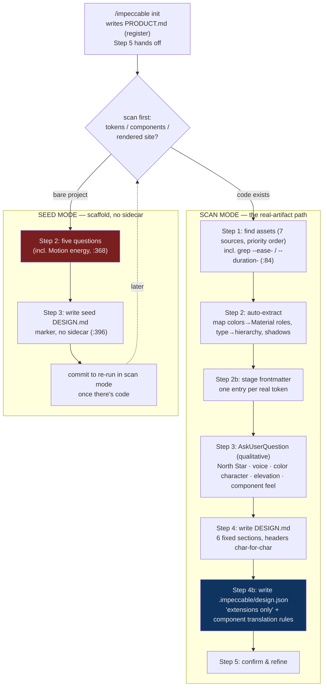
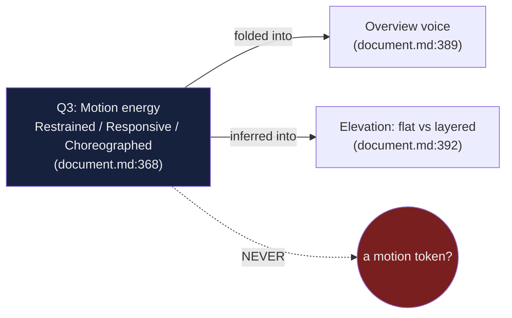
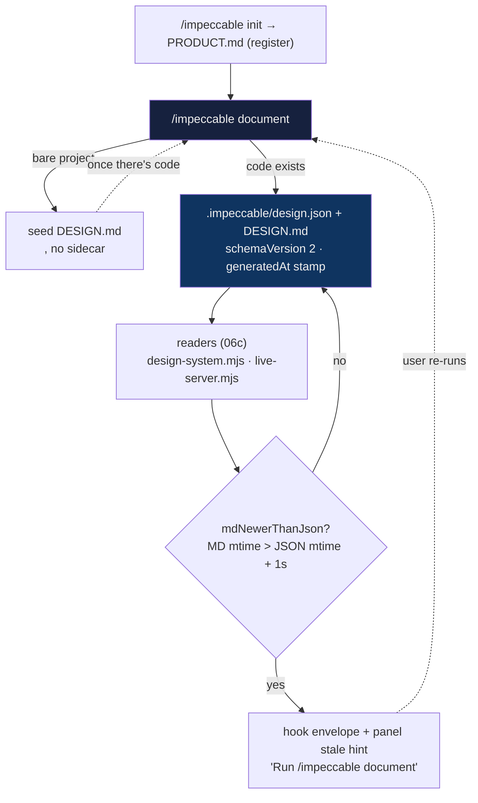

# Design-memory deep dive 06b — generation as a prompt (not a program), the pipeline end-to-end, synthesis, the v1→v2 migration, and the staleness loop

Companion to [`06-design-memory.md`](06-design-memory.md). That report is the
overview; [`06a`](06a-the-persisted-artifact.md) is the artifact's anatomy. This
one goes to the floor on **how the artifact comes into being and changes over
time**: the fact that there is **no generator code at all** (generation is a
429-line prompt an LLM follows with its `Write` tool), the full
init→scan/seed→write pipeline a fresh agent would have to re-run, the component
translation rules that are the *only* place generation reliably emits motion, the
day-zero synthesis rule, the seed-mode **Motion energy** question (the one moment
the whole flow asks about motion — and discards the answer), the documented v1→v2
reshaping, what `schemaVersion` actually does (and does not) at read time, and the
`mdNewerThanJson` staleness signal that closes the regeneration loop.

Sibling slices, so this one stays in its lane:
- the schema the generator writes *into* (full anatomy, the motion block in
  context, the v1/v2 *shape* delta) → [`06a`](06a-the-persisted-artifact.md). 06a
  owns the *shape*; 06b owns the *process* that produces and reshapes it.
- how the written artifact is *read back and enforced*, incl. where
  `mdNewerThanJson` is **computed** and **rendered**, and the register
  conditioner → [`06c`](06c-the-enforcement-reader.md)
- the YoinkIt payoff (a measured memory whose "generation" is a pure code fold,
  not authoring) → [`06d`](06d-a-motion-json-for-yoinkit.md)

Generation references are into [`../../source/skill/reference/document.md`](../../source/skill/reference/document.md)
(429 lines) unless the path says otherwise. Every line number was re-verified
against `source/` this session; where the [06 survey](../../06-UNEXPLORED-TERRITORY.md)
§"How it is generated, read, and migrated" (lines 124-195) was stale, the
correction is inline and flagged.

**The inversion, stated once and held:** every mechanism in this slice exists to
let an **LLM author** tokens — invent a plausible design system from a scan and
commit it. That is precisely the half YoinkIt must **not** copy (06 survey lines
182-186; [`06d`](06d-a-motion-json-for-yoinkit.md) §9). What *does* transfer is the
surrounding **discipline** — versioning, day-zero defaults, never-silently-
overwrite, staleness tracking, ship-thin-then-enrich — wrapped around a different
core: YoinkIt's tokens come from `__cap` measurement, not from a model's
imagination. And there is a deeper, almost comic asymmetry this slice surfaces for
the first time: **Impeccable's "generation" is a prompt with no program behind it;
YoinkIt's is a program (`__cap.dump()`) with no prompt.** The tool people assume is
the mature one generates by *asking a model nicely*; the throwaway one generates by
*measuring*. §1 is about taking that seriously.

---

## 1. There is no generator: generation is a prompt, not a program

The single most important fact about this slice, and the one the survey's phrase
"Generation is LLM-driven, not a parser" (survey line 125) gestures at without
landing: **`/impeccable document` is not code. It is a 429-line reference file the
model reads and obeys, writing the two artifacts with its ordinary `Write` tool.**
Nothing in the repo deterministically emits `.impeccable/design.json`.

### 1a. Grep-verified: no code writes the sidecar

Searched this session across the authoring tree (`skill/`, `cli/`) for any writer
of `design.json`. Every hit is a **reader** or a **path helper**:

| Reference | File:line | What it does |
|---|---|---|
| `path.join(getImpeccableDir(cwd), 'design.json')` | [`impeccable-paths.mjs:13`](../../source/skill/scripts/lib/impeccable-paths.mjs) | computes the path; writes nothing |
| `path.join(cwd, '.impeccable', 'design.json')` | [`design-system.mjs:44`](../../source/cli/engine/design-system.mjs) | reader resolves it ([`06c`](06c-the-enforcement-reader.md) §2) |
| `JSON.parse(fs.readFileSync(jsonPath, …))` | [`live-server.mjs:589`](../../source/skill/scripts/live-server.mjs) | live panel reads it raw ([`06c`](06c-the-enforcement-reader.md) §4) |
| `… DESIGN.md is newer than .impeccable/design.json. Run /impeccable document …` | [`hook-lib.mjs:1238`](../../source/skill/scripts/hook-lib.mjs) | hook *asks the user to regenerate* ([06c] §4) |

There is no `writeDesignJson`, no template emitter, no serializer. The closing line
of that last row is the tell: when the memory is stale, the system's recovery is
not to run a function — it is to **print a sentence telling the human to re-run the
prompt**. The generator is a paragraph of English, and its runtime is a language
model.

### 1b. The one piece of code near generation is a *reader*, and it stamps a *different* `schemaVersion`

The closest thing to a "generator" is [`design-parser.mjs`](../../source/skill/scripts/lib/design-parser.mjs)
(842 lines), and it runs in the **opposite** direction: it parses a *written*
`DESIGN.md` back into a structured model for the live panel to render. Its header
says so: "Parse a DESIGN.md (Stitch-spec format) into a structured JSON model that
the live-mode design-system panel can render. Deterministic, dependency-free."
([`design-parser.mjs:1-2`](../../source/skill/scripts/lib/design-parser.mjs)).

This matters because of a precision trap. 06a §6a (and the parent's appendix) say
"The writer (`design-parser.mjs:830`) stamps `schemaVersion: 2`." **Re-verified this
session: `design-parser.mjs` is not the writer of the sidecar, and its
`schemaVersion: 2` is stamped on a *different object* than the sidecar.** The
function `parseDesignMd` returns the parsed *prose* model:

```js
export function parseDesignMd(md) {
  const { frontmatter, body } = parseFrontmatter(md);
  const { title, sections } = splitSections(body);
  return {
    schemaVersion: 2,
    title,
    frontmatter,
    overview: extractOverview(sections['Overview']),
    colors: extractColors(sections['Colors']),
    typography: extractTypography(sections['Typography']),
    elevation: extractElevation(sections['Elevation']),
    components: extractComponents(sections['Components']),
    dosDonts: extractDosDonts(sections["Do's and Don'ts"]),
  };
}
```
([`design-parser.mjs:826-840`](../../source/skill/scripts/lib/design-parser.mjs))

That shape — `{schemaVersion, title, frontmatter, overview, colors, …, dosDonts}` —
is **not** the sidecar's shape (`{schemaVersion, generatedAt, title, extensions,
components, narrative}`, 06a §2a). They share two key names (`schemaVersion`,
`title`) and nothing else. So the repo has **at least two distinct objects both
tagged `schemaVersion: 2`** — the sidecar (LLM-written) and the parsed-prose render
model (code-written) — and **neither reader cross-checks the other's version**
(§6b takes this further). The takeaway for 06b: the only `schemaVersion: 2` that
code *writes* belongs to the live panel's parse result, not to the design memory.
The memory's `schemaVersion: 2` is typed by the model because [`document.md:250`](../../source/skill/reference/document.md)
shows it a JSON example with that literal in it.

### 1c. The mechanism, drawn

```mermaid
flowchart TB
  subgraph IMP["IMPECCABLE — generation is a PROMPT"]
    DOC["document.md (429 lines of English)\n'Find assets · extract · ask · write'"]
    LLM(("LLM\n+ Write tool"))
    DJ[".impeccable/design.json\nschemaVersion 2 — TYPED BY THE MODEL\nbecause the prompt showed an example"]
    DOC -->|"is read by"| LLM
    LLM -->|"hand-writes"| DJ
    DP["design-parser.mjs (CODE)\nreads DESIGN.md prose BACK\nstamps a DIFFERENT schemaVersion:2"]
    DJ -.->|"sibling DESIGN.md"| DP
  end
  subgraph YOI["YOINKIT — generation is a PROGRAM"]
    CAP["__cap.dump() (CODE)\nper-frame measurement"]
    FOLD["the fold (CODE)\npure fn: dump + memory → memory"]
    MJ[".yoinkit/motion.json\nschemaVersion stamped BY CODE\nno value invented"]
    CAP -->|"feeds"| FOLD
    FOLD -->|"writes"| MJ
  end
  style DJ fill:#7a1f1f,color:#eee
  style MJ fill:#0f3460,color:#eee
  style LLM fill:#16213e,color:#eee
```



The consequence is not academic. A prompt-as-generator is **non-deterministic**
(the same project scanned twice yields different prose, different color names,
sometimes a different `motion` token), **unverifiable except by running a model**
(§8), and **free to invent** (the whole synthesis machinery, §4). A
program-as-generator is deterministic, unit-testable, and structurally incapable of
inventing a value it did not measure. So the usual framing — "Impeccable is the
mature tool, YoinkIt is the prototype" — inverts for *generation specifically*:
Impeccable's generation is the soft, model-driven half, and YoinkIt's `__cap.dump()`
→ fold ([`06d`](06d-a-motion-json-for-yoinkit.md) §4) is the hard, deterministic
half. YoinkIt should not try to grow a `document.md`. It already has the better
generator; what it lacks is the *durable artifact* the generator writes into ([`06a`](06a-the-persisted-artifact.md),
[`06d`](06d-a-motion-json-for-yoinkit.md) §1).

---

## 2. The generation pipeline, end to end (the runnable process)

A fresh agent rebuilding this needs the whole flow, not just the sidecar step. The
prompt defines a five-step scan path, a four-step seed path, a binary mode
decision, and an upstream handoff. Here is all of it, with the motion touchpoints
flagged.

### 2a. Upstream: `/impeccable init` writes the register and hands off

Generation does not start at `document`. `/impeccable init` writes `PRODUCT.md`
(the strategic file carrying the `## Register` value, 06c §5) and at its Step 5
decides on `DESIGN.md`, delegating to `document`:

```
If the user agrees, delegate to `/impeccable document` (it auto-detects scan vs
seed). Load its reference and follow that flow.
```
([`init.md:134`](../../source/skill/reference/init.md))

Two facts from `init.md` frame everything downstream:

- **The memory is read by everything.** "Every other impeccable command reads
  PRODUCT.md and DESIGN.md before doing any work." ([`init.md:9`](../../source/skill/reference/init.md)).
  The artifact `document` writes is not a one-off — it is the project context every
  later command consumes. That is what makes it *memory*.
- **The init pitch names motion once, and only in the seed branch.** The
  pre-implementation handoff is: "I can seed a starter DESIGN.md from five quick
  questions about color strategy, type direction, **motion energy**, and
  references." ([`init.md:132`](../../source/skill/reference/init.md)). The
  code-exists handoff (`:131`) lists "colors, typography, components" — **no
  motion**. Motion enters the conversation only when there is no code to measure,
  which is exactly backwards from a motion tool's instincts (§4d).

`init.md` also carries a discipline echo worth lifting: "Never synthesize PRODUCT.md
from the original task prompt alone." ([`init.md:63`](../../source/skill/reference/init.md)) —
the same never-fabricate-from-nothing posture that `document` applies to the design
memory, here applied to the strategic memory.

### 2b. The mode decision: scan vs seed, auto-detected

`document` chooses its path by **scanning first**, never by asking blindly:

```
Decide by scanning first (Scan mode Step 1). If the scan finds no tokens, no
component files, and no rendered site, offer seed mode; don't silently switch.
`/impeccable document --seed` forces seed mode regardless of code presence.
```
([`document.md:76`](../../source/skill/reference/document.md))

So the binary is: **is there code to extract from?** Yes → scan mode (the real
artifact path). No → seed mode (a scaffold, no sidecar). The decision is the hinge
of the whole lifecycle (§7) because seed mode commits the project to a *later*
scan-mode re-run once code exists — the artifact is explicitly designed to be
regenerated as the project matures.

### 2c. Scan mode, the five steps



The five scan steps, each with the motion detail a fresh agent needs:

- **Step 1 — find the design assets** ([`document.md:80-91`](../../source/skill/reference/document.md)).
  A seven-source priority search: CSS custom properties, Tailwind config, CSS-in-JS
  theme files, design-token files, component library, global stylesheet, and
  (if browser tools exist) **sampling computed styles off the live site**. The
  motion-relevant instruction is in source 1: "grep for `--color-`, `--font-`,
  `--spacing-`, `--radius-`, `--shadow-`, **`--ease-`, `--duration-`** declarations"
  ([`document.md:84`](../../source/skill/reference/document.md)). So the prompt
  *does* tell the model to find easing and duration custom properties — and then
  (§3) gives it almost nowhere structured to put them. The Impeccable repo's own
  `--duration-fast..slowest` ladder is exactly what this grep would surface, and it
  reached the memory **zero** times ([`06a`](06a-the-persisted-artifact.md) §3d.ii).
  The find step works; the *place to keep the find* is the gap.
- **Step 2 — auto-extract** ([`document.md:93-101`](../../source/skill/reference/document.md)).
  Colors get grouped into Material-derived roles (Primary/Secondary/Tertiary/
  Neutral); type maps to the Material hierarchy (display/headline/title/body/label);
  elevation catalogues the shadow vocabulary. There is an extract bucket for colors,
  type, elevation, components, spacing — **and none for motion.** Motion has no
  auto-extract bucket because it has no home in the output schema (§3).
- **Step 2b — stage the frontmatter** ([`document.md:103-111`](../../source/skill/reference/document.md)):
  draft the YAML token block now, "one entry per extracted color … Skip anything the
  project doesn't have. Empty scale keys or fabricated tokens pollute the spec." The
  anti-fabrication rule is real and worth keeping — but it governs *frontmatter*
  tokens (colors/type/rounded/spacing), not motion.
- **Step 3 — ask for qualitative language** ([`document.md:113-123`](../../source/skill/reference/document.md)):
  a single `AskUserQuestion` covering the five things that "cannot be auto-extracted"
  — Creative North Star, Overview voice, color character, **elevation philosophy**,
  component philosophy. **Motion is not among the five.** In scan mode the model is
  never asked how the site should move; it is asked how the site should feel
  *elevated* (flat/layered/lifted), and motion is left to whatever the model infers.
- **Step 4 — write `DESIGN.md`** ([`document.md:125-238`](../../source/skill/reference/document.md)):
  the six fixed sections (Overview, Colors, Typography, Elevation, Components, Do's
  and Don'ts), headers matching the spec character-for-character. The component
  template's hover/focus line ([`document.md:201`](../../source/skill/reference/document.md):
  "**Hover / Focus:** [transitions, treatments]") is the *only* place the prose
  template invites a transition, and it lives inside a component, never as a
  first-class motion concept.
- **Step 4b — write the sidecar** ([`document.md:240-329`](../../source/skill/reference/document.md)):
  §3 below. This is where `motion` finally appears, as one optional `extensions`
  block among six.
- **Step 5 — confirm & refine** ([`document.md:331-337`](../../source/skill/reference/document.md)):
  show the file, highlight non-obvious creative choices, offer to revise. Closes with
  the intra-session freshness rule (§7): "Your own write is the freshest source;
  subsequent commands in this session don't need a reload."

### 2d. The two-file write order (correction: implied, not directed)

The survey says generation "writes `DESIGN.md` (prose), then writes the JSON
sidecar" (survey line 126). **Directionally correct, but there is no single
controlling sentence that says "write the prose first, then the JSON."** The order
is recoverable only from structure, and a fresh agent should not cite a directive
that isn't there:

- the prose is **Step 4** (`### Step 4: Write DESIGN.md`, [`:125`](../../source/skill/reference/document.md))
  and the sidecar is **Step 4b** ([`:240`](../../source/skill/reference/document.md))
  — numbering implies sequence;
- the sidecar's narrative is told to be pulled **from the prose just written**:
  "Pull directly from the DESIGN.md you just wrote:" ([`:321`](../../source/skill/reference/document.md)),
  and "2-3 paragraphs of the philosophy, pulled from DESIGN.md Overview section."
  ([`:283`](../../source/skill/reference/document.md)).

So the ordering is an emergent property of step numbering plus the "DESIGN.md you
just wrote" back-reference, not a stated rule. The dependency is real (the sidecar's
`narrative` is a denormalized copy of the prose — §5), the *directive* is not.

---

## 3. "Extensions only": why motion is a guest, restated for the writer

The sidecar exists for exactly one reason, stated at the Step 4b heading and body:

```
### Step 4b: Write .impeccable/design.json sidecar (extensions only)
```
([`document.md:240`](../../source/skill/reference/document.md))

```
The frontmatter owns token primitives (colors, typography, rounded, spacing,
components). The sidecar at `.impeccable/design.json` carries **what Stitch's
schema can't hold**: tonal ramps per color, shadow/elevation tokens, motion
tokens, breakpoints, full component HTML/CSS snippets (the panel renders these
into a shadow DOM), and narrative (north star, rules, do's/don'ts). It extends
the frontmatter, it doesn't duplicate it.
```
([`document.md:242`](../../source/skill/reference/document.md))

The division is forced by the upstream Stitch format, and motion is named among the
exiles three times in the one file:

```
- **Component sub-tokens** are limited to 8 props: `backgroundColor`, `textColor`,
  `typography`, `rounded`, `padding`, `size`, `height`, `width`. Shadows, motion,
  focus rings, backdrop-filter: none of those fit. Carry them in the sidecar.
```
([`document.md:47`](../../source/skill/reference/document.md))

```
- Don't invent frontmatter token groups outside Stitch's schema (no `motion:`,
  `breakpoints:`, `shadows:` at the top level). … Anything else belongs in the
  sidecar's `extensions`.
```
([`document.md:429`](../../source/skill/reference/document.md))

```
Do NOT add extra top-level sections (Layout Principles, Responsive Behavior,
Motion, Agent Prompt Guide). Fold that content into the six spec sections …
```
([`document.md:60`](../../source/skill/reference/document.md))

**So `motion` lives in the sidecar precisely because the structured schema —
frontmatter *and* prose — has no room for it.** It cannot be a frontmatter token
group ([`:429`](../../source/skill/reference/document.md)), and it cannot be a prose
section ([`:60`](../../source/skill/reference/document.md), [`:426`](../../source/skill/reference/document.md)).
The two normative layers both reject motion; it survives only in the free-form
`extensions` bag and, denormalized, inside component CSS (§3a). That is the mirror
for YoinkIt: motion is the dimension that overflows a static-design schema, which is
why Impeccable — a static design tool — carries it as an afterthought, and why
YoinkIt — a *motion* tool — must make motion the spine, not an extension ([`06a`](06a-the-persisted-artifact.md)
§1, [`06d`](06d-a-motion-json-for-yoinkit.md) §3).

### 3a. The component translation rules — where the only reliable motion is authored

The richest generation detail the first draft skipped: Step 4b's **component
translation rules** ([`document.md:294-304`](../../source/skill/reference/document.md)),
six numbered rules governing how the model turns a real component into a
self-contained `html`+`css` snippet. Two of them are the reason Impeccable's actual
motion lives in component CSS as flattened literals, not in the `motion` token:

| # | Rule | Anchor | Motion consequence |
|---|---|---|---|
| 1 | **Tailwind expansion** — expand every utility to literal CSS | [`:298`](../../source/skill/reference/document.md) | a `transition-*` utility becomes a literal `transition:` declaration |
| 2 | **Token resolution** — `var(--x)` if tokens are CSS custom props, else **resolve to literal values at generation time** | [`:299`](../../source/skill/reference/document.md) | when motion lives in a JS theme, the bezier is **flattened to a literal** in the snippet — the denormalization 06a §4 found |
| 3 | Icons inline as SVG | [`:300`](../../source/skill/reference/document.md) | — |
| 4 | **States** — include `:hover`, `:focus-visible`, `:active` inline; "A static default-only snapshot makes the panel feel dead." | [`:301`](../../source/skill/reference/document.md) | **the model is *instructed* to author hover/focus transitions** — this is the only motion generation reliably emits |
| 5 | **Reset bloat** — keep only distinctive CSS, but `transition` is explicitly on the keep-list | [`:302`](../../source/skill/reference/document.md) | transitions survive the trim; resets don't |
| 6 | Scoped `ds-` class names | [`:303`](../../source/skill/reference/document.md) | — |

Read together, Rule 4 ("include hover/focus") + Rule 2 ("resolve to literal
values") + Rule 5 ("keep `transition`") guarantee that **the generated components
carry real, inline transitions — and that those transitions are denormalized
copies, not references to the `motion` token.** This is the generation-side root of
06a's finding that the real artifact's durations (180ms) and transitioned properties
live in `components[].css`, not in `extensions.motion`, and that the Live Picker Bar
drifted to generic `0.15s ease` with nothing noticing ([`06a`](06a-the-persisted-artifact.md)
§3d.i, §4). The prompt *designs in* the denormalization: it tells the model to
write self-contained snippets ("no post-processing, no framework runtime",
[`:296`](../../source/skill/reference/document.md)), which by definition cannot
reference a shared motion token. The `motion` block names the curve; the components
each carry their own flattened copy of it; nothing keeps them in sync.

For YoinkIt the lesson is sharp: a measured memory must **not** denormalize. A
captured easing/duration is one token, referenced by every motion that exhibits it
(`timing.easing: "ease-signature"`, [`06d`](06d-a-motion-json-for-yoinkit.md) §3),
so the linter can treat it as a single value ([`06d`](06d-a-motion-json-for-yoinkit.md)
§7). Impeccable's snippet self-containment is right for a render-into-shadow-DOM
panel and wrong for a motion vocabulary.

### 3b. "What to include" and the day-zero component fallback

Step 4b's component selection is "a tight set of **5-10 components**"
([`document.md:307`](../../source/skill/reference/document.md)) — the real artifact
shipped 6 ([`06a`](06a-the-persisted-artifact.md) §4). And it carries the first of
two synthesis clauses (§4):

```
If the project has **no component library yet** (bare landing page, new project),
synthesize canonical primitives from the tokens using best-practice defaults
consistent with the DESIGN.md's rules. Every `.impeccable/design.json` has
*something* to render, even on day zero.
```
([`document.md:313`](../../source/skill/reference/document.md))

"Every … has *something* to render, even on day zero" is the day-zero doctrine in
one sentence — and the single most dangerous line to copy onto a measured memory
(§9, the catch).

---

## 4. The motion schema as written, synthesis, and the Motion-energy question

### 4a. What the generator is told to write for `motion`

The only place `document.md` pins the motion shape is the schema example:

```json
"motion": [
  { "name": "ease-standard", "value": "cubic-bezier(0.4, 0, 0.2, 1)", "purpose": "Default easing for state transitions." }
],
```
([`document.md:264-266`](../../source/skill/reference/document.md))

`{ name, value, purpose }` — identical to the real artifact's shape
([`06a`](06a-the-persisted-artifact.md) §3d), and with **no `duration` field**
(confirming 06a §6: `duration` is demo-only). The siblings in the same schema use
the same spine — `shadows` is `{name, value, purpose}` ([`:261-263`](../../source/skill/reference/document.md)),
`breakpoints` is `{name, value}` ([`:267-269`](../../source/skill/reference/document.md)).

There is **essentially no authoring guidance** for motion beyond this one example.
Compare the surrounding blocks: tonal ramps get a whole "#### Tonal ramps"
subsection with a synthesis algorithm ([`:315-317`](../../source/skill/reference/document.md));
components get six translation rules ([`:294-304`](../../source/skill/reference/document.md))
and an inclusion policy ([`:306-311`](../../source/skill/reference/document.md));
narrative gets a five-line field map ([`:319-329`](../../source/skill/reference/document.md)).
Motion gets one line of JSON. The vocabulary is whatever the model decides to lift
from the `--ease-`/`--duration-` grep (§2c) or invent from the example.

### 4b. Day-zero synthesis (correction: it does not name motion)

The survey's INSPIRATION bullet reads: "When a capture is thin, synthesise a
plausible default token so the artifact always has something to render
(`document.md:313`)" (survey lines 174-176). The cited line is correct, and the
*principle* is real and strong — but it is about **components**, and a second clause
covers **tonal ramps**:

```
For each color token, generate an 8-step `tonalRamp` array: dark to light, same
hue and chroma … If the project already defines a tonal scale … use those
values. Otherwise synthesize in OKLCH.
```
([`document.md:317`](../../source/skill/reference/document.md))

Note the structure of that rule: **measured-if-present, synthesized-if-absent.** "If
the project already defines a tonal scale … use those values. Otherwise synthesize."
That is a genuinely good discipline and it is exactly the shape YoinkIt's
`confidence` field encodes (use the measured value; mark what you had to guess) —
*for colors*. The catch (§9) is that there is **no equivalent rule for motion**:
re-verified this session, nothing in `document.md` instructs the model to synthesize
a motion token when motion is absent. The only motion default that ships is the
hardcoded `ease-standard` example in the schema block ([`:265`](../../source/skill/reference/document.md))
— so a model with no motion to lift tends to emit *that* curve by default because
the example shows it, not because a rule says "invent motion when you find none." So
the survey's "synthesise a plausible default *token*" generalises a
colors/components rule onto motion; the support for motion specifically is the
example, not a directive. (For YoinkIt this distinction is the whole ballgame — §9
and [`06d`](06d-a-motion-json-for-yoinkit.md) §9: a *measured* memory must **never**
synthesize a motion it did not observe.)

### 4c. Seed mode and its five questions

Scan mode is for projects with code. Seed mode is the day-zero path: pre-
implementation, nothing built, write a scaffold and commit to a re-run.

```
- **Seed mode**: the project is pre-implementation … Interview for five
  high-level answers, write a minimal DESIGN.md marked `<!-- SEED -->`. Re-run in
  scan mode once there's code.
```
([`document.md:74`](../../source/skill/reference/document.md))

The five questions ([`document.md:351-375`](../../source/skill/reference/document.md))
are: (1) Color strategy, (2) Typography direction, (3) **Motion energy**, (4) Three
named references, (5) One anti-reference. And seed mode writes **no sidecar at
all**:

```
Seed mode writes a minimal frontmatter with `name` and `description` only … Skip
the `.impeccable/design.json` sidecar in seed mode for the same reason: nothing to
render.
```
([`document.md:396`](../../source/skill/reference/document.md))

So on day zero the design memory is one prose file with a `<!-- SEED -->` marker and
two frontmatter fields; the sidecar (with its `motion` block) lands only on the
first scan-mode run once there is code to read. This is the "difference between a
one-shot tool and persistent project memory" the survey points at — the artifact is
explicitly designed to be *regenerated as the project matures* (§7). The YoinkIt
analog is clean and honest: a site captured once has a thin `motion.json`; capturing
more regions/triggers/viewports enriches it, and `coverage` tracks how complete it
is ([`06d`](06d-a-motion-json-for-yoinkit.md) §3).

### 4d. The Motion-energy question: the one place generation asks about motion — and discards the answer

Question 3 is the single most important motion fact on the generation side, and the
first draft of this slice missed it entirely:

```
3. **Motion energy.** Pick one:
   - Restrained: state changes only
   - Responsive: feedback + transitions, no choreography
   - Choreographed: orchestrated entrances, scroll-driven sequences
```
([`document.md:368-371`](../../source/skill/reference/document.md))

This is the **only** moment in the entire generation flow — scan or seed — where the
model asks the user how the design should *move*. And here is the devastating part:
**the answer never becomes a motion artifact.** It is consumed to infer two *other*
sections and then discarded:

```
- **Overview**: Creative North Star and philosophy phrased from the answers
  (color strategy + motion energy + references). …
```
([`document.md:389`](../../source/skill/reference/document.md))

```
- **Elevation**: inferred from motion energy. Restrained/Responsive → flat by
  default; Choreographed → layered. One sentence.
```
([`document.md:392`](../../source/skill/reference/document.md))

So the flow goes: *ask the human how the product should move* → fold that into prose
voice (Overview) and a flat-vs-layered **shadow** decision (Elevation) → **emit no
motion token, no duration, no easing.** Motion is generation **input**, never
**output**. The energy level is laundered into elevation and tone, and the actual
motion vocabulary is left for a future scan-mode pass to maybe lift from CSS.



This maps almost one-to-one onto the register doctrine the readers later enforce
(06c §5): "Restrained/Responsive" is the **product** doctrine ("150-250 ms … motion
conveys state, not decoration … no orchestrated page-load", [`product.md:40-42`](../../source/skill/reference/product.md)),
and "Choreographed" is the **brand** doctrine ("ambitious first-load motion … reveals
and typographic choreography", [`brand.md:105`](../../source/skill/reference/brand.md)).
So the Motion-energy question is effectively asking the user to pick a register-
flavored motion *doctrine* — and then storing it as everything *except* motion. The
authored pipeline can hold an *opinion* about motion (in prose voice, in elevation)
but structurally cannot hold a *value* of motion as a first-class output. For a
motion tool, this is the strongest possible argument that Impeccable's format is the
wrong base to fork: the format's own intake question for motion produces no motion
([`06a`](06a-the-persisted-artifact.md) §1, [`06d`](06d-a-motion-json-for-yoinkit.md)
§3).

### 4e. The demo's two motion tokens — authored ahead of code

The worked-example demo is where motion-as-authoring is most visible. Its
`extensions.motion` has **two** tokens, both shaped `{name, value, duration,
purpose}`:

```json
"motion": [
  { "name": "ease-button", "value": "ease", "duration": "150ms", "purpose": "Default easing for button hover transforms." },
  { "name": "ease-card",   "value": "ease", "duration": "300ms", "purpose": "Card hover transition (currently unused but reserved)." }
]
```
([`demos/landing-demo/DESIGN.json:155-168`](../../source/demos/landing-demo/DESIGN.json))

Three things to read off this:

- **The curve is the trivial keyword `ease`, not a bezier.** The demo tokenises
  *duration* (150ms/300ms) and *name*, but the easing is the CSS default `ease` —
  the opposite emphasis from the real artifact, which tokenises a bezier curve and
  drops duration ([`06a`](06a-the-persisted-artifact.md) §3d). Two instances of the
  same schema, two different ideas of what a motion token even *is*. The "lived
  motion schema" is a union, not a contract ([`06a`](06a-the-persisted-artifact.md) §6b).
- **`ease-card` is "currently unused but reserved."** A motion token written into the
  machine memory *ahead of any code that uses it* — a forward-declared vocabulary
  entry. This is the prescriptive habit in miniature: authored memory can contain
  motion the project does not yet exhibit. A measured memory cannot — a token with
  `observedIn: 0` is a contradiction ([`06d`](06d-a-motion-json-for-yoinkit.md) §9).
- **The demo follows the spec; the real artifact follows the project.** The demo's
  `duration` field obeys nothing in `document.md` (the spec example has no duration,
  §4a) — it is a richer-than-spec instance, the same way the real artifact is richer
  than spec on `description`/`roundedMeta` ([`06a`](06a-the-persisted-artifact.md) §6b).
  Neither instance is wrong, because nothing validates them; the schema is a bag of
  optional blocks (§6).

---

## 5. The narrative mapping: prose → JSON, and why motion gets no rule

The `narrative` block (06a §5) is the one part of the sidecar with an explicit
generation recipe — a field-by-field map from the prose just written:

```
Pull directly from the DESIGN.md you just wrote:
- `narrative.northStar` → the `**Creative North Star: "..."**` line from Overview
- `narrative.overview` → the philosophy paragraphs from Overview
- `narrative.keyCharacteristics` → the bulleted `**Key Characteristics:**` list
- `narrative.rules` → every `**The [Name] Rule.** [body]` across all sections, tagged with `section`
- `narrative.dos` / `narrative.donts` → the bullet lists from Do's and Don'ts verbatim
Do not reword.
```
([`document.md:321-329`](../../source/skill/reference/document.md))

Three generation facts follow:

- **The narrative is a denormalized copy of the prose, by design.** "Do not reword"
  ([`:329`](../../source/skill/reference/document.md)) means `narrative` and the
  `DESIGN.md` body are intended to hold the *same words* in two places — a deliberate
  duplication so the panel can show the prose without re-parsing the Markdown. (The
  one machine-only addition is `section`, the discriminator tag the prose doesn't
  carry, 06a §5.) This is the same denormalization pattern as the components (§3a):
  the sidecar carries flattened copies the schema can't keep in sync with their
  source.
- **`narrative.rules[].section` is tagged from the six prose sections** — and there
  is no `motion` value possible because there is no Motion section to lift from
  ([`:60`](../../source/skill/reference/document.md) forbids one). 06a §5 verified the
  real artifact's eleven rules tag to `colors`/`typography`/`elevation`/`components`
  and **zero** to motion; this is the generation reason why. The narrative literally
  cannot acquire a motion rule through the prescribed mapping, because the mapping's
  source (the six sections) has no motion section.
- **The narrative is *authored intent*.** Every field traces to prose a model wrote
  to describe the design a project *should* follow. YoinkIt's analog keeps the slot
  and inverts the origin: the prose comes from a human **Note** over *measured*
  motion, not from an LLM authoring intent ([`06a`](06a-the-persisted-artifact.md) §5,
  [`06d`](06d-a-motion-json-for-yoinkit.md) §5).

---

## 6. Versioning and the v1→v2 migration

### 6a. The documented reshaping

The migration is a single paragraph, and the survey did not cite its line. The
correct anchor is [`document.md:292`](../../source/skill/reference/document.md):

```
**What changed from schemaVersion 1.** The old sidecar carried token primitive
arrays (`tokens.colors[]`, `tokens.typography[]`, etc.). Those values now live in
the frontmatter. The sidecar only carries metadata that can't live in the
frontmatter (tonal ramps, canonical OKLCH when the hex is an approximation,
display names, role hints), keyed by the frontmatter token name
(`colorMeta.<token-name>`, `typographyMeta.<token-name>`). Components still carry
full HTML/CSS because Stitch's 8-prop set can't hold them.
```

This is exactly the reshaping the survey describes: token primitive **arrays**
(`tokens.colors[]`) moved out of the sidecar into the Markdown frontmatter, and the
sidecar reduced to **keyed metadata** (`colorMeta.<token-name>`). The v1→v2 reshape
*is* the 06a §1a pairing being born — v1 was a single self-contained JSON, v2 split
it into the senior `DESIGN.md` + the junior "extensions only" sidecar.

**But note what this paragraph is: it is a note *to the model*, not code.** It lives
in the prompt, in the prose, telling the LLM how the current shape differs from the
old one so the LLM writes the new shape. There is no migration *function* — no code
that reads a v1 file and rewrites it. The "migration" is documentation that
conditions the next authoring pass. This is §1 again: even the migration is a prompt.

### 6b. `schemaVersion` is a naming convention reused across unrelated artifacts

The survey says "readers branch on `schemaVersion`" (survey line 136). **Re-verified
against `source/`: no reader branches on it.** And the deeper finding the first draft
only half-stated: `schemaVersion` is not one version axis — it is a **field name
reused on at least four unrelated artifacts**, written by different writers, never
reconciled:

| Artifact | Field & value | Writer | Branched on? |
|---|---|---|---|
| `.impeccable/design.json` (the memory) | `schemaVersion: 2` | the **LLM** (typed from the example, [`document.md:250`](../../source/skill/reference/document.md)) | **no** |
| parsed-`DESIGN.md` render model | `schemaVersion: 2` | **code** ([`design-parser.mjs:830`](../../source/skill/scripts/lib/design-parser.mjs)) — a *different shape* (§1b) | no |
| live `manual_edit_apply` event | `schemaVersion: 1` | **code** ([`manual-apply.mjs:46`](../../source/skill/scripts/live/manual-apply.mjs)) — a live-protocol message, unrelated to the memory | no |
| live manual-apply transaction | `version: 1` | **code** ([`manual-apply.mjs:731`](../../source/skill/scripts/live/manual-apply.mjs)) | no |
| sveltekit test fixture sidecar | `version: 2` / `source` (renamed keys!) | a fixture | no ([`06a`](06a-the-persisted-artifact.md) §6b) |

So "schemaVersion" is a house convention scattered across the codebase, sometimes
spelled `version`, on objects that have nothing to do with each other, and **not one
reader anywhere dispatches on any of them.** The enforcement reader
`design-system.mjs` contains **zero** references to `schemaVersion` (grep clean this
session); it reads `sidecar.extensions.colorMeta` / `roundedMeta` directly ([`design-system.mjs:261,305`](../../source/cli/engine/design-system.mjs);
06c §2). The live server mentions it **only in a comment** — "Expected shape:
schemaVersion 2, carrying extensions + components + narrative" ([`live-server.mjs:545`](../../source/skill/scripts/live-server.mjs))
— then reads the sidecar raw with no version check (06c §4).

### 6c. The practical consequence: a v1 file reads as empty, not migrated

The consequence is sharper than "evolve without breaking old files": a **v1 file
does not break, it silently reads as empty.** The reader looks for
`extensions.colorMeta`; a v1 file that stored `tokens.colors[]` has no
`extensions.colorMeta`, so `addSidecarColors` finds nothing and contributes zero
allowed colors ([`design-system.mjs:261-262`](../../source/cli/engine/design-system.mjs)).
No error, no migration, no enforcement — the memory just goes quiet. So the
"migratable schema" is migratable by **regeneration** (re-run `/impeccable
document`, which writes a fresh v2), not by reader-side version dispatch. The
durability comes from *re-authoring*.

This is a load-bearing correction for YoinkIt, and §1 sharpens *why*: Impeccable can
afford a silent-empty failure mode because re-authoring is cheap — it just re-runs
the prompt. YoinkIt cannot re-author (it must re-*measure*, which needs a real
visible browser, [`06d`](06d-a-motion-json-for-yoinkit.md) §9), so a silent-empty
read would strand the user with no recovery. YoinkIt's `motion.json` reader must
therefore **fail open and visible** — up-convert known old shapes, or loudly flag an
unreadable version — never silently read an old file as empty ([`06d`](06d-a-motion-json-for-yoinkit.md)
§9; the no-branch reader, 06c §2).

---

## 7. The lifecycle and the staleness loop

### 7a. The disciplines that make it *memory*, not a dump

Three rules in `document.md` turn the artifact from a disposable parse into an
accruing project asset — and all three transfer to YoinkIt regardless of the
inversion:

- **Never silently overwrite:**
  ```
  If a `DESIGN.md` already exists, **do not silently overwrite it**. Show the user
  the existing file and {{ask_instruction}} whether to refresh, overwrite, or merge.
  ```
  ([`document.md:69`](../../source/skill/reference/document.md). Note the
  `{{ask_instruction}}` — this is a **build-time placeholder**, the *only* one in
  the file; the literal prompt the agent runs has it replaced per-provider, §8.)
- **Regenerate in lockstep, or the sidecar alone on request:**
  ```
  Regenerate the sidecar whenever you regenerate root `DESIGN.md`. If the user only
  asks to refresh the sidecar (e.g., from the live panel's stale-hint), preserve
  `DESIGN.md` and write only `.impeccable/design.json`.
  ```
  ([`document.md:244`](../../source/skill/reference/document.md))
- **Seed → scan promotion:** the seed file commits the project to a later scan-mode
  re-run ([`:74`](../../source/skill/reference/document.md), §4c) — a thin memory that
  is *designed* to be enriched, not a final answer.



### 7b. `mdNewerThanJson` — the signal that closes the loop (computed by the readers, not here)

The survey lists, under generation/migration: "a `mdNewerThanJson` signal surfaces
staleness" (survey line 136). The signal is **real and correctly named**, but it is
**not defined in `document.md`** and it is not part of the generation spec. It
belongs to the enforcement/consumption path (06c traces its computation and render);
06b's only claim on it is that it **closes the regeneration loop the generation
discipline opens.** Re-verified this session:

- **`document.md` has no `mdNewerThanJson`.** It references only the *downstream
  concept* — "the live panel's stale-hint" ([`:244`](../../source/skill/reference/document.md))
  and "An existing `DESIGN.md` is stale" ([`:66`](../../source/skill/reference/document.md)).
- The signal is **computed by the readers** by comparing mtimes (MD newer than JSON
  by >1s), in two independent places ([`design-system.mjs:386`](../../source/cli/engine/design-system.mjs),
  [`live-server.mjs:574`](../../source/skill/scripts/live-server.mjs) — 06c §4), then
  **consumed** by the hook ([`hook-lib.mjs:1237-1238`](../../source/skill/scripts/hook-lib.mjs))
  and **rendered** by the panel ([`live-browser.js:10474,10493`](../../source/skill/scripts/live-browser.js)).

End to end: **`DESIGN.md` modified more than 1 second after `design.json`** ⟹ the
memory (JSON) lags the source (MD) ⟹ readers flag it ⟹ the hook appends a stale
hint and the panel shows a "refresh the sidecar" prompt ⟹ the user re-runs
`/impeccable document`, which regenerates the sidecar ([`document.md:244`](../../source/skill/reference/document.md)).
The signal is a **reader-side mtime heuristic** that *triggers generation*; filing
it under "generation/migration" (as the survey does) misplaces where it lives, but
it genuinely *belongs to the lifecycle* because re-authoring is its whole purpose.

One paired discipline keeps the loop from false-firing within a session: after a
regeneration *in the same session*, the just-written file is authoritative — "Your
own write is the freshest source; subsequent commands in this session don't need a
reload." ([`document.md:337`](../../source/skill/reference/document.md), restated
[`:403`](../../source/skill/reference/document.md)). The mtime heuristic is for
*cross-session* drift, not intra-session.

---

## 8. How generation is verified (you can't unit-test a prompt — so run a model)

Because generation is a prompt (§1), it cannot be verified the way the readers are
(deterministic unit tests). Impeccable's answer, documented in `source/CLAUDE.md`
("Skill-behavior tests"), is to run **real LLMs against the source `SKILL.md` +
reference files and assert on the tool-call trace** — "the trace is the source of
truth." This is the safety net specifically for edits to `document.md` and the other
Setup-adjacent files. A fresh agent should know it exists, because it is the only
thing standing between a prompt edit and a broken generator.

The nine scenarios (`tests/skill-behavior/scenarios.test.mjs`) are LLM-backed checks
that the generation/setup prose actually drives the agent. The ones that bear on
this slice:

- **Scenario 1** — empty workspace → the agent loads `reference/init.md` (the
  upstream handoff, §2a).
- **Scenario 2/3** — `PRODUCT.md` present → loads `brand.md`, consults the design
  system (the register that conditions motion doctrine, §4d).
- **Scenario 5** — `PRODUCT.md` without a `## Register` field → the agent **infers**
  `brand` from the task cue (the resolution order 06c §5 documents, exercised live).
- **Scenario 4** — context already loaded → turn 2 does **not** re-run `context.mjs`
  (the intra-session freshness rule, §7b).

The suite runs three providers every time (`claude-sonnet-4-6`, `gpt-5.5`,
`gemini-3.1-flash-lite`) because "many of the most useful findings come from
divergence between providers" (`source/CLAUDE.md`) — a different model writes a
different design system, which is §1's non-determinism made into a test strategy.
For YoinkIt the contrast is total: the fold ([`06d`](06d-a-motion-json-for-yoinkit.md)
§4) is a pure function and can be tested with ordinary fixtures — input `dump()`,
expected `motion.json`, no model in the loop, no provider matrix, no flake. The
deterministic generator is not just more honest; it is *cheaper to verify*.

---

## 9. The catch, restated for the generation path

Everything above is the machinery of **authoring**. The day-zero `ease-standard`
default (§4a), the model lifting `--ease-` custom properties into a token (§2c), the
reserved-but-unused `ease-card` in the demo (§4e), the Motion-energy answer laundered
into elevation (§4d), the synthesized components and ramps (§4b) — these are all ways
an LLM **invents or asserts** motion the project may not actually exhibit. That is
the half to leave behind.

YoinkIt's "generation" is `__cap.dump()` folded into the memory ([`06d`](06d-a-motion-json-for-yoinkit.md)
§4): a per-frame measurement of what a page *actually does*. The disciplines wrapped
around Impeccable's generator transfer; the generator's core does not:

| Impeccable generation discipline | Transfers? | YoinkIt form |
|---|---|---|
| `schemaVersion` + `generatedAt` stamp | **yes** | stamp every `motion.json` write — but by code, not a typed example ([06d] §3) |
| Never silently overwrite; refresh/merge | **yes** | accumulate captures, never clobber ([06d] §3) |
| Regenerate in lockstep; track staleness | **yes (reframed)** | re-capture when source changes; a `sourceChangedSinceCapture` mtime/hash hint ([06d] §7) |
| Seed = a thin memory + commit to re-run | **yes** | a thin `motion.json` from one capture, enriched by more ([06d] §3) |
| Measured-if-present, else synthesize (ramps) | **partly** | measured-if-present, else **mark `confidence`** — never synthesize a value ([06d] §9) |
| Day-zero **synthesis** of plausible tokens | **NO** | thinness is shown via `coverage`, never faked ([06d] §9) |
| The Motion-energy question (motion as input) | **NO** | motion is the **output**, measured per-frame ([06d] §3) |
| Denormalized motion in component CSS (§3a) | **NO** | one token, referenced by every motion ([06d] §3) |
| An **LLM authors** the token values | **NO** | `__cap` measures them; the fold invents nothing ([06d] §4) |

The line is bright: copy the **envelope and the lifecycle**, never the **invention
of values**. A measured `motion.json` that synthesized a "plausible default easing"
because a capture was thin, or reserved an `ease-card` no capture produced, would be
lying about the source — the one thing YoinkIt's `confidence: measured` contract
exists to prevent (`CONTEXT.md`; [`06d`](06d-a-motion-json-for-yoinkit.md) §9).

---

## What this means for YoinkIt

- **ADOPT the lifecycle, not the generator — and notice you already have the better
  generator.** Stamp `schemaVersion` + `generatedAt`, never silently overwrite,
  regenerate-on-change, ship a thin memory that commits to later enrichment. All of
  this is sound and inversion-safe. But do **not** grow a `document.md`: Impeccable's
  generation is a non-deterministic prompt with no program behind it (§1); YoinkIt's
  `__cap.dump()` + fold is a deterministic program with no prompt — the harder,
  honester, cheaper-to-test half. *Ref: §1; `document.md:69,74,244,250`;
  [`06d`](06d-a-motion-json-for-yoinkit.md) §4.*
- **ADOPT "measured-if-present, else mark confidence" — Impeccable's ramp rule,
  motion-corrected.** The tonal-ramp clause ("use the project's scale if it has one,
  otherwise synthesize", [`document.md:317`](../../source/skill/reference/document.md))
  is the right *shape* — prefer the real value — but its *else* branch (synthesize) is
  the one move to drop for motion. YoinkIt's else branch is `confidence: verify/unknown`,
  not a fabricated curve. *Ref: §4b; §9.*
- **ADOPT staleness as a reader-side mtime/hash heuristic that triggers re-capture.**
  Compute a `sourceChangedSinceCapture` flag (captured-source mtime/hash vs the
  memory's `generatedAt`), carry it on the loaded object, surface it in any UI/agent
  context — exactly as `mdNewerThanJson` is computed in the readers and rendered in
  the panel ([`design-system.mjs:386`](../../source/cli/engine/design-system.mjs),
  [`live-server.mjs:574`](../../source/skill/scripts/live-server.mjs)), **not** asserted
  in a generation spec. But where Impeccable's loop ends in *re-author*, YoinkIt's
  must end in *re-capture* (§6c). *Ref: §7b.*
- **EXPLORE a migratable schema that fails open and visible, not silent-empty.**
  Impeccable's v1 files read as empty because nobody branches on `schemaVersion` and
  `schemaVersion` is a scattered convention, not a contract (§6b). YoinkIt cannot
  re-author to migrate, so a `motion.json` reader should up-convert known old shapes
  or loudly flag an unreadable version — never silently read an old file as empty.
  *Ref: §6b-c; the no-branch reader, 06c §2.*
- **AVOID every authoring move: synthesize-on-thin, reserved tokens, denormalized
  motion, and the Motion-energy laundering.** These are the four ways Impeccable's
  generation asserts motion the project may not exhibit (§3a, §4d, §4e, §9). A
  measured memory shows its gaps (`coverage`, a blank un-captured region) and never
  invents a default curve, reserves an unused token, flattens a curve into N
  denormalized copies, or stores a motion intent as anything but a measured value.
  *Ref: §3a, §4d, §4e; the catch, §9; [`06d`](06d-a-motion-json-for-yoinkit.md) §9.*
