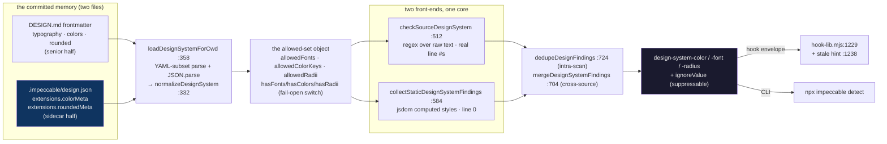
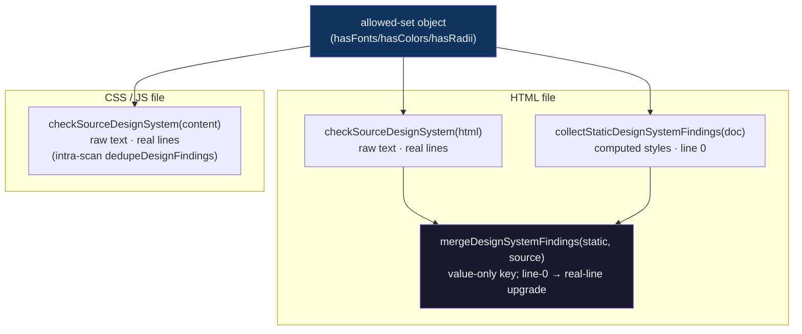
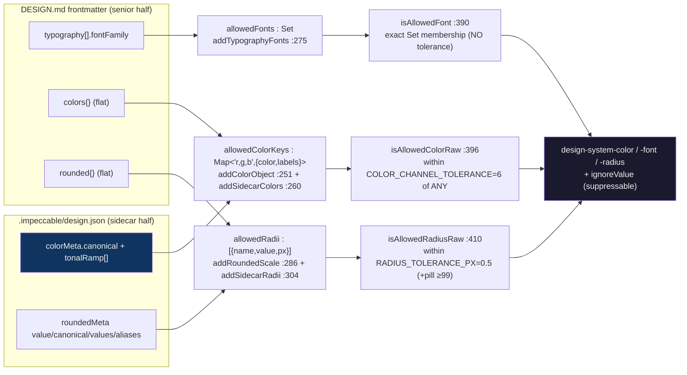

# Design-memory deep dive 06c — the enforcement reader: one loader, two parsers, two front-ends, an allowed-set, tolerance drift-flags, the live merge, and the register conditioner

Companion to [`06-design-memory.md`](06-design-memory.md). That report is the
overview; [`06a`](06a-the-persisted-artifact.md) is the artifact, [`06b`](06b-generation-and-migration.md)
is how it is written. This one goes to the floor on **how the memory is read back
and turned into an enforcement contract**: how `cli/engine/design-system.mjs`
loads *both halves* of the memory, folds them into an allowed set, flags code that
drifts off-system within a tolerance, and how it works hard to *not* flag things
that only look like colors. It also covers the live-server merge that returns the
raw sidecar beside the parsed prose, and the one-field `Register` taxonomy that
flips the whole downstream motion doctrine.

This is the most directly transferable slice for YoinkIt's payoff: the
**memory-as-linter** mechanism in [`06d`](06d-a-motion-json-for-yoinkit.md) §7 is
a near-line-for-line inversion of what this file does for colors and radii. Where
06a/06b read the *authored object* and *how it is authored*, 06c reads the
**machine that enforces it** — and that machine is the part YoinkIt would clone.

Sibling slices, so this one stays in its lane:
- the schema being read (the `extensions.colorMeta` / `roundedMeta` shapes, the
  `DESIGN.md` frontmatter) → [`06a`](06a-the-persisted-artifact.md)
- where `mdNewerThanJson` is *also* computed and why it is a reader concern, plus
  the generation path that feeds the staleness loop → [`06b`](06b-generation-and-migration.md)
- the YoinkIt motion-linter and the measured `motion.json` it reads →
  [`06d`](06d-a-motion-json-for-yoinkit.md)

All `file:line` references are into [`../../source/cli/engine/design-system.mjs`](../../source/cli/engine/design-system.mjs)
(750 lines) unless the path says otherwise. Every line number was re-verified
against `source/` this session. The survey cited `design-system.mjs:260-419` for
the consumer/enforcer; that range is the *allowed-set + matchers* core and is
accurate, but the full enforcement story runs from the loader (`:358`) through the
two front-end collectors (`:512`, `:584`) and the two dedup layers (`:704`,
`:724`), and this slice traces all of it.

**The inversion for this slice.** Impeccable's allowed set is an **authored
ideal** — the colors a human/LLM decided the project *should* use. Drift is "the
code deviated from the decided-good set; fix the code." YoinkIt's analog reads a
**measured vocabulary** — the easing/durations the site *actually* exhibits. Drift
is "a new animation deviated from what the site empirically does; the recreation
is unfaithful (or the site is inconsistent)." Same mechanism, opposite
truth-source: normative-by-authorship vs normative-by-observation (06d §7).

> **First-draft corrections (re-verified against `source/` this session).** Three
> precision points the survey and the earlier 06c draft flattened, each developed
> below:
>
> - **The allowed *color* and *radius* sets are fed by BOTH halves of the memory,
>   not just the sidecar.** The reader reads `frontmatter.colors` *and*
>   `sidecar.colorMeta` for colors (`:347-348`), and `frontmatter.rounded` *and*
>   `sidecar.roundedMeta` for radii (`:349-350`). The sidecar contributes the *ramps*
>   the flat frontmatter list lacks; for radii the frontmatter is actually the
>   *richer* source. Only **fonts** are single-source (frontmatter `typography`
>   only). "colors/radii come from the sidecar" is half the picture. (§3)
> - **There are two front-ends and two dedup layers, not one of each.** A
>   *source-text regex scan* (`checkSourceDesignSystem:512`, line-numbered) and a
>   *rendered-DOM walk* (`collectStaticDesignSystemFindings:584`, computed styles,
>   line 0) both feed the same allowed-set + tolerance core; for an HTML file
>   **both run and are merged** (`detect-html.mjs:182-189`). Dedup happens twice:
>   line-sensitive inside a scan (`dedupeDesignFindings:724`) and value-only across
>   sources (`mergeDesignSystemFindings:704`). (§2, §6)
> - **Enforcement is gated on a parseable `DESIGN.md`; the sidecar alone enforces
>   nothing.** `loadDesignSystemForCwd` returns `null` if there is no `DESIGN.md`
>   or its frontmatter won't parse (`:360,370`), *before* it ever looks at the
>   sidecar. A project with a `design.json` but no `DESIGN.md` gets **zero**
>   enforcement. The memory is genuinely a two-file pair at the mechanism level.
>   (§2)

---

## 1. The reader is the proof that "memory is an enforcement contract"

The headline the survey gets exactly right: the design memory "is an enforcement
contract, not passive docs." `design-system.mjs` is the proof. It does three
things, in order, and the whole point is the third:

1. **Resolve and load** the senior frontmatter and the sidecar
   (`loadDesignSystemForCwd:358-388`).
2. **Fold** them into an allowed set: allowed fonts, allowed colors, allowed radii
   (`normalizeDesignSystem:332-356`).
3. **Flag** any color / font / radius in real code that is **not** in (or within
   tolerance of) that set — emitting `design-system-color`, `design-system-font`,
   `design-system-radius` findings (`checkSourceDesignSystem:512`,
   `collectStaticDesignSystemFindings:584`).

The same three findings are surfaced by the hook on every edit
([`05`](../05-hook-system/05-hook-system.md), via `hook-lib.mjs:1229`) and by
`npx impeccable detect` (via `cli/main.mjs:139`). So the committed `design.json`
(plus its `DESIGN.md` partner) is not documentation an agent might read — it is the
**allow-list a deterministic linter enforces on every file the agent touches.**
That is the mechanism YoinkIt would invert into a motion-consistency linter.

### Who drives the reader (the call graph)

The module exports nine functions (`:740-750`); four are load-bearing entry points
with real callers across the CLI and the hook. The reader is not a library nobody
calls — it is wired into every enforcement surface:

| Export | Called by | When |
|---|---|---|
| `loadDesignSystemForCwd` | `cli/main.mjs:139` (once per `detect` run, gated by `--no-design-system` / config) | start of a scan; result threaded as `options.designSystem` |
| `loadDesignSystemForCwd` | `hook-lib.mjs:1229` (`designSystemOptions`, gated by `config.designSystem.enabled`) | every edit the hook inspects |
| `checkSourceDesignSystem` | `detect-text.mjs:515` (CSS/JS/any text file) | source-text scan |
| `checkSourceDesignSystem` | `detect-html.mjs:182` (HTML source) | source-text scan of HTML |
| `collectStaticDesignSystemFindings` | `detect-html.mjs:188` (HTML rendered into jsdom) | computed-style walk |
| `mergeDesignSystemFindings` | `detect-html.mjs:189` | reconcile the two HTML paths |

The loader runs **once** per process and produces an immutable `designSystem`
object; the two collectors run **per file**. The gate matters: `cli/main.mjs:138`
computes `designSystemEnabled = configEnabled && !--no-design-system &&
detectionConfig.designSystem?.enabled !== false`, so the committed
`.impeccable/config.json` ([`05c`](../05-hook-system/05c-config-and-ignore-model.md))
can switch the entire subsystem off without touching the memory.



---

## 2. Control flow: one loader, two parsers, two front-ends, two dedup layers

Before the matchers, the architecture. A fresh agent rebuilding this needs to know
that the reader is not "parse one file, check code." It is a small pipeline with a
deliberate shape, and every joint in it is a decision YoinkIt would re-make.

### 2a. The loader requires the senior file; the sidecar is optional

`loadDesignSystemForCwd:358-388`:

```js
function loadDesignSystemForCwd(cwd = process.cwd()) {
  const md = resolveDesignMdPath(cwd);
  if (!md) return null;                                  // no DESIGN.md → no enforcement
  let frontmatter = null, mdStat = null;
  try {
    mdStat = fs.statSync(md.path);
    frontmatter = parseFrontmatter(fs.readFileSync(md.path, 'utf-8'));
  } catch { return null; }
  if (!frontmatter || typeof frontmatter !== 'object') return null;  // unparseable → no enforcement

  const sidecarPath = resolveDesignSidecarPath(cwd, md.contextDir);
  const sidecar = safeReadJson(sidecarPath);             // may be null; that's fine
  let sidecarStat = null;
  try { if (sidecarPath) sidecarStat = fs.statSync(sidecarPath); } catch { sidecarStat = null; }

  return normalizeDesignSystem({
    frontmatter, sidecar, sourcePath: md.path, sidecarPath,
    mdNewerThanJson: !!(mdStat && sidecarStat && mdStat.mtimeMs > sidecarStat.mtimeMs + 1000),
  });
}
```

Three structural facts that fall out of this 30-line function:

- **The `DESIGN.md` is mandatory; the sidecar is optional.** Two early `return
  null`s (`:360`, `:370`) fire *before* the sidecar is touched. A project with a
  `design.json` but no `DESIGN.md` — or a `DESIGN.md` whose frontmatter has a YAML
  error — produces **no allowed set and no enforcement at all**. The sidecar is
  genuinely a *sidecar*; it cannot drive the linter alone. This is the §1a pairing
  of [`06a`](06a-the-persisted-artifact.md) restated at the mechanism level.
- **The reader reads the frontmatter, never the prose body.** It calls
  `parseFrontmatter` (`:366`), not a full-Markdown parser. The six prose sections
  and the sidecar's `narrative`/`components` are invisible to enforcement — they
  are the *panel's* concern (`parseDesignMd` in `design-parser.mjs`, a **different**
  parser, 06b §1b). Enforcement needs machine tokens (frontmatter
  `colors`/`typography`/`rounded` + sidecar `extensions`), not intent prose.
- **`mdNewerThanJson` is computed *here*, in the loader** (`:386`), with the
  `mtime + 1000ms` threshold, and carried onto the normalized object
  (`normalizeDesignSystem:339`). [`06b`](06b-generation-and-migration.md) §7 owns
  *why* the signal exists; §7 below traces the live-server's independent second copy
  and the hook's consumption.

### 2b. Two parsers, because the two halves are two formats

The reader contains its **own hand-rolled YAML-subset parser** for the senior file
and uses `JSON.parse` for the sidecar — two parsers in one module because the
memory is stored in two formats:

- **Frontmatter (YAML):** `parseFrontmatter:53-66` extracts the `---`-fenced block,
  then `parseYamlSubset:68-95` walks it with an indent stack. It is deliberately
  *minimal* — it handles nested maps and scalars (`parseScalar:134-145`), strips
  inline `#` comments outside quotes (`stripInlineYamlComment:119-132`), and finds
  the top-level colon ignoring colons inside quotes (`findTopLevelColon:97-110`).
  It does **not** handle YAML lists, anchors, or multi-line scalars, because the
  frontmatter it reads never uses them. This is a second independent `DESIGN.md`
  reader in the repo (the panel's `parseDesignMd` is the first, 06b §1b) — the same
  duplication hazard the `mdNewerThanJson` double-compute shows (§7).
- **Sidecar (JSON):** `safeReadJson:147-154` is a one-liner — `JSON.parse` wrapped
  in a `try/catch` that returns `null` on any error. A malformed sidecar does not
  throw; it simply contributes nothing, and enforcement falls back to whatever the
  frontmatter provided. **Fail-open at the file level**, the posture that runs
  through the whole subsystem.

### 2c. Two front-ends feed one core; for HTML, both run and merge

The allowed-set object is consumed by two *different* extractors that find candidate
values in two *different* ways:

| | `checkSourceDesignSystem:512` | `collectStaticDesignSystemFindings:584` |
|---|---|---|
| Input | raw file **text** (string) | a jsdom `document` + `window` |
| Finds values via | **regex** (`CSS_COLOR_RE`, `FONT_DECL_RE`, `BORDER_RADIUS_RE`, …) | **`getComputedStyle`** on every `querySelectorAll('*')` element |
| Line numbers | **real** (`lineNum = i + 1`) | **0** (no source position in a rendered tree) |
| Sees | what the author *wrote* (incl. unused CSS, comments) | what the page *computes* (resolved, cascaded) |
| Runs for | every text file (CSS, JS, HTML source) | HTML rendered into jsdom only |

For a CSS or JS file, only the text scan runs (`detect-text.mjs:515`). For an HTML
file, **both** run and are reconciled (`detect-html.mjs:182-189`):

```js
const sourceDesignFindings = checkSourceDesignSystem(html, filePath, { designSystem });   // raw text
const staticDesignFindings = collectStaticDesignSystemFindings(document, window, filePath, designSystem);  // computed
findings.push(...mergeDesignSystemFindings(staticDesignFindings, sourceDesignFindings));   // value-only dedup
```

The merge order — `(static, source)` — is deliberate and pairs with the
line-upgrade in the merger (§6): the computed-style finding (line 0) arrives first,
and the raw-text finding (which knows the real line) backfills its line number.

**This two-front-end shape is the exact map of YoinkIt's two linter consumers**
(06d §7): a *capture-time* check against what a page computes (the DOM walk's analog)
and a *recreation-time* check against what an agent wrote (the source-text scan's
analog). The allowed-set + tolerance core is shared; only the extractor changes.



---

## 3. Allowed-set construction: both halves of the memory, keyed by quantised value

`normalizeDesignSystem:332-356` is the builder. It seeds an empty object and runs
five `add*` passes — note that colors and radii each get **two** passes, one per
half of the memory:

```js
const out = {
  present: true, sourcePath, sidecarPath,
  mdNewerThanJson: input.mdNewerThanJson === true,   // 06b §7
  allowedFonts: new Set(),
  allowedColorKeys: new Map(),
  allowedRadii: [],
  hasPillRadius: false,
};
addTypographyFonts(out, frontmatter.typography);   // fonts  ← frontmatter ONLY
addColorObject(out, frontmatter.colors);           // colors ← frontmatter
addSidecarColors(out, sidecar);                    // colors ← sidecar
addRoundedScale(out, frontmatter.rounded);         // radii  ← frontmatter
addSidecarRadii(out, sidecar);                     // radii  ← sidecar
out.hasFonts  = out.allowedFonts.size > 0;
out.hasColors = out.allowedColorKeys.size > 0;
out.hasRadii  = out.allowedRadii.length > 0;
```

The source map, corrected from the survey's "colors/radii come from the sidecar":

| Axis | From frontmatter | From sidecar | Shape in the allowed set |
|---|---|---|---|
| fonts | `typography[].fontFamily` (`addTypographyFonts:275`) | — *(none — `typographyMeta` has no families, 06a §3b)* | `Set<string>` of normalized names |
| colors | `colors{}` flat tokens (`addColorObject:251`) | `colorMeta.canonical` + every `tonalRamp` stop (`addSidecarColors:260`) | `Map<'r,g,b', {color,labels}>` |
| radii | `rounded{}` flat tokens (`addRoundedScale:286`) | `roundedMeta` `value`/`canonical`/`values`/`aliases` (`addSidecarRadii:304`) | `[{name, value, px}]` |



### 3a. Colors: every `canonical`, every `tonalRamp` stop — and the flat frontmatter list

The survey's central claim: the reader "reads every `canonical` and `tonalRamp`
stop into an allowed-color set." Verified verbatim — `addSidecarColors:260-273`:

```js
function addSidecarColors(out, sidecar) {
  const colorMeta = sidecar?.extensions?.colorMeta;
  if (!colorMeta || typeof colorMeta !== 'object') return;
  for (const [name, meta] of Object.entries(colorMeta)) {
    if (!meta || typeof meta !== 'object') continue;
    if (typeof meta.canonical === 'string') addDesignColor(out, meta.canonical, `sidecar.${name}`);
    if (Array.isArray(meta.tonalRamp)) {
      for (const [index, value] of meta.tonalRamp.entries()) {
        if (typeof value === 'string') addDesignColor(out, value, `sidecar.${name}.tonalRamp[${index}]`);
      }
    }
  }
}
```

But the sidecar is only half the color story. `addColorObject:251-258` independently
reads the **frontmatter** flat `colors{}` map (`kinpaku-gold: "oklch(…)"`, …,
[`DESIGN.md:8-103`](../../source/DESIGN.md)) and adds each string value too. So the
allowed-color set is the **union of three sources**, deduped by RGB key:

- the frontmatter's flat `colors{}` tokens (the senior half's portable export);
- the sidecar's 9 `canonical` values (one per `colorMeta` family);
- the sidecar's ~94 `tonalRamp` stops (06a §3a) — the in-between shades the flat
  list lacks.

Two facts the survey's one-liner hides:

- **Every ramp stop is its own allowed color.** A token with a 25-stop `tonalRamp`
  ([`06a`](06a-the-persisted-artifact.md) §3a, `neutral-text`) contributes 25
  allowed colors plus its `canonical` — 26 entries from one token. The ramp
  pre-authorises the in-between shades a real UI uses, which is what makes the
  linter forgiving enough to be usable. The frontmatter list and the sidecar ramps
  *overlap* (the ramps were gathered from the same source CSS, 06a §2c), so after
  dedup the union is not three times larger — but structurally the reader merges
  all three.
- **Each color is keyed by quantised RGB, with the source labelled.**
  `addDesignColor:241-249` parses the value (`parseDesignColor:225-239`), keys it by
  `r,g,b` (`colorKey:189-192`), and records *where it came from*
  (`sidecar.kinpaku-gold.tonalRamp[4]`). So a flagged drift can be explained against
  the nearest token. (YoinkIt's motion analog wants the same: when a recreation's
  easing is flagged, name which captured token it missed — 06d §7.)

#### The format-normalisation that makes the tolerance meaningful

`parseDesignColor:225` delegates to `parseAnyColor` ([`checks.mjs:951`](../../source/cli/engine/rules/checks.mjs))
with an HSL fallback. `parseAnyColor` returns **integer sRGB** `{r,g,b,a}` for
`rgb()`/`rgba()`, 3/4/6/8-digit hex, **and** `oklch()` (via `oklchToRgb`, with
Tailwind-v4-minifier edge cases). This is load-bearing: the authored `colorMeta`
is written in **OKLCH** (06a §3a), but real code is usually **hex/rgb**. The reader
converts *both* to the same integer-RGB space, so an OKLCH token and a hex literal
compare directly. `colorKey` then drops alpha entirely (`${r},${g},${b}`) — the
allow-set is alpha-blind, which pairs with the `alpha ≤ 0.05 → ignore` fail-open
(§4). **The "compare as values, not strings" discipline is really "compare in a
shared normalized space, having parsed away the format."** YoinkIt's easing analog
must do the same: sample both curves into a common space, don't string-match
`ease-out` against its bezier (06d §3, §7).

### 3b. Fonts come from the frontmatter, and have no tolerance

`addTypographyFonts:275-284` reads `frontmatter.typography`, not the sidecar:

```js
function addTypographyFonts(out, typography) {
  if (!typography || typeof typography !== 'object') return;
  for (const role of Object.values(typography)) {
    if (!role || typeof role !== 'object') continue;
    if (typeof role.fontFamily !== 'string') continue;
    for (const font of splitFontStack(role.fontFamily)) {
      if (!GENERIC_FONTS.has(font)) out.allowedFonts.add(font);
    }
  }
}
```

The sidecar's `typographyMeta` ([`06a`](06a-the-persisted-artifact.md) §3b) carries
only `displayName`/`purpose` — the *font families themselves* live in the
`DESIGN.md` frontmatter `typography:` block (each role is a nested map with a
`fontFamily` stack). So fonts are the **one single-source axis**. A font stack is
split on commas (`splitFontStack:167`), each name normalized (`normalizeFontName:156`:
lowercase, strip `!important`, strip quotes, `+`→space, collapse whitespace), and
**generic families are dropped** (`GENERIC_FONTS:constants.mjs:59` — `serif`,
`sans-serif`, `system-ui`, `-apple-system`, `inherit`/`initial`/`unset`/`revert`, …).

Fonts are also the **only axis with no tolerance**: `isAllowedFont:390` is exact
`Set.has` membership. Colors and radii are continuous quantities admitting a
near-match; a font name is a discrete token — "near `Inter`" is not a meaningful
notion, so the matcher is equality. This asymmetry is worth holding for YoinkIt:
*durations and easing curves are continuous (tolerance applies); a trigger kind
(`hover`/`scroll`/`click`) is discrete (exact membership)* — the linter needs both
styles of matcher (06d §7, `allowedTriggers` as a `Set`).

### 3c. Radii: the frontmatter scale is the rich source; the sidecar adds shapes

`addRoundedScale:286-292` reads the frontmatter `rounded{}` flat map
(`none: "0"`, `xs: "2px"`, `code: "3px"`, …, [`DESIGN.md:148-162`](../../source/DESIGN.md));
`addSidecarRadii:304-330` reads `sidecar.extensions.roundedMeta`. For the real
artifact the **frontmatter carries more radius tokens than the sidecar** — the
opposite of colors, where the sidecar's ramps dominate.

`addSidecarRadii` is richer than "reads `value`/`canonical`" — it handles **four
shapes** of `roundedMeta` entry, because the schema is loose (06a §6):

```js
for (const [rawName, meta] of Object.entries(roundedMeta)) {
  const name = unquoteYamlKey(rawName).toLowerCase();
  if (typeof meta === 'string' || typeof meta === 'number') { addRoundedToken(out, `sidecar.${name}`, meta); continue; }
  if (!meta || typeof meta !== 'object') continue;
  for (const key of ['canonical', 'value'])  { if (typeof meta[key] === 'string' || typeof meta[key] === 'number') addRoundedToken(out, `sidecar.${name}.${key}`, meta[key]); }
  for (const key of ['values', 'aliases'])   { if (Array.isArray(meta[key])) for (const [i, v] of meta[key].entries()) addRoundedToken(out, `sidecar.${name}.${key}[${i}]`, v); }
  if (/^(full|pill|round|rounded-full)$/.test(name) || /^(full|pill|round)$/i.test(String(meta.role || ''))) out.hasPillRadius = true;
}
```

`addRoundedToken:294-302` resolves each to pixels (`resolveLengthPx`,
[`checks.mjs:1252`](../../source/cli/engine/rules/checks.mjs)), drops `var()` and
`%` values, and pushes `{name, value, px}`. It also sets `hasPillRadius` when a
token *name* looks like `full`/`pill`/`round` (`:301`); `addSidecarRadii` adds a
second trigger on the token's *role* (`:326`). `hasPillRadius` later lets any
`border-radius >= 99px` pass as an intended pill (`:417`, §4) — the one domain rule
baked into the radius matcher.

### 3d. The `has*` flags are the fail-open switch

`hasFonts`/`hasColors`/`hasRadii` (`:352-354`) are computed from set size and gate
**every** flag. An axis with an empty allowed set is **not enforced at all**
(`isAllowedColorRaw:397` returns "allowed" when `!hasColors`; same in
`isAllowedRadiusRaw:411`, `isAllowedFont:392`). This is the design-memory
equivalent of "no memory, no enforcement" — a thin memory enforces only the axes it
actually populated. The collectors also check the flag before even running the
relevant regex/DOM pass (`checkSourceDesignSystem:523,547,562`), so an unpopulated
axis costs nothing. YoinkIt wants the identical posture: a `motion.json` with no
durations captured yet does not flag duration drift (06d §7, `hasDurations`).

---

## 4. Drift-flagging by **tolerance**, not string equality — the transferable core

This is the single idea YoinkIt should lift. Code is **not** required to match a
token's literal string; it must fall **within a tolerance** of an allowed value.
Two constants set the tolerances (`:10-11`):

```js
const COLOR_CHANNEL_TOLERANCE = 6;   // RGB channels (0..255)
const RADIUS_TOLERANCE_PX = 0.5;     // pixels
```

### Color: within 6 channels of *any* allowed color

`isAllowedColorRaw:396-408`:

```js
function isAllowedColorRaw(raw, designSystem) {
  if (!designSystem?.hasColors) return true;                 // axis unpopulated → no enforcement
  const text = String(raw || '').trim().toLowerCase();
  if (!text || text === 'transparent' || text === 'currentcolor' || text === 'inherit' || text === 'initial') return true;
  if (text.includes('var(')) return true;                    // tokens-by-reference always pass
  const parsed = parseDesignColor(text);
  if (!parsed) return true;                                  // unparseable → fail open
  if ((parsed.a ?? 1) <= 0.05) return true;                  // ~transparent → ignore
  for (const entry of designSystem.allowedColorKeys.values()) {
    if (colorsClose(parsed, entry.color)) return true;       // within 6 channels of ANY allowed color
  }
  return false;                                              // otherwise: off-system drift
}
```

`colorsClose:194-201` is the tolerance test: max per-channel `|Δ|` `<= 6`. So
`#1f1a15` passes if any token color or ramp stop is within 6 of it on each of
R/G/B. The memory does not demand the code spell a color the same way the token
does — it demands the code stay *near* an authorised color. (The comparison is in
sRGB, not perceptual OKLCH space, so the band is perceptually non-uniform — fine
for an allow-set gate, where the only question is "is this one of ours.") **This is
the same move report [`05c`](../05-hook-system/05c-config-and-ignore-model.md) §3
found in the hook's ignore model** (a whole CSS color parser so `#fff` matches
`rgb(255,255,255)`), here applied to the allow-set instead of the ignore-set.

### Radius: within 0.5px, with a pill escape hatch

`isAllowedRadiusRaw:410-419`:

```js
function isAllowedRadiusRaw(raw, designSystem) {
  if (!designSystem?.hasRadii) return true;
  const text = String(raw || '').trim().toLowerCase();
  if (!text || text === '0' || text === 'none' || text === 'initial' || text === 'inherit') return true;
  if (text.includes('var(') || text.includes('%')) return true;
  const px = resolveLengthPx(text, 16);
  if (px == null || !Number.isFinite(px) || px <= RADIUS_TOLERANCE_PX) return true;
  if (designSystem.hasPillRadius && px >= 99) return true;     // any big radius is "the pill"
  return designSystem.allowedRadii.some(entry => Math.abs(entry.px - px) <= RADIUS_TOLERANCE_PX);
}
```

The pill escape (`:417`) is a domain rule: once the memory has *a* pill radius,
any `>= 99px` is treated as intentionally round, regardless of the exact value
(`999px`, `100px`, `9999px` all pass). YoinkIt's motion analog has direct
equivalents: a captured `loop` easing of `linear` should pass any near-zero
deviation; a "spring/bounce" family token should admit a *band* of overshoot, not a
single curve (06d §7 — "spring families admit a wider band, the pill-radius escape's
analog").

### The fail-open ladder, tabulated

Every matcher is a sequence of "return allowed" early exits before the actual
membership test. Counted across the three checkers, the linter fails open at **a
dozen** points — and only reaches a `return false` (a real finding) when a value is
parseable, opaque, literal, non-zero, and genuinely far from every allowed value:

| Guard | `color` (`:396`) | `radius` (`:410`) | `font` (`:390`) |
|---|---|---|---|
| axis unpopulated (`!has*`) | ✓ `:397` | ✓ `:411` | ✓ `:392` |
| empty / keyword (`transparent`, `none`, `inherit`, …) | ✓ `:399` | ✓ `:413` | generic via `GENERIC_FONTS` `:391` |
| token reference (`var(…)`) | ✓ `:400` | ✓ `:414` | non-literal stacks skipped (`primaryFont:176`) |
| percentage / relative | — | ✓ `:414` | — |
| unparseable | ✓ `:402` | ✓ `:416` | — |
| effectively transparent / zero | ✓ `:403` (α≤0.05) | ✓ `:416` (px≤0.5) | — |
| domain escape | — | ✓ `:417` (pill ≥99px) | — |
| **only then** membership/tolerance test | `:404-406` | `:418` | `:393` |

This is not laziness — it is what keeps a *deterministic* linter from drowning the
agent in false positives on the first edit. The lesson for YoinkIt's motion linter
is to copy the *ladder*, not just the comparator: an unreadable easing
(`confidence: verify`) should fail open, a `var(--duration-x)` reference should
pass untouched, a `0ms`/`none` transition is not drift, and only a parseable,
load-bearing, genuinely-off value earns a flag (06d §7, §9).

---

## 5. The false-positive defense: why the source-text scan is usable, not noisy

The matchers above answer "is this value on-system." But the *source-text* front-end
faces a harder question first: **is this even a color/font/radius at all?** A regex
that greps `#[0-9a-f]{3,8}` over raw source will hit GitHub issue numbers, HTML
entities, attribute selectors, and code comments. `checkSourceDesignSystem` spends
most of its lines *suppressing* those — and this precision engineering is exactly
what a transferable linter needs. The earlier 06c draft skipped it entirely; it is
half of why the mechanism works in practice.

### Colors only count in a color *context*

`isProbablyColorLiteral:426-448` gates every `CSS_COLOR_RE` hit. A hex/rgb token is
treated as a color **only if** one of three contexts holds in the text before it:

```js
const styleContext      = /(?:^|[{\s;"'`(,])(?:color|background(?:-color|-image)?|border…|outline…|box-shadow|text-shadow|fill|stroke)\s*:\s*[^;{}"'`]*/i.test(before);
const cssFunctionContext = /(?:linear-gradient|radial-gradient|conic-gradient|color-mix)\([^)]*$/i.test(before);
const jsColorKeyContext  = /(?:^|[,{]\s*)(?:color|background|backgroundColor|borderColor|outlineColor|fill|stroke|boxShadow|textShadow)\s*[:=]\s*["'`]?[^"'`,}]*/i.test(before);
return styleContext || cssFunctionContext || jsColorKeyContext;
```

So `#3366ff` is a color inside `color: #3366ff`, inside `linear-gradient(… #3366ff)`,
or inside `backgroundColor: "#3366ff"` — but a bare `#3366ff` in prose, a class
name, or a hash route is not flagged. On top of that, two targeted guards for hex:

- **HTML numeric entities:** `before.endsWith('&')` rejects `&#8596;` (`:436`).
- **Plain text like "PR #155":** if the previous non-space char is `>` and the next
  is `<` (i.e. the `#…` sits in element text), it is not a color (`:440`).

And `isInsideCssAttributeSelector:450-461` rejects a hex that lives inside an
attribute selector like `[data-color="#fff"]` — a *selector*, not a declaration.

### Comments, fonts, and Google Fonts URLs

- `lineLooksCommented:421-424` skips any line starting with `//`, `/*`, `*`, or
  `<!--` *before* any matcher runs (`:521`). Commented-out CSS is not enforced.
- Fonts: `primaryFont:175` only considers the **first non-generic family** in a
  stack, and bails entirely on non-literal stacks (`isLiteralFontStack:180` rejects
  stacks containing `$`, backticks, `{}`, ` + `, `||` — i.e. template/interpolated
  values). A computed `fontFamily: \`${x}, sans-serif\`` is not flagged.
- Google Fonts: `GOOGLE_FONT_RE:16` finds `fonts.googleapis.com/css2?…` URLs, then
  `decodeGoogleFamily:467` pulls each `family=` param, converts `+`→space, and
  URL-decodes it (`Roboto+Condensed` → `Roboto Condensed`) before checking it
  against the allowed fonts (`:530-543`). The memory's allow-list is enforced even
  against an `@import`-ed web font.

### The DOM front-end has its own suppression set

`collectStaticDesignSystemFindings` does not need the text-context guards (computed
styles are unambiguously colors), but it has the *rendered* equivalents:

- `shouldSkipStaticDesignElement:658-672` skips non-visual tags
  (`STATIC_DESIGN_SKIP_TAGS:19` — `head`, `script`, `style`, `template`, …) and any
  element that is `hidden`, `aria-hidden`, `display:none`, or
  `visibility:hidden/collapse` — walking *up the ancestor chain*, so a child of a
  hidden container is skipped too.
- **Text color is only checked on elements with direct text** (`hasDirectText:575`)
  — a wrapper `<div>` inheriting a color is not flagged, only the element that
  actually renders the glyphs.
- **Background and border colors are gated on being painted:** `isTransparentCss:674`
  skips transparent/α≤0.05 backgrounds, and a border color is only checked when its
  `border-{side}-width > 0` (`:614-618`). An invisible border's color is not drift.

**For YoinkIt this is the under-appreciated half of "memory as a linter."** A motion
linter that greps for `cubic-bezier(` or `transition:` would fire on commented CSS,
on a `cubic-bezier` inside a string literal, on a `transition: none`, on a
`will-change` that animates nothing. The transferable lesson is that the
*candidate-extraction* layer needs as much care as the *tolerance* layer — resolve
which property is actually animating, skip non-visual/hidden subtrees, and never
flag a reference or a comment (06d §7).

---

## 6. The findings, and the two dedup layers

### The finding the flags emit

When a value fails its matcher, the collector emits a structured finding via
`makeDesignFinding:463` (which spreads `finding(id, filePath, snippet, line)` and
adds extras). From the source-text path (`checkSourceDesignSystem:552-558`):

```js
findings.push(makeDesignFinding(
  'design-system-color', filePath,
  `Undocumented color ${raw} is outside DESIGN.md colors`,
  lineNum, { ignoreValue: raw },
));
```

and from the live/jsdom DOM path (`collectStaticDesignSystemFindings:627-633`):

```js
`${kind} ${label} on ${tag}${sampleText(el)} is outside DESIGN.md colors`
```

Three rule ids — `design-system-color`, `design-system-font`,
`design-system-radius` — each carrying an **`ignoreValue`** so the suppression model
([`05c`](../05-hook-system/05c-config-and-ignore-model.md) §3) can scope an
exception to that specific value with a `reason` + `createdAt`. **This is the
literal output of "memory becomes a linter."** YoinkIt's analog emits, e.g.,
`motion-off-easing` / `motion-off-duration` with the nearest captured token and an
`ignoreValue` (06d §7).

Note the message wording differs by front-end: the text path says "Undocumented
color `#fff`" with a real line; the DOM path says "text color `rgb(…)` on `button`
"Get started"" with a `sampleText` snippet and line 0. Same finding, two voices —
which is exactly why the two have to be deduped against each other.

### Layer 1 — intra-scan dedup (line-sensitive)

`dedupeDesignFindings:724-738` runs at the end of `checkSourceDesignSystem` (`:572`)
and keys each finding by `antipattern + line + normalized(ignoreValue|snippet)`. It
collapses the same drift reported twice on the same line (e.g. a CSS shorthand that
the regex matches more than once) but **keeps two reports on different lines** — the
author wants to know each site of the drift.

### Layer 2 — cross-source merge (value-only, with line-upgrade)

`mergeDesignSystemFindings:704-722` is the *exported* merger that reconciles the two
HTML front-ends. It keys by `canonicalDesignFindingKey:681-702`, which is the
**parsed value, no line**:

- a color finding → its `colorKey(parseDesignColor(value))` (so `#fff` and
  `rgb(255,255,255)` collapse to one);
- a radius finding → its **rounded px** (`Math.round(px*100)/100`);
- a font finding → its **normalized name** (plus a `google-font` vs `font` context
  tag, so a stylesheet `@import` and an inline `font-family` of the same face don't
  double-count differently).

So the same drift surfaced by the DOM walk (computed `rgb(…)`, line 0) and the
source scan (authored `#fff`, line 42) becomes **one** finding. And the merge has a
small, telling detail (`:711-714`): when an already-kept finding has `line <= 0`
and the incoming one has a real line, it **upgrades the line in place**:

```js
if (seen.has(key)) {
  const existing = out[seen.get(key)];
  if ((existing.line || 0) <= 0 && (item.line || 0) > 0) existing.line = item.line;
  continue;
}
```

Because the merge is called `(static, source)` (`detect-html.mjs:189`), the
line-0 DOM finding is kept first and the real-line source finding backfills its
position. The result is the best of both front-ends: the DOM's accuracy about what
*renders*, the source scan's accuracy about *where it is written*.

The reader treats a color/radius/font as a **value, not a string**, on the allow
side, the match side, *and* the dedup side. YoinkIt's motion memory needs the
identical discipline so `ease-out` and `cubic-bezier(0,0,0.58,1)` are one easing,
not two — both in the allow-set and in the finding dedup (06d §3, §7).

---

## 7. The live merge: raw sidecar + parsed prose in one response

The survey: the live panel server "reads it raw and merges it with parsed
`DESIGN.md` into one response (`skill/scripts/live-server.mjs:538-600`)." Verified;
the precise handler is `:548-597`. The `/design-system.json` endpoint:

```js
const response = {
  present: true,
  hasMd: !!mdStat,
  hasSidecar: !!jsonStat,
  mdNewerThanJson: !!(mdStat && jsonStat && mdStat.mtimeMs > jsonStat.mtimeMs + 1000),  // :574
};
if (mdStat)   { try { response.parsed  = parseDesignMd(fs.readFileSync(mdPath, 'utf-8')); } catch (err) { response.parseError  = err.message; } }
if (jsonStat) { try { response.sidecar = JSON.parse(fs.readFileSync(jsonPath, 'utf-8')); } catch (err) { response.sidecarError = '...' + err.message; } }
```
([`live-server.mjs:570-591`](../../source/skill/scripts/live-server.mjs))

The merged contract, documented in the handler's own comment
([`live-server.mjs:537-546`](../../source/skill/scripts/live-server.mjs)):

```
{ present, parsed, sidecar, hasMd, hasSidecar, mdNewerThanJson, parseError?, sidecarError? }
```

Four things to read off it:

- **The two halves are returned side by side, not pre-merged.** `parsed` is the
  structured prose (frontmatter + the six canonical sections, via `parseDesignMd`);
  `sidecar` is the **raw** `design.json` object. The *panel* (`live-browser.js`)
  does the visual merge — rendering swatches from `sidecar.extensions.colorMeta`,
  prose from `parsed`, components into a shadow DOM. The server's job is to hand
  over both plus the staleness flag.
- **It uses a *third* parser of the memory.** The enforcement reader parses the
  frontmatter (`design-system.mjs`'s `parseYamlSubset`, §2b); the panel parses the
  *whole* `DESIGN.md` prose (`parseDesignMd` from `design-parser.mjs`, 06b §1b). The
  same senior file is read by two different parsers for two different jobs
  (enforcement vs rendering) — neither shares code.
- **`mdNewerThanJson` is recomputed here independently** (`:574`), the same
  `mtime+1000ms` heuristic as the loader (§2a, `design-system.mjs:386`). **Two
  readers, one heuristic, no shared helper** — the hand-sync hazard
  [`05c`](../05-hook-system/05c-config-and-ignore-model.md) §5 documents elsewhere,
  here in the design-memory slice. (And the consumer side has a *third* touch: the
  hook's `appendDesignSystemNote:hook-lib.mjs:1238` appends "DESIGN.md is newer than
  .impeccable/design.json. Run /impeccable document to refresh the design-system
  sidecar." when the loaded object's `mdNewerThanJson` is set — the staleness signal
  surfaced as an envelope line, not just a panel hint.)
- **Parse failures are reported, not fatal.** A malformed sidecar yields
  `sidecarError` and the panel still renders the prose; a malformed `DESIGN.md`
  yields `parseError`. Fail-open, like everything in this subsystem.

For YoinkIt: a `motion.json` panel/endpoint should return the same shape — the raw
measured memory, any human-intent prose beside it, and a `sourceChangedSinceCapture`
flag — so a "motion memory" panel can render the captured timelines next to the
human Notes, exactly as Impeccable renders swatches next to rules (06d §5, §8).

---

## 8. The register taxonomy: a one-field conditioner that flips motion doctrine

The memory is not the only conditioner. A second, one-field input — `Register` —
flips the entire downstream doctrine, including how a *measured* motion value should
be judged. Unlike everything in §1-7, this conditioner is **not** read by code: it
selects which *prose* doctrine an LLM follows. This is the seed of YoinkIt's "motion
register" idea (06d §6).

### The field

`PRODUCT.md` carries a bare `## Register` heading and a one-word value. In the
worked example (`demos/landing-demo/PRODUCT.md`, project "Lumina"):

```md
## Register

brand
```
(heading [`PRODUCT.md:3`](../../source/demos/landing-demo/PRODUCT.md), value `brand`
at [`PRODUCT.md:5`](../../source/demos/landing-demo/PRODUCT.md); line 4 blank).

(Correction: the survey cites `PRODUCT.md:3-5`. As a span that is fine, but the
load-bearing value `brand` is specifically on `:5`; `:3` is the heading. And the
demo's value is **`brand`**, worth stating since it is what makes the demo's
ambitious motion on-doctrine.)

### The two motion doctrines it switches between

`brand.md` permits ambitious orchestration — the `## Motion` section is a single
bullet:

```md
- One well-orchestrated page-load beats scattered micro-interactions, when the
  brand invites it. Some brands skip entrance motion entirely; the restraint is
  the voice. <!-- rule:brand-motion-one-page-load -->
```
(heading [`brand.md:86`](../../source/skill/reference/brand.md), bullet `:88`),
reinforced under permissions: "Ambitious first-load motion. Reveals and
typographic choreography that earn their place" ([`brand.md:105`](../../source/skill/reference/brand.md)).
**brand.md sets no duration ceiling** — its motion doctrine is entirely qualitative.

`product.md` mandates restraint — the only hard numeric motion prescription in
either file:

```md
- 150–250 ms on most transitions. Users are in flow; don't make them wait for choreography.
- Motion conveys state, not decoration. State change, feedback, loading, reveal: nothing else.
- No orchestrated page-load sequences. Product loads into a task; users don't want to watch it load.
```
(heading [`product.md:38`](../../source/skill/reference/product.md), bullets
`:40`, `:41`, `:42`).

(Correction: the durations are `150–250 ms` — en-dash, space before `ms` — and the
three bullets are specifically `:40-42`, not the whole `:38-42` span the survey
quoted. The section heading is `:38`.)

Each doctrine bullet carries a stable `<!-- rule:… -->` id
(`brand-motion-one-page-load`, `product-motion-quick-transitions`,
`product-motion-state-not-decoration`, `product-motion-no-page-load-sequence`,
`brand-permission-first-load-motion`). These are **authored anchors, not
machine-consumed** — grepped clean across `cli/`/`skill/` this session; nothing
reads them. So the register doctrine is semi-structured *for humans and the skill
prose*, while the enforcement in §1-7 dispatches on none of it. The register
conditions an LLM's judgment, not a deterministic check — which is precisely why it
lives in prose and not in `design-system.mjs`.

The survey's framing holds and is worth keeping verbatim: **the same captured
1200ms reveal means "the point" on a brand hero (`brand.md:88,105`) and "a bug to
fix" on a product button (`product.md:40,42`, ~5–8× over the band).** The word
*choreography* is a virtue in brand (`:105`) and the thing to avoid in product
(`:40`).

### How the field is consumed (correction: it is the third-priority signal)

The survey calls `Register` a "one-field conditioner." Precise, but the field is
**not an override** — it is the lowest-priority of three signals. Per the upstream
`source/CLAUDE.md` ("Architecture" / "Register" sections, read this session):

> SKILL.md's Setup section selects one based on the **task cue**, the **surface in
> focus**, or the **`register` field in PRODUCT.md** (first match wins).

So resolution order is: task cue → surface in focus → the field. The `Register`
value only decides when the first two are absent or agree — and the skill-behavior
test suite exercises exactly this (scenario 5: a `PRODUCT.md` *without* a `##
Register` field → the agent infers `brand` from the task cue; 06b §8). `animate` is
explicitly **one of seven** sub-commands where the register "meaningfully diverges"
(`typeset, animate, bolder, delight, colorize, layout, quieter`). The "one-field
conditioner" claim is true for the demo's situation (no cue, no surface), but a
YoinkIt copy should know it is a *fallback* signal, not a switch that always fires.

(The register is also not the *only* motion conditioner the demo carries: the same
`PRODUCT.md` Accessibility section says "Honor `prefers-reduced-motion` for any
animation" (`:39`). A measured motion memory inherits both — a register tag *and* a
reduced-motion stance.)

### Why this matters to a measured motion memory

A measured duration is a *fact*; whether to **preserve or normalise** it is a
*judgment*, and Impeccable shows that judgment can hang off a single tag. YoinkIt
already owns the right native vocabulary for this — `Signature` vs incidental, and
the `importance: signature/useful/polish/ignore` enum on human Notes (CONTEXT.md) —
so its "motion register" is per-motion (preserve the signature 1200ms reveal,
normalise the incidental 1200ms button) rather than per-site brand/product. 06d §6
builds the tag on YoinkIt's own terms; the lesson borrowed here is only the
**shape**: one tag, read late, that conditions whether a measured value is
load-bearing.

---

## What this means for YoinkIt

- **ADOPT the allowed-set → tolerance-flag mechanism, inverted.** Read the measured
  `motion.json` into an allowed *motion* vocabulary (easings, durations, triggers
  the site actually uses), then flag a *new* capture or a recreation that falls
  outside it — comparing easing curves and durations **within a tolerance**, exactly
  as `isAllowedColorRaw` compares within `COLOR_CHANNEL_TOLERANCE` and
  `isAllowedRadiusRaw` within `RADIUS_TOLERANCE_PX`. Build the easing/duration
  comparator once, in the shared engine, and parse to a normalized space before
  comparing (as the reader converts OKLCH/hex to integer RGB, §3a). *Ref:
  `addSidecarColors:260`, `isAllowedColorRaw:396`, `isAllowedRadiusRaw:410`,
  `parseAnyColor:checks.mjs:951`; the full linter in 06d §7.*
- **ADOPT the two-front-end shape: one allowed-set core, two extractors.** Impeccable
  runs the same allow-set against a *computed-style DOM walk* and a *raw-text scan*,
  merging them for HTML (`detect-html.mjs:182-189`). YoinkIt's two consumers map
  one-to-one: a capture-time check against what a page computes, and a
  recreation-time check against what an agent wrote. Share the core; swap the
  extractor. *Ref: §2c; `checkSourceDesignSystem:512`, `collectStaticDesignSystemFindings:584`.*
- **ADOPT the candidate-extraction discipline, not just the comparator.** Half of
  `checkSourceDesignSystem` is *suppression* — colors only count in a CSS color
  context, comments are skipped, attribute selectors and HTML entities are rejected,
  hidden/non-visual subtrees are pruned (§5). A motion linter must likewise resolve
  which property is actually animating and never flag a `cubic-bezier` in a comment,
  a `transition: none`, or a `var()` reference. *Ref: `isProbablyColorLiteral:426`,
  `shouldSkipStaticDesignElement:658`, the fail-open ladder §4.*
- **ADOPT fail-open per axis (and per value).** Enforce only the axes the memory
  populated (`hasColors`/`hasRadii` gate every flag), and fail open at every
  ambiguous step (unparseable, transparent, token-reference, zero). A `motion.json`
  with no captured durations must not flag duration drift; an unreadable
  (`confidence: verify`) easing must not be treated as drift. *Ref:
  `normalizeDesignSystem:352-354`, `isAllowedColorRaw:397-403`; the ladder §4.*
- **ADOPT value-not-string keys for both matching and dedup.** `canonicalDesignFindingKey`
  keys by parsed color / rounded px / normalized font so format never multiplies
  findings, and `mergeDesignSystemFindings` reconciles the two front-ends value-only
  (upgrading line-0 DOM findings with the source scan's real line). YoinkIt's
  easing/duration keys must be semantic so `ease-out` and its bezier are one token —
  in the allow-set *and* the dedup. *Ref: `canonicalDesignFindingKey:681`,
  `mergeDesignSystemFindings:704-722`.*
- **ADOPT the live merge contract for a motion panel.** Return `{ present, parsed
  (human Notes), sidecar (measured memory), hasMemory, sourceChangedSinceCapture,
  parseError?, memoryError? }` and let the panel render timelines beside intent.
  Compute the staleness flag once, surface it both in the panel and as a hook
  envelope line (as Impeccable does at `live-server.mjs:574` and
  `hook-lib.mjs:1238`) — but with **one** shared helper, not three hand-synced
  copies. *Ref: `live-server.mjs:548-597`; §7.*
- **EXPLORE a per-motion register tag, on YoinkIt's own terms.** Borrow the *shape*
  (one late-read tag conditions preserve-vs-normalise), not the brand/product
  content — YoinkIt's native axis is `signature`/incidental and the existing
  `importance` enum. Keep it a *fallback* the way Impeccable's field is the
  third-priority signal, and remember it conditions a *judgment* (an LLM/agent), not
  a deterministic check. *Ref: §8; CONTEXT.md Signature/Note; 06d §6.*
