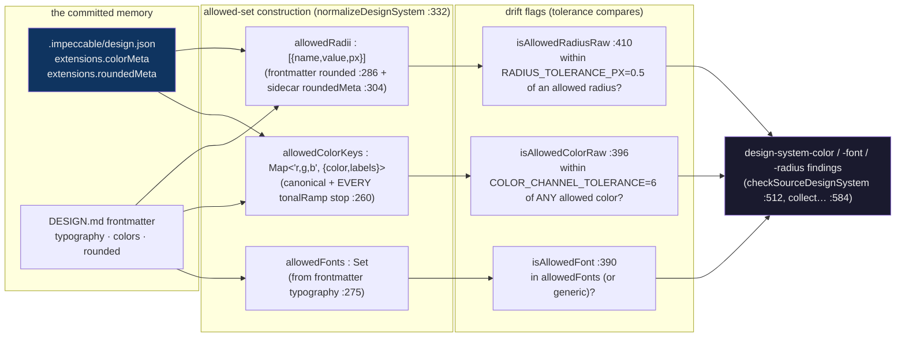

# Design-memory deep dive 06c — the enforcement reader: allowed-set construction, tolerance drift-flagging, the live merge, and the register conditioner

Companion to [`06-design-memory.md`](06-design-memory.md). That report is the
overview; [`06a`](06a-the-persisted-artifact.md) is the artifact, [`06b`](06b-generation-and-migration.md)
is how it is written. This one goes to the floor on **how the memory is read back
and turned into an enforcement contract**: how `cli/engine/design-system.mjs`
folds the sidecar into an allowed set, how it flags code that drifts off-system
within a tolerance, how the live server merges the raw sidecar with the parsed
prose into one panel response, and how a single `Register` field flips the whole
downstream doctrine including motion.

This is the most directly transferable slice for YoinkIt's payoff: the
**memory-as-linter** mechanism in [`06d`](06d-a-motion-json-for-yoinkit.md) §7 is
a near-line-for-line inversion of what this file does for colors and radii.

Sibling slices, so this one stays in its lane:
- the schema being read (the `extensions.colorMeta` / `roundedMeta` shapes) →
  [`06a`](06a-the-persisted-artifact.md)
- where `mdNewerThanJson` is computed and why it is a reader concern, plus the
  generation path that feeds the staleness loop → [`06b`](06b-generation-and-migration.md)
- the YoinkIt motion-linter and the measured `motion.json` it reads →
  [`06d`](06d-a-motion-json-for-yoinkit.md)

All `file:line` references are into [`../../source/cli/engine/design-system.mjs`](../../source/cli/engine/design-system.mjs)
(750 lines) unless the path says otherwise. Every line number was re-verified
against `source/` this session. The survey cited `design-system.mjs:260-419` for
the consumer/enforcer; that range is the *allowed-set + matchers* core and is
accurate, but the full enforcement story runs from the loader (`:358`) through the
emit functions (`:512`, `:584`), and this slice traces all of it.

**The inversion for this slice.** Impeccable's allowed set is an **authored
ideal** — the colors a human/LLM decided the project *should* use. Drift is "the
code deviated from the decided-good set; fix the code." YoinkIt's analog reads a
**measured vocabulary** — the easing/durations the site *actually* exhibits. Drift
is "a new animation deviated from what the site empirically does; the recreation
is unfaithful (or the site is inconsistent)." Same mechanism, opposite
truth-source: normative-by-authorship vs normative-by-observation (06d §7).

---

## 1. The reader is the proof that "memory is an enforcement contract"

The headline the survey gets exactly right: the design memory "is an enforcement
contract, not passive docs." `design-system.mjs` is the proof. It does three
things, in order, and the whole point is the third:

1. **Resolve** the sidecar and the prose (`loadDesignSystemForCwd:358-388`).
2. **Fold** them into an allowed set: allowed fonts, allowed colors, allowed radii
   (`normalizeDesignSystem:332-356`).
3. **Flag** any color / font / radius in real code that is **not** in (or within
   tolerance of) that set — emitting `design-system-color`, `design-system-font`,
   `design-system-radius` findings (`checkSourceDesignSystem:512`,
   `collectStaticDesignSystemFindings:584`).

The same three findings are surfaced by the hook on every edit
([`05`](../05-hook-system/05-hook-system.md)) and by `npx impeccable detect`. So
the committed `design.json` is not documentation an agent might read — it is the
**allow-list a deterministic linter enforces on every file the agent touches.**
That is the mechanism YoinkIt would invert into a motion-consistency linter.



---

## 2. Allowed-set construction: every `canonical` and every `tonalRamp` stop

### Sidecar resolution

`resolveDesignSidecarPath` (`:42-51`) tries three candidates in order and takes
the first that exists:

```js
const candidates = [
  path.join(cwd, '.impeccable', 'design.json'),   // the committed memory, first
  path.join(cwd, 'DESIGN.json'),
  path.join(contextDir, 'DESIGN.json'),
];
```

So `.impeccable/design.json` is the **first-priority** sidecar; the bare
`DESIGN.json` forms are the worked-example fallback ([`06a`](06a-the-persisted-artifact.md)
§6). The prose `DESIGN.md` is resolved separately (`resolveDesignMdPath:29-40`,
with `.agents/context` / `docs` fallbacks).

### Colors: the survey's central claim, verified

The survey: the reader "reads every `canonical` and `tonalRamp` stop into an
allowed-color set." Verified verbatim — `addSidecarColors:260-273`:

```js
function addSidecarColors(out, sidecar) {
  const colorMeta = sidecar?.extensions?.colorMeta;
  if (!colorMeta || typeof colorMeta !== 'object') return;

  for (const [name, meta] of Object.entries(colorMeta)) {
    if (!meta || typeof meta !== 'object') continue;
    if (typeof meta.canonical === 'string') addDesignColor(out, meta.canonical, `sidecar.${name}`);
    if (Array.isArray(meta.tonalRamp)) {
      for (const [index, value] of meta.tonalRamp.entries()) {
        if (typeof value === 'string') addDesignColor(out, value, `sidecar.${name}.tonalRamp[${index}]`);
      }
    }
  }
}
```

Two facts the survey's one-liner hides:

- **Every ramp stop is its own allowed color.** A token with a 25-stop
  `tonalRamp` ([`06a`](06a-the-persisted-artifact.md) §3a, `neutral-text`)
  contributes 25 allowed colors plus its `canonical` — 26 entries from one token.
  The memory's allowed-color set is therefore *much* larger than the token count;
  it is the union of every canonical and every synthesised ramp stop across all
  nine tokens. This is what makes the linter forgiving enough to be usable: the
  ramp pre-authorises the in-between shades a real UI uses.
- **Each color is keyed by quantised RGB, with the source labelled.**
  `addDesignColor:241-249` parses the value (`parseDesignColor:225-239`, which
  handles hex/rgb/oklch via `parseAnyColor` plus an HSL fallback), keys it by
  `r,g,b` (`colorKey:189-192`), and records *where it came from*
  (`sidecar.kinpaku-gold.tonalRamp[4]`). So a flagged drift can be explained
  against the nearest token. (YoinkIt's motion analog wants the same: when a
  recreation's easing is flagged, say which captured token it missed — 06d §7.)

### Fonts come from the **frontmatter**, not the sidecar (a nuance the survey skips)

`addTypographyFonts:275-284` reads `frontmatter.typography`, not the sidecar:

```js
function addTypographyFonts(out, typography) {
  if (!typography || typeof typography !== 'object') return;
  for (const role of Object.values(typography)) {
    ...
    for (const font of splitFontStack(role.fontFamily)) {
      if (!GENERIC_FONTS.has(font)) out.allowedFonts.add(font);
    }
  }
}
```

The sidecar's `typographyMeta` ([`06a`](06a-the-persisted-artifact.md) §3b) carries
only `displayName`/`purpose` — the *font families themselves* live in the
`DESIGN.md` frontmatter. So the allowed-font axis is fed by the prose file, while
the allowed-color and allowed-radius axes are fed by the sidecar
(`addSidecarColors:260`, `addSidecarRadii:304`) plus the frontmatter
(`addColorObject:251`, `addRoundedScale:286`). The enforcement reads from **both
halves of the memory at once** — which is exactly why the live panel must merge
them (§3).

### Radii: the sidecar `roundedMeta`, resolved to px

`addSidecarRadii:304-330` reads `sidecar.extensions.roundedMeta`, resolves each
`value`/`canonical` to pixels (`resolveLengthPx`), and pushes
`{name, value, px}` onto `allowedRadii` (`addRoundedToken:294-302`). It also sets
`hasPillRadius` when a token name/role looks like `full`/`pill`/`round` (`:326`),
which later lets any `border-radius >= 99px` pass as an intended pill (`:417`).

### The built object

`normalizeDesignSystem:332-356` assembles it:

```js
const out = {
  present: true,
  sourcePath, sidecarPath,
  mdNewerThanJson: input.mdNewerThanJson === true,   // computed in the loader, 06b §4
  allowedFonts: new Set(),
  allowedColorKeys: new Map(),
  allowedRadii: [],
  hasPillRadius: false,
};
// addTypographyFonts / addColorObject / addSidecarColors / addRoundedScale / addSidecarRadii
out.hasFonts  = out.allowedFonts.size > 0;
out.hasColors = out.allowedColorKeys.size > 0;
out.hasRadii  = out.allowedRadii.length > 0;
```

The `hasFonts`/`hasColors`/`hasRadii` flags are the **fail-open switch**: an axis
with an empty allowed set is **not enforced at all** (`isAllowedColorRaw:397`
returns "allowed" when `!hasColors`). This is the design-memory equivalent of "no
memory, no enforcement" — a thin memory enforces only the axes it actually
populated. YoinkIt wants the identical posture: a `motion.json` with no durations
captured yet does not flag duration drift (06d §7).

---

## 3. Drift-flagging by **tolerance**, not string equality — the transferable core

This is the single idea YoinkIt should lift. Code is **not** required to match a
token's literal string; it must fall **within a tolerance** of an allowed value.
Two constants set the tolerances (`:10-11`):

```js
const COLOR_CHANNEL_TOLERANCE = 6;   // RGB channels
const RADIUS_TOLERANCE_PX = 0.5;     // pixels
```

### Color: within 6 channels of *any* allowed color

`isAllowedColorRaw:396-408`:

```js
function isAllowedColorRaw(raw, designSystem) {
  if (!designSystem?.hasColors) return true;                 // axis unpopulated → no enforcement
  const text = String(raw || '').trim().toLowerCase();
  if (!text || text === 'transparent' || text === 'currentcolor' || text === 'inherit' || text === 'initial') return true;
  if (text.includes('var(')) return true;                    // tokens-by-reference always pass
  const parsed = parseDesignColor(text);
  if (!parsed) return true;                                  // unparseable → fail open
  if ((parsed.a ?? 1) <= 0.05) return true;                  // ~transparent → ignore
  for (const entry of designSystem.allowedColorKeys.values()) {
    if (colorsClose(parsed, entry.color)) return true;       // within 6 channels of ANY allowed color
  }
  return false;                                              // otherwise: off-system drift
}
```

`colorsClose:194-201` is the tolerance test: max per-channel delta `<= 6`. So
`#1f1a15` passes if any token color or ramp stop is within 6 of it on each of
R/G/B. The memory does not demand the code spell a color the same way the token
does — it demands the code stay *near* an authorised color. **This is the same
move report [`05c`](../05-hook-system/05c-config-and-ignore-model.md) §3 found in
the hook's ignore model** (a whole CSS color parser so `#fff` matches
`rgb(255,255,255)`), here applied to the allow-set instead of the ignore-set.

### Radius: within 0.5px, with a pill escape hatch

`isAllowedRadiusRaw:410-419`:

```js
function isAllowedRadiusRaw(raw, designSystem) {
  if (!designSystem?.hasRadii) return true;
  const text = String(raw || '').trim().toLowerCase();
  if (!text || text === '0' || text === 'none' || ...) return true;
  if (text.includes('var(') || text.includes('%')) return true;
  const px = resolveLengthPx(text, 16);
  if (px == null || !Number.isFinite(px) || px <= RADIUS_TOLERANCE_PX) return true;
  if (designSystem.hasPillRadius && px >= 99) return true;     // any big radius is "the pill"
  return designSystem.allowedRadii.some(entry => Math.abs(entry.px - px) <= RADIUS_TOLERANCE_PX);
}
```

The pill escape (`:417`) is a domain rule: once the memory has *a* pill radius,
any `>= 99px` is treated as intentionally round. YoinkIt's motion analog has
direct equivalents: a captured `loop` easing of `linear` should pass any near-zero
deviation; a "spring/bounce" family token should admit a band of overshoot, not a
single curve (06d §7).

### The findings the flags emit

When a value fails its flag, the reader emits a structured finding. From the
source-text path (`checkSourceDesignSystem:547-559`):

```js
findings.push(makeDesignFinding(
  'design-system-color', filePath,
  `Undocumented color ${raw} is outside DESIGN.md colors`,
  lineNum, { ignoreValue: raw },
));
```

and from the live/jsdom DOM path (`collectStaticDesignSystemFindings:627-633`):

```js
`${kind} ${label} on ${tag}${sampleText(el)} is outside DESIGN.md colors`
```

Three rule ids — `design-system-color`, `design-system-font`,
`design-system-radius` — each carrying an `ignoreValue` so the suppression model
([`05c`](../05-hook-system/05c-config-and-ignore-model.md) §3) can scope an
exception. **This is the literal output of "memory becomes a linter."** YoinkIt's
analog emits, e.g., `motion-off-vocabulary` with the captured token it missed
(06d §7).

### Dedup by parsed value, so format doesn't multiply findings

`canonicalDesignFindingKey:681-702` keys a color finding by its **parsed**
`colorKey`, a radius finding by its **rounded px**, and a font finding by its
**normalized name** — so the same drift reported as `#fff` and
`rgb(255,255,255)` collapses to one finding (`mergeDesignSystemFindings:704-722`).
The reader treats a color/duration as a *value*, not a *string*, on both the
allow side and the dedup side. YoinkIt's motion memory needs the identical
discipline so `ease-out` and `cubic-bezier(0,0,0.58,1)` are one easing, not two
(06d §3, §7).

---

## 4. The live merge: raw sidecar + parsed prose in one response

The survey: the live panel server "reads it raw and merges it with parsed
`DESIGN.md` into one response (`skill/scripts/live-server.mjs:538-600`)." Verified;
the precise handler is `:537-596`. The `/design-system.json` endpoint:

```js
const response = {
  present: true,
  hasMd: !!mdStat,
  hasSidecar: !!jsonStat,
  mdNewerThanJson: !!(mdStat && jsonStat && mdStat.mtimeMs > jsonStat.mtimeMs + 1000),  // :574
};
if (mdStat)   { try { response.parsed  = parseDesignMd(fs.readFileSync(mdPath, 'utf-8')); } catch (err) { response.parseError  = err.message; } }
if (jsonStat) { try { response.sidecar = JSON.parse(fs.readFileSync(jsonPath, 'utf-8')); } catch (err) { response.sidecarError = '...' + err.message; } }
```
([`live-server.mjs:570-591`](../../source/skill/scripts/live-server.mjs))

The merged contract, documented in the handler's own comment
([`live-server.mjs:538-546`](../../source/skill/scripts/live-server.mjs)):

```
{ present, parsed, sidecar, hasMd, hasSidecar, mdNewerThanJson, parseError?, sidecarError? }
```

Three things to read off it:

- **The two halves are returned side by side, not pre-merged.** `parsed` is the
  structured prose (frontmatter + the six canonical sections, via `parseDesignMd`);
  `sidecar` is the **raw** `design.json` object. The *panel* (`live-browser.js`)
  does the visual merge — rendering swatches from `sidecar.extensions.colorMeta`,
  prose from `parsed`, components into a shadow DOM. The server's job is to hand
  over both plus the staleness flag.
- **`mdNewerThanJson` is recomputed here independently** (`:574`), the same
  mtime+1000ms heuristic as the loader ([`06b`](06b-generation-and-migration.md) §4,
  `design-system.mjs:386`). Two readers, one heuristic, no shared helper — a small
  duplication of the kind [`05c`](../05-hook-system/05c-config-and-ignore-model.md)
  §5 documents elsewhere. The panel renders a stale hint when it is true
  ([`live-browser.js:10474`](../../source/skill/scripts/live-browser.js)).
- **Parse failures are reported, not fatal.** A malformed sidecar yields
  `sidecarError` and the panel still renders the prose. Fail-open, like everything
  in this subsystem.

For YoinkIt: a `motion.json` panel/endpoint should return the same shape — the raw
measured memory, any human-intent prose beside it, and a `sourceChangedSinceCapture`
flag — so a "motion memory" panel can render the captured timelines next to the
human Notes, exactly as Impeccable renders swatches next to rules (06d §5, §8).

---

## 5. The register taxonomy: a one-field conditioner that flips motion doctrine

The memory is not the only conditioner. A second, one-field input — `Register` —
flips the entire downstream doctrine, including how a *measured* motion value
should be judged. This is the seed of YoinkIt's "motion register" idea (06d §6).

### The field

`PRODUCT.md` carries a bare `## Register` heading and a one-word value. In the
worked example (`demos/landing-demo/PRODUCT.md`):

```md
## Register

brand
```
(heading [`PRODUCT.md:3`](../../source/demos/landing-demo/PRODUCT.md), value `brand`
at [`PRODUCT.md:5`](../../source/demos/landing-demo/PRODUCT.md); line 4 blank).

(Correction: the survey cites `PRODUCT.md:3-5`. As a span that is fine, but the
load-bearing value `brand` is specifically on `:5`; `:3` is the heading. And the
demo's value is **`brand`**, worth stating since it is what makes the demo's
ambitious motion on-doctrine.)

### The two motion doctrines it switches between

`brand.md` permits ambitious orchestration — the `## Motion` section is a single
bullet:

```md
- One well-orchestrated page-load beats scattered micro-interactions, when the
  brand invites it. Some brands skip entrance motion entirely; the restraint is
  the voice.
```
(heading [`brand.md:86`](../../source/skill/reference/brand.md), bullet `:88`),
reinforced under permissions: "Ambitious first-load motion. Reveals and
typographic choreography that earn their place" ([`brand.md:105`](../../source/skill/reference/brand.md)).
**brand.md sets no duration ceiling** — its motion doctrine is entirely qualitative.

`product.md` mandates restraint — the only hard numeric motion prescription in
either file:

```md
- 150–250 ms on most transitions. Users are in flow; don't make them wait for choreography.
- Motion conveys state, not decoration. State change, feedback, loading, reveal: nothing else.
- No orchestrated page-load sequences. Product loads into a task; users don't want to watch it load.
```
(heading [`product.md:38`](../../source/skill/reference/product.md), bullets
`:40`, `:41`, `:42`).

(Correction: the durations are `150–250 ms` — en-dash, space before `ms` — and the
three bullets are specifically `:40-42`, not the whole `:38-42` span the survey
quoted. The section heading is `:38`.)

The survey's framing holds and is worth keeping verbatim: **the same captured
1200ms reveal means "the point" on a brand hero (`brand.md:88,105`) and "a bug to
fix" on a product button (`product.md:40,42`, ~5–8× over the band).** The word
*choreography* is a virtue in brand (`:105`) and the thing to avoid in product
(`:40`).

### How the field is consumed (correction: it is the third-priority signal)

The survey calls `Register` a "one-field conditioner." Precise, but the field is
**not an override** — it is the lowest-priority of three signals. Per the upstream
`source/CLAUDE.md` ("Architecture" / "Register" sections, read this session):

> SKILL.md's Setup section selects one based on the **task cue**, the **surface in
> focus**, or the **`register` field in PRODUCT.md** (first match wins).

So resolution order is: task cue → surface in focus → the field. The `Register`
value only decides when the first two are absent or agree. And `animate` is
explicitly **one of seven** sub-commands where the register "meaningfully
diverges" (`typeset, animate, bolder, delight, colorize, layout, quieter`). The
"one-field conditioner" claim is true for the demo's situation (no cue, no
surface), but a YoinkIt copy should know it is a *fallback* signal, not a switch
that always fires.

### Why this matters to a measured motion memory

A measured duration is a *fact*; whether to **preserve or normalise** it is a
*judgment*, and Impeccable shows that judgment can hang off a single tag. YoinkIt
already owns the right native vocabulary for this — `Signature` vs incidental, and
the `importance: signature/useful/polish/ignore` enum on human Notes (CONTEXT.md)
— so its "motion register" is per-motion (preserve the signature 1200ms reveal,
normalise the incidental 1200ms button) rather than per-site brand/product. 06d §6
builds the tag on YoinkIt's own terms; the lesson borrowed here is only the
**shape**: one tag, read late, that conditions whether a measured value is
load-bearing.

---

## What this means for YoinkIt

- **ADOPT the allowed-set → tolerance-flag mechanism, inverted.** Read the
  measured `motion.json` into an allowed *motion* vocabulary (easings, durations,
  triggers the site actually uses), then flag a *new* capture or a recreation that
  falls outside it — comparing easing curves and durations **within a tolerance**,
  exactly as `isAllowedColorRaw` compares within `COLOR_CHANNEL_TOLERANCE` and
  `isAllowedRadiusRaw` within `RADIUS_TOLERANCE_PX`. Build the easing/duration
  comparator once, in the shared engine. *Ref: `addSidecarColors:260`,
  `isAllowedColorRaw:396`, `isAllowedRadiusRaw:410`; the full linter in 06d §7.*
- **ADOPT fail-open per axis.** Enforce only the axes the memory populated
  (`hasColors`/`hasRadii` gate every flag). A `motion.json` with no captured
  durations must not flag duration drift. *Ref: `normalizeDesignSystem:352-354`,
  `isAllowedColorRaw:397`.*
- **ADOPT value-not-string keys for dedup and matching.** `canonicalDesignFindingKey`
  keys by parsed color / rounded px / normalized font so format never multiplies
  findings. YoinkIt's easing/duration keys must be semantic so `ease-out` and its
  bezier are one token. *Ref: `:681-702`.*
- **ADOPT the live merge contract for a motion panel.** Return `{ present, parsed
  (human Notes), sidecar (measured memory), hasMemory, sourceChangedSinceCapture,
  parseError?, memoryError? }` and let the panel render timelines beside intent.
  *Ref: `live-server.mjs:537-596`.*
- **EXPLORE a per-motion register tag, on YoinkIt's own terms.** Borrow the *shape*
  (one late-read tag conditions preserve-vs-normalise), not the brand/product
  content — YoinkIt's native axis is `signature`/incidental and the existing
  `importance` enum. *Ref: §5; CONTEXT.md Signature/Note; 06d §6.*
