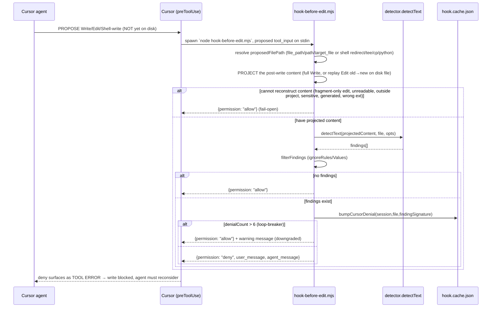

# Impeccable Audit — Subsystem 06: The Hook System + Config Model

> Deep technical audit of how Impeccable wires its deterministic design detector
> into provider-native agent hooks, and the per-project config model that governs
> them. Framed throughout toward **what YoinkIt can steal** for wiring its own
> deterministic checks (capture-spec validation, motion-coverage gates) into
> Claude Code / Codex / Cursor harness hooks.
>
> All paths relative to `/home/martin/src/perso/yoinkit/audit/impeccable/source/`.

---

## Orientation

Impeccable ships a single skill (`/impeccable`) plus a small set of **provider-native
hook manifests** that the agent harness executes automatically on file edits. There
are two distinct hook *models*, not one. Claude Code and Codex use a **post-edit**
hook (`PostToolUse`): the agent's edit lands, then `hook.mjs` runs the detector
against the touched file(s) and injects findings back into the next model turn as a
developer-role system reminder — advisory, never blocking, always exit 0. Cursor uses
a **pre-write blocking** hook (`preToolUse`): `hook-before-edit.mjs` reconstructs the
*proposed* file content before it lands, runs the same detector, and returns
`{permission: "deny"}` to stop the write when findings exist. Both share one library
(`hook-lib.mjs`) and one config model rooted at `.impeccable/config.json` (team-shared)
+ `.impeccable/config.local.json` (gitignored, per-developer). The whole design is built
around one contract: **the hook must never break the agent's turn** — every failure
path swallows and allows/exits-0.

---

## File map

| File | Role |
|---|---|
| [`skill/scripts/hook.mjs`](../source/skill/scripts/hook.mjs) | Post-edit entry (Claude/Codex). Thin stdin→`runHook`→stdout adapter. 61 lines. |
| [`skill/scripts/hook-before-edit.mjs`](../source/skill/scripts/hook-before-edit.mjs) | Cursor pre-write blocking gate. Self-contained (parses proposed content, denies). 477 lines. |
| [`skill/scripts/hook-lib.mjs`](../source/skill/scripts/hook-lib.mjs) | Shared, unit-testable core: config read, finding filter, dedup, render, cache, detector loader, `runHook`. 1527 lines. |
| [`skill/scripts/hook-admin.mjs`](../source/skill/scripts/hook-admin.mjs) | `/impeccable hooks <on\|off\|status\|ignore-*\|reset>` CLI. Edits config + repairs manifests. 637 lines. |
| [`skill/reference/hooks.md`](../source/skill/reference/hooks.md) | Agent-facing docs for the `/impeccable hooks` command + intentional-finding policy. |
| [`scripts/lib/transformers/hooks.js`](../source/scripts/lib/transformers/hooks.js) | Build-time manifest *generators* (one per provider + plugin variant). |
| [`scripts/lib/transformers/factory.js`](../source/scripts/lib/transformers/factory.js#L308) | Emits each provider's manifest during `bun run build` (gated by `config.emitHooks`). |
| [`scripts/lib/transformers/providers.js`](../source/scripts/lib/transformers/providers.js#L19) | Per-provider `emitHooks` flag (`'cursor'` / `'claude'` / `'codex'`). |
| [`scripts/build.js`](../source/scripts/build.js#L407) | `syncRootHookManifests` (release sync) + plugin `hooks/hooks.json` writer. |
| [`cli/bin/commands/skills.mjs`](../source/cli/bin/commands/skills.mjs#L89) | `npx impeccable skills install/update` — copies manifests into the project, consent prompt, dedup/merge. |
| [`cli/lib/impeccable-config.mjs`](../source/cli/lib/impeccable-config.mjs) | CLI-side config reader/writer (duplicate of hook-lib's config slice) + `getHookConsent`/`setHookConsent`. |
| [`skill/scripts/lib/impeccable-paths.mjs`](../source/skill/scripts/lib/impeccable-paths.mjs) | `.impeccable/` path layout (design sidecar, live config). |
| [`skill/scripts/lib/is-generated.mjs`](../source/skill/scripts/lib/is-generated.mjs) | git-ignore + header-marker "is this file generated?" check (used by `live-*`, NOT the hook). |
| [`.claude/settings.json`](../source/.claude/settings.json) · [`.codex/hooks.json`](../source/.codex/hooks.json) · [`.cursor/hooks.json`](../source/.cursor/hooks.json) · [`plugin/hooks/hooks.json`](../source/plugin/hooks/hooks.json) | The four installed/bundled manifests. |
| [`.impeccable/config.json`](../source/.impeccable/config.json) | The live unified config model (`hook` + `detector` keys). |
| [`cli/engine/detect-antipatterns.mjs`](../source/cli/engine/detect-antipatterns.mjs) | The detector engine. Re-exports `detectText`, `detectHtml`, `loadDesignSystemForCwd` (the hook's call surface). Engine internals covered by another agent. |

> Note: the repo mirrors the canonical `skill/scripts/` tree into every provider
> directory (`.claude/skills/impeccable/scripts/`, `.cursor/...`, `.agents/...`,
> `.gemini/...`, etc.) as committed distribution artifacts. They are generated, not
> authored — edit `skill/scripts/` and `bun run build:release` regenerates the rest.
> This audit reads the canonical source.

---

## Diagram 1 — Post-edit surface hook (Claude Code / Codex)

```mermaid
sequenceDiagram
    participant Agent as Agent (Claude/Codex)
    participant Harness as Harness (PostToolUse)
    participant Hook as hook.mjs
    participant Lib as hook-lib.runHook()
    participant Det as detector.detectText/Html
    participant Cache as .impeccable/hook.cache.json

    Agent->>Harness: Edit / Write / MultiEdit (apply_patch on Codex) lands ON DISK
    Note over Agent,Harness: file already written — edit is NOT gated
    Harness->>Hook: spawn `node hook.mjs`, event JSON on stdin
    Hook->>Hook: snapshot env; set IMPECCABLE_HOOK_DEPTH=1 (re-entrancy guard)
    Hook->>Lib: runHook({stdinJson, env, cwd})
    Lib->>Lib: parse event → resolve harness, target file(s)
    Lib->>Lib: skip gates: sensitive / generated / ext / ignoreFiles / missing
    Lib->>Cache: bumpEditCount(session,file) — suppress after >6 edits
    Lib->>Det: detectText(content, file, {designSystem})
    Det-->>Lib: findings[]
    Lib->>Lib: filterFindings (ignoreRules/Values) → dedupeAgainstCache
    Lib->>Cache: rememberFindings(fresh) ; persistCache (gc >8 sessions)
    alt fresh findings
        Lib-->>Hook: stdout = {hookSpecificOutput.additionalContext: "[impeccable@1] ...fix these..."}
    else known-but-unfixed
        Lib-->>Hook: pending re-nudge ack
    else clean UI file
        Lib-->>Hook: clean ack (unless quiet)
    end
    Hook->>Hook: writeAuditLog ; exit 0 (ALWAYS)
    Hook-->>Harness: additionalContext
    Harness-->>Agent: injected as developer-role context in NEXT turn
    Note over Agent: agent reads findings, fixes or justifies, surfaces in reply
```

## Diagram 2 — Pre-write blocking hook (Cursor)



**The core difference.** Post-edit (Claude/Codex) is a *reactive surface*: the byte is
already on disk, the hook can only push a reminder into the next turn, and it leans on
the model's cooperation to act on it. Pre-write (Cursor) is a *proactive gate*: the
hook must *reconstruct* what the file would contain (Cursor doesn't hand you the result,
only the operation), and a `deny` actually prevents the write — the bad content never
lands. Post-edit therefore optimizes for "keep nudging without nagging" (dedup +
pending re-nudge + clean acks + edit-count suppression). Pre-write optimizes for "block
once, then yield" (per-signature denial counter that downgrades to allow after 6 repeats
so the agent can't get stuck). Same detector, same config, opposite control posture.

---

## 1. The two hook models

### 1a. Post-edit surface — Claude Code & Codex

Claude's installed manifest (`.claude/settings.json:3-17`):

```json
"hooks": {
  "PostToolUse": [
    { "matcher": "Edit|Write|MultiEdit",
      "hooks": [
        { "type": "command",
          "command": "node \"${CLAUDE_PROJECT_DIR}/.claude/skills/impeccable/scripts/hook.mjs\"",
          "timeout": 5, "statusMessage": "Checking UI changes" } ] }
  ]
}
```

Codex's (`.codex/hooks.json:3-17`) is the same shape with two differences — the matcher
includes `apply_patch` (Codex's patch tool) and the command resolves the project root via
`$(git rev-parse --show-toplevel)` instead of `${CLAUDE_PROJECT_DIR}`, under `.agents/`:

```json
"matcher": "Edit|Write|apply_patch",
"command": "node \"$(git rev-parse --show-toplevel)/.agents/skills/impeccable/scripts/hook.mjs\""
```

Both point at the **same `hook.mjs`**. The harness distinction is recovered at runtime,
not by separate scripts — `resolveHarness` (`hook-lib.mjs:959`) returns `'claude'` for
both Claude and Codex (they speak the same `hookSpecificOutput.additionalContext`
envelope) and only treats Cursor differently when `event.conversation_id` is present or
`IMPECCABLE_HOOK_HARNESS=cursor`:

```js
export function resolveHarness(env = {}, event = null) {
  const explicit = env?.IMPECCABLE_HOOK_HARNESS;
  if (explicit === 'cursor') return 'cursor';
  if (explicit === 'claude' || explicit === 'codex') return 'claude';
  if (typeof event?.conversation_id === 'string' && event.conversation_id) return 'cursor';
  return 'claude';
}
```

The Codex `apply_patch` case is why `resolveTargetFiles` (`hook-lib.mjs:935`) parses the
raw patch body: Codex exposes the touched files only inside `tool_input.command`, not
`tool_input.file_path`, so `parseApplyPatchPaths` (`:923`) scans for
`*** Update File:` / `*** Add File:` lines.

### 1b. Pre-write block — Cursor

Cursor's manifest (`.cursor/hooks.json`):

```json
{ "version": 1,
  "hooks": {
    "preToolUse": [
      { "command": "node \".cursor/skills/impeccable/scripts/hook-before-edit.mjs\"",
        "timeout": 5 } ] } }
```

Different event (`preToolUse` vs `PostToolUse`), different script
(`hook-before-edit.mjs`), different schema (top-level `version: 1`, no `matcher`, no
`type: "command"`, no `statusMessage`). The header comment states the *why*
(`hook-before-edit.mjs:4-6`): "Cursor's stop hook is not consistently dispatched by the
headless agent, so this hook checks proposed Write/Edit content before it lands."

The provider→model mapping is declared once in `scripts/lib/transformers/providers.js`:
`cursor` → `emitHooks: 'cursor'` (`:19`), `claude` → `'claude'` (`:30`), `codex` →
`'codex'` (`:51`). No other provider sets `emitHooks`, so Gemini/Trae/OpenCode/etc. get
the skill but **no hook**.

---

## 2. How a hook is wired per provider

### 2a. Manifest generation (`scripts/lib/transformers/hooks.js`)

This file is the single source of the manifest JSON. Four builders, each returning a
plain object; constants pin the command strings (`:21-26`):

```js
const CLAUDE_PROJECT_HOOK = '${CLAUDE_PROJECT_DIR}/.claude/skills/impeccable/scripts/hook.mjs';
const CLAUDE_PLUGIN_HOOK  = '${CLAUDE_PLUGIN_ROOT}/skills/impeccable/scripts/hook.mjs';
const CODEX_PROJECT_HOOK  = '$(git rev-parse --show-toplevel)/.agents/skills/impeccable/scripts/hook.mjs';
const CURSOR_BEFORE_EDIT_SCRIPT = '.cursor/skills/impeccable/scripts/hook-before-edit.mjs';
```

- `buildClaudeSettingsManifest()` (`:28`) → project install (`${CLAUDE_PROJECT_DIR}`-relative).
- `buildClaudePluginHooksManifest()` (`:53`) → **identical schema** but `${CLAUDE_PLUGIN_ROOT}`-relative, so a marketplace `/plugin install` resolves the hook wherever Claude unpacks the plugin (no `.claude/skills/` assumption). Comment `:49-52`.
- `buildCodexHooksManifest()` (`:74`) → `apply_patch` matcher, git-toplevel command.
- `buildCursorHooksManifest()` (`:95`) → `version: 1` + `preToolUse`.
- `hooksJsonFor(provider)` (`:109`) → switch dispatch (`claude`/`codex`/`cursor` → builder, else `null`).

There is a **third, independent copy** of these manifest objects hardcoded inside
`hook-admin.mjs` (`HOOK_MANIFEST_TARGETS`, `:48-112`) used by `/impeccable hooks on` to
repair manifests at runtime. They are byte-for-byte the same shape but maintained
separately from `transformers/hooks.js`. (See Finding 4.)

### 2b. Exact command each provider runs

| Provider | Event | Matcher | Command (verbatim) |
|---|---|---|---|
| Claude Code (project) | `PostToolUse` | `Edit\|Write\|MultiEdit` | `node "${CLAUDE_PROJECT_DIR}/.claude/skills/impeccable/scripts/hook.mjs"` |
| Claude Code (plugin) | `PostToolUse` | `Edit\|Write\|MultiEdit` | `node "${CLAUDE_PLUGIN_ROOT}/skills/impeccable/scripts/hook.mjs"` |
| Codex | `PostToolUse` | `Edit\|Write\|apply_patch` | `node "$(git rev-parse --show-toplevel)/.agents/skills/impeccable/scripts/hook.mjs"` |
| Cursor | `preToolUse` | (none) | `node ".cursor/skills/impeccable/scripts/hook-before-edit.mjs"` |

All four set `timeout: 5` (seconds). Claude/Codex add `statusMessage: "Checking UI changes"`.

### 2c. Install / update placement

Three placement paths exist:

1. **Build emission** — `factory.js:308-315`: during `bun run build`, when a provider's
   `config.emitHooks` is set, `hooksJsonFor(config.emitHooks)` is written to
   `<providerDir>/<configDir>/<hooksManifestRel || hooks/hooks.json>`. This produces the
   committed bundle manifests.

2. **Release root sync** — `build.js:407` `syncRootHookManifests()` writes each provider's
   manifest to the repo-root harness dirs (`.claude/settings.json` etc.), and `build.js:758`
   writes the plugin variant to `plugin/hooks/hooks.json`. (Only on `build:release`.)

3. **Project install (the live path)** — `npx impeccable skills install`,
   `cli/bin/commands/skills.mjs`. This is where manifests land in a *user's* project:
   - `PROVIDER_HOOK_ARTIFACTS` (`:89-106`) maps the bundled manifest to its install
     destination. The Claude entry is the subtle one (`:96`):
     ```js
     { sourceProvider: '.claude', rel: 'settings.json', destProvider: '.claude', destRel: 'settings.local.json' }
     ```
     The bundle ships `settings.json`, but the installer writes it to the **gitignored
     `.claude/settings.local.json`** so the hook stays machine-local and isn't committed
     to a team repo. Cursor/Codex install to their `hooks.json` directly (`:99`,`:104`).
   - `copyProviderHooks()` (`:1259`) does the actual copy with three smart behaviors:
     - **Leave-it-never-duplicate** (`:1271-1274`): if the user already has the hook in
       the team-shared `settings.json`, prune any stale copy from `settings.local.json`
       and skip — otherwise Claude would load both and run the detector twice per edit.
     - **Merge, don't clobber** (`:1282-1293`): if a destination manifest exists, parse
       it and `mergeHookManifests(existing, fresh)` (preserve the user's other hooks,
       strip prior Impeccable entries, append the fresh one). Malformed JSON → `.bak`
       backup under `--force`, else throw with a clear message.
   - **Consent gate** — `decideHookInstall()` (`:1317-1335`): prompts once (default Yes),
     records `hook.consent: "accepted"|"declined"` to `config.local.json` via
     `setHookConsent`, and never re-asks. `declined` short-circuits; an already-installed
     hook is treated as accepted; non-interactive (`-y` / no TTY) keeps install-by-default
     without recording a re-promptable decision.

`/impeccable hooks on` (`hook-admin.mjs setEnabled`, `:282`) is the fourth way: it sets
`hook.enabled: true`, records local consent, and calls `repairHookManifests` (`:309`) to
re-install/merge manifests for any provider whose skill folder is present — using the
`hook-admin.mjs`-local manifest copies.

---

## 3. The hook runtime

### 3a. `hook.mjs` (post-edit) — the thin adapter

`hook.mjs` is deliberately tiny (61 lines). It (1) **snapshots inherited env first** then
sets `IMPECCABLE_HOOK_DEPTH=1` so the re-entrancy guard checks the *parent's* value not the
one it just exported (`:26-30`), (2) reads stdin, (3) calls `runHook`, (4) writes the audit
log, (5) writes stdout and `process.exit(0)`. The top-level `.catch` (`:47-61`) is a
last-ditch: audit-log the error and **still exit 0**. The doc comment states the contract:
"never break a turn. Always exit 0."

All real logic is in `hook-lib.runHook()` (`:1274-1517`), split out so it's unit-testable
without a subprocess. The pipeline, in order:

1. **Re-entrancy guard** (`:1280`): if `IMPECCABLE_HOOK_DEPTH` or `CLAUDE_HOOK_DEPTH` is
   set (a hook-spawned edit), return immediately. Prevents infinite loops if the hook's
   own activity ever triggered another edit event.
2. **Kill switch** (`:1284`): `IMPECCABLE_HOOK_DISABLED` truthy → skip.
3. **Parse event** (`:1290-1298`): malformed/empty stdin → skip (exit 0).
4. **Resolve harness + normalize event** (`:1300-1301`), then **resolve target files**
   (`:1306`) via `resolveTargetFiles` (handles `apply_patch` patch bodies, `file_path`,
   Cursor's `path`, top-level `file_path`). `expandScanTargets` (`:1308`,`:1084`) adds
   **co-located/imported stylesheets** (up to `MAX_SCAN_TARGETS = 6`): a `Button.tsx`
   edit also scans `Button.css`, `styles.css`, `globals.css`, and `@import`-ed sheets so
   a JSX patch can't report "clean" while the sibling stylesheet still has `Inter`/bounce.
5. **Config gate** (`:1316`): `readConfig(projectCwd)`; `enabled === false` → skip.
6. **Per-file loop** (`:1338-1413`) with skip reasons recorded for the audit:
   - path traversal / `SENSITIVE_PATH` → `sensitive`
   - `GENERATED_PATH` → `generated`
   - extension not in `ALLOWED_EXTS` → `extension`
   - `ignoreFiles` glob match → `config-ignore-file`
   - file doesn't exist → `file-missing`
   - **edit-count suppression** (`:1367-1380`): only primary (directly-edited) files
     `bumpEditCount`; after `EDIT_COUNT_THRESHOLD = 6` edits in a session, suppress (emit
     a one-time suppression notice the moment the threshold is crossed).
   - **call the detector** (`:1385-1389`): HTML files use `detectHtml(filePath, opts)`,
     everything else `detectText(content, filePath, opts)`. Each wrapped in try/catch →
     `detectorThrew`, never propagates.
   - `filterFindings` (ignoreRules/ignoreValues) → `dedupeAgainstCache` (session cache) →
     `rememberFindings`. Fresh findings collect into `freshGroups`.
7. **Emission priority** (`:1417-1509`): fresh findings (grouped render) > detector-threw
   (silent) > quiet-mode (silent) > pending re-nudge (UI files only) > suppression notice >
   clean ack (UI files only). Plain `.ts`/`.js` are in `ALLOWED_EXTS` but **not** `ACK_EXTS`
   (`:46-54`), so they're scanned but stay silent unless something is found —
   `shouldEmitAckForFile` gates the acks.

The **output envelope** is provider-shaped by `payload()` (`:1519-1526`):

```js
export function payload(text, eventName = 'PostToolUse', harness = 'claude') {
  if (harness === 'cursor') return JSON.stringify({ additional_context: text });
  return JSON.stringify({ hookSpecificOutput: { hookEventName: eventName, additionalContext: text } });
}
```

Every emitted message is prefixed `[impeccable@1]` (`ENVELOPE_PREFIX`, `:44`) so the model
can recognize hook context. The **directive footer** (`directiveFooter`, `:1254-1266`) is
worth reading in full — it's a carefully tuned prompt: imperative not advisory ("Handle
these before finalizing"), an explicit judgment clause ("A finding is not automatically a
defect; literal or domain-appropriate motion, intentional demos or fixtures... can be
valid as-is"), and an acknowledgement instruction so the resolution surfaces in the
model's reply (the user never sees the raw envelope).

**Exit code:** always 0. Post-edit findings are *context injection*, never a turn break.

### 3b. `hook-before-edit.mjs` (Cursor) — the blocking gate

This script is self-contained and does the hard work the post-edit path doesn't need:
**reconstructing the proposed file content** before it exists on disk. `proposedContent`
(`:84-105`) tries, in order:
- direct `content` / `streamContent` / `text` (a full Write),
- `projectedEditContent` (`:115-142`): read the *current* on-disk file and replay the
  Edit's `old_string`→`new_string` (or each `edits[]` entry) to project the post-write
  state via `replaceOnce` (`:151`). If the old string isn't found, or the file is
  unreadable/sensitive/generated, it returns a `{skipped: ...}` sentinel.
- shell-write reconstruction: `shellHereDocContent` (heredocs `:266`), `shellPythonWriteContent`
  (`.write_text`/`open(...,'w')` `:278`), `shellCopiedFileContent` (`cp src dest` reads the
  source `:226`), with destinations parsed from `>`, `>>`, `tee`, `cp`, python
  (`shellWriteDestination` `:182`). This is how Cursor's pre-write gate covers an agent
  writing UI via a shell command, not just the Write tool.

The decision flow in `main()` (`:365-469`):
- env-disabled / malformed / empty → **allow** (fail-open).
- resolve file path; reject if no path / outside project / sensitive / generated / wrong
  ext / ignored file / config-disabled → **allow** (each with an audit `skipped` reason).
- "fragment-only edit" (an `Edit` with no resolvable projected content) → **allow** with
  `skipped: 'fragment-only-edit'`. **This is a real coverage gap**: a targeted `Edit` whose
  `old_string` can't be located, or a multi-edit with only fragments, is allowed through
  unchecked.
- run `detectText(content, filePath, scanOptions)`; detector throws → **allow**.
- `filterFindings` empty → **allow**.
- findings exist → `bumpCursorDenial` (`:351`) increments a per-(session,file,
  finding-signature) counter, then:
  - **loop-breaker** (`:444-459`): if `denial.count > EDIT_COUNT_THRESHOLD` (6), **allow**
    with a warning ("this is the Nth repeated denial... Impeccable is allowing this write
    to avoid a loop"). Prevents the agent from getting stuck re-proposing the same write.
  - else **deny** (`:460`) with `{permission: "deny", user_message, agent_message}`.

The block message (`cursorBlockMessage`, `:335-342`) reuses `renderTemplate` but rewrites
the header to "Impeccable design hook blocked this write before it landed," and clamps to
4000 chars. **Blocking semantics:** the `deny` permission is surfaced to the agent as the
tool's *error*, so it sees the findings and can reconsider before the write lands (docs
`hooks.md:13`).

**Exit code:** always 0; the *block* is expressed via the JSON `permission` field, not a
non-zero exit. The top-level `.catch` (`:471-476`) defaults to `{permission: "allow"}`.

### 3c. Which file changed — input parsing summary

| Source | Field read | Code |
|---|---|---|
| Claude Edit/Write/MultiEdit | `tool_input.file_path` | `resolveTargetFiles` `hook-lib.mjs:946` |
| Codex `apply_patch` | parse `tool_input.command` patch body | `parseApplyPatchPaths` `:923` |
| Cursor Write/StrReplace | `tool_input.path` / `target_file` | `resolveTargetFiles` `:950`, `proposedFilePath` `before-edit:74` |
| Cursor shell write | `>`/`tee`/`cp`/python in `command` | `shellWriteDestination` `before-edit:182` |

---

## 4. The config model

### 4a. Two files, one unified schema

- **`.impeccable/config.json`** — team-shared, committed. Holds `hook` (runtime/lifecycle)
  and `detector` (ignore filters).
- **`.impeccable/config.local.json`** — per-developer, **gitignored via `.git/info/exclude`**
  (not `.gitignore` — see `ensureHookGitExcludes` `hook-lib.mjs:460` and
  `ensureConfigGitExclude` `cli/lib/...:594`). Holds the per-developer `hook.consent`
  decision and any `--local` ignore-values.

`readConfig(cwd)` (`hook-lib.mjs:137-148`) reads both files in order, local last (local
wins). The live `.impeccable/config.json` in this repo shows the real shape:

```json
{
  "detector": {
    "ignoreRules": [],
    "ignoreFiles": ["tests/fixtures/**", "site/pages/slop/**", ...],
    "ignoreValues": [
      { "rule": "bounce-easing", "value": "bounce-ball",
        "createdAt": "2026-06-15T04:15:03.164Z",
        "reason": "User confirmed ball bounce animation is intentional" },
      { "rule": "design-system-color", "value": "*",
        "files": ["site/styles/home-rebuild.css"],
        "reason": "AURELIA hotel picker is intentionally a foreign palette..." }
    ]
  },
  "hook": { "enabled": true, "limits": { "maxFindings": 5, "maxChars": 8000 } }
}
```

### 4b. The `hook` (runtime/lifecycle) subtree

`DEFAULT_CONFIG` (`hook-lib.mjs:72-81`): `enabled: true`, `quiet: false`, `auditLog: null`,
`limits: { maxFindings: 5, maxChars: 8000 }`. Lifecycle settings:
- `hook.enabled` — gates *automatic* hook execution only. Manual `npx impeccable detect`
  still runs when disabled (`hooks.md:9`). `false` → both Claude/Codex reminders and Cursor
  blocking stop.
- `hook.quiet` — silences clean/pending acks (findings still surface).
- `hook.auditLog` — NDJSON log path (env `IMPECCABLE_HOOK_LOG` overrides).
- `hook.consent` — `'accepted'|'declined'`, written to `config.local.json` by the CLI
  (`setHookConsent`), read by `getHookConsent`. The per-developer remembered choice.
- `hook.limits.{maxFindings,maxChars}` — caps the rendered reminder size (`renderTemplate`
  `:758`, with `clampToBudget` truncation).

**Back-compat detail** (`:141-147`): older configs stored detector filters under `hook`;
`readConfig` reads `hookSection` first then lets canonical `detector` settings win.

**Env overrides** (always win over config): `IMPECCABLE_HOOK_DISABLED`,
`IMPECCABLE_HOOK_QUIET`, `IMPECCABLE_HOOK_LOG`, plus `IMPECCABLE_HOOK_HARNESS`,
`IMPECCABLE_HOOK_DEPTH`/`CLAUDE_HOOK_DEPTH`, `IMPECCABLE_HOOK_DEBUG`.

### 4c. The `detector` (ignore) subtree — three ignore axes

Shared by the hook **and** manual `npx impeccable detect` (so a suppression travels):

- **`ignoreRules`** — array of antipattern ids to drop entirely (`side-tab`, etc.).
  `filterFindings` (`:616-626`) removes findings whose `antipattern` is listed.
  `overused-font` is special: `ignore-rule overused-font` is rejected unless `--all-values`
  (`hook-admin.mjs:493`), forcing value-specific suppression for fonts.
- **`ignoreFiles`** — globs (custom `globToRegex` `:563` supporting `**`,`*`,`?`,`{a,b}`;
  also matches basename). Matched files are skipped before detection (`:1358`).
- **`ignoreValues`** — the richest axis. Each entry is
  `{ rule, value, files?, reason?, createdAt? }`. `value: "*"` is a wildcard (all values of
  that rule), and `files` scopes the suppression to specific paths
  (`findingMatchesScopedIgnoreFile` walks path suffixes, `:641`). For `design-system-color`,
  values are compared by **parsed RGBA** (`colorIgnoreKey`/`parseIgnoreColor`, `:234-372`)
  so `#fff` and `rgb(255,255,255)` match — a whole CSS-color parser (hex/rgb/hsl) lives in
  the hook lib for this. Only five rules carry an ignorable value
  (`extractFindingIgnoreValue` `:655-667`): `overused-font`, `bounce-easing`,
  `design-system-font/color/radius`.

The directive footer **teaches the model the exact suppression command** per finding:
`formatFindingIgnoreCommand` (`:889`) emits e.g.
`/impeccable hooks ignore-value overused-font Inter --shared --reason "..."`, and the
policy (`hooks.md:44-54`) is "prefer the narrowest persisted exception" and "the hook
itself never writes ignore config" — only the user-confirmed admin command does.

### 4d. The per-developer remembered choice (consent)

The consent lifecycle is the cleanest "ask once, remember per-developer" pattern in the
codebase: `decideHookInstall` (`skills.mjs:1317`) → `getHookConsent`/`setHookConsent`
(`cli/lib/impeccable-config.mjs:561-583`) write `hook.consent` to the gitignored
`config.local.json`, and `ensureConfigGitExclude` guarantees it's never committed. So a
team shares `config.json` (enabled + ignores) while each developer's *install* decision
stays local. Note the **duplication**: `cli/lib/impeccable-config.mjs` re-implements the
config-path layout, ignore semantics, and git-exclude handling because the published CLI
and the bundled skill scripts "live in separate trees and cannot share runtime code"
(file header `:5-8`). The two copies must be kept in sync by hand.

### 4e. Cache & state files (also gitignored, also our own)

`.impeccable/hook.cache.json` (per-session dedup + edit counts + Cursor denial counts,
gc'd to 8 sessions, `persistCache` `:436`) and `.impeccable/hook.pending.json` are added to
`.git/info/exclude` by `ensureHookGitExcludes` (`HOOK_LOCAL_IGNORE_PATTERNS` `:83-87`).
`/impeccable hooks reset` (`hook-admin.mjs:577`) strips the `hook`/`detector` subtrees
(preserving sibling keys like `updateCheck`) and deletes the state files.

---

## 5. `is-generated.mjs` — and the two-mechanism subtlety

There are **two distinct "don't touch generated files" mechanisms**, and they're used by
different subsystems:

1. **`GENERATED_PATH` regex** (`hook-lib.mjs:68`) — what the **hook** actually uses. A
   pure path regex, no I/O, fast:
   ```js
   export const GENERATED_PATH = /(?:\.generated\.[a-z]+$|\.d\.ts$|\.min\.[a-z]+$|[/\\]node_modules[/\\]|[/\\](?:dist|build|out|\.next|\.cache|coverage)[/\\]|[/\\]?[^/\\]+\.lock(?:\.json)?$)/i;
   ```
   Catches `*.generated.*`, `*.d.ts`, `*.min.*`, `node_modules/`, build dirs
   (`dist`/`build`/`out`/`.next`/`.cache`/`coverage`), and lockfiles. Paired with
   `SENSITIVE_PATH` (`:59`) which hard-skips `.env`, `.git/`, keys/pems/secrets and is
   *not* config-overridable. Both run inside the per-file loop (post-edit `:1341-1348`) and
   in the Cursor gate (`before-edit:394-395`, also in `readExistingProjectFile:160`).

2. **`is-generated.mjs` `isGeneratedFile()`** — a *richer* check used by the **live/picker
   pipeline** (`live-wrap.mjs:118`, `live-accept.mjs:137`, `live-insert.mjs:165`,
   `live-manual-edit-evidence.mjs`, `live-commit-manual-edits.mjs`), **not** by the hook.
   It uses two signals (header comment `:1-14`): (1) **git check-ignore** — `git check-ignore
   --quiet <path>` exit 0 means ignored → generated (`isGitIgnored:42`); (2) **file-header
   markers** within the first 300 bytes — `@generated`, `GENERATED FILE`, `AUTO-GENERATED`,
   `DO NOT EDIT` (`HEADER_MARKERS:21-26`, `hasGeneratedHeader:56`). The rationale: writing
   accepted variants into a build-regenerated file is silent data loss.

**Why the split matters / why it's notable:** the hook deliberately avoids
`isGeneratedFile`'s `execSync('git check-ignore')` because the hook runs synchronously on
*every* edit under a 5s timeout — shelling out to git per file would be slow and could time
out. So the hook uses a cheap regex and accepts that it won't catch project-specific
gitignored generated files; the live pipeline (interactive, not on the hot path) can afford
the git call. A YoinkIt note: **match the generated-file check to the latency budget of the
caller** — fast regex on the hot hook path, git-aware check on the interactive path.

---

## 6. Patterns worth stealing for YoinkIt

YoinkIt today is map (headless) + capture (real browser) + emit-spec. It has no automated
agent-feedback loop. Impeccable's hook system is exactly that loop for a deterministic
checker, and several patterns transfer directly to wiring YoinkIt's own deterministic
checks (spec-schema validity, motion-coverage gates, "is this animation captured?") into
the agent harness.

1. **One library, thin per-event adapters; recover the harness at runtime.** `hook.mjs`
   (61 lines) and `hook-before-edit.mjs` both delegate to `hook-lib.mjs`; `payload()`
   (`hook-lib.mjs:1519`) and `resolveHarness()` (`:959`) branch on provider at the seam.
   YoinkIt should keep its capture/validation engine harness-agnostic (it already aims for
   ~6 browser primitives) and add only thin Claude/Codex/Cursor shims. *Ref:
   `hook.mjs`, `hook-lib.mjs:959`,`:1519`.*

2. **Post-edit context injection via `hookSpecificOutput.additionalContext` + an envelope
   prefix + a tuned directive footer.** This is the precise mechanism for feeding a
   deterministic finding back into the agent loop without breaking the turn — exactly what
   YoinkIt would use to surface "your recreation drifted from the captured spec at frame
   12" after an edit. Steal the `[impeccable@1]`-style prefix and especially the
   *directive footer* design (imperative + explicit judgment clause + "acknowledge what you
   changed"). *Ref: `payload()` `hook-lib.mjs:1519`; `directiveFooter` `:1254-1266`.*

3. **The "never break the turn" failure contract.** Every error path returns
   allow/exit-0; the entry `.catch` audit-logs and exits 0; the detector is always
   try/caught. A capture/validation hook that crashes the agent would get uninstalled
   instantly. YoinkIt's hooks must fail-open the same way. *Ref: `hook.mjs:47-61`;
   `runHook` try/catch `hook-lib.mjs:1510-1516`; `before-edit:471-476`.*

4. **Per-session dedup cache + edit-count suppression + loop-breaker.** The single
   hardest UX problem for an automated agent-feedback loop is *nagging*. Impeccable solves
   it three ways: dedup so the same finding isn't re-reported (`dedupeAgainstCache` `:726`),
   suppress after 6 edits to one file (`EDIT_COUNT_THRESHOLD` `:92`,`:1371`), and on the
   blocking path a per-signature denial counter that **downgrades deny→allow after 6
   repeats** so the agent never deadlocks (`before-edit:444-459`). YoinkIt's coverage gate
   needs all three or it will spam/stall. *Ref: `hook-lib.mjs:726`,`:1367`;
   `hook-before-edit.mjs:351`,`:444`.*

5. **Two-tier config: team-shared `config.json` + gitignored-via-`.git/info/exclude`
   `config.local.json`, with an ask-once-remembered `consent`.** This is the per-project
   config model YoinkIt should adopt: shared project settings (which surfaces to capture,
   coverage thresholds, ignore lists) committed; per-developer install/consent decisions
   local and never committed. The `.git/info/exclude` trick keeps the local file invisible
   without touching the tracked `.gitignore`. *Ref: `getConfigPath`/`getLocalConfigPath`
   `hook-lib.mjs:114-120`; `ensureConfigGitExclude` `cli/lib/impeccable-config.mjs:594`;
   `decideHookInstall`/`getHookConsent`/`setHookConsent` `skills.mjs:1317`,
   `impeccable-config.mjs:561-583`.*

**Bonus patterns worth a look:** (a) **idempotent manifest merge** — `mergeHookManifests`
strips prior Impeccable entries and re-adds, preserving the user's other hooks, and the
installer detects an existing shared-manifest install to avoid double-firing
(`skills.mjs:1259-1300`). YoinkIt's installer should never clobber a user's
`settings.json`. (b) **The model is taught its own escape hatch** — each finding ships the
exact `ignore-value` command, but only the user-confirmed admin path writes it
(`formatFindingIgnoreCommand` `:889`; policy `hooks.md:44-54`). (c) **Co-located-file
expansion** — scanning sibling/imported stylesheets so a JSX edit doesn't pass while its
CSS is dirty (`expandScanTargets` `:1084`); YoinkIt's analog is scanning the whole
component's animation surface, not just the edited file.

---

## Surprises / risks noted in passing

- **Three independent copies of the manifest JSON.** `transformers/hooks.js` (build),
  `hook-admin.mjs HOOK_MANIFEST_TARGETS` (runtime repair), and `skills.mjs`
  (`mergeHookManifests` + `IMPECCABLE_HOOK_COMMAND_MARKERS`) each hardcode the same shapes;
  the config layout is *also* duplicated between `hook-lib.mjs` and
  `cli/lib/impeccable-config.mjs`. Four sync points, all by-hand. The CLI duplication is
  documented as intentional (separate npm/skill trees); the manifest triplication is just
  drift risk.
- **Cursor `fragment-only-edit` is a real coverage gap.** A targeted `Edit` whose
  `old_string` can't be located, or any edit with only fragments, is **allowed** unchecked
  (`before-edit:120`,`:133`,`:136`). The blocking guarantee only holds for full writes and
  successfully-projected edits.
- **The hook does NOT use `is-generated.mjs`.** Easy to assume otherwise from the name; the
  hook uses the `GENERATED_PATH`/`SENSITIVE_PATH` regexes instead (latency budget). The git
  check-ignore-based check is live-pipeline only.
- **Codex `apply_patch` requires patch-body parsing** to know which file changed — the file
  path isn't in a structured field. Any YoinkIt Codex hook hits the same requirement.
- **`MAX_SCAN_TARGETS = 6` is a hard cap** on co-scanned files; large component trees
  silently won't fully scan past it.
